# DFS

## 基础知识

### dfs 与 bfs 区别

+ dfs是可一个方向去搜，不到黄河不回头，直到遇到绝境了，搜不下去了，在换方向（换方向的过程就涉及到了回溯）。
+ bfs是先把本节点所连接的所有节点遍历一遍，走到下一个节点的时候，再把连接节点的所有节点遍历一遍，搜索方向更像是广度，四面八方的搜索过程。


### dfs 搜索过程

就是一条路走到黑，然后无路可走，开始回退，回退的时候，如果到了回退点还有可以走的地方就走

关键就两点：

- 搜索方向，是认准一个方向搜，直到碰壁之后在换方向
- 换方向是撤销原路径，改为节点链接的下一个路径，回溯的过程。

如图一，是一个无向图，我们要搜索从节点1到节点6的所有路径。

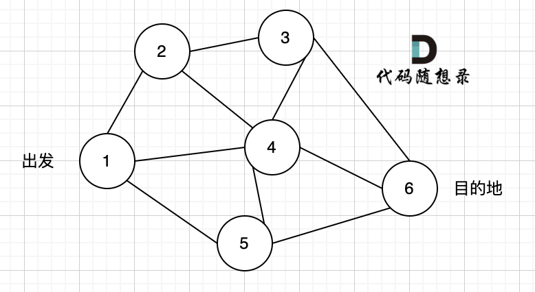

那么dfs搜索的第一条路径是这样的： （假设第一次延默认方向，就找到了节点6），图二

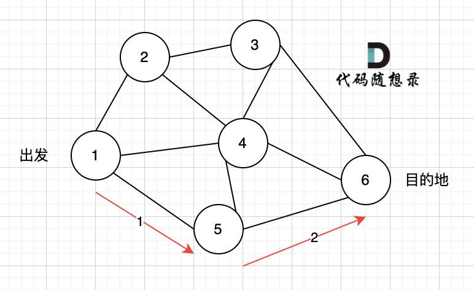

此时我们找到了节点6，（遇到黄河了，应该回头了），那么应该再去搜索其他方向了。 如图三：

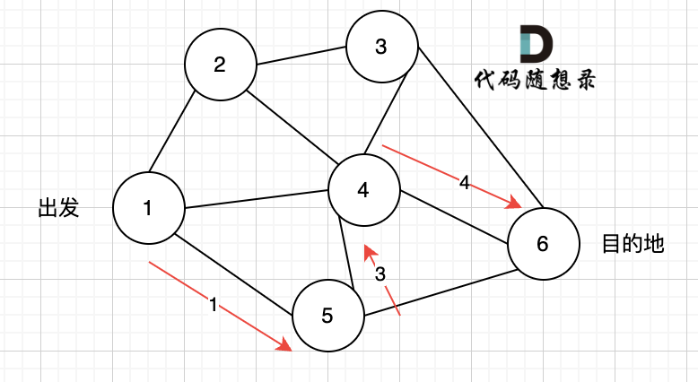

​            路径2撤销了，改变了方向，走路径3（红色线）， 接着也找到终点6。 ==那么撤销路径2，改为路径3，在dfs 中其实就是回溯的过程==

又找到了一条从节点1到节点6的路径，又到黄河了，此时再回头，下图图四中，路径4撤销（回溯的过程），改为路径5。

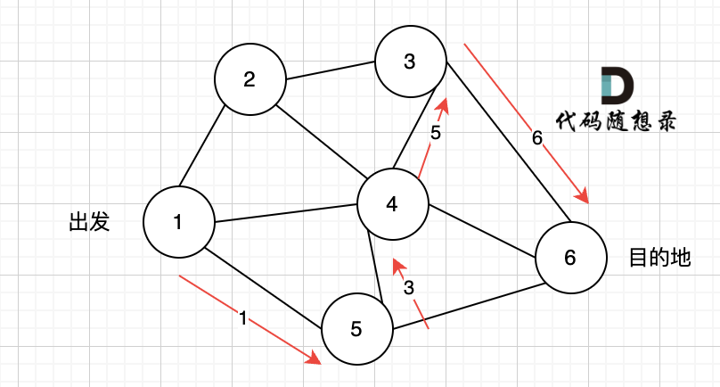


又找到了一条从节点1到节点6的路径，又到黄河了，此时再回头，下图图五，路径6撤销（回溯的过程），改为路径7，路径8 和 路径7，路径9， 结果发现死路一条，都走到了自己走过的节点。

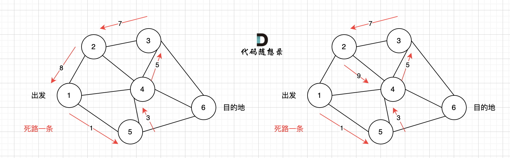

模板:

```c++
vector<vector<int>> result; // 保存符合条件的所有路径
vector<int> path; // 起点到终点的路径
void dfs (图，目前搜索的节点)  
```


```c++
void dfs(参数) 
{
    if (终止条件) 
    {
        存放结果;
        return;
    }

    for (选择：本节点所连接的其他节点)   // 遍历其边与边的关系
    {
        处理节点;
        dfs(图，选择的节点); // 递归
        回溯，撤销处理结果
    }
}
```


#### [797. 所有可能的路径](https://leetcode.cn/problems/all-paths-from-source-to-target/)

给你一个有 n 个节点的 有向无环图（DAG），请你找出所有从节点 0 到节点 n-1 的路径并输出（不要求按特定顺序）

 graph[i] 是一个从节点 i 可以访问的所有节点的列表（即从节点 i 到节点 graph [i] [j]存在一条有向边）。

示例 1：

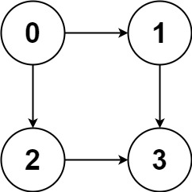

```
输入：graph = [[1,2],[3],[3],[]]
输出：[[0,1,3],[0,2,3]]
解释：有两条路径 0 -> 1 -> 3 和 0 -> 2 -> 3
```


代码

```c++
class Solution 
{
private:
    vector<vector<int>> result; // 收集符合条件的路径
    vector<int> path; // 0节点到终点的路径
    // x：目前遍历的节点
    // graph：存当前的图
    void dfs (vector<vector<int>>& graph, int x) 
    {
        // 要求从节点 0 到节点 n-1 的路径并输出，所以是 graph.size() - 1
        if (x == graph.size() - 1) 
        { // 找到符合条件的一条路径
            result.push_back(path);
            return;
        }
        
        for (int i = 0; i < graph[x].size(); i++)   // 边与边的关系
        { // 遍历节点n链接的所有节点
            path.push_back(graph[x][i]); // 遍历到的节点加入到路径中来
            dfs(graph, graph[x][i]); // 进入下一层递归
            path.pop_back(); // 回溯，撤销本节点
        }
    }
public:
    vector<vector<int>> allPathsSourceTarget(vector<vector<int>>& graph) 
    {
        path.push_back(0);   // 题意: 无论什么路径已经是从0节点出发
        dfs(graph, 0); // 开始遍历
        return result;
    }
};
```


#### [864. 获取所有钥匙的最短路径](https://leetcode.cn/problems/shortest-path-to-get-all-keys/)

看到最短路径很容易想到用 BFS。在普通的 BFS 中，我们会用一个 visited 数组来存储已经遍历过的位置，防止走回头路，使程序进入死循环。但是本题的难点是，我们可以走回头路。也就是说，BFS 中每一个状态不由它的坐标唯一确定。

仔细分析可以发现，只有在拿到一个新的钥匙后，我们才可以走回头路。也就是说 BFS 中的每个状态应该是由它的坐标以及此时所持有的钥匙情况所决定的。想到这一点后，问题就迎刃而解了。

位运算技巧（状态压缩）：我们可以用一个整数 key 来表示持有钥匙的情况。key 的第 i 位二进制数为 1 表示我们已经找到第 i 把钥匙了，为 0 表示没找到。例如：`key = 1010` 表示我们找到了第 2 把和第 4 把钥匙。

```c++
class Solution {
    int dx[4] = {0, 0, -1, 1};
    int dy[4] = {1, -1, 0, 0};
    
    struct State {
        int x;
        int y;
        int key;
    };
    
public:
    int shortestPathAllKeys(vector<string>& grid) {
        int m = grid.size(), n = grid[0].size();
        
        // 先找到起点，以及钥匙的数量
        State start; 
        int keycnt = 0;
        for (int i = 0; i < m; i++) {
            for (int j = 0; j < n; j++) {
                if (grid[i][j] == '@') {
                    start.x = i;
                    start.y = j;
                    start.key = 0;
                }
                if (islower(grid[i][j])) {
                    keycnt++;
                }
            }
        }
        
        // BFS
        queue<State> q;
        q.push(start);
        int allkey = (1 << keycnt) - 1; // 表示所有钥匙都找到的状态
        vector<vector<vector<bool>>> visited(m, vector<vector<bool>>(n, vector<bool>(allkey + 1, false)));
        int step = 0;
        while (!q.empty()) {
            int qSize = q.size();
            for (int i = 0; i < qSize; i++) {
                State cur = q.front();
                q.pop();
                
                // 如果所有钥匙都找到
                if (cur.key == allkey) return step;
                
                // 遍历下一个状态
                for (int k = 0; k < 4; k++) {
                    int x = cur.x + dx[k], y = cur.y + dy[k];
                    if (x < 0 || y < 0 || x >= m || y >= n) continue;
                    
                    char c = grid[x][y];
                    int key = cur.key;
                    
                    if (c == '#') continue;
                    if (isupper(c) && (key >> (c - 'A') & 1) == 0) continue;
                    
                    if (islower(c)) {
                        key |= 1 << (c - 'a');
                    }
                    if (visited[x][y][key] == true) continue;
                    
                    visited[x][y][key] = true; 
                    q.push(State{x, y, key}); 
                } 
            }
            step++;
        }
        return -1;
    }
};
```


##  「岛屿问题」系列问题

### 网格结构的 DFS 遍历方法

**网格问题是由  m×n 个小方格组成一个网格，每个小方格与其上下左右四个方格认为是相邻的，要在这样的网格上进行某种搜索。**

岛屿问题是一类典型的网格问题。每个格子中的数字可能是 0 或者 1。我们把数字为 0 的格子看成海洋格子，数字为 1 的格子看成陆地格子，这样相邻的陆地格子就连接成一个岛屿。


在这样一个设定下，就出现了各种岛屿问题的变种，包括岛屿的数量、面积、周长等。不过这些问题，基本都可以用 DFS 遍历来解决。

**DFS 的基本结构**
网格结构要比二叉树结构稍微复杂一些，它其实是一种简化版的图结构。要写好网格上的 DFS 遍历，我们首先要理解二叉树上的 DFS 遍历方法，再类比写出网格结构上的 DFS 遍历。写的二叉树 DFS 遍历一般是这样的：

```C++
// 先序
class Solution 
{
public:
    void traversal(TreeNode* cur, vector<int>& vec) 
    {
        if (cur == NULL) 
            return;
        vec.push_back(cur->val);     // 􀓾 中
        traversal(cur->left, vec);   // 􀫢 左
        traversal(cur->right, vec);  // 􀝦 右
    }
    
    vector<int> preorderTraversal(TreeNode* root) 
    {
        vector<int> result;
        traversal(root, result);
        return result;
	}
};
```

可以看到，二叉树的 DFS 有两个要素：「访问相邻结点」和「判断 base case」。

第一个要素是**访问相邻结点**。二叉树的相邻结点非常简单，只有左子结点和右子结点两个。二叉树本身就是一个递归定义的结构：一棵二叉树，它的左子树和右子树也是一棵二叉树。那么我们的 DFS 遍历只需要递归调用左子树和右子树即可。

第二个要素是 **判断 base case**。一般来说，二叉树遍历的 base case 是 root == null。这样一个条件判断其实有两个含义：一方面，这表示 root 指向的子树为空，不需要再往下遍历了。另一方面，在 root == null 的时候及时返回，可以让后面的 root.left 和 root.right 操作不会出现空指针异常。

对于网格上的 DFS，我们完全可以参考二叉树的 DFS，写出网格 DFS 的两个要素：

首先，网格结构中的格子有多少相邻结点 -----> 上下左右四个。对于格子 (r, c) 来说（r 和 c 分别代表行坐标和列坐标），四个相邻的格子分别是 (r-1, c)、(r+1, c)、(r, c-1)、(r, c+1)。换句话说，网格结构是「四叉」的。


其次，网格 DFS 中的 base case :     从二叉树的 base case 对应过来，应该是网格中不需要继续遍历、grid[r][c] 会出现数组下标越界异常的格子，也就是那些超出网格范围的格子。


这一点稍微有些反直觉，坐标竟然可以临时超出网格的范围？这种方法我称为「先污染后治理」—— 甭管当前是在哪个格子，先往四个方向走一步再说，如果发现走出了网格范围再赶紧返回。这跟二叉树的遍历方法是一样的，先递归调用，发现 root == null 再返回。

这样，我们得到了**网格 DFS 遍历的框架代码**： 框架代码代表的函数作用就是找岛(将与其链接的陆地都标记上)

```c++
// 处理方格位于网格边缘的情况
void dfs(int grid[][], int r, int c) 
{
    // 若坐标不合法，直接返回
    if (!(0 <= r && r < grid.length && 0 <= c && c < grid[0].length)) 
        return;
    
    // 访问上、下、左、右四个相邻结点
    dfs(grid, r - 1, c);
    dfs(grid, r + 1, c);
    dfs(grid, r, c - 1);
    dfs(grid, r, c + 1);
}
```


如何避免重复遍历
网格结构的 DFS 与二叉树的 DFS 最大的不同之处在于，遍历中可能遇到遍历过的结点。这是因为，网格结构本质上是一个「图」，我们可以把每个格子看成图中的结点，每个结点有向上下左右的四条边。在图中遍历时，自然可能遇到重复遍历结点。

这时候，DFS 可能会不停地「兜圈子」，永远停不下来，如下图所示：


如何避免这样的重复遍历呢？答案是标记已经遍历过的格子。以岛屿问题为例，我们需要在所有值为 1 的陆地格子上做 DFS 遍历。每走过一个陆地格子，就把格子的值改为 2，这样当我们遇到 2 的时候，就知道这是遍历过的格子了。也就是说，每个格子可能取三个值：

0 —— 海洋格子
1 —— 陆地格子（未遍历过）
2 —— 陆地格子（已遍历过）
我们在框架代码中加入避免重复遍历的语句：

```c++
// 标记已遍历过的岛屿，不做重复遍历
void dfs(vector<vector<int>> grid, int r, int c) 
{
    if (!(0 <= r && r < grid.size() && 0 <= c && c < grid[0].size())) 
        return ;
    
    // 已遍历过（值为2）的岛屿在这里会直接返回，不会重复遍历
    if (grid[r][c] != 1) 
        return;
  
    grid[r][c] = 2;   // 将方格标记为"已遍历"
    dfs(grid, r - 1, c); 
    dfs(grid, r + 1, c);
    dfs(grid, r, c - 1);
    dfs(grid, r, c + 1);
}
```


### 岛屿问题的解法

####   105. [岛屿的最大面积](https://leetcode.cn/problems/ZL6zAn/)

给定一个包含了一些 0 和 1 的非空二维数组 grid，一个岛屿是一组相邻的 1（代表陆地），这里的「相邻」要求两个 1 必须在水平或者竖直方向上相邻。你可以假设 grid 的四个边缘都被 0（代表海洋）包围着。

找到给定的二维数组中最大的岛屿面积。如果没有岛屿，则返回面积为 0 。

这道题目只需要**对每个岛屿做 DFS 遍历，**求出每个岛屿的面积就可以了。求岛屿面积的方法也很简单，代码如下，每遍历到一个格子，就把面积加一。

```c++
class Solution 
{
public:
    int maxAreaOfIsland(vector<vector<int>>& grid) 
    {
        int res = 0;
        for (int r = 0; r < grid.size(); r++) 
        {
            for (int c = 0; c < grid[0].size(); c++) 
            {
                if (grid[r][c] == 1) 
                {
                    int a = dfs(grid, r, c);
                    res = max(res, a);
                }
            }
        }
        return res;
    }

    int dfs(vector<vector<int>> &grid, int r, int c)
    {
        if ( r >= grid.size() || c >= grid[0].size() )
            return 0;
        if (grid[r][c] != 1)
            return 0;
        grid[r][c] = 2;

        return 1 + dfs(grid, r - 1, c) 
            + dfs(grid, r + 1, c)
            + dfs(grid, r, c - 1) 
            + dfs(grid, r, c + 1);
    }
};
```


#### [463. 岛屿的周长](https://leetcode-cn.com/problems/island-perimeter/)

 **方法1:**

标准的填水洼式深度搜索

+ ==网格问题是这样一类搜索问题：有 m×n 个小方格，组成一个网格，每个小方格与其上下左右四个方格认为是相邻的，要在这样的网格上进行某种搜索。==

1.如何在网格上做 DFS

首先，每个方格与其上下左右的四个方格相邻，则 DFS 每次要分出四个岔：

```c++
// 基本的 DFS 框架：每次搜索四个相邻方格
void dfs(int grid[][], int r, int c) 
{
    dfs(grid, r - 1, c); // 上边相邻
    dfs(grid, r + 1, c); // 下边相邻
    dfs(grid, r, c - 1); // 左边相邻
    dfs(grid, r, c + 1); // 右边相邻
}
```

对于网格边缘的方格，上下左右并不都有邻居。可以先做递归调用，再在每个 DFS 函数的开头判断坐标是否合法，不合法的直接返回。同样地，我们还需要判断该方格是否有岛屿（值是否为 1），否则也需要返回。

```c++
// 处理方格位于网格边缘的情况
void dfs(int grid[][], int r, int c) 
{
    // 若坐标不合法，直接返回
    if (!(0 <= r && r < grid.length && 0 <= c && c < grid[0].length)) 
        return;
    
    // 若该方格不是岛屿，直接返回
    if (grid[r][c] != 1) 
        return;
    
    dfs(grid, r - 1, c);
    dfs(grid, r + 1, c);
    dfs(grid, r, c - 1);
    dfs(grid, r, c + 1);
}
```

保证方格不进行重复遍历。标记遍历过的方格并不需要使用额外的空间，只需要改变方格中存储的值就可以。在这道题中，值为 0 表示非岛屿（不可遍历），值为 1 表示岛屿（可遍历），就用 2 表示已遍历过的岛屿。

```c++
// 标记已遍历过的岛屿，不做重复遍历
void dfs(int grid[][], int r, int c) 
{
    if (!(0 <= r && r < grid.size() && 0 <= c && c < grid[0].size())) 
        return ;
    // 已遍历过（值为2）的岛屿在这里会直接返回，不会重复遍历
    if (grid[r][c] != 1) 
        return;
  
    grid[r][c] = 2;   // 将方格标记为"已遍历"
    dfs(grid, r - 1, c); 
    dfs(grid, r + 1, c);
    dfs(grid, r, c - 1);
    dfs(grid, r, c + 1);
}
```

**2.如何用DFS求周长**
求岛屿的周长其实有很多种方法，如果用 DFS 遍历来求的话，有一种很简单的思路：岛屿的周长就是岛屿方格和非岛屿方格相邻的边的数量。注意，这里的非岛屿方格，既包括水域方格，也包括网格的边界。我们可以画一张图，看得更清晰：

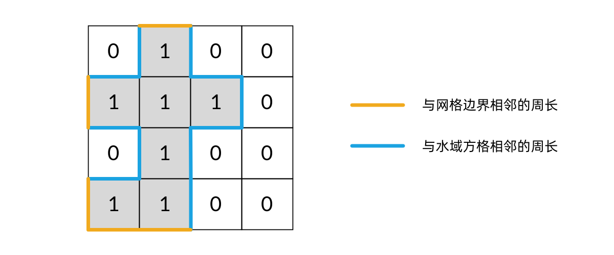

将这个“相邻关系”对应到 DFS 遍历中，就是：每当在 DFS 遍历中，从一个岛屿方格走向一个非岛屿方格，就将周长加 1。代码如下：

```c++
int dfs(vector<vector<int>>& grid, int r, int c) 
{
    // 函数因为「坐标 (r, c) 超出网格范围」返回，对应一条黄色的边
    if (!(0 <= r && r < grid.size() && 0 <= c && c < grid[0].size())) 
        return 1;

    // 函数因为「当前格子是海洋格子」返回，对应一条蓝色的边
    if (grid[r][c] == 0) 
        return 1;
    
    // 函数因为「当前格子是已遍历的陆地格子」返回，和周长没关系
    if (grid[r][c] != 1) 
        return 0;

    grid[r][c] = 2;
    return dfs(grid, r - 1, c)
        + dfs(grid, r + 1, c)
        + dfs(grid, r, c - 1)
        + dfs(grid, r, c + 1);
}
```


最终代码:

```c++
class Solution 
{
public:
    int islandPerimeter(vector<vector<int>>& grid) 
    {
        for (int r = 0; r < grid.size(); r++) 
        {
            for (int c = 0; c < grid[0].size(); c++) 
            {
                if (grid[r][c] == 1) 
                {
                    // 题目限制只有一个岛屿，计算一个即可
                    return dfs(grid, r, c);
                }
            }
        }
        return 0;
    }

private:
    int dfs(vector<vector<int>>& grid, int r, int c) 
    {
        if (!(0 <= r && r < grid.size() && 0 <= c && c < grid[0].size())) 
            return 1;

        if (grid[r][c] == 0) 
            return 1;
        
        if (grid[r][c] != 1) 
            return 0;
        
        grid[r][c] = 2;
        return dfs(grid, r - 1, c)
            + dfs(grid, r + 1, c)
            + dfs(grid, r, c - 1)
            + dfs(grid, r, c + 1);
    }

};
```

方法2:

思路:

双重for循环
判断是陆地 land++；
判断如果右侧/下方是陆地，相邻+1，edge++
计算结果：land*4 - edge*2; 

代码:

```c++
class Solution 
{
public:
    int islandPerimeter(vector<vector<int>>& grid) 
    {
        int land = 0;
        int edge = 0;
        for(int i = 0; i<grid.size(); i++)
        {
            for(int j=0;j<grid[0].size();j++)
            {
                if(grid[i][j] == 1)
                {
                    land++;
                    if(i < grid.size() - 1 && grid[i + 1][j] == 1) 
                        edge++;
                    if(j < grid[0].size()-1 && grid[i][j + 1] == 1) 
                        edge++;
                }
            }
        }
        return land*4 - edge*2;
    }
};
```

#### [200. 岛屿数量](https://leetcode.cn/problems/number-of-islands/)

给你一个由 '1'（陆地）和 '0'（水）组成的的二维网格，请你计算网格中岛屿的数量。

岛屿总是被水包围，并且每座岛屿只能由水平方向和/或竖直方向上相邻的陆地连接形成。

此外，你可以假设该网格的四条边均被水包围。


```c++
class Solution 
{
public:
    int numIslands(vector<vector<char>>& grid) 
    {
        int res = 0;
        for (int r = 0; r < grid.size(); r++) 
        {
            for (int c = 0; c < grid[0].size(); c++) 
            {
                if (grid[r][c] == '1') 
                {
                    res++;            // 遇到没访问过的陆地，+1
                    dfs(grid, r, c);  // 将与其链接的陆地都标记上  
                }
            }
        }
        return res;
    }

    void dfs(vector<vector<char>> &grid, int r, int c)
    {
        if ( r >= grid.size() || c >= grid[0].size() )
            return ;
        if (grid[r][c] != '1')   // 不是陆地
            return;
        grid[r][c] = 2;
        dfs(grid, r - 1, c);
        dfs(grid, r + 1, c);
        dfs(grid, r, c - 1);
        dfs(grid, r, c + 1);
    }
};
```


**网格dfs:**

#### [62. 不同路径](https://leetcode.cn/problems/unique-paths/)

一个机器人位于一个 m x n 网格的左上角 （起始点在下图中标记为 “Start” ）。

机器人每次只能向下或者向右移动一步。机器人试图达到网格的右下角（在下图中标记为 “Finish” ）。

问总共有多少条不同的路径？

**示例 1：**


```
输入：m = 3, n = 7
输出：28
```

代码:

```c++
class Solution 
{
private:
    int dfs(int i, int j, int m, int n)
    {
        if (i >= m || j >= n) 
            return 0; 
        // 找到终点
        if (i == m - 1 && j == n - 1)  
            return 1; 
        
        // 只能向下或者向右移动
        return dfs(i + 1, j, m, n) + dfs(i, j + 1, m, n);
    }

public:
    int uniquePaths(int m, int n)
    {
         // 题目限制从(0, 0)一个位置开始,所以计算一个即可
        return dfs(0, 0, m, n);
    }
};
```

**超时,本题使用dp的方式**

#### [63. 不同路径 II](https://leetcode.cn/problems/unique-paths-ii/)

```c++
class Solution {
public:
    int dfs(vector<vector<int>> &grid, int r, int c)
    {
        if ( r >= grid.size() || c >= grid[0].size() ) 
            return 0; 
        // 障碍物
        if (grid[r][c] == 1)
            return 0;
        // 找到终点
        if (r == grid.size()  -1 && c == grid[0].size() - 1) 
            return 1; 
        // 只能向下或者向右移动
        return dfs(grid, r + 1, c) 
            + dfs(grid, r, c + 1) ;

    }

    int uniquePathsWithObstacles(vector<vector<int>>& obstacleGrid)
    {
        // 题目限制从 一个位置开始,所以计算一个即可
        return dfs(obstacleGrid, 0, 0);
    }
};
```

**超时,本题使用dp的方式**


##  Flood Fill 系列问题

#### [733. 图像渲染](https://leetcode.cn/problems/flood-fill/)

有一幅以 m x n 的二维整数数组表示的图画 image ，其中 image[i][j] 表示该图画的像素值大小。

你也被给予三个整数 sr ,  sc 和 newColor 。你应该从像素 image[sr][sc] 开始对图像进行 上色填充 。

为了完成 上色工作 ，从初始像素开始，记录初始坐标的 上下左右四个方向上 像素值与初始坐标相同的相连像素点，接着再记录这四个方向上符合条件的像素点与他们对应 四个方向上 像素值与初始坐标相同的相连像素点，……，重复该过程。将所有有记录的像素点的颜色值改为 newColor 。

最后返回 经过上色渲染后的图像 。


Flood Fill这类题型一般都可以使用DFS，BFS和并查集来解决。在这里我们先来分析每种算法解决它的思路，最后再做一个小小的总结。

**深度优先搜索**
从开始位置(sr, sc)出发，依次向它的四个方向进行搜索，搜索之前要先把当前像素点的颜色改为newColor。

```c++
image[r][c] = newColor;

//上右下左
int vx[] = {0, 0, 1, -1};
int vy[] = {1, -1, 0, 0};

// 4个方向
for (int i = 0; i < 4; i++) 
{
    int newr = r + vy[i];
    int newc = c + vx[i];
    dfs(image, newr, newc, newColor, color);
}
```

这样一直搜索下去肯定不行， 要注意 DFS 的结束条件：

**当位置（行或列）超过数组的边界时，要结束递归。**

```c++
// 若坐标不合法，直接返回
if (r >= image.size() || c >= image[0].size()) {
    return;
}
```

**如果当前位置的颜色值和开始位置(sr, sc)的颜色值不同时，我们不能修改它的颜色值**，要结束递归。

```c++
if (image[r][c] != color) 
{
    return;  
}
```

还有一点要注意的是，当要修改的目标颜色值newColor和开始位置的颜色值image[sr, sc]相同时，我们不需要对image做任何改变，原image就是最终的image.

```c++
//当要修改的目标颜色值newColor和开始位置的颜色值image[sr, sc]相同时, 则无需修改
int color = image[sr][sc];
if (color == newColor) 
{
    return image;
}
```


代码::

```c++
class Solution {
public:
    vector<vector<int>> floodFill(vector<vector<int>>& image, int sr, int sc, int newColor) 
    {
        int color = image[sr][sc];
        if (color == newColor) 
        {
            return image;
        }
        dfs(image, sr, sc, newColor, color);
        return image;
    }

    void dfs(vector<vector<int>>& image, int r, int c, int newColor, int color) 
    {
        if (r >= image.size() || c >= image[0].size()) 
        {
            return;
        }
        
        if (image[r][c] != color) 
        {   
            return;
        }
        
        image[r][c] = newColor;
        int vx[] = {0, 0, 1, -1};
        int vy[] = {1, -1, 0, 0};
        for (int i = 0; i < 4; i++) 
        {
            int newr = r + vy[i];
            int newc = c + vx[i];
            dfs(image, newr, newc, newColor, color);
        }
    }
};
```

**广度优先搜索**

+ BFS 就是一层一层的往外边搜索边扩张，使用队列来实现。

+ 一开始先把开始位置(sr, sc)加入队列，并且修改它的颜色值：

```c++
queue<vector<int>> q;
q.push({sr, sc});
image[sr][sc] = newColor;
```

+ 然后队首元素出队列，同时把它上下左右四个方向颜色值为color的位置加入到队尾，并修改它们的颜色值为newColor。

+ 重复操作，直到队列为空。

```c++
int vx[] = {0, 0, 1, -1};
int vy[] = {1, -1, 0, 0};
while (!q.empty()) {
    vector<int> pos = q.front();
    q.pop();
    // 标注1
    // image[pos[0]][pos[1]] = newColor;
    for (int i = 0; i < 4; i++) {
        int r = pos[0]+vy[i];
        int c = pos[1]+vx[i];
        if (r >= image.size() || c >= image[0].size()) {
            continue;
        }
        if (image[r][c] == color) {
            // 标注2
            image[r][c] = newColor;
            q.push({r, c});
        }
    }
}
```


注意
这里特别要提醒的是，一定要在添加到队尾的同时修改颜色值，不要在出队列时再修改颜色值。

也就是说修改颜色的代码，要放在标注2处，不能放在标注1处。

解释
如果等到出队列时再修改颜色值，那对于已经添加到队列中的像素点，虽然他们已经在队列中，但颜色并未及时修改。如果此时出队列的像素点正好位于某个已经在队列中的像素点旁边，那这个已经在队列中的像素点，就会被重复添加到队尾了。

轻则导致耗时增加，严重的话会出现提交超时错误。

```c++
class Solution {
public:
    vector<vector<int>> floodFill(vector<vector<int>>& image, int sr, int sc, int newColor) {
        int color = image[sr][sc];
        if (color == newColor) {
            return image;
        }
        queue<vector<int>> q;
        q.push({sr, sc});
        image[sr][sc] = newColor;
        int vx[] = {0, 0, 1, -1};
        int vy[] = {1, -1, 0, 0};
        while (!q.empty()) {
            vector<int> pos = q.front();
            q.pop();
            for (int i = 0; i < 4; i++) {
                int r = pos[0]+vy[i];
                int c = pos[1]+vx[i];
                if (r >= image.size() || c >= image[0].size()) {
                    continue;
                }
                if (image[r][c] == color) {
                    image[r][c] = newColor;
                    q.push({r, c});
                }
            }
        }
        return image;
    }
};
```


并查集
我们先来看一下 Flood Fill 的定义：漫水填充法是一种用特定的颜色填充连通区域，通过设置可连通像素的上下限以及连通方式来达到不同的填充效果的方法。

定义中多次提到连通，而并查集就是用来解决动态连通性问题的！

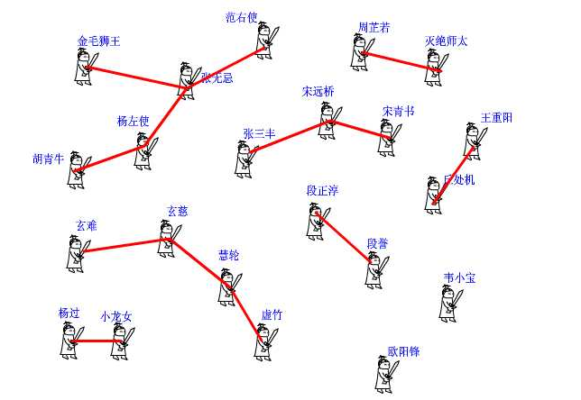

假设开始位置(sr, sc)的颜色为color。
我们可以使用并查集把颜色值为color并且位置相邻的像素点连通起来，形成一个连通集合。
颜色值不是color的每个像素点，单独作为一个集合。
例如下面这种情况（圈起来的是开始位置），使用并查集就把它分成了 4 个连通集合。这时我们只需要把所有和开始位置(sr, sc)在同一个集合的像素点的颜色改为newColor就行了。

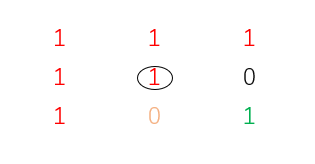


怎么把它们分成若干个集合呢？

我们从(0, 0)位置开始依次遍历，这时就不需要同时兼顾上下左右四个方向了，只需要看看它右边和下面的像素点颜色是不是和我一样都为color，一样就合并。
不一样就不管它，让它自己单独作为一个集合。

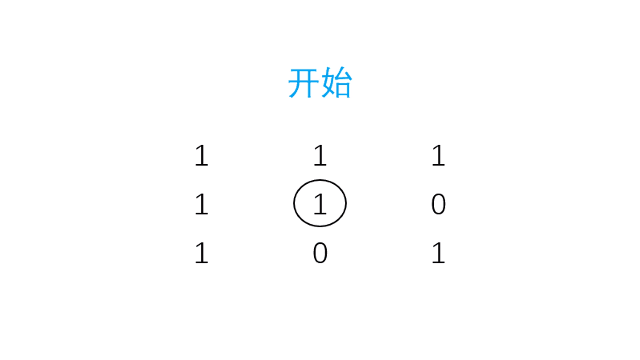


提示，这里每个像素点的位置是二维坐标(row, col)，为了方便我们需要将它们的位置映射为一维形式:row * colNum + col。row表示行坐标，col表示列坐标，colNum表示数组的列数。

```c++
for (int i = 0; i < rowNum; i++) {
    for (int j = 0; j < colNum; j++) {
        if (image[i][j] != color) {
            continue;
        }
        int right = j+1;
        int down = i+1;
        if (right < colNum && image[i][right] == color) {
            u.unio(i*colNum+j, i*colNum+right);
        }
        if (down < rowNum && image[down][j] == color) {
            u.unio(i*colNum+j, (down)*colNum+j);
        }
    }
}
那么接下来我们就只需要把和开始位置(sr, sc)在同一个连通集合的像素点颜色值置为newColor就行了。

for (int i = 0; i < rowNum; i++) {
    for (int j = 0; j < colNum; j++) {
        if (u.connected(i*colNum+j, sr*colNum+sc)) {
            image[i][j] = newColor;
        }
    }
}
```

总结

+ 通过上面这道题的分析，我们可以总结出漫水填充算法题型有着这样的特征：空间都是按区域划分的，并且每个区域中的元素都是相邻的。

+ 为了扩大它的解题范围，我们可以再进一步抽象，把一个个区域抽象为一个个集合，集合中的元素都存在着某种逻辑上的连通性。最典型的就是547. 朋友圈。

Flood Fill 这类题还有很多：

1020. [1020. 飞地的数量](https://leetcode-cn.com/problems/number-of-enclaves/)
1021. [1254. 统计封闭岛屿的数目](https://leetcode-cn.com/problems/number-of-closed-islands/)
1022. [547. 朋友圈](https://leetcode-cn.com/problems/friend-circles/)

如果使用DFS或BFS的话，解决它们的步骤无非就是遍历、标记 加 计数。

如果抽象为集合的话，我们就可以使用并查集对它们进行集合划分，最后只需要对目标集合中的元素进行操作就可以了。

并查集

```c++
class UnionFind {
private:
    int* parent;

public:
    UnionFind(){}
    UnionFind(int n) {
        parent = new int[n];
        for (int i = 0; i < n; i++) {
            parent[i] = i;
        }
    }
    int find(int x) {
        while (x != parent[x]) {
            parent[x] = parent[parent[x]];
            x = parent[x];
        }
        return x;
    }
    void unio(int x, int y) {
        x = find(x);
        y = find(y);
        if (x == y) {
            return;
        }
        parent[y] = x;
    }

    bool connected(int x, int y) {
        return find(x) == find(y);
    }

};

class Solution {
public:
    vector<vector<int>> floodFill(vector<vector<int>>& image, int sr, int sc, int newColor) {
        int color = image[sr][sc];
        if (color == newColor) {
            return image;
        }
        int rowNum = image.size();
        int colNum = image[0].size();
        UnionFind u(rowNum * colNum);
        for (int i = 0; i < rowNum; i++) {
            for (int j = 0; j < colNum; j++) {
                if (image[i][j] != color) {
                    continue;
                }
                int right = j+1;
                int down = i+1;
                if (right < colNum && image[i][right] == color) {
                    u.unio(i*colNum+j, i*colNum+right);
                }
                if (down < rowNum && image[down][j] == color) {
                    u.unio(i*colNum+j, (down)*colNum+j);
                }
            }
        }
        for (int i = 0; i < rowNum; i++) {
            for (int j = 0; j < colNum; j++) {
                if (u.connected(i*colNum+j, sr*colNum+sc)) {
                    image[i][j] = newColor;
                }
            }
        }
        return image;
    }
};
```


### [997. 找到小镇的法官](https://leetcode.cn/problems/find-the-town-judge/)

1.如果存在法官，那么所有人都会信任法官，在结合条件1，可以得出信任法官的人数为n-1。
2.如果不存在法官，那么也可能存在某些人被所有人信任，这个人的信任人数也为n-1，但是他也会信任别人。
3.可以以此作为区分other和juage的条件，假设每个人都有信任值，那么定义一个数组长度为n，用来存放n个人的信任值:

1) 如果一个人信任了别人，那么将这个人的信任值-1
2) 如果一个人被别人信任，那么这个人的信任值＋1 

当一个人被所有人信任，并且他没有信任其它人时，这个人的信任值就是n- 1，那么此人就是法官。
当一个人被所有人信任，但是他也信任了其他人时，这个人的信任值<n - 1。
其它情况下，每个人的信任值都会小于n -1。

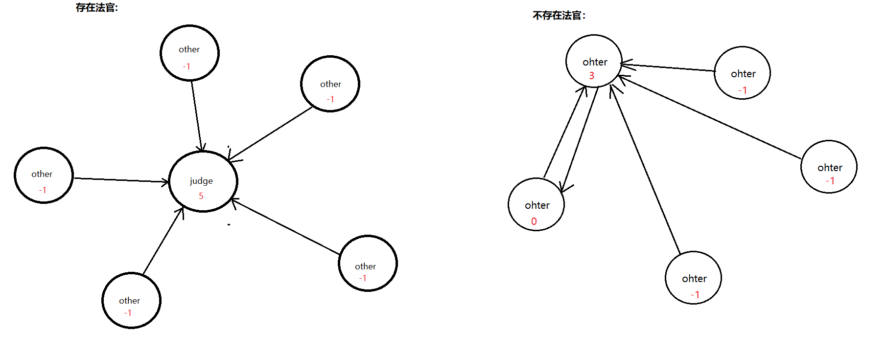

```c++
class Solution 
{
public:
    int findJudge(int n, vector<vector<int>>& trust) 
    {
        // 定义数组用于存放每个人的信任值
       vector<int> trustValues(n + 1, 0); 
        
        // 遍历trust数组计算每个人的信任值
        for(auto t : trust)
        {
            trustValues[t[0]]--;
            trustValues[t[1]]++;
        }

        // 遍历这n个人的信任值，如果存在 n - 1，则返回这个人的编号
        for(int i = 1; i <= n;i++)
        {
            if( trustValues[i] == n - 1 ) 
                return i;
        }
        return -1;

    }
};
```
