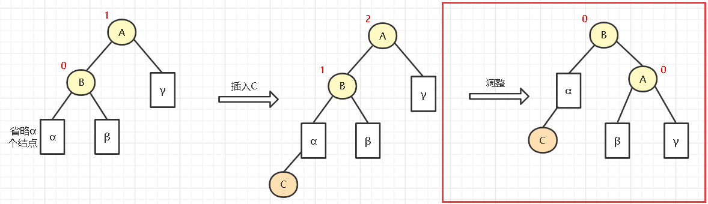
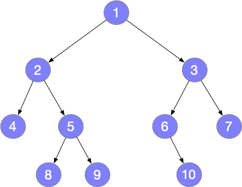
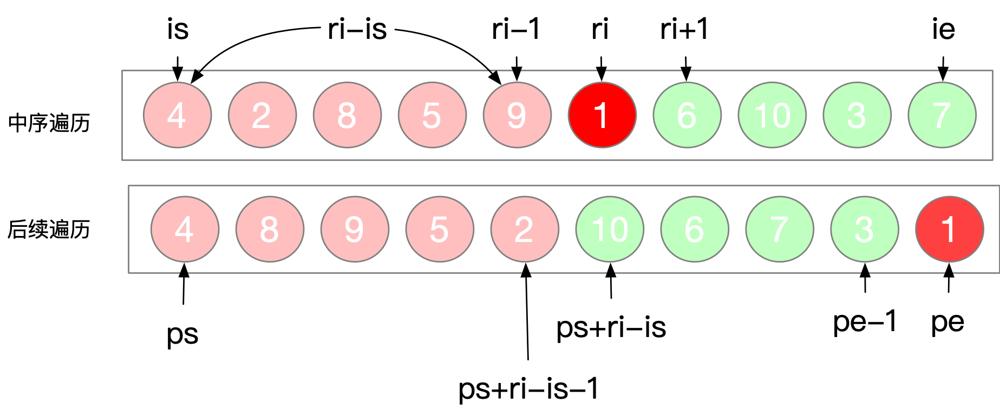

树和森林

**树:** 

**树的定义是递归的,  可以无限套娃！**每次拿到的都可以认为是根

树（Tree）是一种非线性的数据结构。

树是n（n≥0）个节点的有限集。n=0时，称为空树。

树由**唯一的根**和若干棵互不相交的**子树**组成。


 **森林:**

由树组成森林, 其定义是：**若干棵互不相交的树的集合**。


# 二叉树的种类

## 满⼆叉树

满⼆叉树：如果⼀棵⼆叉树只有度为0的结点和度为2的结点，并且度为0的结点在同⼀层上，则这棵⼆叉树为满⼆叉树。

如图所示：  这棵⼆叉树为满⼆叉树，也可以说深度为k，有2^k-1个节点的⼆叉树。


## 完全⼆叉树

完全二叉树的叶子结点只能出现在最下层和次下层，且最下层的叶子结点从左到右连续，前K-1层是满的二叉树。


## ⼆叉搜索树

⼆叉搜索树是有数值的了，⼆叉搜索树是⼀个有序树。

+ 若它的左⼦树不空，则左⼦树上所有结点的值均⼩于它的根结点的值；
+ 若它的右⼦树不空，则右⼦树上所有结点的值均⼤于它的根结点的值；
+ 它的左、右⼦树也分别为⼆叉排序树

如图所示：


## 平衡⼆叉搜索树

称为 AVL（Adelson-Velsky and Landis）树，且具有以下性质：它是⼀棵空树或它的左右两个⼦树的⾼度差的绝对值不超过1，并且左右两个⼦树都是⼀棵平衡⼆叉树。
如图所示:	


C++中map、set、multimap，multiset的底层实现都是平衡⼆叉搜索树，所以map、set的增删操作时间时间复杂度是logn

# 二叉树的存储方式

⼆叉树可以链式存储(指针)，也可以顺序存储(数组)。

链式存储的⽅式如图：


顺序存储的⽅式如图：


数组来存储⼆叉树的遍历:	如果⽗节点的数组下表是i，那么它的左孩⼦就是i * 2 + 1，右孩⼦就是 i * 2 + 2。

# 二叉树高度和深度

+ 深度和高度都是从0开始算(或者从1开始算)

  + 区别:

    + 计算就是看层数：
      如果根结点第0，层数 =  深度	=	高度 - 1
      如果根结点第1，层数	=	深度	=	高度

      如图所示：

    + 

**深度是从根节点数到它的叶节点；**
**高度是从叶节点数到它的根节点；**
注意： 树的深度和高度一样，但是具体到树的某个节点，其深度和高度不一样。

如图：树的高度和深度都为4(看层数;


##  二叉树深度/叶子数 /节点数/度

**二叉树深度:**

```c++
int maxDepth(TreeNode* root) 
    {
        if (root == NULL) 
            return 0;
        return 1 + max(maxDepth(root->left), maxDepth(root->right));
    }
```

```c++
unsigned int depth(struct BinTree_node *tree)
{
	unsigned int l_depth;
	unsigned int r_depth;

	if(tree == NULL)
		return 0;
	else
	{
		l_depth = depth(tree->ltree); //一层一层的递归调用 计算左子树的深度
		r_depth = depth(tree->rtree); //

		return (l_depth > r_depth) ? (l_depth + 1) : (r_depth + 1);  //条件表达式
	}
}
```

**叶子数:**

```c++
unsigned int leaf_num(struct BinTree_node *tree)
{
	if(tree == NULL)   // 二叉树为空
		return 0;
	else if((tree->ltree == NULL) && (tree->rtree == NULL)) // 只有根节点  左右子树为空
		return 1;
	else
		return leaf_num(tree->ltree) + leaf_num(tree->rtree);  //有左右子树 则 左子树 + 右子树
}

```

**节点数:**

```c++
unsigned int node_num(struct BinTree_node *tree)
{
	if(tree == NULL)
		return 0;
	else
		return node_num(tree->ltree) + node_num(tree->rtree) + 1; //有左右子树 则 左子树 + 右子树 + 根节点
}
```

**度:**

```c++
#include <iostream>
using namespace std;

struct Node
{
	int data;
	Node* left;
	Node* right;
	Node(int data) : data(data) { left = NULL; right = NULL; }
};

void create(Node*& root, int data)  //创建树  // 和创建链表差不多
{
	//创建一个节点(树和链表就是节点组成的)
	Node* node = new Node(data);

	//判断树是不是空树
	if (root == NULL)
	{
		root = node;
	}

	else if (data > root->data)
	{
		insert(root->right, data);
	}
	else
	{
		insert(root->left, data);
	}
}

void infix_order(Node* root)
{
	if (root)
	{
		infix_order(root->left);
		printf("%d ", root->data);
		infix_order(root->right);
	}
}

int NodeNumber_0(Node* pRoot)
{
	int i = 0;
	if (pRoot)
	{
		if (pRoot->left == NULL && pRoot->right == NULL)
		{
			i = 1;
		}
		else
		{
			i = NodeNumber_0(pRoot->left) + NodeNumber_0(pRoot->right);
		}
	}
	return i;
}
int NodeNumber_1(Node* pRoot)
{
	int i = 0;
	if (pRoot)
	{
		if ((pRoot->left == NULL && pRoot->right != NULL) || (pRoot->left != NULL && pRoot->right == NULL))
		{
			i = 1 + NodeNumber_1(pRoot->left) + NodeNumber_1(pRoot->right);
		}
		else
		{
			i = NodeNumber_1(pRoot->left) + NodeNumber_1(pRoot->right);
		}
	}
	return i;
}
int NodeNumber_2(Node* pRoot)
{
	int i = 0;
	if (pRoot)
	{
		if ((pRoot->left != NULL) && (pRoot->right != NULL))
		{
			i = 1 + NodeNumber_2(pRoot->left) + NodeNumber_2(pRoot->right);
		}
		else
		{
			i = NodeNumber_2(pRoot->left) + NodeNumber_2(pRoot->right);
		}
	}
	return i;
}

int main(void)
{
	Node* root = NULL;
	for (int i = 0; i < 10; i++)
	{
		insert(root, i);
	}
	printf("创建的是二叉搜索树(中序遍历结果): ");
	infix_order(root);
	printf("\n");

	printf("度为0的节点: %d\n", NodeNumber_0(root));   //度为0的节点
	printf("度为1的节点: %d\n", NodeNumber_1(root));   //度为1的节点
	printf("度为2的节点: %d\n", NodeNumber_2(root));   //度为2的节点
	return 0;
}
```


# 常见树的定义

## ⼆叉树的定义

C++代码如下：

```c++
struct TreeNode 
{
    int val;
    TreeNode *left;
    TreeNode *right;
    TreeNode(int x) : val(x), left(NULL), right(NULL) {}
};
```

C代码如下：

```c++
typedef int T;
typedef struct TreeNode 
{
	T val;
    struct TreeNode *left;
    struct TreeNode *right;

}TreeNode ;
```

## N叉树的定义

C++代码如下：

```c++
struct TreeNode 
{
    int val;
    TreeNode *Parent;           
    vector<TreeNode*> children; 
};
```

C代码如下：

```c++
typedef int T;
typedef struct TreeNode {
    T val;                       // 数据
    TreeNode *Parent;            // 父指针节点
    vector<TreeNode*> children;  // 孩子指针节点(数组)
} TreeNode;
```

# 树的创建

## 二叉树创建

### **问询法**

一般不用就不写了

### **补空法**

首先把二叉树的为空的地方写成#


```c++
#include <stdio.h>
#include <malloc.h>

typedef char BTData;

typedef struct tree
{
	BTData data;
	struct tree* left;
	struct tree* right;

}tree;

// 补空法
tree* create()
{
	char val;
	tree* myTree;
	scanf_s("%c", &val);
	if (val == '#')
	{
		myTree = NULL;
	}
	else
	{
		myTree = malloc(sizeof(struct tree));   // 树节点
		if (myTree != NULL)
		{
			myTree->data = val;
			myTree->left = create();
			myTree->right = create();
		}
	}
	return myTree;
}

void pre_order(tree* tree)
{
	if (tree)
	{
		printf("%c ", tree->data);
		pre_order(tree->left);
		pre_order(tree->right);
	}
}

int main(void)
{
	tree* tree;
	tree = create();
	pre_order(tree);
	while (1);
	return 0;
}
```

**凹入表打印树结构:**

```c++
//凹入表打印树结构
void printHelp(tree* p, string ss)
{
	if (p == NULL)
		return;
	ss += "   ";
	printHelp(p->right, ss);
	cout << ss << p->data << endl;
	printHelp(p->left, ss);
}

int main(void)
{
	cout << "请输入树: ";
	tree* root = insert();
	printHelp(root, " ");
	return 0;
}
```


## 二叉搜索树创建

```c++
#include <stdio.h>
#include <malloc.h>
#include <cstdlib>
#include <stdio.h>

typedef char BTData;
typedef struct node
{ //树的结点
    int data;
    struct node* left;
    struct node* right;
} Node;

// 这样写主要是好看 
typedef struct
{ 
    Node* root;  // 指向根节点的指针//树根

} Tree;

void create(Node* &root, int data)  //创建树  // 和创建链表差不多
{
    //创建一个节点(树和链表就是节点组成的)
    Node* node = (Node*)malloc(sizeof(Node));
    node->data = data;
    node->left = NULL;
    node->right = NULL;

    //判断树是不是空树
    if (root == NULL)
    {
        root = node;
    }

    else if (data > root->data)
    {
        insert(root->right, data);
    }
    else
    {
        insert(root->left, data);
    }
}
```

##  N叉树创建

```c++
#include <iostream>
#include <vector>
using namespace std;
#ifndef DBM_MTREE_H
#define DBM_MTREE_H

typedef int T;
typedef struct MNode {
    T element;                // 数据
    MNode *Parent;            // 父指针节点
    vector<MNode*> children;  // 孩子指针节点(数组)
} MNode;

class MTree {
private:
    MNode *root;
public:
    void init(MNode *root);
    void putChild(MNode* node,MNode* parent);
    void putChildren(vector<MNode*> nodes, MNode *parent);
    void tranversal(MNode *root);
    void tranversal();
    int getMaxDepth(MNode *root,vector<MNode*> nodes);
};
    
//放入大根节点
void MTree::init(MNode *root)
{
    this->root = root;     // 设置好根
}

// 插入
void MTree::Create(MNode *node, MNode *parent) 
{
    parent->children.push_back(node);
    node->Parent = parent;          // 设置当前孩子的父节点
}

void MTree::putChildren(vector<MNode *> nodes, MNode *parent) 
{
    for (int i = 0; i < nodes.size(); ++i) 
    {
        putChild(nodes[i], parent);
    }
}

// 遍历
void MTree::tranversal() 
{
    this->tranversal(this->root);
}

void MTree::tranversal(MNode *root) 
{
    vector<MNode *> nodes = root->children;
    for (int i = 0; i < nodes.size(); ++i) 
    {
        if (nodes[i]->children.size() > 0)
            tranversal(nodes[i]);
        else
            cout << nodes[i]->element << ",";
    }
    cout << root->element << ",";
}

int MTree::getMaxDepth(MNode *root,vector<MNode*> nodes) 
{
    auto iResult = 0;

    return iResult;
}
```

## 平衡二叉树创建

AVL树(平衡二叉树)概念:

- 左子树和右子树的高度之差的**绝对值小于等于1**

- **左子树和右子树也是平衡二叉树**

- **节点:  比普通的二叉树增加了高度属性**(方便判断平衡)

- 树的目的:  搜索效率比其他数据结构更高

  

引入**平衡因子**（BF）的概念 : 

+ [平衡因子](https://so.csdn.net/so/search?q=平衡因子&spm=1001.2101.3001.7020)  =     **结点**左子树的高度  -   **结点**右子树的高度。

**当所有结点的平衡因子只能是-1、0、1，时才是一个平衡二叉树**


**失衡的概念 :** 

+ 在出现不平衡的时候(插入删除操作进行的时候)，**旋转! ! !**

新插入一个节点出现不平衡的情况:

+ 失衡(不平衡)的四种情况:
+ 

**LL型调整**

如下，在实际情况中，调整的内容可能看起来更复杂，如下方块的表示省略了n个结点，调整的方式如下(右旋)：



步骤为：

- B结点和它的右子树(β和新添加的C结点)一起上升
- A结点变为B结点的左子树
- 原来B的左子树α变为A的右子树


**LR型调整**

LR型的跳转如下(左旋再右旋)：


- 首先让B和它的子树(除了C)左旋至C的左子树，把C为根的树接入A的左子树
- 然后让A右旋，成为C的右子树 


**注意: 根节点要全局和局部的概念**


----------------------------

思路:    [链接:](https://www.processon.com/view/link/635a81011efad41bb43a60fd)

```c++
#pragma once

template <class T>
struct TreeNode
{
	T        data;    // 数据
	TreeNode* pLeft;   // 左孩子
	TreeNode* pRight;  // 右孩子
	int      height;  // 高度

	TreeNode(const T& data) : data(data)  // 为了方便使用构造器
	{
		pLeft = pRight = NULL;
		height = 0;
	}
};


template <class T>
class AVLTree
{
private:
	TreeNode<T>* pRoot;  // 指向根节点的指针
	void _insertNodeToTree(TreeNode<T>*& root, const T& data);  // & root目的是为了修改它 // 私有的函前面用_标记是私有的
	int _getHeight(TreeNode<T>* pRoot);

	//右旋对应1 
	TreeNode<T>* RR(TreeNode<T>* root);
	//左旋对应2 
	TreeNode<T>* LL(TreeNode<T>* root);
	//左右旋对应3
	TreeNode<T>* LR(TreeNode<T>* root);
	//右左旋对应4
	TreeNode<T>* RL(TreeNode<T>* root);

public:
	AVLTree() { pRoot = NULL; }
	~AVLTree() {}

	void insert(const T& data);

};


template <class T>
void AVLTree<T>::insert(const T& data)
{
	_insertNodeToTree(pRoot, data);  // 看似对此一举是为了安全
}

template <class T>
void AVLTree<T>::_insertNodeToTree(TreeNode<T>*& root, const T& data)
{
	//作为一颗平衡二叉树，先是一颗有序二叉树
	// 1. 以有序二叉树方式插入
	if (root == NULL)
	{
		root = new TreeNode<T>(data);    // 这里的本质用新的节点替换NULL  // 插入
	}


	// 递归:  (本质就是把复杂的问题变简单,抓住函数的作用,比如这里的_insertNodeToTree:就是往一颗树里面插入一个节点,莫去想其他的)
	else if (data > root->data)
	{
		_insertNodeToTree(root->pRight, data);   // 递归调用,传进去的是root->PRight, 所以pRoot是永远指向最出的根节点

		// 2. 检查是否需要旋转，需要就旋转(是根据之前的左右子树高度判断的)
		if (_getHeight(root->pRight) - _getHeight(root->pLeft) > 1)
		{ // 2.1 右边比左边高
			// 2.2 判断是那种不平衡   2或4
			if (data > root->pRight->data)  // 看不平衡的图
			{// 2
				printf("左旋\n");
				root = LL(root);  // 以root为轴左旋
			}
			else
			{// 4
				printf("右左旋\n");
				root = RL(root);
			}
		};
	}
	else
	{
		_insertNodeToTree(root->pLeft, data);

		// 2. 检查是否需要旋转，需要就旋转(是根据之前的左右子树高度判断的)
		if (_getHeight(root->pLeft) - _getHeight(root->pRight) > 1)
		{// 2.1 左边比右边高
			// 2.2 判断是那种不平衡 1和3
			if (data < root->pLeft->data)
			{// 1
				printf("右旋\n");
				root = RR(root);   // 以root为轴右旋 然后 返回值赋值给root修改根节点
			}
			else
			{// 3
				printf("左右旋\n");
				root = LR(root);
			}
		}
	}

	// 3. 每插入一个节点,设置高度9(这里根结点第1，所以层数=深度=高度)
	int lH = _getHeight(root->pLeft);
	int RH = _getHeight(root->pRight);
	root->height = lH > RH ? (lH + 1) : (RH + 1);
	printf("当前节点的高度%d", root->height);
}

// 得到高度
template<class T>
inline int AVLTree<T>::_getHeight(TreeNode<T>* pRoot)
{
	if (pRoot)
		return pRoot->height;
	return 0;
}

//右旋
template<class T>
inline TreeNode<T>* AVLTree<T>::RR(TreeNode<T>* root)
{
	//1. pTemp记录root的左孩子
	TreeNode<T>* pTemp = root->pLeft;

	//2. pTemp的右孩子成为root的左孩子
	root->pLeft = pTemp->pRight;

	//3. root成为pTemp的右孩子
	pTemp->pRight = root;

	//4. 重新设置高度
	int lH = _getHeight(root->pLeft);
	int RH = _getHeight(root->pRight);
	root->height = lH > RH ? (lH + 1) : (RH + 1);

	//5. pTemp返回回去
	return pTemp;
}

// 左旋
template<class T>
inline TreeNode<T>* AVLTree<T>::LL(TreeNode<T>* root)
{
	//1. pTemp记录root的右孩子
	TreeNode<T>* pTemp = root->pRight;

	//2. pTemp的左孩子成为root的右孩子
	root->pRight = pTemp->pLeft;

	//3. root成为pTemp的左孩子
	pTemp->pLeft = root;

	//4. 重新设置高度
	int lH = _getHeight(root->pLeft);
	int RH = _getHeight(root->pRight);
	root->height = lH > RH ? (lH + 1) : (RH + 1);

	//5. pTemp返回回去
	return pTemp;
}

//左右旋
template<class T>
inline TreeNode<T>* AVLTree<T>::LR(TreeNode<T>* root)
{
	root->pLeft = LL(root->pLeft);  // 先以root的左孩子为轴左旋
	return RR(root); // 再以root为轴右旋
}

//右左旋
template<class T>
inline TreeNode<T>* AVLTree<T>::RL(TreeNode<T>* root)
{
	root->pLeft = RR(root->pLeft);  // 先以root的右孩子为轴右旋
	return LL(root); // 再以root为轴左旋
}
```

```c++
#include <iostream>
#include "AVLTree.h"

int main(void)
{
	AVLTree<int> tree;
	tree.insert(10);
	tree.insert(88);
	tree.insert(4);
	tree.insert(33);
	tree.insert(666);
	tree.insert(999);

	while (1);
	return 0;
}
```


## 23树创建


```c++
#pragma once
#include <cstring>

template <class T>
class MyTwoThreeTree
{
	// 内部类
	struct Node
	{
		int    count;          // 标记当前是2节点(1)还是3节点(2)还是4节点(3)
		T      data[3];        // 数据  // 2节点, 3节点 , 4节点
		Node* pArray[4];       // 节点指针

		Node()
		{
			count = 0;
			memset(data, 0, sizeof(T) * 3);
			memset(pArray, 0, sizeof(Node*) * 4);
		}
	};

	Node* pRoot;  // 指向根节点的指针变量
public:
	//// 防止内存泄露
	//static int newTimes;
	//static int deleteTimes; 

public:
	// 构造器
	MyTwoThreeTree()
	{
		pRoot = NULL;
	}
	// 析构
	~MyTwoThreeTree()
	{
		_clear();
	}

	void insertNode(const T& data);  // 插入
private:
	void _clear();
	void _clear(Node* pDel);
	void _insertNode(Node* node, Node* pParent, const T& data);
};

template<class T>
inline void MyTwoThreeTree<T>::insertNode(const T& data)
{
	if (pRoot)  // pRoot不为空
	{
		_insertNode(pRoot, NULL, data);
	}
	else
	{ // 第一个节点是不一样的
		pRoot = new Node;
		pRoot->count = 1;
		pRoot->data[0] = data;
	}
}

template<class T>
inline void MyTwoThreeTree<T>::_insertNode(Node* node, Node* pParent, const T& data)
{
	if (0 == node->count)  // 当前节点为空
	{
		node->data[0] = data;
		node->count++;
		return;
	}
	if (1 == node->count)  // 2节点
	{
		if (data > node->data[0])  //往右边添加
		{
			if (node->pArray[0]) // 有孩子
			{
				_insertNode(node->pArray[1], node, data);
			}
			else  // 没有孩子
			{     // 往当前孩子添加
				node->data[1] = data;
				node->count++;

			}
		}
		else    //往左边添加
		{
			if (node->pArray[0]) // 有孩子
			{
				_insertNode(node->pArray[0], node, data);

			}
			else // 没有孩子
			{
				node->data[1] = node->data[0];   // 本来左边的放到右边
				node->data[0] = data;
				node->count++;
			}
		}
	}
	else // 3节点
	{
		if (data < node->data[0])  //往最左边插入
		{
			if (node->pArray[0]) // 有孩子
			{
				_insertNode(node->pArray[0], node, data);

			}
			else // 没有孩子
			{
				node->data[2] = node->data[1];   // 本来中间的放到右边
				node->data[1] = node->data[0];   // 本来左边的放到中间
				node->data[0] = data;
				node->count++;
			}
		}
		else if (data < node->data[1]) // 往中间插入
		{
			if (node->pArray[1]) // 有孩子
			{
				_insertNode(node->pArray[1], node, data);

			}
			else // 没有孩子
			{
				node->data[2] = node->data[1];   // 本来中间的放到右边
				node->data[1] = data;
				node->count++;
			}
		}
		else // 往右边插入
		{
			if (node->pArray[2]) // 有孩子
			{
				_insertNode(node->pArray[2], node, data);

			}
			else // 没有孩子
			{
				node->data[2] = data;
				node->count++;
			}

		}
	}

	// 4节点
	if (3 == node->count)
	{

		//1. 创建两个新节点
		Node* node1 = new Node;
		Node* node2 = new Node;
		// node1是当前节点的左边那个
		node1->data[0] = node->data[0];
		node1->count = 1;  // 标记为2节
		node1->pArray[0] = node->pArray[0];
		node1->pArray[1] = node->pArray[1];

		// node2是当前节点的右边那个
		node2->data[0] = node->data[2];
		node2->count = 1;
		node2->pArray[0] = node->pArray[2];
		node2->pArray[1] = node->pArray[3];

		//  临时的储存当前节点的中间值
		T temp = node->data[1];

		if (pParent)  //有父节点
		{
			//找位置
			if (temp < pParent->data[0])  // 左边
			{
				if (pParent->pArray[2])  // 最右边有孩子
				{
					pParent->data[2] = pParent->data[1];
					pParent->data[1] = pParent->data[0];
					pParent->data[0] = temp;

					pParent->pArray[3] = pParent->pArray[2];
					pParent->pArray[2] = pParent->pArray[1];
					pParent->pArray[1] = node2;
					pParent->pArray[0] = node1;
				}
				else if (pParent->pArray[1]) // 中间有孩子
				{
					pParent->data[1] = pParent->data[0];
					pParent->data[0] = temp;

					pParent->pArray[2] = pParent->pArray[1];
					pParent->pArray[1] = node2;
					pParent->pArray[0] = node1;
				}
			}
			else if (pParent->count == 1
				|| (pParent->count > 1) && (temp < pParent->data[1]))  // 中间
			{
				if (pParent->pArray[2])  // 最右边有孩子
				{
					pParent->data[2] = pParent->data[1];
					pParent->data[1] = temp;

					pParent->pArray[3] = pParent->pArray[2];
					pParent->pArray[2] = node2;
					pParent->pArray[1] = node1;
				}
				else if (pParent->pArray[1]) // 中间有孩子
				{
					pParent->data[1] = temp;

					pParent->pArray[2] = node2;
					pParent->pArray[1] = node1;
				}

			}
			else if (pParent->count == 2
				|| (pParent->count > 2) && (temp < pParent->data[2]))  // 右边
			{
				if (pParent->pArray[2])  // 最右边有孩子
				{
					pParent->data[2] = temp;

					pParent->pArray[3] = node2;
					pParent->pArray[2] = node1;
				}

			}

			pParent->count++;
			delete node; //必须释放当前节点，因为已经插入到父节点之内

		}
		else  // 没有父节点
		{
			//2. 当前节点数据改变count变成1 
			memset(node->data, 0, sizeof(T) * 3);  // 清空
			node->data[0] = temp;
			node->count = 1;
			//3. pArray[o]和pArray[1]赋值l  
			memset(node->pArray, 0, sizeof(Node*) * 4);  // 清空
			node->pArray[0] = node1;
			node->pArray[1] = node2;
		}
	}

}

template<class T>
inline void MyTwoThreeTree<T>::_clear()
{
	// 调用带参的_clear从叶子到根删除整颗树
}

template<class T>
inline void MyTwoThreeTree<T>::_clear(Node* pDel)
{
	if (pDel)
		delete pDel;
}
```


## B树B+树创建

思路:    [链接:](https://www.processon.com/view/link/635a81011efad41bb43a60fd)

**B树 : **


**B+树 : **


## RB树创建

思路:    [链接:](https://www.processon.com/view/link/635a81011efad41bb43a60fd)


## 哈夫曼树创建

思路:	[链接](https://www.processon.com/view/link/635a81cf7d9c084cafa345ca)

**哈夫曼压缩解压缩原理 :**


###  正常版


```c++
//哈夫曼压缩编码.cpp :定义控制台应用程序的入口点。
//
// 压缩  打包
// 打包
// 压缩  有损压缩 无损压缩

/*
	从直接存储数据变成用某些编码表示数据例如:

	aabbccddeeff  12B == 96bit
	a  b   c  d   e   f
	1  10  11 110 111 1000

	111010 11111101 10111111 10001000  30bit


	压缩过程优化 ---> 哈夫曼压缩
	哈夫曼树  ---> 最佳搜索树
	数据出现: 有的出现得多 有的出现得少
		比如:不同的数去代表字符时:
			aaaabbbccdef
			1111 1010 1011 1111 0111 1000   24bit

			1000 1000 1000 1000 1111 1111 111011011011101
	故:
	出现次数多的编码位数少
	出现次数少的编码位数多
*/


/*
	哈夫曼压缩解压缩:  1. 编码表示数据  2. 出现次数多编码短出现次数少编码长
*/


/*
四个字节数据 整数 RGB() 消息句柄文件

	1.压缩过程
		待压缩文件
		压缩后文件
		1.1分析待压缩文件 获取文件中出现过的字符和出现次数  组合成字典(索引)

		1.2根据字典创建哈夫曼树 获得每个字符的哈夫曼编码 并存入字典中
			1.2.0 准备个数组，存储所有字符节点
			1.2.1 创建出现次数最小的节点和第二小的节点
			1.2.2 创建空的节点成为1.2.1中两个节点的父节点
			1.2.3   数组中1.2.2中创建的节点覆盖1.2.1中出现次数最小的节点，
					并且数组中 1.2.1中第二小的节点置空
			1.2.4 循环直到数组中所有节点都到了树中为止
		1.3 先把字典写入压缩后文件中
		1.4 根据字典中的编码把待压缩文件中的每个字符的哈夫曼编码写入压缩后文件中
		1.5 关闭两个文件


	2. 解压
		压缩后文件
		解压文件
			2.1 把字典读出来
			2.2 根据字典生成哈夫曼树
			2.3	接着读一个个字节读 然后一个个二进制位分析
				如果是叶子节点，就把对应字符写入解压文件中
			2.4 关闭
*/

#include <iostream>
#include <cstdio>

using namespace std;

// 字符
struct ZiFu
{
	unsigned char zf;    // 字符
	unsigned int count;  // 字符出现的次数
	char code[20];       // 哈夫曼压缩编码
	int idx;             // 在字典中的下标
};

// 字典
struct allZiFu
{
	int zf_count;
	ZiFu zf_arr[256];
};

//哈夫曼树节点类型
struct treeNode
{
	ZiFu data;
	treeNode* pLeft;
	treeNode* pRight;
	treeNode* pParent;
};

// 数据打开规则
// .doc  用office wPS
// .png .jpeg .jpg 
// .txt
// .exe .lib
const char* srcFileName = "1src.txt";
const char* dstFileName = "2dst.txt";
const char* FileName = "2src.txt";
treeNode* pRoot = NULL;

//分析待压缩文件, 获取字典 
void analysisFile(const char* fileNaem, allZiFu* zd);
// 创建节点的函数
treeNode* createNode(ZiFu* pZf);
// 根据字典创建哈夫曼树
treeNode* createHaffmanTree(allZiFu* pZd);
//根据哈夫曼树创建哈夫曼编码并写入字典中
void createHaffmanCode(treeNode* root, allZiFu* pZd);  // 遍历树
bool isLeaf(treeNode* root);
void setHaffmannCode(treeNode* root, char* pCodeStr);

// 写压缩后文件(字典, 哈夫曼编码)
void writeCompressed(const char* srcFileName, const char* dstFileName, allZiFu* pZd);
void getHaffmanCode(unsigned char zf, allZiFu* zd, char* pCodeStr);

// 用来测试 analysisFile函数
void _testZd(allZiFu* pZd);

// 分析已压缩, 把字典读出来
void analydstFile(const char* fileNaem, allZiFu* zd);

int main(void)
{
	allZiFu zd;
	memset(&zd, 0, sizeof(struct allZiFu));
	analysisFile(srcFileName, &zd);
	//_testZd(&zd);

	pRoot = createHaffmanTree(&zd);

	createHaffmanCode(pRoot, &zd);
	_testZd(&zd);
	writeCompressed(srcFileName, dstFileName, &zd);
	while (1);
	return 0;
}

//分析待压缩文件
void analysisFile(const char* fileNaem, allZiFu* pZd)
{
	// 1打开文件
	FILE* fp = fopen(fileNaem, "rb");
	if (NULL == fp)
	{
		printf("analysisFile 打开 待压缩文件 %s 失败!\n", fileNaem);
		return;
	}
	// 2循环读取一字节的内容，读到文件末尾停止
	char c;
	int r;
	bool is;
	int i;
	while (1)
	{// 2.1 循环控制
		r = fread(&c, sizeof(char), 1, fp);  // 从文件读取一个字符
		if (1 != r) break;
		// 2.2 统计
		is = false;  // 字符没有出现过
		for (i = 0; i < pZd->zf_count; i++)
		{
			if (c == pZd->zf_arr[i].zf)
			{
				is = true;
				break;
			}
		}// end of for(i)

		if (!is)  // 如果没有出现过
		{
			pZd->zf_count++;
			pZd->zf_arr[i].zf = c;
		}
		pZd->zf_arr[i].count++;
	}// end of while(1)

	// 3关闭文件
	fclose(fp);
}

// 创建节点的函数
treeNode* createNode(ZiFu* pZf)
{

	treeNode* pNew = new treeNode;
	if (NULL == pNew) return NULL;
	memset(pNew, 0, sizeof(treeNode));
	pNew->data = *pZf;
	// or 
	/*memcpy(pNew->data.code, pZf->code, sizeof(char) * 20);
	pNew->data.count = pZf->count;
	pNew->data.zf = pZf->zf;
	*/
	return pNew;
}

// 根据字典创建哈夫曼树
treeNode* createHaffmanTree(allZiFu* pZd)
{
	/*
			1.2.0 准备个数组，存储所有字符节点
			1.2.1 创建出现次数最小的节点 和 第二小的节点
			1.2.2 创建空的节点成为1.2.1中两个节点的父节点
			1.2.3 数组中1.2.2中创建的节点覆盖1.2.1中出现次数最小的节点(在数组中) 并且1.2.1 数组中第二小的节点置空
			1.2.4 循环直到数组中所有节点都到了树中为止
	*/

	// 1.2.0 准备个数组，存储所有字符节点
	treeNode** pArray = new treeNode * [pZd->zf_count];
	treeNode* pTemp = NULL;
	for (int i = 0; i < pZd->zf_count; i++)
	{
		pArray[i] = createNode(&(pZd->zf_arr[i]));
		pArray[i]->data.idx = i;  // 设置下标
	}

	// 1.2.1 
	int minIdx, secMinIdx;
	int j;
	//1.2.1.0 循环找最小的和第二小的 循环n-1 次
	for (int i = 0; i < pZd->zf_count - 1; i++)
	{
		//1.2.1.1 找出最小的和第二小的
		// 找出最小的
		// 找到第一个非空
		j = 0;
		while (pArray[j] == NULL) j++;
		minIdx = j;
		for (j = 0; j < pZd->zf_count; j++)
		{
			if (pArray[j] &&
				pArray[j]->data.count < pArray[minIdx]->data.count)
				minIdx = j;
		}
		//找出第二小的，避开minIdx
		j = 0;
		while (pArray[j] == NULL || j == minIdx) j++;
		secMinIdx = j;
		for (j = 0; j < pZd->zf_count; j++)
		{
			if (pArray[j] &&
				j != minIdx &&
				pArray[j]->data.count < pArray[secMinIdx]->data.count)
				secMinIdx = j;
		}

		//1.2.2 创建树
		// 1.2.2.1 创建新节点
		ZiFu tempZf = {0, pArray[minIdx]->data.count + pArray[secMinIdx]->data.count};
		tempZf.idx = -1;
		pTemp = createNode(&tempZf);
		// 1.2.2.2 创建空的节点成为1.2.1中两个节点的父节点
		pArray[minIdx]->pParent = pTemp;
		pArray[secMinIdx]->pParent = pTemp;

		pTemp->pLeft = pArray[minIdx];
		pTemp->pRight = pArray[secMinIdx];

		// 1.2.1.2.3 pTemp覆盖数组中最小的位置 数组中第二小的位置置空
		pArray[minIdx] = pTemp;
		pArray[secMinIdx] = NULL;
	}

	return pTemp;
}

//根据哈夫曼树创建哈夫曼编码并写入字典中  code
void createHaffmanCode(treeNode* root, allZiFu* pZd)
{
	int idx;
	if (root)
	{
		if (isLeaf(root))
		{ //在字典中设置它的哈夫曼编码
			idx = root->data.idx;
			setHaffmannCode(root, pZd->zf_arr[idx].code);
		}
		else
		{
			//遍历左子树
			createHaffmanCode(root->pLeft, pZd);
			//遍历右子树
			createHaffmanCode(root->pRight, pZd);
		}

	}
}

bool isLeaf(treeNode* root)
{
	if (root && NULL == root->pLeft && NULL == root->pRight)
	{
		return true;
	}
	return false;
}

void setHaffmannCode(treeNode* root, char* pCodeStr)
{
	treeNode* pTemp = root;
	// 一路往上追溯判断是其父节点的左孩子还是右孩子，记录下来
	char buff[20] = {0};  // 临时数值
	int buffIdx = 0;      // buff数值下标
	while (pTemp->pParent)
	{
		if (pTemp == pTemp->pParent->pLeft)
		{//是其父节点左孩子
			buff[buffIdx] = 1;
		}
		else
		{//是其父节点右孩子
			buff[buffIdx] = 2;
		}
		buffIdx++;
		pTemp = pTemp->pParent;
	}
	//逆序存储到pCodeStr指向的内存段中
	char temp;
	for (int j = 0; j < buffIdx / 2; j++)
	{
		temp = buff[j];
		buff[j] = buff[buffIdx - j - 1];
		buff[buffIdx - j - 1] = temp;
	}
	// 赋值
	strcpy(pCodeStr, buff);
}

// 写压缩后文件(字典, 哈夫曼编码)
void writeCompressed(const char* srcFileName, const char* dstFileName, allZiFu* pZd)
{
	//1打开两个文件
	FILE* fpSrc = fopen(srcFileName, "rb");
	FILE* fpDst = fopen(dstFileName, "wb");
	if (NULL == fpSrc || NULL == fpDst)
	{
		printf("打开文件失败!\n");
		return;
	}
	// 2. 往dstFileName文件中写入字典
	fwrite(pZd, 1, sizeof(struct allZiFu), fpDst);
	// 3. 循环读取srcFileName文件中的字节 ― 找到其哈夫曼编码 ― 凑齐八个bit写入dstFileName文件中

	int r;  //fread函数返回值
	char c; //从srcFileName中读取的字节存放于此
	char charForwrite;  //用来存储写入dstFileName中的字节数据
	int idxForwrite;    //写入字节的索引
	int haffmanCodeIdx = 0;  //哈夫曼编码下标code数组下标
	char haffmanCode[20] = {0}; // 存储哈夫曼编码
	bool isEnd = false;
	while (1)
	{
		if (haffmanCode[haffmanCodeIdx] == 0)
		{
			r = fread(&c, 1, 1, fpSrc);
			if (1 != r) break;
			getHaffmanCode(c, pZd, haffmanCode);   // 获得对应字符的哈夫曼编码
			haffmanCodeIdx = 0;
		}

#if 0
		// 测试从字典中获取字符的哈夫曼编码
		printf("%c------------", c);
		for (int i = 0; i < 20; i++)
		{
			printf("%d", haffmanCode[i]);

		}
		printf("\n");
#endif // 0

		idxForwrite = 0;
		charForwrite = 0;

		while (idxForwrite < 8)  // 但他等于8时就进行写入
		{
			if (2 == haffmanCode[haffmanCodeIdx])
			{// 设置该位二进制位为0
				charForwrite &= ~(1 << (7 - idxForwrite));
				idxForwrite++;
				haffmanCodeIdx++;
			}
			else if (1 == haffmanCode[haffmanCodeIdx])
			{// 设置该位二进制位为1
				charForwrite |= (1 << (7 - idxForwrite));
				idxForwrite++;
				haffmanCodeIdx++;
			}
			else
			{//不为1 也不为2 当前字符哈夫曼编码操作完毕，读取下一个字符的哈夫曼编码
				r = fread(&c, 1, 1, fpSrc);
				if (1 != r)
				{
					isEnd = true;
					break;
				}

				getHaffmanCode(c, pZd, haffmanCode);
				haffmanCodeIdx = 0;
			}
		}//end of while (idxForwrite < 8)

		fwrite(&charForwrite, 1, 1, fpDst);//往文件中写入一个字节数据

#if 1
		//测试写入到目的文件中的字节是否正确
		for (int i = 0; i < 8; i++)
		{
			if ((charForwrite & 0x80) == 0x80)
				printf("%d", 1);     //0x80: 10000000
			else
				printf("%d", 0);
			charForwrite <<= 1;
		}
		printf("\n");
#endif // 0
		if (isEnd)
			break;

	}// end of whiel(1)

	// 4. 关闭两个文件
	fclose(fpSrc);
	fclose(fpDst);

}

void getHaffmanCode(unsigned char zf, allZiFu* zd, char* pCodeStr)
{
	for (int i = 0; i < zd->zf_count; i++)
	{
		if (zf == zd->zf_arr[i].zf)
			strcpy(pCodeStr, zd->zf_arr[i].code);
	}
}

// 用来测试 analysisFile函数
void _testZd(allZiFu* pZd)
{
	printf(" 待压缩文件中共有%d个字符\n", pZd->zf_count);
	//for (int i = 0; i < pZd->zf_count; i++)
	//{
	//	printf("%c :%d\n", pZd->zf_arr[i].zf, pZd->zf_arr[i].count);
	//}
	int j;
	for (int i = 0; i < pZd->zf_count; i++)
	{
		printf("%c: %d", pZd->zf_arr[i].zf, pZd->zf_arr[i].count);
		j = 0;
		printf(" : code: ");
		while (pZd->zf_arr[i].code[j])
		{
			printf("%d", pZd->zf_arr[i].code[j]);
			j++;
		}
		printf("\n");
	}


}


/*
2.1 把字典读出来
2.2 根据字典生成哈夫曼树
2.3	接着读一个个字节读 然后一个个二进制位分析
如果是叶子节点，就把对应字符写入解压文件中
2.4 关闭
*/
void analydstFile(const char* fileNaem, allZiFu* zd)
{
	//1打开两个文件
	FILE* fpSrc = fopen(dstFileName, "rb");
	FILE* fpDst = fopen(FileName, "wb");
	if (NULL == fpSrc || NULL == fpDst)
	{
		printf("打开文件失败!\n");
		return;
	}

	// 关闭
	fclose(fpDst);
	fclose(fpSrc);
}

/*
abcdefgaaaaabbdess 待压缩文件中共有8个字符
a : 6
b : 3
c : 1
d : 2
e : 2
f : 1
g : 1
s : 2


00010110
11011001
10011100
00000000
01001010
11000110
11000000

*/
```

### 简易版

```c++
#include <iostream>
#include <string>

using namespace std;

// 字符
struct ZiFu
{
	unsigned char zf;    // 字符
	unsigned int count;  // 字符出现的次数
	char code[20];       // 哈夫曼压缩编码
	int idx;             // 在字典中的下标
};

// 字典
struct allZiFu
{
	ZiFu zf_arr[256];
	int zf_count;         //zf_count字典中字符个数
};

//哈夫曼树节点类型
struct treeNode
{
	ZiFu data;
	treeNode* pLeft;
	treeNode* pRight;
	treeNode* pParent;
};

treeNode* pRoot = NULL;

void createDictionary(allZiFu* zd, const char* telegraph_text, const int* appear_frequency);
treeNode* createNode(ZiFu* pZf);
treeNode* createHaffmanTree(allZiFu* pZd);
void createHaffmanCode(treeNode* root, allZiFu* pZd);
bool isLeaf(treeNode* root);
void setHaffmannCode(treeNode* root, char* pCodeStr);

int main(void)
{
	//假设电文为字母 A,B,C,D,E,F,G,H 在电文中出现的频率(扩大100)分别为：7 19 2 6 32 3 21 10
	const char telegraph_text[4] = {'A', 'B', 'C', 'D'};
	const int appear_frequency[4] = {2, 3, 4, 7};
	char haffmanCode[20] = {0};
	// 生成字典
	allZiFu zd;
	memset(&zd, 0, sizeof(allZiFu));
	createDictionary(&zd, telegraph_text, appear_frequency);
	//创建树
	pRoot = createHaffmanTree(&zd);
	createHaffmanCode(pRoot, &zd);

	// 显示  左1右0
	int j = 0;
	for (int i = 0; i < zd.zf_count; i++)
	{
		cout << zd.zf_arr[i].zf << " : " << zd.zf_arr[i].count;
		cout << "\tcode: ";
		cout << zd.zf_arr[i].code;
		cout << endl;
	}

	return 0;
}

// 根据数据创建字典
void createDictionary(allZiFu* zd, const char* telegraph_text, const int* appear_frequency)
{
	zd->zf_count = 4;
	//
	for (int i = 0; i < zd->zf_count; i++)
	{
		zd->zf_arr[i].zf = telegraph_text[i];
		zd->zf_arr[i].count = appear_frequency[i];
	}
}

// 创建节点的函数
treeNode* createNode(ZiFu* pZf)
{
	treeNode* pNew = new treeNode;
	if (NULL == pNew) return NULL;
	memset(pNew, 0, sizeof(treeNode));
	pNew->data = *pZf;
	return pNew;
}

// 根据字典创建哈夫曼树
treeNode* createHaffmanTree(allZiFu* pZd)
{
	// 1.2.0 准备个数组，存储所有字符节点
	treeNode** pArray = new treeNode * [pZd->zf_count];
	treeNode* pTemp = NULL;
	for (int i = 0; i < pZd->zf_count; i++)
	{
		pArray[i] = createNode(&(pZd->zf_arr[i]));
		//cout << pArray[i] << endl;
		pArray[i]->data.idx = i;  // 设置下标
		//cout << pArray[i]->data.idx << endl;
	}

	//1.2.1.1 找出最小的和第二小的
	// 1.2.1
	int minIdx, secMinIdx;
	int j;
	//1.2.1.0 循环找最小的和第二小的 循环n-1 次
	for (int i = 0; i < pZd->zf_count - 1; i++)
	{
		//1.2.1.1 找出最小的和第二小的
		// 找出最小的
		// 找到第一个非空
		j = 0;
		while (pArray[j] == NULL) j++;
		minIdx = j;
		for (j = 0; j < pZd->zf_count; j++)
		{
			if (pArray[j] &&
				pArray[j]->data.count < pArray[minIdx]->data.count)
				minIdx = j;
		}
		//找出第二小的，避开minIdx
		j = 0;
		while (pArray[j] == NULL || j == minIdx) j++;
		secMinIdx = j;
		for (j = 0; j < pZd->zf_count; j++)
		{
			if (pArray[j] &&
				j != minIdx &&
				pArray[j]->data.count < pArray[secMinIdx]->data.count)
				secMinIdx = j;
		}

		//1.2.2 创建树
		// 1.2.2.1 创建新节点
		ZiFu tempZf = {0, pArray[minIdx]->data.count + pArray[secMinIdx]->data.count};  // 新字符(没有实际数据)
		tempZf.idx = -1;
		pTemp = createNode(&tempZf);
		// 1.2.2.2 创建空的节点成为1.2.1中两个节点的父节点
		pArray[minIdx]->pParent = pTemp;
		pArray[secMinIdx]->pParent = pTemp;

		pTemp->pLeft = pArray[minIdx];
		pTemp->pRight = pArray[secMinIdx];

		// 1.2.1.2.3 pTemp覆盖数组中最小的位置 数组中第二小的位置置空
		pArray[minIdx] = pTemp;
		pArray[secMinIdx] = NULL;
	}

	return pTemp;
}

//根据哈夫曼树创建哈夫曼编码并写入字典中  code
void createHaffmanCode(treeNode* root, allZiFu* pZd)
{
	int idx;
	if (root)
	{
		if (isLeaf(root))
		{ //在字典中设置它的哈夫曼编码
			idx = root->data.idx;
			setHaffmannCode(root, pZd->zf_arr[idx].code);
		}
		else
		{
			//遍历左子树
			createHaffmanCode(root->pLeft, pZd);
			//遍历右子树
			createHaffmanCode(root->pRight, pZd);
		}
	}
}

bool isLeaf(treeNode* root)
{// 判断是叶子节点  // 因为叶子节点才存数据
	if (root && NULL == root->pLeft && NULL == root->pRight)
	{
		return true;
	}
	return false;
}

void setHaffmannCode(treeNode* root, char* pCodeStr)
{
	treeNode* pTemp = root;
	// 一路往上追溯判断是其父节点的左孩子还是右孩子，记录下来
	char buff[20] = {0};  // 临时数值
	int buffIdx = 0;      // buff数值下标
	// 从下往上
	while (pTemp->pParent)
	{
		if (pTemp == pTemp->pParent->pLeft)
		{//是其父节点左孩子
			buff[buffIdx] = '1';
		}
		else
		{//是其父节点右孩子
			buff[buffIdx] = '0';
		}
		buffIdx++;
		pTemp = pTemp->pParent;
	}
	//逆序存储到pCodeStr指向的内存段中  (因为是从下往上)
	char temp;
	for (int j = 0; j < buffIdx / 2; j++)
	{
		// 交换
		temp = buff[j];
		buff[j] = buff[buffIdx - j - 1];
		buff[buffIdx - j - 1] = temp;
	}
	// 赋值
	strcpy(pCodeStr, buff);
}
```


# 二叉树的遍历方式

⼆叉树主要有两种遍历⽅式：
1. 深度优先遍历：先往深⾛，遇到叶⼦节点再往回⾛。

   前中后序指的就是中间节点的位置

   + 前序遍历（递归法，迭代法）
   + 中序遍历（递归法，迭代法）
   + 后序遍历（递归法，迭代法）

2. ⼴度优先遍历(层序遍历)：⼀层⼀层的去遍历。

   + 层次遍历（迭代法）

##  递归遍历

前序遍历代码如下:

```c++
class Solution 
{
public:
    void traversal(TreeNode* cur, vector<int>& vec) 
    {
        if (!cur) 
            return;
        vec.push_back(cur->val);     // 􀓾 中
        traversal(cur->left, vec);   // 􀫢 左
        traversal(cur->right, vec);  // 􀝦 右
    }
    
    vector<int> preorderTraversal(TreeNode* root) 
    {
        vector<int> result;
        traversal(root, result);
        return result;
	}
};
```

**分析递归算法的三个要素:**

1. 确定递归函数的参数和返回值：
确定哪些参数是递归的过程中需要处理的，那么就在递归函数⾥加上这个参数，
并且还要明确每次递归的返回值是什么进⽽确定递归函数的返回类型。
2. 确定终⽌条件：
写完了递归算法, 运⾏的时候，经常会遇到栈溢出的错误，就是没写终⽌条件或者
终⽌条件写的不对，操作系统也是⽤⼀个栈的结构来保存每⼀层递归的信息，如果
递归没有终⽌，操作系统的内存栈必然就会溢出。
3. 确定单层递归的逻辑：
确定每⼀层递归需要处理的信息。在这⾥也就会重复调⽤⾃⼰来实现递归的过程。

以上述前序遍历为例：

1. 确定递归函数的参数和返回值：因为要打印出前序遍历节点的数值，所以参数⾥需
    要传⼊vector在放节点的数值，除了这⼀点就不需要在处理什么数据了也不需要有
    返回值，所以递归函数返回类型就是void，代码如下：

  ```c++
  void traversal(TreeNode* cur, vector<int>& vec)
  ```

2. 确定终⽌条件：在递归的过程中，如何算是递归结束了呢，当然是当前遍历的节点
    是空了，那么本层递归就要要结束了，所以如果当前遍历的这个节点是空，就直接
    return，代码如下：

  ```c++
  if (cur == NULL) return;
  ```

3. 确定单层递归的逻辑：前序遍历是中左右的循序，所以在单层递归的逻辑，是要先
    取中节点的数值，代码如下：

  ```c++
  vec.push_back(cur->val); // 中
  traversal(cur->left, vec); // 左
  traversal(cur->right, vec); // 右
  ```

  

## 迭代遍历

前序遍历代码如下:

```c++
class Solution 
{
public:
    vector<int> inorderTraversal(TreeNode* root)
    {
        vector<int> result; 
        stack<TreeNode*> st;
        if (root != NULL) 
            st.push(root); 
        
        while (!st.empty()) 
        {
        	TreeNode* node = st.top(); 
            if (node != NULL) 
        	{
        		st.pop(); // 将该节点弹出，避免重复操作，下⾯再将右中左节点添加到栈中
       			// 右
                if (node->right) 
                    st.push(node->right);  // 添加右节点（空节点不⼊栈）
              
				// 左
                if (node->left) 
                    st.push(node->left);    // 添加左节点（空节点不⼊栈）
                 // 中
        		st.push(node);             // 添加中节点
        		st.push(NULL);              // 中节点访问过，但是还没有处理，加⼊空节点做为标记。

            } 
           	else 
        	{ // 只有遇到空节点的时候，才将下⼀个节点放进结果集
                st.pop();           // 将空节点弹出
                node = st.top();    // 重新取出栈中元素
                st.pop();
                result.push_back(node->val); // 加⼊到结果集
            }
        }
        return result;
    }
};
```

## 层序遍历

```c++
class Solution
{
public:
	vector<vector<int>> levelorder(TreeNode* root)
	{
        queue<TreeNode*> que;
        if (root != NULL)
            que.push(root);
        
       vector<vector<int>> result;
        while (!que.empty())
        {
            int size = que.size();   //这里一定要使用固定大小size，不要使用que.size()，因为que.size是不断变化的
            vector<int> vec;
            for (int i = 0;  i< size; i++)
            {
                TreeNode* node = que.front();                
                que.pop();  //头出队列

                //横向的存储//动态的
                 vec.push_back(node->val);


                if (node->left) que.push(node->left);     //左子树不为空加入队列
                if (node->right) que.push(node->right);   //为以后做准备
            }
        }
        result.push_back(vec); //每层的
    }
};
```

### 经典例题:

+ [102.⼆叉树的层序遍历](：https://leetcode-cn.com/problems/binary-tree-level-order-traversal/)

+ [107.⼆叉树的层次遍历II](https://leetcode-cn.com/problems/binary-tree-level-order-traversal-ii/)

+ [199.⼆叉树的右视图](https://leetcode-cn.com/problems/binary-tree-right-side-view/)

  思路: 	层序遍历的时候，判断是否遍历到单层的最后⾯的元素，如果是，就放进result数组中，随后返回result就可以了。

+ [637.⼆叉树的层平均值](https://leetcode-cn.com/problems/average-of-levels-in-binary-tree/)

  思路: 	本题就是层序遍历的时候把⼀层求个总和在取⼀个均值。

+ [429.N叉树的前序遍历](https://leetcode-cn.com/problems/n-ary-tree-level-order-traversal/)

+ [515.在每个树⾏中找最⼤值](https://leetcode-cn.com/problems/find-largest-value-in-each-tree-row/)

  思路:	层序遍历，取每⼀层的最⼤值

+ [ 116.填充每个节点的下⼀个右侧节点指针](https://leetcode-cn.com/problems/populating-next-right-pointers-in-each-no
  de/)

  思路:    本题依然是层序遍历，只不过在单层遍历的时候记录⼀下本层的头部节点，然后在遍历的时候让前⼀个节点指向本节点就可以了
  
  

# N叉树的遍历方式

N叉树主要有两种遍历⽅式：

1. 深度优先遍历：先往深⾛，遇到叶⼦节点再往回⾛。

     数组中的孩子和根节点那个先遍历的区别

   + 前序遍历（递归法，迭代法）
   + 后序遍历（递归法，迭代法）

## 递归遍历

先遍历根节点再遍历数组中的孩子

```c++
class Solution 
{
private:
    vector<int> result;
    void traversal (Node* root) 
    {
        if (root == NULL) return;
        result.push_back(root->val);                      //先遍历根节
        for (int i = 0; i < root->children.size(); i++)   //再遍历数组中的孩子
        {
            traversal(root->children[i]);
        }
    }

public:
    vector<int> preorder(Node* root) 
    {
        result.clear();
        traversal(root);
        return result;
    }
};
```

## 迭代遍历

```c++
class Solution 
{
public:
    vector<int> postorder(Node* root) 
    {
        vector<int> result;
        if (root == NULL) return result;
        stack<Node*> st;
        st.push(root);
        while (!st.empty()) 
        {
            Node* node = st.top();
            st.pop();
            result.push_back(node->val);
            for (int i = 0; i < node->children.size(); i++) 
            { // 相对于前序遍历，这里反过来
                if (node->children[i] != NULL) 
                {
                    st.push(node->children[i]);
                }
            }
        }
        reverse(result.begin(), result.end()); // 反转数组
        return result;
    }
};
```


例题:

[590. N 叉树的后序遍历](https://leetcode.cn/problems/n-ary-tree-postorder-traversal/)

#### [386. 字典序排数](https://leetcode.cn/problems/lexicographical-numbers/)

**示例 1：**

```
输入：n = 13
输出：[1,10,11,12,13,2,3,4,5,6,7,8,9]
```

思路: 10叉树先序遍历

最多有9种开头，分别为1~9
首先把 1 开头的传进去，添加到list/vector中，
接着对1*10=10，把10传进去，输出10~19（假设n>19）
然后把10*10=100，把100传进去，假如大于n了，自动退回
接着把2~9的数字传进去
返回list/vector


```c++
class Solution {
public:
    vector<int> res;
    vector<int> lexicalOrder(int n) 
    {
        for(int i=1;i<=9;i++)  // 1--9
        {
            dfs(i,n);   
        }
        return res;
    }

    void dfs(int cur,int n) 
    {
        if(cur > n) 
            return;
        res.push_back(cur);
        for(int i=0; i<=9;i++)
        {
            dfs(cur*10 + i, n);   
        }
    }
};

```


## 层序遍历

```c++
class Solution 
{
public:
    vector<vector<int>> levelOrder(Node* root) 
    {
        queue<Node*> que;
        if (root != NULL) 
            que.push(root);
        vector<vector<int>> result;
        while (!que.empty()) 
        {
            int size = que.size();
            vector<int> vec;
            for (int i = 0; i < size; i++) 
            {
                Node* node = que.front();
                que.pop();
                vec.push_back(node->val);
                // 和二二叉树层序遍历的唯一区别(二叉树遍历的是左右子树, N叉树遍历的是孩子数组)
                for (int i = 0; i < node->children.size(); i++) 
                { //将节点孩⼦加⼊队列
                    if (node->children[i]) 
                        que.push(node->children[i]);
                }
            }
            result.push_back(vec);
        }
        return result;
    }
};
```

### 经典例题:

[429.N叉树的层序遍历](https://leetcode-cn.com/problems/n-ary-tree-level-order-traversal/)


# 二叉树算法


****


**每个节点都有「唯一」属于自己的前中后序位置**

**二叉树的所有问题，就是让你在前中后序位置注入巧妙的代码逻辑，去达到自己的目的**。

+ 前序位置的代码在刚刚进入一个二叉树节点的时候执行；
+ 后序位置的代码在将要离开一个二叉树节点的时候执行；
+ 中序位置的代码在一个二叉树节点左子树都遍历完，即将开始遍历右子树的时候执行。

**单程逻辑:**

+ 当前节点:
  + 节点值
  + 左右子树

**二叉树题目的递归解法可以分两类思路，第一类是遍历一遍二叉树得出答案，第二类是通过分解问题计算出答案，这两类思路分**

**别对应着 [回溯算法核心框架](https://blog.csdn.net/fdl123456/article/details/122138456) 和 [动态规划核心框架](https://blog.csdn.net/fdl123456/article/details/122138456)**。


#### [606. 根据二叉树创建字符串](https://leetcode.cn/problems/construct-string-from-binary-tree/)

思路:

- 只有根节点，不需要加括号
- 只有左子树，左子树要套个括号
- 只有右子树，右子树要套个括号且要有个空括号代表空左子树
- 都有，都要套括号

左子树加括号的条件是：1.左子树不空，2.左子树为空，但右子树不空；

右子树加括号的条件是：右子树不空

```c++
class Solution {
public:
    void pretraverse(TreeNode* root, string & str)
    {
        if (root == nullptr)
            return;
        str += to_string(root->val);
        if (root->left != nullptr 
            || root->right != nullptr )
        {   
            str += "(";
            pretraverse(root->left, str);
            str += ")";
        }
        if (root->right != nullptr)
        {
               str += "(";
                pretraverse(root->right, str);
               str += ")";
        }
    }

    string tree2str(TreeNode* root) 
    {
       string res = "";
       pretraverse(root, res);
       return res;
    }
};
```


#### [671. 二叉树中第二小的节点](https://leetcode.cn/problems/second-minimum-node-in-a-binary-tree/)

[Alton]-二叉树中第二小的节点


由于先遍历 left 和先遍历 right 在算法设计上没有本质区别，所以，仅看应用最广泛的 3 种(**先序遍历方法（dfs: 深度优化）**，当然除了这些方法，遍历方法还有**层序遍历方法（bfs: 广度优先）**：

MLR(前序遍历) : val -> left -> right
LMR(中序遍历)： left -> val -> right
LRM(后序遍历)： left -> right -> val

前序递归
递归方法很简单，在这里不再赘述其原理：

```c++
class Solution 
{
private: 
    int res = -1, minValue;
public: 
    int findSecondMinimumValue(TreeNode *root) 
    {

        /**
        * 根据题意root.val = min(root.left.val, root.right.val) 总成立。
        得出: 一个节点的根是其所有子节点的最小值
        * 因此根节点是二叉树中的最小值
        */
        minValue = root->val;

        // dfs -> preorder
        preorder(root);

        // 返回结果值
        return res;
    }

    void preorder(TreeNode *node) 
    {

        // 当节点为空时，不需要任何处理
        if (node == NULL) 
        {
            return;
        }

        //_________________核心________________
        // 当 res 已赋值，且当前节点 val 大于 res 时，其值是不符合第二小的要求的
        // 直接返回即可
        if (res != -1 && node->val >= res) 
        {
            return;
        }

        // 结合上面代码和此条件，可以判断出，当前值不等于最小值，且比之前的 res 要小
        // 更新 res 值
        if (node->val > minValue) 
        {
            res = node->val;
        }

        //_________________________________
        // 递归 left
        preorder(node->left);
        // 递归 right
        preorder(node->right);
    }
};
```

复杂度分析：

时间复杂度： O(N)
空间复杂度：O(N)

中序迭代
此方法与递归在时间，空间上来说没多大优势，但解决了递归深度如果过高时会栈溢出的风险。

图例：


#### [897. 递增顺序搜索树](https://leetcode.cn/problems/increasing-order-search-tree/)

**遇到在二叉搜索树上求什么最值，求差值之类的，都要思考一下二叉搜索树可是有序的，要利用好这一特点。**


思路:

搜索树中序遍历天然递增的

```c++
class Solution {
public:
    void inOrder(TreeNode* root,vector<int> &res)
    {
        if(!root)  
            return ;
        inOrder(root->left,res);   
        res.push_back(root->val);
        inOrder(root->right,res); 
    }
    
    TreeNode* increasingBST(TreeNode* root) 
    {
        vector<int> res;
        inOrder(root,res);
        TreeNode *dummy = new TreeNode(-1);
        TreeNode *cur = dummy;  //当前节点
        // 创建树
        for (auto val : res)
        {
            cur->right = new TreeNode(val);
            cur = cur->right;
        }

        return dummy->right; // 因为dummy本身相当于虚拟节点
    }
};
```


#### [226. 翻转二叉树](https://leetcode.cn/problems/invert-binary-tree/)

前序遍历，先进行交换左右孩子节点，然后反转左子树，反转右子树, 因为一个节点有左右孩子的信息.

其实就是交换一下左右节点，然后再递归的交换左节点，右节点也一样


递归到 null 不知道返回什么：
递归做的事——交换当前root的左右子树，返回root。遍历到 null，它没有子树可交换，返回出这个子树（null）

递归的目标是什么，就是当前子树root的两个子树的交换，然后返回这个子树root，递归治理的是一个子树，遍历到每一个节点（子树）都做一样的事情，那遍历到null呢，他其实可以说是一个null子树，但不同的是，它有啥可交换的，没有子树可以交换，不用做我们的逻辑，直接返回它本身

递归:

```c++
class Solution 
{
public:
    TreeNode* invertTree(TreeNode* root) 
    {
        if (!root)
            return root;
        swap(root->left, root->right);
        invertTree(root->left);
        invertTree(root->right);
        return root;
    }
};
```

迭代法:

```c++
class Solution 
{
public:
    TreeNode* invertTree(TreeNode* root) 
    {
        stack<TreeNode*> stk;
        if (root)
            stk.push(root);
        while (!stk.empty())
        {
            TreeNode* node = stk.top();
            if (node)
            {
                stk.pop();
                if (node->right) 
                    stk.push(node->right); 
                if (node->left) 
                    stk.push(node->left);
                stk.push(node);
                stk.push(NULL);
            }
            else
            {
                stk.pop();
                node = stk.top();
                stk.pop();
                swap(node->left, node->right);
            }
        }
        return root;
    }
};
```

#### [101. 对称二叉树](https://leetcode.cn/problems/symmetric-tree/)

递归的难点在于：找到可以递归的点 为什么很多人觉得递归一看就会，一写就废。 或者说是自己写无法写出来，关键就是你对递归理解的深不深。

对于此题： 递归的点怎么找？从拿到题的第一时间开始，思路如下：

1.怎么判断一棵树是不是对称二叉树？ 答案：如果所给根节点，为空，那么是对称。如果不为空的话，当他的左子树与右子树对称时，他对称

2.那么怎么知道左子树与右子树对不对称呢？在这我直接叫为左树和右树 答案：如果左树的左孩子与右树的右孩子对称，左树的右孩子与右树的左孩子对称，那么这个左树和右树就对称。

仔细读这句话，是不是有点绕？怎么感觉有一个功能A我想实现，但我去实现A的时候又要用到A实现后的功能呢？

当你思考到这里的时候，递归点已经出现了： 递归点：我在尝试判断左树与右树对称的条件时，发现其跟两树的孩子的对称情况有关系。

想到这里，你不必有太多疑问，上手去按思路写代码，函数A（左树，右树）功能是返回是否对称

def 函数A（左树，右树）： 左树节点值等于右树节点值 且 函数A（左树的左子树，右树的右子树），函数A（左树的右子树，右树的左子树）均为真 才返回真

实现完毕。。。

写着写着。。。你就发现你写出来了。。。。。。

给定一个二叉树，检查它是否是镜像对称的


用的是“后序遍历”;  因为我们要通过递归函数的返回值来判断两个⼦树的内侧节点和外侧节点是否相等。

**正是因为要遍历两棵树而且要比较内侧和外侧节点，所以准确的来说是一个树的遍历顺序是左右中，一个树的遍历顺序是右左中。**

但都可以理解算是后序遍历，尽管已经不是严格上在⼀个树上进⾏遍历的后序遍历了。

不是前序遍历 当前结果的值是由子树的信息确定的 所以这是后序遍历

```c++
class Solution 
{
public:
    bool isSymmetric(TreeNode* root) 
    {
        if (root == NULL) return true;
            return compare(root->left, root->right);   // 拆成左右子树

    }

    bool compare(TreeNode* left, TreeNode* right) 
    {
        //两个节点都为空
        if (left == NULL && right == NULL)
            return true;
        //一个节点为空，一个节点不为空
        if (left == NULL || right == NULL)
            return false;
        //两个节点都不为空
        if (left->val != right->val)
            return false;
        // 外侧与外侧比较, 内侧与内侧比较
        return compare(left->left, right->right) && compare(left->right, right->left);
    }
};
```

#### [104. 二叉树的最大深度](https://leetcode.cn/problems/maximum-depth-of-binary-tree/)

**示例：**
给定二叉树 `[3,9,20,null,null,15,7]`，

```
    3
   / \
  9  20
    /  \
   15   7
```

确定单层递归的逻辑：先求它的左⼦树的深度，再求的右⼦树的深度，最后取左右深度最⼤的数值 再+1 （加
1是因为算上当前中间节点）就是⽬前节点为根节点的树的深度。(当节点进入时, 去分别判断它左右子树是否为空, 为空就为0)

```c++
class Solution 
{
public:
    int maxDepth(TreeNode* root) 
    {
        if (root == NULL) 
            return 0;
        return 1 + max(maxDepth(root->left), maxDepth(root->right));  //传入root,返回深度
    }
};
```


#### [111. 二叉树的最小深度](https://leetcode.cn/problems/minimum-depth-of-binary-tree/)

遍历顺序上依然是后序遍历（因为要⽐较递归返回之后的结果）

为root 左石子树 为空时, 最小深度为1

+ 当 root 节点左右孩子都为空时(叶子节点时)，返回 1
+ 当 root 节点左右孩子有一个为空时，返回不为空的孩子节点的深度
+ 当 root 节点左右孩子都不为空时，返回左右孩子较小深度的节点值

```c++
class Solution 
{
public:
    int minDepth(TreeNode* root) 
    {
        if (root == NULL)
            return 0;
        int m1 = minDepth(root->left);
        int m2 = minDepth(root->right);
        return root->left == NULL || root->right == NULL ? m1 + m2 + 1 : min(m1,m2) + 1;

    }
};
```

原版:

```c++
class Solution {
    public int minDepth(TreeNode root) {
        if(root == null) return 0;
        //这道题递归条件里分为三种情况
        //1.左孩子和有孩子都为空的情况，说明到达了叶子节点，直接返回1即可
        if(root.left == null && root.right == null) return 1;
        //2.如果左孩子和由孩子其中一个为空，那么需要返回比较大的那个孩子的深度        
        int m1 = minDepth(root.left);
        int m2 = minDepth(root.right);
        //这里其中一个节点为空，说明m1和m2有一个必然为0，所以可以返回m1 + m2 + 1;
        if(root.left == null || root.right == null) return m1 + m2 + 1;
        
        //3.最后一种情况，也就是左右孩子都不为空，返回最小深度+1即可
        return Math.min(m1,m2) + 1; 
    }
}
```

#### [110. 平衡二叉树](https://leetcode.cn/problems/balanced-binary-tree/)

给定一个二叉树，判断它是否是高度平衡的二叉树。


思路:  求深度 + 特判

```c++
class Solution 
{
public:
    bool isBalanced(TreeNode* root) 
    {
        return getDepth(root) == -1 ? false : true;
    }
  
    int getDepth(TreeNode * root)
    {
        if (root == NULL)
            return 0;
        int l =  getDepth(root->left);
        if (l == -1)
            return -1;
        int r = getDepth(root->right);
        if (r == -1)
            return -1;
        return abs(l - r) > 1 ? -1 : 1 + max(l, r);
    }
};
```


**求每个节点的度:**

```c++
int bf(TreeNode* root)
{
	int LNum, RNum;
	if (root == NULL)
		return 0;
	LNum = bf(root->left);      //当前节点左子树的度
	RNum = bf(root->right);     //当前节点右子树的度
	root->bf = LNum - RNum;
	return 1 + max(LNum, RNum);
}
```


#### [257. 二叉树的所有路径](https://leetcode.cn/problems/binary-tree-paths/)

思路:

+ 从根节点到叶⼦的路径，所有用前序遍历，这样才⽅便让⽗节点指向孩⼦节点,找到对应的路径.
+ 前序遍历 + 特判

```c++
class Solution {
public:  
    vector<string> res;
    void dfs(TreeNode*root, string path)
    {
        if (!root)
            return;
        path += to_string(root->val);
        if (!root->left && !root->right)    //如果到叶节点,表示一条完整的路径找到了
        {
            res.push_back(path);
            return;
        }
        dfs(root->left, path + "->");
        dfs(root->right, path + "->");
    }
    
    vector<string> binaryTreePaths(TreeNode *root)
    {
        dfs(root, "");
        return res;
    }
    
};
```

#### [404. 左叶子之和](https://leetcode.cn/problems/sum-of-left-leaves/)

**首先要注意是判断左叶子，不是二叉树左侧节点，所以不要上来想着层序遍历。**递归的遍历顺序为后序遍历（左右中），是因为要通过递归函数的返回值来累加求取左叶⼦数值之和。

左叶子的明确定义：**如果左节点不为空，且左节点没有左右孩子，那么这个节点就是左叶子**

如果该节点的左节点不为空，该节点的左节点的左节点为空，该节点的左节点的右节点为空，则找到了一个左叶子，判断代码如下：

```
if (node->left != NULL && node->left->left == NULL && node->left->right == NULL)
{
    左叶子节点处理逻辑
}
```

代码:

```c++
class Solution 
{
public:
    int sumOfLeftLeaves(TreeNode* root) 
    { 
        // 如果左节点不为空才可能有左叶子
        if (root == NULL) 
            return 0;
        int leftValue = sumOfLeftLeaves(root->left);
        int rightValue = sumOfLeftLeaves(root->right);
        int midValue = 0;
        if (root->left && !root->left->left &&!root->left->right) 
        { 
            midValue = root->left->val;
        }
        int sum = midValue + leftValue + rightValue;  
        return sum;
    }
};
```


#### [513. 找树左下角的值](https://leetcode.cn/problems/find-bottom-left-tree-value/)

思路: 层序遍历

```c++
class Solution {
public:
     int findBottomLeftValue(TreeNode* root) 
    {
        queue<TreeNode*> que;
        if (root) 
            que.push(root);
        int result = 0;
        while (!que.empty())
        {
            int size = que.size(); 
            for (int i = 0; i < size; i++)
            {
                TreeNode *node = que.front();
                if (i == 0)
                    result = node->val;
                if (node->left)
                    que.push(node->left);
                if (node->right)
                    que.push(node->right);
            }
        }
        return result;
    }
};
```

#### [112. 路径总和](https://leetcode.cn/problems/path-sum/)

给你二叉树的根节点 root 和一个表示目标和的整数 targetSum 。判断该树中是否存在 根节点到叶子节点 的路径，这条路径上所有节点值相加等于目标和 targetSum 。如果存在，返回 true ；否则，返回 false 。

叶子节点 是指没有子节点的节点。


思路:

+ 从根节点开始，每当遇到一个节点的时候，从目标值里扣除节点值，一直到叶子节点判断目标值是不是被扣完

```C++
class Solution 
{
public:
    void dfs(TreeNode* root, int targetSum, vector<int> path)
    {
        if (root == NULL)
            return;
        targetSum -= root->val;
        path.push_back(root->val);
        if (root->left == NULL && root->right == NULL && targetSum == 0)   // 到叶子节点
        {
            res.push_back(path);
            return;
        }
        dfs(root->left, targetSum, path);
        dfs(root->right, targetSum, path);
    }

    vector<vector<int> > res;
    bool hasPathSum(TreeNode* root, int targetSum) 
    {  
        if (root == NULL)
            return;
        vector<int> path;
        dfs(root, targetSum, path);
        int n = res.size();
        return n;
    }
};
```

#### [113. 路径总和 II](https://leetcode.cn/problems/path-sum-ii/)

```c++
class Solution 
{
public:
    vector<vector<int>> res;
    vector<vector<int>> pathSum(TreeNode* root, int targetSum) 
    {
        if (root == NULL)
        {
            return {};
        }
        vector<int> path;
        dfs(root, targetSum, path);
        return res;
    }

    void dfs(TreeNode* root, int targetSum, vector<int> path)
    {
        if (root == NULL)
            return;
        targetSum -= root->val;
        path.push_back(root->val);
        if (root->left == NULL && root->right == NULL && targetSum == 0)
        {
            res.push_back(path);
            return;
        }
        dfs(root->left, targetSum, path);
        dfs(root->right, targetSum, path);
    }
};
```


#### 还原⼆叉树

##### [106. 从中序与后序遍历序列构造二叉树](https://leetcode.cn/problems/construct-binary-tree-from-inorder-and-postorder-traversal/)




**计算公式:**



```c++
class Solution 
{
public:
    TreeNode* buildTree(vector<int>& inorder, vector<int>& postorder) 
    {  
        // 如果数组⼤⼩为零的话，说明是空节点了。// 左右子树长度为零了就结束
        if (postorder.size() == 0)
            return NULL;
       //第⼆步：后序遍历数组最后⼀个元素，就是当前的中间节点
        int rootvalue = postorder[postorder.size() - 1];
        TreeNode* root = new TreeNode(rootvalue);   // 创建一个树节点
        
        // // 叶子节点
        if (postorder.size() == 1) 
        	return root;
       
        
        // 确定再中序数组中的位置索引
        int index = 0;    
        while (inorder[index] != rootvalue)
            index++;


       // postorder 舍弃末尾元素
        postorder.resize(postorder.size() - 1);

        // 左子树
        //切割中序数组 [0, index)
        vector<int> leftInorder(inorder.begin(), inorder.begin() + index);
        // 切割后序数组 [0, leftInorder.size)
        vector<int> leftPostorder(postorder.begin(), postorder.begin() + leftInorder.size());

        // 右子树
        //切割中序数组 [index + 1, end)
        vector<int> rightInorder(inorder.begin() + index + 1, inorder.end() );
        //切割后序数组  [index, end)
        vector<int> rightPostorder(postorder.begin() + leftInorder.size(), postorder.end());


        root->left = buildTree(leftInorder, leftPostorder);
        root->right = buildTree(rightInorder, rightPostorder);
        return root;
    }
};
```

##### [105. 从前序与中序遍历序列构造二叉树](https://leetcode.cn/problems/construct-binary-tree-from-preorder-and-inorder-traversal/)

计算公式:


```c++
class Solution {
public:
    TreeNode* buildTree(vector<int>& preorder, vector<int>& inorder) 
    {
        if (preorder.size() == 0)
            return NULL;
        //第⼆步：后序遍历数组最后⼀个元素，就是当前的中间节点
        int rootvalue = preorder[0];
        TreeNode* root = new TreeNode(rootvalue);   // 创建一个树节点

        // 叶子节点
        if (preorder.size() == 1) 
            return root;
        
        // 确定再中序数组中的位置索引
        vector<int>::iterator it = find(inorder.begin(), inorder.end(), preorder[0]);

        // 左子树
        //切割中序数组 [0, index)
        vector<int>leftInorder(inorder.begin(), it);
        // 切割先序数组 [pre + 1, pre + 1 + inorder.size())
        vector<int>leftPreorder(preorder.begin() + 1, preorder.begin() + 1 + (it - inorder.begin()));

        // 右子树
        //切割中序数组 [index + 1, end)
        vector<int>rightInorder(it + 1, inorder.end());
        //切割先序数组  [pre + 1 + inorder.size() , end)
        vector<int>rightPretorder(preorder.begin() + 1 + (it - inorder.begin()), preorder.end());
        
        root->left = buildTree(leftPreorder, leftInorder);
        root->right = buildTree(rightPretorder, rightInorder);
        return root;
    }
};
```

上述两题总结:

+ 通过前/后序数组找到根节点

+ 通过中序数组找到根节点所在的索引

+ 使用计算公式, 里面的size是由中序得到的

  

#### [654. 构造⼀棵最⼤的⼆叉树](https://leetcode.cn/problems/maximum-binary-tree/)

思路:

+ 数组构造树⼀般采⽤的是前序遍历  (因为先构造中间节点，然后递归构造左⼦树和右⼦树)

+ 先要找到数组中中间值和对应的下标， 中间值构造根节点，下标用来下一步分割数组。中间值所在的下标左区间 构造左子树,中间值所在的下标右区间 构造右子树。

```c++
class Solution {
public:
    TreeNode* constructMaximumBinaryTree(vector<int>& nums) 
    {
        TreeNode* node = new TreeNode(0);
        if (nums.size() == 1)   // 遇到叶子节点为终止条件,因为空节点不会进入递归
        {
            node->val = nums[0];
            return node;
        }
        // 
        int maxValue = 0;
        int maxValueIndex = 0;
        for (int i = 0; i < nums.size(); i++) 
        {
            if (nums[i] > maxValue) 
            {
                maxValue = nums[i];
                maxValueIndex = i;
            }
        }
        node->val = maxValue;
        // 最大值子在左区间
        if (maxValueIndex > 0)  // 空节点不会进入
        {
            vector<int> newVec(nums.begin(), nums.begin() + maxValueIndex);  // 左边数组
            node->left = constructMaximumBinaryTree(newVec);
        }
        // 
        if (maxValueIndex < (nums.size() - 1)) 
        {
            vector<int> newVec(nums.begin() + maxValueIndex + 1, nums.end());  // 右边数组
            node->right = constructMaximumBinaryTree(newVec);
        }
        return node;
    }
};
```


#### 二叉搜索树

#### [108. 将有序数组转换为二叉搜索树](https://leetcode.cn/problems/convert-sorted-array-to-binary-search-tree/)

因为题目给的是一个升序数组，需要构建二叉搜索树，当构造二叉搜索树的左右平衡时深度是最小。如果想要左右平衡可以让根节点是排序数组的中点，这样左边有x个右边也约有x个，大致保持一致。


```c++
class Solution 
{

public:
/* 在左闭右开区间[left, right)，构造二叉树 */
    TreeNode* traversal(vector<int>& nums, int left, int right) 
    {
        /* 递归截止条件 */
        if (left >= right) 
            return NULL;
        /* 求取分割点下标：midValueIndex */
        int midValueIndex = left + (right-left)/2;
        /* 更新节点值 */
        TreeNode* root = new TreeNode(nums[midValueIndex]);
        /* 左闭右开：[left, midValueIndex) */
        root->left = traversal(nums, left, midValueIndex);
        /* 左闭右开：[midValueIndex + 1, right)*/
        root->right = traversal(nums, midValueIndex + 1, right);
        return root;
    }

    TreeNode* sortedArrayToBST(vector<int>& nums) 
    {
        if(nums.size() == 0) 
            return NULL;
        return traversal(nums, 0, nums.size());
    }
};
```


示例 1：


输入：root1 = [1,3,2,5], root2 = [2,1,3,null,4,null,7]
输出：[3,4,5,5,4,null,7]


```c++
class Solution 
{
public:
    TreeNode* mergeTrees(TreeNode* root1, TreeNode* root2) 
    {
        if (!root1)
            return root2;
        if (!root2)
            return root1;
        root1->val += root2->val;
        root1->left = mergeTrees(root1->left, root2->left);
        root1->right = mergeTrees(root1->right, root2->right);
        return root1;
    }
};
```


#### [700. 二叉搜索树中的搜索](https://leetcode.cn/problems/search-in-a-binary-search-tree/)

⼆叉搜索树是⼀个有序树：

+ 若它的左⼦树不空，则左⼦树上所有结点的值均⼩于它的根结点的值；
+ 若它的右⼦树不空，则右⼦树上所有结点的值均⼤于它的根结点的值；
+ 它的左、右⼦树也分别为⼆叉搜索树

因为搜索到⽬标节点了，就要⽴即return了，这样才是找到节点就返回（搜索某⼀条边），如果不加return，就
是遍历整棵树了。

```c++
class Solution 
{
public:
    TreeNode* searchBST(TreeNode* root, int val) 
    {
        if (root == NULL || root->val == val)
            return root;
        if (root->val > val)
            return searchBST(root->left, val);
        if (root->val < val)
            return searchBST(root->right, val);
        return NULL;
    }
};
```


#### [530. 二叉搜索树的最小绝对差](https://leetcode.cn/problems/minimum-absolute-difference-in-bst/)

思路: 

1. 数组

2. 指针, 重点在于在递归中记录前一个节点的指针
3. 

```c++
class Solution 
{
private:
    int result = INT_MAX;
    TreeNode* pre;
public:
    void traversal(TreeNode* cur) 
    {
        if (cur == NULL) 
            return;
        traversal(cur->left);  // 左
        if (pre != NULL)       //  中
            result = min(result, cur->val - pre->val);
        pre = cur; 
        traversal(cur->right);  // 中
    }

    int getMinimumDifference(TreeNode* root) 
    {
        traversal(root);
        return result;
    }
};
```


#### [783. 二叉搜索树节点最小距离](https://leetcode.cn/problems/minimum-distance-between-bst-nodes/)

法1: 把二叉搜索树转化为有序数组了.

```c++
class Solution 
{
public:
    void inOrder(TreeNode* root, vector<int> &res)
    {
         if(!root)  
            return ;
        inOrder(root->left,res);   //  左
        res.push_back(root->val);
        inOrder(root->right,res);  //  右
    }

    int minDiffInBST(TreeNode* root) 
    {
        vector<int> vec;
        inOrder(root, vec);

        int result = INT_MAX;
        for (int i = 1; i < vec.size(); i++) 
        { // 统计有序数组的最小差值
            result = min(result, vec[i] - vec[i-1]);
        }
        return result;
    }
};
```

法2: 


==需要注意的是如何记录pre==


```c++
class Solution 
{
public:
    TreeNode* pre;   // 记录前一个(必须放外面)
    void traversal(TreeNode* cur, int &result) 
    {
        if (cur == NULL) 
            return;
        traversal(cur->left, result);   // 左
        
        if (pre != NULL)  // pre != NULL
        {       // 中
            result = min(result, cur->val - pre->val);
        }
        pre = cur; // 记录前一个
        
        traversal(cur->right, result);  // 右
    }

    int minDiffInBST(TreeNode* root) 
    {
        int result = INT_MAX;
        traversal(root, result);
        return result;
    }
};
```

#### [501. 二叉搜索树中的众数](https://leetcode.cn/problems/find-mode-in-binary-search-tree/)

找出最⼤频率技巧-----> 摩尔投票法

```c++
/*
根据多数元素出现的次数大于n/2且超过其它元素出现次数之和这一特点，进行统计
时间复杂度为：O(n)
空间复杂度为：O(1)
*/
int majorityElement(vector<int>& nums) {
	int mode_count = 0, mode = 0;
	//成对抵销阶阶段coun
	for(auto num : nums)
    {
		if(mode_count == 0)
        {
			mode = num;
			mode_count = 1;
		}
		else
        {
			if(num == mode)
            {
				++mode_count;
			}
			else
            {
				--mode_count;
			}
		}
	}
	//计数阶段 判断cand的个数是否超过一半
	mode_count = 0;
	for(auto num : nums){
		if(num == mode){
			++mode_count;
		}
	}
	if(mode_count <= nums.size() / 2){
		mode = -1;//表示未超过一半 
	}
	return cand;
}      
```

代码:

```c++
class Solution 
{
private:
    int maxCount; // 最大频率
    int count;    // 统计频率
    TreeNode* pre;
    vector<int> result;
    void searchBST(TreeNode* cur) 
    {
        if (cur == NULL) 
            return;
        searchBST(cur->left); 

        if (pre == NULL) 
            count = 1;
        else if (pre->val == cur->val) 
            count++;
        else  
            count = 1;
        pre = cur; 
        if (count == maxCount) 
            result.push_back(cur->val);
        if (count > maxCount) 
        { 
            maxCount = count; 
            result.clear(); 
            result.push_back(cur->val);
        }

        searchBST(cur->right); 
        return ;
    }
    
public:
    vector<int> findMode(TreeNode* root) 
    {
        count = 0;
        maxCount = 0;
        TreeNode* pre = NULL;
        result.clear();
        searchBST(root);
        return result;
    }

};
```


#### [236. 二叉树的最近公共祖先](https://leetcode.cn/problems/lowest-common-ancestor-of-a-binary-tree/)

给定一个二叉树, 找到该树中两个指定节点的最近公共祖先。

最近公共祖先的定义为：“对于有根树 T 的两个节点 p、q，最近公共祖先表示为一个节点 x，满足 x 是 p、q 的祖先且 x 的深度尽可能大（一个节点也可以是它自己的祖先）。”

思路: 

+  遇到这个题⽬⾸先想的是要是能⾃底向上查找就好了，这样就可以找到公共祖先了
+ 后序遍历就是天然的回溯过程，最先处理的⼀定是叶⼦节点。

+ 如果找到⼀个节点，发现左⼦树出现结点p，右⼦树出现节点q，或者 左⼦树出现结点q，右⼦树出现节点p，那么该节点就是节点p和q的最近公共祖先
+ 使⽤后序遍历，回溯的过程，就是从低向上遍历节点，⼀旦发现如何这个条件的节点，就是最近公共节点了


递归函数究竟什么时候需要返回值，什么时候不要返回值？中说了 递归函数
有返回值就是要遍历某⼀条边，但有返回值也要看如何处理返回值！

区分要搜索⼀条边，还是搜索整个树:
搜索⼀条边的写法：

```c++
if (递归函数(root->left)) return ;
if (递归函数(root->right)) return ;
```

搜索整个树写法：

```c++
left = 递归函数(root->left);
right = 递归函数(root->right);
left与right的逻辑处理;
```

在递归函数有返回值的情况下：如果要搜索⼀条边，递归函数返回值不为空的时候，⽴刻返
回，如果搜索整个树，直接⽤⼀个变量left、right接住返回值，这个left、right后序还有逻
辑处理的需要，也就是后序遍历中处理中间节点的逻辑（也是回溯）。

那么为什么要遍历整颗树呢？直观上来看，找到最近公共祖先，直接⼀路返回就可以了。


但事实上还要遍历根节点右⼦树（即使此时已经找到了⽬标节点了），也就是图中的节点4、
15、20。不能只遍历一个树,  因为在如下代码的后序遍历中，如果想利⽤left和right做逻辑处理， 不能⽴刻返回，⽽是要等left与right逻辑处理完之后才能返回。

```c++
left = 递归函数(root->left);
right = 递归函数(root->right);
left与right的逻辑处理;
```

所以此时⼤家要知道我们要遍历整棵树。知道这⼀点，对本题就有⼀定深度的理解了

那么先⽤left和right接住左⼦树和右⼦树的返回值，代码如下：

```c++
TreeNode* left = lowestCommonAncestor(root->left, p, q);
TreeNode* right = lowestCommonAncestor(root->right, p, q);
```

如果left 和 right都不为空，说明此时root就是最近公共节点。这个⽐较好理解
如果left为空，right不为空，就返回right，说明⽬标节点是通过right返回的，反之依然。
为什么left为空，right不为空，⽬标节点通过right返回呢？
如图：


图中节点10的左⼦树返回null，右⼦树返回⽬标值7，那么此时节点10的处理逻辑就是把右⼦
树的返回值（最近公共祖先7）返回上去！
要不楚结果究竟是如何从底层⼀层⼀层传到头结点的。
那么如果left和right都为空，则返回left或者right都是可以的，也就是返回空。
代码

```c++
if (left == NULL && right != NULL) return right;
else if (left != NULL && right == NULL) return left;
else { // (left == NULL && right == NULL)
return NULL;
}
```


```c++
class Solution 
{
public:
    TreeNode* lowestCommonAncestor(TreeNode* root, TreeNode* p,
TreeNode* q) 
    {
        if (root == q || root == p || root == NULL) return root;
        TreeNode* left = lowestCommonAncestor(root->left, p, q);
        TreeNode* right = lowestCommonAncestor(root->right, p, q);
        if (left != NULL && right != NULL) return root;
        if (left == NULL && right != NULL) return right;
        else if (left != NULL && right == NULL) return left;
        else { // (left == NULL && right == NULL)
        return NULL;
        }
    }
};
```

这道题⽬刷过的同学未必真正了解这⾥⾯回溯的过程，以及结果是如何⼀层⼀层传上去的。
那么我给⼤家归纳如下三点：

1. 求最⼩公共祖先，需要从底向上遍历，那么⼆叉树，只能通过后序遍历（即：回
   溯）实现从低向上的遍历⽅式。

2. 在回溯的过程中，必然要遍历整颗⼆叉树，即使已经找到结果了，依然要把其他节
    点遍历完，因为要使⽤递归函数的返回值（也就是代码中的left和right）做逻辑判
    断。
3. 要理解如果返回值left为空，right不为空为什么要返回right，为什么可以⽤返回right传给上⼀层结果。

可以说这⾥每⼀步，都是有难度的，都需要对⼆叉树，递归和回溯有⼀定的理解。
本题没有给出迭代法，因为迭代法不适合模拟回溯的过程。理解递归的解法就够了。


#### [235. 二叉搜索树的最近公共祖先](https://leetcode.cn/problems/lowest-common-ancestor-of-a-binary-search-tree/)

⼆叉搜索树就不⽤了，因为搜索树有序（相当于⾃带⽅向），那么只要从上向下遍历就
可以了

可以采⽤前序遍历（其实这⾥没有中节点的处理逻辑，遍历顺序⽆所谓了）。


可以看出直接按照指定的⽅向，就可以找到节点4，为最近公共祖先，⽽且不需要遍历整棵
树，找到结果直接返回！


确定单层递归的逻辑:

在遍历⼆叉搜索树的时候就是寻找区间[p->val, q->val]（注意这⾥是左闭又闭）
那么如果 cur->val ⼤于 p->val，同时 cur->val ⼤于q->val，那么就应该向左遍历（说明⽬标
区间在左⼦树上）。
需要注意的是此时不知道p和q谁⼤，所以两个都要判断


```
二叉搜索树特性：左子树比根节点小，右子树比根节点大
         *     三种情况
         *          第一种：p，q均在root的右子树
         *          第二种：p，q均在root的左子树
         *          第三种：，最近祖先只能是root
         
```

```c++
/**
 * Definition for a binary tree node.
 * struct TreeNode {
 *     int val;
 *     TreeNode *left;
 *     TreeNode *right;
 *     TreeNode(int x) : val(x), left(NULL), right(NULL) {}
 * };
 */

class Solution {
private:
    TreeNode* traversal(TreeNode* cur, TreeNode* p, TreeNode* q)        
    {
        if (cur == NULL) return cur;
        // 中
        if (cur->val > p->val && cur->val > q->val) { // 左
        TreeNode* left = traversal(cur->left, p, q);
        if (left != NULL)
        {
            return left;
        }
        }
        if (cur->val < p->val && cur->val < q->val) 
        { // 右
            TreeNode* right = traversal(cur->right, p, q);
            if (right != NULL) 
            {
                return right;
            }
            }
            return cur;
        }

public:
    TreeNode* lowestCommonAncestor(TreeNode* root, TreeNode* p,TreeNode* q) 
    {
        return traversal(root, p, q);
    }
};
```

方法2:

```c++
/**
 * Definition for a binary tree node.
 * struct TreeNode {
 *     int val;
 *     TreeNode *left;
 *     TreeNode *right;
 *     TreeNode(int x) : val(x), left(NULL), right(NULL) {}
 * };
 */

class Solution
{
public: 
    TreeNode* lowestCommonAncestor(TreeNode *root, TreeNode *p, TreeNode *q) 
    {
        /**
         * @Author biggerman
         *      二叉搜索树特性：左子树比根节点小，右子树比根节点大
         *      三种情况
         *          第一种：p，q均在root的右子树
         *          第二种：p，q均在root的左子树
         *          第三种：，最近祖先只能是root
         **/

//        第一种情况，p和q都在右子树，应该把视角放在右边，去右子树找第三种情况
        if(root->val < p->val && root->val < q->val)
        {
            return lowestCommonAncestor(root->right, p, q);
        }
//        第二种情况，p和q都在左子树，应该把视角放在左边，去左子树找第三种情况
        if(root->val > p->val && root->val > q->val)
        {
            return lowestCommonAncestor(root->left, p, q);
        }
//        第三种情况，p,q不在同一子树，只能是p，q分别在一左一右，或者，p，q其中一个是根节点，都返回root
        return root;
    }
};
```

#### [701. 二叉搜索树中的插入操作](https://leetcode.cn/problems/insert-into-a-binary-search-tree/)

思路
只要按照⼆叉搜索树的规则去遍历，遇到空节点就插⼊节点就可以了。

```c++
class Solution 
{
public:
    TreeNode* insertIntoBST(TreeNode* root, int val) 
    {
        if (root == NULL) 
        {
            TreeNode* node = new TreeNode(val);
            return node;
        }
        if (root->val > val) 
            root->left = insertIntoBST(root->left, val);
        if (root->val < val) 
            root->right = insertIntoBST(root->right, val);
        return root;
    }
};
```

通过递归函数返回值完成了新加⼊节点的⽗⼦关系赋值操作，下⼀层将加⼊节点返回，本层⽤root->left或者root->right将其接住。


#### [450. 删除二叉搜索树中的节点](https://leetcode.cn/problems/delete-node-in-a-bst/)

搜索树的节点删除要⽐节点增加复杂的多


根据二叉搜索树的性质:

+ 如果目标节点大于当前节点值，则去右子树中删除；
+ 如果目标节点小于当前节点值，则去左子树中删除；
+ 如果目标节点就是当前节点，分为以下三种情况：
  + 其无左子：其右子顶替其位置，删除了该节点；
  + 其无右子：其左子顶替其位置，删除了该节点；
  + 其左右子节点都有：其左子树转移到其右子树的最左节点的左子树上，然后右子树顶替其位置，由此删除了该节点。

第三种情况图示如下：


```c++
class Solution 
{
public:
    TreeNode* deleteNode(TreeNode* root, int key) 
    {
        if (root == nullptr)    
            return nullptr;
        if (key > root->val)    
            root->right = deleteNode(root->right, key);     // 去右子树删除
        else if (key < root->val)    
            root->left = deleteNode(root->left, key);  // 去左子树删除
        else    
        {// 当前节点就是要删除的节点
            if (! root->left)   
                return root->right; // 情况1，欲删除节点无左子
            if (! root->right)  
                return root->left;  // 情况2，欲删除节点无右子
            TreeNode* node = root->right;      // 情况3，欲删除节点左右子都有 
            while (node->left)  // 寻找欲删除节点右子树的最左节点
                node = node->left;
            node->left = root->left;    // 将欲删除节点的左子树成为其右子树的最左节点的左子树
            root = root->right;         // 欲删除节点的右子顶替其位置，节点被删除
        }
        return root;    
    }
};
```

普通⼆叉树的删除⽅式:

遍历整棵树，⽤交换值的操作来删除⽬标节点。
代码中⽬标节点（要删除的节点）被操作了两次：

+ 第⼀次是和⽬标节点的右⼦树最左⾯节点交换。
+ 第⼆次直接被NULL覆盖了。

```c++
class Solution 
{
public:
    TreeNode* deleteNode(TreeNode* root, int key) 
    {
        if (root == nullptr) return root;
        if (root->val == key) 
        {
        	if (root->right == nullptr) 
            { 
                // 这⾥第⼆次操作⽬标值：最终删除的作⽤
            	return root->left;
        	}
             // 寻找欲删除节点右子树的最左节点
            TreeNode *cur = root->right;
            while (cur->left)
            {
                cur = cur->left;
            }
   			swap(root->val, cur->val); // 这⾥第⼀次操作⽬标值：交换⽬标值其右⼦树最左⾯节点。
        }
        root->left = deleteNode(root->left, key);
        root->right = deleteNode(root->right, key);
        return root;
    }
};
```


#### [669. 修剪二叉搜索树](https://leetcode.cn/problems/trim-a-binary-search-tree/)


因为是要遍历整棵树，做修改，其实不需要返回值也可以，我们也可以完成修剪（其实就是
从⼆叉树中移除节点）的操作。有返回值，更⽅便，可以通过递归函数的返回值来移除节点。\

-----------

下代码相当于把**节点0的右孩⼦（节点2）**返回给上⼀层，


```c++
if (root->val < low) {
TreeNode* right = trimBST(root->right, low, high); // 寻找符合区间[low, high]的节点
return right;
}
```

然后如下代码相当于**⽤节点3的左孩⼦** 把下⼀层返回的 **节点0的右孩⼦（节点2）** 接住。

```c++
root->left = trimBST(root->left, low, high);
```

此时节点3的右孩⼦就变成了节点2，将节点0从⼆叉树中移除了。

代码:

```c++
class Solution 
{
public:
    TreeNode* trimBST(TreeNode* root, int low, int high) 
    {
        //修剪的操作并不是在终⽌条件上进⾏的，所以就是遇到空节点返回就可以了。
        if (root == nullptr) 
            return nullptr;
        if (root->val < low) 
       //如果root（当前节点）的元素⼩于low的数值，那么应该递归右⼦树，并返回右⼦树符合条件的头结点。
            return trimBST(root->right, low, high);
        if (root->val > high) 
            // 寻找符合区间[low, high]的节点
            return trimBST(root->left, low, high);
        root->left = trimBST(root->left, low, high); // root->left接⼊符合条件的左孩⼦
        root->right = trimBST(root->right, low, high);
        return root;
    }
};
```

#### [538. 把二叉搜索树转换为累加树](https://leetcode.cn/problems/convert-bst-to-greater-tree/)

示例 1：


输入：[4,1,6,0,2,5,7,null,null,null,3,null,null,null,8]
输出：[30,36,21,36,35,26,15,null,null,null,33,null,null,null,8]


思路:

+ 换⼀个⾓度来看，这就是⼀个有序数组[2, 5, 13]，求从后到前的累加数组，也就是[20, 18, 13]，是不是感觉这就简单了。
+ 从树中可以看出累加的顺序是右中左，所以我们需要反中序遍历这个⼆叉树，然后顺序累加就可以了。


本题依然需要⼀个pre指针记录当前遍历节点cur的前⼀个节点，这样才⽅便做累加。

```c++
class Solution 
{
private:
    int pre; // 记录前⼀个节点的数值
    void traversal(TreeNode* cur) 
    {   // 右中左遍历
        if (cur == NULL) 
            return;
        traversal(cur->right);
        cur->val += pre;
        pre = cur->val;
        traversal(cur->left);
    }
    
public:
    TreeNode* convertBST(TreeNode* root) 
    {
        pre = 0;
        traversal(root);
        return root;
    }
};
```


#### [6242. 二叉搜索树最近节点查询](https://leetcode.cn/problems/closest-nodes-queries-in-a-binary-search-tree/)

技巧

**vector查找元素**

```c++
int pos1 = upper_bound(vec.begin(), vec.end(), query) - vec.begin() - 1;   // 大于等于的索引
int min = (pos1 == -1) ? -1 : vec[pos1]; 
int pos2 = lower_bound(vec.begin(), vec.end(), query) - vec.begin();      // 小于等于的索引
int max = (pos2 == vec.size()) ? -1 : vec[pos2];
res.push_back({min, max});
```

代码:

```c++
class Solution {
public:
    void inOrder(TreeNode* root, vector<int> &res)
    {
         if(!root)  
            return ;
        inOrder(root->left,res);   
        res.push_back(root->val);
        inOrder(root->right,res);  
    }
        
    vector<vector<int>> closestNodes(TreeNode* root, vector<int>& queries) 
    {
        vector<int> vec;
        inOrder(root, vec);

        vector<vector<int>> res;
        for (auto q : queries)
        {
            int pos1 = upper_bound(vec.begin(), vec.end(), q) - vec.begin() - 1;
            int min = (pos1 == -1) ? -1 : vec[pos1];
            int pos2 = lower_bound(vec.begin(), vec.end(), q) - vec.begin();
            int max = (pos2 == vec.size()) ? -1 : vec[pos2];
            res.push_back({min, max});
        }
        return res;
    }
};
```


或者不用官方库,直接手写

```c++
class Solution {
public:
    vector<int> nums; // 存的是树中所有节点的值
    vector<vector<int>> ans;
    vector<vector<int>> closestNodes(TreeNode* root, vector<int>& queries) {
        dfs(root); // 遍历 存值
        sort(nums.begin(), nums.end()); // 后面要二分，排序数组
        for(auto target : queries){
            int mini = -1, maxi = -1;
            // 下面的代码求的是maxi
            int l = 0, r = nums.size() - 1;
            while(l < r){
                int mid = l + r >> 1;
                if(nums[mid] >= target)
                    r = mid;
                else l = mid + 1;
            }
            if(nums[l] >= target)
                maxi = nums[l];
            // 下面的代码求的是mini
            l = 0, r = nums.size() - 1;
            while(l < r){
                int mid = l + r + 1 >> 1;
                if(nums[mid] <= target)
                    l = mid;
                else r = mid-1;
            }
            if(nums[l] <= target)
                mini = nums[l];
            ans.push_back({mini,maxi});
        }
        return ans;
    }
    void dfs(TreeNode* root){
        if(root == nullptr) return;
        if(root -> val != NULL)
            nums.push_back(root -> val);
        dfs(root -> right);
        dfs(root -> left);
    }
};
```

