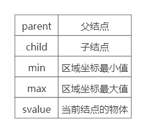
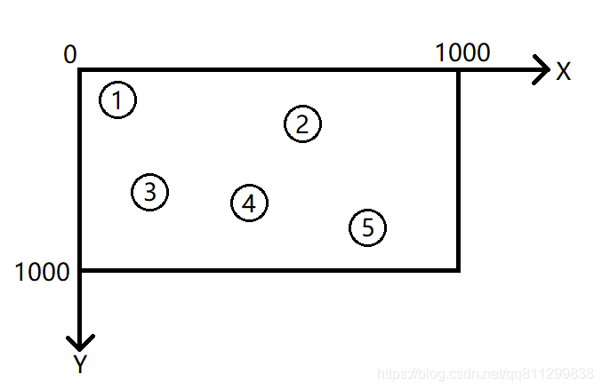
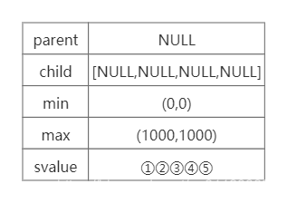
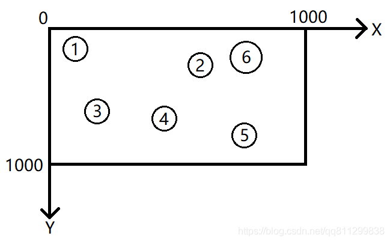
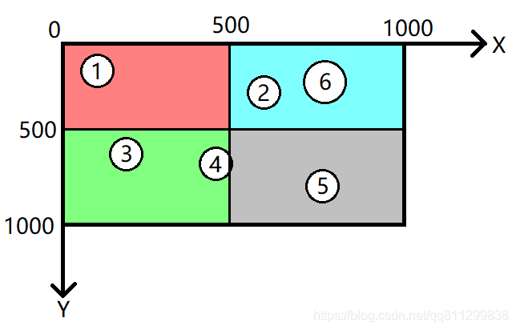
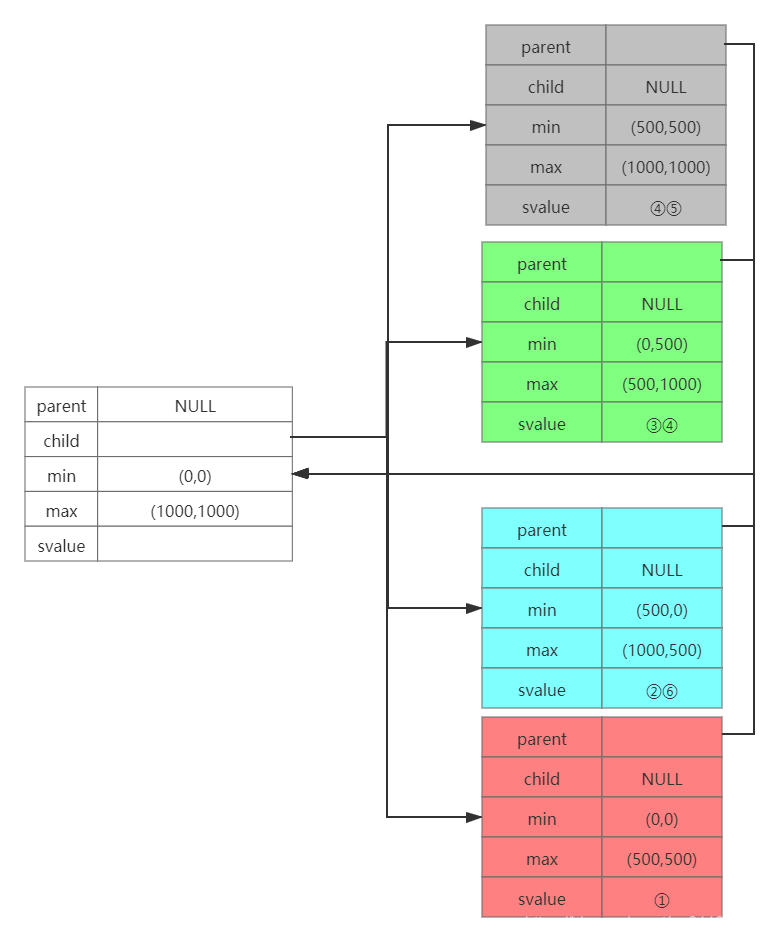
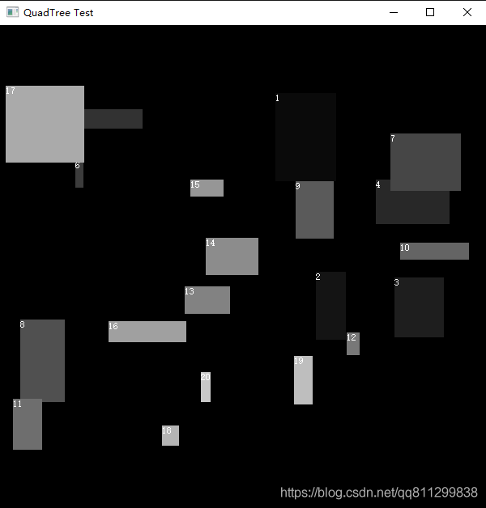
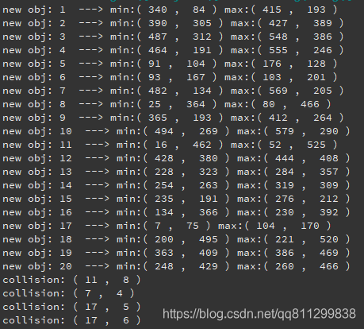

# 原理

## 一. 四叉树

### 1. 树的结构

①树的每一个结点要么没有子结点，要么就有四个子结点，结点可以不存放数据。

②在此次实现中，数据只存放于叶子结点，叶子结点中可存放多个数据，并使用链表存放数据。

③每个数据视情况可插入到多个叶子结点中，因此，为了方便管理，树中增加multimap来存放每个数据分别在哪些结点中的链表的哪个位置。

④本次实现的四叉树是为碰撞检测服务的，因此结点存在容量上限，在创建四叉树时需要指定结点的容量上限，创建后可以修改，当修改后的容量不小于修改前的容量，整棵四叉树结构不变，数据也不变，只对后来的数据有影响；当修改后的容量小于修改前的容量时，重构整棵四叉树。

### 2. 数据的插入

当插入数据时，找到对应要插入的叶子节点，然后插入其链表末尾，并将新插入的链表位置及其所在结点保存到multimap。当结点的数据量超过容量上限，则为该结点新增四个子结点，将其数据分别插入到对应的子结点中，并清空当前结点的所有数据（非叶子结点不存放数据）。

### 3. 数据的删除

当删除数据时，可提供对应的数据，这样就会将其从所在的所有结点中删除；也可提供迭代器，将指定结点中删除该数据。同时更新multimap。删除操作不对树结构有影响。

### 4. multimap的作用

①保存每份数据分别在哪些结点以及这些结点中的链表的位置；

②当复制树内容时，就遍历multimap的key重新插入到新的树结构当中；

③查找数据时，可以通过multimap来快速获得结点及数据在链表中的位置，以此生成迭代器返回。

### 5. 树结点的结构定义



## 二. 碰撞检测

### 1. 碰撞本质

碰撞的本质，是两个图形存在“交集”，即存在重合的地方。

### 2. 碰撞检测机制的原理

①指定某一个区域，对该区域内的所有物体两两之间进行判断是否碰撞，假设物体数量为n，则时间复杂度为O(n²)，这个时间复杂度暂时无法降低。既然碰撞检测消耗的时间会随着物体数量呈指数上升，那就只能减少检测的数量了。

②如何减少数量？这就要用到分治思维，将一个区域划分为几个子区域，然后对这几个子区域内的物体进行碰撞检测。

### 3. 与四叉树的结合

四叉树的每一个结点都对应一个碰撞检测区域，碰撞检测的根区域作为四叉树的根结点。当物体超出结点容量时，则将结点分裂成四个子结点，也即将该结点代表的区域划分为四等分，然后将这些涉及到的物体重新插入到这四个子结点。

实例演示：

①假设四叉树结点容量为5，现在区域内有以下物体：



则四叉树结构如下图：



②插入新结点“6”如图：



新增的结点插入到根结点，由于超出了结点容量，将区域划分四份，并分裂根结点

区域划分结果：



子结点1、2、3、4分别是（区域1）、（区域2）、（区域3）、（区域4)。由图看出，①在区域4，②和⑥在区域3，③在区域2，⑤在区域1，而④在区域1和区域2，因此四叉树结构如下图：



# 源码实现

```cpp
#ifndef QUAD_TREE_H
#define QUAD_TREE_H

#include <vector> // std::vector
#include <list> // std::list
#include <stack> // std::stack
#include <map> // std::multimap

#if __cplusplus >= 201103L
#include <functional> // std::function
#define null nullptr
#else
#define null 0
#endif

template<typename _Tp>
struct Position
{
    typedef _Tp value_type;

    Position(const value_type &x, const value_type &y)
     : x(x), y(y) {}

    Position()
     : x(value_type()), y(value_type()) {}

    Position operator/(const value_type &v) const
    { return Position(x / v, y / v); }

    Position& operator/=(const value_type &v)
    {
        x /= v;
        y /= v;
        return *this;
    }

    Position operator*(const value_type &v) const
    { return Position(x * v, y * v); }

    Position& operator*=(const value_type &v)
    {
        x *= v;
        y *= v;
        return *this;
    }

    friend Position operator/(const value_type &v, const Position &p)
    { return Position(v / p.x, v / p.y); }

    friend Position operator*(const value_type &v, const Position &p)
    { return Position(v * p.x, v * p.y); }

    Position operator+(const Position &p) const
    { return Position(x + p.x, y + p.y); }

    Position& operator+=(const Position &p)
    {
        x += p.x;
        y += p.y;
        return *this;
    }

    Position operator-(const Position &p) const
    { return Position(x - p.x, y - p.y); }

    Position& operator-=(const Position &p)
    {
        x -= p.x;
        y -= p.y;
        return *this;
    }

    value_type x, y;
};

namespace PositionType
{
    enum PositionType
    {
        RIGHT_BOTTOM = 1, // 图形占据点的右下方区域
        LEFT_BOTTOM = 2, // 图形占据点的左下方区域
        RIGHT_TOP = 4, // 图形占据点的右上方区域
        LEFT_TOP = 8, // 图形占据点的左上方区域
    };
}

template<typename _Tp, typename _PosType>
struct PositionComparator
{
    // 返回PositionType
    PositionType::PositionType operator()(const _Tp &__arg, const _PosType &__x) const
    { return __arg(__x); }
};

template<typename _Tp,
         typename _CmpType = std::less<_Tp>,
         typename _EqualType = std::equal_to<_Tp>,
         typename _PositionType = Position<long long>,
         typename _PositionComparator = PositionComparator<_Tp, _PositionType>
        >
class QuadTree
{
public:
    typedef std::size_t size_type;
    typedef _Tp value_type;
    typedef _Tp& reference;
    typedef const _Tp& const_reference;
    typedef _Tp* pointer;
    typedef _Tp** pointer_ptr;
#if __cplusplus >= 201103L
    typedef _Tp&& rvalue_reference;
#endif
    typedef _PositionType pos_type;
    typedef _EqualType equal_type;
    typedef _PositionComparator pos_cmp_type;

    typedef QuadTree<_Tp, _CmpType, _EqualType, _PositionType, _PositionComparator> self_type;

private:
    struct Node;
    typedef Node node_type;
    typedef Node* node_ptr;

    typedef std::list<value_type> value_seq;
    typedef typename std::list<value_type>::iterator value_seq_pos;

private:
    struct _IteratorNextImpl
    {
        node_ptr next(node_ptr __node, value_seq_pos &__pos) const
        {
            if(null == __node)
            {
                return null;
            }
            // 还有数据
            value_seq_pos __end_pos = _S_node_end_pos(__node);
            if(__pos != __end_pos && ++__pos != __end_pos)
            {
                return __node;
            }
            // 存在孩子结点
            if(null != __node->child[0])
            {
                __pos = _S_node_front_pos(__node->child[0]);
                return __node->child[0];
            }
            // 获取下一个兄弟结点
            while(null != __node->parent)
            {
                for(size_type __i = 0; __i < 3; ++__i)
                {
                    if(__node->parent->child[__i] == __node)
                    {
                        node_ptr __ret = __node->parent->child[__i + 1];
                        __pos = _S_node_front_pos(__ret);
                        return __ret;
                    }
                }

                __node = __node->parent;
            }
            return null;
        }

        void operator()(node_ptr *__n, value_seq_pos &__pos) const
        {
            node_ptr __node = next(*__n, __pos);
            while(null != __node && _S_node_size(__node) == 0)
            {
                __node = next(__node, __pos);
            }
            *__n = __node;
        }
    };

    struct _IteratorPrevImpl
    {
        node_ptr next(node_ptr __node, value_seq_pos &__pos) const
        {
            if(null == __node)
            {
                return null;
            }
            // 还有数据
            value_seq_pos __end_pos = _S_node_end_pos(__node);
            if(__pos != __end_pos && ++__pos != __end_pos)
            {
                return __node;
            }
            // 获取上一个兄弟结点
            while(null != __node->parent)
            {
                for(size_type __i = 3; __i > 0; --__i)
                {
                    if(__node->parent->child[__i] == __node)
                    {
                        node_ptr __ret = __node->parent->child[__i - 1];
                        __ret = _S_back_node(__ret);
                        __pos = _S_node_front_pos(__ret);
                        return __ret;
                    }
                }
                __node = __node->parent;
            }
            return null;
        }

        void operator()(node_ptr *__n, value_seq_pos &__pos) const
        {
            node_ptr __node = next(*__n, __pos);
            while(null != __node && _S_node_size(__node) == 0)
            {
                __node = next(__node, __pos);
            }
            *__n = __node;
        }
    };

public:
    template<typename _NodePtr, typename _NextImpl, typename _PrevImpl, typename _ValueType>
    class _IteratorImpl
    {
    private:
        friend class QuadTree;

        _IteratorImpl(_NodePtr __node, value_seq_pos __pos)
         : _M_node(__node), _M_value_pos(__pos)
        { }

        _IteratorImpl(_NodePtr __node)
         : _M_node(__node)
        {
            while(null != _M_node && _S_node_size(_M_node) == 0)
            {
                _M_value_pos = _S_node_end_pos(_M_node);
                _NextImpl()(&_M_node, _M_value_pos);
            }
            if(null == _M_node)
            {
                _M_node = __node;
            }
            _M_value_pos = _S_node_front_pos(_M_node);
        }

    public:
        _IteratorImpl() : _M_node(null), _M_value_pos(0) {}

        _ValueType& operator*()
        { return *_M_value_pos; }

        _ValueType* operator->()
        { return &(*_M_value_pos); }

        _IteratorImpl& operator++()
        {
            _NextImpl()(&_M_node, _M_value_pos);
            return *this;
        }

        _IteratorImpl operator++(int)
        {
            _IteratorImpl __ret = *this;
            ++(*this);
            return __ret;
        }

        _IteratorImpl& operator--()
        {
            _PrevImpl()(&_M_node, _M_value_pos);
            return *this;
        }

        _IteratorImpl operator--(int)
        {
            _IteratorImpl __ret = *this;
            --(*this);
            return __ret;
        }

        bool operator==(const _IteratorImpl &__it) const
        { return _M_node == __it._M_node && _M_value_pos == __it._M_value_pos; }

        bool operator!=(const _IteratorImpl &__it) const
        {
            bool __left_end = null == _M_node || _M_value_pos == _S_node_end_pos(_M_node);
            bool __right_end = null == __it._M_node || __it._M_value_pos == _S_node_end_pos(__it._M_node);

            if(__left_end && __right_end)
                return false;
            return _M_node != __it._M_node || _M_value_pos != __it._M_value_pos;
        }

    private:
        _NodePtr _M_node;
        value_seq_pos _M_value_pos;
    };

    typedef _IteratorImpl<node_ptr, _IteratorNextImpl, _IteratorPrevImpl, value_type> iterator;
    typedef _IteratorImpl<node_ptr, _IteratorNextImpl, _IteratorPrevImpl, const value_type> const_iterator;
    typedef _IteratorImpl<node_ptr, _IteratorPrevImpl, _IteratorNextImpl, value_type> reverse_iterator;
    typedef _IteratorImpl<node_ptr, _IteratorPrevImpl, _IteratorNextImpl, const value_type> const_reverse_iterator;

private:
    typedef std::multimap<_Tp, std::pair<node_ptr, value_seq_pos>, _CmpType> value_pos_type;
    typedef typename value_pos_type::iterator value_pos_seq_type;
    typedef typename value_pos_type::const_iterator value_pos_cseq_type;

public:
    /*
     * @__node_capacity  每个结点最大元素数量
     * @__min  区域坐标最小值
     * @__max  区域坐标最大值
     */
    QuadTree(size_type __node_capacity, const pos_type &__min, const pos_type &__max)
     : _M_node_capacity(__node_capacity), _M_size(0), _M_root(_S_alloc_node(__min, __max))
    {
        if(_M_node_capacity < 1)
        { _M_node_capacity = 1; }
    }

    template<typename _ForwardIterator>
    QuadTree(size_type __node_capacity,
             pos_type __min, pos_type __max,
             _ForwardIterator __beg, _ForwardIterator __end)
     : _M_node_capacity(__node_capacity) , _M_size(0), _M_root(_S_alloc_node(__min, __max))
    {
        while(__beg != __end)
        { insert(*__beg++); }
    }

    QuadTree(size_type __node_capacity,
             pos_type __min, pos_type __max,
             const self_type &__t)
     : _M_node_capacity(__node_capacity) , _M_size(0), _M_root(_S_alloc_node(__min, __max))
    {
        value_pos_cseq_type __it = __t._M_value_pos.begin();
        while(__it != __t._M_value_pos.end())
        {
            insert(__it->first);
            std::advance(__it, __t._M_value_pos.count(__it->first));
        }
    }

    QuadTree(const QuadTree &__t)
     : _M_node_capacity(__t._M_node_capacity), _M_size(0), _M_root(_S_alloc_node(__t.min(), __t.max()))
    {
        value_pos_cseq_type __it = __t._M_value_pos.begin();
        while(__it != __t._M_value_pos.end())
        {
            insert(__it->first);
            std::advance(__it, __t._M_value_pos.count(__it->first));
        }
    }

#if __cplusplus >= 201103L
    QuadTree(QuadTree &&__t)
     : _M_node_capacity(__t._M_node_capacity)
     , _M_size(__t._M_size), _M_root(__t._M_root)
     , _M_value_pos(std::move(__t._M_value_pos))
    {
        __t._M_root = _S_alloc_node(__t.min(), __t.max());
        __t._M_size = 0;
    }
#endif

    ~QuadTree()
    {
        _S_dealloc_node(_M_root);
        _M_size = 0;
    }

public:
    iterator begin()
    { return iterator(_M_root); }

    const_iterator begin() const
    { return const_iterator(_M_root); }

    iterator end()
    {
        node_ptr __node = _S_back_node(_M_root);
        return iterator(__node, _S_node_end_pos(__node));
    }

    const_iterator end() const
    {
        node_ptr __node = _S_back_node(_M_root);
        return const_iterator(__node, _S_node_end_pos(__node));
    }

    const_iterator cbegin() const
    { return begin(); }

    const_iterator cend() const
    { return end(); }

    reverse_iterator rbegin()
    { return reverse_iterator(_S_back_node(_M_root)); }

    reverse_iterator rend()
    { return reverse_iterator(_M_root, _S_node_end_pos(_M_root)); }

    const_reverse_iterator rbegin() const
    { return reverse_iterator(_S_back_node(const_cast<self_type *>(this)->_M_root)); }

    const_reverse_iterator rend() const
    { return const_reverse_iterator(_M_root, _S_node_end_pos(_M_root)); }

    const_reverse_iterator crbegin() const
    { return rbegin(); }

    const_reverse_iterator crend() const
    { return rend(); }

    iterator find(const_reference __v)
    {
        value_pos_seq_type __f = _M_value_pos.find(__v);
        return __f == _M_value_pos.end()
            ? end()
            : iterator(__f->second.first, __f->second.second);
    }

    const_iterator find(const_reference __v) const
    {
        value_pos_cseq_type __f = _M_value_pos.find(__v);
        return __f == _M_value_pos.end()
            ? end()
            : const_iterator(__f->second.first, __f->second.second);
    }

    // 删除元素，不改变树的结构
    void erase(const_iterator __it)
    { _M_erase_value(__it._M_node, __it._M_value_pos); }

    void erase(iterator __it)
    { _M_erase_value(__it._M_node, __it._M_value_pos); }

    void erase(const_reference __v)
    {
        std::pair<value_pos_seq_type, value_pos_seq_type> __f = _M_value_pos.equal_range(__v);
        for(value_pos_seq_type __it = __f.first; __it != __f.second; ++__it)
            _M_remove_value(__it->second.first, __it->second.second);
        _M_value_pos.erase(__f.first, __f.second);
    }

    // 判断某个结点的元素数量
    size_type count(iterator __it) const
    { return null == __it._M_node ? 0 : _S_node_size(__it._M_node); }

    size_type count(const_iterator __it) const
    { return null == __it._M_node ? 0 : _S_node_size(__it._M_node); }

    // 重新设置区域大小
    void resize_area(pos_type __min, pos_type __max)
    {
        self_type __tmp(_M_node_capacity, __min, __max, *this);
        swap(__tmp);
    }

    // 清空
    void clear()
    {
        node_ptr __n = _S_alloc_node(min(), max());
        _S_dealloc_node(_M_root);
        _M_root = __n;
        _M_size = 0;
    }

    // 插入值
    void insert(const_reference __p)
    { _M_insert(__p); }

#if __cplusplus >= 201103L
    template<typename ... _Args>
    void emplace(_Args && ... __args)
    { _M_insert(value_type(std::forward<_Args>(__args)...)); }

    void insert(rvalue_reference __v)
    { _M_insert(value_type(std::move(__v))); }
#endif

    // 设置结点容量
    void set_node_capacity(size_type __c)
    {
        if(__c < 1)
            __c = 1;

        if(__c < _M_node_capacity)
        {
            self_type __tmp(__c, min(), max(), *this);
            swap(__tmp);
        }
    }

    // 获取树的深度
    size_type depth() const
    { return null == _M_root ? 0 : (_M_root->depth + 1); }

    // 获取树的结点容量
    size_type node_capacity() const
    { return _M_node_capacity; }

    // 获取树的区域左上角坐标
    const pos_type& min() const
    { return _M_root->min; }

    // 获取树的区域右下角坐标
    const pos_type& max() const
    { return _M_root->max; }

    // 获取整棵树的元素数量
    size_type size() const
    { return _M_size; }

    void swap(self_type &__t)
    {
        std::swap(_M_node_capacity, __t._M_node_capacity);
        std::swap(_M_size, __t._M_size);
        std::swap(_M_root, __t._M_root);
    }

#if __cplusplus >= 201103L
    void swap(self_type &&__t)
    { swap(std::forward<self_type>(__t)); }
#endif

    template<typename _Callable>
    void collision_detection(void (_Callable::*__callable)(reference, reference), _Callable &__obj)
    { _M_collision_detection<iterator, reference, _Callable>(begin(), end(), __callable, __obj); }

    template<typename _Callable>
    void collision_detection(void (_Callable::*__callable)(reference, reference) const, const _Callable &__obj)
    { _M_collision_detection<iterator, reference, _Callable>(begin(), end(), __callable, __obj); }

    void collision_detection(void (*__callable)(reference, reference))
    { _M_collision_detection<iterator, reference>(begin(), end(), __callable); }

    template<typename _Callable>
    void collision_detection(void (_Callable::*__callable)(const_reference, const_reference), _Callable &__obj) const
    { _M_collision_detection<const_iterator, const_reference, _Callable>(begin(), end(), __callable, __obj); }

    template<typename _Callable>
    void collision_detection(void (_Callable::*__callable)(const_reference, const_reference) const, const _Callable &__obj) const
    { _M_collision_detection<const_iterator, const_reference, _Callable>(begin(), end(), __callable, __obj); }

    void collision_detection(void (*__callable)(const_reference, const_reference)) const
    { _M_collision_detection<const_iterator, const_reference>(begin(), end(), __callable); }

#if __cplusplus >= 201103L
    void collision_detection(std::function<void(const_reference, const_reference)> &&__callable) const
    { _M_collision_detection<const_iterator, std::function<void(const_reference, const_reference)>>(begin(), end(), std::move(__callable)); }

    void collision_detection(std::function<void(reference, reference)> &&__callable)
    { _M_collision_detection<iterator, std::function<void(reference, reference)>>(begin(), end(), std::move(__callable)); }
#endif

    template<typename _ForwardIter>
    void advance(_ForwardIter &__it, size_type __dis) const
    {
        while(__dis-- > 0)
            ++__it;
    }

private:
    // 获取新元素插入的结点
    void _M_insert(const_reference __v)
    {
        ++_M_size;
        _M_insert(_M_root, __v, pos_cmp_type());
    }

    // 分割结点
    void _M_refactor_node(node_ptr __node, const pos_cmp_type &__cmp);

    // 插入元素
    void _M_insert(node_ptr __node, const_reference __v, const pos_cmp_type &__cmp);

    // 插入新的元素
    void _M_append(node_ptr __node, const_reference __v)
    {
        __node->svalue.push_back(__v);
        _M_value_pos.insert(std::make_pair(__v, std::make_pair(__node, _S_node_back_pos(__node))));
    }

    // 删除元素
    void _M_erase_value(node_ptr __node, value_seq_pos __pos)
    {
        _M_remove_pos(__pos);
        _M_remove_value(__node, __pos);
    }

    void _M_remove_value(node_ptr __node, value_seq_pos __pos)
    {
        if(__pos != _S_node_end_pos(__node))
        {
            __node->svalue.erase(__pos);
            --_M_size;
        }
    }

    void _M_remove_pos(value_seq_pos __pos)
    {
        std::pair<value_pos_seq_type, value_pos_seq_type> __f = _M_value_pos.equal_range(*__pos);
        for(value_pos_seq_type __it = __f.first; __it != __f.second; ++__it)
        {
            if(__it->second.second == __pos)
            {
                _M_value_pos.erase(__it);
                break;
            }
        }
    }

    // 碰撞检测
    template<typename _ForwardIter, typename _Vt, typename _Callable>
    void _M_collision_detection(_ForwardIter __beg, _ForwardIter __end, void (_Callable::*__callable)(_Vt, _Vt), _Callable &__obj) const;

    template<typename _ForwardIter, typename _Vt, typename _Callable>
    void _M_collision_detection(_ForwardIter __beg, _ForwardIter __end, void (_Callable::*__callable)(_Vt, _Vt) const, const _Callable &__obj) const;

    template<typename _ForwardIter, typename _Vt>
    void _M_collision_detection(_ForwardIter __beg, _ForwardIter __end, void (*__callable)(_Vt, _Vt)) const;

#if __cplusplus >= 201103L
    template<typename _ForwardIter, typename _Callable>
    void _M_collision_detection(_ForwardIter __beg, _ForwardIter __end, _Callable &&__callable) const;
#endif

private:
    // 获取有元素的最右边的叶子结点
    static node_ptr _S_back_node(node_ptr __root);

    // 获取结点的元素数量
    static size_type _S_node_size(node_ptr __node)
    { return __node->svalue.size(); }

    // 生成新的结点
    static node_ptr _S_alloc_node(const pos_type &__min, const pos_type &__max, node_ptr __p = null);

    // 删除结点
    static void _S_dealloc_node(node_ptr __node);

    // 找到最深的子结点
    static node_ptr _S_depthest_child(node_ptr __node);

    // 初始化结点的孩子结点
    static void _S_init_node_children(node_ptr __node);

    // 获取结点最后一个元素的位置
    static value_seq_pos _S_node_back_pos(node_ptr __node)
    {
        value_seq_pos __ret = _S_node_end_pos(__node);
        return --__ret;
    }

    // 获取结点的结尾位置
    static value_seq_pos _S_node_end_pos(node_ptr __node)
    { return __node->svalue.end(); }

    // 获取结点最前一个元素的 位置
    static value_seq_pos _S_node_front_pos(node_ptr __node)
    { return __node->svalue.begin(); }

private:
    struct Node
    {
        Node *parent; // 父结点
        Node *child[4]; // 四个子结点
        pos_type min; // 区域坐标最小值
        pos_type max; // 区域坐标最大值
        size_type depth; // 深度，不计算当前结点
        value_seq svalue; // 当前结点的所有元素
    };

private:
    size_type _M_node_capacity; // 单个叶子结点的最大容量
    size_type _M_size; // 当前元素个数
    node_ptr _M_root; // 根节点
    value_pos_type _M_value_pos; // 保存每个元素所在的位置
};

template<typename _Tp,
         typename _CmpType,
         typename _EqualType,
         typename _PositionType,
         typename _PositionComparator>
void
QuadTree<_Tp, _CmpType, _EqualType, _PositionType, _PositionComparator>::_M_refactor_node(
    node_ptr __node, const pos_cmp_type &__cmp)
{
    _S_init_node_children(__node);

    value_seq __varray;
    __varray.swap(__node->svalue);

    for(value_seq_pos __it = __varray.begin(); __it != __varray.end(); ++__it)
    {
        _M_remove_pos(__it);
        _M_insert(__node, *__it, __cmp);
    }
}

template<typename _Tp,
         typename _CmpType,
         typename _EqualType,
         typename _PositionType,
         typename _PositionComparator>
void
QuadTree<_Tp, _CmpType, _EqualType, _PositionType, _PositionComparator>::_M_insert(
    node_ptr __node, const_reference __v, const pos_cmp_type &__cmp)
{
    std::stack<node_ptr> __s;
    __s.push(__node);

    while(!__s.empty())
    {
        __node = __s.top();
        __s.pop();

        // 叶子结点，元素个数还没满，直接插入到当前结点
        if(null == __node->child[0] && _S_node_size(__node) < node_capacity())
        {
            _M_append(__node, __v);
            break;
        }

        // 如果是叶子结点，且元素个数超出容量
        if(null == __node->child[0] && _S_node_size(__node) >= node_capacity())
            _M_refactor_node(__node, __cmp);

        pos_type __m = (__node->min + __node->max) / 2;
        unsigned __quad = __cmp(__v, __m);

        if(__quad & PositionType::RIGHT_BOTTOM)
            __s.push(__node->child[0]);

        if(__quad & PositionType::LEFT_BOTTOM)
            __s.push(__node->child[1]);

        if(__quad & PositionType::RIGHT_TOP)
            __s.push(__node->child[2]);

        if(__quad & PositionType::LEFT_TOP)
            __s.push(__node->child[3]);
    }
}

template<typename _Tp,
         typename _CmpType,
         typename _EqualType,
         typename _PositionType,
         typename _PositionComparator>
template<typename _ForwardIter, typename _Vt, typename _Callable>
void
QuadTree<_Tp, _CmpType, _EqualType, _PositionType, _PositionComparator>::_M_collision_detection(
    _ForwardIter __beg, _ForwardIter __end, void (_Callable::*__callable)(_Vt, _Vt), _Callable &__obj) const
{
#if __cplusplus >= 201103L
    std::function<void(_Vt, _Vt)> __func = std::bind(__callable, &__obj, std::placeholders::_1, std::placeholders::_2);
    _M_collision_detection(__beg, __end, std::move(__func));
#else
    _ForwardIter __tmp = __beg;
    while(__beg != __end)
    {
        while(++__tmp != __end && __tmp._M_node == __beg._M_node)
            if((*__tmp)(*__beg))
                (__obj.*__callable)(*__tmp, *__beg);

        __tmp = ++__beg;
    }
#endif
}

template<typename _Tp,
         typename _CmpType,
         typename _EqualType,
         typename _PositionType,
         typename _PositionComparator>
template<typename _ForwardIter, typename _Vt, typename _Callable>
void
QuadTree<_Tp, _CmpType, _EqualType, _PositionType, _PositionComparator>::_M_collision_detection(
    _ForwardIter __beg, _ForwardIter __end, void (_Callable::*__callable)(_Vt, _Vt) const, const _Callable &__obj) const
{
#if __cplusplus >= 201103L
    std::function<void(_Vt, _Vt)> __func = std::bind(__callable, &__obj, std::placeholders::_1, std::placeholders::_2);
    _M_collision_detection(__beg, __end, std::move(__func));
#else
    _ForwardIter __tmp = __beg;
    while(__beg != __end)
    {
        while(++__tmp != __end && __tmp._M_node == __beg._M_node)
            if((*__tmp)(*__beg))
                (__obj.*__callable)(*__tmp, *__beg);

        __tmp = ++__beg;
    }
#endif
}

template<typename _Tp,
         typename _CmpType,
         typename _EqualType,
         typename _PositionType,
         typename _PositionComparator>
template<typename _ForwardIter, typename _Vt>
void
QuadTree<_Tp, _CmpType, _EqualType, _PositionType, _PositionComparator>::_M_collision_detection(
    _ForwardIter __beg, _ForwardIter __end, void (*__callable)(_Vt, _Vt)) const
{
#if __cplusplus >= 201103L
    std::function<void(_Vt, _Vt)> __func = std::bind(__callable, std::placeholders::_1, std::placeholders::_2);
    _M_collision_detection(__beg, __end, std::move(__func));
#else
    _ForwardIter __tmp = __beg;
    while(__beg != __end)
    {
        while(++__tmp != __end && __tmp._M_node == __beg._M_node)
            if((*__tmp)(*__beg))
                __callable(*__tmp, *__beg);

        __tmp = ++__beg;
    }
#endif
}

#if __cplusplus >= 201103L
template<typename _Tp,
         typename _CmpType,
         typename _EqualType,
         typename _PositionType,
         typename _PositionComparator>
template<typename _ForwardIter, typename _Callable>
void
QuadTree<_Tp, _CmpType, _EqualType, _PositionType, _PositionComparator>::_M_collision_detection(
    _ForwardIter __beg, _ForwardIter __end, _Callable &&__callable) const
{
    _ForwardIter __tmp = __beg;
    while(__beg != __end)
    {
        while(++__tmp != __end && __tmp._M_node == __beg._M_node)
            if((*__tmp)(*__beg))
                __callable(*__tmp, *__beg);

        __tmp = ++__beg;
    }
}
#endif

template<typename _Tp,
         typename _CmpType,
         typename _EqualType,
         typename _PositionType,
         typename _PositionComparator>
typename QuadTree<_Tp, _CmpType, _EqualType, _PositionType, _PositionComparator>::node_ptr
QuadTree<_Tp, _CmpType, _EqualType, _PositionType, _PositionComparator>::_S_back_node(node_ptr __root)
{
    node_ptr __node = __root;
    while(null != __node && null != __node->child[0])
        __node = __node->child[3];
    return __node;
}

template<typename _Tp,
         typename _CmpType,
         typename _EqualType,
         typename _PositionType,
         typename _PositionComparator>
typename QuadTree<_Tp, _CmpType, _EqualType, _PositionType, _PositionComparator>::node_ptr
QuadTree<_Tp, _CmpType, _EqualType, _PositionType, _PositionComparator>::_S_alloc_node(
    const pos_type &__min, const pos_type &__max, node_ptr __p)
{
    node_ptr __ret = new node_type;
    __ret->parent = __p;
    __ret->child[0] = null;
    __ret->child[1] = null;
    __ret->child[2] = null;
    __ret->child[3] = null;
    __ret->min = __min;
    __ret->max = __max;
    __ret->depth = 0;
    return __ret;
}

template<typename _Tp,
         typename _CmpType,
         typename _EqualType,
         typename _PositionType,
         typename _PositionComparator>
void
QuadTree<_Tp, _CmpType, _EqualType, _PositionType, _PositionComparator>::_S_dealloc_node(node_ptr __node)
{
    if(null != __node->child[0])
    {
        _S_dealloc_node(__node->child[0]);
        _S_dealloc_node(__node->child[1]);
        _S_dealloc_node(__node->child[2]);
        _S_dealloc_node(__node->child[3]);
    }
    delete __node;
}

template<typename _Tp,
         typename _CmpType,
         typename _EqualType,
         typename _PositionType,
         typename _PositionComparator>
typename QuadTree<_Tp, _CmpType, _EqualType, _PositionType, _PositionComparator>::node_ptr
QuadTree<_Tp, _CmpType, _EqualType, _PositionType, _PositionComparator>::_S_depthest_child(node_ptr __node)
{
    size_type __max_index = 0;
    for(size_type __i = 1; __i < 4; ++__i)
    {
        if(__node->child[__i]->depth > __node->child[__max_index]->depth)
        {
            __max_index = __i;
        }
    }
    return __node->child[__max_index];
}

template<typename _Tp,
         typename _CmpType,
         typename _EqualType,
         typename _PositionType,
         typename _PositionComparator>
void
QuadTree<_Tp, _CmpType, _EqualType, _PositionType, _PositionComparator>::_S_init_node_children(node_ptr __node)
{
    pos_type __m = (__node->min + __node->max) / 2;
    __node->child[0] = _S_alloc_node(__m, __node->max, __node);
    __node->child[1] = _S_alloc_node(pos_type(__node->min.x, __m.y), pos_type(__m.x, __node->max.y), __node);
    __node->child[2] = _S_alloc_node(pos_type(__m.x, __node->min.y), pos_type(__node->max.x, __m.y), __node);
    __node->child[3] = _S_alloc_node(__node->min, __m, __node);

    ++__node->depth;

    node_ptr __n = __node->parent;
    while(null != __n)
    {
        node_ptr __tmp = _S_depthest_child(__n);
        if(__tmp->depth < __n->depth)
            break;

        __n->depth = __tmp->depth + 1;
        __n = __n->parent;
    }
}

#endif // QUAD_TREE_H
```

# 测试案例

## 测试代码

```cpp
#include <QApplication>
#include <QMainWindow>
#include <QTextCodec>
#include <QDebug>
#include <cmath>
#include <ctime>
#include <QLabel>
#include <cstdlib>
#include <QWidget>
#include "quadtree.h"

#define RECTANGLE_NUM 20
#define RANGE_MAX 500
#define RECTANGLE_MAX_WIDTH 100
#define RECTANGLE_MAX_HEIGHT 100
#define COLOR_INDEX (210 / RECTANGLE_NUM)

struct Rectangle;

typedef QuadTree<Rectangle> TreeType;
typedef TreeType::pos_type PosType;

static QString format(const char *str, ...)
{
    va_list arg_list;
    va_start(arg_list, str);
    char tmp[1024];
    int len = vsprintf(tmp, str, arg_list);
    tmp[len] = 0;
    va_end(arg_list);
    return QObject::tr(tmp);
}

struct Rectangle
{
    PositionType::PositionType operator()(const PosType &p) const
    {
        int quad = 0;
        bool left = minx < p.x;
        bool right = maxx > p.x;
        bool top = miny < p.y;
        bool bottom = maxy > p.y;

        if(left && top)
        {
            quad |= PositionType::LEFT_TOP;
        }
        if(left && bottom)
        {
            quad |= PositionType::LEFT_BOTTOM;
        }
        if(right && top)
        {
            quad |= PositionType::RIGHT_TOP;
        }
        if(right && bottom)
        {
            quad |= PositionType::RIGHT_BOTTOM;
        }
        return PositionType::PositionType(quad);
    }

    bool operator==(const Rectangle &p) const
    { return obj == p.obj; }

    bool operator()(const Rectangle &p) const
    {
        long long x1 = (minx + maxx) / 2, y1 = (miny + maxy) / 2;
        long long x2 = (p.minx + p.maxx) / 2, y2 = (p.miny + p.maxy) / 2;
        long long width1 = maxx - minx, height1 = maxy - miny;
        long long width2 = p.maxx - p.minx, height2 = p.maxy - p.miny;

        long long x = abs(x1 - x2), y = abs(y1 - y2);
        long long width = (width1 + width2) / 2, height = (height1 + height2) / 2;

        bool ret = x < width;
        ret = ret && y < height;
        return ret;
    }

    bool operator<(const Rectangle &p) const
    { return obj < p.obj; }

    friend QDebug& operator<<(QDebug &out, const Rectangle &p)
    {
        out << p.obj;
        return out;
    }

    long long minx;
    long long miny;
    long long maxx;
    long long maxy;
    long long obj;
};

static void collision(Rectangle &p1, Rectangle &p2)
{
    qDebug() << "collision: (" << p1.obj << ", " << p2.obj << ")";
}

struct CollisionManager
{
    void collision(const Rectangle &p1, const Rectangle &p2) const
    {
        qDebug() << "collision: (" << p1.obj << ", " << p2.obj << ")";
    }
};

int main(int argc, char *argv[])
{
    QApplication a(argc, argv);

    QTextCodec *codec = QTextCodec::codecForName("utf-8");//设置编码格式
    QTextCodec::setCodecForLocale(codec);

    TreeType tree(8, PosType(0, 0), PosType(RANGE_MAX, RANGE_MAX));

    QMainWindow w;
    w.setWindowTitle(QObject::tr("QuadTree Test"));
    w.resize(RANGE_MAX + 100, RANGE_MAX + 100);

    QWidget *root = new QWidget(&w);
    root->setStyleSheet("background:rgb(0,0,0)");
    root->move(0, 0);
    root->resize(RANGE_MAX + 100, RANGE_MAX + 100);

    srand(static_cast<unsigned int>(time(nullptr)));
    for(int i = 1; i <= RECTANGLE_NUM; ++i)
    {
        Rectangle p;
        p.minx = rand() % RANGE_MAX;
        p.miny = rand() % RANGE_MAX;
        p.maxx = rand() % RECTANGLE_MAX_WIDTH + p.minx + 10;
        p.maxy = rand() % RECTANGLE_MAX_HEIGHT + p.miny + 10;
        p.obj = i;
        QWidget *handle = new QWidget(root);
        handle->setStyleSheet(format("background:rgb(%d,%d,%d)", COLOR_INDEX * i, COLOR_INDEX * i, COLOR_INDEX * i));

        QLabel *label = new QLabel(handle);
        label->setText(QString::number(i));
        label->setStyleSheet(format("color:rgb(255,255,255)"));

        handle->move(static_cast<int>(p.minx), static_cast<int>(p.miny));
        handle->resize(static_cast<int>(p.maxx - p.minx), static_cast<int>(p.maxy - p.miny));

        qDebug() << "new obj:" << p.obj << " ---> min:(" << p.minx << ", " << p.miny << ") max:(" << p.maxx << ", " << p.maxy << ")";

        tree.insert(p);
    }
    tree.collision_detection(collision);

    w.show();
    return a.exec();
}
```

## 运行结果：

