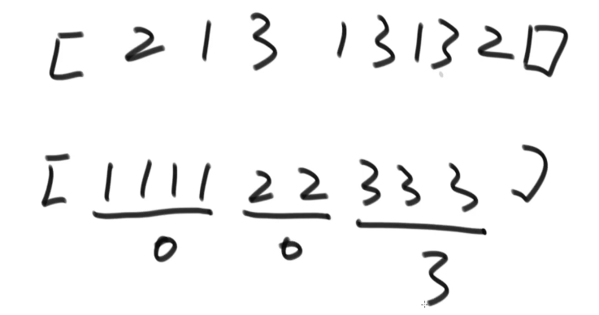
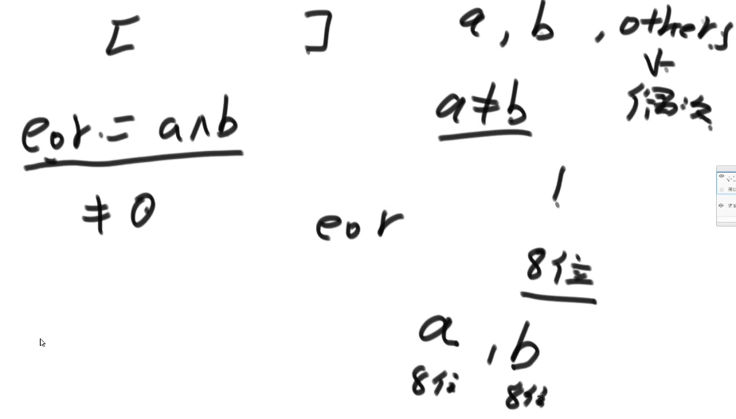
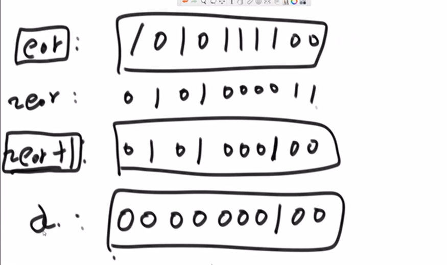
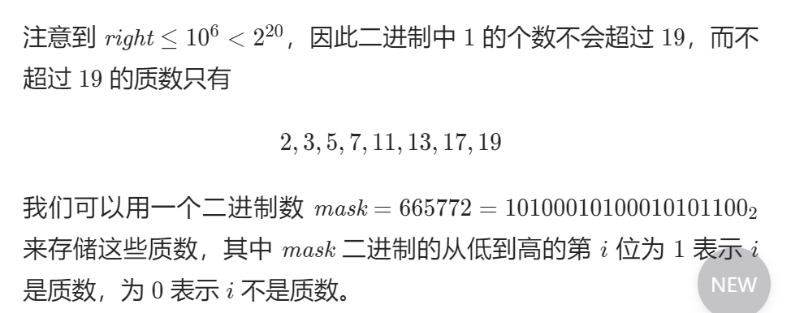

# 位运算

## 位运算符

1. 按位取反 ==~==，对每个二进制位进行取反，**0变1,1变0**

2. 位与 ==&==，   同真为真，其余为假    **有0则0**

3. 位或 ==|==，    同假为假，其余为真  ,   **有1就1**

4. 位抑或 ==^==，相同为假，不同为真    **相同为0，不同为**1：

   ```c++
   异或除了没有进位外与普通加法无异
   a ^ a = 0
   a ^ 0 = a
   a ^ b ^ b = a
   ```


## 重要公式

**基本公式 : **

+ 将X最右边的n位清零：x & (~0 << n)

+ **获取x的第n位值：(x >> n) & 1**   (要把出输出位以外 及左边变成0, 因为 0000 0001 ---> 1 , 0000 0000 -->0 从而达到输出 )

+ x >>= 1;   遍历

+ 获取x的第n位的幂值：x & (1 << n)

+ 仅将第n位置为1：x | (1 << n)     （要置1的位, 用1置1）

+ 仅将第n位置为0：x & (~(1 << n))  (要清零的位, 用0清0)

+ 将x最高位至第n位（含）清零：x & ((1 << n) - 1)

+ 将第n位至第0位（含）清零：x & (~((1 << (n + 1)) - 1))

+ ```c++
  lowbit(x)是x的二进制表达式中最低位的1所对应的值。
  int lowbit(int x)
  {
      return x&(-x);
  }
  
  
  例如 当x=22时二进制表示10110则 22&-22既可以得到二进制数值10。
  第一次取出 last = 10(二进制)
  第二次取出 now = 100（二进制）
  ```

  例题: [868. 二进制间距](https://leetcode.cn/problems/binary-gap/)

  给定一个正整数 `n`，找到并返回 `n` 的二进制表示中两个 **相邻** 1 之间的 **最长距离** 。如果不存在两个相邻的 1，返回 `0` 。

  如果只有 `0` 将两个 `1` 分隔开（可能不存在 `0` ），则认为这两个 1 彼此 **相邻** 。两个 `1` 之间的距离是它们的二进制表示中位置的绝对差。例如，`"1001"` 中的两个 `1` 的距离为 3 。

   

  **示例 1：**

  ```
  输入：n = 22
  输出：2
  解释：22 的二进制是 "10110" 。
  在 22 的二进制表示中，有三个 1，组成两对相邻的 1 。
  第一对相邻的 1 中，两个 1 之间的距离为 2 。
  第二对相邻的 1 中，两个 1 之间的距离为 1 。
  答案取两个距离之中最大的，也就是 2 。
  ```

  ```c++
  class Solution {
  private:
      int lowbit(int x)
      {
          return x & (-x);
      }
  
  public:
      int binaryGap(int n) {
          /*
              两者相除取对数。log2(now / last) 就可以直接得到想间隔的距离
          */
          int ans = 0; 
          int last = lowbit(n);   // 上一个最低位 1 所代表的权值
          n -= last;  //新的值
  
          while (n)
          {
              int now = lowbit(n); // 当前最低位 1 所代表的权值
              ans = max(ans, (int)(log(now/last)/log(2)));
              n -= now;
              last = now;
          }
          return ans;
      }
  };
  ```

  


**常用**:

+ 判断奇偶
  + (x & 1) == 1 ---等价---> (x % 2 == 1)    奇数
    (x & 1) == 0 ---等价---> (x % 2 == 0)    偶数

**移位:**

1. 除：n / (2^i) 等价于 n >> i, **右移 **    比如: x / 2 ---等价--->   x >> 1
2. 乘 ：n * (2^i) 等价于 n << i 其中^代表幂  , **左移**
3. 取模：a % (2^i) 等价于 a & (2^i - 1)  , **或  -1**

注意:  要用整个表达式都要用位运算

```c++
 if(n % 3 == 0 && n & 1 == 0)   // err
```

**异或运算的性质与扩展**
1)0N==N    NN ==0
2)异或运算满足交换律和结合率
3)不用额外变量交换两个数

```c
a = a ^ b;
b = a ^ b;
a = a ^ b;
```

4)一个数组中有一种数出现了奇数次，其他数都出现了偶数次，怎么找到这一个数
5)一个数组中有两种数出现了奇数次，其他数都出现了偶数次，怎么找到这两个数

```
int eO = 0;
for (int cur : arr) 
{
	eO ^= cur;
}
System.out.println(eO);
```



```java
int eO = 0, eOhasOne = 0;
for (int curNum : arr) {
    eO ^= curNum;
}
// 结果 e0 = a^b   //如果a ^ e0 = b 如果 b ^ e0 = a
//eor a !=b
//eor必然有一个位置上是1
int rightOne = eO & (~eO + 1);//提取出最右的1
for (int cur : arr) {
    if ((cur & rightOne) != 0) {  //&拿到数 说明是要找的数
        eOhasOne ^= cur;
    }
}
System.out.println(eOhasOne + " " + (eO ^ eOhasOne));
```





#### [762. 二进制表示中质数个计算置位](https://leetcode.cn/problems/prime-number-of-set-bits-in-binary-representation/)

+ **__builtin_popcount(i) 函数的功能，是求一个无符号数的二进制表示中 1 的个数。**

+ 再来看看魔数 665772 的二进制表示：

  

  ```c++
             19  18  17  16  15  14  13  12  11  10  9  8  7  6  5  4  3  2  1  0
  665772 = ( 1   0   1   0   0   0   1   0   1   0   0  0  1  0  1  0  1  1  0  0 )
  ```

**代码:**

```c++
class Solution 
{
public:
    int countPrimeSetBits(int left, int right) 
    {
        int ans = 0;
        for (int x = left; x <= right; ++x) 
        {
           if ( ( 665772 >> __builtin_popcount(x)) & 1 )// 判断1的个数, 判断1的个数,是1就表示是质数
           {
                ++ans;
            }
        }
        return ans;
    }
};
```


#### [461. 汉明距离](https://leetcode.cn/problems/hamming-distance/)

```c++
class Solution {
public:
    int hammingDistance(int x, int y) {
        int z = x ^ y;
        return __builtin_popcount(z); // 计算1个数
    }
};
```

方法2:

```c++
class Solution 
{
public:
    int hammingDistance(int x, int y) 
    {  // 求对应二进制位不同的位置的数目。
       // 0 <= x, y <= 231 - 1-->正数
       int z = x^y; //x^y,可以获取到不同位置的结果.相对值结果为1
       int count = 0;
       while (z != 0)
       {
           count += z & 1; //最低位要么为0要么为1
           z >>= 1; //将一个数的各二进制位全部右移若干位，正数左补0，负数左补1，右边丢弃。
       }
       return count;
    }
};
```


#### [136. 只出现一次的数字](https://leetcode.cn/problems/single-number/)

```c++
class Solution 
{
public:
    int singleNumber(vector<int>& nums) 
    { // 非空整数数组 // 只出现一次以外的元素只有一个
        int ans = nums[0];
        for (int i = 1; i < nums.size(); i++)
        {
            ans ^= nums[i];  // 异或-->相同为0不同为1,而相同就只能得到0
        }
        return ans;
    }
};
```

#### 翻转32位数字

```c++
class Solution 
{
public:
    uint32_t reverseBits(uint32_t n) 
    {  //颠倒给定的二进制位。 
        int ans = 0;
        for(int i = 0; i < 32; i++)
        {
            ans <<= 1;     // 高位丢弃,低位补零  0 0
            ans += n & 1;  //最低位要么为0要么为1 // (个二进制码 & 1) = 其本身 
            n >>= 1;       // 右移,正数高位补0  //将一个数的各二进制位全部右移若干位，正数左补0，负数左补1，右边丢弃
        }
        return ans;
    }    
};
```

#### [191. 位1的个数](https://leetcode.cn/problems/number-of-1-bits/)

```c++
class Solution 
{
public:
    int hammingWeight(uint32_t n) 
    {
        int count = 0;
        for (int i = 0; i < 32; i++)
        {
            count += (n >> i) & 1;
        }
        return count;
    }
};
```

