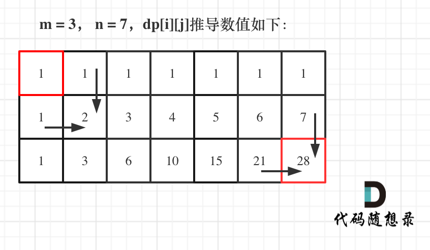

# 基础知识

步骤:

1. 确定dp数组（dp table）以及下标的含义(因为⼀些情况是递推公式决定了dp数组要如何初始化！)

2. 确定递推公式

3. dp数组如何初始化

4. 确定遍历顺序

5. 举例推导dp数组

   

#### [509. 斐波那契数](https://leetcode.cn/problems/fibonacci-number/)

斐波那契数 （通常用 F(n) 表示）形成的序列称为 斐波那契数列 。该数列由 0 和 1 开始，后面的每一项数字都是前面两项数字的和。也就是：

F(0) = 0，F(1) = 1
F(n) = F(n - 1) + F(n - 2)，其中 n > 1
给定 n ，请计算 F(n) 。

动规五部曲：

1. 确定dp数组以及下标的含义
  dp[i]的定义为：第i个数的斐波那契数值是dp[i]

2. 确定递推公式
  状态转移⽅程 dp[i] = dp[i - 1] + dp[i - 2];

3. dp数组如何初始化
  题⽬中把如何初始化也直接给我们了，如下：

  ```c++
  dp[0] = 0;
  dp[1] = 1;
  ```

4. 确定遍历顺序
  从递归公式dp[i] = dp[i - 1] + dp[i - 2];中可以看出，dp[i]是依赖 dp[i - 1] 和 dp[i - 2]，那么遍历的顺序
  ⼀定是从前到后遍历的

5. 举例推导dp数组

dp

```c++
class Solution 
{
public:
    int fib(int N)
    {
        if (N <= 1) return N; 
        vector<int> dp(N + 1);  // 习惯多留出一个位置, 在i=0 时很方便因为要取发到n
        dp[0] = 0;
        dp[1] = 1;
        for (int i = 2; i <= N; i++) 
        {
        	dp[i] = dp[i - 1] + dp[i - 2];
        }
        return dp[N];
    }
};
```

滚动数组的优化形式1

```c++
class Solution 
{
public:
    int fib(int n) 
    {
        if (n <= 1)
            return n;
        //vector<int> dp; 
        int dp[2];
        dp[0] = 0;
        dp[1] = 1;
        for (int i = 2; i <= n; i++)
        {
            int sum = dp[0] + dp[1];
            dp[0] = dp[1];
            dp[1] = sum;
        }
        return dp[1];
    }
};
```

滚动数组的优化形式2

```c++
class Solution 
{
public:
    int fib(int n) 
    {
        if (n <= 1)
            return n;
        //vector<int> dp;
        int dp[2];
        dp[0] = 0;
        dp[1] = 1;
        for (int i = 2; i <= n; i++)
        {
            dp[i%2]=dp[(i-1)%2]+dp[(i-2)%2];
        }
        return dp[n % 2];
    }
};
```

#### [70. 爬楼梯](https://leetcode.cn/problems/climbing-stairs/)

爬到第⼀层楼梯有⼀种⽅法，爬到⼆层楼梯有两种⽅法,那么第⼀层楼梯再跨两步就到第三层 ，第⼆层楼梯再跨⼀步就到第三层。所以到第三层楼梯的状态可以由第⼆层楼梯 和 到第⼀层楼梯状态推导出来，那么就可以想到动态规划了。

1. 确定dp数组以及下标的含义
  dp[i]： 爬到第i层楼梯，有dp[i]种⽅法

2. 确定递推公式
从dp[i]的定义可以看出，dp[i] 可以有两个⽅向推出来。
⾸先是dp[i - 1]，上i-1层楼梯，有dp[i - 1]种⽅法，那么再⼀步跳⼀个台阶不就是dp[i]了么。
还有就是dp[i - 2]，上i-2层楼梯，有dp[i - 2]种⽅法，那么再⼀步跳两个台阶不就是dp[i]了么。
那么dp[i]就是 dp[i - 1]与dp[i - 2]之和！
所以dp[i] = dp[i - 1] + dp[i - 2] 。

3. dp数组如何初始化

  dp[i]的定义：爬到第i层楼梯，有dp[i]中⽅法。

  不考虑dp[0]如果初始化，只初始化dp[1] = 1，dp[2] = 2，然后从i = 3开始递推，这样
  才符合dp[i]的定义。

4. 确定遍历顺序

  从递推公式dp[i] = dp[i - 1] + dp[i - 2];中可以看出，遍历顺序⼀定是从前向后遍历的

5. 举例推导dp数组

  举例当n为5的时候，dp table（dp数组）应该是这样的

  


```c++
class Solution 
{
public:
    int climbStairs(int n) 
    {
        if (n == 1)
            return 1;
        vector<int> dp(n + 1);
        dp[1] = 1;
        dp[2] = 2;

        for (int i = 3; i <= n; i++)
        {
            dp[i] = dp[i - 1] + dp[i - 2];
        }
        return dp[n];
    }
};
```

优化

```c++
class Solution 
{
public:
    int climbStairs(int n) 
    {
        if (n == 1)
            return 1;  // 因为n=1时下面的循环不了.空指针的情况
        int dp[3];
        dp[1] = 1;
        dp[2] = 2;

        for (int i = 3; i <= n; i++)
        {
            int sum = dp[1] + dp[2];
            dp[1] = dp[2];
            dp[2] = sum;
        }
        return dp[2];
    }
};
```


#### [746. 使用最小花费爬楼梯](https://leetcode.cn/problems/min-cost-climbing-stairs/)

每当你爬上⼀个阶梯你都要花费对应的体⼒值，⼀旦⽀付了相应的体⼒值，你就可以选
择向上爬⼀个阶梯或者爬两个阶梯
所以示例1中只花费⼀个15 就可以到阶梯顶，最后⼀步可以理解为 不⽤花费。

1. 确定dp数组以及下标的含义
  使⽤动态规划，就要有⼀个数组来记录状态，本题只需要⼀个⼀维数组dp[i]就可以了。
  dp[i]的定义：到达第i个台阶所花费的最少体⼒为dp[i]。（注意这⾥认为是第⼀步⼀定是要花费）
  对于dp数组的定义，⼤家⼀定要清晰！

2. 确定递推公式
  可以有两个途径得到dp[i]，⼀个是dp[i-1] ⼀个是dp[i-2]。
  那么究竟是选dp[i-1]还是dp[i-2]呢？
  ⼀定是选最⼩的，所以dp[i] = min(dp[i - 1], dp[i - 2]) + cost[i];
  注意这⾥为什么是加cost[i]，⽽不是cost[i-1],cost[i-2]之类的，因为题⽬中说了：每当你爬上⼀个阶梯
  你都要花费对应的体⼒值

3. dp数组如何初始化
  根据dp数组的定义，dp数组初始化其实是⽐较难的，因为不可能初始化为第i台阶所花费的最少体⼒。
  那么看⼀下递归公式，dp[i]由dp[i-1]，dp[i-2]推出，既然初始化所有的dp[i]是不可能的，那么只初始化
  dp[0]和dp[1]就够了，其他的最终都是dp[0]dp[1]推出。

  ```c++
  vector<int> dp(cost.size());
  dp[0] = cost[0];
  dp[1] = cost[1];
  ```

4. 确定遍历顺序

  因为是模拟台阶，⽽且dp[i]⼜dp[i-1]dp[i-2]推出，所以是从前到后遍历cost数组就可以了。
  但是稍稍有点难度的动态规划，其遍历顺序并不容易确定下来。

5. 举例推导dp数组

  拿示例2：cost = [1, 100, 1, 1, 1, 100, 1, 1, 100, 1] ，来模拟⼀下dp数组的状态变化，如下：

  

代码:

```c++
class Solution
{
public:
    int minCostClimbingStairs(vector<int>& cost) 
    {
        vector<int> dp(cost.size() + 1);
        dp[0] = cost[0];
        dp[1] = cost[1];
        for (int i = 2; i < cost.size(); i++) 
        {
            dp[i] = min(dp[i - 1], dp[i - 2]) + cost[i];
        }
        // 注意最后⼀步可以理解为不⽤花费，所以取倒数第⼀步，第⼆步的最少值
        return min(dp[cost.size() - 1], dp[cost.size() - 2]);
    }
};
```

#### [62. 不同路径](https://leetcode.cn/problems/unique-paths/)

一个机器人位于一个 m x n 网格的左上角 （起始点在下图中标记为 “Start” ）。

机器人每次只能向下或者向右移动一步。机器人试图达到网格的右下角（在下图中标记为 “Finish” ）。

问总共有多少条不同的路径？

**示例 1：**


```
输入：m = 3, n = 7
输出：28
```


机器⼈从(0 , 0) 位置触发，到(m - 1, n - 1)终点。

1. 确定dp数组（dp table）以及下标的含义
  dp[i] [j] ：表示从（0 ，0）出发，到(i, j) 有dp[i][j]条不同的路径。

2. 确定递推公式
  想要求dp[i] [j]，只能有两个⽅向来推导出来，即dp[i - 1] [j] 和 dp[i] [j - 1]。
  此时在回顾⼀下 dp[i - 1] [j] 表示啥，是从(0, 0)的位置到(i - 1, j)有⼏条路径，dp[i][j - 1]同理。
  那么很⾃然，dp[i] [j] = dp[i - 1] [j] + dp[i] [j - 1]，因为dp[i] [j]只有这两个⽅向过来。

3. dp数组的初始化
  ⾸先dp[i] [0]⼀定都是1，因为从(0, 0)的位置到(i, 0)的路径只有⼀条，那么dp[0] [j]也同
  理。
  所以初始化代码为：

  ```c++
  for (int i = 0; i < m; i++) dp[i][0] = 1;
  for (int j = 0; j < n; j++) dp[0][j] = 1;
  ```

4. 确定遍历顺序

  这⾥要看⼀下递归公式dp[i][j] = dp[i - 1] [j] + dp[i] [j - 1]，dp[i] [j]都是从其上⽅和左⽅推导⽽来，那么从
  左到右⼀层⼀层遍历就可以了。
  这样就可以保证推导dp[i][j]的时候，dp[i - 1] [j] 和 dp[i] [j - 1]⼀定是有数值的。

5. 举例推导dp数组
  如图

代码;

```c++
class Solution 
{
public:
    int uniquePaths(int m, int n) 
    {
        vector<vector<int> > dp(m, vector<int>(n, 0));
        for (int i = 0; i < m; i++) dp[i][0] = 1;
        for (int j = 0; j < n; j++) dp[0][j] = 1;
        for (int i = 1; i < m; i++)
        {
            for (int j = 1; j < n; j++)
                dp[i][j] = dp[i-1][j] + dp[i][j-1];
        }
        return dp[m - 1][n -1];
    }
};
```

总结如下。滚动数组只适用于计算最终结果，而不需要存储中间结果的场景。针对一维数组，可以得出具体滚动的思想有以下两种：

1）用数组的固定位置表示固定含义的数字，这里的固定含义包括需要存储的中间变量值和最终计算结果。可以先计算后再调整数字的位置，也可以先调整位置再计算结果。

2）利用取模这种操作把有限的数组空间想象成逻辑上无限延长的空间。这种方式不需要特意去调整数字的位置。
对于1维数组来说，滑动数组是减小数组的总长度；而对于2维数据来说，应该相当于是将2维空间压缩到一个维度方向去了，个人感觉压缩后的长度应该是等于原始2维数据某一维度方向上的数值的。

优化:

```c++
class Solution {
public:
int uniquePaths(int m, int n) 
{
    vector<int> dp(n);
    for (int i = 0; i < n; i++) 
        dp[i] = 1;
    for (int j = 1; j < m; j++)
    {
        for (int i = 1; i < n; i++) 
        {
          dp[i] += dp[i - 1];
        }
    }
    return dp[n - 1];
    }
};
```

#### [63. 不同路径 II](https://leetcode.cn/problems/unique-paths-ii/)

一个机器人位于一个 m x n 网格的左上角 （起始点在下图中标记为 “Start” ）。

机器人每次只能向下或者向右移动一步。机器人试图达到网格的右下角（在下图中标记为 “Finish”）。

现在考虑网格中有障碍物。那么从左上角到右下角将会有多少条不同的路径？

网格中的障碍物和空位置分别用 1 和 0 来表示。

 **示例 1：**


```
输入：obstacleGrid = [[0,0,0],[0,1,0],[0,0,0]]
输出：2
解释：3x3 网格的正中间有一个障碍物。
从左上角到右下角一共有 2 条不同的路径：

1. 向右 -> 向右 -> 向下 -> 向下
2. 向下 -> 向下 -> 向右 -> 向右
```


动规五部曲：
1. 确定dp数组（dp table）以及下标的含义
  dp[i] [j] ：表示从（0 ，0）出发，到(i, j) 有dp[i][j]条不同的路径。

2. 确定递推公式
  递推公式和62.不同路径⼀样，dp[i] [j] = dp[i - 1] [j] + dp[i] [j - 1]。
  但这⾥需要注意⼀点，因为有了障碍，(i, j)如果就是障碍的话应该就保持初始状态（初始状态为0）。
  所以代码为：

  ```c++
  if (obstacleGrid[i][j] == 0)
  { // 当(i, j)没有障碍的时候，再推导dp[i][j]
  	dp[i][j] = dp[i - 1][j] + dp[i][j - 1];
  }
  ```

3.  dp数组如何初始化

  ```c++
  vector<vector<int>> dp(m, vector<int>(n, 0));
  for (int i = 0; i < m && obstacleGrid[i][0] == 0; i++) dp[i][0] = 1;  //⼀旦遇到obstacleGrid[i][0] == 1(障碍物)的情况就停⽌dp[i][0]的赋值1的操作
  for (int j = 0; j < n && obstacleGrid[0][j] == 0; j++) dp[0][j] = 1;
  ```

  因为从(0, 0)的位置到(i, 0)的路径只有⼀条，所以dp[i] [0]⼀定为1，dp[0] [j]也同理。
  但如果(i, 0) 这条边有了障碍之后，障碍之后（包括障碍）都是⾛不到的位置了，所以障碍之后的dp[i][0]
  应该还是初始值0。

  

4. 确定遍历顺序
  从递归公式dp[i] [j] = dp[i - 1] [j] + dp[i] [j - 1] 中可以看出，⼀定是从左到右⼀层⼀层遍历，这样保证推导
  dp[i][j]的时候，dp[i - 1][j] 和 dp[i][j - 1]⼀定是有数值。
  代码

  ```c++
  for (int i = 1; i < m; i++) 
  {
      for (int j = 1; j < n; j++)
      {
          if (obstacleGrid[i][j] == 1) continue;
          dp[i][j] = dp[i - 1][j] + dp[i][j - 1];
      }
  }
  ```

5. 举例推导dp数组
  拿示例1来举例如题：

代码:

```c++
class Solution 
{
public:
    int uniquePathsWithObstacles(vector<vector<int>>& obstacleGrid) 
    {  
        int i, j;
        int m = obstacleGrid.size();     // 行个数
        int n = obstacleGrid[0].size();  // 列个数
        vector<vector<int> > dp(m, vector<int>(n, 0));
        for (i = 0; i < m && obstacleGrid[i][0] == 0; i++) dp[i][0] = 1;
        for (j = 0; j < n && obstacleGrid[0][j] == 0; j++) dp[0][j] = 1;

        for (i = 1; i < m; i++)
        {
            for (j = 1; j < n; j++)
            {
                if (obstacleGrid[i][j] == 1) 
                    continue;
                dp[i][j] = dp[i-1][j] + dp[i][j-1];
            }
        }
        return dp[m - 1][n - 1];
    }
};
```


#### [343. 整数拆分](https://leetcode.cn/problems/integer-break/)

给定一个正整数 `n` ，将其拆分为 `k` 个 **正整数** 的和（ `k >= 2` ），并使这些整数的乘积最大化。

返回 *你可以获得的最大乘积* 。

**示例 1:**

```
输入: n = 2
输出: 1
解释: 2 = 1 + 1, 1 × 1 = 1。
```

1. 确定dp数组（dp table）以及下标的含义
dp[i]：分拆数字i，可以得到的最⼤乘积为dp[i]。

2. 确定递推公式
当 i ≥ 2 时，假设对正整数 i 拆分出的第一个正整数是 j（1≤j<i），则有以下两种方案：
将 i 拆分成 j 和 i-j 的和，且 i−j 不再拆分成多个正整数，此时的乘积是 j×(i−j) ；
将 i 拆分成 j 和 i−j 的和，且 i−j 继续拆分成多个正整数，此时的乘积是 j×dp[i−j] 。
因此，当 j 固定时，有 dp[i]=max(j×(i−j),j×dp[i−j])。由于 j 的取值范围是 1 到 i−1 ，需要遍历所有的 j 得
到dp[i]的

3. dp的初始化
0 不是正整数，1 是最小的正整数，0 和 1 都不能拆分，因此dp[2] = 1:

4. 确定遍历顺序
  由状态转移方程知道dp[i] 是从 j×(i−j)和j ×dp[i−j] 且j 的取值范围是 1 到 i−1 ，需要遍历所有的 j 得到dp[i]
  所以从前往后遍历。
  确定遍历顺序，先来看看递归公式：

  dp[i] = max(dp[i], max((i - j) * j, dp[i - j] * j));
  dp[i] 是依靠 dp[i - j]的状态，所以遍历i⼀定是从前向后遍历，先有dp[i - j]再有dp[i]。
  枚举j的时候，是从1开始的。i是从3开始，这样dp[i - j]就是dp[2]正好可以通过我们初始化的数值求出来。
  所以遍历顺序为：

  ```c++
  for (int i = 3; i <= n ; i++) 
  {
      for (int j = 1; j < i - 1; j++) 
      {
      	dp[i] = max(dp[i], max((i - j) * j, dp[i - j] * j));
      }
  }
  ```

5. 举例推导dp数组
  举例当n为10 的时候，dp数组⾥的数值，如下：

  ```c++
  for (int i = 3; i <= n ; i++)
  {
      for (int j = 1; j < i - 1; j++) 
      {
          dp[i] = max(dp[i], max((i - j) * j, dp[i - j] * j));
      }
  }
  ```


c++代码:

```c++
class Solution
{
public:
    int integerBreak(int n) 
    {
        vector<int> dp(n + 1, 0);  // 要访问到 n
        dp[2] = 1;  // 初始化// 因为dp[0]和dp[1]都没有意义
        for (int i = 3; i <= n ; i++) 
        {
            for (int j = 1; j < i - 1; j++)  // 拆分成不同情况
                dp[i] = max(dp[i], max((i - j) * j, dp[i - j] * j));   
        }
        return dp[n];
    }
};
```


####   **求图最大面积问题，我们可以统一归为DP问题**

- [84. 柱状图中最大的矩形](https://leetcode.cn/problems/largest-rectangle-in-histogram/)
- [85. 最大矩形](https://leetcode.cn/problems/maximal-rectangle/description/)
- [221. 最大正方形](https://leetcode.cn/problems/maximal-square/)


```c++
class Solution {
public:
    int orderOfLargestPlusSign(int n, vector<vector<int>>& mines) {
        vector<vector<int>> grid(n, vector<int>(n, 1));

        for (auto&& m : mines) {
            grid[m[0]][m[1]] = 0;
        }

        vector<vector<int>> dp(n, vector<int>(n, INT_MAX));
        //left,right
        int count = 0, count1 = 0;
        for (int i = 0;i < n;++i) {
            count = 0, count1 = 0;
            for (int j = 0;j < n;++j) {
                if (grid[i][j] == 1) ++count;
                else count = 0;
                dp[i][j] = min(dp[i][j], count);

                if (grid[i][n - j - 1] == 1) ++count1;
                else count1 = 0;
                dp[i][n - j - 1] = min(dp[i][n - j - 1], count1);
            }
        }

        //up,down
        count = 0, count1 = 0;
        int ans = 0;
        for (int i = 0;i < n;++i) {
            count = 0, count1 = 0;
            for (int j = 0;j < n;++j) {
                if (grid[j][i] == 1) ++count;
                else count = 0;
                dp[j][i] = min(dp[j][i], count);
            }

            for (int k = 0;k < n;++k) {
                if (grid[n - k - 1][i] == 1)++count1;
                else count1 = 0;
                dp[n - k - 1][i] = min(dp[n - k - 1][i], count1);
                ans = max(ans, dp[n - k - 1][i]);
            }
        }

        return ans;
    }
};
```

- 这题是个正方形图，其实可以计算对角线上的点，从中心往两对角线递减，最大值依次递减，

```c++
class Solution {
public:
    int orderOfLargestPlusSign(int n, vector<vector<int>>& mines) {
        vector<vector<int>> G(n, vector<int>(n, INT_MAX));  // N x N 
        for(auto &p: mines)
            G[p[0]][p[1]] = 0;
        for(int i=0;i<n;i++){
            int l=0, r=0, u=0, d=0;
            for(int j=0,k=n-1;j<n;j++,k--){
                l = G[i][j]==0 ? 0 : l+1;
                r = G[i][k]==0 ? 0 : r+1;
                u = G[j][i]==0 ? 0 : u+1;
                d = G[k][i]==0 ? 0 : d+1;
                G[i][j] = min(G[i][j], l);
                G[i][k] = min(G[i][k], r);
                G[j][i] = min(G[j][i], u);
                G[k][i] = min(G[k][i], d);
            }
        }
        int Max = 0;
        for(auto &v: G)
            for(auto &x: v)
                Max = max(Max, x);
        return Max;
    }
};
```


#### [2472. 不重叠回文子字符串的最大数目](https://leetcode.cn/problems/maximum-number-of-non-overlapping-palindrome-substrings/)


```c++
class Solution {
public:
    int maxPalindromes(string s, int K) {
        int n = s.size();
        bool flag[n][n];
        memset(flag, 0, sizeof(flag));
        for (int i = 0; i < n; i++) for (int l = i, r = i; l >= 0 && r < n && s[l] == s[r]; l--, r++) flag[l][r] = true;
        for (int i = 0; i + 1 < n; i++) for (int l = i, r = i + 1; l >= 0 && r < n && s[l] == s[r]; l--, r++) flag[l][r] = true;

        int f[n + 1];
        memset(f, 0, sizeof(f));
        for (int i = 1; i <= n; i++) {
            f[i] = f[i - 1];
            for (int j = i - K; j >= 0; j--) if (flag[j][i - 1]) f[i] = max(f[i], f[j] + 1);
        }
        return f[n];
    }
};
```


#### [808. 分汤](https://leetcode.cn/problems/soup-servings/)

全概率公式 + 记忆化搜索。

由全概率公式可得：`P(X) = P(X|Y1)*P(Y1) + P(X|Y2)*P(Y2) + P(X|Y3)*P(Y3) + P(X|Y4)*P(Y4)`。[全概率公式](https://leetcode.cn/problems/soup-servings/comments/baike.baidu.com/item/全概率公式)。

其中，`P(X)` 为我们所要求的事件发生的概率，`P(Yi)` 为操作 i 发生的概率，在本题中他们是相等的，`P(Y1) = P(Y2) = P(Y3) = P(Y4) = 0.25`，`P(X|Yi)` 为 操作 i 发生的条件下 X 事件发生的概率。

回到程序中，我们用 `prob(a, b)` 表示汤 A 剩余 a 毫升，汤 B 剩余 b 毫升时的概率。那么由全概率公式：`prob(a, b) = prob(a1, b1)*0.25 + prob(a2, b2)*0.25 + prob(a3, b3)*0.25 + prob(a4, b4)*0.25` 其中 `ai, bi` 表示执行操作 i 之后，汤 A 和汤 B 中剩余汤的容量。

可以发现，这是一个递归的过程。我们可以使用记忆化搜索进行优化。然而数据范围实在是太大了。我们观察 4 个操作可以发现，A 先倒完的概率大于等于 B 先倒完的概率，而且随着 n 的增大，A 先倒完的概率会越来越大，B 先倒完的概率会越来越小。那么当 n 足够大的时候，答案趋近于 1。答案要求误差小于 10^-5，我们可以算一下当 n = 5000 时，误差已经小于 10^-5 了，所以当 n >= 5000 时可以直接返回 1。

```c++
class Solution {
public:
    double soupServings(int n) {
        if (n >= 5000) return 1;
        return dfs(n, n); 
    }
    
private:    
    unordered_map<string, double> memo;
    double dfs(int a, int b) {
        // A 先倒完
        if (a == 0 && b != 0) return 1;
        
        // 同时倒完
        if (a == 0 && b == 0) return 0.5;
    
        // B 先倒完    
        if (a != 0 && b == 0) return 0;
        
        // 记忆化
        string encoder = to_string(a) + " " + to_string(b);
        if (memo[encoder] != 0) return memo[encoder];
        
        // 全概率公式
        double prob = 0;
        prob += dfs(max(0, a - 100), b);             // 操作 1
        prob += dfs(max(0, a - 75), max(0, b - 25)); // 操作 2
        prob += dfs(max(0, a - 50), max(0, b - 50)); // 操作 3
        prob += dfs(max(0, a - 25), max(0, b - 75)); // 操作 4
        
        prob *= 0.25;
        
        memo[encoder] = prob;
        return prob;
    }
};
```

