# 记忆化搜索 —— 搜索 or 动态规划

## 前言

> 记忆化搜索，本质还是 **动态规划**，只是实现方式采用了 **深度优先搜索** 的形式，但是它不像 **深度优先搜索**那样 **重复** 枚举所有情况，而是把已经计算的子问题保存下来，这样就和动态规划的思想不谋而合了。

## 一、斐波那契数列

## 1、定义

- 所谓斐波那契数列，是指一个数列【当前项】的值等于【前两项】之和：
- 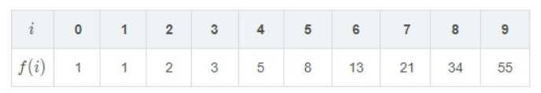

- 该数列有如下递归表示：

  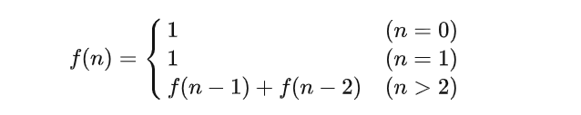

- 对于 f(5) 的求解，程序调用如下：

  


## 2、递归求解

【例题1】给定一个 n(n≤45) ，求 斐波那契数列的第 n 项的值，要求用递归实现。 那么，我们只需要套用上面的递归函数，并且处理好递归出口，就能把它写成递归的形式，c++ 代码实现如下：

```cpp
int f(unsigned int n) {
    if(n < 2) {
        return n;
    }
    return f(n-1) + f(n-2);
}
```

## 3、递归时间复杂度

- 递归求解的过程如下：

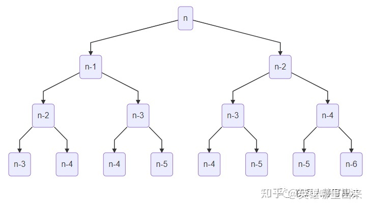

- 这是一棵二叉树，树的高度为 n ，所以粗看递归访问时结点数为 2n ，但是仔细看，对于任何一棵子树而言，左子树的高度一定比右子树的高度大，所以不是一棵严格的完全二叉树。为了探究它实际的时间复杂度，我们改下代码：

```cpp
int f(unsigned int n) {
    ++c[n];
    if(n <= 1) {
        return 1;
    }
    return f(n-1) + f(n-2);
}
```

- 加了一句代码 `++c[n];`，引入一个计数器，来看下在不同的 n 的情况下， f(n) 这个函数的调用次数，如图所示：

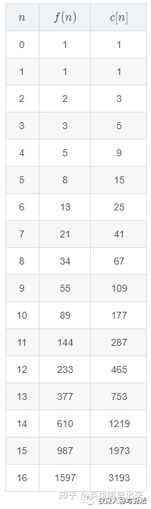

- 观察 c[n] 的增长趋势，首先排除等差数列，然后再来看是否符合等比数列，我们来尝试求下 c[n]/c[n−1] 的值，列出表格如下：

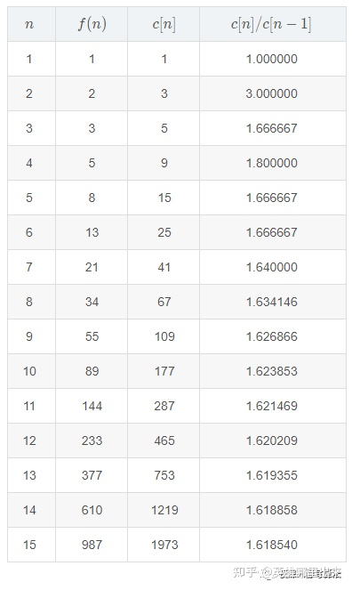

- 观察发现，随着 n 的不断增大， c[n]/c[n−1] 越来越接近一个常数，而这个常数就是黄金分割的倒数：

  

- 当 n 趋近于无穷大的时候，满足如下公式：

  

- 对等比数列化解后累乘得到：

  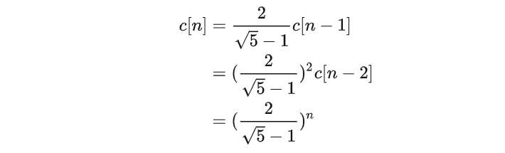

- 所以，斐波那契数列递归求解的时间复杂度就是 ：

  

- 这是一个指数级的算法，随着 n 的不断增大，时间消耗呈指数级增长，我们在写代码的时候肯定是要避免这样的写法的，尤其是在服务器开发过程中，CPU 是一种极其宝贵的资源，任何的浪费都是可耻的。


## 4、优化思路

- 递归求解斐波那契数列其实是一个深度优先搜索的过程，它是毫无优化的暴力枚举，对于 f(5) 的求解，如图所示：


- 同时，我们也发现，计算过程中其实有很多重叠子问题，例如 f(3) 被计算了 2 次，如图所示：

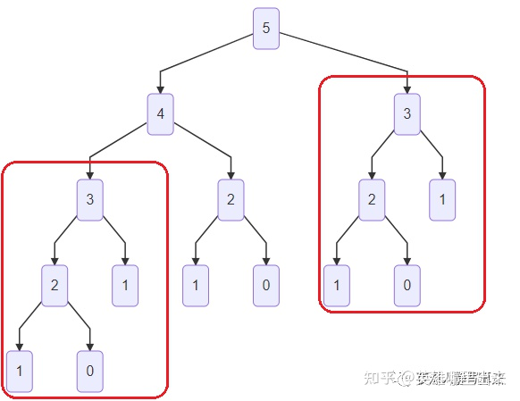

- f(2) 被计算了 3 次，如图所示：

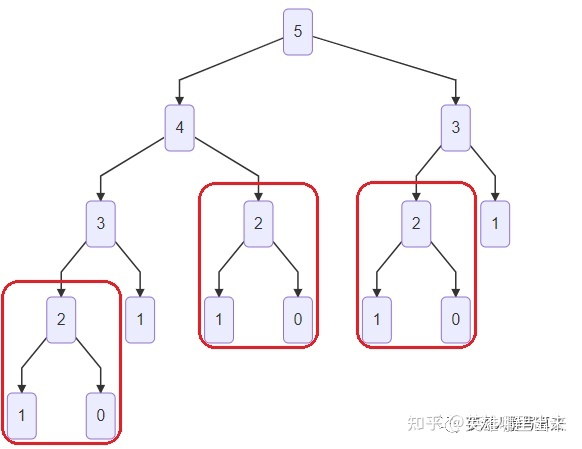

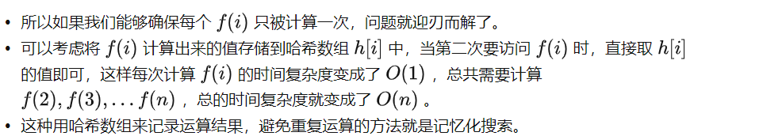


## 二、记忆化搜索

## 1、再谈斐波那契数列

- 我们用一个数组 h[i] 来记录 斐波那契数列 第 i 项的值，把之前的递归代码改成如下形式：

```cpp
int h[46];

void init() {
    memset(h, -1, sizeof(h));  // 1）
}

int f(unsigned int n) {
    if(n <= 1) {
        return 1;
    }
    int &fib = h[n];            // 2）
    if(fib != -1) 
    {
        return fib;             // 3）
    }
    fib = f(n-1) + f(n-2);      // 4）
    return fib;
}
```

- 1）初始化所有 f(i) 都没有被计算过，为了方便用 `memset`，可以将 `inf`定义成 -1；
- 2）注意这里用了个引用，而且一定要用引用
- 3）当 `fib`也就是 `h[n]`已经计算过了，那么直接返回结果即可；
- 4）最后，利用递归计算`h[n]`的值，并且返回结果；

## 2、图解记忆化搜索

- 和递归版本相比，多了这么一段代码：

```cpp
int &fib = h[n];
if(fib != inf) {
    return fib;
}
```

- 那么它的作用体现在哪里呢？
- 我们通过一个动图来感受一下：


- 如图所示，当第二次需要计算 f(2) 和 f(3) 时，由于结果已经计算出来并且存储在 h[2] 和 h[3] 中，所以上面这段代码的`fib != inf`表达式为真，直接返回，不再需要往下递归计算，这样就把原本的 "递归二叉树" 转换成了 "递归链"， 从而将原本指数级的算法变成了多项式级别。

## 3、记忆化搜索的含义

- 上文用一个简单的例子阐述了记忆化搜索的实现方式，并且提到了利用数组来记录已经计算出来的重叠子问题，这个和动态规划的思想非常相似，没错，记忆化搜索其实用的就是动态规划的思想。更加确切的说，可以用如下公式来表示：

  


-------


【例题2】给定一个 n×m(n,m≤100) 的矩阵 A ，要求选择一个起点，然后选择上下左右四个相邻方向之一开始行  走，并且要保证行走的点的值比当前点小，即找一条单调递减的路径，要求这条路径最长。

- 如下一个 5×5 的矩阵：
- 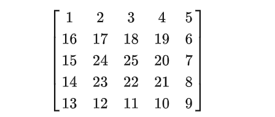
- 我们可以选择从 A33=25 这个位置出发，得到一条最大长度为 25 的路径。

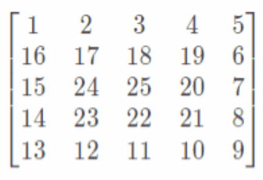


- 先给出 c++ 代码的实现，然后再来讲解：

```cpp
int dir[4][2] = {
    { 0, 1 }, { 0, -1 }, { 1, 0 }, { -1, 0 }
};


int dfs(int preval, int x, int y) 
{
    // 1）越界
    if(x < 1 || y < 1 || x > n || y > m) 
    {
        return 0;            
    }
    
     // 2）保证这条路是一条单调递减的路
    if(A[x][y] >= preval) 
    {
        return 0;                
    }

    //对引用的赋值实质为对被引用对象的赋值
    //一个变量可以有多个引用，可通俗理解为一个人可以有多个昵称。
    int &val = f[x][y];  

    if (val != -1) {             // 3）
        return val;
    }

    val = 1;
    for (int i = 0; i < 4; ++i)
    { // 4）
        int tx = x + dir[i][0];
        int ty = y + dir[i][1];
        val = max(val, dfs(A[x][y], tx, ty) + 1);
    }
    return val;                   // 5）
}
```

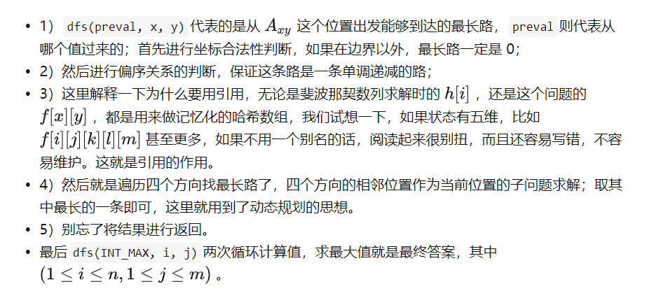

## 4、记忆化搜索的框架

- 记忆化搜索的框架。 总共可以归纳为以下四步：
  1）合法性剪枝
  2）偏序关系剪枝
  3）记忆化剪枝
  4）递归计算结果并返回

### 1）合法性剪枝

- 因为在递归计算的时候，我们必须保证传入参数的合法性，所以这一步是必要的，比如坐标为负数之类的判断；

### 2）偏序关系剪枝

- 偏序关系其实就是代表了状态转移的方向，例如【例题2】中，只允许值大的往值小的方向走，这就是一种偏序关系；如果不满足偏序关系的就不能继续往下搜索了；

### 3）记忆化剪枝

- 记忆化剪枝就是去对应的哈希数组判断这个状态是否曾经已经计算过，如果计算过则直接返回，时间复杂度 O(1) ；

### 4）递归计算结果并返回

- 这一步就是深度优先搜索的递归过程，也是递归子问题取最优解的过程，需要具体问题具体分析；

## 5、记忆化搜索的优点

### 1、忽略边界判断

- 状态转移的时候完全不需要进行边界判断，只需要在递归调用的出口进行统一判断即可，这样使得代码更加简洁清晰；

### 2、编码方便

- 相比动态规划而言，不用去关心子问题的枚举顺序问题，也不用管数组下标越界问题，只要按照深度优先搜索的思路，把代码框架写好，再加入记忆化部分的代码即可，实现方便;

## 三、记忆化搜索的应用

- 本文的最后，介绍一些常见的用记忆化搜索来解决的问题，帮助大家更快上手。

## 1、路径问题

### 1）一维

> 【例题3】有一只经过训练的蜜蜂只能爬向右侧相邻的蜂房，不能反向爬行。求蜜蜂从蜂房 a 爬到蜂房 b 的可能路线数。 其中，蜂房的结构如下所示 (0<a<b<50) 。

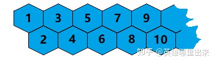

首先，从图中可以看出，蜂房 a 到 蜂房 b 的路线数等价于 蜂房 1 到 蜂房 b−a+1 的路径数。所以问题转化成求从 蜂房 1 到 蜂房 i 的 路径数。 假如现在蜜蜂在蜂房 i ，那么它可以从蜂房 i−1 或者 蜂房 i−2 爬过来，令蜜蜂从 蜂房 1 到 蜂房 i 的 路径数为 f(i) ，则有：

f(i)=f(i−1)+f(i−2)

利用记忆化搜索求解即可，而且这正好是斐波那契数列。

### 2）二维

> 【例题4】给定一个 n×m(n,m≤8) 的格子，要求从左下角走到右上角，求方案数。

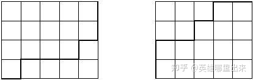

左下角坐标为 (0,0) ，右上角坐标为 (n,m) ，那么当我们在任意一个点 (i,j) 时，要么是从 (i−1,j) 过来，要么是从 (i,j−1) 过来，所以到达 (i,j) 的方案数必然为 (i−1,j) 和 (i,j−1) 之和。令到达 (i,j) 的方案数为 f(i,j) ，可以进行如下递归：或f(i,j)={1i=0,j=00i<0或  j<0f(i−1,j)+f(i,j−1)otherwise

然后利用深搜递归调用再加上记忆化即可。

## 2、字符串匹配问题

> 【例题5】请实现一个函数用来匹配包括 '.' 和 '*' 的正则表达式。模式中的字符 '.' 表示任意一个字符，而 '*' 表示它前面的字符可以出现任意次（包含0次）。 例如，目标串 "aaa" 与模式 "a.a" 和 "ab*ac*a" 匹配，但是与 "aa.a" 和 "ab*a" 均不匹配。

利用搜索的思路，如果目标串 str 的长度为 n ，模式串 p 的长度为 m ，下标从 0 开始，那么我们定义函数 f(i,j) 代表目标串和模式串匹配与否，函数返回值是个布尔类型，最后要求的就是 f(n−1,m−1) 是真或假。 那么对于 f(i,j) ，有如下几种情况需要讨论：

### 1）匹配 .

- 即 模式串的第 j 个字符为 '.' 时，目标串的第 i 个字符可以是任意字符，所以 f(i,j)=f(i−1,j−1) ；

### 2）匹配 *

- 即 模式串的第 j 个字符为 '*' 时，它的前一个字符在目标串中可以出现任意次，当出现 0 次时：
- f(i,j)=f(i,j−2)
- 当出现 k 次时（需要在目标串中从 i 开始逆向扫描）：
- f(i,j)=f(i−k,j−2)

### 3）字符相等

- 字符相等的情况，即 str[i]=p[j] ，则直接略过这两个字符，即： f(i,j)=f(i−1,j−1)

### 4）字符不等

- 字符不相等的情况，即 str[i]≠p[j] ，则： f(i,j)=false

### 5）边界条件

- 空模式匹配空串： f(−1,−1)=true ；
- 空模式匹配非空串： f(i,−1)=false ；
- 非空模式匹配空串：注意这种情况并不是边界条件，因为非空模式有可能匹配空串也有可能不能匹配空串，一定可以在前四种中找到答案并且继续往下递归；

## 3、背包问题

- 最后提一下背包问题，网上看到有人说背包问题不能用记忆化搜索，这是错误的，所以我出来辟谣一下。

- 任何动态规划问题，本质上都是可以采用记忆化搜索的，因为它们都是用哈希数组来记录子问题，并且避免重复运算，所以动态规划能够存储的状态，记忆化搜索同样可以存储，空间复杂度是一样的。只不过由于背包问题的特殊性，是可以才用滚动数组进行空间优化的，空间优化和记忆化自然是不能共存的。

- 简单以 0/1 背包为例，从 "前 i−1 个物品的背包" 中，对第 i 个物品进行 "不选" 与 "选" 两种决策，可以得到状态转移方程如下：

  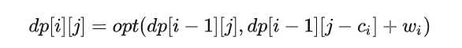

- 我们把它改成深度优先搜索的递归形式，如下：

  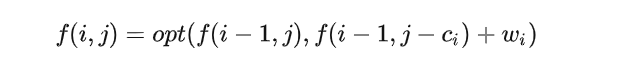

- 就可以套用记忆化搜索了。