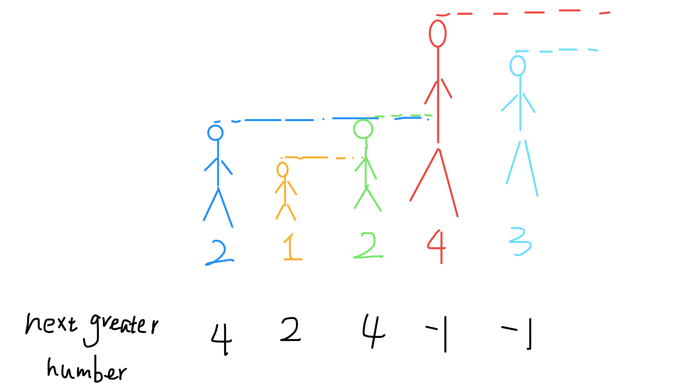
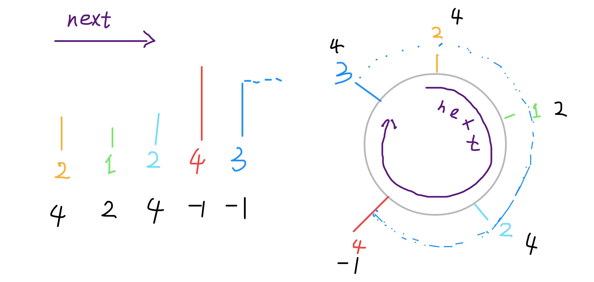
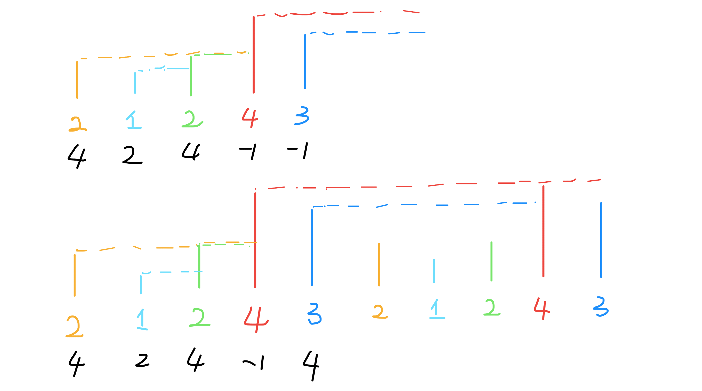
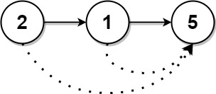

# 单调栈

单调栈是一种基于栈进行的算法。

## 使用场景&原理
解决的问题：==求解下一个大于当前元素或者是小于当前元素的位置==

+ 空间换时间，暴力解法，O^2)可解，借助额外空间实现了降维，O()可解。
+ 求下一个更大元素时，构造单调递减的栈，遍历时一旦找到比栈顶大的元素，就可以把栈顶
  弹出，视为找到了栈顶元素的下一个更大元素。

```c++
//遍历下标：i
//arr:
//73,74,75,71,69,72,76,73
//stack:76,73
//res:74,75,76,72,72,76,?,?
```

## 模版

**求下一个更大元素**

```c++
vector<int> nextGreaterElement(vector<int>& nums) {
    vector<int> ans(nums.size()); // 存放答案的数组
    stack<int> s;                 // 单调栈
    for (int i = nums.size() - 1; i >= 0; i--) 
    { // 倒着往栈里放
        while (!s.empty() && s.top() <= nums[i]) 
        { // 判定个子高矮
            s.pop(); // 矮个起开，反正也被挡着了。。。
        }
        //根据业务处理
        ans[i] = s.empty() ? -1 : s.top(); // 保存下一个更大元素
        s.push(nums[i]); // 进队，接受之后的身高判定吧！
    }
    return ans;
}
```

栈（stack）是很简单的一种数据结构，先进后出的逻辑顺序，符合某些问题的特点，比如说函数调用栈。

单调栈实际上就是栈，只是利用了一些巧妙的逻辑，使得每次新元素入栈后，栈内的元素都保持有序（单调递增或单调递减）。

听起来有点像堆（heap）？不是的，单调栈用途不太广泛，只处理一种典型的问题，叫做 Next Greater Element。本文用讲解单调队列的算法模版解决这类问题，并且探讨处理「循环数组」的策略。

首先，讲解 Next Greater Number 的原始问题：给你一个数组，返回一个等长的数组，对应索引存储着下一个更大元素，如果没有更大的元素，就存 -1。不好用语言解释清楚，直接上一个例子：

给你一个数组 [2,1,2,4,3]，你返回数组 [4,2,4,-1,-1]。

解释：第一个 2 后面比 2 大的数是 4; 1 后面比 1 大的数是 2；第二个 2 后面比 2 大的数是 4; 4 后面没有比 4 大的数，填 -1；3 后面没有比 3 大的数，填 -1。

这道题的暴力解法很好想到，就是对每个元素后面都进行扫描，找到第一个更大的元素就行了。但是暴力解法的时间复杂度是 O(n^2)。

这个问题可以这样抽象思考：把数组的元素想象成并列站立的人，元素大小想象成人的身高。这些人面对你站成一列，如何求元素「2」的 Next Greater Number 呢？很简单，如果能够看到元素「2」，那么他后面可见的第一个人就是「2」的 Next Greater Number，因为比「2」小的元素身高不够，都被「2」挡住了，第一个露出来的就是答案。



这个情景很好理解吧？带着这个抽象的情景，先来看下代码。

```c++
vector<int> nextGreaterElement(vector<int>& nums) {
    vector<int> ans(nums.size()); // 存放答案的数组
    stack<int> s;
    for (int i = nums.size() - 1; i >= 0; i--) 
    { // 倒着往栈里放
        while (!s.empty() && s.top() <= nums[i]) 
        { // 判定个子高矮
            s.pop(); // 矮个起开，反正也被挡着了。。。
        }
        ans[i] = s.empty() ? -1 : s.top(); // 这个元素身后的第一个高个
        s.push(nums[i]); // 进队，接受之后的身高判定吧！
    }
    return ans;
}
```

这就是单调队列解决问题的模板。for 循环要从后往前扫描元素，因为我们借助的是栈的结构，倒着入栈，其实是正着出栈。while 循环是把两个“高个”元素之间的元素排除，因为他们的存在没有意义，前面挡着个“更高”的元素，所以他们不可能被作为后续进来的元素的 Next Great Number 了。

这个算法的时间复杂度不是那么直观，如果你看到 for 循环嵌套 while 循环，可能认为这个算法的复杂度也是 O(n^2)，但是实际上这个算法的复杂度只有 O(n)。

分析它的时间复杂度，要从整体来看：总共有 n 个元素，每个元素都被 push 入栈了一次，而最多会被 pop 一次，没有任何冗余操作。所以总的计算规模是和元素规模 n 成正比的，也就是 O(n) 的复杂度。

现在，你已经掌握了单调栈的使用技巧，来一个简单的变形来加深一下理解。

给你一个数组 T = [73, 74, 75, 71, 69, 72, 76, 73]，这个数组存放的是近几天的天气气温（这气温是铁板烧？不是的，这里用的华氏度）。你返回一个数组，计算：对于每一天，你还要至少等多少天才能等到一个更暖和的气温；如果等不到那一天，填 0 。

举例：给你 T = [73, 74, 75, 71, 69, 72, 76, 73]，你返回 [1, 1, 4, 2, 1, 1, 0, 0]。

解释：第一天 73 华氏度，第二天 74 华氏度，比 73 大，所以对于第一天，只要等一天就能等到一个更暖和的气温。后面的同理。

你已经对 Next Greater Number 类型问题有些敏感了，这个问题本质上也是找 Next Greater Number，只不过现在不是问你 Next Greater Number 是多少，而是问你当前距离 Next Greater Number 的距离而已。

相同类型的问题，相同的思路，直接调用单调栈的算法模板，稍作改动就可以啦，直接上代码把。

```c++
vector<int> dailyTemperatures(vector<int>& T) {
    vector<int> ans(T.size());
    stack<int> s; // 这里放元素索引，而不是元素
    for (int i = T.size() - 1; i >= 0; i--) 
    {
        while (!s.empty() && T[s.top()] <= T[i]) 
        {
            s.pop();
        }
        ans[i] = s.empty() ? 0 : (s.top() - i); // 得到索引间距
        s.push(i); // 加入索引，而不是元素
    }
    return ans;
}
```

单调栈讲解完毕。

下面开始另一个重点：如何处理「循环数组」。

同样是 Next Greater Number，现在假设给你的数组是个环形的，如何处理？

给你一个数组 [2,1,2,4,3]，你返回数组 [4,2,4,-1,4]。拥有了环形属性，最后一个元素 3 绕了一圈后找到了比自己大的元素 4 。



首先，计算机的内存都是线性的，没有真正意义上的环形数组，但是我们可以模拟出环形数组的效果，**一般是通过 % 运算符求模（余数），获得环形特效：**

```c++
int[] arr = {1,2,3,4,5};
int n = arr.length, index = 0;
while (true) {
    print(arr[index % n]);
    index++;
}
```

回到 Next Greater Number 的问题，增加了环形属性后，问题的难点在于：这个 Next 的意义不仅仅是当前元素的右边了，有可能出现在当前元素的左边（如上例）。

明确问题，问题就已经解决了一半了。我们可以考虑这样的思路：将原始数组“翻倍”，就是在后面再接一个原始数组，这样的话，按照之前“比身高”的流程，每个元素不仅可以比较自己右边的元素，而且也可以和左边的元素比较了。



怎么实现呢？你当然可以把这个双倍长度的数组构造出来，然后套用算法模板。但是，我们可以不用构造新数组，而是利用循环数组的技巧来模拟。直接看代码吧：

```c++
vector<int> nextGreaterElements(vector<int>& nums) {
    int n = nums.size();
    vector<int> res(n); // 存放结果
    stack<int> s;
    // 假装这个数组长度翻倍了
    for (int i = 2 * n - 1; i >= 0; i--) 
    {
        while (!s.empty() && s.top() <= nums[i % n])
            s.pop();
        res[i % n] = s.empty() ? -1 : s.top();
        s.push(nums[i % n]);
    }
    return res;
}
```

### [739. 每日温度](https://leetcode.cn/problems/daily-temperatures/)

给定一个整数数组 `temperatures` ，表示每天的温度，返回一个数组 `answer` ，其中 `answer[i]` 是指对于第 `i` 天，下一个更高温度出现在几天后。如果气温在这之后都不会升高，请在该位置用 `0` 来代替。

 

**示例 1:**

```
输入: temperatures = [73,74,75,71,69,72,76,73]
输出: [1,1,4,2,1,1,0,0]
```


```c++
class Solution {
public:
    vector<int> dailyTemperatures(vector<int>& T) {
        stack<int> st; // 递增栈
        vector<int> result(T.size(), 0);
        for (int i = 0; i < T.size(); i++) 
        {
            while (!st.empty() && T[i] > T[st.top()]) 
            { // 注意栈不能为空
                st.pop();
                //根据业务处理
                result[st.top()] = i - st.top();
                
            }
            st.push(i);

        }
        return result;
    }
};
```

### [496. 下一个更大元素 I](https://leetcode.cn/problems/next-greater-element-i/)

`nums1` 中数字 `x` 的 **下一个更大元素** 是指 `x` 在 `nums2` 中对应位置 **右侧** 的 **第一个** 比 `x` 大的元素。

给你两个 **没有重复元素** 的数组 `nums1` 和 `nums2` ，下标从 **0** 开始计数，其中`nums1` 是 `nums2` 的子集。

对于每个 `0 <= i < nums1.length` ，找出满足 `nums1[i] == nums2[j]` 的下标 `j` ，并且在 `nums2` 确定 `nums2[j]` 的 **下一个更大元素** 。如果不存在下一个更大元素，那么本次查询的答案是 `-1` 。

返回一个长度为 `nums1.length` 的数组 `ans` 作为答案，满足 `ans[i]` 是如上所述的 **下一个更大元素** 。

 

**示例 1：**

```
输入：nums1 = [4,1,2], nums2 = [1,3,4,2].
输出：[-1,3,-1]
解释：nums1 中每个值的下一个更大元素如下所述：
- 4 ，用加粗斜体标识，nums2 = [1,3,4,2]。不存在下一个更大元素，所以答案是 -1 。
- 1 ，用加粗斜体标识，nums2 = [1,3,4,2]。下一个更大元素是 3 。
- 2 ，用加粗斜体标识，nums2 = [1,3,4,2]。不存在下一个更大元素，所以答案是 -1 。
```

```
输入：nums1 = [2,4], nums2 = [1,2,3,4].
输出：[3,-1]
解释：nums1 中每个值的下一个更大元素如下所述：
- 2 ，用加粗斜体标识，nums2 = [1,2,3,4]。下一个更大元素是 3 。
- 4 ，用加粗斜体标识，nums2 = [1,2,3,4]。不存在下一个更大元素，所以答案是 -1 。
```

 

```c++
class Solution {
public:
    vector<int> nextGreaterElement(vector<int>& nums1, vector<int>& nums2) {
        unordered_map<int,int> hashmap;
        stack<int> st;
        for (int i = nums2.size() - 1; i >= 0; --i) 
        {
            int num = nums2[i];
            while (!st.empty() && st.top() <= num)  // 判定个子高矮
            {
                st.pop(); // 矮个起开，反正也被挡着了。。。
            }
            
            hashmap[num] = st.empty() ? -1 : st.top(); // 这个元素身后的第一个高个
            st.push(num); // 进队，接受之后的身高判定吧！
        }
        
        vector<int> res(nums1.size());
        for (int i = 0; i < nums1.size(); ++i) 
        {
            res[i] = hashmap[nums1[i]];  // nums1 中每个值的下一个更大元素
        }
        return res;
    }
};

```

### [503. 下一个更大元素 II](https://leetcode.cn/problems/next-greater-element-ii/)

给定一个循环数组 `nums` （ `nums[nums.length - 1]` 的下一个元素是 `nums[0]` ），返回 *`nums` 中每个元素的 **下一个更大元素*** 。

数字 `x` 的 **下一个更大的元素** 是按数组遍历顺序，这个数字之后的第一个比它更大的数，这意味着你应该循环地搜索它的下一个更大的数。如果不存在，则输出 `-1` 。

 

**示例 1:**

```
输入: nums = [1,2,1]
输出: [2,-1,2]
解释: 第一个 1 的下一个更大的数是 2；
数字 2 找不到下一个更大的数； 
第二个 1 的下一个最大的数需要循环搜索，结果也是 2。
```

**示例 2:**

```
输入: nums = [1,2,3,4,3]
输出: [2,3,4,-1,4]
```

```c++
class Solution {
public:
    vector<int> nextGreaterElements(vector<int>& nums) {
        int n = nums.size();
        vector<int> res(n); // 存放结果
        stack<int> s;
        
        // 假装这个数组长度翻倍了
        for (int i = 2 * n - 1; i >= 0; i--) 
        {
            while (!s.empty() && s.top() <= nums[i % n])
                s.pop();
            res[i % n] = s.empty() ? -1 : s.top();
            s.push(nums[i % n]);  //i % n 模拟循环
        }
        return res;
    }
};
```


### [1019. 链表中的下一个更大节点](https://leetcode.cn/problems/next-greater-node-in-linked-list/)

给定一个长度为 `n` 的链表 `head`

对于列表中的每个节点，查找下一个 **更大节点** 的值。也就是说，对于每个节点，找到它旁边的第一个节点的值，这个节点的值 **严格大于** 它的值。

返回一个整数数组 `answer` ，其中 `answer[i]` 是第 `i` 个节点( **从1开始** )的下一个更大的节点的值。如果第 `i` 个节点没有下一个更大的节点，设置 `answer[i] = 0` 。

 

**示例 1：**



```
输入：head = [2,1,5]
输出：[5,5,0]
```

**示例 2：**


```
输入：head = [2,7,4,3,5]
输出：[7,0,5,5,0]
```

```c++
class Solution {
    // 206. 反转链表
    ListNode *reverseList(ListNode *head) {
        ListNode* cur = head;
        ListNode* pre = nullptr;
        ListNode* temp;
        
        while (cur)
        {
            temp = cur->next; // 反转后找不到原来 cur的下一个位置
            cur->next = pre;  // 反转操作
            pre = cur;  // 更新pre位置
            cur = temp; // 更新cur位置
        }
        
        return pre;
    }

public:
    vector<int> nextLargerNodes(ListNode *head) {
        head = reverseList(head);
        vector<int> ans;
        stack<int> st; // 单调栈（节点值）
        for (auto cur = head; cur; cur = cur->next) 
        {
            while (!st.empty() && st.top() <= cur->val)
                st.pop(); // 弹出无用数据
            // 栈顶就是第 i 个节点的下一个更大元素
            ans.push_back(st.empty() ? 0 : st.top());
            st.push(cur->val);
        }
        // 由于是倒着记录答案的，返回前要把答案反转
        reverse(ans.begin(), ans.end());
        return ans;
    }
};
```

