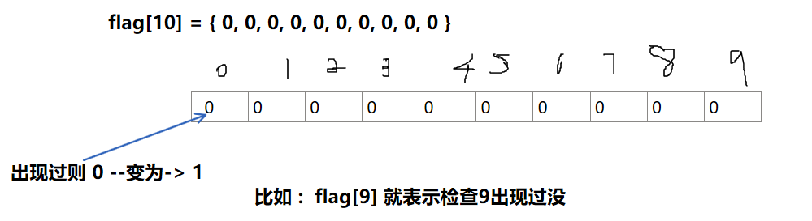
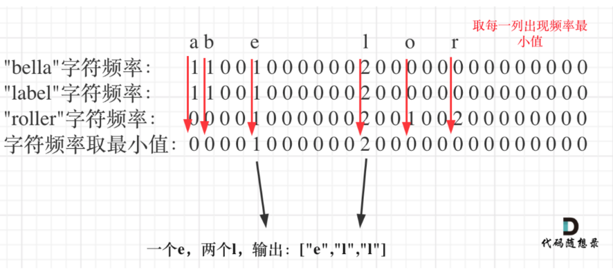
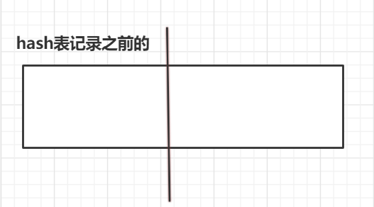

# 哈希

## 基础知识

**hash: 判断出没出项过, 统计**

**要求: 题目不考虑顺序**

使用哈希法来解决问题的时候，一般会选择如下三种数据结构:

+ 数组
+ set（集合)   故可以自动去重
+ map(映射) 

**总结:**

+ 有范围,并且小的话 

  + **优先使用辅助数组**(比如: `2 <= nums.length <= 10^4`)
+ 其他用hash  

  + **unorder_set        集合, 去重, 只能存一个key**   
  + **unordered_map   一次存入两个东西键和值**(不能用Vector<>做键)

## 辅助数组

==**使用辅助数组的方法 :**==



+ 下标代表要检查的内容,  **标记得是值**(及范围是值的范围)

+ **只能储存整型(字符需要转换)**比如:(字符 - 'a' = 数字(0开始))

+ 元素:  状态(代表是否出现过)

  ```c++
  int flag[10] = {0}; //辅助数组
  ```

  ```c++
  vector<string> A = {"word"};
  int hash[26] = {0}; // 用来统计所有字符串里字符出现的最小频率
  for (int i = 0; i < A[0].size(); i++) { // 用第一个字符串给hash初始化
      hash[A[0][i] - 'a']++;
  }
  ```


### [1002. 查找共用字符](https://leetcode.cn/problems/find-common-characters/)

  给你一个字符串数组 `words` ，请你找出所有在 `words` 的每个字符串中都出现的共用字符（ **包括重复字符**），并以数组形式返回。你可以按 **任意顺序** 返回答案。

   

  **示例 1：**

  ```
  输入：words = ["bella","label","roller"]
  输出：["e","l","l"]
  ```

  

```c++
class Solution {
public:
    vector<string> commonChars(vector<string>& words) {
        if (words.size() == 1)
            return words;
        
        // hash数组
        int hash[26] = {0};
        for(int i = 0; i < words[0].size(); i++)
        {
            hash[words[0][i] - 'a']++;
        }

        int hashOtherStr[26] = {0}; //将其他字符串加入到另一个哈希表中去
        for (int i = 1; i < words.size(); ++i)
        {
            memset(hashOtherStr, 0, sizeof(hashOtherStr)); //每一次都要对hashOtherStr数组进行重新初始化
            for (int j = 0; j < words[i].size(); ++j)
            {
                hashOtherStr[words[i][j] - 'a']++;
            }
            //进行最小值得判断
            for (int k = 0; k < 26; ++k)
            {
                hash[k] = min(hashOtherStr[k], hash[k]);
            }
        }

        vector<string> ans;
        for (int i = 0; i < 26; ++i)
        {
            //由于每个单词存在重复的字母所以此处是while而不是if
            while(hash[i] != 0)
            {
                string s(1, i + 'a');// char -> string
                ans.push_back(s);//再加入到字符串数组中去
                hash[i]--;
            }
        }

        return ans;
    }
};
```

### [1160. 拼写单词](https://leetcode.cn/problems/find-words-that-can-be-formed-by-characters/)

给你一份『词汇表』（字符串数组） `words` 和一张『字母表』（字符串） `chars`。

假如你可以用 `chars` 中的『字母』（字符）拼写出 `words` 中的某个『单词』（字符串），那么我们就认为你掌握了这个单词。

注意：每次拼写（指拼写词汇表中的一个单词）时，`chars` 中的每个字母都只能用一次。

返回词汇表 `words` 中你掌握的所有单词的 **长度之和**。

 

**示例 1：**

```
输入：words = ["cat","bt","hat","tree"], chars = "atach"
输出：6
解释： 
可以形成字符串 "cat" 和 "hat"，所以答案是 3 + 3 = 6。
```

```c++
class Solution {
public:
    int countCharacters(vector<string>& words, string chars) {
        /*
        每次拼写（指拼写词汇表中的一个单词）时，chars 中的每个字母都只能用一次。
        */
        int hash[26] = {0};
        for (int i = 0; i < chars.size(); i++)
        {
            ++hash[chars[i] - 'a'];
        }

        bool flag;
        int sum = 0;
        for (auto str : words)
        {
            int cnt[26];
            copy(begin(hash), end(hash), begin(cnt));

            flag = false;
            for (auto ch : str)
            {
                if (cnt[ch - 'a'] == 0)
                {
                    flag = true;
                    break;
                }
                --cnt[ch - 'a'];//只能用一次
            }
            if (!flag)
            {
                sum += str.size();
            }
        }

        return sum;
    }
};
```


## 哈希表

### 查找

+ find 
+ count

通过键查找相应的值

```c++
#include<iostream>
#include<map>
#include<string>
using namespace std;

int main()
{
    map<int,string>maps;
    if(maps.find(1)==maps.end())     //失败返回的迭代器指向end。
    {
        cout<<"没有1这个元素"<<endl;
    }
    if(maps.count(1)==0)             //0表示没有这个元素。
    {
        cout<<"没有1这个元素"<<endl;
    }
    //添加元素1
    maps[1]="one";

    if(maps.find(1)!=maps.end())
    {
        cout<<"有1这个元素"<<endl;
    }
    if(maps.count(1))
    {
        cout<<"有1这个元素"<<endl;
    }
    return 0;

```

==**插入:**==

用insert插入pair数据

```c++
mapStudent.insert(pair<int, string>(2, "student_one"));  
```

==**遍历:**==

```c++
for (auto &[_,cnt] : myHash)    
{
}
//或者用second 和 first
```

### 使用map()方法

==**常见应用:**==

**1.使用map标记单元素出现次数**

```c++
// 标记出现次数
unordered_map<char, int> count;
for (char &ch : s) 
    ++count[ch];

    
--count[ch]; // 消去出现次数 // 适用于ch不会出现新的,否则就要用两个hash
```

[1460. 通过翻转子数组使两个数组相等](https://leetcode.cn/problems/make-two-arrays-equal-by-reversing-subarrays/)

给你两个长度相同的整数数组 `target` 和 `arr` 。每一步中，你可以选择 `arr` 的任意 **非空子数组** 并将它翻转。你可以执行此过程任意次。

*如果你能让 `arr` 变得与 `target` 相同，返回 True；否则，返回 False 。*

**示例 1：**

```
输入：target = [1,2,3,4], arr = [2,4,1,3]
输出：true
解释：你可以按照如下步骤使 arr 变成 target：
1- 翻转子数组 [2,4,1] ，arr 变成 [1,4,2,3]
2- 翻转子数组 [4,2] ，arr 变成 [1,2,4,3]
3- 翻转子数组 [4,3] ，arr 变成 [1,2,3,4]
上述方法并不是唯一的，还存在多种将 arr 变成 target 的方法。
```

```c++
class Solution {
public:
    bool canBeEqual(vector<int>& target, vector<int>& arr) {
        unordered_map<int, int> counts1, counts2;
        for (int num : target) 
        {
            counts1[num]++;
        }
        for (int num : arr) 
        {
            counts2[num]++;
        }
        if (counts1.size() != counts2.size()) 
        {
            return false;
        }
        
        for (auto &[key, value] : counts1) 
        {
            if (!counts2.count(key) || counts2[key] != value) 
            {
                return false;
            }
        }
        
        return true;
    }
};
```


**2.出现最多的**

```c++
string mostFrequentString;
int maxCount = 0;
for (const auto& pair : map) 
{
    if (pair.second > maxCount)
    {
        mostFrequentString = pair.first;
        maxCount = pair.second;
    }
}

// 方法2
// 在插入数据的过程中求出出现最多的
string mostFrequentString;
int maxCount = 0;
while(....)
{
    map[word]++;
    if (map[word] > maxCount) 
    {
        maxCount = map[word];
        mostFrequentString = word;
    }
    /*单纯得到最多次数 用这个
      maxCount = max(maxCount, hash[s[i]]); 
     */
}
```

### 使用set的方法

+ set集合默认是无序的

+ 标记链表的元素

  ```c++
  unordered_set<int> occurred = {head->val};
  ```

+ **通存入去重和调用方法解决问题**(不像map一样需要一个for去存入)

  ```c++
  //方法1
  result_set.insert(num); // 插入一个数据
  //方法2
  unordered_set<int> nums_set(nums1.begin(), nums1.end());  // 插入数组
  //方法3
  set<pair<int, int>> ms;  //unordered_set没有pair
  int x = 0, y = 0;
  ms.insert({ x, y });
  ```

+ ==查找:==

  ```c++
   set.find(sum) != set.end()  //如果数存在的话  // 比count()快点
  // or
  set.count(sum) == 1
  ```

[1496. 判断路径是否相交](https://leetcode.cn/problems/path-crossing/)

给你一个字符串 `path`，其中 `path[i]` 的值可以是 `'N'`、`'S'`、`'E'` 或者 `'W'`，分别表示向北、向南、向东、向西移动一个单位。

你从二维平面上的原点 `(0, 0)` 处开始出发，按 `path` 所指示的路径行走。

如果路径在任何位置上与自身相交，也就是走到之前已经走过的位置，请返回 `true` ；否则，返回 `false` 。

**示例 1：**


```
输入：path = "NES"
输出：false 
解释：该路径没有在任何位置相交。
```

```c++
class Solution {
public:
    bool isPathCrossing(string path) {
        set<pair<int, int>> ms;  //unordered_set没有pair
        int x = 0, y = 0;
        ms.insert({ x, y });
        for (auto& ch : path)
        {
            if (ch == 'N') ++y;
            else if (ch == 'S') --y;
            else if (ch == 'E') ++x;
            else if (ch == 'W') --x;
            if (ms.count({ x, y })) //找到了
                return true;
            ms.insert({ x, y });
        }
        return false;
    }
};
```

### 使用multiset()

 **插入时自动由小到大排序的**

是<set>库中一个非常有用的类型，它可以看成一个序列，插入一个数，删除一个数都能够在O(logn)的时间内完成，而且==他能时刻保证序列中的数是有序的从下到大，而且序列中可以存在重复的数==。比如对于输入数据：32 61 12 2 12 0,该程序的输出是：2 12 12 32 61。 

[703. 数据流中的第 K 大元素](https://leetcode.cn/problems/kth-largest-element-in-a-stream/)

设计一个找到数据流中第 `k` 大元素的类（class）。注意是排序后的第 `k` 大元素，不是第 `k` 个不同的元素。

请实现 `KthLargest` 类：

- `KthLargest(int k, int[] nums)` 使用整数 `k` 和整数流 `nums` 初始化对象。
- `int add(int val)` 将 `val` 插入数据流 `nums` 后，返回当前数据流中第 `k` 大的元素。

**示例：**

```
输入：
["KthLargest", "add", "add", "add", "add", "add"]
[[3, [4, 5, 8, 2]], [3], [5], [10], [9], [4]]
输出：
[null, 4, 5, 5, 8, 8]

解释：
KthLargest kthLargest = new KthLargest(3, [4, 5, 8, 2]);
kthLargest.add(3);   // return 4
kthLargest.add(5);   // return 5
kthLargest.add(10);  // return 5
kthLargest.add(9);   // return 8
kthLargest.add(4);   // return 8
```

```c++
class KthLargest {
private:
    int k;
    multiset<int> st;
public:
    KthLargest(int K, vector<int>& nums) {
        for (int n : nums) 
        {
            st.insert(n);
            if (st.size() > K) st.erase(st.begin());  //看前面k个元素就行
        }       
       this->k = K;
    }
    
    int add(int val) 
    {
        st.insert(val);
        if (st.size() > k) st.erase(st.begin());
        return *st.begin();
    }
};
```

###  std::all_of()

当您有一个元素范围/数组并且想要检查给定范围内的所有元素是否满足给定条件时，此 STL 算法很有用。它与 std::any_of() 正好相反。

#### 将 std::all_of() 与 Lambda 函数一起使用

假设我们有一个字符串向量，即

```
// 一个字符串向量
std::vector < std::string > wordList = { "Hi" , "Hello" , "Test" , "First" , "Second" , "Third" , "Fourth" } ;
```

现在我们想使用 std::all_of() 检查向量中的所有字符串是否具有相同的大小

```
/*
 Check if all strings in vector are of same size i.e. 4.
 */
bool result = std::all_of(wordList.begin(), wordList.end(), [](const std::string & str) {
                                                                return str.size() == 4;
                                                                });
```

std::all_of() 将遍历 vector 中的所有字符串，对于 vector 中的每个字符串，它调用传递的 lambda 函数，该函数检查字符串的大小是否为 4。如果对于任何字符串，则 lambda 函数返回 false，std::all_of () 将停止进一步的迭代并返回 false 否则返回 true。

现在使用 all_of() 检查向量中的所有字符串是否以大写字母开头

```
/*
 Check if all strings in vector starts with a Upper Case Letter
 */
result = std::all_of(wordList.begin(), wordList.end(), [](const std::string & str) {
                                                return str.size() > 0 && ::isupper(str[0]);
                                                });
```

#### 将 std::all_of() 与函数指针一起使用

```c++
std::string str = "testString" ;

/*
 Check if given string contains all lower case letters i.e. not a single upper case char
 */
result = std::all_of(str.begin(), str.end(), ::islower);
```

#### 将 std::all_of() 与数组一起使用

假设我们有一个数组，即

```
int arr [] = { 3,9,75,15,12 } ;
```

现在我们将使用 all_of() 检查数组中的所有数字是否都是 3 的倍数，即

```
// 检查数组中的所有数字是否都是 3 的倍数，即
result = std::all_of(arr, arr + sizeof(arr)/ sizeof(int), [](const int & i){ return i%3 == 0; });
```

## 例题

#### [242. 有效的字母异位词](https://leetcode.cn/problems/valid-anagram/)

给定两个字符串 s 和 t ，编写一个函数来判断 t 是否是 s 的字母异位词。

注意：若 s 和 t 中每个字符出现的次数都相同，则称 s 和 t 互为字母异位词。

**示例 1:**

```
输入: s = "anagram", t = "nagaram"
输出: true
```

**map**

```c++
class Solution 
{
public:
    bool isAnagram(string s, string t) 
    {
        // 若 s 和 t 中每个字符出现的次数都相同就是异位词
        unordered_map<char, int> map;
        for (char ss : s)
            ++map[ss];
        for (char st : t)
            --map[st];
        for (auto [_,stn]: map)
        {    
            if (stn != 0)
                return false;
        }    
        return true;
    }   
};
```

**辅助数组(因为有范围)**

```c++
class Solution 
{
public:
    bool isAnagram(string s, string t) 
    {
        // 若 s 和 t 中每个字符出现的次数都相同就是异位词
        // s 和 t 仅包含小写字母 -->26个
        int flag[26] = {0};
        for (char ss : s)
        {
            ++flag[ss - 'a'];
        }
        for (char st : t)
        {
            --flag[st - 'a'];
        }
        for (char n : flag)
        {
            if (n != 0)
                return false;
        }
        return true;
    }   
};
```

#### [349. 两个数组的交集](https://leetcode.cn/problems/intersection-of-two-arrays/)

给定两个数组 `nums1` 和 `nums2` ，返回 *它们的交集* 。输出结果中的每个元素一定是 **唯一** 的。我们可以 **不考虑输出结果的顺序** 。

**示例 1：**

```
输入：nums1 = [4,9,5], nums2 = [9,4,9,8,4]
输出：[9,4]
解释：[4,9] 也是可通过的
```


**set**

输出结果中的每个元素一定是唯一的，也就是说输出的结果的去重的， 同时可以不考虑输出结果的顺序

```c++
class Solution 
{
public:
    vector<int> intersection(vector<int>& nums1, vector<int>& nums2) 
    {
        //返回 它们的交集
        //每个元素唯一 . 
        //不考虑输出结果的顺序 
        unordered_set<int> result_set(nums1.begin(), nums1.end());  // 这里就自动去重了
        unordered_set<int> result;
        for (int n : nums2)
        {
            if (result_set.count(n))
                result.insert(n);
        }
        return vector<int> (result.begin(), result.end());
    }
};
```

####[506. 相对名次](https://leetcode.cn/problems/relative-ranks/)

给你一个长度为 n 的整数数组 score ，其中 score[i] 是第 i 位运动员在比赛中的得分。所有得分都 互不相同 。

运动员将根据得分 决定名次 ，其中名次第 1 的运动员得分最高，名次第 2 的运动员得分第 2 高，依此类推。运动员的名次决定了他们的获奖情况：

名次第 1 的运动员获金牌 "Gold Medal" 。
名次第 2 的运动员获银牌 "Silver Medal" 。
名次第 3 的运动员获铜牌 "Bronze Medal" 。
从名次第 4 到第 n 的运动员，只能获得他们的名次编号（即，名次第 x 的运动员获得编号 "x"）。
使用长度为 n 的数组 answer 返回获奖，其中 answer[i] 是第 i 位运动员的获奖情况。

**示例 2：**

```
输入：score = [10,3,8,9,4]
输出：["Gold Medal","5","Bronze Medal","Silver Medal","4"]
解释：名次为 [1st, 5th, 3rd, 2nd, 4th] 。
```

**map**

```c++
class Solution 
{
public:
    vector<string> findRelativeRanks(vector<int>& nums) 
    {
        vector<int> org = nums;
        sort(nums.rbegin(), nums.rend());  // 从大到小
        unordered_map<int, string> order;
        // 用哈希表映射一下
        for (int i = 0; i < nums.size(); i++) 
        {
            if (i >= 3) order[nums[i]] = to_string(i+1);
            if (i == 0) order[nums[i]] = "Gold Medal";
            if (i == 1) order[nums[i]] = "Silver Medal";
            if (i == 2) order[nums[i]] = "Bronze Medal";
        }
        
        vector<string> res(nums.size(), "");
        for (int i = 0; i < res.size(); i++) 
        {
            res[i] = order[org[i]];
        }
        return res;
    }
};

```

#### [454. 四数相加 II](https://leetcode.cn/problems/4sum-ii/)

给你四个整数数组 nums1、nums2、nums3 和 nums4 ，数组长度都是 n ，请你计算有多少个元组 (i, j, k, l) 能满足：

    0 <= i, j, k, l < n
    nums1[i] + nums2[j] + nums3[k] + nums4[l] == 0

示例 1：

 ```
  输入：nums1 = [1,2], nums2 = [-2,-1], nums3 = [-1,2], nums4 = [0,2]
  输出：2
  解释：
  两个元组如下：
  
  1. (0, 0, 0, 1) -> nums1[0] + nums2[0] + nums3[0] + nums4[1] = 1 + (-2) + (-1) + 2 = 0
  2. (1, 1, 0, 0) -> nums1[1] + nums2[1] + nums3[0] + nums4[0] = 2 + (-1) + (-1) + 0 = 0
 ```

   

**map**

```c++
class Solution 
{
public:
    int fourSumCount(vector<int>& nums1, vector<int>& nums2, vector<int>& nums3, vector<int>& nums4) 
    { 
        // 四个数组
        // 找到相加等于0的
        unordered_map<int, int> map;
        for (int n1 : nums1)
        {
            for (int n2 : nums2)
            {
                ++map[n1 + n2];    // 得到所有的组合
            }
        }
        int count = 0;
        for (int n3 : nums3)
        {
            for (int n4 : nums4)
            {
                if (map.find(0 - (n3 + n4)) != map.end())
                {
                    count += map[0 - (n3 + n4)];;
                }
            }
        }
        return count;
    }
};

```

#### [383. 赎金信](https://leetcode.cn/problems/ransom-note/)

给你两个字符串：ransomNote 和 magazine ，判断 ransomNote 能不能由 magazine 里面的字符构成。

如果可以，返回 true ；否则返回 false 。

magazine 中的每个字符只能在 ransomNote 中使用一次。

**示例 1：**

```
输入：ransomNote = "a", magazine = "b"
输出：false
```

**map: **

```c++
class Solution 
{
public:
    bool canConstruct(string ransomNote, string magazine) 
    {
        //ransomNote 能不能由 magazine 里面的字符构成。
        //magazine 中的每个字符只能在 ransomNote 中使用一次。
        unordered_map<char, int> map;
        for (char r : ransomNote)
        {
            ++map[r];
        }
        for (char m : magazine)
        {
            --map[m];
        }
        for (char r : ransomNote)
        {
            if (map[r] >= 1)
                return false;
        } 
        return true;
    }
};
```


**辅助:**

```c++
class Solution 
{
public:
    bool canConstruct(string ransomNote, string magazine) 
    {
        //ransomNote 能不能由 magazine 里面的字符构成。
        //magazine 中的每个字符只能在 ransomNote 中使用一次。
        int map[26] = {0};
        for (char r : ransomNote)
        {
            ++map[r - 'a'];
        }
        for (char m : magazine)
        {
            --map[m - 'a'];
        }
        for (char r : ransomNote)
        {
            if (map[r - 'a'] >= 1)
                return false;
        } 
        return true;
    }
};
```

#### [15. 三数之和](https://leetcode.cn/problems/3sum/)

给你一个整数数组 nums ，判断是否存在三元组 [nums[i], nums[j], nums[k]] 满足 i != j、i != k 且 j != k ，同时还满足 nums[i] + nums[j] + nums[k] == 0 。请你返回所有和为 0 且不重复的三元组。

注意：答案中不可以包含重复的三元组。

**示例 1：**

```
输入：nums = [-1,0,1,2,-1,-4]
输出：[[-1,-1,2],[-1,0,1]]
解释：
nums[0] + nums[1] + nums[2] = (-1) + 0 + 1 = 0 。
nums[1] + nums[2] + nums[4] = 0 + 1 + (-1) = 0 。
nums[0] + nums[3] + nums[4] = (-1) + 2 + (-1) = 0 。
不同的三元组是 [-1,0,1] 和 [-1,-1,2] 。
注意，输出的顺序和三元组的顺序并不重要。
```


把符合条件的三元组放进vector中，然后再去重，这样是非常费时的，很容易超时，也是这道题目通过
率如此之低的根源所在。

**双指针**

```c++
class Solution 
{
public:
    vector<vector<int>> threeSum(vector<int>& nums) 
    {
        // 和为 0 且不重复的三元组
        //a = nums[i], b = nums[left], c = nums[right]; 
        vector<vector<int> > result;
        sort(nums.begin(), nums.end());   //-4 -1 -1 0 1 2; 
        for (int i = 0; i < nums.size(); ++i)
        {// 排序之后如果第一个元素已经大于零，那么无论如何组合都不可能凑成三元组，直接返回结果
            if (nums[i] > 0)  
                return result;
            // 错误去重方法，将会漏掉-1,-1,2 这种情况
            /*
            if (nums[i] == nums[i + 1])
            {
            	continue;
            }
            */
            // 正确去重方法
            if (i > 0 && nums[i] == nums[i - 1])
                continue;
            int left = i + 1;
            int right = nums.size() - 1;
            while (right > left)
            {// 去重复逻辑如果放在这里，0，0，0 的情况，可能直接导致 right<=left 了，从而漏掉了 0,0,0 这种三元组
                if (nums[i] + nums[left] + nums[right] > 0)  //大
                {
                    --right;
                    // 当前元素不合适了，可以去重
                    while (left < right && nums[right] == nums[right + 1])
                        --right;
                }
                else if (nums[i] + nums[left] + nums[right] < 0) //小
                {
                    ++left;
                    //不合适，去重
                    while (left < right && nums[left] == nums[left - 1])
                        ++left;
                }
                else  // 刚好
                {
                    result.push_back(vector<int>{nums[i], nums[left], nums[right]});
                    //去重逻辑应该放在找到一个三元组之后
                     while (right > left && nums[right] == nums[right - 1]) 
                        right--;
                    while (right > left && nums[left] == nums[left + 1]) 
                        left++;
                    // 找到答案时，双指针同时收缩
                    --right;
                    ++left;
                }
            }
        }
    return result;
    }
};
```


#### [18. 四数之和](https://leetcode.cn/problems/4sum/)

给你一个由 n 个整数组成的数组 nums ，和一个目标值 target 。请你找出并返回满足下述全部条件且不重复的四元组 [nums[a], nums[b], nums[c], nums[d]] （若两个四元组元素一一对应，则认为两个四元组重复）：

0 <= a, b, c, d < n
a、b、c 和 d 互不相同
nums[a] + nums[b] + nums[c] + nums[d] == target
你可以按 任意顺序 返回答案 。

 示例 1：

```
输入：nums = [1,0,-1,0,-2,2], target = 0
输出：[[-2,-1,1,2],[-2,0,0,2],[-1,0,0,1]]
```


**双指针**

```c++
class Solution 
{
public:
    vector<vector<int>> fourSum(vector<int>& nums, int target) 
    {
        vector<vector<int>> result;
        sort(nums.begin(), nums.end());
        for (int k = 0; k < nums.size(); k++) 
        {
        // 去重
            if (k > 0 && nums[k] == nums[k - 1]) 
                continue;
            for (int i = k + 1; i < nums.size(); i++) 
            { // 正确去重方法 
                if (i > k + 1 && nums[i] == nums[i - 1]) 
                    continue;
                int left = i + 1;
                int right = nums.size() - 1;
                while (right > left) 
                {
                // nums[k] + nums[i] + nums[left] + nums[right] > target 会溢出
                    if (nums[k] + nums[i] > target - (nums[left] + nums[right])) 
                    {
                        right--;
                    // 当前元素不合适了，可以去重
                        while (left < right && nums[right] == nums[right + 1]) 
                            right--;
                    // nums[k] + nums[i] + nums[left] + nums[right] < target 会溢出
                    } 
                    else if (nums[k] + nums[i] < target - (nums[left] + nums[right])) 
                    {
                        left++;
                // 不合适，去重
                        while (left < right && nums[left] == nums[left - 1]) 
                            left++;
                    } 
                    else 
                    {
                        result.push_back(vector<int>{nums[k], nums[i], nums[left],nums[right]});
                // 去重逻辑应该放在找到一个四元组之后
                        while (right > left && nums[right] == nums[right - 1]) 
                            right--;
                         while (right > left && nums[left] == nums[left + 1]) 
                            left++;
                // 找到答案时，双指针同时收缩
                        right--;
                        left++;
                    }
                }
            }

        }
        return result;
    }

};
```

#### [594. 最长和谐子序列](https://leetcode.cn/problems/longest-harmonious-subsequence/)

和谐数组是指一个数组里元素的最大值和最小值之间的差别 正好是 1 。

现在，给你一个整数数组 nums ，请你在所有可能的子序列中找到最长的和谐子序列的长度。

数组的子序列是一个由数组派生出来的序列，它可以通过删除一些元素或不删除元素、且不改变其余元素的顺序而得到。 

**示例 1：**

```
输入：nums = [1,3,2,2,5,2,3,7]
输出：5
解释：最长的和谐子序列是 [3,2,2,2,3]
```


思路:   遍历数组进行哈希计数。
在遍历的同时查看比当前值大一或者小一的元素有多少个；从 cnt[current] + cnt[current+1] ,cnt[current] + cnt[current-1] 中挑选一个更大的即可。

```c++
class Solution 
{
// 遍历数组进行哈希计数。在遍历的同时查看比当前值大一或者小一的元素有多少个；从 cnt[current] + cnt[current+1] , cnt[current] + cnt[current-1] 中挑选一个更大的即可。
public:
    unordered_map<int, int> cnt;

    int findLHS(vector<int>& nums) 
    {
        int ans = 0;
        for (auto n: nums) 
        {
            cnt[n]++;
            if (cnt[n+1]) 
                ans = max(cnt[n] + cnt[n+1], ans);
            if (cnt[n-1]) 
                ans = max(cnt[n] + cnt[n-1], ans);
        }    
        return ans;
    }
};
```


#### [599. 两个列表的最小索引总和](https://leetcode.cn/problems/minimum-index-sum-of-two-lists/)

==查重直接上哈希,  特别是多表查重==

思路:

首先，遍历list1,按照（元素值，索引）存放在哈希表map1中
其次，遍历list2，找到list1中出现过的元素，并计算此时的索引和
最后，判断索引和是否小于minIndex，如果小于，清空ans，并存入当前元素；如果等于，直接存入当前元素；如果大于，则继续遍历

```c++
class Solution 
{
public:
    vector<string> findRestaurant(vector<string>& list1, vector<string>& list2) 
    {
        vector<string> ans;
        const int n = list1.size(), m = list2.size();
     	int minn = n + m + 1;  // 存储最小索引
        unordered_map<string, int> myMap; //记录第一个list的下标
        for(int i = 0; i < n; ++i) 
            myMap[list1[i]] = i;

        for(int i = 0; i < m; ++i)
        {  //遍历list2
            if(myMap.find(list2[i]) != myMap.end())
            { //如果能在myMap里找到
                if(minn > i + myMap[list2[i]])
                {  //下标加和比minn小
                    minn = i + myMap[list2[i]];
                    ans.clear();             //清空ans
                    ans.push_back(list2[i]); //放入答案
                }
                else if(minn == i + myMap[list2[i]]) 
                    ans.push_back(list2[i]);//相等时
            }
        }
        return ans;
    }
};
```


#### [804. 唯一摩尔斯密码词](https://leetcode.cn/problems/unique-morse-code-words/)

```c++
class Solution 
{
public:
    vector<string> table ={".-","-...","-.-.","-..",".","..-.","--.","....","..",".---","-.-",".-..","--","-.","---",".--.","--.-",".-.","...","-","..-","...-",".--","-..-","-.--","--.."};
    int uniqueMorseRepresentations(vector<string>& words) 
    {
        unordered_set<string> set1;
        for(string str : words)
        {
            string temp = "";
            for(char ch : str)
            {
                temp += table[ch-'a'];
            }
            if(set1.count(temp) == 0)
                set1.insert(temp);
        }
        return set1.size();
    }
};
```


#### [6225. 差值数组不同的字符串](https://leetcode.cn/problems/odd-string-difference/)

输入：words = ["adc","wzy","abc"]
输出："abc"
解释：

- "adc" 的差值整数数组是 [3 - 0, 2 - 3] = [3, -1] 。
- "wzy" 的差值整数数组是 [25 - 22, 24 - 25]= [3, -1] 。
- "abc" 的差值整数数组是 [1 - 0, 2 - 1] = [1, 1] 。
  不同的数组是 [1, 1]，所以返回对应的字符串，"abc"。

思路:

解决条件：**count.size == 2,  ans-curIndex**

唯一不同的，只会存两组，当相同的再次遇到就减去相同的下标就剩不同的那个下标值了

假如不相同的在最后，最初相同那组下标记录的也是0，所以ans+i就为不相同那组下标了

```c++
class Solution 
{
public:
    string oddString(vector<string>& words)
    {
        int m = words.size();  // 有几个单词
        int n = words[0].size(); // 单词长度
        map<std::vector<int>, int> count;    // unoreder_map<vector<int>, int> 会报错

        int ans = 0;
        for (int i = 0; i < m; ++i)
        {
            vector<int> vec;
            for (int j = 1; j < n; j++)
            {
                vec.push_back(words[i][j] - words[i][j-1]);
            }
            
            if (count.size() < 2 && !count.count(vec))   // 由题可知hash表最多就只有两个数据
            { 
                count[vec] = i;  // 存的是索引
                ans += i;
            }
            else if (count.size() == 2)
            {
                ans -= count[vec];
                break;
            }       
        }
        return words[ans];
    }
};
```


#### [2287. 重排字符形成目标字符串](https://leetcode.cn/problems/rearrange-characters-to-make-target-string/)

思路: 木桶原理（最短的那块木板是木桶的容量［相当钉子和木板的关系］）
只考虑能用几次，不考虑使用后组成字符串的顺序

```c++
class Solution {
public:
    int rearrangeCharacters(string s, string target) 
    {
        int ans = INT_MAX;
        int target_map[26] = {0};
        int s_map[26] = {0};
        for (char c : s) 
            s_map[c - 'a']++;
        for (char c : target) 
            target_map[c - 'a']++;
        for (char c : target) 
            ans = min(ans, s_map[c - 'a'] / target_map[c - 'a']);
        return ans;
    }
};
```

法2:

```c++
class Solution {
public:
    string greatestLetter(string s) 
    {
        int m[26] = {0};
        sort(s.rbegin(), s.rend());
        for(char c: s) 
        {
            if( isupper(c) ) 
            {
                if(m[c-'A'])
                    return string(1, c);
            } else m[c-'a']++;
        }
        return "";
    }
};
```


#### [2309. 兼具大小写的最好英文字母](https://leetcode.cn/problems/greatest-english-letter-in-upper-and-lower-case/)

思路:  用哈希表一边统计一边判断

```c++
class Solution
{
public:
    string greatestLetter(string s) 
    {
        int map[26] = {0};
        sort(s.rbegin(), s.rend()); // 大->小 
        for(char c: s) 
        { 
            if(isupper(c))
            {
                if (map[c - 'A'] == 1)
                {
                    string ans(1, c);
                    return ans; 
                }
            } 
            else 
                map[c - 'a'] = 1;   //小写存入hash
        }
         return "";
    }
};
```


#### [面试题 16.15. 珠玑妙算](https://leetcode.cn/problems/master-mind-lcci/)

```
输入： solution="RGBY",guess="GGRR"
输出： [1,1]
解释： 猜中1次，伪猜中1次
```

思路: 

直接统计猜中+伪猜中的次数总和即可, 求出所有重复的减去猜中就是伪猜中;

```c++
class Solution {
public:
    vector<int> masterMind(string solution, string guess) 
    {
        //按照题意，要先考虑猜中的情况，即位置+颜色都对，然后剩下的再看是不是伪猜中
        int num1 = 0,num2 = 0;
        unordered_map<char,int> alpha_map;
        for (char ch : solution)
        {
            alpha_map[ch]++;
        }
        for (int i = 0;i < guess.size();i++)
        {
            if (solution[i] == guess[i])
            {
                num1++;
            }
            //注意这里为猜中+伪猜中的次数总和
            if (alpha_map[guess[i]])
            {
                alpha_map[guess[i]]--;
                num2++;
            }
        }
        return {num1,num2 - num1};
    }
};
```

#### [1624. 两个相同字符之间的最长子字符串](https://leetcode.cn/problems/largest-substring-between-two-equal-characters/)

思路:  用哈希表一边统计一边判断2309. 兼具大小写的最好英文字母(2309. 兼具大小写的最好英文字母)



```c++
class Solution
{
public:
    int maxLengthBetweenEqualCharacters(string s)
     {
        unordered_map<int, int> mp;
        int ans = -1;
        for (int i = 0; i < s.size(); ++i) 
        {
            int c = s[i];
            if (mp.count(c)) 
               ans = max(ans, i - mp[c] - 1);
            else 
                mp[c] = i;
        }
        return ans;
    }
};
```

#### [791. 自定义字符串排序](https://leetcode.cn/problems/custom-sort-string/)

思路:  string也可以使用sort()进行自定义排序

```c++
class Solution 
{
public:
    string customSortString(string order, string s)  
    {
        int d[26] = {0};
        for (int i = 0; i < order.size(); ++i) 
            d[order[i] - 'a'] = i;
        sort(s.begin(), s.end(), [&](auto a, auto b) 
        { 
            return d[a - 'a'] < d[b - 'a']; 
        });
        return s;
    }
};
```


# 终点问题

## [1436. 旅行终点站](https://leetcode.cn/problems/destination-city/)

给你一份旅游线路图，该线路图中的旅行线路用数组 `paths` 表示，其中 `paths[i] = [cityAi, cityBi]` 表示该线路将会从 `cityAi` 直接前往 `cityBi` 。请你找出这次旅行的终点站，即没有任何可以通往其他城市的线路的城市*。*

题目数据保证线路图会形成一条不存在循环的线路，因此恰有一个旅行终点站。

 

**示例 1：**

```
输入：paths = [["London","New York"],["New York","Lima"],["Lima","Sao Paulo"]]
输出："Sao Paulo" 
解释：从 "London" 出发，最后抵达终点站 "Sao Paulo" 。本次旅行的路线是 "London" -> "New York" -> "Lima" -> "Sao Paulo" 。
```

```c++
class Solution {
public:
    string destCity(vector<vector<string>>& paths) {
        unordered_map<string,int>  helper;

        for(auto  p:paths) 
        {
            // 终点出度为0
            helper[p[0]] += 1;
            helper[p[1]] += 0;
        }

        for(auto  h:helper)
        {
            if(h.second == 0)
                return h.first;
        }
        
        return "";
    }
};
```


## [2206. 将数组划分成相等数对](https://leetcode.cn/problems/divide-array-into-equal-pairs/)

给你一个整数数组 `nums` ，它包含 `2 * n` 个整数。

你需要将 `nums` 划分成 `n` 个数对，满足：

- 每个元素 **只属于一个** 数对。
- 同一数对中的元素 **相等** 。

如果可以将 `nums` 划分成 `n` 个数对，请你返回 `true` ，否则返回 `false` 。

**示例 1：**

```
输入：nums = [3,2,3,2,2,2]
输出：true
解释：
nums 中总共有 6 个元素，所以它们应该被划分成 6 / 2 = 3 个数对。
nums 可以划分成 (2, 2) ，(3, 3) 和 (2, 2) ，满足所有要求。
```

对于数组 nums\textit{nums}*nums*，它「能被划分成 nn*n* 个相等数对」**等价于**「所有元素的出现次数均为偶数」

```c++
class Solution {
public:
    bool divideArray(vector<int>& nums) {
        unordered_map<int, int> map;   // 元素出现次数哈希表
        for (int num: nums) {
            ++map[num];
        }
        return all_of(map.begin(), map.end(), [](auto p) { return p.second % 2 == 0; });
    }
};
```


