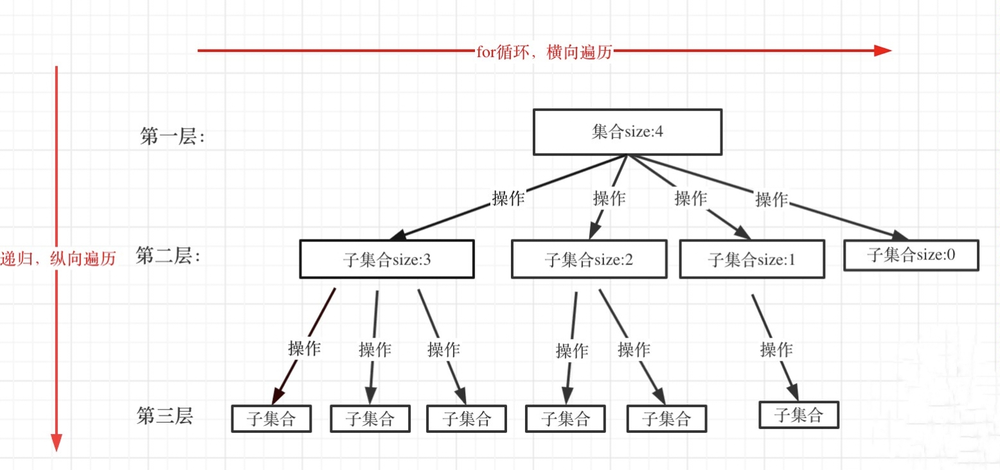

# 回溯算法

## 基本知识

回溯法也可以叫做回溯搜索法，它是⼀种搜索的⽅式。例如⼆叉树：以为使⽤了递归，其实还隐藏着回溯。

回溯是递归的副产品，只要有递归就会有回溯。回溯函数也就是递归函数。

+ 回溯法的效率:   因为回溯的本质是穷举，穷举所有可能，然后选出我们想要的答案，如果想让回溯法⾼效
  ⼀些，可以加⼀些剪枝的操作，但也改不了回溯法就是穷举的本质。所以回溯法并不是什么⾼效的算法。
+ **回溯法解决的问题:** 
  1. 组合问题：N个数⾥⾯按⼀定规则找出k个数的集合
  2. 切割问题：⼀个字符串按⼀定规则有⼏种切割⽅式
  3. ⼦集问题：⼀个N个数的集合⾥有多少符合条件的⼦集
  4. 排列问题：N个数按⼀定规则全排列，有⼏种排列⽅式
  5. 棋盘问题：N皇后，解数独等等

+ 组合⽆序，排列有序:   组合是不强调元素顺序的，排列是强调元素顺序。
  例如：{1, 2} 和 {2, 1} 在组合上，就是⼀个集合，因为不强调顺序，⽽要是排列的话，{1,
  2}和 {2, 1} 就是两个集合了。

**如何理解回溯法?**

```markdown
回溯法解决的所有问题都都可以抽象为树形结构！

因为回溯法解决的都是在集合中递归查找⼦集，集合的⼤⼩就构成了树的宽度，递归的深
度，都构成的树的深度。

递归就要有终⽌条件，所以必然是⼀颗⾼度有限的树（N叉树）。
```

**回溯法模板**

+ 回溯函数模板返回值以及参数

回溯算法中函数返回值⼀般为void。

```c++
void backtracking(参数)
```

+ 回溯函数终⽌条件

```c++
if (终⽌条件) 
{
    存放结果;
    return;
}
```

+ 回溯搜索的遍历过程

回溯法⼀般是在集合中递归搜索，集合的⼤⼩构成了树的宽度，递归的
深度构成的树的深度。



注意图中，举例集合⼤⼩和孩⼦的数量是相等的！

```c++
for (选择：本层集合中元素（树中节点孩⼦的数量就是集合的⼤⼩）)
{
    处理节点;
    backtracking(路径，选择列表); // 递归
    回溯，撤销处理结果
}
```

for循环就是遍历集合区间，可以理解⼀个节点有多少个孩⼦，这个for循环就执⾏多少次。
backtracking这⾥⾃⼰调⽤⾃⼰，实现递归。
可以从图中看出for循环可以理解是横向遍历，backtracking（递归）就是纵向遍历，这样就把这棵树全遍历完了，⼀般来说，搜索叶⼦节点就是找的其中⼀个结果了。

回溯算法模板框架如下：

```c++
void backtracking(参数) 
{
    if (终⽌条件) 
    {
        存放结果;
        return;
    }
    for (选择：本层集合中元素（树中节点孩⼦的数量就是集合的⼤⼩）)
    {
        处理节点;
        backtracking(路径，选择列表); // 递归
        回溯，撤销处理结果
    }
}
```

