数据结构和算法初探

数据结构 + 算法 = 程序 

算法 :   计算机处理问题的步骤

数据结构 : 作为处理对象的数据排序方式


算法是内功(数学是基础思想)

数据结构是算法的基础, 数据才程序的中心,数据结构就是组织数据最有效的排列方式

数据结构就是思想


算法的优劣不在于用多么高级的语思想 +流程控制 +逻辑思维

```
数据结构：
1.基础数据结构（典型数据结构）：栈，队列，树，链表
2.图
3.排序
4.查找/搜索
5.高级数据结构

算法：
贪心算法，分治法，动态规划，回溯法

题：笔试题+面试题
```

**C语言的c++的思想:**

+ c语言-----> 实例化  <-----操作  ,   所以要操作数据结构,就必须传参

+ c++  ----> "本身就是有" ,  封装在里面了, 所以要使用一个数据结构,不用传参

  

# ----------------数据结构-----------------

# 栈(stack)

## 栈的实现原理

1. 并没有产生新的数据类型只是灵活运用   2.  里面的内容可以是任意数据类型    3.   数组 + 循环 --->栈   队列

栈现实映射:   

+ 栈  就像手枪的弹夹，最后一个填入的子弹，第一个射出去，这就是一个典型的栈。  栈是一种**后进先出**的数据结构，它是限定仅在**表尾**进行插入和删除操作的**线性表**。我们把允许插入和删除的一端称为栈顶，另一端称为栈底，不含任何数据元素的栈称为空栈。

+ 栈 就像汉诺塔 如果要拿出最底下的盘子 就一定要先拿走上面的盘子 而最底下的盘子肯定是最早放进去的 **后进先出**


栈的操作:

+ 栈的插入操作， 叫做进栈，也称压栈、入栈。  就像子弹填入弹夹。
+  栈的删除操作，叫做出栈，也有叫做弹栈。  就像弹夹中的子弹出夹。
+ 判断栈是否为空

栈和数组的区别 : **栈每次只能访问栈顶(最顶上的位置)**  而数组可以访问任意的位置

 栈需要指针:

+ 

+ ***思想 : 指向空位置再 操作***

+ ```c
  #include <stdio.h>      //c的
  
  char stack[512];    //栈
  int top = 0;  
  
  void push(char c);  //压入   //入栈
  char pop(void);     //弹出   //出栈
  int is_empty(void);         // 判断是否为空
  
  int main(void)
  {
      push('a');  
      push('b');
      push('c');
  
      while (!is_empty())
      { 
          putchar(pop());      // 输出字符 <stdio.h>    // a = getchar()得到字符
      }
      printf("\n");   // c++ 
      return 0;
  }
  
  //进栈              -----> 本身是针对单个元素而言
  void push(char c)
  {
      stack[top++] = c;     //  入栈就是把某一个运算压入到栈底  再更新位置-->保证:非空栈中的栈顶指针始终在栈顶元素的下一个位置
  }
  
  // 出栈
  char pop(void)
  {
      return stack[--top]; // 保证 : 非空栈中的栈顶指针始终在栈顶元素的下一个位置
      					// 先减(回调) 马上去指向空白
      				    // 因为top始终指向空白
  }
  
  //判断
  /*
  int is_empty(void)
  {
      if (top == 0)
      {
          return 1;
      }
      else 
          return 0;
  }
  */
  
  //改进
  int is_empty(void)
  {
      return top == 0;  // 为这个关系表达式本身 就可以判断 返回值是0或1
  }
  ```

[() 数据结构——栈的详解_AC-fun的博客-CSDN博客_数据结构栈](https://blog.csdn.net/qq_41575507/article/details/105619109?ops_request_misc=%7B%22request%5Fid%22%3A%22165019270716781685376044%22%2C%22scm%22%3A%2220140713.130102334..%22%7D&request_id=165019270716781685376044&biz_id=0&utm_medium=distribute.pc_search_result.none-task-blog-2~all~top_positive~default-1-105619109.142^v9^control,157^v4^control&utm_term=栈&spm=1018.2226.3001.4187)


## 栈的应用 : 逆波兰表示法

1. 逆波兰表示法 :    reverse Polish

   常见的算术[表达式](https://so.csdn.net/so/search?q=表达式&spm=1001.2101.3001.7020)，称为`中缀表达式`，例如：

   ```c
   5 + ( 6 – 4 / 2 ) * 3
   ```
   

​       `逆波兰表达式`也称为`后缀表达式`，以上面的例子为例，其逆波兰表达式为：

   ```
       5 6 4 2 / - 3 * +
   ```

AZ           例子: 

a.      (1+2) * (3-4)   -------->   12+34-*     意义 :  计算机处理完全就直接按照从左往右计算   根本不用去考虑括号优先级


b.    5*****( ( (9+8)*****(4*6) )+7 )   对人而言 很方便 ,灵活 对计算而言不友好 

  转换:

* ----> 5( ( (9+8)*****(4*6) )+7 ) *

+ ----> 5( (9+8)*****(4*6) )7 + *
+ ----> 5(9+8)(4*6) *****7 +*****

+ ----> 598+4*6 ******7+ *

​    方法 :     **提出一个运算符 消去所在的()并且放后面**

 

**逆波兰表达式 通过  栈  计算 :**

+ **遇到运算符  出栈两次 随后就进行计算得值 , 把值入栈   **
+ **入栈就进行 将计算值 放入**

int

```c++
#include <stdio.h>
#include <string.h>     // string.h 相当于 c++ 得 cstring  常用函数有 strlen(求字符串长度),strcmp(比较两个字符串是否一样),strcpy(字符串拷贝操作),strcat(字符串连接操作)等等,更详细的可以到include文件夹里查看该文件

int stack[512];
int top = 0;

void push(int c);
int pop(void);
int is_empty(void);

int main(void)
{
    char a[100];
    int n;
    int i;
    int n1,n2;
    printf("Please enter a reverse polish expression:\n");
    gets(a);   //cin可以是多种类型 //  而get() a只能是字符串
    n = strlen(a);
    for (i = 0; i < n; i++)
    {
        if ((a[i] >= '0') && (a[i] <= '9'))      
            push(a[i] - '0');       // 字符j减 '0'得到 整数/ 
        else
        {
            n2 = pop();  //先出来的 
            n1 = pop();  //后弹出来的
            switch(a[i])    // 类似for
            {
                case '+':
                        push(n1 + n2);
                        break; 
                case '-': 
                        push(n1 - n2);
                        break;
                case '*':
                        push(n1 * n2);
                        break;
            }
        }
    }
    printf("result = %d\n", pop());  //弹出计算结果
    return 0;
}

void push(int c)
{
    stack[top++] = c;
}
// 出栈
int pop(void)
{
    return stack[--top];
}
//判断
/*
int is_empty(void)
{
    if (top == 0)
    {
        return 1;
    }
    else 
        return 0;
}
*/
//改进
int is_empty(void)
{
    return top == 0;  //因为这个关系表达式本身 就可以判断 
}
```

 结果:


## 栈的应用 : 中缀转成 后缀表示法

栈的应用 : 中缀转成 后缀表示法

中缀 : ( 1+2) *****(3-4)

后缀 :  12+34-*

思想 : 

1. 仍然从左至右来处理数据 ---->

2. 当遇到左括号时，忽略它

3. 当遇到数值时，直接输出
4. 当遇到操作符时, 将操作符入栈
5. 但遇到右括号时, 出栈 栈顶的操作符

演示: 


char

```c
#include <stdio.h>
#include <string.h>

char stack[512];
int top = 0;

void push(char c);
char pop(void);
int is_empty(void);

int main(void)
{
    char str[100];
    int i,len;

    printf("Please enter a calcuate experssion:");
    gets(str);

    len = strlen(str);
    for (i=0; i < len; i++)
    {
        if (str[i] == '(')
           continue;
        else if ((str[i] >= '0') && (str[i] <= '9'))
           printf("%c",str[i]);  //%c -->字符 而%s --> 字符串
        else if ((str[i] == '+') || (str[i] == '-') || (str[i] == '*'))
           push(str[i]);   
        else if (str[i] == ')')
            printf("%c",pop());

    }
    printf("\n");
    return 0;
}

//入栈
void push(char c)
{
    stack[top++] = c;

}

// 出栈
char pop(void)
{
    return stack[--top];
}

//判断
int is_empty(void)
{
    return top == 0;  
}
```


## 栈的应用 : 括号匹配

 bracket match

栈的应用:括号匹配

( ( ) ( ) )     1 2     0 3     4 5

(1+2)*(3-4)   0 4  6 10

发现右括号就出栈


**入栈的是括号索引(int)**

代码:

```c
#include <stdio.h>
#include <string.h>

char stack[512];
int top = 0;

void push(char c);
char pop(void);
int is_empty(void);

int main(void)
{
    char str[100];
    int i,len;

    printf("Please enter a calcuate experssion:");
    gets(str);

    len = strlen(str);
    for (i=0; i < len; i++)
    {
        if (str[i] == '(')
             push(i);
        else if (str[i] == ')') 
             printf("%d和%d\n",pop(),i);
    }
    printf("\n");
    return 0;
}
//入栈
void push(char c)
{
    stack[top++] = c;
}
// 出栈
char pop(void)
{
    return stack[--top];
}
//判断
int is_empty(void)
{
    return top == 0;  
}

```

 效果:


## 栈的应用:十进制转换为二进制

方法:

1. 判断n是不是为0 (n!=0) , n%2， 更新n的值(n = n/2)

2. 重复第一步的操作，直到运行为n = 0时为止

例子 :  13   --->  1101

```c++
13
13%2 = 1           13/2 =6
6%2 = 0            6/2 = 3
3%2 = 1            3/2 =1
1% 2= 1           1/2 =0
```

入栈  ----------->   

3. 只要栈不为空，就弹出栈顶内容，  打印显示就是我们转化的结果


代码:

```c
#include <stdio.h>
#include <string.h>

int stack[512];
int top = 0;

void push(int c);
char pop(void);
int is_empty(void);

int main(void)
{
    int num;
    printf("Please enter a calcuate experssion:");
    scanf("%d",&num);    // scanf（“%d”，&n ) 头文件stdio.h  用户输入整数，并将这个整数存在变量n中
    while(num)       //为0刚好是满足循环终止的条件 也是 10-->2 的终止条件
    {
        push(num % 2); //余数入栈
        num /= 2;
    }
    while(!is_empty())
        printf("%d",pop());  //  只要栈不为空，就弹出栈顶内容，
    printf("\n");
    return 0;
}
//入栈
void push(int c)
{
    stack[top++] = c;

}
// 出栈
char pop(void)
{
    return stack[--top];
}
//判断
int is_empty(void)
{
    return top == 0;  
}
```

结果 : 


## 栈的应用:回文判定abba

palindrome   /ˈpælɪndrəʊm/  啪勒状母

a b b a

a b c d c b a

a b c d c b a

算法流程:

1. 求出字符串的长度，将前一半的字符依次入栈

2. 如果栈不为空，出栈栈顶元素，将其与后半部分的字符串进行比较。

​         如果字符串长度是奇数的话，**要跳过中心点的元素**，  方法 : 

```c++
 if (len % 2 ==1)    //奇数
        i++;         //跳过中心点
```

3.  比较中心点后面的元素。如果比较的元素是相等的,一 直         比较直到栈为空。这时返回是回文，如果比较不等，立刻停止比较，返回非回文。


代码:

```c#
#include <stdio.h>
#include <string.h>
char stack[512];
int top = 0;

void push(char c);
char pop(void);
int is_empty(void);
int is_palindrom(char *pt);
int main(void)
{
    char str[100];
    printf("Please enter a string: ");
    gets(str);    //
    
    if (is_palindrom(str))   //潘冷洁儿
        printf("str is a palindrom.\n");
    else 
        printf("str is not a palindrom.\n");
    return 0;
}
//入栈
void push(char c)
{
    stack[top++] = c;

}
// 出栈
char pop(void)
{
    return stack[--top];
}
//判断
int is_empty(void)
{
    return top == 0;  //因为这个关系表达式本身 就可以判断 
}
//判断回文
int is_palindrom(char *pt)
{
    int len, i;
    len = strlen(pt);    //计算字符串长度

    for (i = 0; i < len/2; i++)   //前一半入栈(不管奇数或者偶数)
        push(pt[i]);
    
    if (len & 1)  //如果为奇数
        i++;    //跳过中心点
    
    while (!is_empty())
    {
        if(pop() == pt[i])     //先进后出//和后半部分
            i++;
        else 
            return 0;
    }
    return 1;
} 
```


# 队列(queue)


 一、[队列](https://so.csdn.net/so/search?q=队列&spm=1001.2101.3001.7020)的基本概念

(1)定义:只能在表的一端进行插入操作，在表的另一端进行删除操作的线性表。
(2)特点：**先进先出**     

示意图如下：


## 顺序队列的实现

有6个存储空间的顺序队列动态示意图


对头 : head  |  队尾 :  tail   **尾进头出**

- 基本代码

- ```c#
  #include <stdlio.h>
  
  char queue[512];
  int head = 0, tail = 0;
  
  int is_empty();   
  void enqueue(char c);
  char dequeue(void);
  int main(void)
  {
      return 0;
  }
  
  void enqueue(char c)
  {
      queue[tail++] = c;  //入队列就是把某一个运算压入到尾部再更新位置 //tail++ 表示 先用用完之后再++
  }
  
  char dequeue(void)
  {
      return queue[head++];  //队列是先进先出
  }
  
  int is_empty()   // 队头和对尾相等就为空
  {
      return head = tail;
  }
  ```

- 

- 

**顺序队列的“假溢出”问题**

①假溢出
顺序队列因多次入队列和出队列操作后出现的虽有存储空间但不能进行入队列操作的情况。

分析 :


②解决顺序队列的假溢出问题:
1 )采用[循环队列](https://so.csdn.net/so/search?q=循环队列&spm=1001.2101.3001.7020)；   思想:  **一个不大于MAX的数与MAX取余运算，结果仍然是该数本身**   及只要满足这条件的数一定小于这个最大值  在数列中 负值也是索引(假设有100个元素   索引-99就最后一个)
(  2 )按最大可能的进队操作次数设置顺序队列的最大元素个数；
3 )修改出队算法，使每次出队列后都把队列中剩余数据元素向队头方向移动一个位置；
４)修改入队算法，增加判断条件，当假溢出时，把队列中的数据元素向对头移动，然后方完成入队操作。)
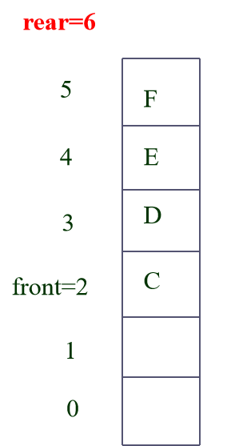

三、顺序循环队列的表示和实现

3.1、顺序循环队列的基本原理

 把顺序队列所使用的存储空间构造成一个逻辑上首尾相连的循环队列。当rear和front达到MaxQueueSize-1后，再前进一个位置就自动到０。

1


顺序循环队列的队空和队满判断问题
新问题：在循环队列中，空队特征是front=rear；队满时也会有front=rear；判决条件将出现二义性！
解决方案有三：
①使用一个计数器记录队列中元素个数（即队列长度）；
　　判队满：count>0 && rearfront； countMaxQueueSize
判队空：count0
②加设标志位，出队时置０,入队时置１,则可识别当前front=rear属于何种情况
判队满：tag1 && rearfront
判队空：tag0 && rearfront
③ 少用一个存储单元(浪费一个空间)
　　队满： front=＝(rear+1)%MaxQueueSize
判队空： rearfront

```c
#include <stdio.h>
#define SIZE    512
char queue[SIZE];
int head = 0, tail = 0;

int is_empty();   
void enqueue(char c);
char dequeue(void);
int is_full();
int main(void)
{
    char c = 'a';
    for (int i = 0; i < 3; i++)
    {
        if (!is_full())
        {   
            enqueue(c);
            c++;     // c 从a--> b
        } 
    }
    while (!is_empty())
    {
        putchar(dequeue()); 
    }  
    printf("\n");
    return 0;
}

void enqueue(char c)
{
   // queue[tail++] = c;  //入队列就是把某一个运算压入到尾部再更新位置 //tail++ 表示 先用用完之后再++
    //考虑到循环队列
    queue[tail] = c;
    tail = (tail + 1) % SIZE;    //到队列的数组下标的最大值后要从0开始了
}

char dequeue(void)
{
   // return queue[head++];  //队列是先进先出
    char ch;
    ch = queue[head];  //默认 为索引为0的位置
    head = (head + 1) % SIZE;  //头出 更新一下
    return ch;
}

int is_empty()   // 队头和对尾相等就为空
{
    return  head == tail; 
}

int is_full()
{
    return (tail + 1) % SIZE == head; 
}
```


##  队列应用例题

已知一个数列组合是经过加密后的一串数字，那么现在知道这串加密后的数字，并且知道如何破解的方法，求加密前数字的组合是什么。

破解的方法:  首先将第1个数删除，紧接着将第2个数放到这串数的末尾，再将第3个数删除并将第4个数放到这串数的末尾，再将第5个数删.....直到剩下最后一个数，将最后一个数也删除。按照刚才删除的顺序，把这些删除的数连在一起就是原始的数据。

分析:


​                                                                                **(存储队列)**

思想 : **每次出队列之前判断是否为空,入队列之前是否为满**

代码: 

```c
#include <stdio.h>
#include <string.h>
#define SIZE    512
char queue[SIZE];
int head = 0, tail = 0;

int is_empty();   
void enqueue(char c);
char dequeue(void);
int is_full();
int main(void)
{
/*
    char c = 'a';
    for (int i = 0; i < 3; i++)
    {
        if (!is_full())
        {   
            enqueue(c);
            c++;     // c 从a--> b
        } 
    }
    while (!is_empty())
    {
        putchar(dequeue());
    }  
    printf("\n")
*/
    char code[10];
    int n;
    int i =0;
    char num; 

    printf("Plese enter a code");
    gets(code);  // 字符串输入
    for (n = 0; n < strlen(code); n++)
    {
        if (!is_full())        //判断是否为空
            enqueue(code[n]);  // 把输入的字符一个一个存储进队列
    }
    while (!is_empty())
    {
        code[i++] = dequeue();  //密码
        while (!is_empty())
        {
            num = dequeue();
            if (is_full())
                enqueue(num);
        }
    }

    printf("orignal code is");
    for (i = 0; i < strlen(code); i++)
    {
        printf("%c",code[i]);
    }
    printf("\n");
    return 0;
}

void enqueue(char c)
{
   // queue[tail++] = c;  //入队列就是把某一个运算压入到尾部再更新位置 //tail++ 表示 先用用完之后再++
    //考虑到循环队列
    queue[tail] = c;
    tail = (tail + 1) % SIZE; // 到队列的数组下标的最大值后要从0开始了
}

char dequeue(void)
{
   // return queue[tail++];  //队列是先进先出
    char ch;
    ch = queue[head];
    head = (head + 1) % SIZE;
    return ch;
}

int is_empty()   // 队头和对尾相等就为空
{
    return head == tail;
}

int is_full()
{
    return (tail + 1) % SIZE == head;
}

```

结果:


## 双端队列


双端队列:

是一种head和tail都可以进出队列的数据表示形式


循环队列:

入队列(tail入队列)

出队列(head端出队列)

队列是否为满

对列是否为空


双端循环队列:

head端出队列(和以前一样)

​								c = queue[head];

​								head = (head+1) % SIZE;

head端入队列(理解 它本身是一个循环的队列,head减一就相当于尾了)

​								head = (head - 1 + SIZE) % SIZE;    ((0-1 +100))%SIZE = -99 )

​								queue[head] = c;

 tail端出队列(往后挪一位)

​							tail = (tail - 1 + SIZE) % SIZE;

​							c = queue[tail];

tail端入队列

​							queue[tail] = c;

​							tail = (tail + 1)% SIZE;

队列是否为空

​							head = tail;

对列是否为满

​							(tail + 1) % SIZE == head ;


代码: 

```c++
#include <stdio.h>
#define SIZE    512
char queue[SIZE];
int head = 0, tail = 0;

int is_empty();   
void tail_enqueue(char c);
char tail_dequeue(void);
void haed_enqueue(char c);
char head_dequeue(void);
int is_full();
int main(void)
{
    char c = 'a';
    for (int i = 0; i < 3; i++)
    {
        if (!is_full())
        {   
            tail_enqueue(c);
            c++;     // c 从a--> b
        } 
    }
    while (!is_empty())
    {
        putchar(head_dequeue());
    }  
    printf("\n");
    return 0;
}

void tail_enqueue(char c)
{
   // queue[tail++] = c;  //入队列就是把某一个运算压入到尾部再更新位置 //tail++ 表示 先用用完之后再++
    //考虑到循环队列
    queue[tail] = c;
    tail = (tail + 1) % SIZE; //到队列的数组下标的最大值后要从0开始了
}

char tail_dequeue(void)
{
   // return queue[tail++];  //队列是先进先出
    tail = (tail - 1 + SIZE) % SIZE;  
    return queue[tail];
}

void head_enqueue(char c)
{
    head = (head - 1 + SIZE) % SIZE;  // +size 是考虑到负数的情况 
    queue[head] = c;
}

char head_dequeue(void)
{
    char ch;
    ch = queue[head];
    head = (head + 1)% SIZE;
    return ch;
}

int is_empty()   // 队头和对尾相等就为空
{
    return head == tail;
}

int is_full()
{
    return (tail + 1) % SIZE == head;  // 用掉一个空间
}
```


## 双端队列应用回文判定abba

思想 : 结束比较 的条件是 队列为空(奇数or偶数)


```c
#include <stdio.h>
#include <string.h>
#define SIZE    512
char queue[SIZE];
int head = 0, tail = 0;

int is_empty();   
void tail_enqueue(char c);
char tail_dequeue(void);
void haed_enqueue(char c);
char head_dequeue(void);
int is_palindrom(char *pt);
int is_full();
int main(void)
{
    char str[100];
    printf("PLease enter a string");
    gets(str);
    
    if (is_palindrom(str))
        printf("str is a palindrom\n");
    else 
        printf("str is not a palindorm\n");
    return 0;
}

void tail_enqueue(char c)
{
   // queue[tail++] = c;  //入队列就是把某一个运算压入到尾部再更新位置 //tail++ 表示 先用用完之后再++
    //考虑到循环队列
    queue[tail] = c;
    tail = (tail + 1) % SIZE; //到队列的数组下标的最大值后要从0开始了
}

char tail_dequeue(void)
{
   // return queue[tail++];  //队列是先进先出
    tail = (tail - 1 + SIZE) % SIZE;  
    return queue[tail];
}

void head_enqueue(char c)
{
    head = (head - 1 + SIZE) % SIZE;  // +size 是考虑到负数的情况 
    queue[head] = c;
}

char head_dequeue(void)
{
    char ch;
    ch = queue[head];
    head = (head + 1)% SIZE;
    return ch;
}
int is_empty()   // 队头和对尾相等就为空
{
    return head == tail;
}

int is_full()
{
    return (tail + 1) % SIZE == head;
}

int is_palindrom(char *pt)
{
    int i, len;
    len = strlen(pt);
    char c1, c2;
    for (i = 0; i < len; i++)
        if (!is_full())
            tail_enqueue(pt[i]);       //注意 可以不加 {}
   
    while (!is_empty())
    {
        c1 = head_dequeue();
        if (!is_empty())          // 再判断是否为空 ---用来判断奇数还是偶数
            c2 = tail_dequeue();
        else
            break;       //退出循环 为空表示去到中间值

        if (c1 == c2)
            continue;
        else
            return 0;
    }
    return 1;
}
```


# 栈和队列总结

## **栈:**

```c
#include <stdio.h>
#include <stdbool.h>

#define SIZE 512

int stack[SIZE];
int top;

void push(int data)
{
	stack[top++] = data;
}

int pop()
{
	return stack[--top];  // top永远指向栈顶元素的下一个位置
}

bool empty()
{
	return top == 0;
}

bool full()
{
	return top == SIZE;
}


int main(void)
{
	push(1);
	push(2);
	push(3);
	push(4);
	while (!empty())
	{
		printf("%d\n", pop());
	}

	return 0;
}
```


**改进版**

```c++
#pragma once
#include <cstring>

// vector 动态数组
template <class T>
class MyStack
{
public:
	MyStack()
	{
		pBuff = NULL;
		len = 0;
		maxLen = 0;
	}
	~MyStack()
	{
		if (pBuff)
			delete[] pBuff;
		pBuff = NULL;
	}
	void push(const T& data);
	void pop()
	{
		len--;
	}
	T getTop()
	{
		return pBuff[len - 1];
	}
	bool isEmpty()
	{
		return len == 0;
	}
private:
	T* pBuff;
	size_t len;
	size_t 	maxLen;

};

template<class T>
inline void MyStack<T>::push(const T& data)
{
	/*
	//1. 每次开内存  //节约空间当时浪费时间
	maxLen = len + 1;
	T* pTemp = new T[maxLen];
	//2. 如果原来的内存段中有数据
	if (pBuff)
	{
		memcpy(pTemp，pBuff，sizeof(T) * len);
		delete[] pBuff;
	}

	//3 新数据进来
	pBuff = pTemp;
	pBuff[len++] = data;
	*/
	// 改进:
	// 1. 判断是否需要开内存 
	if (len >= maxLen)
	{
		//1.1 每次开内存  
		// 1.1.1 计算新开的内存大小
		// 新的内存段大小是原来的1倍加原来的1/2 或者 1
		maxLen = maxLen + (((maxLen >> 1) > 1) ? (maxLen >> 1) : 1);
		// 1.1.2 开内存
		T* pTemp = new T[maxLen];
		//2. 如果原来的内存段中有数据
		if (pBuff)
		{
			std::memcpy(pTemp, pBuff, sizeof(T) * len);
			delete[] pBuff;
		}
		pBuff = pTemp;
	}
	//3 新数据进来
	pBuff[len++] = data;
}
```

## **队列:**

```c
#include <stdbool.h>
#include <stdio.h>

/*
	顺序队列存在假溢出问题--> 使用顺序循环队列解决
	双端队列:
		头 -- 尾
	就是: 不是就近原则
*/

#define SIZE 512

int queue[512];
int head;
int tail;

// (先进先出)
void push_front(int data)
{
	queue[tail] = data;
	tail = (tail + 1) % SIZE;  // 核心
}

int pop_back()
{
	int result = queue[head];
	head = (head + 1) % SIZE;  // 更新头位置
	return result;
}

// 
void push_back(int data)
{
	head = (head - 1 + SIZE) % SIZE;
	queue[head] = data;
}

int pop_front()
{
	tail = (tail - 1 + SIZE) % SIZE;  // 找到出的元素  // +size 是考虑到负数的情况 
	return queue[tail];
}


bool empty()
{
	return head == tail;
}

bool full()
{
	return head == (tail + 1) % SIZE;
}

int main(void)
{
	for (int i = 0; i < 3; i++)
	{
		if (!full())
		{
			push_front(i);
		}
	}

	while (!empty())
	{
		printf("%d\n", pop_back());
	}

	return 0;
}
```


# ------------------------------------------------

#  顺序表

* 数据结构:存储数据的结构 线性表 树 图
* 线性表:一个节点只有一个前驱和一个后继
* 1,顺序表:内存是连续的		数组
* 2,链表:内存是不连续的		结构体 + 指针
* 3,访问受限的线性表: 栈 队列

**顺序表创建步骤:**

1. 存储数据:数组

2. 动态数组:   int *parr =   calloc(size,sizeof(type));

3. 需要知道顺序表的容量:   capacity

4. 需要知道有效元素个数:   size


**代码:**

```c++
#include<stdio.h>
#include"SeqList.h"
/*
* 数据结构:存储数据的结构 线性表 树 图
* 线性表:一个节点只有一个前驱和一个后继
*	1,顺序表:内存是连续的		数组
*	2,链表:内存是不连续的		结构体 + 指针
*	3,访问受限的线性表: 栈 队列
*
* 顺序表:
*	1,用什么来存储数据:数组
*		1.1 静态数组：int arr[];
*		1.2 动态数组: int *parr = calloc(size,sizeof(type));
*	2,需要知道顺序表的容量:capacity
*	3,需要知道有效元素个数:size
*/

int main()
{
	SeqList list = {0};
	seqList_init(&list);

	//seqList_destory(&list);	//释放栈区的内存，是不合法的
	//SeqList* plist = seqList_create();
	//seqList_destory(plist);	//只能释放堆区的内存

	for (int i = 0; i < 100; i++)
	{
		seqList_pushback(&list, i + 1);
	}

	//for (int i = 0; i < 10; i++)
	//{
	//	seqList_pushfront(&list, 8 +i);
	//}

	seqList_insert(&list, 2, 666);

	seqList_print(&list);

	printf("\n%d %d\n", seqList_size(&list), list.capacity);

	//seqList_popback(&list);
	//seqList_popfront(&list);
	//seqList_removeOne(&list, 666);
	//seqList_removePos(&list, 20);

	//seqList_print(&list);


	return 0;
}
```


```c
//防止头文件重复包含
#ifndef _SEQLIST_H	//①
#define _SEQLIST_H	//②
#include<stdbool.h>

#define SEQLIST_INIT_SIZE 8	//顺序表的初始大小

//ADT抽象数据类型
typedef int Data;

//定义顺序表结构体
typedef struct SeqList
{
	int capacity;		//容量
	int size;			//有效元素的个数
	Data* data;			 //定义数组指针	

	bool isHeap;		//顺序表是否申请再堆区
}SeqList;

//初始化顺序表
void seqList_init(SeqList* list);
//创建一个顺序表
SeqList* seqList_create();
//释放顺序表
void seqList_destory(SeqList* list);
//尾插
void seqList_pushback(SeqList* list, Data val);
//头插
void seqList_pushfront(SeqList* list, Data val);
//指定姿势
void seqList_insert(SeqList* list, int pos, Data val);

//尾删
void seqList_popback(SeqList* list);
//头删
void seqList_popfront(SeqList* list);
//删除指定的元素
void seqList_removeOne(SeqList* list, Data val);
//指定位置删除
void seqList_removePos(SeqList* list, int pos);


//输出所有元素
void seqList_print(SeqList* list);


//定义几个万金油函数
//判断顺序表是否为null
bool seqList_empty(SeqList* list);
bool seqList_full(SeqList* list);
int seqList_size(SeqList* list);
int seqList_find(SeqList* list, Data val);


#endif // !_SEQLIST_H	③
```


```c++
#include"SeqList.h"
#include<malloc.h>
#include<assert.h>
#include<stdio.h>

//扩容
bool inc(SeqList* list)
{
	SeqList* newList = realloc(list->data, (list->capacity + list->capacity * 2) * sizeof(Data));
	if (!newList)
	{
		return false;
	}
	list->data = newList;
	list->capacity += list->capacity * 2;
	return true;
}

void seqList_init(SeqList* list)
{
	list->isHeap = false;
	list->size = 0;
	list->capacity = SEQLIST_INIT_SIZE;
	list->data = calloc(list->capacity, sizeof(Data));
	if (!list->data)
	{
		assert(list->data);	//断言list->data为真，如果不为真，则会中断程序
	}
}

SeqList* seqList_create()
{
	//SeqList list;			//局部变量，函数结束自动释放，不安全了
	SeqList* list = calloc(1, sizeof(SeqList));
	if (!list)
	{
		assert(list);
	}
	seqList_init(list);
	list->isHeap = true;
	return list;
}

void seqList_destory(SeqList* list)
{
	//先释放数组
	free(list->data);
	//再释放顺序表
	if (list->isHeap)
		free(list);
}

void seqList_pushback(SeqList* list, Data val)
{
	//list->size == list->capacity 并且扩容失败才是真正的满了
	if (seqList_full(list) && !inc(list))
	{
		printf("seqlist is full,can't insert!\n");
		return;
	}
	list->data[list->size++] = val;
}

void seqList_pushfront(SeqList* list, Data val)
{
	if (seqList_full(list))
	{
		printf("seqlist is full,can't insert!\n");
		return;
	}
	//先移动后面的元素，为新插入的元素腾出空间
	for (int i = list->size; i > 0; i--)
	{
		list->data[i] = list->data[i - 1];
	}
	//插入新数据
	list->data[0] = val;
	list->size++;
}

void seqList_insert(SeqList* list, int pos, Data val)
{
	if (seqList_full(list))
	{
		printf("seqlist is full,can't insert!\n");
		return;
	}
	//判断pos是否合法
	if (pos < 0 || pos > list->size)
	{
		pos = list->size;
	}
	//移动
	for (int i = list->size; i > pos; i--)   // 整体h
	{
		list->data[i] = list->data[i - 1];
	}
	list->data[pos] = val;
	list->size++;
}

void seqList_popback(SeqList* list)
{
	if (seqList_empty(list))
	{
		return;
	}
	list->size--;
}

void seqList_popfront(SeqList* list)
{
	if (seqList_empty(list))
	{
		return;
	}
	for (int i = 0; i < list->size - 1; i++)
	{
		list->data[i] = list->data[i + 1];
	}
	list->size--;
}

void seqList_removeOne(SeqList* list, Data val)
{
	if (seqList_empty(list))
	{
		return;
	}

	//删除
	seqList_removePos(list, seqList_find(list, val), val);
}

void seqList_removePos(SeqList* list, int pos)
{
	if (seqList_empty(list))
	{
		return;
	}
	assert(pos > 0 && pos <= list->size);

	for (int k = pos; k < list->size - 1; k++)
	{
		list->data[k] = list->data[k + 1];
	}
	list->size--;
}

void seqList_print(SeqList* list)
{
	if (seqList_empty(list))
	{
		printf("seqList is empty!\n");
		return;
	}
	for (int i = 0; i < list->size; i++)
	{
		printf("%d ", list->data[i]);
	}
	printf("\n");
}

bool seqList_empty(SeqList* list)
{
	return list->size == 0;
}

bool seqList_full(SeqList* list)
{
	return list->size == list->capacity;
}

int seqList_size(SeqList* list)
{
	return list->size;
}

int seqList_find(SeqList* list, Data val)
{
	for (int i = 0; i < list->size; i++)
	{
		if (list->data[i] == val)
		{
			return i;
		}
	}
	return -1;
}
```


# 链表(linked list)

链表和数组的区别：

1. 链表 :(1)**插入和删除的效率高，只需要改变指针的指向就可以进行插入和删除。**

   (2)内存利用率高，不会浪费内存,可以使用内存中细小的不连续的空间，只有在需要的时候才去创建空间。

   (3)大小不固定，拓展很灵活。(4)链表高效的重排数组的能力, 但是不能快速的访问**,查找速度慢**

2. 数组 :(1)插入和删除的效率低，需要移动其他元素。(2)查找速度快

------

链表-----------> **结构体指针**得到了充分的利用。


**链表都有一个头指针，一般以head来表示，存放的是一个地址。**

链表中的节点分为两类，头结点和一般节点，头结点是没有数据域的。链表中每个节点都分为两部分，一个数据域，一个是指针域。说到这里你应该就明白了，链表就如同车链子一样，head指向第一个元素：第一个元素又指向第二个元素；……，直到最后一个元素，该元素不再指向其它元素，它称为“表尾”，它的地址部分放一个“NULL”（表示“空地址”），链表到此结束。

作为有强大功能的链表，对他的操作当然有许多，比如：链表的创建，修改，删除，插入，输出，排序，反序，清空链表的元素，求链表的长度等等。
***其实通俗来讲链表就像一列火车，每一借车厢里面装载的货物就是各种各样的数据，而连接他们的就是通过指针。***

单向链表:

```
--->NULL
head  这是一个空链表。
```

```
 ---->[p1]---->[p2]...---->[pn]---->[NULL]
head   p1->next  p2->next   pn->next
```

有n个节点的链表。

创建链表

```
typedef struct student
{
	int score;
	struct student *next;
} LinkList;
```

一般创建链表我们都用typedef  struct，因为这样定义结构体变量时，我们就可以直接可以用LinkList  *a;定义结构体类型变量了。

初始化一个链表，n为链表节点个数。

## 单链表原理和基本操作实现

**dummy一般需要找前驱点时并且考虑头节点是使用**

**temp一般在删除,  next转移(换线)之后还想要找到他时使用**

**new一般是创建一个节点,链表的时候用**

**一般情况下不会直接使用形参 head 而是 重新声明一个变量去指向它再进行一系列操作**


------------

1. **创建链表**

​              1)创建节点 ----------- 分配内存,填充数据域和指针域

​              2)节点链接在一-起


​           1)创建节点:

重要思想:   

-  **第一次插入第一个节点时** **,*头指针必须指向第一个节点且尾指针没有链接也应该指向第一个节点**
-  **第二次插入其他的新来节点,此时的尾指针的应该切换到新来的指针域**

==单链表的声明:==

```c#
#ifndef LINKEDLIST_H_
#define LINKEDLSIT_H_

struct node
{
    unsigned char elem;  //数据域
    struct node *next;  //结构体指针next
};
#endif
```

​          2)节点链接在一起:

重点:   **使用了一个tail节点去标准尾节点的位置**

```c
#include "linkedlist.h"
#include <stdlib.h>   // c语言中  malloc的函数包含的头文件 买咯克 //在c++中要使用 rand() 函数必须,在程序中包含 <cstdlib> 头文件

struct node *head = NULL;  //全局的 头指针(很重要)  // 结点的插入方法一般有：头插法；尾插法(掌握)
struct node *tail = NULL;  //尾插法就需要尾指针,在不断追加数据时,一直指向链表末尾(动态的)

void create_list(unsigned char elem)
{
    //创建节点:
    struct node *p = (struct node *)malloc(sizeof(struct node));   // 开辟内存空间放置节点 malloc返回void的类型 通过(struct node *)进行强制类型转换指针   // c++ 用new
    p->elem = elem; // 数据域
    p->next = NULL; //指针域,刚刚创建,指针域应该是空的
    // 上述是初始化

    
    // 链接节点:  p就代表加入的节点数据,本身是变的
    if (head == NULL)   //第一个节点加入时(第一次插入新节点时)//头指针必须指向第一个节点 
                        //在第一个节点加入尾指针指向和头指针一样
        head = p;
    else                // 再插入其他的新来节点   // 此时的尾节点的指针域应该切换到新来的
        tail->next = p;  //用尾指针 tail里面的指针域应该指向下一个位置  如图
    tail = p;   //tail指针指向新的节点  如图上(tail指针移动)(更新)
}
```


理解: tail**指针** 去指向新节点 就是**节点数据本身**,     tail的**指针域**去指向下一个节点数据(连接)就是**连接线**

**指针指向指针域表示指向的节点**

​          +  **加入的节点是动态的**.  **等号相当于指向**

			+  **创建使用节点的elem就是动态创建一个节点指针操作**

==使用虚拟节点的方法==

```c++
void User::addtail(userData data) {
  userNode *addNode = new userNode(data); // 创建一个节点
  userNode *cur = m_dummyHead;
  while (cur->next) {
    cur = cur->next;
  }
  cur->next = addNode;
}
```


------

2. **基本操作**

​               **1). 插入链表节点**


**设置pre指针  充当 前驱点**      (如: 找5号节点 前驱点就是4)


代码:

```c
//插入:
void insert_node(int pos, char elem) // pos 表示位置 前驱点   elem表示要处理的数据
{
    struct node *pre; // 前驱点
    pre = head;       // 初始值(都要从头指针开始,因为链表的数据本身省是动态的.不能直接定位,只能先指向head(head是不变得))

    int i = 0;
    struct node *p = (struct node *)malloc(sizeof(struct node));  //  开辟内存空间  //创建节点

    if (pos == 0) // 在头节点前操作时,没有前驱点的情况
    {
        p->elem = elem;  //存入数据
        p->next = head; //指针域去指向head指针
        head = p; // head指针指向新的节点 (更新)
    }
    else
    {
        //(1)有前驱点/不是头节点的情况:(只有头,前驱点才能直接访问)
        // 找到前驱点 
        while (i < pos - 1) //不确定循环次数用while  // 循环次数比要找的节点位置少1(找到前驱点)
        {
            pre = pre->next;   //找前驱点的过程就是前驱点的移动移动//更新per的位置
            i++;
        }
        //新开辟的节点:
        //插入的核心操作:
        p->elem = elem;
        p->next = pre->next; //(1) 新的节点指针域 指向前驱点所在的指针域(原来位置节点的)
        					 //(2)插入的连接线等于前驱指针的连接线就相当于插入
        pre->next = p;       // 重新更新前驱域的指针域.
        // 都是这样写  前后链接好就行
        
        //:
        if (p->next == NULL) //插入的节点的节点域是空指针,在末尾插入,到达末尾了;没节点连接了
            tail = p;  //让tail的位置等于新插入的(直接插入到末尾)(记一下有点特殊)
    }
}
```

分析: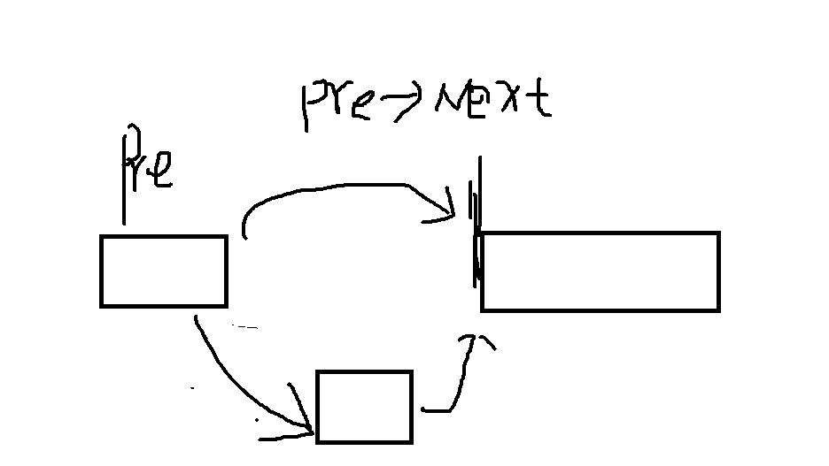

****


------


​			**2).删除链表节点**


​					删除链表的元素也就是把前节点的指针域越过要删除的节点指向下下个节点。即：p->next = q->next;然后					放出q节点的空间，即free(q);

​					**思路:  同样要找前驱点, 遍历链表**来找到前驱点.


```c
//删除: --->通过断开连线的方式
void delete_node(int pos)
{
    struct node *pre, *p;  //*p 接受要删除节点
    pre = head;  //
    int i = 0;
 
    if (pos == 0)
    {
        head = head->next;  //头节点的下一个位置作为头节点
        free(pre);    //释放pre指向头节点所在的内存空间
    }
    else
    {
        while (i < pos - 1)
        {
            pre = pre->next;
            i++;
        }           //遍历整个链表

        p = pre->next;  //当前要删除的节点
        
        // 创建好连接线
        pre->next = p->next;   //   p->next表示删除节点的下一个节点, 让pre-next直接连接删除节点的下一个节点就能达到目的
       // or pre->next = pre->next->next;   // 直接跨过
        
        if (p->next == NULL)
            tail = pre;   // 删除尾节点,前驱点就成为末尾

        free(p);  //以为创建就是用malloc创建的,删除和malloc连用
    }
}
```

```c++
//尾节点:
	//用两个临时节点，一个是前一个节点pre，一个是当前节点cur
	Point* pre = pHead;
	Point* cur = pHead->next;
	while (cur->next != NULL) //指向的下一个不为空，就循环
	{// 相当于找到前驱点 
		pre = pre->next;
		cur = pre->next;
	}
	//尾节点修改内容
	wall.setWall(cur->x, cur->y, ' ');
	delete cur;
	cur = NULL;
	pre->next = NULL;
```

==使用虚拟节点的方法==

```c++
// 4.删除用户信息\n";
void User::userDelete(const std::string &na) {
  if (search(na) == 0)
    return;
  userNode *cur = m_dummyHead;
  while (cur->next) {
    if (cur->next->data.name == na)
      break;
    cur = cur->next;
  }
  userNode *temp = cur->next;
  cur->next = cur->next->next;
  delete temp;
}
```


----------------

​             **3).输出链表**

输出链表很简单，边遍历边输出就行了。

```objc
//输出链表(遍历)
void print_linklist(void)
{
    struct node *p;  //定义一个结构体指针p
    
    for (p = head; p; p = p->next)  // p表示不为空就进行 // 注意更新条件 p = p->next //head和tail是全局的
        printf("%c",p->elem); // %5d 表示宽度 和c++的with一样 只影响下一个项目的
    printf("\n");  //全部循环完换行
    
}
```

------

​             **4). 查找某个数据域是否存在**

```c
//查找元素是否存在:
int search(unsigned char elem)
{
    struct node *p;   //定义一个结构体指针p

    for (p = head; p; p = p->next)
        if(p->elem == elem)
            return 1;
    return 0;
}
```

 

​           **5).修改链表节点值(了解)**

修改链表节点值很简单。下面是一个传入链表和要修改的节点，来修改值的函数。

```c
void change(struct node *list,int pos) 
{//n为第n个节点
	struct node *p = list;
	int i = 0;
	while (i < pos && p != NULL) 
    {
		p = p->next;
		i++;
	}
	if (p != NULL) {
		puts("输入要修改的值");
		scanf("%d", &t->score);
	}
	else 
    {
		puts("节点不存在");
	}
}
```


### **总结**

+ 插入 : 连好 前后   // 不用虚拟节点 ,   连接头或者尾是  head = 某某 就相当于在做更换 head的位置)

+ 删除: 保存要删除的节点,  再连续跨过就行


## 单链表的应用_合并 有序的链表


按照数组的方式--->对两个链表操作,会取产生副本,不是最优的.

用链表的方式:(不用一个一个去复制了)


**链表头head..是一定不能变的**

代码:

main()函数:

```c
#include <stdio.h>
#include "linkedlist.h"

int main(void)
{ 
    // 创建两个结构体的指针头
    struct node *head1 = NULL;  
    struct node *head2 = NULL;
    struct node *p = NULL;
    struct node *q = NULL;
    
    //创建两个链表:
    create_list(1);
    create_list(9);
    create_list(13);
    create_list(27);
    head1 = head; // 让head1指向默认的头
    print_linklist(head1);  //显示

    head = NULL; //先复制头空指针在进行创建
    create_list(3);
    create_list(5);
    create_list(14);
    create_list(81);
    create_list(95);
    create_list(99);
    head2 = head;
    print_linklist(head2);
	
    
    //合并链表,(有序的排列)
    head = NULL;
    p = head1;
    q = head2;
     
    while (p && q)   // 只要 q , p 两个链表任意一个取完了,就退出
    {
        //第一次,找到链表头应该是什么
        if (p->elem <= q->elem)
        {
            if (head == NULL)   //头是不变的
                head = p;     // 头不变
            else
                tail->next = p; //尾节点的下一个尾节点 = 新来的
            tail = p;  //新来的全部内容.  尾,用来指向追加的尾(可以理解成next的前身)   // 要变化的在去更新位置
            
            p = p->next;  //更新位置(while的更新条件) , p->next指向的下一个位置   
        }
        else  
        {
            if (head == NULL)
                head = q;
            else
                tail->next = q;   
            tail = q;
            q = q->next;   
        }
    }
    //有没比较的追加剩下的
    tail->next = p ? p: q;  //p不为空取p , p为空就取q // tail->next表示后面的内容  //tail->next现在指向的就是p,q其中一个的末尾
    
    print_linklist(head);  //显示一下合并之后的
    return 0;
}
```


## 单链表的应用_删除链表重复元素


### 法一: 辅助数组(需要有值的范围)

**标记某个数字已经出现的思想:**

+ 使用辅助数组的方法 :
  + 下标代表要检查的内容
  + 元素:  状态(代表是否出现过)


```c
//删除重复的链表
void delete_repeat(struct node *head)
{
	int flag[10] = {0, 0, 0, 0, 0, 0, 0, 0, 0, 0}; //辅助数组

	struct node *p = head;   
	struct node *q = NULL;  // 用来操作删除重复链表节点的

	flag[p->elem] = 1;  // 第一个元素不可能重复,直接

	while(p->next != NULL)
	{
		if(flag[p->next->elem] == 0)   //辅助数组里面某一个值为零---->代表没有出现过
		{
			flag[p->next->elem] = 1;  //代表没有出现过
            // 上述表示: 当前的标志位为0的话;就置1
            //判断完后,更新
			p = p->next; //更新位置
		}
		else
		{  //发现标志为1,删除重复的
			q = p->next;
			p->next = q->next;
			free(q);
		}
	}
}
```


```c
#include <stdio.h>
#include "linklist.h"

int main(void)
{
	create_list(1);
	create_list(2);
	create_list(8);
	create_list(2);
	create_list(3);
	create_list(9);
	create_list(4);
	create_list(6);
	create_list(4);
	create_list(8);
	create_list(7);
	create_list(5);
	create_list(2);
	create_list(9);
	create_list(6);
	print_linklist(head);

	delete_repeat(head);
	print_linklist(head);

	return 0;
}
```

------------------

**改进:**


### 法二:  哈希表 set

****


----------------

###  删除排序链表中的重复元素

**直接跳过重复的**

```c++
class Solution 
{
public:
    ListNode* deleteDuplicates(ListNode* head) 
    {
        if (!head) 
        {
            return head;
        }

        ListNode* p = head;
        while (p->next) 
        {
            if (p->val == p->next->val)      // 相同直接跨过
            {
                p->next = p->next->next;
            }
            else 
            {
                p = p->next;
            }
        }
        return head;
    }
};

```

----------------


##  单链表的应用_查找链表中间节点.


代码:

```c
int find_mid(struct node *head)
{
    struct node *p; //快指针
    struct node *q; // 慢指针
    p = q = head;

    while (p != NULL && p ->next != NULL)   // 循环条件(奇数偶数)
    {
        p = p->next->next;  //快指针一次走2个
        q = q->next;       //慢指针一次走1个
    }
    return q->elem;  //最终慢指针刚好是走向中间的.
}
```


## 单链表的应用_查找倒数第n个节点


```c
//查找倒数第n个节点
int find_last_nth(struct node *linklist_head, int n)
{
	int i;

	struct node *p;
	struct node *q;

	p = q = linklist_head;

	for(i = 0; i < n-1; i++)  //让快指针先走 n-1步循环n-1c
		p = p->next;

	while(p->next != NULL)  // 循环条件(快指针)
	{
		//没次走一个节点
		p = p->next;  
		q = q->next;
	}

	return q->elem;  //慢指针所在的位置就是倒数的第n个节点的
}
```


## 单链表的应用_逆置单链表

分析:


```c
void reverse_linklist(struct node *linklist_head)
{
	struct node *p, *n;
	p = linklist_head->next;
	linklist_head->next = NULL;  // 此时 head的指针域应该的空指针

	while (p->next != NULL)  // 
	{ 
		n = p->next;  // 先存储起来 下一个要操作的节点
		p->next = linklist_head;  // 要 交换的位置变成头(p去连接头) (交换了)
		linklist_head = p;   // 头指针 更新位置
		p = n; // 更新p的位置
	}
    // 没交换了 下一次交换
	p->next = linklist_head; 
	linklist_head = p;   // 链表头 更新位置

	head = linklist_head;  // 解决只显示链表的一个元素的原因  让全局的head也跟随着linklist_head一起指向
	//print_linklist(linklist_head);  //
}
```

main

```c
#include <stdio.h>
#include "linklist.h"

int main(void)
{
	int n;
	create_list(1);
	create_list(2);
	create_list(3);
	create_list(4);
	create_list(5);
	create_list(6);
	create_list(7);
	create_list(8);
	create_list(9);
	create_list(10);
	
	reverse_linklist(head); 
	print_linklist(head);      //只显示链表的一个元素的原因

	return 0;
}
```

  **只显示链表的一个元素的原因:**


**直接反转next的方法:**

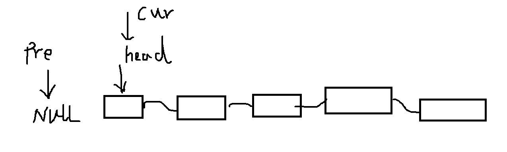

三部曲: 

          1. 设置temp
          2. 反转操作
          3. 更新

```c++
class Solution 
{
public:
    ListNode* reverseList(ListNode* head) 
    {   
        ListNode* cur = head;
        ListNode* pre = nullptr;   
        ListNode* temp;
        while (cur)
        {
            temp = cur->next; // 反转后找不到原来 cur的下一个位置
            cur->next = pre;  // 反转操作
            pre = cur;  // 更新pre位置
            cur = temp; // 更新cur位置
        }
        return pre;
    }
};
```


## 循环链表原理及基本操作

### 总结

+ **创建链表 和 在头节点前操作时,     最后要保持 头尾 相连   tail->next = head;**
+ 打印时,必须用do while


代码:

```c
#include "linklist.h"
#include <stdlib.h>

struct node *head = NULL;  //表示没内容和指针域指向NULL是有区别的
struct node *tail = NULL;

void create_list(unsigned int elem)
{
	struct node *p = (struct node *)malloc(sizeof(struct node));
	p->elem = elem;
	p->next = NULL;  // 第一个节点的指针域是空的

	if(head == NULL)
		head = p;
	else
		tail->next = p;

	tail = p;
    
	tail->next = head;   //尾都去链接head  构成循环
}

void insert_node(int pos, unsigned int elem)
{
	struct node *pre;
	pre = head;
	int i = 0;
	struct node *p = (struct node *)malloc(sizeof(struct node));

	if(pos == 0)
	{
		p->elem = elem;
		p->next = head;
		head = p;
		tail->next = head;  //更新尾节点的指向 指向新的头节点位置
	}
	else
	{
		while(i < pos - 1)
		{
			pre = pre->next;
			i++;
		}

		p->elem = elem;
		p->next = pre->next;
		pre->next = p;

		if(p->next == head)   // 新加入最后一个指针域是头指针,所以判断条件是这个
			tail = p;
	}
}

void delete_node(int pos)
{
	struct node *pre, *p;
	pre = head;
	int i = 0;

	if(pos == 0)
	{
		head = head->next;
		free(pre);
		tail->next = head;  // 更新尾节点的指向 指向新头节点位置//
	} 
	else
	{
		while(i < pos - 1)
		{
			pre = pre->next;
			i++;
		}
	
		p = pre->next;
		pre->next = p->next;
		if(p->next == head)    // 新加入最后一个指针域是头指针,所以判断条件是这个
			tail = pre;
		free(p);
	}
}

void print_linklist(void)
{
	struct node *p;
	p = head;  //循环的初始条件
	
//	for(p = head; p != head; p = p->next)  // 退出条件: p == head 一次都无法执行
//		printf("%d", p->elem);
    // 上述代码相当于 一次都无法执行. 应该让代码先执行一次
	do{
		printf("%5d", p->elem);  //显示
		p = p->next;  // p指针位置的更新
	}while(p != head);  // 一定有个;号
/*
do while的特点:无论判断条件是否满足都肯定会执行一次
*/

	printf("\n"); //最后换行
}

int search(unsigned int elem)
{
	struct node *p;
	p = head;

//	for(p = head; p; p = p->next)
//		if(p->elem == elem)
//			return 1;
	do{
		if(p->elem == elem)
			return 1;
		p = p->next;
	}while(p != head);

	return 0;
}
```


## 循环链表应用_约瑟夫环(josephus)

读音 : 解释非是

### **思路**


### 问题1

**题目已知n个人(用编号1- n表示)围坐在一张圆桌周围，从编号为k的人从1开始报数，数到m的那个人出列; 他的下一个人继续从1开始报数，数到m的人继续出列; 依次重复下去，直到所有人全部出列。**


代码:

```c
#include <stdio.h>
#include "linklist.h"
#include <stdlib.h>

int main(void)
{
	int n, k, m;   //
	int i;
	struct node *p, *q;

	printf("Please enter the number of person:");  //请输入人的个数
	scanf("%d", &n); //scanf（“%d”，&n ) 头文件stdio.h  用户输入整数，并将这个整数存在变量n   . gets()输入字符串时用

	for(i = 1; i <= n; i++)
		create_list(i); //创建的是循环链表
	print_linklist(); //显示
	p = head;

	printf("Please enter the start num:"); // 请输入起始的编号
	scanf("%d", &k);
    //找到起始k的节点:
	while(--k) // 可以循环1 到 k-1次
		p = p->next;
	printf("p->elem = %d\n", p->elem);  //显示一下找到的是不是目标节点

    
	printf("Please enter the m:");   //请输入出列的喊的编号
	scanf("%d", &m);
	
	if(1 == m)   // 初始编号的人为1, 喊道1 就不需要前驱点
	{//挨个出就行
		for(i = 0; i < n; i++)
		{
			printf("%3d", p->elem);
			p = p->next;
		}
		printf("\n");
	}
	else
	{
		while(n--)  //(直到没有元素了)全部人数循环(1 到 n次)(只要n里面没人来)
		{
			//找前驱点(i = 0; i < m-2)
			for(i = 1; i < m - 1; i++)  //找前驱点   m为3-->循环1次   m为5-->3次 
				p = p->next;  //  p是前驱点

			//如下图 	
			q = p;  // q取代表前驱点 //p是用来接受要删除的节点的
			p = p->next; //找到下一个节点(要删除的节点)
			printf("%d", p->elem);
			q->next = p->next;   //   删除节点
			free(p);
			p = p->next; //更新p的位置
		}
		printf("\n");
	}
	return 0;
}
```


### 问题2


描述是，编号为1、2、、，的n个人按顺时针方向围坐一圈，每人持有一个图部队人正整数)。一开始任选一个整数作为报数上限值m，从第一个人开始顺时1开始顺序报数，报到 m时修止报数。报m的人出列，将他的密码作为新的m值，从他在顺时针方向上的下一个人开始T新从1报数，如此下去，直至所有的人全部出列为正。
试设计一个程序，求出出列顺序

+ 利用单向循环链表作为存储结构模拟此过程，按照出列顺序打印出各人的编号。
  例如m的初值为20，n=7,7个人的密码依次为3、1、7、2、4、8、4，出列的顺序为6、
  1、4、7、2、3、5


```c++
#include <stdio.h>
#include <stdlib.h>

typedef struct Node
{
	int data;
	struct Node* next;
}Node;


int main()
{
	int n, m, num, num1;
	printf("人数n和初值m :");
	scanf("%d%d", &n, &m);
	Node* p, * s, * head;
	p = head = (Node*)malloc(sizeof(Node));
	printf("第1个人密码: ");
	scanf("%d", &num1);
	p->data = num1;

	for (int i = 2; i <= n; i++)
	{
		s = (Node*)malloc(sizeof(Node));
		printf("第%d个人密码: ", i);
		scanf("%d", &num);
		s->data = num;
		p->next = s;
		p = p->next;
	}
	p->next = head;   // 最后一个成为第一个

	printf("出队密码顺序: ");
	while (n--)
	{
		for (int j = 0; j < m - 1; j++)   // 循环2次拿到前驱点
		{
			p = p->next;
		}
		Node* temp = p->next;
		m = temp->data;
		printf("%d ", temp->data);  // 出列密码

		p->next = temp->next;
		free(temp);
	}
	return 0;
}
```


## 双向链表及应用_逆置链表

单链表和双链表的区别：


1. 单链表的每一个节点中只有指向下一个结点的指针，不能进行回溯，适用于节点的增加和删除。

2. 双链表的每一个节点给中既有指向下一个结点的指针，也有指向上一个结点的指针，可以快速的找到当前节点的前一个节点，适用于需要双向查找节点值的情况。

双链表相对于单链表

优点：

+ **时间效率高**

  删除单链表中的某个节点时，一定要得到待删除节点的前驱，得到其前驱的方法一般是在定位待删除节点的时候一路保存当前节点的前驱，这样指针的总的的移动操作为2n次.如果是用双链表，就不需要去定位前驱，所以指针的总的的移动操作为n次。
  查找时也是一样的，可以用二分法的思路，从头节点向后和尾节点向前同时进行，这样效率也可以提高一倍，缺点: 

+  **双向链表所占的空间大于单链表**

但是从存储结构来看，每一个双链表的节点都比单链表的节点多一个指针，如果长度是n，就需要n*lenght（32位是4字节，64位是8字节）的空间，这在一些不追求追求时间效率的应用下就不适用.


### **总结**

+ 创建时 和 在头前操作时 ,    要对 pre 进行处理   p->pre = tail  和   p->pre = null;

+ 多了一条指回来的线

  + 插入时 在建立连接时, 特殊: 顾尾不顾头,对尾创建双向连接     if(p->next != NULL)	pre->next->pre = p; 

  + 删除时,  回来的线也要找到       if(p->next != NULL	p->next->pre = pre; 
            

代码: 

```c
#ifndef LINKLIST_H__
#define LINKLIST_H__

#include <stdio.h>

struct node
{
	unsigned int elem;
	struct node *pre;   // 结构体成员
	struct node *next;
};

void create_list(unsigned int elem);
void insert_node(int pos, unsigned int elem);
void delete_node(int pos);
void print_linklist(void);
int search(unsigned int elem);
void reverse_print_linklist(void);

#endif
```

源文件:

**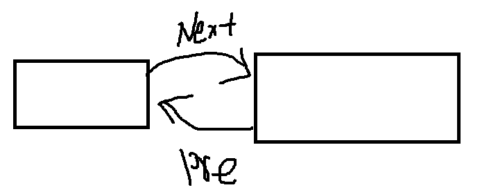**


```c
#include "linklist.h"
#include <stdlib.h>

struct node *head = NULL;
struct node *tail = NULL;

void create_list(unsigned int elem)
{
	struct node *p = (struct node *)malloc(sizeof(struct node));
	p->elem = elem;
	p->pre = NULL;   // 形成结构体成员
	p->next = NULL;

	//见图1:
	if(head == NULL)  //第一次新加入
		head = p;
	else
	{
		tail->next = p;    // 单链表只有这个
          // 进行双向链接:
		p->pre = tail;   // 前驱点指向tail. 连起来
	}
	tail = p; // 更新位置
}

void insert_node(int pos, unsigned int elem)
{
	struct node *pre;
	pre = head;
	int i = 0;
	struct node *p = (struct node *)malloc(sizeof(struct node));
	// 见图2:
	if(pos == 0)   // 头部插入
	{
		p->elem = elem;
		p->next = head;
		head->pre = p;
		p->pre = NULL;     //
		head = p;
	}
	else  
	{// 见图3:
		while(i < pos - 1)
		{
			pre = pre->next;
			i++;
		}

		p->elem = elem;
		p->pre = pre;
		p->next = pre->next;
        
		//重要:(新增)(核心)
		if(p->next != NULL)  //当前加入的p不是在尾节点后插入,因为是的话就不需要再连接这根线了(根本没有后面的了)
			pre->next->pre = p;  // pre->next表示后面的.后面的的前驱线连接 
        
        
		pre->next = p;  // 更新位置(处理前面的)(单链表也是这个)

		if(p->next == NULL)
			tail = p;
	}
}

void delete_node(int pos)
{
	struct node *pre, *p;
	pre = head;
	int i = 0;
	
	//见图4:
	if(pos == 0)
	{
		head = head->next;
		head->pre = NULL;  // 当前的前驱点的头变成NULL
		free(pre);    //删除原来的头
	}
	else
	{//见图5:
		while(i < pos - 1)
		{
			pre = pre->next;
			i++;
		}
	
		p = pre->next;
		pre->next = p->next;
        // or pre->next = pre->next->ne
		//重要:(新增)
		if(p->next != NULL)
			p->next->pre = pre;  //p节点的后面的点和p节点前面的点前驱点的连接
		else//if(p->next == NULL)
			tail = pre;
		free(p);
	}
}

//下面都没做改动:
void print_linklist(void)
{
	struct node *p;
	
	for(p = head; p; p = p->next)
		printf("%5d", p->elem);

	printf("\n");
}

int search(unsigned int elem)
{
	struct node *p;

	for(p = head; p; p = p->next)
		if(p->elem == elem)
			return 1;
	return 0;
}

void reverse_print_linklist(void)
{
	struct node *p;

	for(p = tail; p; p = p->pre)
		printf("%5d", p->elem);
	printf("\n");
}
```

1. 图1:

   

 

2. 图2:

   


3. 图3

   

4. 图4:

   

5. 图5:

   


---------------------

**应用:** 

**逆置链表-----> 直接找到链表的尾 再往前找就行(比单链表简单太多了)**


```c
void reverse_print_linklist(void)
{
	struct node *p;
    
	for(p = tail; p; p = p->pre)  //p从尾开始
		printf("%5d", p->elem);
	printf("\n");
}
```


## 链表环问题
判断是否有环 ---> 快慢指针
  定义一个快指针和一个慢指针，快指针一次走两步，慢指针一次走两步，会出现两种情况，情况一指针走到了空的位置，那就说明这个链表不带环。情况二两个指针相遇，说明这个链表带环。

获得入环节点
  如果不考虑空间复杂度，可以使用一个map来记录走过的节点，这个指针一直向后遍历如果遇到空，说明这个链表不带环，也就没有入环节点，如果没有遇到空，如果遇到第一个在map中存在的节点，就说明回到了出发点，这个节点就是环的入口节点。如果不建立额外的空间，先使用快慢指针判断这个链表是否有环，如果有环将相遇节点记录，然后一个指针从链表的起始位置开始一次走一步，另一个指针从记录的节点开始一次走一步，当两个节点再次相遇，这个相遇节点就是环的入口节点。


--------


#  链表总结

+ 插入 : 连好 前后   // 不用虚拟节点 ,   连接头或者尾是  head = 某某 就相当于在做更换 head的位置)

+ 删除: 保存要删除的节点,  再连续跨过就行

## **c实现**

```c++
#include <stdio.h>
#include <stdlib.h>


typedef struct LinkNode
{
	int val;
	struct LinkNode* next;
}LinkNode;


//尾插法就需要尾指针,在追加数据时不断的更新位置,一直指向链表末尾(动态的)
LinkNode* head = NULL;
LinkNode* tail = NULL;

// 尾创建
void addTail(int data)
{
	//创建节点:
	LinkNode* newNode = (LinkNode*)malloc(sizeof(LinkNode));
	newNode->val = data;
	newNode->next = NULL;


	if (head == NULL)   //第一次插入新节点时                        
		head = newNode;
	else
		tail->next = newNode;
	tail = newNode;  // 更新尾部位置 
}


// 插入
void insert_node(int index, int data)
{
	LinkNode* newNode = (LinkNode*)malloc(sizeof(LinkNode));  //创建新节点
	newNode->val = data;

	LinkNode* pre = head;

	if (index == 0) // 在头节点前操作时,没有前驱点的情况
	{
		newNode->next = head;
		head = newNode; // head指针指向新的节点 (更新)
	}
	else
	{
		int i = 0;
		while (i < index - 1) //找到前驱点
		{
			pre = pre->next;   //找前驱点的过程就是前驱点的移动移动//更新per的位置
			i++;
		}

		newNode->next = pre->next;
		pre->next = newNode;

		if (newNode->next == NULL) //插入的其实是尾部的话
			tail = pre;
	}
}

// 删除指定元素
void deleteVal(int data)
{
	LinkNode* pre = head;
	LinkNode* cur = head->next;

	if (pre->val == data)
	{
		head = head->next;
		free(pre);
	}
	else
	{
		while (cur->next)
		{
			if (cur->val == data)
				break;
			pre = pre->next;
			cur = pre->next;
		}

		pre->next = cur->next;
		if (cur->next == NULL)  // 删除的其实是尾部的话
		{
			pre->next = NULL;
		}

		free(cur);

	}
}

// 删除指定索引
void deleteInd(int index)
{
	LinkNode* pre = head;

	if (index >= count() || index < 0)
		return;

	if (index == 0)
	{
		head = head->next;
		free(pre);
	}
	else
	{
		int i = 0;
		while (i < index - 1)
		{
			pre = pre->next;
			i++;
		}

		LinkNode* temp = pre->next;
		pre->next = pre->next->next;

		if (temp->next == NULL) // 删除的其实是尾部的话
			tail = pre;

		free(temp);
	}
}


// 显示
void show()
{
	LinkNode* pre = head;

	while (pre)
	{
		printf("%d", pre->val);
		pre = pre->next;
	}
	printf("\n");  //全部循环完换行

}

int count()
{
	LinkNode* pre = head;
	int count = 0;
	while (pre)
	{
		pre = pre->next;
		printf("%d\n", count);
		count++;
	}
	return count;
}


int main(void)
{
	addTail(1);
	addTail(2);
	addTail(3);
	addTail(4);
	//insert_node(4, 0);
	deleteVal(4);
	/*deleteInd(3);*/
	show();
	return 0;
}
```


## C语言哨兵节点

```c
#pragma once
#include <stdbool.h>

typedef int Data;

// 定义节点结构
typedef struct linkNode
{
	Data data;
	struct linkNode* next;

}linkNode;

// 创建链表
linkNode* createList();

// 创建节点
linkNode* createNode(Data val);

// 插入
//头插入
void pushfront(linkNode* list, Data val);
//尾插入
void push_back(linkNode* list, Data val);
//指定位置插入(下标)
void insert_pos(linkNode* list, int pos, Data val);
//指定位置插入(在指定元素之后)
void insert_item(linkNode* list, linkNode* item, Data val);
// 查找元素
linkNode* find(linkNode* list, Data data);


// 删除
//头删
void pop_front(linkNode* list);
//尾删
void pop_back(linkNode* list);
//指定元素删除
void removeOne(linkNode* list, Data val);
void removeA1l(linkNode* list, Data val);  // 删除所有val
bool isempty(linkNode* list);

// 遍历
void show_list(linkNode* list);
```


```c
#include "LinkList.h"
#include <stdio.h>
#include <malloc.h>
#include <string.h>

linkNode* createList()
{
	linkNode* head = malloc(sizeof(linkNode));   // 先new一个节点充当哨兵节点
	if (!head)
	{
		printf("head malloc failed");
		return NULL;
	}
	memset(head, 0, sizeof(linkNode));
	return head;
}

linkNode* createNode(Data val)
{
	linkNode* newNode = malloc(sizeof(linkNode));
	if (!newNode)
	{
		printf("newNode malloc falied"); return NULL;
	}
	newNode->data = val;
	newNode->next = NULL;
	return newNode;
}

void pushfront(linkNode* list, Data val)
{
	linkNode* newNode = createNode(val);
	newNode->next = list->next;
	list->next = newNode;
}

void push_back(linkNode* list, Data val)
{
	linkNode* newNode = createNode(val);
	linkNode* cur = list;
	while (cur->next)
	{
		cur = cur->next;
	}
	cur->next = newNode;
}

void insert_pos(linkNode* list, int pos, Data val)
{
	linkNode* cur = list;
	linkNode* newNode = createNode(val);

	while (pos-- && cur->next)
	{
		cur = cur->next;
	}

	newNode->next = cur->next;
	cur->next = newNode;
}

void insert_item(linkNode* list, linkNode* item, Data val)
{
	linkNode* newNode = createNode(val);
	newNode->next = item->next;
	item->next = newNode;
}

linkNode* find(linkNode* list, Data val)
{
	linkNode* curNode = list->next; while (curNode)
	{

		if (curNode->data == val)
		{
			return curNode;
		}
		curNode = curNode->next;
	}
	return NULL;

}

void pop_front(linkNode* list)
{
	linkNode* temp = list->next;
	list->next = list->next->next;
	free(temp);
}

void pop_back(linkNode* list)
{
	linkNode* cur = list;
	linkNode* temp = NULL;
	while (cur->next && cur->next->next)
	{

		cur = cur->next;
	}
	free(cur->next);
	cur->next = NULL;
}

void removeOne(linkNode* list, Data val)
{
	if (isempty(list))
		return;
	linkNode* cur = list;
	while (cur->next)
	{
		if (cur->next->data == val)
		{
			break;
		}
		cur = cur->next;
	}
	//删除
	if (cur->next)
	{
		linkNode* temp = cur->next;
		cur->next = cur->next->next;
		free(temp);
	}
}

void removeA1l(linkNode* list, Data val)
{
	if (isempty(list))
		return;
	linkNode* cur = list;
	linkNode* temp = NULL;
	while (cur->next)
	{
		if (cur->next->data == val)
		{
			temp = cur->next;
			cur->next = temp->next;
			free(temp);
			temp = NULL;
		}
		else
		{
			cur = cur->next;
		}

	}
}

bool isempty(linkNode* list)
{
	return list->next == NULL;
}

void show_list(linkNode* list)
{
	linkNode* cur = list->next;
	while (cur)
	{
		printf("%d ", cur->data);
		cur = cur->next;
	}
	printf("\n");
}


// 释放
void freeLinkList(linkNode* list)
{
	linkNode* freeNode;
	while (list != NULL)
	{
		freeNode = list;
		list = list->next;
		free(freeNode);
	}
}
```

```c++
#include <stdio.h>
#include "LinkList.h"


int main(void)
{
	linkNode* list = createList();
	pushfront(list, 1);
	pushfront(list, 3);
	pushfront(list, 2);
	pushfront(list, 3);
	pushfront(list, 3);

	insert_pos(list, 3, 2);
	//insert_pos(list, 3, 999);

	//linkNode* item = find(list, 3);
	//if (item)
	//{
	//	insert_item(list, item, 444);
	//}


	//pop_front(list);
	//pop_back(list);
	//	removeOne(list, 2);
	removeA1l(list, 2);
	show_list(list);
	while (1);
	return 0;
}
```


##  C语言不使用哨兵节点

```c++
#include <istream>

struct Node
{
	int data;
	Node* next;
	Node(int x) :data(x), next(NULL) {};
};

#if 1
void create_Link(Node *& head, int x)  // Node *& head //相当于使用二级指针, 当使用未分配内存空间的指针就要用这个
{                                       // 总结一下:当你想要修改本身,
	Node* p = new Node(x);

	if (head == NULL)
		head = p;
	else
	{
		Node* cur = head;
		while (cur->next)
		{
			cur = cur->next;
		}
		cur->next = p;
	}
}

#else
// 报错
void create_Link(Node* head, int x)  // Node *& head //相当于使用二级指针, 当使用未分配内存空间的指针就要用这个
{                                    // 总结一下:当你想要修改本身,有必须使用一个未分配内存空间的指针. 这时就要用二级指针
	Node* p = new Node(x);

	if (head == NULL)
		head = p;
	/*else
	{
		Node* cur = head;
		while (cur->next)
		{
			cur = cur->next;
		}
		cur->next = p;
	}*/
}

#endif // 0


// 插入排序
Node* csort(Node * head)
{
	if (head == NULL || head->next == NULL)
		return head;
	Node* dummyhead = new Node(0);//伪指针
	dummyhead->next = head;
	Node* last = head;//已排序部分的最后一个结点
	Node* cur = head->next;
	while (cur)
	{
		if (last->data <= cur->data)
		{
			last = last->next;
		}
		else
		{
			Node* pre = dummyhead;
			while (pre->next->data <= cur->data)
				pre = pre->next;
			last->next = cur->next;
			cur->next = pre->next;
			pre->next = cur;
		}
		cur = last->next;
	}
	return dummyhead->next;
}


// 冒泡
void msort(Node* & head)
{
	if (head == NULL || head->next == NULL)
		return;
	Node* newhead = head;
	Node* cur = head;
	Node* tail = NULL;
	for (newhead; newhead->next != NULL; newhead = newhead->next)
	{//单链表冒泡排序的外层循环仅仅其循环计数作用,而数组的外层循环也可以代表要确定位置的元素。
		for (cur = head; cur->next != tail; cur = cur->next)
		{//内层循环永远从头开始遍历到上次的尾部
			int t = 0;
			if (cur->data > cur->next->data)
			{
				t = cur->data;
				cur->data = cur->next->data;
				cur->next->data = t;
			}
		}
		tail = cur;
	}
}

//快速
Node* GetPartion(Node* pBegin, Node* pEnd)
{
	int key = pBegin->data;
	Node* p = pBegin;
	Node* q = p->next;

	while (q != pEnd)
	{
		if (q->data < key)
		{
			p = p->next;
			std::swap(p->data, q->data);
		}

		q = q->next;
	}
	std::swap(p->data, pBegin->data);
	return p;
}

void QuickSort(Node* pBeign, Node* pEnd)
{
	if (pBeign != pEnd)
	{
		Node* partion = GetPartion(pBeign, pEnd);
		QuickSort(pBeign, partion);
		QuickSort(partion->next, pEnd);
	}
}


// 快排2

void swapNode(Node * a, Node * b)  // 壳子没变数据变了而已
{
	int temp = a->data;
	a->data = b->data;
	b->data = temp;
}

void subSort(Node* low, Node* hight)
{
	if (low == NULL || low->next == NULL || low == hight) return;

	int pivot = low->data;
	Node * i = low->next;
	Node* i_pre = low;
	Node* j = low->next;

	while (j != hight->next)
	{
		if (j->data < pivot)
		{
			swapNode(i, j);
			i_pre = i;    // 保存前一个
			i = i->next;
		}
		j = j->next;
	}

	//4. j到最后了, 交换pivot 和 num[i-1]
	swapNode(low, i_pre);

	// 分治
	subSort(low, i_pre);
	subSort(i, hight);
}

void QuickSort(Node * head)
{
	Node* cur = head;
	while (cur->next)
	{
		cur = cur->next;
	}

	subSort(head, cur);
}

// 归并
// 合并排序
struct Node* mergeSort(Node* left, Node* right)
{
	Node* res = new Node(0);
	Node* head = res;
	//归并中的 "合"
	while (left && right)
	{
		if (left->data < right->data)
		{
			//左边小
			head->next = left;
			head = head->next;
			left = left->next;
		}
		else
		{
			//右边小
			head->next = right;
			head = head->next;
			right = right->next;
		}
	}
	//剩下的左边
	while (left)
	{
		head->next = left;
		head = head->next;
		left = left->next;
	}
	//剩下的右边
	while (right)
	{
		head->next = right;
		head = head->next;
		right = right->next;
	}
	return res->next;
}

//归并 
Node* sortList(Node* head)
{
	if (!head->next) 
		return head;

	struct Node* slow = head;
	struct Node* fast = head;
	struct Node* sign = NULL;
	//快慢指针找到单链表的中间节点
	while (fast && fast->next)
	{
		sign = slow;
		slow = slow->next;
		fast = fast->next->next;
	}
	sign->next = NULL;

	struct Node* left = sortList(head);
	struct Node* right = sortList(slow);
	// 合并
	return mergeSort(left, right);
}

```


```c++
#pragma once
#include<stdio.h>
#include<stdlib.h>
#include<assert.h>

#define DATANUM 10

void Show(int* arr, int length)
{
    for (int i = 0; i < length; i++)
    {
        printf("%d    ", arr[i]);
    }
    printf("\n");
}

int IsOrder(int* arr, int length)
{
    for (int i = 0; i < length - 1; i++)
    {
        if (arr[i] > arr[i + 1])
        {
            return 0;
        }
    }
    return 1;
}

void Swap(int* pa, int* pb)
{
    int tmp = *pa;
    *pa = *pb;
    *pb = tmp;
}

//start：起始下标，end：结尾下标
void HeapAdjust(int* arr, int start, int end)//O(logn)
{
    int tmp = arr[start];
    //int par = start;//标记i的父节点下标
    for (int i = (2 * start) + 1; i <= end; i = 2 * i + 1)
    {
        if (i + 1 <= end && arr[i] < arr[i + 1])//有右孩子且右孩子较大
        {
            i++;
        }
        if (arr[i] > tmp)//左孩子较大
        {
            arr[start] = arr[i];//出现了新的空白节点
        }
        else
        {
            break;
        }
        start = i;
    }
    arr[start] = tmp;
}


void HeapSort(int* arr, int length)//O(logn)
{
    assert(arr != NULL || length > 1);
    if (arr == NULL || length < 2)
    {
        printf("堆排序失败\n");
        return;
    }
    //1.先将数组中的数据臆想成一个完全二叉树的结构。(默认已完成)


    //2.将其调整为大跟堆，从最后一个非叶子节点开始调整，从右向左，从下向上。
        //建立大根堆
        //i首先赋值为最后一个非叶子节点的下标
    for (int i = (length - 1 - 1) / 2; i >= 0; i--)//从后往前多次调整O(n*logn)
    {
        HeapAdjust(arr, i, length - 1);
    }

    //3.将跟节点的值和最后一个节点的值进行交换，然后将当前的最后一个节点剔除出我们的排序即可。

    int tmp = 0;

    for (int i = 0; i < length - 1; i++)//O(logn * n)
    {
        tmp = arr[0];
        arr[0] = arr[length - 1 - i];//每次都会有一个尾节点剔除出排序，记为-i
        arr[length - 1 - i] = tmp;
        //4.重复2，3（只需调整最外层框），直至有效节点只剩下一个。
        HeapAdjust(arr, 0, length - 1 - i - 1);//length - 1 - i刚刚剔除出去的那个节点，length - 1 - i - 1这一趟需要剔除出去的节点
    }
}

int test()
{
    int arr[DATANUM];
    for (int i = 0; i < DATANUM; i++)
    {
        arr[i] = rand() % 100;
    }
    printf("未排序:");
    Show(arr, DATANUM);


    HeapSort(arr, DATANUM);
    if (IsOrder(arr, DATANUM))
    {
        printf("堆排序:");
        Show(arr, DATANUM);
    }
    else
    {
        printf("堆排序失败\n");
    }

    return 0;
}

```


```c++
#include "LinkList.h"
#include "heapsort.h"
#include <iostream>

int main(void)
{
#if 1


	Node* li = NULL;
	create_Link(li, 33);
	create_Link(li, 2);
	create_Link(li, 8);
	create_Link(li, 5);
#else
	Node li;
	create_Link(&li, 33);
	/*create_Link(&li, 2);
	create_Link(&li, 8);
	create_Link(&li, 5);*/
#endif // 0	
	/*
	// 插入排序
	csort(li)
	// 冒泡
	msort(li)
	// 快排
	QuickSort(Node* pBeign, Node* pEnd)
	*/
	// 归并排序
	//li = sortList(li);

	// 快排
	//QuickSort(li);

	// 堆排序 
	std::cout << "测试堆排序: "<< std::endl;
	test();
	while (1);
	return 0;
}
```


## **c++实现**

**链表类**

```c++
#include <iostream>

using namespace std;


struct LinkNode
{
	int val;
	LinkNode* next;
	LinkNode(int val) : val(val) { next = nullptr; }
};


class MyLinkedList
{
private:
	LinkNode* dummyHead;
	int size;
public:
	MyLinkedList()
	{
		dummyHead = new LinkNode(0);  // 创建哨兵节点  // 一般设置成0或者-1
		size = 0;
	}
	
    // 析构
	~MyLinkedList()
	{
		LinkNode* freeNode;
		while (dummyHead != NULL)
		{
            freeNode = dummyHead;
			dummyHead = dummyHead->next;
			delete freeNode;
		}
        
	}

	// 头创建
	void addHead(int data)
	{
		LinkNode* newNode = new LinkNode(data); // 创建新节点
		newNode->next = dummyHead->next;  // 相当于  newNode->next = head; //指针域去指向head指针
		dummyHead->next = newNode;
		size++;
	}

	// 尾创建
	void addTail(int data)
	{
		LinkNode* cur = dummyHead;   //cur成为前驱节点 //真链表的头节点就dummyHead->next, 这个可以保持头不变
		LinkNode* newNode = new LinkNode(data); // 创建一个节点
		while (cur->next)
		{
			cur = cur->next;
		}
		cur->next = newNode;
		size++;
	}

	// 插入
	void insert(int data, int index)
	{
		if (index > size)
			return;
		LinkNode* cur = dummyHead;
		LinkNode* newNode = new LinkNode(data);
		while (index--)
		{
			cur = cur->next;
		}
		//插入
		newNode->next = cur->next;
		cur->next = newNode;
		size++;
	}


	// 删除指定元素
	void deleteVal(int data)
	{
		/*if (search(data) == 0)
			return;*/
		LinkNode* cur = dummyHead;
		while (cur->next)
		{
			if (cur->next->val == data)
				break;
			cur = cur->next;
		}
		LinkNode* temp = cur->next;
		cur->next = cur->next->next;
		delete temp;
		size--;
	}

	// 删除指定索引
	void deleteInd(int index)
	{
		if (index >= size || index < 0)
			return;
		LinkNode* cur = dummyHead;
		while (index--)
		{
			cur = cur->next;
		}
		LinkNode* temp = cur->next;   //第 index个节点并不是ndex的
		cur->next = cur->next->next;
		delete temp;
		size--;
	}

	// 显示
	void show() const
	{
		LinkNode* cur = dummyHead;
		while (cur->next)
		{
			cout << cur->next->val;
			cur = cur->next;
		}
		cout << endl;
	}
};

int main(void)
{
	return 0;
}
```


**节点删除后, 就会进行移动了**

总结:

+ 可以先创建一个哨兵节点准没错, 当头节点.  在一直用它取找到链表, 
+ 哨兵节点是配合自己实现的函数使用, 不然还是可以做头节点的
+ 链表就是有节点组成, 节点就相当于数组元素,  用指针操作就可以像数组一样操作它就行了.
+ 一推建立联系的节点就是链表, 只是说要把其一个节点当作头节点.
+ 操作函数能找到头就行(链表如果用c语言的方式头插法的话有个参数是把头传到函数里面就可以了)
+ 节点都是new出来的
+ 很多操作都要找前驱点


## 数组和链表总结


## 其中涉及到指针问题

```c++
#include <stdio.h>
#include <string.h>
#include <stdlib.h>


void allocateSpace(int* pp)
{
    int a = 666;
    pp = &a;
    printf("%d\n", *pp);
}

void test01()
{
    int a = 999;
    int* p = &a;
    allocateSpace(p);  // 函数调用
    if (p)
        printf("修改, p = %d\n", *p);
    else
    {
        printf("主函数的P没有修改\n");
    }
}


void test02()
{
    int* p = NULL;
    allocateSpace(p);  // 函数调用
    if (p)
        printf("修改, p = %d\n", *p);
    else
    {
        printf("没有修改\n");
    }
}

void pointer(int* p)
{
    int a = 11;
    printf("\nthe p is %p , addr is %d, *p is %d", p, &p, *p);
    *p = 11;
    printf("\nthe p is %p , addr is %d, *p is %d", p, &p, *p);
    p = &a;
    printf("\nthe p is %p , addr is %d, *p is %d", p, &p, *p);
}

int main()
{
    int b = 22;
    int* p = &b;
    printf("\nthe p is %p , addr is %d, *p is %d", p, &p, *p);
    printf("\n\n-----------");
    pointer(p);
    printf("\n-----------\n");
    printf("\nthe p is %p , addr is %d, *p is %d", p, &p, *p);


    printf("\n\n************\n");
    printf("测试1, 主调函数分配内存了\n");
    test01();
    printf("\n************\n");
    printf("测试2, 主调函数分配没有内存了\n");
    test02();

}

// 当我们往一个空链表(树也是这个原因)中插入一个结点时，新插入的结点就是链表的头指针。由于会改变头指针的地址，因此必须把pHead参数设为指向指针的指针，否则，只传递一个指针的拷贝，出了这个函数pHead，pHead的地址(值)并没有改变，仍然是一个空指针。
// 主调函数中的指针没有分配内存，被调函数中用同级指针接受是修饰不了实参P的, 传入的指针仅仅是一个拷贝，函数不会改变原指针的地址(值). 已分配内存的可能会改变原指针所指向内存块的数据。
// 总结一下:当你想要修改本身,又实参必须使用一个未分配内存空间的指针.  这时形参就要用二级指针或者利用返回值
```


# ------------------------------------------------

# 二叉树(binary tree)

## 问询法创建二叉树

树的表示方法
**树由于不是线性结构，所以相对线性表，要存储、表示就相对麻烦，实际中树有很多种表示方式，**如：双亲表示法，孩子表示法、孩子兄弟表示法等等。这里简单地介绍其中最常用的孩子兄弟表示法。

孩子兄弟表示法就是用孩子结点来找到下一层的结点，用兄弟结点来找到这一层其余的结点，结构如下。


```c
typedef int BTData;
typedef struct BinaryTree
{
	BTData x;//数据域
	struct BinaryTree* left;//左子树的根节点
	struct BinaryTree* right;//右子树的根节点
}BTNode;
```

---------------------

**二叉树概念及结构**

**概念**

一棵二叉树是结点的一个有限集合，该集合为空，或者是由一个根节点加上两棵称为左子树和右子树的二叉树组成。

二叉树的条件: 

1. **有且只有一个根节点 T**
2. **根节点以外最多有两个子节树 T 1, T 2**(左右之分，其子树的次序不能颠倒),可以依次下分

5种形态:

​	

1. 特殊的二叉树：

   （1）满二叉树

   每一层的结点数都达到最大值，则这个二叉树就是满二叉树。
   也就是说，如果一个二叉树的层数为K（根节点是第1层），且结点总数是(2^k) -1 ，则它就是满二叉树。

   


   （2）完全二叉树

   完全二叉树是由满二叉树而引出来的。对于深度为K的、有n个结点的二叉树，当且仅当其每一个结点都与深度为K的满二叉树中编号从1至n的结点一一对应时称之为完全二叉树。 满二叉树是一种特殊的完全二叉树。
   也就是说：完全二叉树的叶子结点只能出现在最下层和次下层，且最下层的叶子结点从左到右连续；前K-1层是满的二叉树。

   

   (3) 非完全二叉树
                                                             

------------

   二叉树的实现

   **思想:    递归思想**

   

```c
typedef int BTData;
typedef struct BinaryTree
{
	BTData elem; //数据域
	struct BinaryTree* left;//左子树的根节点
	struct BinaryTree* right;//右子树的根节点
}BTNode;
```

或

```c
#include <stdio.h>
#include <stdlib.h>

// 二叉树节点的数据表示类型
struct BinTree_node  
{
	unsigned char elem; //数据域
	struct BinTree_node *ltree, *rtree; //左子树的根节点 //右子树的根节点
};

struct BinTree_node *create_bintree(void); //

int main(void)
{
	struct BinTree_node *mytree;

	mytree = create_bintree();  //他的返回值是 struct BinTree_node *

	return 0;
}
```


```c
//创建二叉树
struct BinTree_node *create_bintree(void)
{
	unsigned char flag;
	struct BinTree_node *tree;
    
	tree = (struct BinTree_node *)malloc(sizeof(struct BinTree_node));
	printf("Please input the node elem:\n");
    // 数据域
	while((tree->elem = getchar()) == '\n');  //相当于cin.get(),要去消除消除回车
    											// 不是回车就不会进行
    
    //创建左子树
	printf("Do you want to insert l_tree for %c, (Y/N)?\n", tree->elem); //存储根节点的数据  
    while((flag = getchar()) == '\n'); 

	if(flag == 'Y')
		tree->ltree = create_bintree(); //递归调用的方式创建左子树
	else
		tree->ltree = NULL;  // 不想创建的话,左子树为空就行

    //创建右子树
	printf("Do you want to insert r_tree for %c, (Y/N)?\n", tree->elem);
	while((flag = getchar()) == '\n');

	if(flag == 'Y')
		tree->rtree = create_bintree(); // tree->rtree  右子树
	else
		tree->rtree = NULL;

	return tree;
}
```


## 遍历二叉树1(先中后序遍历)

（1）二叉树的四种遍历方式
先(前)序遍历：**先**访问一棵树的**根节点**，**再**访问**左子树**，**最后**访问**右子树**。
中序遍历：先访问一棵树的左子树，再访问根节点，最后访问右子树。
后序遍历：先访问一棵树的左子树，再访问右子树，最后访问根节点。
层序遍历：首先访问第一层的根结点，然后从左到右访问第2层上的节点，接着访问第三层的结点，以此类推，自上而下，自左至右逐层访问树的结点的过程就是层序遍历。


如上面这棵树，对它进行四种遍历：

前序遍历：**A B D** NULL NULL NULL **C E** NULL NULL **F** NULL NULL
中序遍历：NULL **D** NULL **B** NULL **A** NULL **E** NULL **C** NULL **F** NULL
后序遍历：NULL NULL D NULL B NULL NULL E NULL NULL F C A
层序遍历：A B C D NULL E F NULL NULL NULL NULL NULL NULL
————————————————


  

**中,后都是从下往上的** 

代码:

```c
#include <stdio.h>
#include <stdlib.h>

struct BinTree_node
{
	unsigned char elem;
	struct BinTree_node *ltree, *rtree;
};

void pre_order(struct BinTree_node *tree);
void in_order(struct BinTree_node *tree);
void pos_order(struct BinTree_node *tree);

struct BinTree_node *create_bintree(void);

int main(void)
{
	struct BinTree_node *mytree;

	mytree = create_bintree();  //他的返回值是 struct BinTree_node *

//调用遍历
//	pre_order(mytree);
//	in_order(mytree);
	pos_order(mytree);   

	printf("\n");
	return 0;
}

struct BinTree_node *create_bintree(void)
{
	unsigned char flag;
	struct BinTree_node *tree;

	tree = (struct BinTree_node *)malloc(sizeof(struct BinTree_node));
	printf("Please input the node elem:\n");
	while((tree->elem = getchar()) == '\n');
	printf("Do you want to insert l_tree for %c, (Y/N)?\n", tree->elem);
	while((flag = getchar()) == '\n');

	if(flag == 'Y')
		tree->ltree = create_bintree();
	else
		tree->ltree = NULL;

	printf("Do you want to insert r_tree for %c, (Y/N)?\n", tree->elem);
	while((flag = getchar()) == '\n');

	if(flag == 'Y')
		tree->rtree = create_bintree();
	else
		tree->rtree = NULL;

	return tree;
}
// 先(前)序遍历   先序遍历;先访问根节点，然后遍历左子树，再遍历右子树
void pre_order(struct BinTree_node *tree)
{
	if(tree) //根节点存在
	{
		printf("%c", tree->elem); //显示内容根节点的内容
		pre_order(tree->ltree);   //在访问左子树. tree->ltree 左子树里面也有elem .嵌套 
		pre_order(tree->rtree);
	}
}
//中序遍历
void in_order(struct BinTree_node *tree)
{
	if(tree)  //根节点存在
	{
		in_order(tree->ltree);  // 访问左子树.嵌套
		printf("%c", tree->elem); //显示内容根节点的内容
		in_order(tree->rtree);
	}
}
//后序遍历
void pos_order(struct BinTree_node *tree)
{
	if(tree)
	{
		pos_order(tree->ltree);
		pos_order(tree->rtree);
		printf("%c", tree->elem);
	}
}
```

## 遍历二叉树2(层序遍历)


**代码:**

binary_tree.h文件

```c
#ifndef __BINARY_TREE_H__
#define __BINARY_TREE_H__

#include <stdio.h>
#include <stdlib.h>

struct BinTree_node  //
{
	unsigned char elem;
	struct BinTree_node *ltree, *rtree;
};

#include "queue.h"   // 包含队列的头文件 //放在这里的原因,要用到队列里的 void enqueue(struct BinTree_node c)的形参在这里刚好声明了  

struct BinTree_node *create_bintree(void);
void pre_order(struct BinTree_node *tree);
void in_order(struct BinTree_node *tree);
void pos_order(struct BinTree_node *tree);
void level_traverse(struct BinTree_node *tree);    //层次遍历

#endif
```

binary_tree.c文件

```c
#include "binary_tree.h"

struct BinTree_node *create_bintree(void)
{
	unsigned char flag;
	struct BinTree_node *tree;

	tree = (struct BinTree_node *)malloc(sizeof(struct BinTree_node));
	printf("Please input the node elem:\n");
	while((tree->elem = getchar()) == '\n');
	printf("Do you want to insert l_tree for %c, (Y/N)?\n", tree->elem);
	while((flag = getchar()) == '\n');

	if(flag == 'Y')
		tree->ltree = create_bintree();
	else
		tree->ltree = NULL;

	printf("Do you want to insert r_tree for %c, (Y/N)?\n", tree->elem);
	while((flag = getchar()) == '\n');

	if(flag == 'Y')
		tree->rtree = create_bintree();
	else
		tree->rtree = NULL;

	return tree;
}

void pre_order(struct BinTree_node *tree)
{
	if(tree)
	{
		printf("%c", tree->elem);
		pre_order(tree->ltree);
		pre_order(tree->rtree);
	}
}

void in_order(struct BinTree_node *tree)
{
	if(tree)
	{
		in_order(tree->ltree);
		printf("%c", tree->elem);
		in_order(tree->rtree);
	}
}

void pos_order(struct BinTree_node *tree)
{
	if(tree)
	{
		pos_order(tree->ltree);
		pos_order(tree->rtree);
		printf("%c", tree->elem);
	}
}
//层次遍历
void level_traverse(struct BinTree_node *tree)
{
	struct BinTree_node node; // 接受dequeue()的返回值所以没用指针
	//  根节点入队列
	enqueue(*tree); //入队列(使用队列) (队列的数据域是链表)  // *tree表示指针指向的所有内容

	while(!is_empty())
	{
		node = dequeue();  //头出队列 (node是一个节点有*ltree和*rtree)
		printf("%c", node.elem);
        
		if(node.ltree) // 左子树不为空就入队列
			enqueue(*node.ltree); // *node.ltree 传递的是 指针内容
		if(node.rtree)
			enqueue(*node.rtree);
	}
}
```

main文件

```c
#include "binary_tree.h"

int main(void)
{
	struct BinTree_node *mytree;

	mytree = create_bintree();

	level_traverse(mytree);

	printf("\n");
	return 0;
}
```

queue.c文件

```c
#include "queue.h"

struct BinTree_node queue[SIZE]; //队列放置的

int head = 0, tail = 0;

void enqueue(struct BinTree_node c)  //入队列 
{
	queue[tail] = c;
	tail = (tail + 1) % SIZE;
}

struct BinTree_node dequeue(void) //出队列 返回值是struct BinTree_node
{
	struct BinTree_node ch;
	ch = queue[head];
	head = (head + 1) % SIZE;

	return ch;
}

int is_empty(void)
{
	return head == tail;
}

int is_full(void)
{
	return (tail + 1) % SIZE == head;
}
```

queue.h文件  // 队列的头文件

```c
#ifndef __QUEUE_H__
#define __QUEUE_H__

#include <stdio.h>
#include "binary_tree.h"  //包含头文件,用到二叉树结构体类型

#define SIZE	512

void enqueue(struct BinTree_node c);
struct BinTree_node dequeue(void);
int is_empty(void);
int is_full(void);

#endif
```


## 统计二叉树深度 + 叶子数 + 节点数

**深度:**


**叶子数:**


**节点数:**


```c
...
//二叉树深度
unsigned int depth(struct BinTree_node *tree)
{
	unsigned int l_depth;
	unsigned int r_depth;

	if(tree == NULL)
		return 0;
	else
	{
		l_depth = depth(tree->ltree); //一层一层的递归调用 计算左子树的深度
		r_depth = depth(tree->rtree); //

		return (l_depth > r_depth) ? (l_depth + 1) : (r_depth + 1);  //条件表达式
	}
}
//叶子数
// leaf叶子
unsigned int leaf_num(struct BinTree_node *tree)
{
	if(tree == NULL)   // 二叉树为空
		return 0;
	else if((tree->ltree == NULL) && (tree->rtree == NULL)) // 只有根节点  左右子树为空
		return 1;
	else
		return leaf_num(tree->ltree) + leaf_num(tree->rtree);  //有左右子树 则 左子树 + 右子树
}

//节点数
unsigned int node_num(struct BinTree_node *tree)
{
	if(tree == NULL)
		return 0;
	else
		return node_num(tree->ltree) + node_num(tree->rtree) + 1; //有左右子树 则 左子树 + 右子树 + 根节点
}
```


```c
#include "binary_tree.h"

int main(void)
{
	struct BinTree_node *mytree;

	mytree = create_bintree();

	level_traverse(mytree);
	printf("\n");

	printf("depth = %d\n", depth(mytree));  //打印深度值
	printf("leaf number = %d\n", leaf_num(mytree));  //显示叶子个数
	printf("node number = %d\n", node_num(mytree));  //显示节点个数

	return 0;
}
```


## 补空法创建二叉树

之前创建是通过和用户交互式的方式创建的(直观点,易出错).

现在使用补空法:


前提: **输入的必须是补空后的  先序遍历**

```c
//补空法
struct BinTree_node *Create_BinTree(void) //fill_blank_method
{
	char ch;
	struct BinTree_node *tree;

	scanf("%c", &ch);//相当于cin.get(ch)单字符输入 (其中ch是char不是数组)

	if(ch == '#') 
		tree = NULL;
	else
	{
		tree = (struct BinTree_node *)malloc(sizeof(struct BinTree_node));
		tree->elem = ch;
		tree->ltree = Create_BinTree();  // 递归的方式
		tree->rtree = Create_BinTree();  //  
	}

	return tree;
}
```


```c
int main(void)
{
	struct BinTree_node *mytree;
	printf("Please input a preorder binary tree(with fill blank #):\n");
	mytree = Create_BinTree();  // 补空法
	//mytree = create_bintree();  //他的返回值是 struct BinTree_node *

//调用遍历
	pre_order(mytree);  // 看一下
//	in_order(mytree);
//	pos_order(mytree);   

	printf("\n");
	return 0;
}
```

效果:


**例子2:**

```c++
#include <stdio.h>
#include <malloc.h>

typedef char BTData;

typedef struct tree
{
	BTData data;
	struct tree* left;
	struct tree* right;

}tree;

// 补空法
tree* create()
{
	char val;
	tree* myTree;
	scanf_s("%c", &val);
	if (val == '#')
	{
		myTree = NULL;
	}
	else
	{
		myTree = malloc(sizeof(struct tree));
		if (myTree)
		{
			myTree->data = val;
			myTree->left = create();
			myTree->right = create();
		}
	}
	return myTree;
}

void pre_order(tree* tree)
{
	if (tree)
	{
		printf("%c ", tree->data);
		pre_order(tree->left);
		pre_order(tree->right);
	}
}

int main(void)
{
	tree* tree;
	tree = create();
	pre_order(tree);
	while (1);
	return 0;
}
```


## 线索二叉树的意义及选择

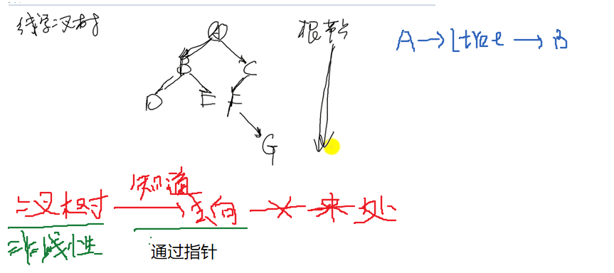


**线索化的目的 : 快速的获取某一节点的前驱点后继点**

先序遍历:

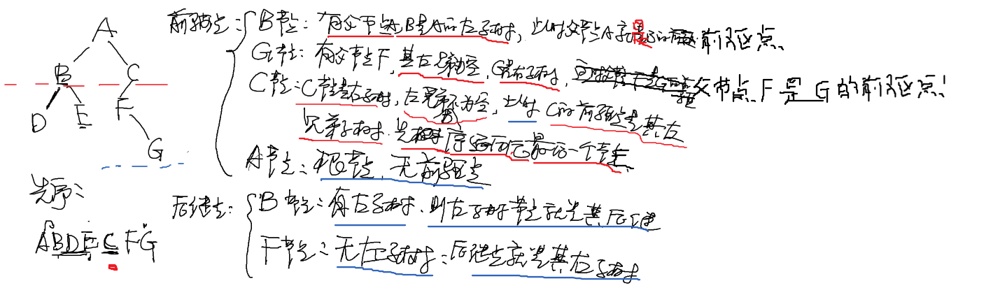

中序遍历(最简单)

**前驱点: 左子树的最右下的节点(E)**

**后继点: 右子树最左下节点**


后序遍历


-------------


## 线索二叉树原理及创建线索二叉树


**二叉树**


**当前节点的左子树如果必要,需要指向前驱点.**

**当前节点的右子树如果必要,需要指向当前节点.**

```c
struct BinTree_node
{
	unsigned char elem;
	struct BinTree_node *ltree, *rtree;
	int lflag, rflag;  // 标志位
};
struct BinTree_node *pre = NULL; //

//中序线索化
void In_order_Thread(struct BinTree_node *tree)
{
	if(tree)
	{
		//1.Do_Inorder_Thread to ltree
		In_order_Thread(tree->ltree);  //中序线索化左子树   // 会通过递归找到最左下的

		//2.Deal with current node,    // 处理根节点
		if(!tree->ltree)  // 没有左子树
		{
			tree->lflag = 1;  // 更新标志位
			//current node's ltree points to the pre node //当前节点的左子树指向前驱点
			tree->ltree = pre;   //去指向前驱点上
        }
		else
			tree->lflag = 0; // 左子树不为空的情况


		if(pre)  // 如果有前驱点的话:
		{
			if(!pre->rtree)  // 如果当前的前驱点没有右子树
			{
				pre->rflag = 1;
				pre->rtree = tree; // 指向当前操作的那点(和上述代码其实是相互指的 ))
			}
			else
				pre->rflag = 0;
		}
		pre = tree; // 更新前驱点的位置,最终指向最后的点. tree的位置通过递归的方式更新的

		//3.Do_Inorder_Thread to rtree
		In_order_Thread(tree->rtree); //中序线索化右子树
	}
}
//创建中序线索化二叉树
void Create_Inorder_Thread(struct BinTree_node *T)
{
	if(T) // 判断二叉树存在
	{
		In_order_Thread(T);  //中序创建
		// 最终节点的:
		pre->rtree = NULL;
		pre->rflag = 1;
	}
}
```


```c
int main(void)
{
	struct BinTree_node *mytree;
	char ch;
	struct BinTree_node *node, *precursor, *succeed;

	printf("Please input a preorder binary tree(with fill blank #):\n");
	mytree = Create_BinTree();  //使用补空法
	pre_order(mytree); //先序遍历一下,查看.
	printf("\n");

	Create_Inorder_Thread(mytree);  // 调用创建
	
	return 0;	
}
```


## 遍历线索二叉树


```c
//遍历中序线索化
void Traverse_Inorder_Thread(struct BinTree_node *tree)
{
	while(tree)
	{
		while(tree->lflag == 0)  // 一直往下找左子树,找前的左子树
			tree = tree->ltree;  //更新内容
		printf("%c ", tree->elem);  //打印一下

		while((tree->rflag == 1) && (tree->rtree))  // tree->rtree表示后继节点为空
		{
			tree = tree->rtree;  // 找到后继节点
			printf("%c ", tree->elem);
		}
		tree = tree->rtree;
	} 
}
```


```c
#include <stdio.h>
#include <stdlib.h>

struct BinTree_node
{
	unsigned char elem;
	struct BinTree_node *ltree, *rtree;
	int lflag, rflag;    // 标志位
};

struct BinTree_node *pre = NULL;

void pre_order(struct BinTree_node *tree);
void in_order(struct BinTree_node *tree);
void pos_order(struct BinTree_node *tree);

struct BinTree_node *create_bintree(void); //ask_method
struct BinTree_node *Create_BinTree(void); //fill_blank_method
void In_order_Thread(struct BinTree_node *tree);
void Create_Inorder_Thread(struct BinTree_node *T);
void Traverse_Inorder_Thread(struct BinTree_node *tree);
struct BinTree_node *Search_Inorder_Thread(struct BinTree_node *tree, char ch);
struct BinTree_node *Prenode_Inorder_Thread(const struct BinTree_node *node);
struct BinTree_node *Succnode_Inorder_Thread(const struct BinTree_node *node);

int main(void)
{
	struct BinTree_node *mytree;
	char ch;
	struct BinTree_node *node, *precursor, *succeed;

	printf("Please input a preorder binary tree(with fill blank #):\n");
	mytree = Create_BinTree();  //使用补空法
	pre_order(mytree); //先序遍历一下,查看.
	printf("\n");

	Create_Inorder_Thread(mytree);  // 调用创建
	printf("Traverse Inorder_Thread Tree:");
	Traverse_Inorder_Thread(mytree);  // 调用遍历中序线索化
	printf("\n");

	printf("Please enter the node that you want to find it's pre & succ node:\n");  // 输入你要找的节点
	while((ch = getchar()) == '\n');   // 干掉回车
	node = Search_Inorder_Thread(mytree, ch);

	precursor = Prenode_Inorder_Thread(node);  //  调用找前驱点的函数
	if(precursor == NULL) // 如果有
		printf("node %c has no precursor node\n", node->elem);// 打印一下找到的node 的前驱点
	else
		printf("Precursor node = %c\n", precursor->elem);

	succeed = Succnode_Inorder_Thread(node);
	if(succeed == NULL)
		printf("node %c has not succeed node\n", node->elem);
	else
		printf("Succeed node = %c\n", succeed->elem);

	return 0;
}

struct BinTree_node *create_bintree(void)
{
	unsigned char flag;
	struct BinTree_node *tree;

	tree = (struct BinTree_node *)malloc(sizeof(struct BinTree_node));
	printf("Please input the node elem:\n");
	while((tree->elem = getchar()) == '\n');
	printf("Do you want to insert l_tree for %c, (Y/N)?\n", tree->elem);
	while((flag = getchar()) == '\n');

	if(flag == 'Y')
		tree->ltree = create_bintree(); // 去创建左子树
	else
		tree->ltree = NULL;

	printf("Do you want to insert r_tree for %c, (Y/N)?\n", tree->elem);
	while((flag = getchar()) == '\n');

	if(flag == 'Y')
		tree->rtree = create_bintree();
	else
		tree->rtree = NULL;

	return tree;
}

struct BinTree_node *Create_BinTree(void) //fill_blank_method
{
	char ch;
	struct BinTree_node *tree; 

	scanf("%c", &ch);  // 单子符读取

	if(ch == '#')
		tree = NULL;
	else
	{
		tree = (struct BinTree_node *)malloc(sizeof(struct BinTree_node));
		tree->elem = ch;
		tree->ltree = Create_BinTree();
		tree->rtree = Create_BinTree();
	}

	return tree;
}

void pre_order(struct BinTree_node *tree)
{
	if(tree)
	{
		printf("%c", tree->elem);
		pre_order(tree->ltree);
		pre_order(tree->rtree);
	}
}

void in_order(struct BinTree_node *tree)
{
	if(tree)
	{
		in_order(tree->ltree);
		printf("%c", tree->elem);
		in_order(tree->rtree);
	}
}

void pos_order(struct BinTree_node *tree)
{
	if(tree)
	{
		pos_order(tree->ltree);
		pos_order(tree->rtree);
		printf("%c", tree->elem);
	}
}

//中序线索化的实现
void In_order_Thread(struct BinTree_node *tree)
{
	if(tree)
	{
		//1.Do_Inorder_Thread to ltree
		In_order_Thread(tree->ltree);  //中序线索化左子树

		//2.Deal with current node, 
		if(!tree->ltree)  // 没有左子树
		{
			tree->lflag = 1;  //更新标志位
			//current node's ltree points to the pre node //当前节点的树指向前驱点
			tree->ltree = pre;
		}
		else
			tree->lflag = 0;

		if(pre)  // 如果有前驱点
		{
			if(!pre->rtree)  // 如果当前的前驱点右子树
			{
				pre->rflag = 1;
				pre->rtree = tree; // 指向当前操作的那点
			}
			else
				pre->rflag = 0;
		}
		pre = tree; // 更新前驱点的位置,最终指向最后的点.tree的位置通过递归的方式更新的

		//3.Do_Inorder_Thread to rtree
		In_order_Thread(tree->rtree); //中序线索化右子树
	}
}
//创建中序线索化二叉树
void Create_Inorder_Thread(struct BinTree_node *T)
{
	if(T) // 判断二叉树真的存在
	{
		In_order_Thread(T);  //中序线索化创建
		// 最终节点的:
		pre->rtree = NULL;
		pre->rflag = 1;
	}
}


//遍历中序线索化
void Traverse_Inorder_Thread(struct BinTree_node *tree)
{
	while(tree)
	{
        // 直接找到最下面的
		while(tree->lflag == 0)  // 一直往下找左子树找到最左下的点,找前的左子树(第一个节点)
			tree = tree->ltree;  // 更新内容
		printf("%c", tree->elem);  // 打印一下第一个节点

		while((tree->rflag == 1) && (tree->rtree))  //tree->rflag == 1 . tree->rtree表示后继节点为空(右子树确实有内容)
		{
			tree = tree->rtree;  // 找到后继节点
			printf("%c", tree->elem);
		}
        
		tree = tree->rtree; //更新
	} 
}

// 直接找左子树
//没有右子树,在找后继点


//查找中序线索化
struct BinTree_node *Search_Inorder_Thread(struct BinTree_node *tree, char ch)
{
	while(tree)
	{	//在前驱点里找
		while(tree->lflag == 0)  // 一直更新找到最左下的
			tree = tree->ltree;
		if(tree->elem == ch)  // 如果当前的节点就是要找的就直接返回当前节点
			return tree;
		// 在后继节点找
		while((tree->rflag == 1) && (tree->rtree))
		{
			tree = tree->rtree;
			if(tree->elem == ch)  // 如果当前的节点就是要找的就直接返回当前节点
				return tree;
		}
		tree = tree->rtree;
	} 	
}
//找一个节点前驱点
struct BinTree_node *Prenode_Inorder_Thread(const struct BinTree_node *node)   // const 用的时候不能改,因为改了再找后继就不对了
{
	struct BinTree_node *nd;

	if(node->lflag == 1) //左子树指向的是前驱点
		return node->ltree;  // 以为当前左子树的指针域就是指向前驱点的
	else
	{ // 有左子树的话 // 没有前驱点则当前节点左子树最右下的
		nd = node->ltree; // 当前的
		while(nd->rflag == 0) // 找最右下的
			nd = nd->rtree; //更新
		return nd;
	}
}
// 没有左子树,找前驱点
// 有就直接找左下的


//找后继点
struct BinTree_node *Succnode_Inorder_Thread(const struct BinTree_node *node)
{
	struct BinTree_node *nd;

	if(node->rflag == 1)  //右子树指向的是后继点
		return node->rtree;
	else
	{// 没有后继点则当前节点右子树最左下的
		nd = node->rtree;
		while(nd->lflag == 0)
			nd = nd->ltree;
		return nd;
	}
}
```


## 还原遍历二叉树


```C
#include <stdio.h>
#include <stdlib.h>

struct BinTree_node
{
	unsigned char elem;
	struct BinTree_node *ltree, *rtree;
};

void pre_order(struct BinTree_node *tree);
void in_order(struct BinTree_node *tree);
void pos_order(struct BinTree_node *tree);

struct BinTree_node *create_bintree(void);
struct BinTree_node *pre_in_CreateBinTree(char *pre, char *in, int len);
struct BinTree_node *in_post_CreateBinTree(char *in, char *post, int len);

int main(void)
{
	struct BinTree_node *mytree;

	char pre[100], in[100], post[100];  //  存放 先序,中序,后续 的字符串
	int choose, n;
	
	while (scanf("%d", &choose))  //接受输入的数字
	{
		// 两个选项
		printf("1. Revert BinaryTree through pre & in order:\n");   // 先序+中序的方式  恢复二叉树
		printf("2. Revert BinaryTree through in & post order:\n");  // 先序+中序的方式  恢复二叉树
		switch(choose)
		{
			case 1:
				printf("Please enter the number of nodes:");
				scanf("%d", &n);
				getchar(); //干掉回车
				printf("Please enter the pre order:");
				gets(pre);  //用scanf也行
				printf("Please enter the in order:");
				gets(in);

				mytree = pre_in_CreateBinTree(pre, in, n);  // 恢复的二叉树
				printf("After revert, show the bintree in post order:");
				pos_order(mytree); //以后序的方式打印一下,恢复判断是否正确
				printf("\n");
				break;
			case 2:
				printf("Please enter the number of nodes:");
				scanf("%d", &n);
				getchar();
				printf("Please enter the in order:");
				gets(in);
				printf("Please enter the post order:");
				gets(post);

				mytree = in_post_CreateBinTree(in, post, n);
				printf("After revert, show the bintree in pre order:");
				pre_order(mytree);  //以先序的方式打印一下,恢复判断是否正确
				printf("\n");
				break;
		}
	}
	return 0;
}

struct BinTree_node *create_bintree(void)
{
	unsigned char flag;
	struct BinTree_node *tree;

	tree = (struct BinTree_node *)malloc(sizeof(struct BinTree_node));
	printf("Please input the node elem:\n");
	while((tree->elem = getchar()) == '\n');
	printf("Do you want to insert l_tree for %c, (Y/N)?\n", tree->elem);
	while((flag = getchar()) == '\n');

	if(flag == 'Y')
		tree->ltree = create_bintree();
	else
		tree->ltree = NULL;

	printf("Do you want to insert r_tree for %c, (Y/N)?\n", tree->elem);
	while((flag = getchar()) == '\n');

	if(flag == 'Y')
		tree->rtree = create_bintree();
	else
		tree->rtree = NULL;

	return tree;
}

void pre_order(struct BinTree_node *tree)
{
	if(tree)
	{
		printf("%c", tree->elem);
		pre_order(tree->ltree);
		pre_order(tree->rtree);
	}
}

void in_order(struct BinTree_node *tree)
{
	if(tree)
	{
		in_order(tree->ltree);
		printf("%c", tree->elem);
		in_order(tree->rtree);
	}
}

void pos_order(struct BinTree_node *tree)
{
	if(tree)
	{
		pos_order(tree->ltree);
		pos_order(tree->rtree);
		printf("%c", tree->elem);
	}
}
// 还原遍历二叉树 (先序+中序的方式)
struct BinTree_node *pre_in_CreateBinTree(char *pre, char *in, int len)    // char *pre 先序的字符串, char *in中序的字符串, int len 个数
{
	struct BinTree_node *tree;

	if(len == 0)    //(最后写出来的) 递归退出条件(左右子树长度为零了就结束)
		return NULL;

	char ch = pre[0]; //先序遍历的根节点
	int index = 0; // 索引编号

	while(in[index] != ch)  // 在中序的字符串中找到根节点
		index++;  // 找到编号
	
	tree = (struct BinTree_node *)malloc(sizeof(struct BinTree_node));  //创建一个二叉树
	tree->elem = ch;  // 把找到的总根节点存入
	// 递归去找左右子树的根节点:
	tree->ltree = pre_in_CreateBinTree(pre+1, in, index);  // pre+1 相当于从A到B了() pre+1指针移动  index : 左子树的长度(正好是从中序遍历根节点开始非左右)
	tree->rtree = pre_in_CreateBinTree(pre+index+1, in+index+1, len-index-1);  // pre+index+1 指针移动到右子树的位置   in+index+1 同理   len-index-1 右子树的长度

	return tree;
}
// 还原遍历二叉树 (先序+中序的方式)(中序+后序)
struct BinTree_node *in_post_CreateBinTree(char *in, char *post, int len)
{
	struct BinTree_node *tree;

	if(len == 0) //(最后写出来的) 递归退出条件(左右子树长度为零了就结束)
		return NULL;

	char ch = post[len-1];  //后序遍历的根节点
	int index = 0;
	while(in[index] != ch)   // 在中序的字符串中找到根节点
		index++;

	tree = (struct BinTree_node *)malloc(sizeof(struct BinTree_node));
	tree->elem = ch;
	tree->ltree = in_post_CreateBinTree(in, post, index);   // in 相当于从A开始  index : 左子树的长度(正好是从中序遍历根节点开始非左右)
	tree->rtree = in_post_CreateBinTree(in+index+1, post+index, len-index-1); // in+index+1 指针移动到右子树的位置   post+index 同理   len-index-1 右子树的长度


	return tree;
}
```


效果:


c输入方法


```c
	tree = (struct BinTree_node *)malloc(sizeof(struct BinTree_node));
	printf("Please input the node elem:\n");
	while((tree->elem = getchar()) == '\n');  // getchar()是c语言中的一个函数,可以用它来赋一个字符的值.(输入一个字符)
	printf("Do you want to insert l_tree for %c, (Y/N)?\n", tree->elem);
	while((flag = getchar()) == '\n');\
---------------------------------------------
	            // 数字到字符
	            printf("Please enter the number of nodes:");
				scanf("%d", &n);
				getchar(); //干掉回车
				printf("Please enter the pre order:");
				gets(pre);  //用scanf也行
```

C语言输入单字符避免回车的四种方法

1. 在scanf（）中使用'\n'屏蔽回车符号。

```
scanf("%d\n", &n);
scanf("%c", &c);
```

　　2.在scanf（）格式串最前面添加空格，屏蔽回车字符。

```
scanf("%d", &n);
scanf(" %c", &c); //%c 前面加空格，过滤回车
```

　　3.在接收字符前，使用[getchar](https://so.csdn.net/so/search?q=getchar&spm=1001.2101.3001.7020)（）来读取一次回车符号。

```
scanf("%d", &n);
getchar();// 专门用来读取上次输入的回车字符
scanf("%c", &c);
```

　　4.在接收字符前，使用fflush（）清空输入流中缓冲区中的内容。

```
scanf("%d", &n);
fflush(stdin);//清空输入流缓冲区的字符，注意必须引入#include<stdlib.h>头文件
scanf("%c", &c);
```

5. ```c
   u = getchar();
   while(getchar() != '\n');  // 表示干掉回车  // 就用这个
   v = getchar();
   ```

##  树和森林

**树:** 

**树的定义是递归的,  可以无限套娃！**每次拿到的都可以认为是根

树（Tree）是一种非线性的数据结构。

树是n（n≥0）个节点的有限集。n=0时，称为空树。

树由**唯一的根**和若干棵互不相交的**子树**组成。


 **森林:**

由树组成森林, 其定义是：**若干棵互不相交的树的集合**。

森林

**二叉树:** 


二叉树就是有限制条件的树, 限制条件有二：


**节点的度：节点拥有的子树个数或者分支的个数。**

二叉树的节点:


------------

   **树 -> 二叉树**


一颗普通的树

**1.加线**。在所有的兄弟结点之间加一条线。


**2.去线**。树中的每个结点，只保留它与**第一个孩子结点**的连线，删除其他孩子结点之间的连线。


**3.调整**。以树的根结点为轴心，将整个树调节一下（第一个孩子是结点的左孩子，兄弟转过来的孩子是结点的右孩子）


最终结果为：


 **二叉树 -> 树**

二叉树转换为树就是个逆过程

**1.调整**。将二叉树从左上到右下分为若干层。然后调整成水平方向。


**2.加线。**找到每一层节点在**其上一层的父节点**，加线。

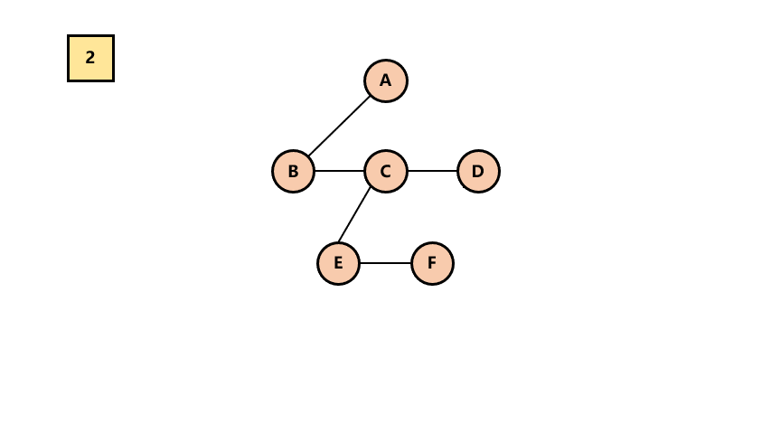


3.**去线**。去除兄弟节点之间的连线。

最终结果为：


**二叉树 -> 森林**

根据孩子兄弟表示法，**根节点是没有兄弟的**。

前提：加入一棵二叉树的根节点有右孩子，则这棵二叉树能够转换为森林，否则转换为一棵树。


**1.删除右孩子连线。**

从根节点开始，**若右孩子存在**，则**把与右孩子结点的连线删除**。再查看分离后的二叉树，若其根节点的右孩子存在，则连续删除。直到所有这些根结点与右孩子的连线都删除为止。


2.**将每棵分离后的二叉树转换为树**。


最终结果为：


## **二叉树种类**


## 二叉树的储存方式


## 二叉树高度和深度

+ 深度和高度都是从0开始算或者 从1开始算
  + 区别:
    + 计算就是看层数：
      如果根结点第0，层数=深度=高度-1
      如果根结点第1，层数=深度=高度
    + 

**深度是从根节点数到它的叶节点；**
**高度是从叶节点数到它的根节点；**
注意： 树的深度和高度一样，但是具体到树的某个节点，其深度和高度不一样。


如图：树的高度和深度都为4(看层数）；
节点8的深度为3；节点9的高度为2；

## 二叉树创建

### **问询法**:

```c++
#include <stdio.h>
#include <stdlib.h>

// 二叉树节点的数据表示类型
struct BinTree_node  
{
	unsigned char elem; //数据域
	struct BinTree_node *ltree, *rtree; //左子树的根节点 //右子树的根节点
};

struct BinTree_node *create_bintree(void); //

int main(void)
{
	struct BinTree_node *mytree;

	mytree = create_bintree();  //他的返回值是 struct BinTree_node *

	return 0;
}

//创建二叉树
struct BinTree_node *create_bintree(void)
{
	unsigned char flag;
	struct BinTree_node *tree;
    
    tree = (struct BinTree_node *)malloc(sizeof(struct BinTree_node));
    printf("请输入节点数据:\n");
    // 数据域
    while((tree->elem = getchar()) == '\n');  //相当于cin.get(),要去消除消除回车
                                                // 不是回车就不会进行

    //创建左子树
    printf("你想插入左子树%c, (Y/N)吗?\n", tree->elem); //存储根节点的数据  
    while((flag = getchar()) == '\n'); 

    if(flag == 'Y')
        tree->ltree = create_bintree(); //递归调用的方式创建左子树
    else
        tree->ltree = NULL;  // 不想创建的话,左子树为空就行

    
    //创建右子树
    printf("你想插入右子树%c, (Y/N)吗?\n", tree->elem);
    while((flag = getchar()) == '\n');

    if(flag == 'Y')
        tree->rtree = create_bintree(); // tree->rtree  右子树
    else
        tree->rtree = NULL;

    return tree;
}
```
### **补空法:**

首先把二叉树的为空的地方写成#


```c++
#include <stdio.h>
#include <malloc.h>

typedef char BTData;

typedef struct tree
{
	BTData data;
	struct tree* left;
	struct tree* right;

}tree;

// 补空法
tree* create()
{
	char val;
	tree* myTree;
	scanf_s("%c", &val);
	if (val == '#')
	{
		myTree = NULL;
	}
	else
	{
		myTree = malloc(sizeof(struct tree));   // 树节点
		if (myTree)
		{
			myTree->data = val;
			myTree->left = create();
			myTree->right = create();
		}
	}
	return myTree;
}

void pre_order(tree* tree)
{
	if (tree)
	{
		printf("%c ", tree->data);
		pre_order(tree->left);
		pre_order(tree->right);
	}
}

int main(void)
{
	tree* tree;
	tree = create();
	pre_order(tree);
	while (1);
	return 0;
}
```


#### 凹入表打印树结构

```c++
//凹入表打印树结构
void printHelp(tree* p, string ss)
{
	if (p == NULL)
		return;
	ss += "   ";
	printHelp(p->right, ss);
	cout << ss << p->data << endl;
	printHelp(p->left, ss);
}

int main(void)
{
	cout << "请输入树: ";
	tree* root = insert();
	printHelp(root, " ");
	return 0;
}
```


## 二叉搜索树创建

```c
#include <stdio.h>
#include <malloc.h>
#include <cstdlib>
#include <stdio.h>

typedef char BTData;

typedef struct node
{ //树的结点
    int data;
    struct node* left;
    struct node* right;
} Node;

// 这样写主要是好看 
typedef struct
{ 
    Node* root;  // 指向根节点的指针//树根

} Tree;

void insert(Node* &root, int data)  //创建树  // 和创建链表差不多
{
    //创建一个节点(树和链表就是节点组成的)
    Node* node = (Node*)malloc(sizeof(Node));
    node->data = data;
    node->left = NULL;
    node->right = NULL;

    //判断树是不是空树
    if (root == NULL)
    {
        root = node;
    }

    else if (data > root->data)
    {
        insert(root->right, data);
    }
    else
    {
        insert(root->left, data);
    }
}

void inorder(node* root)//树的前序遍历
{
    if (root)
    {
        printf("%d ", root->data);
        inorder(root->left);
        inorder(root->right);
    }
}

void infix_order(Node* root)
{
	if (root)
	{
		infix_order(root->left);
		printf("%d ", root->data);
		infix_order(root->right);
	}
}

void pos_inorder(node* root)
{
    if (root)
    {
        inorder(root->left);
        inorder(root->right);
        printf("%d ", root->data);
    }
}

int main()
{
    Tree tree;
    tree.root = NULL;  //创建一个空树
    //insert(tree.root, 10);   // 树根
    //insert(tree.root, 88);
    //insert(tree.root, 4);
    //insert(tree.root, 33);
    //insert(tree.root, 666);
    //insert(tree.root, 999);

    for (int i = 0; i < 10; i++)//输入n个数并创建这个树
    {
        insert(tree.root, i);
    }
    infix_order(tree.root);

    return 0;
}

```


二叉搜索树的意义主要是中序遍历是有序的;

```c++
#include <cstdlib>
#include <stdio.h>
 
typedef struct node{ //树的结点
    int data;
    struct node* left;
    struct node* right;
} Node;
 
typedef struct { //树根
    Node* root;
} Tree;
 
void insert(Tree* tree, int value)//创建树
{
    Node* node=(Node*)malloc(sizeof(Node));//创建一个节点
    node->data = value;
    node->left = NULL;
    node->right = NULL;
    if (tree->root == NULL)//判断树是不是空树
    {
        tree->root = node;
    }
    
    else {//不是空树
        Node* temp = tree->root;//从树根开始
        while (temp != NULL)
        {
            if (value < temp->data)//小于就进左儿子
            {
                if (temp->left == NULL)
                {
                    temp->left = node;
                    return;
                }
                else {//继续判断
                    temp = temp->left;
                }
            }
            else {//否则进右儿子
 
                if (temp->right == NULL)
                {
                    temp->right = node;
                    return;
                }
                else {//继续判断
                    temp = temp->right;
                }
            }
        }
    }
    return;
}
 
void inorder(Node* node)//树的中序遍历
{
    if (node != NULL)
    {
        inorder(node->left);
        printf("%d ",node->data);
        inorder(node->right);
    }
}
 
int main()
{
    Tree tree;
    tree.root = NULL;//创建一个空树
    int n;
    scanf("%d",&n);
    for (int i = 0; i < n; i++)//输入n个数并创建这个树
    {
        int temp;
        scanf("%d",&temp);
        insert(&tree, temp);
    }
    inorder(tree.root);//中序遍历
    getchar(); getchar();
    return 0;
}
```


## N叉树

```c++
#include <iostream>
#include <vector>
using namespace std;
#ifndef DBM_MTREE_H
#define DBM_MTREE_H

typedef int T;
typedef struct MNode {
    T element;                // 数据
    MNode *Parent;            // 父指针节点
    vector<MNode*> children;  // 孩子指针节点(数组)
} MNode;

class MTree {
private:
    MNode *root;
public:
    void init(MNode *root);
    void putChild(MNode* node,MNode* parent);
    void putChildren(vector<MNode*> nodes, MNode *parent);
    void tranversal(MNode *root);
    void tranversal();
    int getMaxDepth(MNode *root,vector<MNode*> nodes);
};
    
//放入大根节点
void MTree::init(MNode *root)
{
    this->root = root;     // 设置好根
}

// 插入
void MTree::putChild(MNode *node, MNode *parent) 
{
    parent->children.push_back(node);
    node->Parent = parent;          // 设置当前孩子的父节点
}

void MTree::putChildren(vector<MNode *> nodes, MNode *parent) 
{
    for (int i = 0; i < nodes.size(); ++i) 
    {
        putChild(nodes[i], parent);
    }
}

// 遍历
void MTree::tranversal() 
{
    this->tranversal(this->root);
}

void MTree::tranversal(MNode *root) 
{
    vector<MNode *> nodes = root->children;
    for (int i = 0; i < nodes.size(); ++i) 
    {
        if (nodes[i]->children.size() > 0)
            tranversal(nodes[i]);
        else
            cout << nodes[i]->element << ",";
    }
    cout << root->element << ",";
}

int MTree::getMaxDepth(MNode *root,vector<MNode*> nodes) 
{
    auto iResult = 0;

    return iResult;
}
```


## 平衡二叉树

AVL树(平衡二叉树)概念:

- 左子树和右子树的高度之差的**绝对值小于等于1**

- **左子树和右子树也是平衡二叉树**

- **节点:  比普通的二叉树增加了高度属性**(方便判断平衡)

- 树的目的:  搜索效率比其他数据结构更高

  

引入**平衡因子**（BF）的概念 : 

+ [平衡因子](https://so.csdn.net/so/search?q=平衡因子&spm=1001.2101.3001.7020)  =     **结点**左子树的高度  -   **结点**右子树的高度。

**当所有结点的平衡因子只能是-1、0、1，时才是一个平衡二叉树**


**失衡的概念 :** 

+ 在出现不平衡的时候(插入删除操作进行的时候)，**旋转! ! !**

新插入一个节点出现不平衡的情况:

+ 失衡(不平衡)的四种情况:
+ 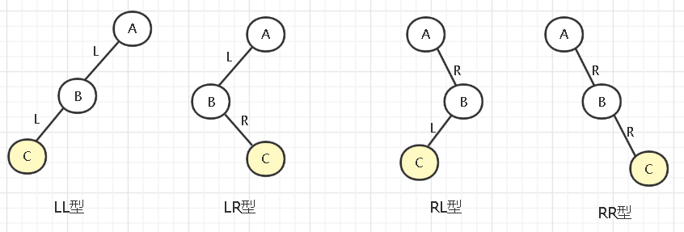

**LL型调整**

如下，在实际情况中，调整的内容可能看起来更复杂，如下方块的表示省略了n个结点，调整的方式如下(右旋)：


步骤为：

- B结点和它的右子树(β和新添加的C结点)一起上升
- A结点变为B结点的左子树
- 原来B的左子树α变为A的右子树


**LR型调整**

LR型的跳转如下(左旋再右旋)：


- 首先让B和它的子树(除了C)左旋至C的左子树，把C为根的树接入A的左子树
- 然后让A右旋，成为C的右子树 


**注意: 根节点要全局和局部的概念**


----------------------------

思路: [链接]([二叉树 - ProcessOn](https://www.processon.com/diagraming/6309d5b75653bb0715e385d2))大致内容如下:


```c++
#pragma once

template <class T>
struct TreeNode
{
	T        data;    // 数据
	TreeNode* pLeft;   // 左孩子
	TreeNode* pRight;  // 右孩子
	int      height;  // 高度

	TreeNode(const T& data) : data(data)  // 为了方便使用构造器
	{
		pLeft = pRight = NULL;
		height = 0;
	}
};


template <class T>
class AVLTree
{
private:
	TreeNode<T>* pRoot;  // 指向根节点的指针
	void _insertNodeToTree(TreeNode<T>*& root, const T& data);  // & root目的是为了修改它 // 私有的函前面用_标记是私有的
	int _getHeight(TreeNode<T>* pRoot);

	//右旋对应1 
	TreeNode<T>* RR(TreeNode<T>* root);
	//左旋对应2 
	TreeNode<T>* LL(TreeNode<T>* root);
	//左右旋对应3
	TreeNode<T>* LR(TreeNode<T>* root);
	//右左旋对应4
	TreeNode<T>* RL(TreeNode<T>* root);

public:
	AVLTree() { pRoot = NULL; }
	~AVLTree() {}

	void insert(const T& data);

};


template <class T>
void AVLTree<T>::insert(const T& data)
{
	_insertNodeToTree(pRoot, data);  // 看似对此一举是为了安全
}

template <class T>
void AVLTree<T>::_insertNodeToTree(TreeNode<T>*& root, const T& data)
{
	//作为一颗平衡二叉树，先是一颗有序二叉树
	// 1. 以有序二叉树方式插入
	if (root == NULL)
	{
		root = new TreeNode<T>(data);    // 这里的本质用新的节点替换NULL  // 插入
	}


	// 递归:  (本质就是把复杂的问题变简单,抓住函数的作用,比如这里的_insertNodeToTree:就是往一颗树里面插入一个节点,莫去想其他的)
	else if (data > root->data)
	{
		_insertNodeToTree(root->pRight, data);   // 递归调用,传进去的是root->PRight, 所以pRoot是永远指向最出的根节点

		// 2. 检查是否需要旋转，需要就旋转(是根据之前的左右子树高度判断的)
		if (_getHeight(root->pRight) - _getHeight(root->pLeft) > 1)
		{ // 2.1 右边比左边高
			// 2.2 判断是那种不平衡   2或4
			if (data > root->pRight->data)  // 看不平衡的图
			{// 2
				printf("左旋\n");
				root = LL(root);  // 以root为轴左旋
			}
			else
			{// 4
				printf("右左旋\n");
				root = RL(root);
			}
		};
	}
	else
	{
		_insertNodeToTree(root->pLeft, data);

		// 2. 检查是否需要旋转，需要就旋转(是根据之前的左右子树高度判断的)
		if (_getHeight(root->pLeft) - _getHeight(root->pRight) > 1)
		{// 2.1 左边比右边高
			// 2.2 判断是那种不平衡 1和3
			if (data < root->pLeft->data)
			{// 1
				printf("右旋\n");
				root = RR(root);   // 以root为轴右旋 然后 返回值赋值给root修改根节点
			}
			else
			{// 3
				printf("左右旋\n");
				root = LR(root);
			}
		}
	}

	// 3. 每插入一个节点,设置高度9(这里根结点第1，所以层数=深度=高度)
	int lH = _getHeight(root->pLeft);
	int RH = _getHeight(root->pRight);
	root->height = lH > RH ? (lH + 1) : (RH + 1);
	printf("当前节点的高度%d", root->height);
}

// 得到高度
template<class T>
inline int AVLTree<T>::_getHeight(TreeNode<T>* pRoot)
{
	if (pRoot)
		return pRoot->height;
	return 0;
}

//右旋
template<class T>
inline TreeNode<T>* AVLTree<T>::RR(TreeNode<T>* root)
{
	//1. pTemp记录root的左孩子
	TreeNode<T>* pTemp = root->pLeft;

	//2. pTemp的右孩子成为root的左孩子
	root->pLeft = pTemp->pRight;

	//3. root成为pTemp的右孩子
	pTemp->pRight = root;

	//4. 重新设置高度
	int lH = _getHeight(root->pLeft);
	int RH = _getHeight(root->pRight);
	root->height = lH > RH ? (lH + 1) : (RH + 1);

	//5. pTemp返回回去
	return pTemp;
}

// 左旋
template<class T>
inline TreeNode<T>* AVLTree<T>::LL(TreeNode<T>* root)
{
	//1. pTemp记录root的右孩子
	TreeNode<T>* pTemp = root->pRight;

	//2. pTemp的左孩子成为root的右孩子
	root->pRight = pTemp->pLeft;

	//3. root成为pTemp的左孩子
	pTemp->pLeft = root;

	//4. 重新设置高度
	int lH = _getHeight(root->pLeft);
	int RH = _getHeight(root->pRight);
	root->height = lH > RH ? (lH + 1) : (RH + 1);

	//5. pTemp返回回去
	return pTemp;
}

//左右旋
template<class T>
inline TreeNode<T>* AVLTree<T>::LR(TreeNode<T>* root)
{
	root->pLeft = LL(root->pLeft);  // 先以root的左孩子为轴左旋
	return RR(root); // 再以root为轴右旋
}

//右左旋
template<class T>
inline TreeNode<T>* AVLTree<T>::RL(TreeNode<T>* root)
{
	root->pLeft = RR(root->pLeft);  // 先以root的右孩子为轴右旋
	return LL(root); // 再以root为轴左旋
}
```

```c++
#include <iostream>
#include "AVLTree.h"

int main(void)
{
	AVLTree<int> tree;
	tree.insert(10);
	tree.insert(88);
	tree.insert(4);
	tree.insert(33);
	tree.insert(666);
	tree.insert(999);

	while (1);
	return 0;
}
```


## 23树


```c++
#pragma once
#include <cstring>

template <class T>
class MyTwoThreeTree
{
	// 内部类
	struct Node
	{
		int    count;          // 标记当前是2节点(1)还是3节点(2)还是4节点(3)
		T      data[3];        // 数据  // 2节点, 3节点 , 4节点
		Node* pArray[4];       // 节点指针

		Node()
		{
			count = 0;
			memset(data, 0, sizeof(T) * 3);
			memset(pArray, 0, sizeof(Node*) * 4);
		}
	};

	Node* pRoot;  // 指向根节点的指针变量
public:
	//// 防止内存泄露
	//static int newTimes;
	//static int deleteTimes; 

public:
	// 构造器
	MyTwoThreeTree()
	{
		pRoot = NULL;
	}
	// 析构
	~MyTwoThreeTree()
	{
		_clear();
	}

	void insertNode(const T& data);  // 插入
private:
	void _clear();
	void _clear(Node* pDel);
	void _insertNode(Node* node, Node* pParent, const T& data);
};

template<class T>
inline void MyTwoThreeTree<T>::insertNode(const T& data)
{
	if (pRoot)  // pRoot不为空
	{
		_insertNode(pRoot, NULL, data);
	}
	else
	{ // 第一个节点是不一样的
		pRoot = new Node;
		pRoot->count = 1;
		pRoot->data[0] = data;
	}
}

template<class T>
inline void MyTwoThreeTree<T>::_insertNode(Node* node, Node* pParent, const T& data)
{
	if (0 == node->count)  // 当前节点为空
	{
		node->data[0] = data;
		node->count++;
		return;
	}
	if (1 == node->count)  // 2节点
	{
		if (data > node->data[0])  //往右边添加
		{
			if (node->pArray[0]) // 有孩子
			{
				_insertNode(node->pArray[1], node, data);
			}
			else  // 没有孩子
			{     // 往当前孩子添加
				node->data[1] = data;
				node->count++;

			}
		}
		else    //往左边添加
		{
			if (node->pArray[0]) // 有孩子
			{
				_insertNode(node->pArray[0], node, data);

			}
			else // 没有孩子
			{
				node->data[1] = node->data[0];   // 本来左边的放到右边
				node->data[0] = data;
				node->count++;
			}
		}
	}
	else // 3节点
	{
		if (data < node->data[0])  //往最左边插入
		{
			if (node->pArray[0]) // 有孩子
			{
				_insertNode(node->pArray[0], node, data);

			}
			else // 没有孩子
			{
				node->data[2] = node->data[1];   // 本来中间的放到右边
				node->data[1] = node->data[0];   // 本来左边的放到中间
				node->data[0] = data;
				node->count++;
			}
		}
		else if (data < node->data[1]) // 往中间插入
		{
			if (node->pArray[1]) // 有孩子
			{
				_insertNode(node->pArray[1], node, data);

			}
			else // 没有孩子
			{
				node->data[2] = node->data[1];   // 本来中间的放到右边
				node->data[1] = data;
				node->count++;
			}
		}
		else // 往右边插入
		{
			if (node->pArray[2]) // 有孩子
			{
				_insertNode(node->pArray[2], node, data);

			}
			else // 没有孩子
			{
				node->data[2] = data;
				node->count++;
			}

		}
	}

	// 4节点
	if (3 == node->count)
	{

		//1. 创建两个新节点
		Node* node1 = new Node;
		Node* node2 = new Node;
		// node1是当前节点的左边那个
		node1->data[0] = node->data[0];
		node1->count = 1;  // 标记为2节
		node1->pArray[0] = node->pArray[0];
		node1->pArray[1] = node->pArray[1];

		// node2是当前节点的右边那个
		node2->data[0] = node->data[2];
		node2->count = 1;
		node2->pArray[0] = node->pArray[2];
		node2->pArray[1] = node->pArray[3];

		//  临时的储存当前节点的中间值
		T temp = node->data[1];

		if (pParent)  //有父节点
		{
			//找位置
			if (temp < pParent->data[0])  // 左边
			{
				if (pParent->pArray[2])  // 最右边有孩子
				{
					pParent->data[2] = pParent->data[1];
					pParent->data[1] = pParent->data[0];
					pParent->data[0] = temp;

					pParent->pArray[3] = pParent->pArray[2];
					pParent->pArray[2] = pParent->pArray[1];
					pParent->pArray[1] = node2;
					pParent->pArray[0] = node1;
				}
				else if (pParent->pArray[1]) // 中间有孩子
				{
					pParent->data[1] = pParent->data[0];
					pParent->data[0] = temp;

					pParent->pArray[2] = pParent->pArray[1];
					pParent->pArray[1] = node2;
					pParent->pArray[0] = node1;
				}
			}
			else if (pParent->count == 1
				|| (pParent->count > 1) && (temp < pParent->data[1]))  // 中间
			{
				if (pParent->pArray[2])  // 最右边有孩子
				{
					pParent->data[2] = pParent->data[1];
					pParent->data[1] = temp;

					pParent->pArray[3] = pParent->pArray[2];
					pParent->pArray[2] = node2;
					pParent->pArray[1] = node1;
				}
				else if (pParent->pArray[1]) // 中间有孩子
				{
					pParent->data[1] = temp;

					pParent->pArray[2] = node2;
					pParent->pArray[1] = node1;
				}

			}
			else if (pParent->count == 2
				|| (pParent->count > 2) && (temp < pParent->data[2]))  // 右边
			{
				if (pParent->pArray[2])  // 最右边有孩子
				{
					pParent->data[2] = temp;

					pParent->pArray[3] = node2;
					pParent->pArray[2] = node1;
				}

			}

			pParent->count++;
			delete node; //必须释放当前节点，因为已经插入到父节点之内

		}
		else  // 没有父节点
		{
			//2. 当前节点数据改变count变成1 
			memset(node->data, 0, sizeof(T) * 3);  // 清空
			node->data[0] = temp;
			node->count = 1;
			//3. pArray[o]和pArray[1]赋值l  
			memset(node->pArray, 0, sizeof(Node*) * 4);  // 清空
			node->pArray[0] = node1;
			node->pArray[1] = node2;
		}
	}

}

template<class T>
inline void MyTwoThreeTree<T>::_clear()
{
	// 调用带参的_clear从叶子到根删除整颗树
}

template<class T>
inline void MyTwoThreeTree<T>::_clear(Node* pDel)
{
	if (pDel)
		delete pDel;
}
```


## B树B+树

**B树 : **


**B+树 : **


## RB树


## 哈夫曼树

[哈夫曼树 - ProcessOn](https://www.processon.com/diagraming/63330c76f346fb33770197be)

**哈夫曼压缩解压缩原理 :**


```c++
//哈夫曼压缩编码.cpp :定义控制台应用程序的入口点。
//
// 压缩  打包
// 打包
// 压缩  有损压缩 无损压缩

/*
	从直接存储数据变成用某些编码表示数据例如:

	aabbccddeeff  12B == 96bit
	a  b   c  d   e   f
	1  10  11 110 111 1000

	111010 11111101 10111111 10001000  30bit


	压缩过程优化 ---> 哈夫曼压缩
	哈夫曼树  ---> 最佳搜索树
	数据出现: 有的出现得多 有的出现得少
		比如:不同的数去代表字符时:
			aaaabbbccdef
			1111 1010 1011 1111 0111 1000   24bit

			1000 1000 1000 1000 1111 1111 111011011011101
	故:
	出现次数多的编码位数少
	出现次数少的编码位数多
*/


/*
	哈夫曼压缩解压缩:  1. 编码表示数据  2. 出现次数多编码短出现次数少编码长
*/


/*
四个字节数据 整数 RGB() 消息句柄文件

	1.压缩过程
		待压缩文件
		压缩后文件
		1.1分析待压缩文件 获取文件中出现过的字符和出现次数  组合成字典(索引)

		1.2根据字典创建哈夫曼树 获得每个字符的哈夫曼编码 并存入字典中
			1.2.0 准备个数组，存储所有字符节点
			1.2.1 创建出现次数最小的节点和第二小的节点
			1.2.2 创建空的节点成为1.2.1中两个节点的父节点
			1.2.3   数组中1.2.2中创建的节点覆盖1.2.1中出现次数最小的节点，
					并且数组中 1.2.1中第二小的节点置空
			1.2.4 循环直到数组中所有节点都到了树中为止
		1.3 先把字典写入压缩后文件中
		1.4 根据字典中的编码把待压缩文件中的每个字符的哈夫曼编码写入压缩后文件中
		1.5 关闭两个文件


	2. 解压
		压缩后文件
		解压文件
			2.1 把字典读出来
			2.2 根据字典生成哈夫曼树
			2.3	接着读一个个字节读 然后一个个二进制位分析
				如果是叶子节点，就把对应字符写入解压文件中
			2.4 关闭
*/

#include <iostream>
#include <cstdio>

using namespace std;

// 字符
struct ZiFu
{
	unsigned char zf;    // 字符
	unsigned int count;  // 字符出现的次数
	char code[20];       // 哈夫曼压缩编码
	int idx;             // 在字典中的下标
};

// 字典
struct allZiFu
{
	int zf_count;
	ZiFu zf_arr[256];
};

//哈夫曼树节点类型
struct treeNode
{
	ZiFu data;
	treeNode* pLeft;
	treeNode* pRight;
	treeNode* pParent;
};

// 数据打开规则
// .doc  用office wPS
// .png .jpeg .jpg 
// .txt
// .exe .lib
const char* srcFileName = "1src.txt";
const char* dstFileName = "2dst.txt";
const char* FileName = "2src.txt";
treeNode* pRoot = NULL;

//分析待压缩文件, 获取字典 
void analysisFile(const char* fileNaem, allZiFu* zd);
// 创建节点的函数
treeNode* createNode(ZiFu* pZf);
// 根据字典创建哈夫曼树
treeNode* createHaffmanTree(allZiFu* pZd);
//根据哈夫曼树创建哈夫曼编码并写入字典中
void createHaffmanCode(treeNode* root, allZiFu* pZd);  // 遍历树
bool isLeaf(treeNode* root);
void setHaffmannCode(treeNode* root, char* pCodeStr);

// 写压缩后文件(字典, 哈夫曼编码)
void writeCompressed(const char* srcFileName, const char* dstFileName, allZiFu* pZd);
void getHaffmanCode(unsigned char zf, allZiFu* zd, char* pCodeStr);

// 用来测试 analysisFile函数
void _testZd(allZiFu* pZd);

// 分析已压缩, 把字典读出来
void analydstFile(const char* fileNaem, allZiFu* zd);

int main(void)
{
	allZiFu zd;
	memset(&zd, 0, sizeof(struct allZiFu));
	analysisFile(srcFileName, &zd);
	//_testZd(&zd);

	pRoot = createHaffmanTree(&zd);

	createHaffmanCode(pRoot, &zd);
	_testZd(&zd);
	writeCompressed(srcFileName, dstFileName, &zd);
	while (1);
	return 0;
}

//分析待压缩文件
void analysisFile(const char* fileNaem, allZiFu* pZd)
{
	// 1打开文件
	FILE* fp = fopen(fileNaem, "rb");
	if (NULL == fp)
	{
		printf("analysisFile 打开 待压缩文件 %s 失败!\n", fileNaem);
		return;
	}
	// 2循环读取一字节的内容，读到文件末尾停止
	char c;
	int r;
	bool is;
	int i;
	while (1)
	{// 2.1 循环控制
		r = fread(&c, sizeof(char), 1, fp);  // 从文件读取一个字符
		if (1 != r) break;
		// 2.2 统计
		is = false;  // 字符没有出现过
		for (i = 0; i < pZd->zf_count; i++)
		{
			if (c == pZd->zf_arr[i].zf)
			{
				is = true;
				break;
			}
		}// end of for(i)

		if (!is)  // 如果没有出现过
		{
			pZd->zf_count++;
			pZd->zf_arr[i].zf = c;
		}
		pZd->zf_arr[i].count++;
	}// end of while(1)

	// 3关闭文件
	fclose(fp);
}

// 创建节点的函数
treeNode* createNode(ZiFu* pZf)
{

	treeNode* pNew = new treeNode;
	if (NULL == pNew) return NULL;
	memset(pNew, 0, sizeof(treeNode));
	pNew->data = *pZf;
	// or 
	/*memcpy(pNew->data.code, pZf->code, sizeof(char) * 20);
	pNew->data.count = pZf->count;
	pNew->data.zf = pZf->zf;
	*/
	return pNew;
}

// 根据字典创建哈夫曼树
treeNode* createHaffmanTree(allZiFu* pZd)
{
	/*
			1.2.0 准备个数组，存储所有字符节点
			1.2.1 创建出现次数最小的节点 和 第二小的节点
			1.2.2 创建空的节点成为1.2.1中两个节点的父节点
			1.2.3 数组中1.2.2中创建的节点覆盖1.2.1中出现次数最小的节点(在数组中) 并且1.2.1 数组中第二小的节点置空
			1.2.4 循环直到数组中所有节点都到了树中为止
	*/

	// 1.2.0 准备个数组，存储所有字符节点
	treeNode** pArray = new treeNode * [pZd->zf_count];
	treeNode* pTemp = NULL;
	for (int i = 0; i < pZd->zf_count; i++)
	{
		pArray[i] = createNode(&(pZd->zf_arr[i]));
		pArray[i]->data.idx = i;  // 设置下标
	}

	// 1.2.1 
	int minIdx, secMinIdx;
	int j;
	//1.2.1.0 循环找最小的和第二小的 循环n-1 次
	for (int i = 0; i < pZd->zf_count - 1; i++)
	{
		//1.2.1.1 找出最小的和第二小的
		// 找出最小的
		// 找到第一个非空
		j = 0;
		while (pArray[j] == NULL) j++;
		minIdx = j;
		for (j = 0; j < pZd->zf_count; j++)
		{
			if (pArray[j] &&
				pArray[j]->data.count < pArray[minIdx]->data.count)
				minIdx = j;
		}
		//找出第二小的，避开minIdx
		j = 0;
		while (pArray[j] == NULL || j == minIdx) j++;
		secMinIdx = j;
		for (j = 0; j < pZd->zf_count; j++)
		{
			if (pArray[j] &&
				j != minIdx &&
				pArray[j]->data.count < pArray[secMinIdx]->data.count)
				secMinIdx = j;
		}

		//1.2.2 创建树
		// 1.2.2.1 创建新节点
		ZiFu tempZf = {0, pArray[minIdx]->data.count + pArray[secMinIdx]->data.count};
		tempZf.idx = -1;
		pTemp = createNode(&tempZf);
		// 1.2.2.2 创建空的节点成为1.2.1中两个节点的父节点
		pArray[minIdx]->pParent = pTemp;
		pArray[secMinIdx]->pParent = pTemp;

		pTemp->pLeft = pArray[minIdx];
		pTemp->pRight = pArray[secMinIdx];

		// 1.2.1.2.3 pTemp覆盖数组中最小的位置 数组中第二小的位置置空
		pArray[minIdx] = pTemp;
		pArray[secMinIdx] = NULL;
	}

	return pTemp;
}

//根据哈夫曼树创建哈夫曼编码并写入字典中  code
void createHaffmanCode(treeNode* root, allZiFu* pZd)
{
	int idx;
	if (root)
	{
		if (isLeaf(root))
		{ //在字典中设置它的哈夫曼编码
			idx = root->data.idx;
			setHaffmannCode(root, pZd->zf_arr[idx].code);
		}
		else
		{
			//遍历左子树
			createHaffmanCode(root->pLeft, pZd);
			//遍历右子树
			createHaffmanCode(root->pRight, pZd);
		}

	}
}

bool isLeaf(treeNode* root)
{
	if (root && NULL == root->pLeft && NULL == root->pRight)
	{
		return true;
	}
	return false;
}

void setHaffmannCode(treeNode* root, char* pCodeStr)
{
	treeNode* pTemp = root;
	// 一路往上追溯判断是其父节点的左孩子还是右孩子，记录下来
	char buff[20] = {0};  // 临时数值
	int buffIdx = 0;      // buff数值下标
	while (pTemp->pParent)
	{
		if (pTemp == pTemp->pParent->pLeft)
		{//是其父节点左孩子
			buff[buffIdx] = 1;
		}
		else
		{//是其父节点右孩子
			buff[buffIdx] = 2;
		}
		buffIdx++;
		pTemp = pTemp->pParent;
	}
	//逆序存储到pCodeStr指向的内存段中
	char temp;
	for (int j = 0; j < buffIdx / 2; j++)
	{
		temp = buff[j];
		buff[j] = buff[buffIdx - j - 1];
		buff[buffIdx - j - 1] = temp;
	}
	// 赋值
	strcpy(pCodeStr, buff);
}

// 写压缩后文件(字典, 哈夫曼编码)
void writeCompressed(const char* srcFileName, const char* dstFileName, allZiFu* pZd)
{
	//1打开两个文件
	FILE* fpSrc = fopen(srcFileName, "rb");
	FILE* fpDst = fopen(dstFileName, "wb");
	if (NULL == fpSrc || NULL == fpDst)
	{
		printf("打开文件失败!\n");
		return;
	}
	// 2. 往dstFileName文件中写入字典
	fwrite(pZd, 1, sizeof(struct allZiFu), fpDst);
	// 3. 循环读取srcFileName文件中的字节 ― 找到其哈夫曼编码 ― 凑齐八个bit写入dstFileName文件中

	int r;  //fread函数返回值
	char c; //从srcFileName中读取的字节存放于此
	char charForwrite;  //用来存储写入dstFileName中的字节数据
	int idxForwrite;    //写入字节的索引
	int haffmanCodeIdx = 0;  //哈夫曼编码下标code数组下标
	char haffmanCode[20] = {0}; // 存储哈夫曼编码
	bool isEnd = false;
	while (1)
	{
		if (haffmanCode[haffmanCodeIdx] == 0)
		{
			r = fread(&c, 1, 1, fpSrc);
			if (1 != r) break;
			getHaffmanCode(c, pZd, haffmanCode);   // 获得对应字符的哈夫曼编码
			haffmanCodeIdx = 0;
		}

#if 0
		// 测试从字典中获取字符的哈夫曼编码
		printf("%c------------", c);
		for (int i = 0; i < 20; i++)
		{
			printf("%d", haffmanCode[i]);

		}
		printf("\n");
#endif // 0

		idxForwrite = 0;
		charForwrite = 0;

		while (idxForwrite < 8)  // 但他等于8时就进行写入
		{
			if (2 == haffmanCode[haffmanCodeIdx])
			{// 设置该位二进制位为0
				charForwrite &= ~(1 << (7 - idxForwrite));
				idxForwrite++;
				haffmanCodeIdx++;
			}
			else if (1 == haffmanCode[haffmanCodeIdx])
			{// 设置该位二进制位为1
				charForwrite |= (1 << (7 - idxForwrite));
				idxForwrite++;
				haffmanCodeIdx++;
			}
			else
			{//不为1 也不为2 当前字符哈夫曼编码操作完毕，读取下一个字符的哈夫曼编码
				r = fread(&c, 1, 1, fpSrc);
				if (1 != r)
				{
					isEnd = true;
					break;
				}

				getHaffmanCode(c, pZd, haffmanCode);
				haffmanCodeIdx = 0;
			}
		}//end of while (idxForwrite < 8)

		fwrite(&charForwrite, 1, 1, fpDst);//往文件中写入一个字节数据

#if 1
		//测试写入到目的文件中的字节是否正确
		for (int i = 0; i < 8; i++)
		{
			if ((charForwrite & 0x80) == 0x80)
				printf("%d", 1);     //0x80: 10000000
			else
				printf("%d", 0);
			charForwrite <<= 1;
		}
		printf("\n");
#endif // 0
		if (isEnd)
			break;

	}// end of whiel(1)

	// 4. 关闭两个文件
	fclose(fpSrc);
	fclose(fpDst);

}

void getHaffmanCode(unsigned char zf, allZiFu* zd, char* pCodeStr)
{
	for (int i = 0; i < zd->zf_count; i++)
	{
		if (zf == zd->zf_arr[i].zf)
			strcpy(pCodeStr, zd->zf_arr[i].code);
	}
}

// 用来测试 analysisFile函数
void _testZd(allZiFu* pZd)
{
	printf(" 待压缩文件中共有%d个字符\n", pZd->zf_count);
	//for (int i = 0; i < pZd->zf_count; i++)
	//{
	//	printf("%c :%d\n", pZd->zf_arr[i].zf, pZd->zf_arr[i].count);
	//}
	int j;
	for (int i = 0; i < pZd->zf_count; i++)
	{
		printf("%c: %d", pZd->zf_arr[i].zf, pZd->zf_arr[i].count);
		j = 0;
		printf(" : code: ");
		while (pZd->zf_arr[i].code[j])
		{
			printf("%d", pZd->zf_arr[i].code[j]);
			j++;
		}
		printf("\n");
	}


}


/*
2.1 把字典读出来
2.2 根据字典生成哈夫曼树
2.3	接着读一个个字节读 然后一个个二进制位分析
如果是叶子节点，就把对应字符写入解压文件中
2.4 关闭
*/
void analydstFile(const char* fileNaem, allZiFu* zd)
{
	//1打开两个文件
	FILE* fpSrc = fopen(dstFileName, "rb");
	FILE* fpDst = fopen(FileName, "wb");
	if (NULL == fpSrc || NULL == fpDst)
	{
		printf("打开文件失败!\n");
		return;
	}

	// 关闭
	fclose(fpDst);
	fclose(fpSrc);
}

/*
abcdefgaaaaabbdess 待压缩文件中共有8个字符
a : 6
b : 3
c : 1
d : 2
e : 2
f : 1
g : 1
s : 2


00010110
11011001
10011100
00000000
01001010
11000110
11000000

*/
```


# ------------------------------------------------

# 图(Graph)

引言

 图简介

听说户县到咸阳的大巴已经停运了，那么我们去咸阳的话就需要重新计算路线，（我们暂时排除自驾到咸阳的路线）假设我们乘坐公共交通工具前往，并且希望中间的换乘最少，可以到达的部分交通线路如下：


我们从图中可以发现想从石油大学直接到达咸阳湖景区，除了自驾其它并不能一步到达景区，接着我们使用两步、三步、四步发现都不能直接到达景区，最少也得需要五步，路线为：从石油大学东门（周南站）乘坐101路到鄠邑站，然后乘坐动车到达阿房宫站，然后乘坐1061路到达沣东第一学校站，接着换成咸阳郭杜线到达统一广场站，最终不步行到达咸阳湖景区。当然还有其他到达景区的路线，但它们执行起来路程会更远。这个算法发现，前往咸阳湖景区需要五部，这种问题在专业上称为“最短路径问题（shorterest-path problem）”。解决最短路径的问题的算法被称为广度优先搜索。

就像上图一样，我们将路线用图解的形式展现出来，这就是图！其实非常简单，图由节点和边组成。一个节点可能与众多节点直接相连，这些众多节点都被称为这个节点的邻节点，在上图，大十字站和亚迪路站都被称为郭寨桥站的邻节点。

概括起来：图用于模拟不同的东西是如何相连的。


## 图的基本概念

 【知识[框架](https://so.csdn.net/so/search?q=框架&spm=1001.2101.3001.7020)】


一、图的定义
图(Graph)是由顶点的有穷非空集合V(G)和顶点之间边的集合E(G)组成，

通常表示为:**G=(V,E)，其中，G表示图，V是顶点的集合，E是中边的集合**。

若V={01, 02.. .n}，则用|V|表示图G中顶点的个数，也称图G的阶，E= {(u, v)lu eV,v ∈V}，用E表示图G中边的条数。

注意: ，**图中不能一个顶点也没有，图的顶点集V一定非空，但边集E可以为空，此时图中只有顶点而没有边。(编写代码v可以为空.但是实际应用是为空的)** (线性表可以是空表，树可以是空树)
————————————————

 **1、有向图**

若E是有向边(也称弧)的有限集合时，则图G为有向图。弧是顶点的有序对，记为<v, w>，其中v,w是顶点，v称为弧尾，w称为弧头，<v,w>称为从顶点v到顶点w的弧，也称v邻接到w，或w邻接自v。


图 G 1  可表示为


例子2


**2、无向图**

若E是无向边(简称边)的有限集合时，则图G为无向图。边是顶点的无序对，记为(v, w)或(w,v),因为(v,w)=(w,v), 其中v,w是顶点。可以说顶点w和顶点v互为邻接点。边(v, w)依附于顶点w和v，或者说边(v, w)和顶点v, w相关联。


图(b)所示的无向图G2可表示为


例子2


**3、简单图**
一个图G若满足:  ①不存在重复边;  ②不存在顶点到自身的边，则称图G为简单图。上图中G 1和G 2  均为简单图。数据结构中仅讨论简单图。

————————————————

**4、多重图**
若图G中某两个结点之间的边数多于一条，又允许顶点通过同一条边和自己关联，则G为多重图。多重图的定义和简单图是相对的。

**5、完全图（也称简单完全图）**

**图的任意两点都有一条边**


————————————————-

**6 、边的权值和网**

在一个图中，每条边都可以标上具有某种含义的数值，该数值称为该边的**权值**。这种边上带有权值的图称为**带权图**，也称**网**。


**7、邻接和关联**


**8、顶点的度、入度和出度**

握手定理:


**9、路径、路径长度和回路**
****

**路径: 接续的边的的顶点构成的序列**( 如 s->v1->v2->v3->v4 ->t)

**路径长度:  边的数目**

**回路 : 第一个顶点和最后一个顶点路径相同**


**10、 简单路径、简单回路**
在路径序列中，**顶点不重复出现的路径**称为简单路径。

**除第一个顶点和最后一个顶点外，==其余顶点不重复出现==的回路称为简单回路。**


**11、距离**
从顶点u 出发到顶点v的最短路径若存在，则此路径的长度称为从u到v的距离。**若从u到v根本不存在路径，则记该距离为无穷( ∞ )**
————————————————

**12、子图**


**子图: 图的一部分**

**生成子图: 包含所有的顶点**


**13、连通、连通图和连通分量**


**14 、强连通图、强连通分量**

**针对有向图**


## 邻接矩阵(adjacent matrix)表示方法(有向图 无向图 网)


**顶点之间的关系:** 


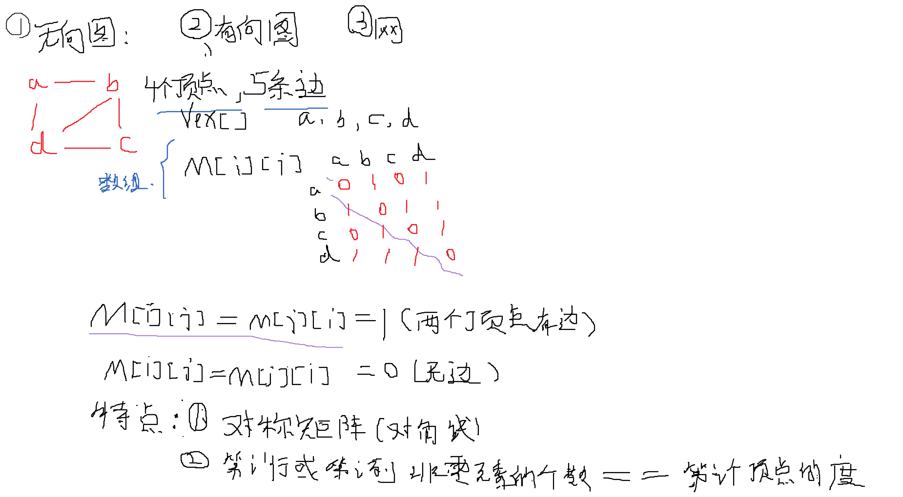

**无向图 : undirected graph 单词**

代码:

```c
#include <stdio.h>
#include <stdlib.h>
#define MAX 100

struct AMG_Graph
{
    int vex_num, edge_num;   // 顶点的个数和边的的个数
    char Vex[MAX];           //一维数组(顶点信息)
    int Edge[MAX][MAX];     // 二维数组(顶点之间的关系)
};

struct AMG_Graph *Create_AMG_Graph(void);
void show_AMG_Graph(struct AMG_Graph *graph);
int search_vex(struct AMG_Graph *graph, char c);

int main(void)
{
    struct AMG_Graph *ud_graph;
    ud_graph = Create_AMG_Graph(); //调用创建图的函数
    show_AMG_Graph(ud_graph); // 显示
    return 0;
}

// 创建图
struct AMG_Graph *Create_AMG_Graph(void)
{
    int i , j;
    char u, v; //定义的两个有关系的顶点

    struct AMG_Graph *graph;
    graph = (struct AMG_Graph *)malloc(sizeof(struct AMG_Graph));
     
    printf("Please  enter the number of vex: ");
    scanf("%d", &graph->vex_num);
    printf("Pease enter ten number of edge: ");
    scanf("%d", &graph->edge_num);
    getchar();
    /*
    while (getchar() != '\n');
    */

    printf("Please enter vertex: \n"); // 请输入一个顶点的信息(存入到一维数组里)
    for (i = 0; i < graph->vex_num; i++)
        scanf(" %c", &graph->Vex[i]);
    /*{
        graph->Vex[i] = getchar();
        while(getchar() != '\n');
    }*/   
    for (i = 0; i < graph->vex_num; i++)
    {
        for (j = 0; j < graph->vex_num; j++)
            graph->Edge[i][j] = 0;  //初始时全是零
    }

    while (graph->edge_num--) //录入顶点之间的关系
    {
        printf("Please enter the that const each other by edge:\n"); //请输入连接彼此的顶点关系
        scanf(" %c", &u); 
        scanf(" %c", &v);
            
        /*
        u = getchar();
		while(getchar() != '\n');
		
		v = getchar();
		while(getchar() != '\n');
        */

        // v和u是关联的就要把对应的标志位进1
        // 并且要找到对应的索引编号
        i = search_vex(graph, u);
		j = search_vex(graph, v);
        printf("%d", i);
        printf("  %d\n", j);

		if(i != -1 && j != -1)
            graph->Edge[i][j] = graph->Edge[j][i] = 1;  // 设为1
        else
        {
            printf("You have enter wrong vex, Please enter again.\n"); // 有找不到,输入的顶底信息有错误
            graph->edge_num++;  //输错了不算数要加回来
        }
    }
    return graph;
}

void show_AMG_Graph(struct AMG_Graph *graph)
{
    int i, j;
    printf("Show the vex: \n");
    for (i = 0; i < graph->vex_num; i++)
        printf("%c", graph->Vex[i]);
    printf("\n");

    printf("Show the adjacency matrices: \n");
    for(i = 0; i < graph->vex_num; i++)
    {
        for (j = 0; j < graph->vex_num; j++)
            printf("%d\t", graph->Edge[i][j]);
        printf("\n");
    }

}

int search_vex(struct AMG_Graph *graph, char c)
{
    int i;

    for (i = 0; i < graph->vex_num; i++)
    {  //找到对应的索引编号
        if (c == graph->Vex[i])
            return i;
    }
    return -1; //般用在子函数结尾。表示该函数失败.
}
```

效果:


**有向图:**


代码:

```c
#include <stdio.h>
#include <stdlib.h>

#define MAX 100

struct AMG_Graph
{
	int vex_num, edge_num;

	char Vex[MAX];
	int Edge[MAX][MAX];
};

struct AMG_Graph *Create_AMG_Graph(void);
void Show_AMG_Graph(struct AMG_Graph *graph);
int search_vex(struct AMG_Graph *graph, char c);

int main(void)
{
	struct AMG_Graph *ud_graph;

	ud_graph = Create_AMG_Graph();
	Show_AMG_Graph(ud_graph);

	return 0;
}

struct AMG_Graph *Create_AMG_Graph(void)
{
	int i, j;
	char u, v;

	struct AMG_Graph *graph;

	graph = (struct AMG_Graph *)malloc(sizeof(struct AMG_Graph));

	printf("Please enter the number of vex: ");
	scanf("%d", &graph->vex_num);
	printf("Please enter the number of edge: ");
	scanf("%d", &graph->edge_num);

	while(getchar() != '\n');

	printf("Please enter vertex:\n");
	for(i = 0; i < graph->vex_num; i++)
	{
		graph->Vex[i] = getchar();
		while(getchar() != '\n');
	}

	for(i = 0; i < graph->vex_num; i++)
	{
		for(j = 0; j < graph->vex_num; j++)
			graph->Edge[i][j] = 0;  // 有向的
	}

	while(graph->edge_num--)
	{
		printf("Please enter the vex that connect each other by edge:\n");
		u = getchar();
		while(getchar() != '\n');
		v = getchar();
		while(getchar() != '\n');

		i = search_vex(graph, u);
		j = search_vex(graph, v);

		if(i != -1 && j != -1)
			graph->Edge[i][j] = 1;
		else
		{
			printf("You have entered wrong vex, please enter again.\n");
			graph->edge_num++;
		}

	}

	return graph;
}

void Show_AMG_Graph(struct AMG_Graph *graph)
{
	int i, j;

	printf("Show the vex: \n");
	for(i = 0; i < graph->vex_num; i++)
		printf("%c ", graph->Vex[i]);
	printf("\n");

	printf("Show the adjacency matrices:\n");
	for(i = 0; i< graph->vex_num; i++)
	{
		for(j = 0; j < graph->vex_num; j++)
			printf("%d\t", graph->Edge[i][j]);
		printf("\n");
	}
}

int search_vex(struct AMG_Graph *graph, char c)
{
	int i;

	for(i = 0; i < graph->vex_num; i++)
	{
		if(c == graph->Vex[i])
			return i;
	}

	return -1;
}
```


**网:**


主对角线都是无穷大

```c
#include <stdio.h>
#include <stdlib.h>

#define MAX 100

struct AMG_Graph
{
	int vex_num, edge_num;

	char Vex[MAX];
	int Edge[MAX][MAX];
};

struct AMG_Graph *Create_AMG_Graph(void);
void Show_AMG_Graph(struct AMG_Graph *graph);
int search_vex(struct AMG_Graph *graph, char c);

int main(void)
{
	struct AMG_Graph *ud_graph;

	ud_graph = Create_AMG_Graph();
	Show_AMG_Graph(ud_graph);

	return 0;
}

struct AMG_Graph *Create_AMG_Graph(void)
{
	int i, j;
	char u, v;

	struct AMG_Graph *graph;

	graph = (struct AMG_Graph *)malloc(sizeof(struct AMG_Graph));

	printf("Please enter the number of vex: ");
	scanf("%d", &graph->vex_num);
	printf("Please enter the number of edge: ");
	scanf("%d", &graph->edge_num);

	while(getchar() != '\n');

	printf("Please enter vertex:\n");
	for(i = 0; i < graph->vex_num; i++)
	{
		graph->Vex[i] = getchar();
		while(getchar() != '\n');
	}

	for(i = 0; i < graph->vex_num; i++)
	{
		for(j = 0; j < graph->vex_num; j++)
			graph->Edge[i][j] = 0;
	}

	while(graph->edge_num--)
	{
		printf("Please enter the vex that connect each other by edge:\n");
		u = getchar();
		while(getchar() != '\n');
		v = getchar();
		while(getchar() != '\n');

		i = search_vex(graph, u);
		j = search_vex(graph, v);

		if(i != -1 && j != -1)
			graph->Edge[i][j] = 1;
		else
		{
			printf("You have entered wrong vex, please enter again.\n");
			graph->edge_num++;
		}

	}

	return graph;
}

void Show_AMG_Graph(struct AMG_Graph *graph)
{
	int i, j;

	printf("Show the vex: \n");
	for(i = 0; i < graph->vex_num; i++)
		printf("%c ", graph->Vex[i]);
	printf("\n");

	printf("Show the adjacency matrices:\n");
	for(i = 0; i< graph->vex_num; i++)
	{
		for(j = 0; j < graph->vex_num; j++)
			printf("%d\t", graph->Edge[i][j]);
		printf("\n");
	}
}

int search_vex(struct AMG_Graph *graph, char c)
{
	int i;

	for(i = 0; i < graph->vex_num; i++)
	{
		if(c == graph->Vex[i])
			return i;
	}

	return -1;
}
```


## 邻接表(adjacency list)的表示方法

ps: 是节点表不是顶点表


**出度方便:**


**入度方便:**


++++++

 

**邻接表的实现(有向图和无向图)** :

有向图 :

```c
#include <stdio.h>
#include <stdlib.h>

#define MAX 100

struct AdjNode // 邻接点表
{
	int index; // 索引编号信息
	struct AdjNode *next; // 指向下一个邻接点的指针
};

struct VexNode  // 节点表
{
	char node;  // 顶点信息
	struct AdjNode *first;  // 指向下一个邻接点的指针(第一个邻接点的)
};

struct ALG_Graph  // 
{
	int vex_num, edge_num;   //顶点的个数和边的个数
	struct VexNode Vex[MAX]; //结构体数组(由顶点的信息和指向邻接点的指针构成)
};

struct ALG_Graph *Create_ALG_Graph(void);
int search_vex(struct ALG_Graph *graph, char c);
void create_adj_node_list(struct ALG_Graph *graph, int i, int j);
void Show_ALG_Graph(struct ALG_Graph *graph);

int main(void)
{
	struct ALG_Graph *d_graph;
	d_graph = Create_ALG_Graph();  //调用创建邻接表的函数
	Show_ALG_Graph(d_graph);

	return 0;
}

struct ALG_Graph *Create_ALG_Graph(void) //// 创建邻接表
{
	int i, j;
	char u, v;

	struct ALG_Graph *graph;

	graph = (struct ALG_Graph *)malloc(sizeof(struct ALG_Graph));

	printf("Please enter the number of vex: ");
	scanf("%d", &graph->vex_num);
	printf("Please enter the number of edge: ");
	scanf("%d", &graph->edge_num);
	//while(getchar() != '\n');
	getchar();
	 

	printf("Please enter vertex:\n");
	for(i = 0; i < graph->vex_num; i++)
	{
		//graph->Vex[i].node = getchar(); // Vex[i].node 录入顶点信息
		//while(getchar() != '\n');
		scanf(" %c", &graph->Vex[i].node); // Vex[i].node 录入顶点信息
	}

	for(i = 0; i < graph->vex_num; i++)
	{
		graph->Vex[i].first = NULL;  // Vex[i].first 初始化指向下一个邻接点的指针(第一个邻接点的)现在应该是空指针
	}

	while(graph->edge_num--)  // 关系
	{
		printf("Please enter the vex that connect each other by edge:\n");
		u = getchar();
		while(getchar() != '\n');
		v = getchar();
		while(getchar() != '\n');

		i = search_vex(graph, u);
		j = search_vex(graph, v);

		if(i != -1 && j != -1)   // 找到相应的关系开始创建邻接点表了
			create_adj_node_list(graph, i, j); // i 和 j 是出发点和邻接点
		else
		{
			printf("You have entered wrong vex, please enter again.\n");
			graph->edge_num++;
		}
	}
	return graph;
}

int search_vex(struct ALG_Graph *graph, char c)  //找对应的索引号
{
	int i;

	for(i = 0; i < graph->vex_num; i++)
	{
		if(c == graph->Vex[i].node)
			return i;
	}

	return -1;
}
// 创建邻接表
void create_adj_node_list(struct ALG_Graph *graph, int i, int j)   // 比较复杂的函数  //如图
{
	struct AdjNode *s = (struct AdjNode *)malloc(sizeof(struct AdjNode));  // 创建邻接表
	s->index = j; // 填充的是邻接点的索引编号
	s->next = graph->Vex[i].first;  //连接
	graph->Vex[i].first = s;  // 指向当前的位置
}

void Show_ALG_Graph(struct ALG_Graph *graph)
{
	int i;
	struct AdjNode *t; // 定义邻接点的指针

	printf("Show the ALG Graph:\n");  // 显示邻接表

	for(i = 0; i < graph->vex_num; i++)
	{
		printf("%c: ", graph->Vex[i].node); //显示节点信息
		t = graph->Vex[i].first; //指向第一个邻接点
		while(t != NULL)
		{
			printf("%d ", t->index);  // 把邻接点的索引号
			t = t->next;
		}
		printf("\n");
	}
}
```


+++++

无向图:

```c
#include <stdio.h>
#include <stdlib.h>

#define MAX 100

struct AdjNode
{
	int index;
	struct AdjNode *next;
};

struct VexNode
{
	char node;
	struct AdjNode *first;
};

struct ALG_Graph
{
	int vex_num, edge_num;
	struct VexNode Vex[MAX];
};

struct ALG_Graph *Create_ALG_Graph(void);
int search_vex(struct ALG_Graph *graph, char c);
void create_adj_node_list(struct ALG_Graph *graph, int i, int j);
void Show_ALG_Graph(struct ALG_Graph *graph);

int main(void)
{
	struct ALG_Graph *ud_graph;
	ud_graph = Create_ALG_Graph();
	Show_ALG_Graph(ud_graph);

	return 0;
}

struct ALG_Graph *Create_ALG_Graph(void)
{
	int i, j;
	char u, v;

	struct ALG_Graph *graph;

	graph = (struct ALG_Graph *)malloc(sizeof(struct ALG_Graph));

	printf("Please enter the number of vex: ");
	scanf("%d", &graph->vex_num);
	printf("Please enter the number of edge: ");
	scanf("%d", &graph->edge_num);
	while(getchar() != '\n');

	printf("Please enter vertex:\n");
	for(i = 0; i < graph->vex_num; i++)
	{
		graph->Vex[i].node = getchar();
		while(getchar() != '\n');
	}

	for(i = 0; i < graph->vex_num; i++)
	{
		graph->Vex[i].first = NULL;
	}

	while(graph->edge_num--)
	{
		printf("Please enter the vex that connect each other by edge:\n");
		u = getchar();
		while(getchar() != '\n');
		v = getchar();
		while(getchar() != '\n');

		i = search_vex(graph, u);
		j = search_vex(graph, v);

		if(i != -1 && j != -1)
		{
			create_adj_node_list(graph, i, j);
			create_adj_node_list(graph, j, i);  //无向图  需要创建两次 (a到b,b到a都要创建一次)
		}
		else
		{
			printf("You have entered wrong vex, please enter again.\n");
			graph->edge_num++;
		}
	}
	return graph;
}

int search_vex(struct ALG_Graph *graph, char c)
{
	int i;

	for(i = 0; i < graph->vex_num; i++)
	{
		if(c == graph->Vex[i].node)
			return i;
	}

	return -1;
}

void create_adj_node_list(struct ALG_Graph *graph, int i, int j)
{
	struct AdjNode *s = (struct AdjNode *)malloc(sizeof(struct AdjNode));
	s->index = j;
	s->next = graph->Vex[i].first;
	graph->Vex[i].first = s;
}

void Show_ALG_Graph(struct ALG_Graph *graph)
{
	int i;
	struct AdjNode *t;

	printf("Show the ALG Graph:\n");

	for(i = 0; i < graph->vex_num; i++)
	{
		printf("%c: ", graph->Vex[i].node);
		t = graph->Vex[i].first;
		while(t != NULL)
		{
			printf("%d ", t->index);
			t = t->next;
		}
		printf("\n");
	}
}
```


效果:


## 十字链表


原理


## 邻接多重表(无向图)


## 图的遍历_广度优先BFS


**1 广度优先图解:**


++++


**2 广度优先算法步骤**

**邻接矩阵的光度优化的步骤:**

+ 1.创建数组,用于表示顶点是否被访问过.   visited[Size]并且将该数组请0,(类似辅助数组)

+ 2.空队列,队列中存放的是顶点的编号.

+ 3.(核心)  从图的起点[0]出发, 标记访问过. 将该点入队列.

  

+ 4.如果队列非空继续访问.  否则结束

+ 5.顶点出队列后,**要依次访问该顶点未被访问过的邻接点** .再回到第四步.

  

## **图的遍历_基于邻接矩阵的广度优优先**

**邻接矩阵**AMG

代码

有缺陷的

```c
#include <stdio.h>
#include <stdlib.h>
#include "queue.h"

#define MAX 100

struct AMG_Graph
{
	int vex_num, edge_num;

	char Vex[MAX];
	int Edge[MAX][MAX];
};

struct AMG_Graph *Create_AMG_Graph(void);
void Show_AMG_Graph(struct AMG_Graph *graph);
int search_vex(struct AMG_Graph *graph, char c);
void BFS_AMG(struct AMG_Graph *graph);

int main(void)
{
	struct AMG_Graph *d_graph;

	d_graph = Create_AMG_Graph();
	Show_AMG_Graph(d_graph);

	printf("Traverse the graph through BFS:\n");
	BFS_AMG(d_graph);

	return 0;
}

struct AMG_Graph *Create_AMG_Graph(void)
{
	int i, j;
	char u, v;

	struct AMG_Graph *graph;

	graph = (struct AMG_Graph *)malloc(sizeof(struct AMG_Graph));

	printf("Please enter the number of vex: ");
	scanf("%d", &graph->vex_num);
	printf("Please enter the number of edge: ");
	scanf("%d", &graph->edge_num);

	while(getchar() != '\n');

	printf("Please enter vertex:\n");
	for(i = 0; i < graph->vex_num; i++)
	{
		graph->Vex[i] = getchar();
		while(getchar() != '\n');
	}

	for(i = 0; i < graph->vex_num; i++)
	{
		for(j = 0; j < graph->vex_num; j++)
			graph->Edge[i][j] = 0;
	}

	while(graph->edge_num--)
	{
		printf("Please enter the vex that connect each other by edge:\n");
		u = getchar();
		while(getchar() != '\n');
		v = getchar();
		while(getchar() != '\n');

		i = search_vex(graph, u);
		j = search_vex(graph, v);

		if(i != -1 && j != -1)
			graph->Edge[i][j] = 1;
		else
		{
			printf("You have entered wrong vex, please enter again.\n");
			graph->edge_num++;
		}

	}

	return graph;
}

void Show_AMG_Graph(struct AMG_Graph *graph)
{
	int i, j;

	printf("Show the vex: \n");
	for(i = 0; i < graph->vex_num; i++)
		printf("%c ", graph->Vex[i]);
	printf("\n");

	printf("Show the adjacency matrices:\n");
	for(i = 0; i< graph->vex_num; i++)
	{
		for(j = 0; j < graph->vex_num; j++)
			printf("%d\t", graph->Edge[i][j]);
		printf("\n");
	}
}

int search_vex(struct AMG_Graph *graph, char c)
{
	int i;

	for(i = 0; i < graph->vex_num; i++)
	{
		if(c == graph->Vex[i])
			return i;
	}

	return -1;
}

void BFS_AMG(struct AMG_Graph *graph)
{
	int u;
	int i;

	int visited[MAX] = {0};

	printf("%c ", graph->Vex[0]);
	visited[0] = 1;
	enqueue(0);

	while(!is_empty())
	{
		u = dequeue();
		for(i = 0; i < graph->vex_num; i++)
		{
			if((graph->Edge[u][i] == 1) && (visited[i] == 0))
			{
				visited[i] = 1;
				enqueue(i);
				printf("%c ", graph->Vex[i]);
			}
		}
	}
	printf("\n");
} 
```


**出现非联通点:**

```c
#include <stdio.h>
#include <stdlib.h>
#include "queue.h"

#define MAX 100

struct AMG_Graph
{
	int vex_num, edge_num;

	char Vex[MAX];
	int Edge[MAX][MAX];
};

struct AMG_Graph *Create_AMG_Graph(void);
void Show_AMG_Graph(struct AMG_Graph *graph);
int search_vex(struct AMG_Graph *graph, char c);
void BFS_AMG(struct AMG_Graph *graph);

int main(void)
{
	struct AMG_Graph *d_graph;

	d_graph = Create_AMG_Graph();
	Show_AMG_Graph(d_graph);

	printf("Traverse the graph through BFS:\n");  // 显示用bfs的方式遍历 
	BFS_AMG(d_graph); // 调用邻接矩阵的遍历方法

	return 0;
}

struct AMG_Graph *Create_AMG_Graph(void)
{
	int i, j;
	char u, v;

	struct AMG_Graph *graph;

	graph = (struct AMG_Graph *)malloc(sizeof(struct AMG_Graph));

	printf("Please enter the number of vex: ");
	scanf("%d", &graph->vex_num);
	printf("Please enter the number of edge: ");
	scanf("%d", &graph->edge_num);

	while(getchar() != '\n');

	printf("Please enter vertex:\n");
	for(i = 0; i < graph->vex_num; i++)
	{
		graph->Vex[i] = getchar();
		while(getchar() != '\n');
	}

	for(i = 0; i < graph->vex_num; i++)
	{
		for(j = 0; j < graph->vex_num; j++)
			graph->Edge[i][j] = 0;
	}

	while(graph->edge_num--)
	{
		printf("Please enter the vex that connect each other by edge:\n");
		u = getchar();
		while(getchar() != '\n');
		v = getchar();
		while(getchar() != '\n');

		i = search_vex(graph, u);
		j = search_vex(graph, v);

		if(i != -1 && j != -1)
			graph->Edge[i][j] = 1;
		else
		{
			printf("You have entered wrong vex, please enter again.\n");
			graph->edge_num++;
		}

	}

	return graph;
}

void Show_AMG_Graph(struct AMG_Graph *graph)
{
	int i, j;

	printf("Show the vex: \n");
	for(i = 0; i < graph->vex_num; i++)
		printf("%c ", graph->Vex[i]);
	printf("\n");

	printf("Show the adjacency matrices:\n");
	for(i = 0; i< graph->vex_num; i++)
	{
		for(j = 0; j < graph->vex_num; j++)
			printf("%d\t", graph->Edge[i][j]);
		printf("\n");
	}
}

int search_vex(struct AMG_Graph *graph, char c)
{
	int i;

	for(i = 0; i < graph->vex_num; i++)
	{
		if(c == graph->Vex[i])
			return i;
	}

	return -1;
}

void BFS_AMG(struct AMG_Graph *graph)   // 邻接矩阵广度优先实现
{
	int u;
	int i;
	int j;

	int visited[MAX] = {0}; //数组初始化为全零的发式

	for(j = 0; j < graph->vex_num; j++) //增加一个for循环 . 依次访问所有的.一个不啦
	{
  		if(visited[j] == 0) //如果没有被访问就执行
  		{
			printf("%c ", graph->Vex[j]);
			visited[j] = 1;
			enqueue(j);

			while(!is_empty())
			{
				u = dequeue();
				for(i = 0; i < graph->vex_num; i++)    // 为被访问过的邻接点
				{
					if((graph->Edge[u][i] == 1) && (visited[i] == 0))   // graph->Edge[u][i] == 1)看每一行在一列一列检查
					{
						visited[i] = 1;  // 标记
						enqueue(i);  // 入队列
						printf("%c ", graph->Vex[i]);  // 显示
					}
				}
			}
 		 }
	}
	printf("\n");
} 

```

**主要实现如上**

**全部最好去看代码**


## **图的遍历_基于邻接表的广度优优先**

**邻接表**ALG

代码:

有缺陷的

```c
#include <stdio.h>
#include <stdlib.h>
#include "queue.h"

#define MAX 100

struct AdjNode
{
	int index;
	struct AdjNode *next;
};

struct VexNode
{
	char node;
	struct AdjNode *first;
};

struct ALG_Graph
{
	int vex_num, edge_num;
	struct VexNode Vex[MAX];
};

struct ALG_Graph *Create_ALG_Graph(void);
int search_vex(struct ALG_Graph *graph, char c);
void create_adj_node_list(struct ALG_Graph *graph, int i, int j);
void Show_ALG_Graph(struct ALG_Graph *graph);
void BFS_ALG(struct ALG_Graph *graph);

int main(void)
{
	struct ALG_Graph *d_graph; 
	d_graph = Create_ALG_Graph();
	Show_ALG_Graph(d_graph);

	printf("Traverse the graph through BFS:\n");  // 显示用bfs的方式遍历 
	BFS_ALG(d_graph);  // 邻接表

	return 0;
}

struct ALG_Graph *Create_ALG_Graph(void)
{
	int i, j;
	char u, v;

	struct ALG_Graph *graph;

	graph = (struct ALG_Graph *)malloc(sizeof(struct ALG_Graph));

	printf("Please enter the number of vex: ");
	scanf("%d", &graph->vex_num);
	printf("Please enter the number of edge: ");
	scanf("%d", &graph->edge_num);
	while(getchar() != '\n');

	printf("Please enter vertex:\n");
	for(i = 0; i < graph->vex_num; i++)
	{
		graph->Vex[i].node = getchar();
		while(getchar() != '\n');
	}

	for(i = 0; i < graph->vex_num; i++)
	{
		graph->Vex[i].first = NULL;
	}

	while(graph->edge_num--)
	{
		printf("Please enter the vex that connect each other by edge:\n");
		u = getchar();
		while(getchar() != '\n');
		v = getchar();
		while(getchar() != '\n');

		i = search_vex(graph, u);
		j = search_vex(graph, v);

		if(i != -1 && j != -1)
			create_adj_node_list(graph, i, j);
		else
		{
			printf("You have entered wrong vex, please enter again.\n");
			graph->edge_num++;
		}
	}
	return graph;
}

int search_vex(struct ALG_Graph *graph, char c)
{
	int i;

	for(i = 0; i < graph->vex_num; i++)
	{
		if(c == graph->Vex[i].node)
			return i;
	}

	return -1;
}

void create_adj_node_list(struct ALG_Graph *graph, int i, int j)
{
	struct AdjNode *s = (struct AdjNode *)malloc(sizeof(struct AdjNode));
	s->index = j;
	s->next = graph->Vex[i].first;
	graph->Vex[i].first = s;
}

void Show_ALG_Graph(struct ALG_Graph *graph)
{
	int i;
	struct AdjNode *t;

	printf("Show the ALG Graph:\n");

	for(i = 0; i < graph->vex_num; i++)
	{
		printf("%c: ", graph->Vex[i].node);
		t = graph->Vex[i].first;
		while(t != NULL)
		{
			printf("%d ", t->index);
			t = t->next;
		}
		printf("\n");
	}
}

void BFS_ALG(struct ALG_Graph *graph)
{
	int u;
	struct AdjNode *p;
	int n;

	int visited[MAX] = {0};

	printf("%c ", graph->Vex[0].node);
	visited[0] = 1;
	enqueue(0);

	while(!is_empty())
	{
		u = dequeue();
		p = graph->Vex[u].first;

		while(p)
		{
			n = p->index;
			if(visited[n] == 0)
			{
				visited[n] = 1;
				enqueue(n);
				printf("%c ", graph->Vex[n].node);
			}
			p = p->next;
		}
	}
	printf("\n");
}
```


**出现非联通点:**

```c
#include <stdio.h>
#include <stdlib.h>
#include "queue.h"

#define MAX 100

struct AdjNode
{
	int index;
	struct AdjNode *next;
};

struct VexNode
{
	char node;
	struct AdjNode *first;
};

struct ALG_Graph
{
	int vex_num, edge_num;
	struct VexNode Vex[MAX];
};

struct ALG_Graph *Create_ALG_Graph(void);
int search_vex(struct ALG_Graph *graph, char c);
void create_adj_node_list(struct ALG_Graph *graph, int i, int j);
void Show_ALG_Graph(struct ALG_Graph *graph);
void BFS_ALG(struct ALG_Graph *graph);

int main(void)
{
	struct ALG_Graph *d_graph;
	d_graph = Create_ALG_Graph();
	Show_ALG_Graph(d_graph);

	printf("Traverse the graph through BFS:\n");  // 提示信息通过广度优先
	BFS_ALG(d_graph);  // 调用

	return 0;
}

struct ALG_Graph *Create_ALG_Graph(void)
{
	int i, j;
	char u, v;

	struct ALG_Graph *graph;

	graph = (struct ALG_Graph *)malloc(sizeof(struct ALG_Graph));

	printf("Please enter the number of vex: ");
	scanf("%d", &graph->vex_num);
	printf("Please enter the number of edge: ");
	scanf("%d", &graph->edge_num);
	while(getchar() != '\n');

	printf("Please enter vertex:\n");
	for(i = 0; i < graph->vex_num; i++)
	{
		graph->Vex[i].node = getchar();
		while(getchar() != '\n');
	}

	for(i = 0; i < graph->vex_num; i++)
	{
		graph->Vex[i].first = NULL;
	}

	while(graph->edge_num--)
	{
		printf("Please enter the vex that connect each other by edge:\n");
		u = getchar();
		while(getchar() != '\n');
		v = getchar();
		while(getchar() != '\n');

		i = search_vex(graph, u);
		j = search_vex(graph, v);

		if(i != -1 && j != -1)
			create_adj_node_list(graph, i, j);
		else
		{
			printf("You have entered wrong vex, please enter again.\n");
			graph->edge_num++;
		}
	}
	return graph;
}

int search_vex(struct ALG_Graph *graph, char c)
{
	int i;

	for(i = 0; i < graph->vex_num; i++)
	{
		if(c == graph->Vex[i].node)
			return i;
	}

	return -1;
}

void create_adj_node_list(struct ALG_Graph *graph, int i, int j)
{
	struct AdjNode *s = (struct AdjNode *)malloc(sizeof(struct AdjNode));
	s->index = j;
	s->next = graph->Vex[i].first;
	graph->Vex[i].first = s;
}

void Show_ALG_Graph(struct ALG_Graph *graph)   
{
	int i;
	struct AdjNode *t;

	printf("Show the ALG Graph:\n");

	for(i = 0; i < graph->vex_num; i++)
	{
		printf("%c: ", graph->Vex[i].node);
		t = graph->Vex[i].first;
		while(t != NULL)
		{
			printf("%d ", t->index);
			t = t->next;
		}
		printf("\n");
	}
}

void BFS_ALG(struct ALG_Graph *graph)   // 邻接表的广度优先实现
{
	int u;
	struct AdjNode *p;
	int n;
	int i;

	int visited[MAX] = {0};  // 定义的全零数组

for(i = 0; i < graph->vex_num; i++)   //增加一个for循环 . 依次访问所有的.一个不啦  // 处理出现夹杂非联通点的情况
{
  if(visited[i] == 0) //如果没有被访问就执行
  {
	printf("%c ", graph->Vex[i].node);  // 打印显示第一个顶点
	visited[i] = 1;   // 标记
	enqueue(i);   // 入队列

	while(!is_empty())
	{
		u = dequeue();  // 初队列,出的是编号
		p = graph->Vex[u].first;   // 访问第一个指针

		while(p)   // 不为空执行
		{
			n = p->index;  // 在下一个
			if(visited[n] == 0)   //  判断是不是没有访问过
			{
				visited[n] = 1;  // 标记
				enqueue(n);
				printf("%c ", graph->Vex[n].node);  // 打印显示
			}
			p = p->next;  // 更新位置
		}
	}
  }
}
	printf("\n");
}
```

效果:


## 图的遍历_**深度优先** DFS

思想: **使得搜索沿着状态空间某条单一的路径进行下去.一条路走到黑**，直到最后的结点不能产生新结点或者找到目标结点为止。当搜索到不能产生新的结点的时候，就沿着结点产生顺序的反方向寻找可以产生新结点的结点，并扩展它，形成另一条搜索路径。

 **算法思想**

回溯法（探索与回溯法）是一种选优搜索法，又称为试探法，按选优条件向前搜索，以达到目标。但当探索到某一步时，发现原先选择并不优或达不到目标，就退回一步重新选择，这种走不通就退回再走的技术为回溯法，而满足回溯条件的某个状态的点称为“回溯点”。 


##  **图的遍历_基于邻接矩阵的深度优先**

 代码:

```c
#include <stdio.h>
#include <stdlib.h>   
#include "stack.h"    // 栈

#define MAX 100

struct AMG_Graph   // 邻接矩阵
{
	int vex_num, edge_num;

	char Vex[MAX];
	int Edge[MAX][MAX];
};

struct AMG_Graph *Create_AMG_Graph(void);
void Show_AMG_Graph(struct AMG_Graph *graph);
int search_vex(struct AMG_Graph *graph, char c);
void DFS_AMG(struct AMG_Graph *graph);

int main(void)
{
	struct AMG_Graph *d_graph;

	d_graph = Create_AMG_Graph();
	Show_AMG_Graph(d_graph);

	printf("Traverse the graph through DFS:\n");
	DFS_AMG(d_graph);   // 调用深度优先的实现

	return 0;
}

struct AMG_Graph *Create_AMG_Graph(void)
{
	int i, j;
	char u, v;

	struct AMG_Graph *graph;

	graph = (struct AMG_Graph *)malloc(sizeof(struct AMG_Graph));

	printf("Please enter the number of vex: ");
	scanf("%d", &graph->vex_num);
	printf("Please enter the number of edge: ");
	scanf("%d", &graph->edge_num);

	while(getchar() != '\n');

	printf("Please enter vertex:\n");
	for(i = 0; i < graph->vex_num; i++)
	{
		graph->Vex[i] = getchar();
		while(getchar() != '\n');
	}

	for(i = 0; i < graph->vex_num; i++)
	{
		for(j = 0; j < graph->vex_num; j++)
			graph->Edge[i][j] = 0;
	}

	while(graph->edge_num--)
	{
		printf("Please enter the vex that connect each other by edge:\n");
		u = getchar();
		while(getchar() != '\n');
		v = getchar();
		while(getchar() != '\n');

		i = search_vex(graph, u);
		j = search_vex(graph, v);

		if(i != -1 && j != -1)
			graph->Edge[i][j] = 1;
		else
		{
			printf("You have entered wrong vex, please enter again.\n");
			graph->edge_num++;
		}

	}

	return graph;
}

void Show_AMG_Graph(struct AMG_Graph *graph)
{
	int i, j;

	printf("Show the vex: \n");
	for(i = 0; i < graph->vex_num; i++)
		printf("%c ", graph->Vex[i]);
	printf("\n");

	printf("Show the adjacency matrices:\n");
	for(i = 0; i< graph->vex_num; i++)
	{
		for(j = 0; j < graph->vex_num; j++)
			printf("%d\t", graph->Edge[i][j]);
		printf("\n");
	}
}

int search_vex(struct AMG_Graph *graph, char c)
{
	int i;

	for(i = 0; i < graph->vex_num; i++)
	{
		if(c == graph->Vex[i])
			return i;
	}

	return -1;
}

// 深度优先实现
void DFS_AMG(struct AMG_Graph *graph)   
{
	int i, j;
	int u;

	int visited[MAX] = {0};

	for(i = 0; i < graph->vex_num; i++)  // 遍历所有点
	{
		if(visited[i] == 0)
		{
			printf("%c ", graph->Vex[i]);  // 打印第一个顶点
			visited[i] = 1;
			push(i);   // 入栈
			while(!is_empty())
			{
				u = stack[top-1]; // 通过访问top获取到编号, ps: top指针指向空位置的  (按上图所例 第二次 u为1了代表b 第三次 为2)
				for(j = 0; j < graph->vex_num; j++)
				{
					if((graph->Edge[u][j] == 1) && (visited[j] == 0))   // 不为0并且未标记的就遍历
					{
						visited[j] = 1;  // 标志
						push(j);  // 入栈
						printf("%c ", graph->Vex[j]);  // 显示对应字符
						break;   // 结束这个循环for  // 不 用break就变成广度优先了 (关键)
					}
				}
				if(j == graph->vex_num)   // 找到来了最后的点开始往后退,有进行while循环 (无路可走)
					pop(); // 出栈了
			}
		}
	}
	printf("\n");
}
```

++++


## 图的遍历_基于邻接表的深度优先

 

结果:      a e c d b 

代码:

```c
#include <stdio.h>
#include <stdlib.h>
#include "stack.h"

#define MAX 100

struct AdjNode
{
	int index;
	struct AdjNode *next;
};

struct VexNode
{
	char node;
	struct AdjNode *first;
};

struct ALG_Graph
{
	int vex_num, edge_num;
	struct VexNode Vex[MAX];
};

struct ALG_Graph *Create_ALG_Graph(void);
int search_vex(struct ALG_Graph *graph, char c);
void create_adj_node_list(struct ALG_Graph *graph, int i, int j);
void Show_ALG_Graph(struct ALG_Graph *graph);
void DFS_ALG(struct ALG_Graph *graph);

int main(void)
{
	struct ALG_Graph *d_graph;
	d_graph = Create_ALG_Graph();
	Show_ALG_Graph(d_graph);

	printf("Traverse the graph through BFS:\n");
	DFS_ALG(d_graph);

	return 0;
}

struct ALG_Graph *Create_ALG_Graph(void)
{
	int i, j;
	char u, v;

	struct ALG_Graph *graph;

	graph = (struct ALG_Graph *)malloc(sizeof(struct ALG_Graph));

	printf("Please enter the number of vex: ");
	scanf("%d", &graph->vex_num);
	printf("Please enter the number of edge: ");
	scanf("%d", &graph->edge_num);
	while(getchar() != '\n');

	printf("Please enter vertex:\n");
	for(i = 0; i < graph->vex_num; i++)
	{
		graph->Vex[i].node = getchar();
		while(getchar() != '\n');
	}

	for(i = 0; i < graph->vex_num; i++)
	{
		graph->Vex[i].first = NULL;
	}

	while(graph->edge_num--)
	{
		printf("Please enter the vex that connect each other by edge:\n");
		u = getchar();
		while(getchar() != '\n');
		v = getchar();
		while(getchar() != '\n');

		i = search_vex(graph, u);
		j = search_vex(graph, v);

		if(i != -1 && j != -1)
			create_adj_node_list(graph, i, j);
		else
		{
			printf("You have entered wrong vex, please enter again.\n");
			graph->edge_num++;
		}
	}
	return graph;
}

int search_vex(struct ALG_Graph *graph, char c)
{
	int i;

	for(i = 0; i < graph->vex_num; i++)
	{
		if(c == graph->Vex[i].node)
			return i;
	}

	return -1;
}

void create_adj_node_list(struct ALG_Graph *graph, int i, int j)
{
	struct AdjNode *s = (struct AdjNode *)malloc(sizeof(struct AdjNode));
	s->index = j;
	s->next = graph->Vex[i].first;
	graph->Vex[i].first = s;
}

void Show_ALG_Graph(struct ALG_Graph *graph)
{
	int i;
	struct AdjNode *t;

	printf("Show the ALG Graph:\n");

	for(i = 0; i < graph->vex_num; i++)
	{
		printf("%c: ", graph->Vex[i].node);
		t = graph->Vex[i].first;
		while(t != NULL)
		{
			printf("%d ", t->index);
			t = t->next;
		}
		printf("\n");
	}
}

void DFS_ALG(struct ALG_Graph *graph)
{
	int u;
	struct AdjNode *p;
	int n;
	int i;

	int visited[MAX] = {0};

	for(i = 0; i < graph->vex_num; i++)  // 考虑到非联通的情况
	{
	  if(visited[i] == 0)
	  {
		printf("%c ", graph->Vex[i].node);
		visited[i] = 1;
		push(i);

		while(!is_empty())
		{
			u = stack[top-1];
			p = graph->Vex[u].first;

			while(p)
			{
				n = p->index;  // 取出当前的索引
				if(visited[n] == 0)
				{
					visited[n] = 1;  
					push(n);  // 入栈
					printf("%c ", graph->Vex[n].node);
					p = graph->Vex[n].first;  // graph->Vex[n].first  当前顶点的指针
				}
				else
					p = p->next;  //如果访问过就更新位置
			}
			pop(); // 一旦无路可走就跳出循环,去出栈 
		}
	  }
	}
	printf("\n");
}
```


##  图的应用_ floyd 算法(差点法)


## 图的应用_ floyd 算法(差点法)代码实现


```c
#include <stdio.h>
#include <stdlib.h>
#include <math.h>  // 数学的头文件

#define MAX 100

struct AMG_Graph  // 邻接矩阵
{
	int vex_num, edge_num;

	char Vex[MAX];
	int Edge[MAX][MAX];
};

struct AMG_Graph *Create_AMG_Graph(void);
void Show_AMG_Graph_dist_p(struct AMG_Graph *graph);
int search_vex(struct AMG_Graph *graph, char c);
void Floyd(struct AMG_Graph *graph);

double dist[MAX][MAX];   // 最短距离的数组   用double的原因是溢出
int p[MAX][MAX];        // 前驱点的数组

int main(void)
{
	struct AMG_Graph *d_graph;
	char start, end;
	int s, e;

	d_graph = Create_AMG_Graph();
	Show_AMG_Graph_dist_p(d_graph);

	Floyd(d_graph);  // 调用floyd函数
	printf("\n\nNow show the shortest distance matrix:\n");
	Show_AMG_Graph_dist_p(d_graph);

	printf("Please enter the start and end point:\n");  // 输入起末位置
	scanf("%c %c", &start, &end);
	s = search_vex(d_graph, start);  // 得到所在的编号
	e = search_vex(d_graph, end);
	printf("The shortest distance between %c and %c is %.1f.\n", start, end, dist[s][e]);   // 显示距离  //dist[s][e]现在存储的就是最短距离

	return 0;
}

// 创建
struct AMG_Graph *Create_AMG_Graph(void)
{
	int i, j;
	char u, v;
	double l;

	struct AMG_Graph *graph;

	graph = (struct AMG_Graph *)malloc(sizeof(struct AMG_Graph));

	printf("Please enter the number of vex: ");
	scanf("%d", &graph->vex_num);
	printf("Please enter the number of edge: ");
	scanf("%d", &graph->edge_num);

	while(getchar() != '\n');

	printf("Please enter vertex:\n");
	for(i = 0; i < graph->vex_num; i++)
	{
		graph->Vex[i] = getchar();
		while(getchar() != '\n');
	}

	for(i = 0; i < graph->vex_num; i++)
	{
		for(j = 0; j < graph->vex_num; j++)
		{
			graph->Edge[i][j] = 0;

			if(i == j)  // a到a,b到b 就设置0
				dist[i][j] = 0;   
			else
				dist[i][j] = INFINITY;	//无穷大

			p[i][j] = -1; // 前驱点的数组
		}	
	}

	while(graph->edge_num--)
	{
		printf("Please enter the vex that connect each other by edge:\n");
		u = getchar();
		while(getchar() != '\n');
		v = getchar();
		while(getchar() != '\n');

		printf("Please enter the distance between the two vex:\n");    // 提示输入 两个顶点的距离
		scanf("%lf", &l);  // float，单精度浮点型，对应%f。
                           // double,双精度浮点型，对应%lf。
		while(getchar() != '\n');

		i = search_vex(graph, u);   // 得到所在的编号
		j = search_vex(graph, v);

		if(i != -1 && j != -1)  // 有效的
		{
			graph->Edge[i][j] = 1;
			dist[i][j] = l;    // 距离就是输入的l
			p[i][j] = i;       // 前驱点就是i的值
		}
		else
		{
			printf("You have entered wrong vex, please enter again.\n");
			graph->edge_num++;
		}

	}

	return graph;
}

//显示内容
void Show_AMG_Graph_dist_p(struct AMG_Graph *graph)
{
	int i, j;

	printf("Show the vex: \n");
	for(i = 0; i < graph->vex_num; i++)
		printf("%c ", graph->Vex[i]);
	printf("\n");

	printf("Show the adjacency matrices:\n");
	for(i = 0; i< graph->vex_num; i++)
	{
		for(j = 0; j < graph->vex_num; j++)
			printf("%d\t", graph->Edge[i][j]);
		printf("\n");
	}

	printf("Show the distance matrices:\n");   // 显示距离的矩阵
	for(i = 0; i< graph->vex_num; i++)
	{
		for(j = 0; j < graph->vex_num; j++)
			printf("%.1f\t", dist[i][j]);
		printf("\n");
	}

	printf("Show the pre point matrices:\n");  // 显示前驱点的矩阵
	for(i = 0; i< graph->vex_num; i++)
	{
		for(j = 0; j < graph->vex_num; j++)
			printf("%d\t", p[i][j]);
		printf("\n");
	}
}

int search_vex(struct AMG_Graph *graph, char c)
{
	int i;

	for(i = 0; i < graph->vex_num; i++)
	{
		if(c == graph->Vex[i])
			return i;
	}

	return -1;
}

// 差点法
void Floyd(struct AMG_Graph *graph)    
{
	int k, i, j;

	for(k = 0; k < graph->vex_num; k++)  // 外层依次去选择插入点
	{
		for(i = 0; i < graph->vex_num; i++)  // 依次遍历数组所有点
		{
			for(j = 0; j < graph->vex_num; j++)  // 依次遍历数组所有点
			{
				if(dist[i][j] > dist[i][k] + dist[k][j])  // 判断距离大小 . k是插入点
				{
					dist[i][j] = dist[i][k] + dist[k][j];  // 更新一下距离
					p[i][j] = p[k][j];  //   更新前驱点
				}
			}
		}
	}
}
```

效果;

```c++
Please enter the number of vex: 4
Please enter the number of edge: 8
Please enter vertex:
a
b
c
d
Please enter the vex that connect each other by edge:
a
b
Please enter the distance between the two vex:
1
Please enter the vex that connect each other by edge:
a
d
Please enter the distance between the two vex:
4
Please enter the vex that connect each other by edge:
b
c
Please enter the distance between the two vex:
9
Please enter the vex that connect each other by edge:
b
d
Please enter the distance between the two vex:
2
Please enter the vex that connect each other by edge:
c
a
Please enter the distance between the two vex:
3
Please enter the vex that connect each other by edge:
c
b
Please enter the distance between the two vex:
5
Please enter the vex that connect each other by edge:
c
d
Please enter the distance between the two vex:
8
Please enter the vex that connect each other by edge:
d
c
Please enter the distance between the two vex:
6
Show the vex: 
a b c d
Show the adjacency matrices:
0       1       0       1
0       0       1       1
1       1       0       1
0       0       1       0
Show the distance matrices:
0.0     1.0     1.$     4.0
1.$     0.0     9.0     2.0
3.0     5.0     0.0     8.0
1.$     1.$     6.0     0.0
Show the pre point matrices:
-1      0       -1      0
-1      -1      1       1
2       2       -1      2
-1      -1      3       -1


Now show the shortest distance matrix:
Show the vex:
a b c d
Show the adjacency matrices:
0       1       0       1
0       0       1       1
1       1       0       1
0       0       1       0
Show the distance matrices:
0.0     1.0     9.0     3.0
11.0    0.0     8.0     2.0
3.0     4.0     0.0     6.0
9.0     10.0    6.0     0.0
Show the pre point matrices:
-1      0       3       1
2       -1      3       1
2       0       -1      1
2       0       3       -1
Please enter the start and end point:
b a
The shortest distance between b and a is 11.0.
```


## 图基本概念

**图结构:     多对多的关系**


点:             数据         链表中的结点      树中的节点
边:             点之间的关联

**==图退化成树    树退化成链表==**


**临接矩阵:    基于数组**

+ 用一个一维数组来存储所有顶点用一个二维数组来存储所有的边

临接表:    基于链表

+ 用一个一维数组或者一个链表来存储所有顶点
+ 每个顶点都是一个链表的头结点，后面跟着所有能通过边到达的	


**邻接表:    基于链表**

+ 用一个一维数组或者一个链表来存储所有顶点
+ 每个顶点都是一个链表的头结点，后面跟着所有能通过边到达的顶点


**无向图何有向图 :**

+ 无向图:   没有箭头的图没有方向,  满方向

  

  

  

+ 有向图:   有箭头的图有方向

  

**网图 : **


## 图的遍历 


## 邻接矩阵(实现)


```c
#include <stdio.h>
#include <string.h>
// 图结构

#define WUXIANG 0
#define VERTEXS 6

struct Graph
{
	int vertex_num;        // 顶点个数
	int edge_num;          // 边个数
	char* pVertex;
	//int* ppEdge;     // 技巧一维数组表示二维数组
	int** ppEdge;      // 用动态二维数组

};

// 创建图对象
Graph* createGraph();
// 初始化图对象
void initGraph(Graph* g);
// 初始化图对象
void initGraph(Graph* g, int vertex_num, int lines, char* str, int map[VERTEXS][VERTEXS]);
// 释放图对象
void destroyGraph(Graph* g);
// 获取顶点所在的下标, 如果没与返回-1 
int _getIdx(Graph* g, char c);
// 显示图
void show(Graph* g);

#if 1
int main(void)
{
	char buff[7] = "ABCDEF";
	int map[VERTEXS][VERTEXS] = {

		{0 ,0 ,1, 0, 0, 0},
		{0 ,0 ,1, 0, 0, 0},
		{1 ,1 ,0, 1, 1, 1},
		{0 ,0 ,1, 0, 0, 0},
		{0 ,0 ,1, 1, 0, 0},
		{0 ,0 ,1, 0, 0, 0},
	};

	// 创建图对象
	Graph* g = createGraph();
	// 初始化图
//	initGraph(g);
	initGraph(g, VERTEXS, 6, buff, map);
	// 显示图
	show(g);
	// 释放图对象
	destroyGraph(g);
	while (1);
	return 0;
}
#endif

//创建图对象
Graph* createGraph()
{
	Graph* graph = new Graph;
	graph->edge_num = graph->vertex_num = 0;
	graph->ppEdge = NULL;
	graph->pVertex = NULL;

	// 或者 memset(grap, 0, sizeof(Graph))
	return graph;
}

// 初始化图对象
void initGraph(Graph* g, int vertexs, int lines, char* str, int map[VERTEXS][VERTEXS])
{
	g->vertex_num = vertexs;
	g->edge_num = lines;
	// 开内存
	g->pVertex = new char[g->vertex_num];  // 存放顶点信息的一维数组

	// 边的二维数组
	g->ppEdge = new int* [g->vertex_num];
	for (int i = 0; i < g->vertex_num; i++)
	{
		g->ppEdge[i] = new int[g->vertex_num];
		memset(g->ppEdge[i], 0, sizeof(int) * vertexs);
	}

	memcpy(g->pVertex, str, vertexs);
	for (int i = 0; i < VERTEXS; i++)
	{
		for (int j = 0; j < VERTEXS; j++)
		{
			g->ppEdge[i][j] = map[i][j];
		}
	}
}


// 初始化图对象
void initGraph(Graph* g)
{
	printf("请输入顶点个数: ");
	scanf_s("%d", &(g->vertex_num));
	printf("请输入边的个数: ");
	scanf_s("%d", &(g->edge_num));

	// 开内存
	g->pVertex = new char[g->vertex_num + 1];  // 存放顶点信息的一维数组

	// 边的二维数组
	g->ppEdge = new int* [g->vertex_num];
	for (int i = 0; i < g->vertex_num; i++)
	{
		g->ppEdge[i] = new int[g->vertex_num];
		memset(g->ppEdge[i], 0, sizeof(int) * g->vertex_num);
	}

	// 赋值
	printf("请输入顶点: ");
	scanf("%s", g->pVertex);

	char buff[5] = {0};
	int srcIdx, dstIdx;
	for (int i = 0; i < g->edge_num; i++)
	{
		printf("请输入第%d条边(A->B): ", i + 1);
		scanf("%s", buff);
		srcIdx = _getIdx(g, buff[0]);
		dstIdx = _getIdx(g, buff[3]);
		g->ppEdge[srcIdx][dstIdx] = 1;
#if WUXIANG
		// 如果是无向图,加上一行代码
		// g->ppEdge[dstIdx][srcIdx] = 1;
	}
#endif
	}
}

//释放图对象
void destroyGraph(Graph* g)
{
	delete g;
}

int _getIdx(Graph* g, char c)
{
	for (int i = 0; i < g->vertex_num; i++)
	{
		if (c == g->pVertex[i]) return i;
	}
	return -1;
}

void show(Graph* g)
{
	for (int i = 0; i <= g->vertex_num; i++)
	{
		for (int j = 0; j <= g->vertex_num; j++)
		{
			if (i == 0 && j == 0)//左上角空置
				printf(" ");
			else if (i == 0)
			{
				printf("%c ", g->pVertex[j - 1]);
			}
			else if (j == 0)
				printf("%c ", g->pVertex[i - 1]);
			else
			{
				printf("%d ", g->ppEdge[i - 1][j - 1]);
			}
		}
		printf("\n");

	}
}
```


## 邻接表(实现)


```c
#include <stdio.h>
#include <stdlib.h>

#define MAX 100

struct AdjNode // 邻接点表
{
	int index; // 索引编号信息
	struct AdjNode* next; // 指向下一个邻接点的指针
};

struct VexNode  // 节点表
{
	char vertex;  // 顶点信息
	struct AdjNode* first;  // 指向下一个邻接点的指针(第一个邻接点的)
};

struct ALG_Graph  // 
{
	int vertex_num;   //顶点的个数和边的个数
	int edge_num;
	struct VexNode Vex[MAX]; //结构体数组(由顶点的信息和指向邻接点的指针构成)
};

struct ALG_Graph* Create_ALG_Graph(void);
int search_vex(struct ALG_Graph* graph, char c);
void create_adj_node_list(struct ALG_Graph* graph, int i, int j);
void Show_ALG_Graph(struct ALG_Graph* graph);

#if 1

int main(void)
{
	struct ALG_Graph* d_graph;
	d_graph = Create_ALG_Graph();  //调用创建邻接表的函数
	Show_ALG_Graph(d_graph);

	return 0;
}

#endif // 0

struct ALG_Graph* Create_ALG_Graph(void) //// 创建邻接表
{
	struct ALG_Graph* graph;

	graph = (struct ALG_Graph*)malloc(sizeof(struct ALG_Graph));

	printf("请输入顶点个数: ");
	scanf("%d", &graph->vertex_num);
	printf("请输入边的个数: ");
	scanf("%d", &graph->edge_num);
	//while(getchar() != '\n');
	getchar();


	printf("请确定顶点: ");
	for (int i = 0; i < graph->vertex_num; i++)
	{
		//graph->Vex[i].node = getchar(); // Vex[i].node 录入顶点信息
		//while(getchar() != '\n');
		scanf(" %c", &graph->Vex[i].vertex); // Vex[i].node 录入顶点信息
	}

	// 先置为空 
	for (int i = 0; i < graph->vertex_num; i++)
	{
		graph->Vex[i].first = NULL;  // Vex[i].first 初始化指向下一个邻接点的指针(第一个邻接点的)现在应该是空指针
	}

	int count = 1;
	while (graph->edge_num--)  // 录入关系
	{
		char buff[5] = {0};
		int srcIdx, dstIdx;
		printf("请输入第%d条边(A->B): ", count++);
		scanf("%s", buff);
		srcIdx = search_vex(graph, buff[0]);
		dstIdx = search_vex(graph, buff[3]);

		if (dstIdx != -1 && srcIdx != -1)
		{ // 顶点存在, 找到相应的关系开始创建邻接点表了
			create_adj_node_list(graph, srcIdx, dstIdx); // srcIdx 和 dstIdx 是出发点和邻接点
			//create_adj_node_list(graph, dstIdx, srcIdx);  //无向图 
		}
		else
		{
			printf("输入不存在的顶点,请再重新一次.\n");
			graph->edge_num++;
		}
	}
	return graph;
}

int search_vex(struct ALG_Graph* graph, char c)  //找对应的索引号
{
	int i;

	for (i = 0; i < graph->vertex_num; i++)
	{
		if (c == graph->Vex[i].vertex)
			return i;
	}

	return -1;
}
// 创建邻接点表
void create_adj_node_list(struct ALG_Graph* graph, int i, int j)   // 比较复杂的函数  //如图
{
	struct AdjNode* s = (struct AdjNode*)malloc(sizeof(struct AdjNode));  // 创建邻接表
	s->index = j; // 填充的是邻接点的索引编号
	//节点表链接邻接点
	s->next = graph->Vex[i].first;  // 连接
	graph->Vex[i].first = s;        // 指向当前的位置  // first指向会移动
}

void Show_ALG_Graph(struct ALG_Graph* graph)
{
	int i;
	struct AdjNode* t; // 定义邻接点的指针

	printf("显示ALG Graph:\n");  // 显示邻接表

	for (i = 0; i < graph->vertex_num; i++)
	{
		printf("%c: ", graph->Vex[i].vertex); //显示节点信息
		t = graph->Vex[i].first; // 指向第一个邻接点
		while (t != NULL)
		{
			printf("%d ", t->index);  // 把邻接点的索引号
			t = t->next;
		}
		printf("\n");
	}
}
```


## 图的遍历


==**需要一个辅助数组记录是否走过**==

==**需要两个函数, 一个函数去找第一个相连的点,   一个函数去找,相邻点的下一个点**==

例子2:


 **深度优先遍**: 0 1 2 4 6 5 3 

**广度优先遍历:** 0 1 2 3 4 5 6


例子3:

2：深度遍历算法图解
1：需要遍历的图
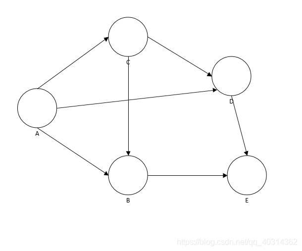

1:从A点出发，红色代表A点被访问。
2:有A->B,A->

C都可行，都可以遍历，这里我选择遍历C。


3：再遍历C之后，也可遍历C->B,C->D 我这里选择遍历C->D。


4：现在由D->E 这里遍历了E。


5：E已经不可以再遍历了。然后返回D,D又不可以遍历B，放回C，然后C->B可以。所以从C->B 就实现遍历。


### DFS 和 BFS优先搜索

**DFS**


**BFS**


```c++
#include <stdio.h>
#include <string.h>
#include <queue>
// 图结构

#define WUXIANG 0
#define VERTEXS 6

struct Graph
{
	int vertexs;
	int edges;
	char* pVertex;
	//int* ppEdge;     // 技巧一维数组表示二维数组
	int** ppEdge;      // 用动态二维数组

};
// 创建图对象
Graph* createGraph();
// 初始化图对象
void initGraph(Graph* g);
// 初始化图对象
void initGraph(Graph* g, int vertexs, int lines, char* str, int map[VERTEXS][VERTEXS]);
// 释放图对象
void destroyGraph(Graph* g);
// 获取顶点所在的下标, 如果没与返回-1 
int _getIdx(Graph* g, char c);
// 显示图
//
void show(Graph* g);
// 图的遍历
void travers(Graph* g, char v, bool isDeep);
// 找图中某个顶点的第一个相邻顶点, 没有返回-1
int findFirstVertex(Graph* g, char v, bool isFind[VERTEXS]);
// 找图中某个顶点的下一个相邻顶点, 没有返回-1,找v顶点的idx顶点的下一个顶点
int findNextVertex(Graph* g, char v, int idx);
// 深度优先搜索
void dfs(Graph* g, char v, bool isFind[VERTEXS]);
// 广度优先搜索
void bfs(Graph* g, char v, bool isFind[VERTEXS]);


int main(void)
{
	char buff[7] = "ABCDEF";
	int map[VERTEXS][VERTEXS] = {

		{0 ,0 ,1, 0, 0, 0},
		{0 ,0 ,1, 0, 0, 0},
		{1 ,1 ,0, 1, 1, 1},
		{0 ,0 ,1, 0, 0, 0},
		{0 ,0 ,1, 1, 0, 0},
		{0 ,0 ,1, 0, 0, 0},
	};

	// 创建图对象
	Graph* g = createGraph();
	// 初始化图
//	initGraph(g);
	initGraph(g, VERTEXS, 6, buff, map);
	// 显示图
	show(g);
	// 
	printf("\nDFS: ");
	travers(g, 'C', true);
	printf("\n");
	printf("BFS: ");
	travers(g, 'C', false);
	printf("\n");

	// 释放图对象
	destroyGraph(g);
	while (1);
	return 0;
}

//释放图对象
void destroyGraph(Graph* g)
{
	delete g;
}


//创建图对象
Graph* createGraph()
{
	Graph* graph = new Graph;
	graph->edges = graph->vertexs = 0;
	graph->ppEdge = NULL;
	graph->pVertex = NULL;

	// 或者 memset(grap, 0, sizeof(Graph))
	return graph;
}

// 初始化图对象
void initGraph(Graph* g, int vertexs, int lines, char* str, int map[VERTEXS][VERTEXS])
{
	g->vertexs = vertexs;
	g->edges = lines;
	// 开内存
	g->pVertex = new char[g->vertexs];  // 存放顶点信息的一维数组

	// 边的二维数组
	g->ppEdge = new int* [g->vertexs];
	for (int i = 0; i < g->vertexs; i++)
	{
		g->ppEdge[i] = new int[g->vertexs];
		memset(g->ppEdge[i], 0, sizeof(int) * g->vertexs);
	}

	memcpy(g->pVertex, str, VERTEXS);
	for (int i = 0; i < VERTEXS; i++)
	{
		for (int j = 0; j < VERTEXS; j++)
		{
			g->ppEdge[i][j] = map[i][j];
		}
	}
}


// 初始化图对象
void initGraph(Graph* g)
{
	printf("请输入顶点个数: ");
	scanf("%d", &(g->vertexs));
	printf("请输入边的个数: ");
	scanf("%d", &(g->edges));

	// 开内存
	g->pVertex = new char[g->vertexs + 1];  // 存放顶点信息的一维数组

	// 边的二维数组
	g->ppEdge = new int* [g->vertexs];
	for (int i = 0; i < g->vertexs; i++)
	{
		g->ppEdge[i] = new int[g->vertexs];
		memset(g->ppEdge[i], 0, sizeof(int) * g->vertexs);
	}

	// 赋值
	printf("请输入顶点: ");
	scanf("%s", g->pVertex);

	char buff[5] = {0};
	int srcIdx, dstIdx;
	for (int i = 0; i < g->edges; i++)
	{
		printf("请输入第%d条边(A->B): ", i + 1);
		scanf("%s", buff);
		srcIdx = _getIdx(g, buff[0]);
		dstIdx = _getIdx(g, buff[3]);
		g->ppEdge[srcIdx][dstIdx] = 1;
#if WUXIANG
		// 如果是无向图,加上一行代码
		// g->ppEdge[dstIdx][srcIdx] = 1;
	}
#endif
	}
}

int _getIdx(Graph* g, char c)
{
	for (int i = 0; i < g->vertexs; i++)
	{
		if (c == g->pVertex[i]) return i;
	}
	return -1;
}

void show(Graph* g)
{
	for (int i = 0; i <= g->vertexs; i++)
	{
		for (int j = 0; j <= g->vertexs; j++)
		{
			if (i == 0 && j == 0)//左上角空置
				printf(" ");
			else if (i == 0)
			{
				printf("%c ", g->pVertex[j - 1]);
			}
			else if (j == 0)
				printf("%c ", g->pVertex[i - 1]);
			else
			{
				printf("%d ", g->ppEdge[i - 1][j - 1]);
			}
		}
		printf("\n");

	}
}


// 图遍历
void travers(Graph* g, char v, bool isDeep)
{
	bool isFind[VERTEXS] = {0};   // 存储已经遍历过的顶点
	if (isDeep)
	{
		dfs(g, v, isFind);
	}
	else
	{
		bfs(g, v, isFind);
	}
	printf("\n");
}

// 找图中某个顶点的第一个相邻顶点, 没有返回-1  // cahr v 顶点
int findFirstVertex(Graph* g, char v, bool isFind[VERTEXS])
{
	int n = _getIdx(g, v);
	for (int i = 0; i < VERTEXS; i++)
	{
		if (isFind[i])
			continue;
		if (1 == g->ppEdge[n][i])
			return i;
	}
	return -1;
}

// 找中途某个顶点的下一个相邻顶点, 没有返回-1
//找v顶点的idx顶点的下一个顶点
int findNextVertex(Graph* g, char v, int idx)
{
	int n = _getIdx(g, v);
	for (int i = idx + 1; i < VERTEXS; i++)
	{
		if (1 == g->ppEdge[n][i])
			return i;
	}
	return -1;
}

// 深度优先
void dfs(Graph* g, char v, bool isFind[VERTEXS])
{
	//找v的第一个相邻顶点x，继续找x的第一个相邻顶点―直到没有相邻顶点就结束
	int cur = _getIdx(g, v);
	isFind[cur] = true;  // 标记找过
	printf("%c", v);
	int nextIdx = findFirstVertex(g, v, isFind);  // 获取当前顶点的第一个相邻顶点

	// 然后一条路走到黑
	while (nextIdx != -1) //有路
	{
		if (!isFind[nextIdx]) //一个顶点没有遍历过,及没有走过
		{
			//printf("%c", g->pVertex[nextIdx]);
			//isFind[nextIdx] = true;
			dfs(g, g->pVertex[nextIdx], isFind);
		}
		// 走过
		//找v的下一个相邻顶点，一直到都找完结束
		nextIdx = findNextVertex(g, v, nextIdx);
	}
}

// 广度优先(借助队列)
void bfs(Graph* g, char v, bool isFind[VERTEXS])
{
	using namespace std;
	queue <int> q;
	q.push(_getIdx(g, v));
	isFind[_getIdx(g, v)] = true;
	printf("%c", v);

	int headIdex;
	int idx;
	//  去看
	while (!q.empty())
	{
		headIdex = q.front();
		q.pop();

		int idx = findFirstVertex(g, g->pVertex[headIdex], isFind);  // 找第一个顶点
		while (idx != -1)
		{
			if (!isFind[idx])
			{
				isFind[idx] = true;
				printf("%c", g->pVertex[idx]);
				q.push(idx);
			}
			idx = findNextVertex(g, g->pVertex[headIdex], idx);  // 找下一个
		}

	}
}
```


## 总结

+ 本质都是利用索引确定关系
+ 用临接矩阵实现图还是蛮简单的，本质就是通过获取点的索引，往二维数组存放顶点之间的关系。
+ 用临接表的话，难点就是临接表的声明，节点表里存放的是临接点表，其他的没什么难度了。
+ 图的遍历，名字里有广度和深度，但是实现和之前寻路算法中的广度和深度不一样。这里借助队列和栈实现的。

# ----------------------算法--------------------------


# 算法性能分析

## 基本理论

+ 时间复杂度:      单位数据   消耗的时间比例    如 o (n)O(n^2)
+ 空间复杂度:      单位数据   消耗的固定空间  和临时空间
+ 稳定性:               数据变化是否导致   时间复杂度变化

常见的时间复杂度:

| 函数  | 名称       | 例子                        |
| ----- | ---------- | --------------------------- |
| c     | 常数       | 在链表首部插入一个元素      |
| logN  | 对数级     | 在一个有序序列中查找元素    |
| log²N | 对数平方根 |                             |
| N     | 线性级     | 在一个无序序列中查找元素在- |
| NlogN | 线性对数阶 | 分治排序                    |
| N²    | 平方级     | 求图两顶点的之间最短路径    |
| N³    | 立方级     | 矩阵相乘                    |
| 2^N   | 指数级     | 汉诺塔                      |

## 渐进分析

1. **循环语句 :    循环最里层语句的运行时间乘以迭代次数**

   ```c++
   //n次迭代
   for (i = 1; i<n; i++)
   {
   	m += 1;  //花费常数时间c0
   }
   
   //总的运行时间= c0 * n =  O(n)
   ```

+  设T(n)

  ```
  i = 1, 2, 3, 4, 5 ..... T(n)
  退出条件:  T(n) <= n  ==>   T(n) = n   (n的循环的终止条件)
  ```

  

2. **嵌套循环语句 :   从里层向外层进行分析, 结果是所有循环层迭代次数的乘积**

   ```c++
   //外层n次迭代
   for (i = 0; i <= n; i++)
   {
       // 内层n次迭代
   	for (j = 0; j <= n; j++)
       {
   		k += 1;   //花费常数时间c0
       }
   }
   
   //总的运行时间= (c0 * n) * n=  O(N²)
   ```

+ $$
  需要用到 \sum_{循环初始}^{终止值}  \hspace{100cm}\\
  \sum_{i = 1}^{n}\bullet \sum_{j = 1}^{n} \bullet 1 = n^2 \hspace{100cm}
  $$

  


3. **顺序语句 :   每个语句的时间复杂度相加**

   ```c++
   //花费常数时间 c0
   X=X+1;
   //执行n次迭代
   for (i=1;i<=n;i++)
   {
       m=m +2;//花费常数时间c1
   }
   
   //外层n次迭代
   for (i = 0; i <= n; i++)
   {
       // 内层n次迭代
   	for (j = 0; j <= n; j++)
       {
   		k += 1;   //花费常数时间c2
       }
   }
   
   //总的运行时间= c0 + (c1 * n) + (c2 * n) * n =  O(N²)
   ```

   

4. **if-then-else :  if-else本身花费c 再相加上then和 else内部的部分**

   ```c++
   //测试语句:执行花费常数时间c0
   if (length  ==  O)
   	return false: //then部分:执行花费常数时间c1
   else
   {
   	for (int n-0; n< length(); n++) //执行花费（常数时间c2 +常数时间c3) * n
       {  
    		if(llistin].equals(otherList.list[n])) //循环体中的if语句:执行花费 常数时间c2 + 常数
           {                                        //时间c3 //没有else部分
               return false;
           }
       }
   }
   
   //总的运行时间= c0 十 c1 + (c2 十c3）* n =  O(n)
   ```

   

5. **对数复杂度 **

   ```c++
   for (i = 1; i<n)
   {
   	i = i*2;
   }
   ```

##  基本解法

**一般类型:**

1. 设循环体次数为T(n)
2. 根据循环的特点,依次写出前几项,写到T(n)
3. 观察值与循环次数的关系
4. 代入退出循环条件

+ 例子1:

  ```c++
  void func(int n)
  {
      int i =0, s=0;
      while (s < n)
      {
          i++;
          s = s+i;
  	}
  }
  ```

  解:  设T(n)

  ```c++
  i: 1  2  3  4  ... T(n)
  s: 1  3  6  10 ... T(n) = T(n)(T(n) + 1) / 2
   
  T(n)(T(n) + 1) / 2 < n   ==> T(n)^2 + T(n) = 2n  ==> T(n) = sqrt(n)
  ```

  最终结果:  O(sqrt(n))					

+ 例子2:

  ```c++
  void func(int n)
  {
      int i, j, k, count=0;
      for (i = 1; i <= n; i++)
      {
          for (j = 1; j <= n/2; j++)
          {
             for (k = 1; k <= n; k*2)
         	   {
              	count++;   
          	}
          }
      }
  }
  ```

  解:  设T(n)

  第一步:

  ```c++
  k:  1 2 4 .... 2^T(n)
  
  2^T(n) <= n  ==> T(n) = logn
  ```

  $$
  第二步: \sum_{i = n/2}^{n}\bullet \sum_{j = 1}^{n/2} \bullet 1 = \frac{n}{2} \times \frac{n}{2} = \frac{n^2}{4}  \hspace{100cm}
  $$
  $$

  最终结果:  O(n^2lngn)					
  				
  				

**递归类型:**

1. 设递归总执行时间为T(n)
2. 分析递归出口,分析递归次数,将T(n)转化T(n-1)...T(1).
3. 得出结果

​    ps: 比较难


# 排序算法

排序算法是最经典的算法知识。因为其实现代码短，应用广. 要求现场手写基本的排序算法。

## **1. 冒泡排序**

冒泡排序是一种简单的排序算法。它重复地走访过要排序的数列，一次比较两个元素，如果它们的顺序错误就把它们交换过来。访问数列的工作是重复地进行直到没有再需要交换，也就是说该数列已经排序完成。这个算法的名字由来是因为越小的元素会经由交换慢慢“浮”到数列的顶端。

 **算法描述**

1. 比较相邻的元素。如果第一个比第二个大，就交换它们两个；

2. 对每一对相邻元素作同样的工作，从开始第一对到结尾的最后一对，这样在最后的元素应该会是最大的数；

3. 针对所有的元素重复以上的步骤，除了最后一个；

4. 重复步骤1~3，直到排序完成。

交换元素时的条件:

+ 升序(从小到大)排序条件: (返回 前一个数 < 后一个数)     所以要处理的就是   前 >  后   

+ 降序排序条件: 前 小于 后

假设从小到大排序.   
内层遍历整个数组，依次比较两个元素, 最终得到一个最大的元素放在数组最后。 但是要排序整个数组。所以要加一个外层循环，使得排序整个数组。并且内层循环每次可以少遍历一个元素，因为内层循环会元素放在数组最后， 可以不用再去排这个元素了


 **动图演示**


  **算法实现**

```java
public static void bubbleSort(int[] arr) {
    int temp = 0;
    for (int i = arr.length - 1; i > 0; i--) {  // 每次需要排序的长度
        for (int j = 0; j < i; j++) {       // 从第一个元素到第i个元素 //每次比较的元素是逐渐减少的
            if (arr[j] > arr[i]) {  //从小到大排序1 2 3 // 每次比较的是要比较的最后的数据,保证最后的那个数据一定是最值
                // 交换元素
                temp = arr[j];
                arr[j] = arr[j + 1];
                arr[j + 1] = temp;
            }
        } //loop j
    }  //loop i
}
```

 

// for的其他写法

```java
for (int i = 0; i < array.length - 1; i++) {    //每次需要排序的长度  剩下两元素不用交换了
     for (int j = 0; j < array.length -1 -i; j++) {
     }
}
```

ps :  其实是由内层 想到 外层的

**稳定性**

在相邻元素相等时，它们并不会交换位置，所以，冒泡排序是稳定排序。

 **适用场景**

适合小数据的排序。算法复杂度较高，在数据量大的时候不适合使用。

### 算法实现

```c++
// 冒泡排序
void bubbleSort(int arr[], int len)
{
	bool isok;
	for (int i = len - 1; i > 0; i--)
	{
		isok = false;
		for (int j = 0; j < i; j++)
		{
			if (arr[j] > arr[j + 1])
			{
				swap(arr[j], arr[j + 1]);
				isok = true;
			}
		}
		if (!isok)
			break;
	}
}
```


 **代码优化**

在数据完全有序的时候展现出最优时间复杂度，为O(n)。其他情况下，几乎总是O( n^2 )。算法在数据基本有序的情况下，性能最好。
增加一个`swap`的标志，当前一轮没有进行交换时，说明数组已经有序，没有必要再进行下一轮的循环了，直接退出。使算法在最佳情况下有O(n)复杂度.

+ 对每一对相邻元素作同样的工作，从开始第一对到结尾的最后一对，这样在最后的元素应该会是最大的数；
+ 交换元素时的条件:
  + 升序(从小到大)排序条件: (返回 前一个数 < 后一个数)     所以要处理的就是   前 >  后   

  + 降序排序条件: 前 小于 后

```java
public static void bubbleSort(int[] arr) {
    int temp = 0;
    boolean swap;
    for (int i = arr.length - 1; i > 0; i--) { // 每次需要排序的长度
        swap=false;
        for (int j = 0; j < i; j++) { // 从第一个元素到第i个元素
            if (arr[j] > arr[j + 1]) {
                temp = arr[j];
                arr[j] = arr[j + 1];
                arr[j + 1] = temp;
                swap = true;
            }
        }//loop j
        if (swap==false){
            break;
        }
    }//loop i
}
```

## **2. 选择排序**

选择排序是一种简单直观的排序算法，它也是一种交换排序算法，和冒泡排序有一定的相似度，可以认为选择排序是冒泡排序的一种改进。

 **算法描述**

1. 在未排序序列中找到最小（大）元素，遇到比起始位置小的就标记再比较标记中那个更小, 最后存放到排序序列的起始位置, 
2. 从剩余未排序元素中继续寻找最小（大）元素，然后放到已排序序列的末尾。
3. 重复第二步，直到所有元素均排序完毕。

 **动图演示**

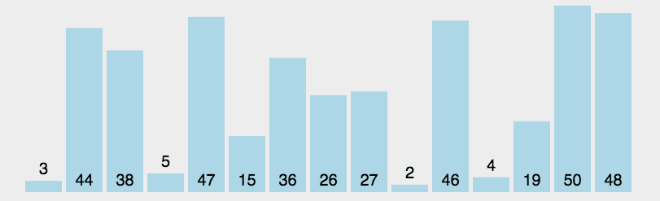

**思路:**


找最小元素的索引

### **算法实现**

```c++
// 选择排序
void selectionSort(int arr[], int len)
{
	int min_idx = 0;
    //从待排序列中挑选最小的放到第一个位置  (所以挑到最后一个元素就不用挑了)
	for (int i = 0; i < len - 1; i++)
	{
		min_idx = i;
		// 待排数组的范围  [i, len - 1]
		for (int j = i; j < len; j++)  //[i, len - 1]范围内找到最小的下标
		{
			min_idx = (arr[min_idx] < arr[j]) ? min_idx : j;

		}
		//arr[min_idx] 和 arr[i] 交换 
		if (min_idx != i)  // 如果最小的位置不是起始位置就交换值,始终使当前位置是最小值
			swap(&arr[i], &arr[min_idx]);
	}
}

void swap(int* n1, int* n2)
{
	int temp = *n1;
	*n1 = *n2;
	*n2 = temp;
}
```

大致效果:


**稳定性**

用数组实现的选择排序是不稳定的，用链表实现的选择排序是稳定的。
不过，一般提到排序算法时，大家往往会默认是数组实现，所以选择排序是不稳定的。

 **适用场景**

选择排序实现也比较简单，并且由于在各种情况下复杂度波动小，因此**一般是优于冒泡排序的**。在所有的完全交换排序中，选择排序也是比较不错的一种算法。但是，由于固有的O(n2)复杂度，选择排序在海量数据面前显得力不从心。因此，它适用于简单数据排序。


## **3. 插入排序**

插入排序是一种简单直观的排序算法。它的工作原理是通过构建有序序列，对于未排序数据，在已排序序列中从后向前扫描，找到相应位置并插入。

 **算法描述**

1. **把待排序的数组分成已排序和未排序两部分**，初始的时候把第一个元素认为是已排好序的。
2. 从第二个元素开始，在已排好序的子数组中寻找到该元素合适的位置并插入该位置。
3. 重复上述过程直到最后一个元素被插入有序子数组中。

 **动图演示**


### **算法实现**

```c++
// 插入排序
void insertionSort(int arr[], int len)
{
	int temp;
	int j;
	//把待排序的数组分成已排序和未排序两部分，初始时把第一个元素认为是已排好序的。
	//直到最后一个元素被插入有序子数组中。所以挑到最后一个元素就还是要挑的
    //(因为除了第一个元素,每个元素都要拿来插入)
	for (int i = 1; i < len; i++) //初始时把第一个元素认为是已排好序的。
	{

		// 1. 临时存储当前数据
		temp = arr[i];

		//(从第二个元素开始)去已排好序的子数组中, 定位插入点
		// 2. 定位到插入点,插入点之后的需要往后移 
        // 条件1:从i-1 到 0 条件2:比temp大  ---> 往后覆盖
		j = i - 1;
		while (j >= 0 && arr[j] > temp)
		{
			arr[j + 1] = arr[j];  // 往后覆盖(wanho)
			j--;
		}
        
		// 3. 插入
		arr[j + 1] = temp;
	}
}
```

**稳定性**

由于只需要找到不大于当前数的位置而并不需要交换，因此，直接插入排序是稳定的排序方法。

 **适用场景**

插入排序由于O( n2 )的复杂度，在数组较大的时候不适用。但是，在数据比较少的时候，是一个不错的选择，一般做为快速排序的扩充。例如，在STL的sort算法和stdlib的qsort算法中，都将插入排序作为快速排序的补充，用于少量元素的排序。又如，在JDK 7 java.util.Arrays所用的sort方法的实现中，当待排数组长度小于47时，会使用插入排序。


## **4. 希尔排序（插入排序的改良版）**

在希尔排序出现之前，计算机界普遍存在“排序算法不可能突破O(n2)”的观点。希尔排序是第一个突破O(n2)的排序算法，它是简单插入排序的改进版。希尔排序的提出，主要基于以下两点：

1. 插入排序算法在数组基本有序的情况下，可以近似达到O(n)复杂度，效率极高。
2. 但插入排序每次只能将数据移动一位，在数组较大且基本无序的情况下性能会迅速恶化。

 **算法描述**

先将整个待排序的记录序列分割成为若干子序列分别进行直接插入排序，具体算法描述：

- 选择一个增量序列t1，t2，…，tk，其中ti>tj，tk=1；
- 按增量序列个数k，对序列进行 k 趟排序；
- 每趟排序，根据对应的增量ti，将待排序列分割成若干长度为m 的子序列，分别对各子表进行直接插入排序。仅增量因子为1 时，整个序列作为一个表来处理，表长度即为整个序列的长度。

**动图演示**


 **算法实现**

Donald Shell增量

```java
public static void shellSort(int[] arr){
    int temp;
    for (int delta = arr.length/2; delta>=1; delta/=2){                              //对每个增量进行一次排序
        for (int i=delta; i<arr.length; i++){              
            for (int j=i; j>=delta && arr[j]<arr[j-delta]; j-=delta){ //注意每个地方增量和差值都是delta
                temp = arr[j-delta];
                arr[j-delta] = arr[j];
                arr[j] = temp;
            }
        }//loop i
    }//loop delta
}
```

O(n3/2) by Knuth

```java
public static void shellSort2(int[] arr){
    int delta = 1;
    while (delta < arr.length/3){//generate delta
        delta=delta*3+1;    // <O(n^(3/2)) by Knuth,1973>: 1, 4, 13, 40, 121, ...
    }         
    int temp;
    for (; delta>=1; delta/=3){
        for (int i=delta; i<arr.length; i++){              
            for (int j=i; j>=delta && arr[j]<arr[j-delta]; j-=delta){
                temp = arr[j-delta];
                arr[j-delta] = arr[j];
                arr[j] = temp;
            }
        }//loop i
    }//loop delta
}
```

**希尔排序的增量**

希尔排序的增量数列可以任取，需要的唯一条件是最后一个一定为1（因为要保证按1有序）。但是，不同的数列选取会对算法的性能造成极大的影响。上面的代码演示了两种增量。
切记：增量序列中每两个元素最好不要出现1以外的公因子！（很显然，按4有序的数列再去按2排序意义并不大）。
下面是一些常见的增量序列。
\- 第一种增量是最初Donald Shell提出的增量，即折半降低直到1。据研究，使用希尔增量，其时间复杂度还是O(n2)。

第二种增量Hibbard：{1, 3, ..., 2k-1}。该增量序列的时间复杂度大约是O(n1.5)。

第三种增量Sedgewick增量：(1, 5, 19, 41, 109,...)，其生成序列或者是9*4i* *- 9*2i + 1或者是4i - 3*2i + 1。


### **算法实现**

```c++
// 希尔排序
void shellSort(int arr[], int len)
{
	int step = len >> 1;   // 初始步长为元素的一半(len / 2) 
	int temp;
	int j;
	while (step)
	{
		// 组内做  "插入排序"  i = step
		for (int i = step; i < len; i++)
		{
			// 1. 临时存储当前数据,
			temp = arr[i];

		   // 2. 定位到插入点,插入点之后的需要往后移 // 条件1:从i-1 到 0 条件2:比temp大  ---> 往后覆盖
			j = i - step;
			while (j >= 0 && arr[j] > temp)
			{
				arr[j + step] = arr[j];  // 往后覆盖
				j -= step;
			}
			// 3. 插入
			arr[j + step] = temp;
		}

		step >>= 1;  // 步长每次折半
	}
}
```


**稳定性**

我们都知道插入排序是稳定算法。但是，Shell排序是一个多次插入的过程。在一次插入中我们能确保不移动相同元素的顺序，但在多次的插入中，相同元素完全有可能在不同的插入轮次被移动，最后稳定性被破坏，因此，Shell排序不是一个稳定的算法。

**适用场景**

Shell排序虽然快，但是毕竟是插入排序，其数量级并没有后起之秀--快速排序O(n㏒n)快。在大量数据面前，**Shell排序不是一个好的算法。**但是，**中小型规模的数据完全可以使用它.**

## **5. 基数排序**

基数排序(Radix Sort)是桶排序的扩展，它的基本思想是：将整数按位数切割成不同的数字，然后按每个位数分别比较。
排序过程：将所有待比较数值（正整数）统一为同样的数位长度，数位较短的数前面补零。然后，从最低位开始，依次进行一次排序。这样从最低位排序一直到最高位排序完成以后, 数列就变成一个有序序列。

 **算法描述**

1. 取得数组中的最大数，并取得位数；
2. arr为原始数组，从最低位开始取每个位组成radix数组；
3. 对radix进行计数排序（利用计数排序适用于小范围数的特点）；

 **动图**


**算法实现**

```java
public abstract class Sorter {
     public abstract void sort(int[] array);
}
 
public class RadixSorter extends Sorter {
     
     private int radix;
     
     public RadixSorter() {
          radix = 10;
     }
     
     @Override
     public void sort(int[] array) {
          // 数组的第一维表示可能的余数0-radix，第二维表示array中的等于该余数的元素
          // 如：十进制123的个位为3，则bucket[3][] = {123}
          int[][] bucket = new int[radix][array.length];
          int distance = getDistance(array); // 表示最大的数有多少位
          int temp = 1;
          int round = 1; // 控制键值排序依据在哪一位
          while (round <= distance) {
               // 用来计数：数组counter[i]用来表示该位是i的数的个数
               int[] counter = new int[radix];
               // 将array中元素分布填充到bucket中，并进行计数
               for (int i = 0; i < array.length; i++) {
                    int which = (array[i] / temp) % radix;
                    bucket[which][counter[which]] = array[i];
                    counter[which]++;
               }
               int index = 0;
               // 根据bucket中收集到的array中的元素，根据统计计数，在array中重新排列
               for (int i = 0; i < radix; i++) {
                    if (counter[i] != 0)
                         for (int j = 0; j < counter[i]; j++) {
                              array[index] = bucket[i][j];
                              index++;
                         }
                    counter[i] = 0;
               }
               temp *= radix;
               round++;
          }
     }
     
     private int getDistance(int[] array) {
          int max = computeMax(array);
          int digits = 0;
          int temp = max / radix;
          while(temp != 0) {
               digits++;
               temp = temp / radix;
          }
          return digits + 1;
     }
     
     private int computeMax(int[] array) {
          int max = array[0];
          for(int i=1; i<array.length; i++) {
               if(array[i]>max) {
                    max = array[i];
               }
          }
          return max;
     }
}
```

 


### 算法实现

```c++
// 基数排序
void radixSort(int arr[], int len, int max) //数组首地址   数组元素个数  最大元素值
{
    // 初始化新数组
	int* pTemp = new int[max + 1];
	int k = 0;
	for (int i = 0; i < max + 1; i++)
	{
		pTemp[i] = -1;
	}

	for (int i = 0; i < len; i++)
	{
		pTemp[arr[i]] = arr[i];  // 核心
	}

	// 放回去
	for (int i = 0; i < max + 1; i++)
	{
		if (-1 != pTemp[i])
		{
			arr[k] = pTemp[i];
			k++;
		}
	}
}
```

**稳定性**

通过上面的排序过程，我们可以看到，每一轮映射和收集操作，都保持从左到右的顺序进行，如果出现相同的元素，则保持他们在原始数组中的顺序。可见，基数排序是一种稳定的排序。

 **适用场景**

基数排序要求较高，**元素必须是整数**，整数时长度10W 以上，最大值100W以下效率较好，但是基数排序比其他排序好在可以适用字符串，或者其他需要根据多个条件进行排序的场景，例如日期，先排序日，再排序月，最后排序年 ，其它排序算法可是做不了的。

## **6. 桶排序**

桶排序又叫箱排序，是**计数排序的升级版**，它的工作原理是将数组分到有限数量的桶子里，然后对每个桶子再分别排序（有可能再使用别的排序算法或是以递归方式继续使用桶排序进行排序），最后将各个桶中的数据有序的合并起来。

> 计数排序是桶排序的一种特殊情况，可以把计数排序当成每个桶里只有一个元素的情况。网络中很多博文写的桶排序实际上都是计数排序，并非标准的桶排序，要注意辨别。

 **算法描述**

1. 找出待排序数组中的最大值max、最小值min
2. 我们使用 动态数组ArrayList 作为桶，桶里放的元素也用 ArrayList 存储。桶的数量为(max-min)/arr.length+1
3. 遍历数组 arr，计算每个元素 arr[i] 放的桶
4. 每个桶各自排序
5. 遍历桶数组，把排序好的元素放进输出数组

 **图片演示**


 **算法实现**


```java
public static void bucketSort(int[] arr){
    int max = Integer.MIN_VALUE;
    int min = Integer.MAX_VALUE;
    for(int i = 0; i < arr.length; i++){
        max = Math.max(max, arr[i]);
        min = Math.min(min, arr[i]);
    }
    //桶数
    int bucketNum = (max - min) / arr.length + 1;
    ArrayList<ArrayList<Integer>> bucketArr = new ArrayList<>(bucketNum);
    for(int i = 0; i < bucketNum; i++){
        bucketArr.add(new ArrayList<Integer>());
    }
    //将每个元素放入桶
    for(int i = 0; i < arr.length; i++){
        int num = (arr[i] - min) / (arr.length);
        bucketArr.get(num).add(arr[i]);
    }
    //对每个桶进行排序
    for(int i = 0; i < bucketArr.size(); i++){
        Collections.sort(bucketArr.get(i));
    }
    System.out.println(bucketArr.toString());
}
```


### 算法实现

```c++
// 箱排序
void binSort(int arr[], int len, int area)  // int area 位数次
{
	int idx;
	// i = 1      10            100           
	// num/1%10   num/10%10     num/100%10 
	for (int i = 1; i < area; i *= 10)  // 10进制位数
	{
		// 1. 创建10个箱子, 并且初始化为-1 
		int* pTemp = new int[len * 10];  // 一维数组表示二维数组
		for (int j = 0; j < 10 * len; j++)
		{
			pTemp[j] = -1;
		}
		// 2. 把待排数组中的数据，按照规律放到箱子里去 
		for (int j = 0; j < len; j++)
		{
			idx = arr[j] / i % 10;   // 一个数上的某个位上的数
			//pTemp[idx][j];
			*(pTemp + (idx * 10) + j) = arr[j];
		}
		// 3. 按照先后次序把箱子里的数据放到待排数组中 , 放回去
		int k = 0;
		for (int j = 0; j < 10 * len; j++)
		{
			if (-1 != pTemp[j])
			{
				arr[k++] = pTemp[j];
			}
		}

		//释放内存
		delete[]pTemp;

	}
}
```

 **稳定性**

可以看出，在分桶和从桶依次输出的过程是稳定的。但是，由于我们在对每个桶进行排序时使用了其他算法，所以，桶排序的稳定性依赖于这一步。如果我们使用了快排，显然，算法是不稳定的。

**适用场景**

桶排序可用于**最大最小值相差较大的数据情况**，但桶排序要求数据的分布必须均匀，否则可能导致数据都集中到一个桶中。**比如[104,150,123,132,20000], 这种数据会导致前4个数都集中到同一个桶中。导致桶排序失效**。

## **7. 计数排序**

计数排序不是基于比较的排序算法，其核心在于将输入的数据值转化为键存储在额外开辟的数组空间中。 作为一种线性时间复杂度的排序，计数排序要求输入的数据必须是有确定范围的整数。

 **算法描述**

1. 找出待排序的数组中最大和最小的元素；
2. 统计数组中每个值为i的元素出现的次数，存入数组C的第i项；
3. 对所有的计数累加（从C中的第一个元素开始，每一项和前一项相加）；
4. 反向填充目标数组：将每个元素i放在新数组的第C(i)项，每放一个元素就将C(i)减去1。

 **动图演示**


 **算法实现**

```java
public static void countSort(int[] a, int max, int min) {
     int[] b = new int[a.length];//存储数组
     int[] count = new int[max - min + 1];//计数数组

     for (int num = min; num <= max; num++) {
        //初始化各元素值为0，数组下标从0开始因此减min
        count[num - min] = 0;
     }

     for (int i = 0; i < a.length; i++) {
        int num = a[i];
        count[num - min]++;//每出现一个值，计数数组对应元素的值+1
     }

     for (int num = min + 1; num <= max; num++) {
        //加总数组元素的值为计数数组对应元素及左边所有元素的值的总和
        count[num - min] += sum[num - min - 1]
     }

     for (int i = 0; i < a.length; i++) {
          int num = a[i];//源数组第i位的值
          int index = count[num - min] - 1;//加总数组中对应元素的下标
          b[index] = num;//将该值存入存储数组对应下标中
          count[num - min]--;//加总数组中，该值的总和减少1。
     }

     //将存储数组的值一一替换给源数组
     for(int i=0;i<a.length;i++){
         a[i] = b[i];
     }
}
```

 **稳定性**

最后给 b 数组赋值是倒着遍历的，而且放进去一个就将C数组对应的值（表示前面有多少元素小于或等于A[i]）减去一。如果有相同的数x1,x2，那么相对位置后面那个元素x2放在（比如下标为4的位置），相对位置前面那个元素x1下次进循环就会被放在x2前面的位置3。从而保证了稳定性。

 **适用场景**

排序目标要能够映射到整数域，其最大值最小值应当容易辨别。例如高中生考试的总分数，显然用0-750就OK啦；又比如一群人的年龄，用个0-150应该就可以了，再不济就用0-200喽。另外，计数排序需要占用大量空间，它比较适用于数据比较集中的情况。

## 8. 合并排序


###  算法实现

```c++
// 合并排序
void mergeSort(int arr[], int l, int m, int r) //1,m,r: 是元素下标
{ // l -- m  // m+1 -- r
	int left = l;
	int right = m + 1;
	int k = 0;
	// 1. 开辟临时内存
	int len = r - l + 1;
	int* pTemp = new int[len];

	// 2. 放完左边或者右边
	while (left <= m && right <= r)
	{
		if (arr[left] < arr[right])
			pTemp[k++] = arr[left++];
		else
			pTemp[k++] = arr[right++];

	}
	// 3. 把剩下的也放到临时数组中
	if (left <= m)
	{
		memcpy(pTemp + k, arr + left, sizeof(int) * (m - left + 1));
	}
	else
	{
		memcpy(pTemp + k, arr + right, sizeof(int) * (r - right + 1));
	}

	// 4. 临时数组覆盖原数组，释放临时数组内存
	memcpy(arr + l, pTemp, sizeof(int) * len);

	// 5. 释放内存
	delete[]pTemp;
}
```

 **作用: 合并两个有序的子序列**

## **9. 归并排序**

归并排序是建立在归并操作上的一种有效的排序算法。该算法是采用分治法的一个非常典型的应用。**将已有序的子序列合并，得到完全有序的序列；**即先使每个子序列有序，再使子序列段间有序。若将两个有序表合并成一个有序表，称为2-路归并。

 **算法描述**

两种方法

- 递归法（Top-down）

1. 申请空间，使其大小为两个已经排序序列之和，该空间用来存放合并后的序列
2. 设定两个指针，最初位置分别为两个已经排序序列的起始位置
3. 比较两个指针所指向的元素，选择相对小的元素放入到合并空间，并移动指针到下一位置
4. 重复步骤3直到某一指针到达序列尾
5. 将另一序列剩下的所有元素直接复制到合并序列尾

- 迭代法（Bottom-up）

原理如下（假设序列共有n个元素）：

1. 将序列每相邻两个数字进行归并操作，形成ceil(n/2)个序列，排序后每个序列包含两/一个元素
2. 若此时序列数不是1个则将上述序列再次归并，形成ceil(n/4)个序列，每个序列包含四/三个元素
3. 重复步骤2，直到所有元素排序完毕，即序列数为1

**动图演示**


 **算法实现**

```java
public static void mergeSort(int[] arr){
    int[] temp =new int[arr.length];
    internalMergeSort(arr, temp, 0, arr.length-1);
}
private static void internalMergeSort(int[] arr, int[] temp, int left, int right){
    //当left==right的时，已经不需要再划分了
    if (left<right){
        int middle = (left+right)/2;
        internalMergeSort(arr, temp, left, middle);          //左子数组
        internalMergeSort(arr, temp, middle+1, right);       //右子数组
        mergeSortedArray(arr, temp, left, middle, right);    //合并两个子数组
    }
}
// 合并两个有序子序列
private static void mergeSortedArray(int arr[], int temp[], int left, int middle, int right){
    int i=left;      
    int j=middle+1;
    int k=0;
    while (i<=middle && j<=right){
        temp[k++] = arr[i] <= arr[j] ? arr[i++] : arr[j++];
    }
    while (i <=middle){
        temp[k++] = arr[i++];
    }
    while ( j<=right){
        temp[k++] = arr[j++];
    }
    //把数据复制回原数组
    for (i=0; i<k; ++i){
        arr[left+i] = temp[i];
    }
}
```


### 算法实现


```c++

// 合并排序
void mergeToSort(int arr[], int l, int m, int r) //1,m,r: 是元素下标
{ // l -- m  // m+1 -- r
	int left = l;
	int right = m + 1;
	int k = 0;
	// 1. 开辟临时内存
	int len = r - l + 1;  // r + 1 是在常规情况的
	int* pTemp = new int[len];

	// 2. 放完左边或者右边
	while (left <= m && right <= r)
	{
		if (arr[left] < arr[right])
			pTemp[k++] = arr[left++];
		else
			pTemp[k++] = arr[right++];

	}
	// 3. 把剩下的也放到临时数组中
	if (left <= m)
	{
		memcpy(pTemp + k, arr + left, sizeof(int) * (m - left + 1));
	}
	else
	{
		memcpy(pTemp + k, arr + right, sizeof(int) * (r - right + 1));
	}

	// 4. 临时数组覆盖原数组，释放临时数组内存
	memcpy(arr + l, pTemp, sizeof(int) * len);

	// 5. 释放内存
	delete[]pTemp;
}

```

```c++
// 归并排序
void mergeSort(int arr[], int l, int r)
{
	// 1拆到只有一个元素为止(只有一个元素的数组必然有序)
	if (l >= r)
		return;
	// 0先拆
	int m = l + (r - l) / 2;
	mergeSort(arr, l, m);
	mergeSort(arr, m + 1, r);

	// 2再合并  --> 使用合并算法
	mergeToSort(arr, l, m, r);
}
```

**稳定性**

因为我们在遇到相等的数据的时候必然是按顺序“抄写”到辅助数组上的，所以，归并排序同样是稳定算法。

 **适用场景**

归并排序在数据量比较大的时候也有较为出色的表现（效率上），但是，其空间复杂度O(n)使得在数据量特别大的时候（例如，1千万数据）几乎不可接受。而且，考虑到有的机器内存本身就比较小，因此，采用归并排序一定要注意。

## **5. 快速排序**

快速排序是一个知名度极高的排序算法，其对于大数据的优秀排序性能和相同复杂度算法中相对简单的实现使它注定得到比其他算法更多的宠爱。

 **算法描述**

1. 从数列中挑出一个元素，称为"基准"（pivot），
2. 重新排序数列，所有比基准值小的元素摆放在基准前面，所有比基准值大的元素摆在基准后面（相同的数可以到任何一边）。在这个分区结束之后，该基准就处于数列的中间位置。这个称为分区（partition）操作。
3. 递归地（recursively）把小于基准值元素的子数列和大于基准值元素的子数列排序。

 **动图演示**


 **算法实现**

```java
public static void quickSort(int[] arr){
    qsort(arr, 0, arr.length-1);
}
private static void qsort(int[] arr, int low, int high){
    if (low >= high)
        return;
    int pivot = partition(arr, low, high);       //将数组分为两部分
    qsort(arr, low, pivot-1);                   //递归排序左子数组
    qsort(arr, pivot+1, high);                  //递归排序右子数组
}

private static int partition(int[] arr, int low, int high){
    int pivot = arr[low];     //基准
    while (low < high){
        while (low < high && arr[high] >= pivot) --high;
        arr[low]=arr[high];             //交换比基准大的记录到左端
        while (low < high && arr[low] <= pivot) ++low;
        arr[high] = arr[low];           //交换比基准小的记录到右端
    }
    //扫描完成，基准到位
    arr[low] = pivot;
    //返回的是基准的位置
    return low;
}
```

### **算法实现**

**数组:**


```c++

//  快速排序
/*
思路: 
	1. pivot ----> 永远是左边第一个
	2. i,j ----> pivot后一个
	3. 移动两个指针: 1. i左边的数 < pivot
				   2. 让[i, j]之间 > pivot
		3.1. 如果 num[j] > pivot  --> j++
		     如果 num[j] < pivot  --> 1. 交换i,j  2. i++, j++
			
	4. j到最后了, 交换pivot 和 num[i-1]

	5. 分治

*/

void mySwap(int arr[], int n1, int n2)
{
	arr[n1] ^= arr[n2];
	arr[n2] ^= arr[n1];
	arr[n1] ^= arr[n2];
}

void subSort(int arr[], int low, int high)
{
    if (low >= high) return;
	//1. pivot ----> 永远是左边第一个
	int pivot = arr[low];  

	//2. i, j---- > pivot后一个
	int i = low + 1;
	int j = low + 1;

	while (j <= high)   // 终止条件  // 4. j到最后了
	{
		// 3. 如果 num[j] < pivot--> 1. 交换i, j  2. i++, j++
		if (arr[j] < pivot)
		{
			mySwap(arr, i, j);
			i++;
		}
		j++;
	}

	//4. j到最后了, 交换pivot 和 num[i-1]
	mySwap(arr, low, i -1);  // 也可以i-2

	// 分治
	subSort(arr, low, i - 1);
	subSort(arr, i, high);

}

void quickSort2(int arr[], int len)
{
	subSort(arr, 0, len - 1);
}

```

**链表:**

```c++
void swapNode(Node * a, Node * b)  // 壳子没变数据变了而已
{
	int temp = a->data;
	a->data = b->data;
	b->data = temp;
}

void subSort(Node* low, Node* hight)
{
	if (low == NULL || low->next == NULL || low == hight) return;

	int pivot = low->data;
	Node * i = low->next;
	Node* i_pre = low;
	Node* j = low->next;

	while (j != hight->next)
	{
		if (j->data < pivot)
		{
			swapNode(i, j);
			i_pre = i;    // 保存前一个
			i = i->next;
		}
		j = j->next;
	}

	//4. j到最后了, 交换pivot 和 num[i-1]
	swapNode(low, i_pre);

	// 分治
	subSort(low, i_pre);
	subSort(i, hight);
}

void QuickSort(Node * head)
{
	Node* cur = head;
	while (cur->next)
	{
		cur = cur->next;
	}

	subSort(head, cur);
}

```

**稳定性**

快速排序并不是稳定的。这是因为我们无法保证相等的数据按顺序被扫描到和按顺序存放。

**适用场景**

**快速排序在大多数情况下都是适用的，尤其在数据量大的时候性能优越性更加明显。**但是在必要的时候，需要考虑下优化以提高其在最坏情况下的性能。

## **6. 堆排序**

堆排序(Heapsort)是指利用堆积树（堆）这种数据结构所设计的一种排序算法，它是选择排序的一种。可以利用数组的特点快速定位指定索引的元素。堆排序就是把最大堆堆顶的最大数取出，将剩余的堆继续调整为最大堆，再次将堆顶的最大数取出，这个过程持续到剩余数只有一个时结束。

**树的概念**

关于树的概念请参考：

 **堆的概念**

堆是一种特殊的完全二叉树（complete binary tree）。完全二叉树的一个“优秀”的性质是，除了最底层之外，每一层都是满的，这使得堆可以利用数组来表示（普通的一般的二叉树通常用链表作为基本容器表示），每一个结点对应数组中的一个元素。
如下图，是一个堆和数组的相互关系：


对于给定的某个结点的下标 i，可以很容易的计算出这个结点的父结点、孩子结点的下标：

- Parent(i) = floor(i/2)，i 的父节点下标
- Left(i) = 2i，i 的左子节点下标
- Right(i) = 2i + 1，i 的右子节点下标

二叉堆一般分为两种：最大堆和最小堆。
**最大堆：**
最大堆中的最大元素值出现在根结点（堆顶）
堆中每个父节点的元素值都大于等于其孩子结点（如果存在）


**最小堆：**
最小堆中的最小元素值出现在根结点（堆顶）
堆中每个父节点的元素值都小于等于其孩子结点（如果存在）


 **堆排序原理**

堆排序就是把最大堆堆顶的最大数取出，将剩余的堆继续调整为最大堆，再次将堆顶的最大数取出，这个过程持续到剩余数只有一个时结束。在堆中定义以下几种操作：

- 最大堆调整（Max-Heapify）：将堆的末端子节点作调整，使得子节点永远小于父节点
- 创建最大堆（Build-Max-Heap）：将堆所有数据重新排序，使其成为最大堆
- 堆排序（Heap-Sort）：移除位在第一个数据的根节点，并做最大堆调整的递归运算 继续进行下面的讨论前，需要注意的一个问题是：数组都是 Zero-Based，这就意味着我们的堆数据结构模型要发生改变


相应的，几个计算公式也要作出相应调整：

- Parent(i) = floor((i-1)/2)，i 的父节点下标
- Left(i) = 2i + 1，i 的左子节点下标
- Right(i) = 2(i + 1)，i 的右子节点下标

 **堆的建立和维护**

堆可以支持多种操作，但现在我们关心的只有两个问题：

1. 给定一个无序数组，如何建立为堆？
2. 删除堆顶元素后，如何调整数组成为新堆？

先看第二个问题。假定我们已经有一个现成的大根堆。现在我们删除了根元素，但并没有移动别的元素。想想发生了什么：根元素空了，但其它元素还保持着堆的性质。我们可以把**最后一个元素**（代号A）移动到根元素的位置。如果不是特殊情况，则堆的性质被破坏。但这仅仅是由于A小于其某个子元素。于是，我们可以把A和这个子元素调换位置。如果A大于其所有子元素，则堆调整好了；否则，重复上述过程，A元素在树形结构中不断“下沉”，直到合适的位置，数组重新恢复堆的性质。上述过程一般称为“筛选”，方向显然是自上而下。

> 删除后的调整，是把最后一个元素放到堆顶，自上而下比较

删除一个元素是如此，插入一个新元素也是如此。不同的是，我们把新元素放在**末尾**，然后和其父节点做比较，即自下而上筛选。

> 插入是把新元素放在末尾，自下而上比较

那么，第一个问题怎么解决呢？

常规方法是从第一个非叶子结点向下筛选，直到根元素筛选完毕。这个方法叫“筛选法”，需要循环筛选n/2个元素。

但我们还可以借鉴“插入排序”的思路。我们可以视第一个元素为一个堆，然后不断向其中添加新元素。这个方法叫做“插入法”，需要循环插入(n-1)个元素。

由于筛选法和插入法的方式不同，所以，相同的数据，它们建立的堆一般不同。大致了解堆之后，堆排序就是水到渠成的事情了。

## **动图演示**


 **算法描述**

我们需要一个升序的序列，怎么办呢？我们可以建立一个最小堆，然后每次输出根元素。但是，这个方法需要额外的空间（否则将造成大量的元素移动，其复杂度会飙升到O(n2) ）。如果我们需要就地排序（即不允许有O(n)空间复杂度），怎么办？

有办法。我们可以建立最大堆，然后我们倒着输出，在最后一个位置输出最大值，次末位置输出次大值……由于每次输出的最大元素会腾出第一个空间，因此，我们恰好可以放置这样的元素而不需要额外空间。很漂亮的想法，是不是？

 **算法实现**

```java
public class ArrayHeap {
    private int[] arr;
    public ArrayHeap(int[] arr) {
        this.arr = arr;
    }
    private int getParentIndex(int child) {
        return (child - 1) / 2;
    }
    private int getLeftChildIndex(int parent) {
        return 2 * parent + 1;
    }
    private void swap(int i, int j) {
        int temp = arr[i];
        arr[i] = arr[j];
        arr[j] = temp;
    }
    /**
     * 调整堆。
     */
    private void adjustHeap(int i, int len) {
        int left, right, j;
        left = getLeftChildIndex(i);
        while (left <= len) {
            right = left + 1;
            j = left;
            if (j < len && arr[left] < arr[right]) {
                j++;
            }
            if (arr[i] < arr[j]) {
                swap(array, i, j);
                i = j;
                left = getLeftChildIndex(i);
            } else {
                break; // 停止筛选
            }
        }
    }
    /**
     * 堆排序。
     * */
    public void sort() {
        int last = arr.length - 1;
        // 初始化最大堆
        for (int i = getParentIndex(last); i >= 0; --i) {
            adjustHeap(i, last);
        }
        // 堆调整
        while (last >= 0) {
            swap(0, last--);
            adjustHeap(0, last);
        }
    }

}
```

 **稳定性**

堆排序存在大量的筛选和移动过程，属于不稳定的排序算法。

 **适用场景**

堆排序在建立堆和调整堆的过程中会产生比较大的开销，在元素少的时候并不适用。但是，在元素比较多的情况下，还是不错的一个选择。尤其是在解决诸如“前n大的数”一类问题时，几乎是首选算法。

## **总结**


稳定排序：如果 a 原本在 b 前面，且 a == b，排序之后 a 仍然在 b 前面。
非稳定排序：如果 a 原本在 b 前面，且 a == b，排序之后 a 不一定在 b 前面。
原地排序 / 非原地排序：区别在于是否 使用额外的数组 辅助排序


# 查找

## 1.  哈希表

**哈希表**（Hash table，也叫**散列表**），是根据关键码值(Key value)而直接进行访问的数据结构。也就是说，它通过把关键码值映射到表中一个位置来访问记录，以加快查找的速度。这个映射函数叫做散列函数，存放记录的数组叫做散列表。

```c
记录的存储位置=f(关键字)
这里的对应关系f称为散列函数，又称为哈希（Hash函数），采用散列技术将记录存储在一块连续的存储空间中，这块连续存储空间称为散列表或哈希表（Hash table）。
```

哈希表hashtable(key，value)：

　　1. 把**Key**通过一个**固定的算法**函数既所谓的**哈希函数**转换成一个**整型数字**，

　　2. 然后就将**该数字**对数组长度进行**取余**，**取余结果**就当作**数组的下标**，

　　3. 将**value存储**在以该**数字为下标的数组空间里。**

==Hash Table的查询速度非常的快，几乎是O(1)的时间复杂度。hash就是找到一种数据内容和数据存放地址之间的映射关系。==

### Hash函数

常用的计算hash地址的函数:

+ 直接定址法

  取关键字或者关键字的某个线性函数作为Hash地址，即`address(key) = a*key + b`; 如果知道学生的学号是从2000开始，最大为4000，则可以将`address(key) =key-2000`作为Hash地址。

+ 平方取中法

  对**关键字**进行**平方计算**，然后取结果的中间几位作为Hash地址，假如有以下关键字序列`{421，423，436}`，平方之后的结果为`{177241，178929，190096}`，那么可以取中间的两位数`{72，89，00}`作为Hash地址。

+ 折叠法

  将**关键字拆分成几个部分，**然后将这几个部分组合在一起，以特定的方式进行转化形成Hash地址。例如假如知道某图书的SBN号为：`8903-241-23`，可以将`address(key)=89+03+24+12+3`作为Hash地址。

+ 除留取余法(常用)

  + 装填因子α: α=n/m，其中m为带求表长，n为表中记录个数。一般α在0.7～0.8之间，使表保持一定的空闲余量，以减少冲突和聚积现象

  + **公式:  H(x) = x % p **(Hash表空间长度为m，选取一个不大于m的最大质数p)

### 哈希冲突

哈希化之后难免会产生一个问题，那就是对**不同的关键字**，可能得到**同一个散列地址，即同一个数组下标**，这种现象称为**哈希冲突。**

解决冲突方式:

1. **开放地址法：**通过系统的方法找到数组的另一个空位，把数据填入，而不再用哈希函数得到的数组下标，因为该位置已经有数据了；

2. **链地址法：** 创建一个存放链表的数组，数组内不直接存储数据，这样当发生冲突时，新的数据项直接接到这个数组下标所指的链表中。(常用)

   

3. **公共溢出区法**：建立一个特殊存储空间，专门存放冲突的数据。此种方法适用于数据和冲突较少的情况。

4. **再散列法**（再哈希法）：准备若干个hash函数，如果使用第一个hash函数发生了冲突，就使用第二个hash函数，第二个也冲突，使用第三个……

### 实现代码

```c
#ifndef _HASH_
#define _HASH_

#define N 15

typedef int datatype;

typedef struct node {
	datatype key;
	datatype value;
	struct node *next;
}listnode, *linklist;

typedef struct {
	listnode data[N];  //链表
}hash;

hash * hash_create();
int hash_insert(hash *HT, datatype key);
linklist hash_search(hash *HT, datatype key);

#endif 
```

```c
#include <stdio.h>
#include <stdlib.h>
#include <string.h>
#include "hash.h"

hash* hash_create()
{
	hash * HT;
	if ((HT = (hash*)malloc(sizeof(hash))) == NULL)
	{
		printf("malloc failed!");
		return NULL;
	}

	memset(HT, 0, sizeof(hash));
	return HT;
}

int hash_insert(hash *HT, datatype key)
{
	linklist newNode, curNode;

	if (HT == NULL) {
		printf("HT is NULL\n");
		return -1;
	}

	if ((newNode = (linklist)malloc(sizeof(listnode))) == NULL) {
		printf("malloc failed\n");
		return -1;
	}
	newNode->key = key;
	newNode->value = key % N;
	newNode->next = NULL;

	//
	curNode = &(HT->data[key % N]);  //that linked list
	while (curNode->next && curNode->next->key < newNode->key ) {
		curNode = curNode->next;
	}

	newNode->next = curNode->next;
	curNode->next = newNode;

	return 0;

}

linklist hash_search(hash * HT, datatype key)
{
	linklist curNode;

	if (HT == NULL) {
		printf("HT is NULL\n");
		return NULL;
	}

	curNode = &(HT->data[key % N]);

	while (curNode->next) 
	{
		if (curNode->next->key == key)
		{
			break;
		}
		curNode = curNode->next;
	}

	if (curNode->next == NULL)
	{
		return NULL;
	}
	printf("found\n");
	return curNode->next;
}
```

```c
#include <stdio.h>
#include "hash.h"

int main(void)
{
	hash * HT;
	linklist r;
	int key;
	int data[] = {23, 34, 14, 38, 46, 16, 68, 15, 7, 31, 26};
	
	if ((HT =  hash_create()) == NULL)
	{
		return -1;
	}

	for (int i = 0; i < sizeof(data)/sizeof(int); i++)
	{
		hash_insert(HT, data[i]);	
	}

	printf("input: ");
	scanf("%d", &key);
	r = hash_search(HT, key);
	if (r == NULL)
	{
		printf("nor found\n");
	}
	else
	{
		printf("found: %d, %d\n", key, r->key);
	}
	return 0;
}
```

运行结果:


## 2. 分块查找


## 3.  二分查找

分治思想:   快速排序归并排序二分查找

**当数据有序时,是非常快的**

+ 等于

  ```c++
  class Solution {
  public:
      int search(vector<int>& nums, int target) 
      {
          int len = nums.size();
          int left = 0, right = len - 1;
          while(left <= right)
          {
              int mid = left + (right - left) / 2;
              if (nums[mid] < target) 
                  left = mid + 1;
              else    
                  right = mid - 1;
          }
          return (left == len || nums[left] != target) ? -1 : left;
      }
  };
  
  
  class Solution {
  public:
      int search(vector<int>& nums, int target) 
      {
          int len = nums.size();
          int left = 0, right = len - 1;
          while(left <= right)
          {
              int mid = left + (right - left) / 2;
              if (nums[mid] < target) 
                  left = mid + 1;
              else if (nums[mid] > target)    
                  right = mid - 1;
              else
                  return mid;
          }
          return -1;
      }
  };
  ```

​	  

+ 大于等于

  ```c++
  class Solution {
  public:
      int search(vector<int>& nums, int target) 
      {
          int len = nums.size();
          int left = 0, right = len - 1;
          while(left <= right)
          {
              int mid = left + (right - left) / 2;
              if (nums[mid] >= target)  // 
                  right = mid - 1;
              else    
                  left = mid + 1;
          }
          return left == len ? -1 : left;
      }
  };
  ```


+ 大于

  ```c++
  class Solution {
  public:
      int search(vector<int>& nums, int target) 
      {
          int len = nums.size();
          int left = 0, right = len - 1;
          while(left <= right)
          {
              int mid = left + (right - left) / 2;
              if (nums[mid] > target)  // 
                  right = mid - 1;
              else    
                  left = mid + 1;
          }
          return left == len ? -1 : left;
      }
  };
  ```


+ 小于等于

  ```c++
  class Solution {
  public:
      int search(vector<int>& nums, int target) 
      {
          int len = nums.size();
          int left = 0, right = len - 1;
          while(left <= right)
          {
             int mid = left + (right - left) / 2;
             if (nums[mid] <= target) 
                  left = mid + 1;
              else    
                  right = mid - 1;
          }
          return right;
      }
  };
  ```


+ 小于

  ```c++
  class Solution {
  public:
      int search(vector<int>& nums, int target) 
      {
          int len = nums.size();
          int left = 0, right = len - 1;
          while(left <= right)
          {
             int mid = left + (right - left) / 2;
             if (nums[mid] < target) 
                  left = mid + 1;
              else    
                  right = mid - 1;
          }
          return right;
      }
  };
  ```

  


# ------------------------------------------------

# 路径规划

[路径规划 - ProcessOn](https://www.processon.com/diagraming/62f8b0ade0b34d66fb1248d2)

## 深度优先寻路算法


思想: **使得搜索沿着状态空间某条单一的路径进行下去.一条路走到黑**

==需要辅助数组记录点的情况==


栈的实现:

```c++
#pragma once
#include <cstring>

// vector 动态数组
template <class T>
class MyStack
{
public:
	MyStack()
	{
		pBuff = NULL;
		len = 0;
		maxLen = 0;
	}
	~MyStack()
	{
		if (pBuff)
			delete[] pBuff;
		pBuff = NULL;
	}
	void push(const T& data);
	void pop()
	{
		len--;
	}
	T getTop()
	{
		return pBuff[len - 1];
	}
	bool isEmpty()
	{
		return len == 0;
	}
private:
	T* pBuff;
	size_t len;
	size_t 	maxLen;

};

template<class T>
inline void MyStack<T>::push(const T& data)
{
	/*
	//1. 每次开内存  //节约空间当时浪费时间
	maxLen = len + 1;
	T* pTemp = new T[maxLen];
	//2. 如果原来的内存段中有数据
	if (pBuff)
	{
		memcpy(pTemp，pBuff，sizeof(T) * len);
		delete[] pBuff;
	}

	//3 新数据进来
	pBuff = pTemp;
	pBuff[len++] = data;
	*/
	// 改进:
	// 1. 判断是否需要开内存 
	if (len >= maxLen)
	{
		//1.1 每次开内存  
		// 1.1.1 计算新开的内存大小
		// 新的内存段大小是原来的1倍加原来的1/2 或者 1
		maxLen = maxLen + (((maxLen >> 1) > 1) ? (maxLen >> 1) : 1);
		// 1.1.2 开内存
		T* pTemp = new T[maxLen];
		//2. 如果原来的内存段中有数据
		if (pBuff)
		{
			std::memcpy(pTemp, pBuff, sizeof(T) * len);
			delete[] pBuff;
		}
		pBuff = pTemp;
	}
	//3 新数据进来
	pBuff[len++] = data;
}

```

核心代码:


##  广度优先寻路算法 

思想: **使得搜索沿着状态空间辐射范围寻找**

==**使用N叉树存储坐标**==

==需要辅助数组记录点的情况==

==每次都是周围的点继续辐射==

```c++
#include <iostream>
#include <vector>

using namespace std;
// y
#define ROWS 10
// x
#define COLS 10

// 坐标
struct MyPoint
{
	int y;
	int x;
	/*bool operator==(const MyPoint& p)
	{
		if (p.x == this->x && p.y == this->y)
			return true;
		return false;
	}*/
	friend bool operator==(const MyPoint& p1, const MyPoint& p2);
};

bool operator==(const MyPoint& p1, const MyPoint& p2)
{
	if (p1.x == p2.x && p1.y == p2.y)
		return true;
	return false;
}

// 寻路顺序, 这用来判断是那个方向的点
enum  dirent { p_up, p_left, p_down, p_right };
// 辅助地图节点类型
struct PathNode
{
	bool isFind;  // 是否走过  0 false 1 true
};

// 四叉树
struct treeNode
{
	MyPoint   pos; // 数据
	treeNode* pParent;
	vector<treeNode*> child;   // 指针数组 保存指向当前节点的孩子指针

	treeNode(int x, int y)
	{
		pos.x = x;
		pos.y = y;
		pParent = NULL;
	}

	treeNode(MyPoint p)
	{
		pos = p;
		pParent = NULL;
	}
};

bool canWalk(int map[ROWS][COLS], PathNode pathMap[ROWS][COLS], MyPoint pos);


int main(void)
{
	// 0. 地图点类型辅助地图类型辅助地图
	int map[ROWS][COLS] = {

		{ 0, 1, 1, 1, 1, 1, 1, 1, 1, 1 },
		{ 0, 0, 0, 0, 0, 1, 0, 0, 0, 1 },
		{ 0, 0, 1, 0, 0, 1, 0, 1, 0, 1 },
		{ 0, 0, 1, 0, 1, 1, 0, 1, 0, 1 },
		{ 0, 0, 0, 0, 1, 1, 0, 0, 0, 1 },
		{ 0, 0, 1, 0, 1, 1, 0, 1, 1, 1 },
		{ 0, 0, 1, 0, 1, 1, 0, 1, 0, 1 },
		{ 0, 0, 1, 0, 1, 1, 0, 1, 0, 1 },
		{ 0, 0, 1, 0, 0, 0, 0, 0, 0, 1 },
		{ 0, 0, 0, 0, 0, 0, 0, 0, 0, 0 },

	};
	// 1.2 辅助地图 (记录当前试探方向,记录有没有走过)
	PathNode pathMap[ROWS][COLS] = {0};
	MyPoint begPos = {1,1};
	MyPoint endPos = {1,8};

	// 1. 创建一颗四叉树:存储寻路过程中所有的节点―找到终点后找出路径
	treeNode* pRoot = NULL;
	// 1.1 起点标记走过
	pathMap[begPos.y][begPos.x].isFind = true;
	// 1.2 起点成为树的根节点
	pRoot = new treeNode(begPos);


	// 2. 准备一个数组:存储当前层的节点   // 核心
	vector<treeNode*> current;  // 当前层
	current.push_back(pRoot);

	vector<treeNode*> next;     // 下一层

	// 3. 寻路
	MyPoint curPos;  // 当前点
	MyPoint tempPos;  // 临时点
	treeNode* pChild = NULL;   // 新节点
	bool isFindEnd = false;
	while (true)
	{
		next.clear();  // 每次清空下一层数组
		// 3.1 一层一层走

		for (int i = 0; i < current.size(); i++)  // 3.2 当前层每一个
		{
			curPos = current.at(i)->pos;
			for (int j = 0; j < 4; j++)  // 当前点引发四个点
			{
				switch (j)  // 判断是那个方向的点 
				{
				case p_up:
					tempPos.y = curPos.y - 1;
					tempPos.x = curPos.x;
					break;
				case p_down:
					tempPos.y = curPos.y + 1;
					tempPos.x = curPos.x;
					break;
				case p_left:
					tempPos.y = curPos.y;
					tempPos.x = curPos.x - 1;
					break;
				case p_right:
					tempPos.y = curPos.y;
					tempPos.x = curPos.x + 1;
					break;
				}

				if (canWalk(map, pathMap, tempPos))//canWalk() 3.2.2判断tempPos能不能走
				{
					//能走:
					//3.2.2.1创建新节点
					pChild = new treeNode(tempPos);
					//3.2.2.2新节点入树 (这个就是N叉树的插入)
					current[i]->child.push_back(pChild);
					pChild->pParent = current[i];
					//3.2.2.3标记走过
					pathMap[tempPos.y][tempPos.x].isFind = true;

					//3.2.2.4 存入下一层的数组中
					next.push_back(pChild);
				}
				// 3.3 如果有一个点是终点， 可以结束了
				if (tempPos == endPos)
				{
					isFindEnd = true;
					break;
				}
			}//end of for(j)

			if (isFindEnd)
				break;
		}// end of for(i)

		// 3.4 如果新的一层节点数为0，地图已经被探索完毕，整个寻路过程结束
		if (next.size() == 0)
			break;

		current = next;  // 切换到下一层
		if (isFindEnd)
			break;
	}// end of while(1);


	if (isFindEnd)
	{
		cout << "\n找到终点 \n";
		cout << "path: ";
		while (pChild)
		{
			cout << "(" << pChild->pos.y << "，"
				<< pChild->pos.x << ") ";
			pChild = pChild->pParent;
		}
		cout << endl;
	}

	return 0;
}


bool canWalk(int map[ROWS][COLS], PathNode pathMap[ROWS][COLS], MyPoint pos)
{
	//不在地图范围内
	if (pos.y < 0 || pos.y >= ROWS || pos.x < 0 || pos.x >= COLS)
		return false;
	//走过
	if (pathMap[pos.y][pos.x].isFind)
		return false;
	// 是障碍物
	if (map[pos.y][pos.x])
		return false;

	return true;
}
```


## 深度和广度的区别

+ 大地图  /  空旷 /  不用找最佳     深度
+ 小地图  /  复杂 /   找最佳            广度

## A星算法


==**每次看一个点的周围的8个点,   而且每次都去用f值最小的点**==

代码:

```c++
#include <iostream>
#include <vector>

using namespace std;
// y
#define ROWS 10
// x
#define COLS 10

// 直线代价
#define ZXDJ 10
// 斜线代价
#define XXDJ 14
// 坐标类
struct MyPoint
{
	int y;
	int x;
	int g;
	int f;
	int h;
	void setF() { f = g + h; }
	friend bool operator==(const MyPoint& p1, const MyPoint& p2);
};

bool operator==(const MyPoint& p1, const MyPoint& p2)
{
	if (p1.x == p2.x && p1.y == p2.y)
		return true;
	return false;
}

// 寻路顺序
enum  dirent { p_up, p_left, p_down, p_right, p_lup, p_ldown, p_rup, p_rdown };
// 辅助地图节点类型
struct PathNode
{
	bool isFind;  // 是否走过  0 false 1 true
};

// 八叉树
struct treeNode
{
	MyPoint   pos;
	treeNode* pParent;
	vector<treeNode*> child;   // 指针数组 保存指向当前节点的孩子指针

	treeNode(int x, int y)
	{
		pos.x = x;
		pos.y = y;
		pParent = NULL;
	}

	treeNode(MyPoint p)
	{
		pos = p;
		pParent = NULL;
	}
};

bool canWalk(int map[ROWS][COLS], PathNode pathMap[ROWS][COLS], MyPoint pos);
int getH(MyPoint endPos, MyPoint Pos);


int main(void)
{
	// 0. 地图点类型辅助地图类型辅助地图
	int map[ROWS][COLS] = {

		{ 0, 1, 1, 0, 1, 0, 0, 0, 0, 0  },
		{ 0, 0, 1, 0, 1, 0, 0, 0, 0, 0  },
		{ 0, 0, 1, 0, 1, 0, 0, 0, 0, 0  },
		{ 0, 0, 1, 0, 1, 0, 0, 0, 0, 0  },
		{ 0, 0, 1, 0, 1, 0, 0, 0, 0, 0  },
		{ 0, 0, 1, 0, 1, 0, 0, 0, 0, 0  },
		{ 0, 0, 1, 1, 1, 0, 0, 0, 0, 0  },
		{ 0, 0, 0, 1, 1, 0, 0, 0, 0, 0  },
		{ 0, 0, 0, 0, 0, 0, 0, 0, 0, 0  },
		{ 0, 0, 0, 0, 1, 0, 0, 0, 0, 0  },

	};
	// 1.2 辅助地图 (记录当前试探方向,记录有没有走过)
	PathNode pathMap[ROWS][COLS] = {0};
	MyPoint begPos = {2,1};
	MyPoint endPos = {3,8};

	// 1. 创建一颗八叉树: 存储寻路过程中所有的节点―找到终点后找出路径
	treeNode* pRoot = NULL;
	// 1.1 起点标记走过
	pathMap[begPos.y][begPos.x].isFind = true;
	// 1.2 起点成为树的根节点
	pRoot = new treeNode(begPos);


	// 2. 准备一个数组: 存储所有待评估的点   // 核心
	vector<treeNode*> buff;
	vector<treeNode*>::iterator it;
	vector<treeNode*>::iterator itMin;

	// 3. 寻路
	// 当前点
	treeNode* pCurrent = pRoot;
	// 临时点
	treeNode* pChild = NULL;
	bool needFind = false;
	while (!needFind)
	{
		//3.1 一个点触发8个点  // 计算代价值g
		for (int i = 0; i < 8; i++)
		{
			pChild = new treeNode(pCurrent->pos);  // 以当前点产生临时点
			switch (i)
			{
			case p_up:
				pChild->pos.y--;
				pChild->pos.g += ZXDJ;
				break;
			case p_down:
				pChild->pos.y++;
				pChild->pos.g += ZXDJ;
				break;
			case p_left:
				pChild->pos.x--;
				pChild->pos.g += ZXDJ;
				break;
			case p_right:
				pChild->pos.x++;
				pChild->pos.g += ZXDJ;
				break;
			case p_lup:
				pChild->pos.x--;
				pChild->pos.y--;
				pChild->pos.g += XXDJ;
				break;
			case p_ldown:
				pChild->pos.x--;
				pChild->pos.y++;
				pChild->pos.g += XXDJ;
				break;
			case p_rup:
				pChild->pos.x++;
				pChild->pos.y--;
				pChild->pos.g += XXDJ;
				break;
			case p_rdown:
				pChild->pos.x++;
				pChild->pos.y++;
				pChild->pos.g += XXDJ;
				break;
			}

			// 能走
			if (canWalk(map, pathMap, pChild->pos))
			{
				//计算和值 和 评估代价
				pChild->pos.h = getH(endPos, pChild->pos);
				pChild->pos.setF();
				// 入树
				pCurrent->child.push_back(pChild);
				pChild->pParent = pCurrent;
				// 存入数组
				buff.push_back(pChild);
			}
			else
			{
				delete pChild;
			}
		} // end of for(i)


		//3.3 从buff数组中找出f值最小的那一个
		itMin = buff.begin();
		for (it = buff.begin(); it != buff.end(); it++)
		{
			itMin = (*itMin)->pos.f < (*it)->pos.f ? itMin : it;
		}
		//3.4当前点变成f值最小的那一个 
		pCurrent = *itMin;
		// 标记走过
		pathMap[pCurrent->pos.y][pCurrent->pos.x].isFind = true;
		//3.5把f值最小的那一个从buff数组中干掉
		buff.erase(itMin);
		//3.6判断是否找到终点
		if (pCurrent->pos == endPos)
		{
			needFind = true;
			break;
		}
		//3.7如果buff数组空了，整个循环都要结束
		if (buff.size() == 0)
		{
			cout << "没找到终点, 没路了";
			needFind = true;
			break;
		}
	} // end of while(true)

	if (needFind)
	{
		cout << "\n找到终点 \n";
		cout << "path: ";
		while (pCurrent)
		{
			cout << "(" << pCurrent->pos.y << "，"
				<< pCurrent->pos.x << ") ";
			pCurrent = pCurrent->pParent;
		}
		cout << endl;
	}

	return 0;
}


bool canWalk(int map[ROWS][COLS], PathNode pathMap[ROWS][COLS], MyPoint pos)
{
	//不在地图范围内
	if (pos.y < 0 || pos.y >= ROWS || pos.x < 0 || pos.x >= COLS)
		return false;
	//走过
	if (pathMap[pos.y][pos.x].isFind)
		return false;
	// 是障碍物
	if (map[pos.y][pos.x])
		return false;

	return true;
}


int getH(MyPoint endPos, MyPoint Pos)
{
	int x = abs(endPos.x - Pos.x);
	int y = abs(endPos.y - Pos.y);

	return (x + y) * ZXDJ;
}

```


## 总结

深度需要人为规定寻找方向，并且用栈存储数据，方便回退。

而广度和a星都是用N插树存储数据的，可以找到最优路径。

# ------------------------------------------------

# 动态规划


```c++
#include <cstring>
#include <algorithm>
using namespace std;
#define NUM 5
int arr[NUM][NUM] = {0};
int maxArr[NUM][NUM] = {0};
int tempArr[NUM];
void initArr();
int getMax(int i, int j);

int main(void)
{
	/*
			   9
			 4   7
		   5   3   1
		 2   4   4   1
	   7   5   3   2  4

	  求 从上到下 最大路径的和  9 7 3 4 5

	*/

	initArr();
	printf("%d\n", getMax(0, 0));
	//getMax(0, 0);

	while (1);
	return 0;
}

int getMax(int i, int j)
{
	/*
		int sum = 0;
		int rMax = 0;
		for (int i = 0; i < NUM; i++)  // 5层
		{
			for (int j = 1; j <= i; j++)  // 没一层
			{
				// 比较相邻的两个那个大
				rMax = max(arr[i][j - 1], arr[i][j]);
			}

		}

		放弃很麻烦
	*/

	/*
	// strp1. 递归
	if (i == NUM)
	{
		return 0;
	}

	int n = getMax(i + 1, j);      // 1,0   //2.0 2,1
	int m = getMax(i + 1, j + 1);  // 1,1   //2,1 2,2
	printf("i:%d,j:%d   n:%d,m:%d   arr[i][j]:%d\n", i, j, n, m, arr[i][j]);

	return arr[i][j] + max(n, m);   // 计算的结果

	//*/

	/*
	// step2. 优化详归,减少—些无谓的递归之前,计算出的结果直接存储，直接使用
	if (maxArr[i][j] != -1)
		return maxArr[i][j];
	if (i == NUM)
	{
		maxArr[i][j] = arr[i][j];
	}
	else
	{
		int n = getMax(i + 1, j);
		int m = getMax(i + 1, j + 1);
		maxArr[i][j] = arr[i][j] + max(n, m);
	}
	return maxArr[i][j];

	*/


	/*

	// step3.  二维db数组

	//3.1最下一层赋值
	for (int i = 0; i < NUM; i++)
		maxArr[NUM - 1][i] = arr[NUM - 1][i];
	//3.2从下往上去加最大的并存储
	for (int i = NUM - 2; i >= 0; i--)
	{//从下往上
		for (int j = 0; j <= i; j++)
		{//从左往右遍历
			maxArr[i][j] = arr[i][j] + max(maxArr[i + 1][j], maxArr[i + 1][j + 1]);

		}
	}
	return maxArr[0][0];
	*/

	///*
	// 一维dp数值,  空间上优化
	int tempArr[NUM];
	//4.1最下一层喊值
	for (int i = 0; i < NUM; i++)
		tempArr[i] = arr[NUM - 1][i];
	//4.2从下往上去加最大的并存储
	for (int i = NUM - 2; i >= 0; i--)
	{//从下往上
		for (int j = 0; j <= i; j++)
		{
			//从左往右遍历
			tempArr[j] = arr[i][j] + max(tempArr[j], tempArr[j + 1]);
		}
	}
	return tempArr[0];
	//*/
}

void initArr()
{
	arr[0][0] = 9;
	arr[1][0] = 4; arr[1][1] = 7;
	arr[2][0] = 5; arr[2][1] = 3; arr[2][2] = 1;
	arr[3][0] = 2; arr[3][1] = 4; arr[3][2] = 4; arr[3][3] = 1;
	arr[4][0] = 7; arr[4][1] = 5; arr[4][2] = 3; arr[4][3] = 2; arr[4][4] = 4;

	for (int i = 0; i < NUM; i++)
	{
		for (int j = 0; j < NUM; j++)
		{
			maxArr[i][j] = -1;
		}
	}
}
```


# ------------------------------------------------

# 递归

```c++
#include <stdio.h>
void rec(int N);

int main()
{
	rec(11);
	return 0;
}

void rec(int N)
{
	if (N > 0)
	{
		rec(N - 10); //rec1
		rec(N - 1);  //rec2
	}
	printf("%d\n", N);    //此时的打印就相当于出栈 
	printf("*******\n");
	return;
}
```


```c++
int getMax(int i, int j)
{
if (i == NUM)
	{
		return 0;
	}

	int n = getMax(i + 1, j);      // 1,0   //2.0 2,1
	int m = getMax(i + 1, j + 1);  // 1,1   //2,1 2,2
	printf("i:%d,j:%d   n:%d,m:%d   arr[i][j]:%d\n", i, j, n, m, arr[i][j]);

	return arr[i][j] + max(n, m);   // 计算的结果
}
```

总代码

```c++
#include <cstring>
#include <algorithm>
using namespace std;
#define NUM 5
int arr[NUM][NUM] = {0};
int maxArr[NUM][NUM] = {0};
int tempArr[NUM];
void initArr();
int getMax(int i, int j);

int main(void)
{
	/*
			   9
			 4   7
		   5   3   1
		 2   4   4   1
	   7   5   3   2  4

	  求 从上到下 最大路径的和  9 7 3 4 5

	*/

	initArr();
	printf("%d\n", getMax(0, 0));
	//getMax(0, 0);

	while (1);
	return 0;
}


int getMax(int i, int j)
{
	/*
		int sum = 0;
		int rMax = 0;
		for (int i = 0; i < NUM; i++)  // 5层
		{
			for (int j = 1; j <= i; j++)  // 没一层
			{
				// 比较相邻的两个那个大
				rMax = max(arr[i][j - 1], arr[i][j]);
			}
		}
		放弃很麻烦
	*/

	///*

	// strp1. 递归
	if (i == NUM)
	{
		return 0;
	}

	int n = getMax(i + 1, j);      // 1,0   //2.0 2,1
	int m = getMax(i + 1, j + 1);  // 1,1   //2,1 2,2
	printf("i:%d,j:%d   n:%d,m:%d   arr[i][j]:%d\n", i, j, n, m, arr[i][j]);

	return arr[i][j] + max(n, m);   // 计算的结果

	//*/

	/*
	// step2. 优化详归,减少—些无谓的递归之前,计算出的结果直接存储，直接使用
	if (maxArr[i][j] != -1)
		return maxArr[i][j];
	if (i == NUM)
	{
		maxArr[i][j] = arr[i][j];
	}
	else
	{
		int n = getMax(i + 1, j);
		int m = getMax(i + 1, j + 1);
		maxArr[i][j] = arr[i][j] + max(n, m);
	}
	return maxArr[i][j];

	*/


	/*

	// step3.  二维db数组

	//3.1最下一层赋值
	for (int i = 0; i < NUM; i++)
		maxArr[NUM - 1][i] = arr[NUM - 1][i];
	//3.2从下往上去加最大的并存储
	for (int i = NUM - 2; i >= 0; i--)
	{//从下往上
		for (int j = 0; j <= i; j++)
		{//从左往右遍历
			maxArr[i][j] = arr[i][j] + max(maxArr[i + 1][j], maxArr[i + 1][j + 1]);

		}
	}
	return maxArr[0][0];
	*/

	/*
	// 一维dp数值,  空间上优化
	int tempArr[NUM];
	//4.1最下一层喊值
	for (int i = 0; i < NUM; i++)
		tempArr[i] = arr[NUM - 1][i];
	//4.2从下往上去加最大的并存储
	for (int i = NUM - 2; i >= 0; i--)
	{//从下往上
		for (int j = 0; j <= i; j++)
		{
			//从左往右遍历
			tempArr[j] = arr[i][j] + max(tempArr[j], tempArr[j + 1]);
		}
	}
	return tempArr[0];
	*/
}


void initArr()
{
	arr[0][0] = 9;
	arr[1][0] = 4; arr[1][1] = 7;
	arr[2][0] = 5; arr[2][1] = 3; arr[2][2] = 1;
	arr[3][0] = 2; arr[3][1] = 4; arr[3][2] = 4; arr[3][3] = 1;
	arr[4][0] = 7; arr[4][1] = 5; arr[4][2] = 3; arr[4][3] = 2; arr[4][4] = 4;

	for (int i = 0; i < NUM; i++)
	{
		for (int j = 0; j < NUM; j++)
		{
			maxArr[i][j] = -1;
		}
	}
}
```


总结:

一般先考虑一边

先做调用自己前面的, 不满足了 再做后面的 (包括retrun)

再考虑另一边, 做的事一样,就能再一起考虑了


