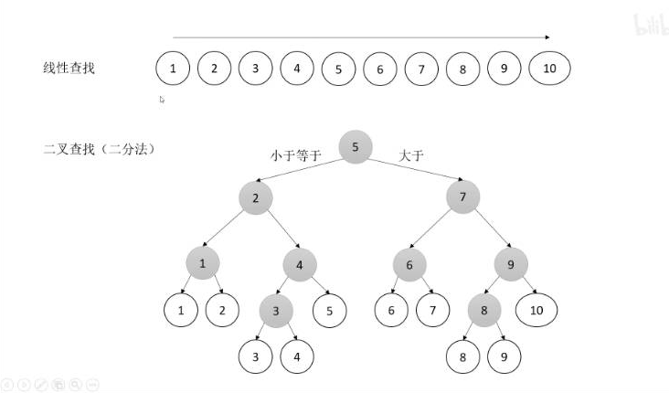
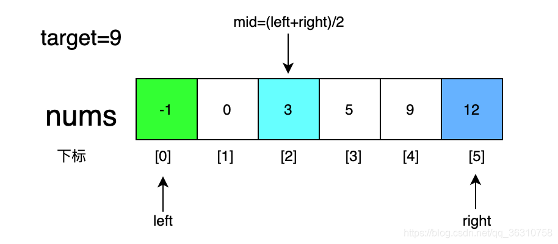
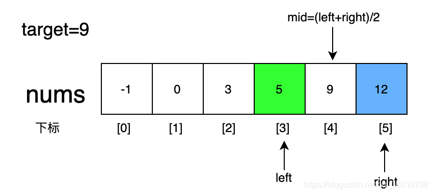
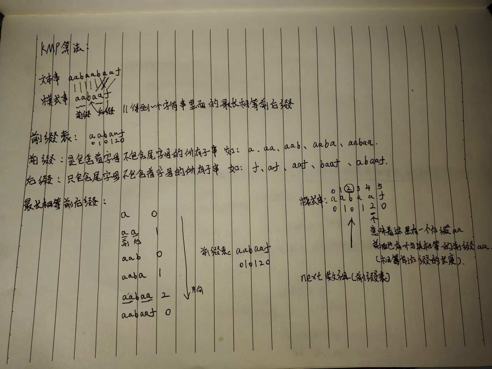
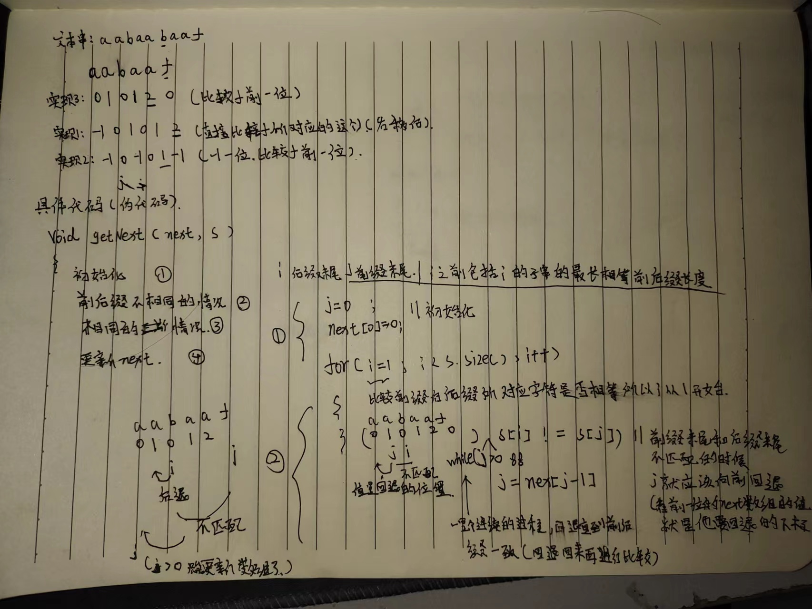
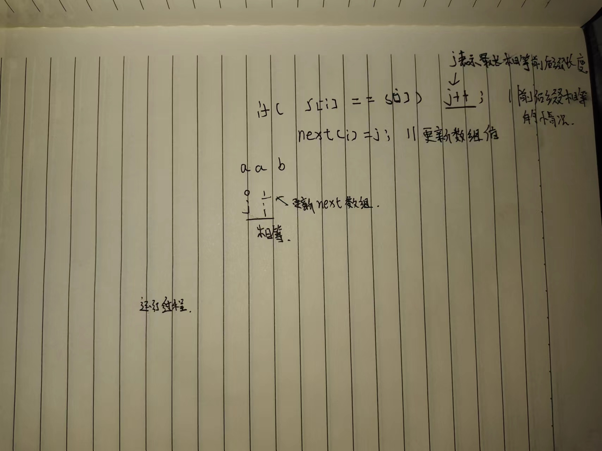

# 算法

## 摩尔投票法

原理:

**摩尔投票**是一种用来解决**绝对众数**问题的算法。

在一个集合中，如果一个元素的出现次数比其他所有元素的出现次数**之和**还多，那么就称它为这个集合的**绝对众数**。等价地说，绝对众数的出现次数大于总元素数的**一半**。

摩尔投票的过程非常简单

例如，5张选票分别投给1，3，3，2，3候选人，则：

| 轮数         | 1    | 2    | 3    | 4    | 5    |
| ------------ | ---- | ---- | ---- | ---- | ---- |
| m (候选人)   | 1    | 1    | 3    | 3    | 3    |
| cnt (得票数) | 1    | 0    | 1    | 0    | 1    |

**c++代码**

```c++
/*
根据多数元素出现的次数大于n/2且超过其它元素出现次数之和这一特点，进行统计

时间复杂度为：O(n)
空间复杂度为：O(1)
*/
int majorityElement(vector<int>& nums) {
	int k = 0, cand = 0;
	//成对抵销阶阶段coun
	for(auto num:nums){
		if(k == 0){
			cand = num;
			k = 1;
		}
		else{
			if(num == cand){
				++k;
			}
			else{
				--k;
			}
		}
	}
	//计数阶段 判断cand的个数是否超过一半
	k = 0;
	for(auto num:nums){
		if(num == cand){
			++k;
		}
	}
	if(k <= nums.size() / 2){
		cand = -1;//表示未超过一半 
	}
	return cand;
}                     
```

应用  :  摩尔投票法的一大应用就是求众数。


## 二分法





问题
给定一个 n 个元素有序的（升序）整型数组 nums 和一个目标值 target ，写一个函数搜索 nums 中的 target，如果目标值存在返回下标，否则返回 -1。

示例 :
输入: nums = [-1,0,3,5,9,12], target = 9
输出: 4
解释: 9 出现在 nums 中并且下标为 4

分析：
二分法题目都可以分下面三步

第一步确定是否满足二分法的使用条件，**有序数组与查找特定元素**，题目中nums有序，查找的是指定元素target，满足条件

第二步确定特定元素target的伪代码(这些不能运行的代码 但却能让程序员看明白的 就叫*伪代码*)，这题比较简单就是nums[mid]==target

第三步确定边界的变化，根据定义的第二句话，写出代码如下

```c++
if nums[mid] > target {	//当中间值大于目标值时在左半边，改变right值
			right = mid - 1	
		} else if nums[mid] < target {	//当中间值小于目标值时在右半边，改变left值
			left = mid + 1
		} else if nums[mid] == target {	//当目标值等于中间值时就找到那个元素了
			return mid
		}
}
```

整个过程如下



nums[mid]<target，因此target是在mid的右边区域，让left=mid+1，在mid右半边区域查找



nums[mid]==target，俩次就找到了这个数，时间复杂度为O(logn)

完整代码如下

```c++
int search(int nums[], target int) 
{
	int left = 0
	int right =  sizeof (arr) / sizeof (arr[0]);
    int mid = left + (right - left) / 2;
	while (nums[mid] != x)
    {
        if (nums[mid] > x)
            right = mid;
        else
        	left = mid;  // mid小于目标值所以更新left的位置
        mid = left + (right - left) / 2;;  //更新
    }
	return mid;
}
```


二分法问题做题可以按下面三步来：

1. 首先判断这题能不能用二分法解决，即有序性，target明确
2. 想好target条件，并写出伪代码（二分法的变化往往就在这）
3. 判断边界值的变化, 在草稿纸上写出核心代码再在IDE中写    

二分法都是在这套模板上变形，外层的for循环以及left和right的变动是帮助我们不断的缩小范围，当满足条件nums[mid] == target时就可以退出循环.

```c++
//找到目标值:
class Solution 
{
public:
    int searchInsert(vector<int> nums, int target)
    {
        int len = nums.size();
        int left = 0;
        int right = len;
               
        while (left < right)
        {
             int mid = left + (right - left) / 2;
             if (nums[mid] == target)
                 return mid;
             else if (nums[mid] > target)
                 right = mid;
             else
                 left = mid + 1;
        }
        return -1;
    }
};
```


在区间 nums[left..right] 里查找第 1 个大于等于 target 的元素的下标

```c++
class Solution 
{
public:
    int searchInsert(vector<int> nums, int target)
    {
        int len = nums.size();
        int left = 0;
        int right = len;
        // 在区间 nums[left..right] 里查找第 1 个大于等于 target 的元素的下标
        while (left < right) 
        { 
            int mid = left + (right - left) / 2;
            if (nums[mid] < target)  // 小于
            {
                // 下一轮搜索的区间是 [mid + 1..right]
                left = mid + 1;
            }
            else 
            {
                // 下一轮搜索的区间是 [left..mid]
                right = mid;    //  // 由于r指向的位置本身就不在候选区间里，所以r = mid，而不是mid-1，因为mid-1可能是答案，而r处的位置是取不到的
            }       
        }
        return left; 
    }
};
```

回答：看到 while (left < right) 不表示搜索区间为「左闭右开」，这一点没有根据。真正应该看边界如何设置，这一点完全是人为定义。

表示一个区间，最直接的表示就是左闭右闭区间。例如：我们想表示搜索的范围是 1, 2, 3, 4, 5, 6, 7, 8, 9 ，很自然地会表示成 [1..9] ，我们也会说这些数是 1 到 9 之间的数，包括 1 和 9。正常情况下，不会说：这些数在 1 到 10 之间，不包括 10；

只看到 while (left < right) 里的 < ，不能说明右边界不能取到。真正看区间表示应该看左右边界到底如何设置，**如果我们分析出下一轮搜索的范围是 [left..mid]  而设置 right = mid + 1，才表示搜索区间为「左闭右开」区间 。这是因**为 [left..right) = [left..mid + 1) = [left..mid] 。

可以看到，任何一个「左闭右开」区间都对应一个「左闭右闭」区间。我们已经可以确切地知道要搜索的数的右边界是什么， 没有必要把右边界再 +1+1。

重点：真正写对「二分查找」，从来不在于我们把区间写成了「左闭右开」还是「左闭右闭」，而是 在于我们能够根据题意：**得到某种单调性，和可以逐步缩小搜索规模的条件，进而准确地设计可以使得搜索区间缩小的条件。**


**这是因为 int mid = (left + right) / 2 在区间里有偶数个元素的时候，mid 只能取到位于左边的中间数，要想取到位于右边的中间数，就需要在括号里加 1。**

为什么要取右边中间数呢？这是因为在区间里 只有 22 个元素的时候，把 [left..right] 划分成 [left..mid - 1] 和 [mid..right] 这两个区间，int mid = (left + right) / 2 这种取法不能把搜索区间缩小。


**len的位置是有可能成为答案的，所以设置 right = len，**上面第一部分「参考代码 2」的写法，「参考代码 1」已经做了一次判断，在 len 不可能是答案的情况下，才设置 right = len - 1。这一点请不要扯上区间「左闭右开」和「左闭右闭」了，毫无关系。

```c++
class Solution 
{
public:
    int searchInsert(vector<int> nums, int target)
    {
        int len = nums.size();
        // 特殊判断
        if (nums[len - 1] < target) 
        {
            return len;
        }

        // 程序走到这里一定有 nums[len - 1] >= target，插入位置在区间 [0..len - 1]
        int left = 0;
        int right = len - 1;
        // 在区间 nums[left..right] 里查找第 1 个大于等于 target 的元素的下标
        while (left < right) {
            int mid = left + (right - left) / 2;
            if (nums[mid] < target){
                // 下一轮搜索的区间是 [mid + 1..right]
                left = mid + 1;
            } else {
                // 下一轮搜索的区间是 [left..mid]
                right = mid;
            }
        }
        return left;
    }
}
```


一个是**二分的区间边界不清楚**，另一个是**二分查找的结果不明确**。


## KMP算法


KMP的经典思想就是:**当出现字符串不匹配时，可以记录一部分之前已经匹配的文本内容，利用这些信息避免从头再去做匹配。**

KMP的经典思想就是:  当出现字符串不匹配时，可以记录一部分之前已经匹配的文本内容，利用这些信息避免从头再去做匹配。

此时如果输入的模式串为aabaaf，对应的next为 0 1 0 1 2 0，（其实这就是前缀表的数值了）。

那么用这样的next数组也可以用来做匹配，代码要有所改动。





实现代码如下：

```c++
class Solution {
public:
    void getNext(int * next, const string& s) 
    { //  前缀表实现
        // 初始化:
        int j = 0;
        next[0] = 0;
        for(int i = 1; i < s.size(); i++) 
        {//前缀和后缀不相等的情况:
            while (j > 0 && s[i] != s[j])
            {
                j = next[j - 1]; // 注意这里，是要找前一位的对应的回退位置了
            }
            if (s[i] == s[j]) // 前后缀相等的情况
            {
                j++;
            }
            next[i] = j;  // 更新next
        }
    }
    
    //实现 strStr() 函数。
//给你两个字符串 haystack 和 needle ，请你在 haystack 字符串中找出 needle 字符串出现的第一个位置（下标从 0 开始）。如果不存在，则返回  -1 
    // //匹配过程:
    int strStr(string haystack, string needle)
    {
        if (needle.size() == 0)
        {
            return 0;
        }
        
        int next[needle.size()];
        getNext(next, needle);  // 调用创建前缀表
        
        int j = 0;
        for (int i = 0; i < haystack.size(); i++)
        {
            while(j > 0 && haystack[i] != needle[j])  //主串
            {
                j = next[j - 1];  //next的表用来匹配失败的时候移动
        
            }
            if (haystack[i] == needle[j]) 
            {
                j++;
            }
            
            if (j == needle.size() )  // 子串匹配完成了
            {
                return (i - needle.size() + 1);   //子串到最后，匹配结束，返回主串的起始位置
                                                 // 理解: 下标加1 = 第几个元素,再- size 得到索引号
            }
        }
        return -1;
    }
};
```


我的理解是，kmp算法关键在于：在当前又
文本串和模式串检索的过程中，若出现了不
匹配，如何充分利用已经匹配的部分。


很简单一个道理，因为如果我算出了前缀和后缀是相等的话，那么我第一次在匹配前缀的时候，其实已经完成了后缀的部分匹配工作。
举个例子：原串aabaabaaf，模式串
aabaaf
一开始从第一个a匹配到第二个a的同时，实际上已经完成了从第四个a到第五个a的匹配过程，但是必须知道是模式串的前后缀部分相同，模式串第二个aa的匹配就可以省去了，就可以直接让原串的第二个b和模式串的b匹配成功了。
kmp算法在于next数组有点难敲。kmp的思相是很突易理解的


+ 
