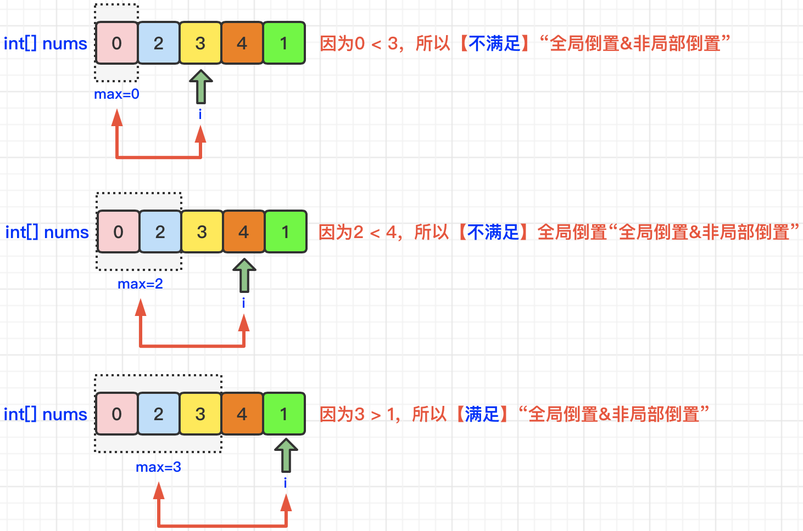
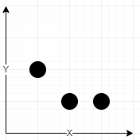

数组

**数组是存放在连续内存空间上的相同类型数据的集合。**

- **数组下标都是从0开始的。**
- **数组内存空间的地址是连续的**

**数组的元素是不能删的，只能覆盖。**

二维数组:


## 0. 常见的遍历形式

1.  **(n x m) 的所有坐标, 二维数组的遍历** 

```c++
#include <iostream>
#include <vector>
using namespace std;


int main ()
{
    // (n x m) 的所有坐标, 二维数组的遍历 
    int n = 5;
    int m = 5;  
    for (int i = 0; i < n; i++) 
    {
        for (int j = 0; j < m; j++)  // 每次循环的次数由外层的起始值决定
        {
            cout << "(" << i << "," << j << ")" << endl;
        }
        cout << "------" << endl;
    }

     return 0;
}
```


2. **每次循环的次数由外层的起始值决定**

```c++
#include <iostream>
#include <vector>
using namespace std;


int main ()
{
    // 每次循环的次数由外层的起始值决定
    int n = 5;
    for (int i = 0; i < n; i++) 
    {
        for (int j = 0; j < i; j++)
        {
            cout << "(" << i << "," << j << ")" << endl;
        }
        cout << "------" << endl;
    }
     return 0;
}
```


3. **[0, n)  的组合** 

```c++
#include <iostream>
#include <vector>
using namespace std;


int main ()
{

   // [0, n)  的组合 
    int n = 5;
    for (int i = 0; i < n; i++) 
    {
        for (int j = i; j < n; j++) 
        {
            cout << "(" << i << "," << j << ")" << endl;
        }
        cout << "------" << endl;
    }
     return 0;
}
```


4. **遍历数组中有三个元素组成的所有**

```c++
#include <iostream>
#include <vector>
using namespace std;


int main ()
{
    vector<vector<int>> points = {{0,0},{0,1},{1,0},{0,2},{2,0}};

       const int N = points.size();
        double res = 0;
        for (int i = 0; i < N - 2; i ++)   // 最多取到索引 N - 3
        {
            for (int j = i + 1; j < N - 1; j ++)   // 最多取到索引 N - 2, 从i + 1开始
            {
                for (int k = j + 1; k < N; k ++) 
                {
                    auto& point1 = points[i];
                    auto& point2 = points[j];
                    auto& point3 = points[k];
                    //
                    int x1 = point1[0], y1 = point1[1];
                    int x2 = point2[0], y2 = point2[1];
                    int x3 = point3[0], y3 = point3[1];
                    cout << x1 << y1 << " " ;
                    cout << x2 << y2  << " ";
                    cout << x3 << y3  << " \n" ;
                    cout << "--------------" << endl;

                }
            }
        }
     return 0;
}
```


例题: [812. 最大三角形面积](https://leetcode.cn/problems/largest-triangle-area/)

枚举


枚举三角形三个顶点并计算面积。

**三重 for循环，从题目给出的二维坐标中取出任意 3 个点**，根据上面的面积公式求组成的三角形面积。

```c++
class Solution {
public:
    double largestTriangleArea(vector<vector<int>>& points) {
        const int N = points.size();
        double res = 0;
        for (int i = 0; i < N - 2; i ++) 
        {
            for (int j = i + 1; j < N - 1; j ++) 
            {
                for (int k = j + 1; k < N; k ++) 
                {
                    // 找到3个点
                    auto& point1 = points[i];
                    auto& point2 = points[j];
                    auto& point3 = points[k];
                    //
                    int x1 = point1[0], y1 = point1[1];
                    int x2 = point2[0], y2 = point2[1];
                    int x3 = point3[0], y3 = point3[1];
                    res = max(res, 0.5 * abs(x1 * (y2 - y3) + x2 * (y3 - y1) + x3 * (y1 - y2)));
                }
            }
        }
        return res;
    }
};
```


5. ```
   2 0 0 0 2
   0 2 0 2 0
   // 所有2累加代码如下
   ```

```c++
for (int i = 0; i < n; i ++ )
    sum += mat[i][i] + mat[i][n - i - 1];  
```

6. 对后面的元素往前进行搬移

```
比如:
1,0,2,3,0,4,5 0  把0开始的元素往后移,在把0的位置赋值成9
1 9 0 2 3 0 4 5 
```

```c++
//往后搬
void moveElementsBack(int arr[], int start, int end) {
    for (int i = end; i > start; i--) {
        arr[i] = arr[i-1];
    }
    arr[start] = arr[end];  //开始位置赋个值
}

//往前搬
void moveElementsForward(int arr[], int start, int end) {
    for (int i = start; i < end; i++) {
        arr[i] = arr[i+1];
    }
    arr[end] = arr[start];
}
```

7. 先遍历列再遍历行

```c++
vector<string>& strs) 
    
const int rows = strs.size();
const int cols = strs[0].size();

for (int col = 0; col < cols; ++col) 
{//列
    for (int row = 1; row < rows; ++row) 
    {//行
       cout << strs[row][col];
    }
}
```


## 1. 比较相邻的元素的方式

==**前提:  数组至少有两个元素**==

从前往后 :

```c++
for (int i = 1; i  < A.size(); i++)   // A中只有1个元素是不会进入
{
    // 前一个元素
    A[i - 1];
    // 后一个元素
    A[i];
}
```

  从后往前 :

```c++
for (int i = A.size() - 2; i >= 0; i--)  
{
    // 前一个元素
    A[i + 1];
    // 后一个元素
    A[i];
    
}
```

## 2. 单个字符相减解释

总结:

+ **0-9 数字字符 - ‘0’ 就得到了该数字。反之 + '0'的数字**   

+ **字母字符  - 'a' + 1得到对应的小写的26个英语的编号(1开始) **

+ **字母字符  - 'A'  + 1得到对应到大写的26个英语的编号 (A : 1  ,  B: 2)**
+ 同中字符之间相减得到数字(相当于索引相减),如'd' - 'a' = 3 

+ 反之得编号

+ ==**数字 大写字母 小写字母   ASCII  48 65 97**==

+ 小写字母转大写  也可以直接用函数   toupper(s[i])

  ```c++
  for(char &c : str) 
  {
      if(c <= 'z' && c >= 'a')  // 去除小写字符
      {// 不是小写
          c = c - 'a' + 'A';
      }
  } 
  ```


例子:

```c++
string s = "abcd";
for (int i = 0; i < 4; i++)
{
    int a = s[i] - 'a' + 1;
    cout << a;
}
结果:
1234
    
--------------------------
    
string s = "ABCD";
for (int i = 0; i < 4; i++)
{
    int a = s[i] - 'A' + 1;
    cout << a;
}

结果:
1234
```

## 3. 数组个数设置

总结:

+ **数组---> A[直接size()]    // cahr数组的size() - 1 是本身的个数**
+ **n---> A[n + 1]     //因为要访问到n**
+ **根据题的条件 ----> 一般+1    // 因为要访问到最大的值**

## 4. 对数组下标的理解

![ A  B C D E     F 0             1            2           3           4           5 墨迹绘图 第四个元素,  此时长度为4. 减 1 =  索引号 长度为3   墨迹绘图 墨迹绘图 ](data:image/png;base64,iVBORw0KGgoAAAANSUhEUgAAAnMAAAEOCAIAAABthgbbAAAAAXNSR0IArs4c6QAAAARnQU1BAACxjwv8YQUAAAAJcEhZcwAAEnQAABJ0Ad5mH3gAAE3xSURBVHhe7d0HXFNX2wDwywxCQx0vtBZxoaAiKoqIoyq+CtXaFkdxVKsW8Xu1VbEVVKSCA1SwFUe1FdSqOOug1Yqr4FZcgIrKEgvFMgQFZCRhfOfecxIyIYEEMp7/z18858m8SbhPzr3PPVevtraWAgAAAICS6JP/AQAAAKAMkFkBAAAAZYLMCgAAACgTZFYAAABAmSCzAgAAAMoEmRUAAABQJsisAAAAgDJBZgUAAACUCTIrAC2n8nVubm5BKY90RTFX5r6uJF3dxrwZLfde8EoLlP389X72qnjCOpUvXxaRZqPAN7NBkFkBaClFZ+a1b9/ebV8m6Yvg3dnYt337PhsTuSTQ7IpuRSxH9t9/SwIt6dYa9FatuUV6qnUzuEePHtOPvCBdWtbRCcp+fmaJJhzNIl0xcj8hLz9fsSyZFN67tVVXnzNy3qsoITLkaKpo/mdeenN9GpoJZjcEQApe/rWwmTu7/nJoamcSUTrendU2g4JKZv12b8Owd0gMY7V+v03h0Qk2U6N7bLx97stOJMxHX21CN0rSbtzOLGNiCjLr4jK0uznpSFcUt6TfqPBsirL2vfI4dHj9N6blXd2++ew/pCMvp5kbJtuTNj1OKyyrJh0xt1e1nxDhferfNS4kIMbArJ0F24h0mihuid6o8KER6dfn2pAIlRE5rJv3DZ/Y2s2uJNJkUp5FiFxPWJl56tsx0/Z03P7w/FxbuRceP7R1UHxGoHNDdypPCv/voCW3KdewW8eXOrYlUealU0p9N7QNZFYARPHy7+1bMvWbQxkcmas9JRAkLil8YgvHHe/htqOA9MUI1mh4FcnEFNTgkpGXx2azS0tLrX1iEze78lersjTq1YisnRu/PHIskQIak1llvXbZd2laZqV/+n328crbpRTLZv7hiz9O6ML82KqTfHz5gXukLYb79OTmP9Ioh0nLxnUjIREiP3fQoHXT5MG+cZSNb8ydUPwtYF66XVjSs6V9mJsASSizAgAQbklqXMTCERYs8rdBr63JVUrGTYlwRc9i7ROT+ex84Mcfb76R/a+QzNMLLPC12clnl348L/oZuQIrqiAPkx4xFL3Kjzeer7PxYxSxW7BfehfZv8CuwSUjL49yCEuqSNlJPwfLNSKFS65VHW5JPllESae80ctAY1ZZ8kuU9/pifSTeIvxWo0QnjJuXk8d/VnwDlKwE5rmiD1H8LkKkPIsQqU+IVTyPWUG+pWyX4KuClyCKefjGkXjWwgdhzBfC5ZdUult8eibqqOyvQytAZgUAE6yK0Opq5RS6oZp1BzfrtJe1IFkVxvqgDhoVFpKry57tcmeyLh3BOU5WXpOy9hVbXUuuvfF96lky8vIET8pPs0IvUZWKU6+T3wCimN8IIj8i6iT8Q+7caDfW2dnZTTuciXtScp7kW12RHOVpTVl7nc5iPhrJG/AjFUUk+Ythfis4b7pHuoLfS5iUzxY9Z86tiNn2bHQF/S1dEfNc9D4imIUQun/ulW0o3f/2mHTrPP5NelxUYWx4+E3yBcCvzXUPebsUUHxlhQ39ZWLZhN4nIS0FmRUADK2K2Pazt8TRqytmtaSazPr0Fxc6V4Y94OcpOnWxbRadzyV9OrdtOSJIpXTqZbvvSi4jfSGSa9/cIx4i6zxFMys/rYrmUZz90erQ94KMAZLy4NenGLH80wii75Pkuyb2Vlc8PzkfZwjHIDJmlPws+BH8XWqQ2EKIPWFO4sng8cxT0p/DdPwtrRfztEIPKvkCCfEbCsj6SfDvRT96NF7PBgQZWxC4SWEO6I4MaU+oTSCzAoBVVNStrPDaUCWZld62diu5ghkl8VlZWZGWNDZWVjZMQzCoImSvzUlXSo7At5C6ZBXJEe7MeMjaRzyD1mVcz6jkhtbpKiFz/a8Uou8T06sbTdKJIkXwxkrJqjTZnwUzJpRiEp1lLFznka7YqLHu8QrOzMajVDRO5f/ykwN+w/YcnsZ8ddC3iNl+zJb8olnRjy4c53/NmEdoHKnfr3+OeLAoCx8felOy6j5KNQEVTABIwsWPaP2gsgqmm8E9vjpA2kKqil5kFHDQeu4D0XJhJu4k9nokq1zEI5JVMvgWEktW+eSg16dehzI4aGB6+mbwGEuJolFe/sWVQz4Jy+Cg7BpxctssJ8mbNE1O4oXkfNKWlLjVfdmfH288v6gfCUiSo+BZFtH3CX/6QoZGxM7+dZT3jSnrI2p3eB/LpncY/Pm774dCb0HDn4U4yc9GmNC9eXdCBvnlLghaOGVod/nLn5mHR5k1b2PQA7ov65tFvX2ZklMqHO8fdI4piZdVA5V+duOJR7Lqn17f2bMrrkDKYpXELek2aufQIxmLbnfQhcJinGABAELwz3W0fiD9ZiM59MGYuPjrkbxxUpgdGgcFxZOu2FiMhu8jHOLm3Y3wZAakFNt9i2AjdW1tJjPeER4o432LNJEtkk0Y3GDMIjT5UZrwcYm+T0xPuO7remoS87bR0JJLG7ZLfhaiEW5enthuasnPRpjk4ymIeXih+8t8QPEbNgTvcbALSyJ9UZLfLwbeEOwQlsTFz9eUJdMIMFMEAC0CT7Ij7k0xfUx+WTHpCuB4Q3h5mSkUZWvVjvQbwstPPuU3qONAZhjmvuVu+ulFgmMWKar6bVZKSkrW27ojTE16fXE08UHEdBsWJ+PQYteurS0nHn5BUZZDyRbNOmKbOmlMSKR6VmCoJbrGdTNZKRH8Eli2y4qTj0W3TnPzHp9cMUu8LFb64K+x/uM4xI1vaHczJoZG63eznh78opfYES4Cf/1Ez62BhR5KJVHqxeFP2r3X0S+mhPRlQeNMPjRgRYHwUaQrpyVx+IFkkvxm5RYrdkQ078ntGPT7YuyAniQgj5yTgQGPLHy2zOuj5A0d6ot8KQEAdfDv6iYMghqEj1xQjPjrkRiGMENW4YDkuEhkTFF4eiZTFENnDLE9q4iM4QdCJz0XNlq/ehyRUZYr+cTyj1Xoo5+20CWwbJeFUWKvi8mp9FMz+xxvNbkomBB9uVJevMwRHx++gSR8F3wtM2QTkPIsQjvfJXeL4gjLAu9zl27dDfJI5OGFXrCsF4jJ8bFg3Jsr6fKlmaeLUafwye0nYiNx/DQeRwT1eEhxrI9F3XdF7u+BRoMxKwAtoOTqsQNoVbvkENneyIcPN5U8ugTH68d7eGE/GrJ6uPQigQa1Hb/+4IoVMc9Tj85VaLepSZePQm7l5yQmbJ9iRUKiMjLukpaiXv3+Bdvc1nXxr//YTZ9rl7J2xnCHHkgHczwoM36v97RI1uyoWzn593bOc5H+7C1HOF8IpzIbz7UouTwKCDyZQyJSDVn5jO98iBMKeB0gXST9cig96h8a/BcJSLFyCPM4skkp6GWO/pEX796fuwrQd+zjgeZU2p6Jji6Ozn5xkvMkdrZ8j7SQjGPfhxc4rFs9Ud0+LVWCzApA8+Pd/+sYWkku+noa2d7IN8TxP+jq7gNJV2DqhmtoHTilI767NLzUfT4BjyiW17yxdWs1s9ZogHFjzfrd8c9yc3NfJF29kfmGXIVZTQoJ+Uh8+h75mHzQt2f968q+nep5vTL8Z9zitc52brOW/e+/1p3cvtu6devG5XM/6aZfiq5jSmNTC3Iub/3CNmVVb8shq6/ly7ORXA2Yu3oHOFCcaN/IO41+xb1mhMxkcaIXbopraKsyUlJWSFqEzdzrKN3v8nhfnMcuFJezmqjk0u5NKLHO9KK/Y91n7trpbpwRNlY4uVZXiS1f0ZnV39zQrQ3BNMisADS/hKsHOVSbjpyMC2JuJrxCV6fdJV2BuFsJDx8m3Iq7kCh10FP5JPITJ+84Dst154qxQuWxjtNCXFlU9u65Lj3bt2/fpd+ITTcaNc+worKSb1AUy4zViJWpkbNv/LPzv27YsHbluA+yzoTMmDLH95cXTsExqSWFj/cuGonLY9n2YyZaPgka7jRDfLZ4ddVr9kYv9FGsX1//sLU+bd0DwodSBeGzAqUME8UU5D7HjRdHptODfnkE38R3kenJr8t2cygLnzl4Gmkj2zmn70W4Uii5jl59C7+knJQ7zP8E7862BQcoj21LXRtXtK2xILMC0PzK3qBf/q8Pf+Mu7ssdKejqP5eRrqR9grIYvn/jI7/o3d/7fCnLxjfm+ByRKh4j27nnsx5fORWxDpcKrfMe3hyb5B7ej0GXYwc0vAVbUuXrF0nnI/0n9m5nbvuR/8M+IefolHrS/yOcUvEJzHILaxy+PbTWkco+NrWP+6YEOc/bomw3dy2KPJ/0Ur6zqZmPnrcz+OT9X5qwUdTI1mvPzqFUdvjYyZEN/KAozEFflKH2HalWHwzx8PD4b6fylJSUGrtxqC1hcLtcdGVKuV792y6Kzmzwe0RRDgHedWkSfcGOx/hYcxLWf3v8GYkJKTm/PSib6lgTv42UdSE//UVfw9R6BZ/NYG6mjZg9AgAAYbjKQlrxjnJITm+TfWNdX/SULBZdpiJ1ept7m5zR9b5XyEMgeE+ez0l6VldrzwihA2Zkw/eRa8kUuKmo5C30DkGHLcmkj0mvXIldYT9hQXgsvxTpn6ix9K0wUr+DS3fqw3IM4s+81zii1USiPQZ5q8VfPH1D550pqCl5A+l3qSPlWYTIvDd/tkm2e0Q9c3bgQ2MWXBBUTOG7Sd6Jm3c1yBE9nrVn3bRfUhVeoCezRgPWWLp2SQQ361oceVjuhQXCS4Vfhkwi32btAmNWABRSlHAwePmWi9lN2gZp0obs5GK000/75dNRAUks14jT4XThitm75BphbPrIDydbyRFPa8elZ9+kHp0rdMBMSyJDm6GLPpajkopXVZx8asfO+/ydglaeQaHObrPwCHtt6Fbajqg/zl9JPFQ3JX9RRS2Xy08DhTeDHKlXb94K7d97ENJRT89kyok80m8CegR9Nfq29KHVixdJ6NKMZYy7iPBBLfIdKKUIXn5mdgk9SryFfkqVnvfu33vBqUzpA+YUequBs0MnweZ4ZnDpa3lZ+E6Vmef8BnUcHvSkV9DVe1FT6jkPHS81cvInOwoo1sw930tu1zWyHjaSHIiU9Tf9lgi8N+UU+ZjqCP3CqgwdztyMdyekm4me+Re/K+ETUxOQWQFQxJ1t7jMCNvq4zYoSPjF246G1m//wbsODEiw9jzw8P7erIYlL4P39SGQPlggTk0YVISlf5ZOfJ08+wKGsfUM85Tm6FK+Je1oLiq7o3aznf90Q9H8j9a9E3DVyIhVcw/u+T/+wwD852pTH+fW0Gul/js4QbQcH3nyTull41qjigmyK4uS8bswZ23mlBS9y/0WNe/7uHcz1WrXt0m+ErNOT52c9Rpd9O9edwjeCPl054bRU9uelIF5p2uWtc3q3e2/mefrMgm3RT6kHEe5sTsbOiT17f7H1skR6vRP3K4eyGNfflvQZbV1D79zaMjJ/58SuloP9t/gPtuw6NizdccWFtPhA4emkJBTF+Y32jkMfqk9M+Pj6f76VvaHrBIwNDHBXTlkPz2ZwqNJDl5+QgOaDzAqAItp17I0PKzRvhQONVvny9sFF9NptfYLl9IgHiUfFBw0laTdI/RJyaOWy3ehph9hK5CspB//XQ/kjKQFe/rXVQ/rPp+uoIi4Fy3GudHSX5wk3KMqiXxehgzTo3xrM23I76+mzf6SVwfKq2PaDzG+vH9u1dbcvIu/lG4j+rsBlsQ6eQ+RJ7fSEHc/i76ah5j3/EZYmxuaWXaYfRT1OQcYrExs0fA4/eH6WrcX7XVEs5aVQ9REv9cFFlOfofZkCwodLyXOgVEO4ZWmXIxeNtLKgj0NK5lp0tyBTEJr0mns6/WqwC8qu9JQdlr0nhpx79pokWN6tP35C48svhjvifp22vedsOzCvE1V6e73P+tulVKfZe/euGGldT1bl5V/0cx4bnk2f++gSOT2rTEUXfwlNQZ/nCPu6HxsSDIzQHxDLSDj3duwzzoZFsaePlPt4MfWHB+gAADnRZxFtytlAuSWptw8GT8AnA2PZTBeZpEFk91p8EL1nqw7b/YDIXjl848aQa+cpfni5boqWicxTL3ufZ+Ye+sgOC4+wc4mZ9DbdzMRzW5i5ElleZ/Guu4rneIYIwdtSUcR/oyserKf33Qrvd+RPV4HeF5ETqjG7ai0WXJBvx6voe8i2snObtS7i1JXETLGPGO87Fp66gZnJXrA3WXK/qHikOPX67af0gtMy6Q266GrRKRXqkAkZCJbFiIVRt3Kk7FatexNoLNc9aWTme8pi5U3BAlQUoTc7YsUER7LHmj58KYJ/jld68gn+Qouey46bd3cLPkeDtA+14MyyCQvwZntsFnkhohNi6CjIrAA0J/6ZtOiVZYTkeUtEVsfC5ypFqz2xM3jybyx1vkCZ8Pm4lZpZC/5aQs5vhlLcBXy6UmkKY33J7YSwbHzJ+eqKr/jSeRat9QW/NcR+WghScB2UWXyZAhz+We+YlCR3XkWSd82mx6XS3l8R3JQjs/mZCWNbudUtruTpT/GnV3fuWCmzbln7XpEoB2KU3VjBn595PH28Uf2ZqiLnVtTCERZs5oy6BdHT6ReJPrbShIMBs9zILwAGesXoS1f3cPTJ6cJnuQndgobnnS67H0q/sYjobNJ18IxfotBPogYqoXQEnOsGgObFS70eW9F1RN8PpO0abegEKSJeHJn+UdCDmXsannqnDr4P/3Qm9ZJxWhxJvNRI92G7XfYfWtXQpBO80oLCsrp5iNGauPX7bQR3KXl46QF72Mi6x8i7un3z2X9wm93to+kzhK6rw8tPTuXY2jPbNEti5lpOoU69iByrHuVcwnJiw7ddyCUdtDyuHp+Ospe1f5P3cNMnwa3XNeKcQrz8U15T8wLO/8/WiP4Ev0m16TvMffrkL93H9u1R916Lqnz9IuVR4t1rF8/+8de7fn/tnWSFP9U+31asEjupTx1e9v24p8LzUbzbcaDsp9AxkFkBAECr8Hg8IyMFE7I0lZWValMbp2EgswIAAADKBLXBAAAAgDJBZgUAAACUCTIrAAAAoEyQWQEAAABlgswKAAAAKBNkVgAAAECZILMCAAAAygSZFQAAAFAmyKwAAACAMkFmBQAAAJQJMisAAACgTJBZAQAAAGWCzAoAAAAoE2RWAAAAQJkgswIAAADKBJkVAKA6la9zkdeVpAuAToDMCoD6yogcpqc3LDKDl31mQf/P9qbySFxz3FrTHllzi3SVjHl/9JbEkS4AagIyKwB1Kl8mnY8MXo4FR55PeqmawVZlaalCSdLIzIz16o+vRs84qoHJVV44TdYH/cYgt21Q3BJyH7lAbgbKpVdbW0uaAOi0ooSt00csPl9KugTbfcuVQ4sc25KuEpQ/iZrz0cxbk2ITN7s29LAo2XTzpiLSr8+14aVGujttaL/3/MFJNuRa9YHy2Khw0lbMUGbhmGbe1e2bz/7DNCW8vrNnV1yB0I0x5v254RNbu9mVRPiYV2ThOu8r5zYkIh1+YGmPAEDjQWYFgHHVz2REmLH97HU/+Hza9z0TqjLv1q7/zVp/u5RieRzJODXFityu6egc2cc7jnLdkxw7B+WJkrQbtzPLyJViEre6L0tfsH/rZ++hTkVFRatWrSjK0t6tn/JejjIkH19+4B5pi0o/u/HEI8ph0rJx3UhEVIdxS74ZTi9c/XAKVTSzStxekuxHAKAJUGYFANTG+rqGPSgkHYKbsnMo/VdiF5ZEIkpSeGGBBUWxXCNSuLW16RHMk8gP5YEGcbMu+DqyKJS+M0mkZcT6yPuK64XfI5QpSZ/AYWmPzjyvxO0lyX4EABoP9rMCwBgWfH6p+EZfI9sxs+kVb8rDrBIcUZK2Y9Ye9bHmxHlP/CkZR2QkATpBSFzV0PCqMvPUgp7d3cISOBTFra4mUdXJSbwg0900+hZpd0lXisQc5kFUgVf8hq5Mrs+bYu3dcQ1aDmwNBqAeeGMh5XEk99SUhrdZKqTkztHTRmO+cGzLPAfemUquqkNv1DwYFJ8f6EwCDeGlHp09btahDGP3Lf6tF684KscG0SZr/F5WmsiW2IyzwRFXxXZ10xq3n5W0GybtEQBoPBizAiAbL/9FKvrPol8XJadVxNx5CkqrpENDaYKUqhKkYrXgDX8nbPLxLacaKFfOurrtBDUpKjn/3KJB7UmsWXif+lfUs/NL+1IUy9E35imJSDjlTe7MV/L0SMBGaVBaJTdRhN2C/ecbsH+BHbkxAEqENy8BACQVnp7JQn8kFitvcklEFZhdfWg4lntl2zIRvz2uveKLXgB/L2B8kAVFOWxJxj3puFmpzytwU95djU3GPJHIrsrCBxGe1nRWvZBV985x864Gzwq+mlcXkbgjs4QWQfGkWyfz8DQ7O7tph8V2GsveS/pPAkqb11OLSVem4tTr6IYJ/5AuAEoBW4MBkK4oYdPkwb5xHGWXBvMVvXxp+sEHJmSTpoytwcx1A/G2yjurLQcF2cq/dVe+8tic2PBtF3JJRxR7uPfKcXI8183gHl8dmLnn2cohqFOZeW7NdM/1yUO2xO6f72RphG9S+eSg16dehzIom+mRf0TM6GXKREXuiLzYO6rLV3EzTxfvH2+OIw0Q2xpcX5W1nMy6uAztLt+TAyAbTrAAACEVz0/Ot6GHqyzHoJtiBcNKkhRmR7FH7H5aN2Yl46c6aCQluK6We3MlGs+NjZJ/dCXfmJUZJkrH8r1CbiSvp7+40O8aZe3ggoaYdazYKE+7LIy6KzRglYIZoStSiC02ZsXdJmmOMT7QfjBmBUAUf3jFoaw9o87t+6IXGlYqHzPauucTW7rZNYs/ZnWNo0dg5AYIyhihVV8bu93bmRI/PWOu5bioGWfzI8fKO6KS95BOJeLdCRu28JaTqy2bat9nVPfaq5sWBse9Rkl1xbFDqz7qYpB9Zunih5N/9v2QP5YVkfrzILv5d9zW/fndQEMSEiN+JK/YmJVXWlBYJqiFrrq/tvf4HR3X37owuzMJNczArJ0FW9qLA0AROMECABBuypHpeKxqM/8kf3+lKuQe8UDPMvM0vR+QGWnRx50yDTwAEzTJjtZ/osYqvL+32fazSlHxPCZ4PHonWTbTI27l8N/IwptB9DG2bPct0gav3AsL6FVSPST2wIqNWUUwb5lCg3wAlAVqgwEgmLmRptL7AuefTnu6Y0IXlQxWGXmXj0SjxOo5nB5/lr15RVF9O0sfV1nZOlHUzTDvJTHU2M3zB6v9aIpXmnYu5JNurbt67KG+in7+Jv3gXBd6ZzKj7eDA+LTT8y0vLx7Y7ZOtCUUkzOcSRGqGpWDKiG2t2uFbyuHFhd0xFOXczySZHDdbLxUeVAt0EsmwAOi4wlgfa/QHwXaPSFbhWBUrPj0TPZXHkVxBh9m5KG3MigetiOIFys28nzXzXMAERwv8Yilr1/8tIRXOy2a5kb2tCL3DlY+FfsEIlQ7XC79jEhNK1TNmxVfJS/qwF4BGgv2sANCebO1jv/iRhU9s+mZXVZeGlsTMtRy324nsAWVKfj+i62EL6L2GvU79u8aFyjn4mdPSIfT+w7yjE96fGs2aefrl/vFtqZLstLcW3QWDwHo1W20wgd9C3GZZ2HRuy+wsrSp6kVFgzp8av32fUT3/Q4fLn+1etPhYtsWSuOc/jnyHjtRLbIcqn4wwTXSfq2y3V7WfENG8e6OBDsAJFgDdRkY4cgxdCh9ErVsWLnycpqK4sT5oZMcvgaVrhMnIUnyYhV4NNyXClR4G8o9iZUawXmfLmE4Dmn0/a0XRv/8WVVQ8j7tGT4dMMAvFfxXcrMeP+XtYuXkXIqLk3T4g40DXesaschLe4Q2AssB+VgCQrGSmJjd8FJn+SAL/DJ53trnPCNjo4zYr6gUOKKzk0sGdHMpurlsfuvfwQmQK5eA5RDBgEprLaJVT6u6vvOM4KPoo8tIT9F/ev2kcysK6HT4cVBrewyPk9LLLf/oL9VMPheLe3jvKnfpYCpN39P854dW7p+uH44Ljy0lQWEbUrAG932vXe87Wy5mVRpZj5spbeM0rzi9QbDervPKyn6KUbWMJh7ACpSIZFgCdxozv6sMfF6XvYcaQLM/jzE5SxRWf9UIPQIZfuMMfkDKTMP32mGnT47vTXtbomTyOxG5xQPfwiS3GA1yyf1a6zD0S20UxFZ/0piLnVgQuq2a7iMyzJDpmzbsbtdCF2dfKshkfHJNaItfQHx/LK2Vs2tQxKzcpDL219b+jACiu5TMrtyQf/TovUk3RSEVOTpMO86c3b6nsxQHNRH9j8+XLCNJV5CSeY7aX4vU6Sp2SB4Zw8y4wBVXWPrHoG4wTsLXnQk8UU/op7ZoI5VR+tmS7rIgRPVaJnIdPdJu0eH4VuUvB9Z+XhR8kc2UwDq7At5WS/+TOrLlJF8mjXUnMpP+o//336e2DwW70e8zyOgvbgoFytXxmlftvg5uXp1iWTNxsz6JYM0/Lea/CBxHBR4T2D9HwSKbxP4kBkC0xlN4E7BCWJJGlM6OnM2nVS1A7S4bKiIonMVYY2RMsnFTxvkshUuc6rngew6RMiwUXRP5EmXG5BHIuWzHyrz1kHSvLsvGlf7sAoFQtXxtcT3VfncrMU9+Omban4/aH5+fayn1IH35o66D4jEDnhu5UnhT+30FLblOuYbeO152mE5+KqoEXB0Dj8FKPfnexyw9fS347edlnAndS81ePtxZcVZQQ+d3/Nr38bO9h/8Fip5FtaUWZzyrb9xAqWH4QPmj6z8VMs5PLzC8Xzxc9qY+QysykzHf79hS+lpd9P+7a9diH/5I+XVA8Ydwn/btLmRpJrrUHo+jp1XvZlVR51t3b6eQsde37jHIZOFjq4wLQNOqfWXn518I++3jl7VL68LfDF3+UOH4/+fjyA/dIWwz36cnNf6RRDpOWjetGQiKcZm6YbE/aghnYKRvfmDuhrszfOpNZ7cKSni1lqk0AAACABjEj15ZUz/YcenPRCHzouVhVhLAGa09kk3jWwgdhzEY3l19S6S4+PL05j1sAAACg6dT0qJvKl7cj5/S27Dp2/ZUCY3oHTv4tf+mTeBNCORKf5VJQYVnn8W/icYlhclvHpcdjwsNv/jmvO90tyH2OLo0NDOiOHCozz22Z7d7BnDlMw7zDoDmR9/J55DoAAAC6Qd0ya+XLpFP0rKNWg71/TebaTN8Sh5JqyEeKzOD6NvXIxo0bb+STbp38G9LjVOXr3DrcnlOmdOHidmZaKrq6WxsT3JWioFSQOXl3Vtt2HetzJKHbRHpGtxEmr+786j3QyS9OfHZUAAAA2kyd9rM6/Dmn6/hfmeoCtv3sddtXzRspT0Zl9oX67DmctzHoAd1nZlPjsK3sPhCbM+3ty5ScUuF4/6Bzh6Z25tcpNcrQulnR8o5OGXt/zok1/J8BvNSfXe3m36CPFTg15T0mBAAAQPupVQUT707IIL/cBUELpwxVoF6v6ZlVVg1U+tmNJx7Jqn96fWfPrrgCocwqCS8ae8WNkpAhJAQAAEDrMfsbW1JTZ1HBFUxC95f5gOI3bAg+Kk/Wcfn4aeqtbsIH5ql47hsAAADqpYX2s6JxJh8a1aGA7PlapePP4ipTWTHZE1qnuIxcJx/ek9sxFMUaO6AnCSim8snPPgEpFMvj/9ykn3gTAACAVmqhzMr6Dzldo52dDXNYDduKdBEcYVnYkL40/2GOxalHxIT24iZEkOvkwrv310EORXn+d4ARfZh5/FOphUgWbJFNzhlng5nZz2e7d7C0n3+v2+yoB4enWJErAQAA6AQydm05UjbeJtMTkEudTVUa6VuDhc4YwnfKW/yJ6kHmAGemKk3dPYIlMQua1I3O/LNUY2wrt4VRD2DqNAAA0ClqeTxrrxkhM1mc6IWb4uQ471VJWSFpETZzr6MF2+XxvjiPXSgu5zSFJZd2byqgqJleY9+jqO4zd+10N84IG+ssdAhNdZWUI1WHh1Yyb2ttRdHTuJAhJRe2zRjsHHIHjmkFAADdoZ4zRbR1DwgfShWEzwps+GBQPJsD8uLI9B5yCr6J7yLTk1+X7eZQFj5zhjOnbTSynXP6XoQrhZLr6NW38EvKSbnD/C+dSZseI1ecvh7mQHEyVq4/mUfCAAAAtJ56ZlaUyrz27BxKZYePnRyZWv+IrzAnlaKG2nekWn0wxMPD47+dylNSUmrsxqG2hMHtctGVKeV69R8mW3Rmg98jinII8HYVnA/ZyHbu8Rgfa07C+m+PPyOxhhj1cfuSrg6OuZ+CAwAAAHQA3njZgmQeJEPOTkWx3SOSZZ8gFR8as+CCYE5hfDfJO3HzrgY5osez9hQ/VZyYwgsL6D2szImmxXCzrsWRh8VnpWpgSmFurA+9BDDxMAAA6BD1HLPy8jOzS+hR4q0wV1bpee/+vRecyqwkV4pKuR9DUc4OnQQTSzCDS1/Ly8J3qsw85zeo4/CgJ72Crt6LmlLPeeh4qZGTP9lRQLFm7vm+bsDKZ2Q9bGQvPN7N+juJ+V/gxd7PBvufE36VlU92r93JQWNfzyGy5pIAAACgfUiGbTkiY1ZuSWrcltn27LphXkVyhDubfqEsZhJh8cFrfBAaX1oExZOuQOGDLczd2C4rwpnTK9OtC/zTSMtSGOtDn3CasvZp8GTIErNA5B73pMenLAvHCQuWLVu2YAJaCrov9YTNAAAAtJa6ZNYFp1PjIhaSU8ah9DQ7Opdcz2zHDWaSI8K2nxAc87SIJFh8aAzLJ1Yyd6EcHT2vE74T0mn28acl9WY4bt4FXxsmN8qRC/lbjEVSesXzuIgVE5yt8EtlWdi4LYy6K+PUdwAAALRVi88bzLsVYDUkuID0WBYj5m3esHySywfiNUaVmefWTPdcf5uZsB9lvz2PY+e0OjrBZmq0+cqbOesG4w28la9fpNy5dPSXHZFnEwo4dCKevc6n/Un/H6/QPZTsRoyb87nHhwP72XZ8//02gufg5d/b+eWoxedLKZZjUNylwMHMac/5Xv25fN5ZypbkdiT3yo599AtxCEu6v7SP3BMcS1X84Wh0yT64V78jM1wGqtG7d290+fjxY9wFKlIRvh1dtvL5BncB0FE4wbaYshsrcEJh2YwPjkmtf1hZW5FzKwoNbNnMqLIgejopDypNOBgwy82ODBZp9BwNEXF1D1eRk3gyfJab0C1oeMhZdj+UrmxC2O5bpM7rgLf8imLZTG+gEko+hR1tCzt0e+vrT/pABZ4/J0dmpaWlkRBQgcr9h9CXuSxgNekDoKta/lw3vIebPgluvW7bLKf6zmwuDS//lNfUvIDz/7M1os8q802qTd9h7tMnf+k+tm+PuvGoKHpQ+yjx7rWLZ//4612/v/ZOsmKqltz7fFux6s/ffaWfXZ2XfT/uqfB8FO92HCj7KRRTGbG3fE0IarD3RRiNGomDQLmysrI6daJ3DTx79szOTvJnElCCqvi7JZOnGw50Mj92gDI0JFEAdFLLZ9Ym4fF4RkZN2xzLqKysNDFRSqZshJLPPq96kGjYv5/577+REFCqnJycDh06oEZycnKvXr1wEChR7ZtilFar09LNz5w0dLAnUQB0lZrOFCEvpaRVpOXSKtJq8dfoEiVXNH7FEaBcBgYGuFFdXY0bQLnK14RUp6S+szkU0ioASAuMWR0cHNBldHQ07moBG5umHq9a5reSc/gYpa/f+tolKGVSuoKCAktLS9RISEjo168fDgJlqfwlsnzdRpOv/890+VISAkC3NXdmzcjI6NatG+loi65du6LlIp1GqcnKfvPhaKqmhjXN0yw0mESBkhQVFbVr1w417t27N2DAABwESsGLu1L65Vwj1xHs/ZEkBIDOa+6twWh4Z28P24vEoXGqacBy1EAjV17sZRwEygJbg1WkJudl2fLv9dq0Nl0dQEIAgJaqYGriCE/dNH1rMAalTCry9u1bNps+4urmzZuDBw/GQdB0b72/5p678E7kDmP3MSQEAND42uAmcHFxef36dUqKGp2GBo1WS2fRp2c3XeVv4j0HB0HTVVRUmJqaosbVq1c//PBDHARNVPHj1orN21r5fdtq4XwSAgAwNLw2uLGysrLi4+NTU1PVKrMajRrJmuaJGuXrNtRkZeMgaDrYGqx03DMxKK0af/IxpFUAJOloZh0zRk03XrX65n+Uvj5VU1Ox/WcSAk0GmVW5qtPSy5Yu1+/U0TTQn4QAAEJ0MbOioSqC28XFxbihJqCUSRUgsypXeeDa2rJys/Vr9N+jj2UCAIjR0TGrwLBhw0hLbZh4zzHsTx9zWbHlJxwBTWdsbIwuIbM2Xfm6jbxrN02DAow+pM9SBQCQpOuZlcfjCcav6gNmZVI6Fos+60JVVRXugsbhHDtR+Uska+rnJl6zSAgAIEHXM6t6glImpYMxa9NVJT4s+265oYO9aeBKEgIASKOLmXXixImkpcaglEm5ILM2UW1FRXnAatQwXRuo944ZDgIApNK5zJqenp6cnIwa+FTYagtKmZQLZ1bYGtxo5atDqpIemm1abzjAkYQAADLo7tbgP/74g7TUFZQyKRGMWZuicu9+zsEjJt5fsaZMJiEAgGw6l1k//fRT0tIEUMqkLDBmbTTejVvlq9YaDXExXbWChAAA9dKtzNqrV6+nT5+iRt++ffX09HBQnUEpk7LgM/nCmFVRNa8Ky/0D9UxMYM59AOSnQ5k1MzMTp1UHB4fExEQcRCZNmkRaaglKmZQCxqyNUx60rvp5ptkP6w162JEQAKAhOpRZP//8c9w4efIkuuzcuTM+n93jx4/T09OZa9QRlDIpBYxZG6Hyp1+4v59ptfhr40/HkxAAQA66klmTkpLu37+PGjY2NoJTr58+fRo31G2OQzFQytR0OLPCmFV+3AuXyjdsMnYb3WqpDwkBAOSjK5nVy8sLXaLVq/DwtEuXLnjYOmuWuk8oA6VMTQRbgxVS83dW+bLv9S0tYM59ABpBJzJrVlYWHrBev34dRwT27duHLpOTk9X88FYoZWoiGLMqpCxoXc2rV2Ybg/U7WpMQAEBuOpFZR4wYgRvvvvsubggMGDAA51SUXB0cHHBQPUEpU1PAflb5VYT+yLsUZ+rvZzTalYQAAIpQeWZ90RByO9VISEhA+RI/S/fu3e3spNQ3Pnr0SFDKpOrX0xRQytQUsDVYTtzo0xXbdrImeZjM9yYhAICC9Gpra0lTSTIzM0mLmaFX+PgWqXr06BEVFYXGjqSvPOiV9O/f/82bN6iNcidKnDguKTU1FSddlH3V8NQ3AmiJ3pm/2CD5abV9z7c7t5CoIrp06UJaOuaLL744dOhQUFBQYGAgCQEJ1U+eFX88waBzR/Pjh/XatSVRAICiUGZVokbvrUR3vH//froQ8oiNhXIqeWiKunPnDonK1rlzZ3zjZ8+ekZAaIO9Fevrdu3dtbW3RyxtjYlrYoRv6N/+d1vgFKwS/z+TRdQkuUgsICCB9IKm6unjSNPTV4t68TSIAgEZR2pgVrf3RCPXRo0ekz4fygeDgFkmlpaUjRowoKysjfSFolBkdHY0agoNk5JeQkCDIrD179nzy5Alu1yMrK6tTp06oobphK3qLSEsOxcXFY8aMef36NekLCW9jOdPMvIaiBub+/aKKR6Jyc3BwwEf0CmvEm6xZvL29IyMjly1btmHDBhICosqD1lXu3mcWHMT68gsSAgA0inIyq6Ojo2CrryAjYvKssu/duzdz5kw0WCR9UWg0eeTIkUGDBpF+Q9AzZmRkoIaxsXFycrL8OcPJyQmXEMfHxzs7O+Ngg+RJw2/fvh05ciT6GUH6jcJmsy9fvmxubm7wb+67M7yomhrOxx+VLV1MrpbDmzdvBg4cSDqiULp9+PAh6Wij+fPn//zzz999992mTZtICAjhHDpatiyANXO6WQh9qjgAQFM0NbOmpKR89NFHgsIfOQeIUuF0iHl4eIjtFrWxsfnzzz9JRzaUPFxcXFAD3f7w4cOyEoksAwYMePDggfzPNXXqVNUVPbVp0+bixYutW5OtvuhV4QZSGbG3fE0IarD3RRiNGomD8hDMnCxJod8TGmfRokXbtm1bvHhxeHg4CQG+qrv3SyZONezfz/y3g+gHKYkCABqrSZnV1tY2LS0Nt7t3737+/HklFsjgSqiSkhIvLy88lJQfSpBoHEw6ikhKSurXj57tSOnQ+3Po0KF27dqRvhzqfzNLPvu86kEivTb8/TcSko9wiRmGBqx4g3ynTp3UuTq6Kb799tvNmzcvWLDgp59gHisRtW/flkyaVv3kmfmfJw37qPWBZwBoisZnVuEtwE5OTnfv3sVtVcBDSdJpSP/+/ffs2dO3b1/SV1AjnkvyMFlJggopZeHFXi6dRR8XYbrK38R7Dg42Dvocx44dm5ubi9roF4kq6rRbnJ+fX1hY2Lx583755RcSAoyypSs4R4+bbQ5lTZ5AQgCApmlkZhWkHzRsvXjxYseOHXFcdbKyskirIU1/Mc35XE1R5reSc/gYpa/f+tqlps+Vg0aueAt87969o6OjhTc+awF/f//169fPmTMH/RIiIcDfrWAy39vU34+EAABN1pjMKqj0QWk1JSUFB0Hzq8nKfvPhaKqmhjXN0yw0mEQbC32mwnXarVu3jo2NdXR0xF1NFxgYuGbNmpkzZ+7fv5+EdB7vyrXSGV8ZjfiQHQW/NgBQJoXnYBLMwdu9e3dIqy1LubMyDRgw4O3bt3g6KuTNmzdfffWVOs+boRBDQ0N0yeMpfJCStqrJzStb/r0em20atBJHAADK0vjZDes5ShU0G6WfYA6frfbOnTuonZiYaGdn161bN0UryNQQZFYx5auDa/7JMdu03qCbVm32B0AdKJZZHRwc8HQKQH0o/QRzNjY2AwcO7N69O+5mZGSMGTMGtzUXZFZh6HcY90xMq6U+xuPcSQgAoDwKZFY0lBEcY9qhQweps9uD5qeiE8ylpqZmZmbig5dev36t6TtcDQwM0CVkVoR79nzFpnDj8WPxbzIAgNLJm1n79esnGMQ8e/YsOxtOEapGVHSCuc6dOw8YMADPV5yYmNi2bVvN3SwMY1asOj2jzNdfv4OV6So4pTkAqiJXZn3w4EFSUhJu29vbw2hV3aj0BHMpKSk4uaKRq6enp0KzH6sPyKxYeVBwbUmJ2Ya1+u3fJyEAgLLJlVlnz56NLk1NTdPS0uo5FxtoQUovZRKGkiveLPz8+fPu3bvjRKtZILMi5SGhvCvX0GjVaMSHJAQAUIEGMisarZqbm+Mz2Fy5ckXrz4ii0ZReyiRswIABTk5OuI1+YGncyBXvZ+VwOLirgzjHT1XujGBNmdzEGbsAAA2qL7O+ePFCcIaWHj16CFasQD2pqJRJ4O7du2jMituTJ08W7CDQCHjMyuVycVfXVD18VLbEz6BXD9NA2L0KgMrJzKx9+vTp0qULTqtolSrrBClAraiolEkAfSXQbyzUQGnV1dUVBzWCTtcG83jlq9ai/83WBemx2TgGAFAd6Zk1IyNDcA7z3r17w2hVU6i0lAlDv7Hi4+NR4/Xr1wkJCcLn/lNnujxmLQtcV3U/wWzjOsOBWniuBQDUkJTM6ujoKNifmpKSIkixQCOotJQJc3Z2NmbO4tm/f3/0VdGIgiY8ZtXBzMrZf5Bz4JCJ1yzW9CkkBABQMfHMKnxuOHt7e02sAgUqLWXCrl+/Lji+OS0tTf2nF9bNzMq7FV+2Mshw0EA4ehWA5iSSWbOysnBaRQlVeMYloFlUXcqEDBw4EGVTQYWwHQO31ZMObg2uff2mfGUQWnKz1d/Te98BAM2l7u9NeE7gP/74Q8tOz6lrVF3KhKEvieA06SjRorb6FAyPHz9+4cKFpCNtzFpSUmJubr5x40bS1zrlq4Or09Lf2RxqYN+ThAAAzYJkVpgTWMs0QykTdu/evczMTLxl+MGDB6NHj8anxG9ZhYWFf/755/bt26Ojo3FE8njWb7/9trS0VFtP2VS5M4JzIrrVwvnGHp+QEACgudCZFeYE1krNUMqEde7cGQ1Yb9++jRqvXr1CI1f0ywzP2dRS2rVr5+XlhRrr1q3DEbw1uLq6uqamBjUSExN3796NGkuXLqWv1i68S3HlIaFGo11b+X1LQgCAZqTv6OgIcwJrq2YoZRIYNGjQb7/91rp1a9RGiXbEiBE43lIWLFiALu/fv3/s2DHUwGNWBCVXdInTav/+/T08PJiw9qjJyi5bHqDXrq1pIJzSHICWoY9Llnr06AFzAmufZihlEubk5PT69Wt8Ppzy8vKWnQERZc358+ejxpo1a9ClcGZNTk7evn07ai9btgwHtUn5mvU1eflmocEGneFUygC0DLKf9ffff4c5gbVS85QyCWvTpg1ufPzxx7jRUnBmRXn04MGDwpl17156BG9ra/v555/joNao2BTOPX/RdPlSY7fRJAQAaHZQi6/lmq2USaBLly79+tH7d1NTU1t2hiYHB4clS5agxqpVq2pra3EwJSXlhx9+QI2AgAA9PT0c1A7cP85UbPnJ+LPxJl//HwkBAFqCvr29fadOnWBGCC3WbKVMAsePH8eNyZMn40ZL8fb2RpfPnz+/ePEijhw6dAhddujQYcoUrZqTqPpZStlSf4OuXUyDYPcqAC1MT/BbHmgxNFotnUXnGNNV/s1zEjE7Ozs0ZkWN/v374z2vLWX58uUbN25s165dYWEhCVFUZGQkLh7WGqVTZvJu3mYf3mc0bAgJAQBaCGRWXVHmt5Jz+Bilr9/62iX9jtYkqkq2trZpaWmokZmZ2blzZxxsfunp6YKDyrA2bdpkZ2ebmZmRvuYrX7O+MmKP6ZrvTeZ8SUIAgJYD+1l1RfOXMqExK0pp/fr1a8G0inTr1m3VqlWkwwgODtamtMo5ehylVdYXUyGtAqAmYMyqQyoj9pavCUEN9r4Io1EjcVAX/P3334LsbmhomJ+fLyhg1nRV9xNKPDwN+/Zh/xal16oViQIAWlRdZg3buB43gBb75Phpy9yC/PctTk/WrUnvTv/557VrN1Djv6Nc3d3G4KCmM+LyPj4V067gFfo00WdKoqAhvstWkBYAKoIyKxK6IQQ3tIn2LVTTl4j7V1xhh27oX8WuPSTUoprtM8rJyTEyMjI2Ns7NzSUh1WjOb91bX3/0UVYePU76qgF/RwAoCvaz6pZmnpVJfXzwwQdcLpfD4bz33nskpOEqd+/jHD5m8n9zWZ6TSAgAoB4gs+qc5i9lAkrHu3ajPGid0YdDTAO0cIJGADQdZFad0/yzMgHlqsnLL/cP1DMzNQ0KICEAgDqBzKqLmn9WJqBE5WvWV7/42yxsvYGtyHG6AAA1AZlVRzXnCeaAElVs28n940yrJQuNPxlHQgAANQOZVUfpbCmTRuOev1gR+qPxR26tvl1EQgAA9QOZVXdBKZNmqc58Uebrr/9Be9NAfxICAKglyKy6C0qZNEt5UHDt6zdm69fod7AiIQCAWoLMqtOglElTVGz8Af36MQ1YplPTUgKgoSCz6jooZVJ/3JO/V2z/mfX5RJP/m0tCAAA11vjMyrvqZ66HdFx9h0dCmuFF1Ecm9AvnM7Hs5r4o8nq2Zi2FFLz85FMhEwd1YD4WerEGTfQ/ePtlJblaBvUsZRL/kPTMO/Rwn73lXFqpxn5MN/3xByOmx6aH5AYyVD1KfrvEz8DO1nSVdu1elfiMGSZ+V8n1AGiuRmdW3vVTW0vpRvZPf9zTqLVddeVbDkU5TFqGLRhnmX9hm/eH3T2P5pBbaKKiW6sHdew9ceXZTMvRC+jl8hpmnnl2/YzBnlEZ5CYyqWEpk9iHtGzWYJOiK/t8xtpa9PS7mK+R2ZVTgf5eLFznkSXi+8a53tkWq6rKA9ehj8ZsXaBe63dJUDuIf8bY9yNhJzLQAnj6YIWnqC4+68WiWF6+PhYUxfKJ5ZKwWpGxUOkRQ9Fy+8SSLlIY60OfCdwiKJ4E1JWsj4mbEuHKQh+EY9DVPOGPgpv3+OSRK/LMQF+xaw+eqZ/7VxwJNQtZSyT5IaHX+PykF3PGduugeLX8wjFk/inF+qCXPjQinXTlU/b9GnrO/f2HSL8lKLxykJO0z7h5qGqJAOBr5Ji15MaJKA5rxqSAaV9bUJydBy+VkCs0UlvXOYvsKKogMTOPRDRLyaXQb+I41NDtvwV+aGlEgjQjS/sJU4bLMwO9JpQymXSZsPMS/RMiO2juzickqM04Bw5X7t1vMnsma+Y0EgIAaILGZdaSq4d304l1qLnzBD87ihN14oZGp1aqsqwIXXa21MjToOTF7NrNoVg+a2fZkEijaEIpk5HtrB+C0I+gRzvONrB3UuNVxd8t819lONAJjl4FQOM0KrPmxew+QDGJlaL6uM1FqXX34asanFqLLu77qYCy8Pl0AAloFN7Dq9HoP8//DhAeripOM2ZlMnIcNc2ColLO3n9BItqo9k1x2fdrKH1909UrKUNDEgUAaIjGZNacS/ui+YmVpFbqwDENS61//bQc+3pi785uu82nR11e78oskKbJ+jsJXToPsW36q9eIWZnaWdmiy8dZ+birWVIPhZLvHXbkodRqrPI1IdVPn5n9uNHQoTcJaSvBHyIh4x0BQKM0IrPmXD4YU5dYBal1d4xG7aR8dGIjtuNUcinFyTgRGByVQG8S1lBGhgak1QQaNCtTwZsy0tIoBXG7yPcOO/pU8jtXuWs357eTJl//H2uSBwlpMcEfIiHtHQFA0yieWcUTK0qt4xY4UFT0vkuadNRKXUkityTrVoSnZcYh78FeGn3gjVJoyqxMznYaeXCGeG3wqSliu/Z5cVfK124wch1hunwpCWk38dpgiXcEAA2kcGbNiNkZQ1EdCy6GkK03yH7m2O6Yg5c1Mi8Zsa1d5kYdXWlBcaKDT2hezek7bAt0eSPhubK2oql5KVNhTiq6/KCNdh3cyajJeVm2/Hu9Nq1Ng1biCABAEymaWZ/8ufUG+i/tj81k4w3jxCP6OpRzG5yUQF0ZDf7vF+i/Rxp43M17PYfaof9+u6KsCTvUu5Tp4dXDBWjs97GTFg5tylcH17z81yw02KBrFxICAGggBTPrk0uRKInOPF1MNt0IJIWhtfuNrX9q7GGGefl0ralFazPc1SR4a3zBpp3nlbaHSm1LmYrObApIoaix88c26QgjdVSxeRs35kIrvyXGH7mREABAMymWWR+e3UEnVs/hEmWoeO3+KPKSZqbWorgNvtEosc5zcyQRTdJrxg8LLCjOgcmTN90TmfmPV5p2LvJsIzYkqGUpU2XmOb/Rkw9wWK4R4Z5aNgUe90xMxY9bjT/5uNXCBSQEANBYCmXWhxci0XhBWmJFa/fRczUqtQoV+9PH3YwKz2bZ+B79dnDTjgltIW3H/HA5wp3NifMd2NGq/8Sv8VIN6tDO3HbsN43c+60OpUx1H9Js926WrbuODUswdgmOOz7XViM/JkT8qJvly4PPZlSnpZctXa7fqSNMCgGAlsAbc+WaSPN+sDVFsbzOSmwKxpK3oNSq8MSoKiRjoTIPuLPwsvOxrdxmhcc8ryA3UF/1fkz0JMHBE5yt2PyFskNLdTIxp/GLxf0rDk8mXLFrDwkpm6wlEv+QWBY2zhNWRMSp/4ck8zO6sYJ8MqJYvldKps2iZ2y+co3cUs3ItXJohMw9rszik24zUtUSAcCnyJi1v39WbW1l5FgZMxL0WvQQPeD1ueq+A6zzjHOVeOH5Sv45/+vij7qYkBtoKHqSYP+T8f+U8BfqGVqqCX0/aPxitWApk/iHVJmfHn8yZO5IDf6QhoSQT0ZU0bu3eNdumAYFGA0fRm6pIzrPiUUfbOhw0gVAiyhaGwx0i0bMyqS5OL+drPw5kjX1cxOvWSQEANB8kFlBfTRoViaNU5X4sOzbZYYO9qaBcPQqAFoFMitogKbMyqRZaisqygNWo4bpmlV672jgsV4AANkgs4KGacIJ5jRM+ZqQqqSHZmEhhk79SQgAoC0gs4KGacYJ5jRH5a8HOFFHTLznsKZ+TkIAAC0CmRXIBUqZlIV341b592uMhriYroKjVwHQTpBZgVyglEkpal4VlvsH6pmYmK4OICEAgNaBzArkBaVMTVe+Orj6eabZD+sNetCnUQAAaCXIrEABUMrUFJU7dnGjT7datMD40/EkBADQRpBZgQKglKnRuBf/Kl8fZuw2upXvEhICAGgpyKxAMVDK1Ag1f2eV+wXoW1rAnPsA6ALIrEAxUMrUCGVB62pevTLbsA69eyQEANBekFmBwqCUSSEVoZt5l+JMV/gajRlFQgAArQaZFTQGlDLJifv7mYptO4wnfGqyYB4JAQC0HWRW0BhQyiSP6ifP3vr4GnTragZz7gOgSyCzgkaCUqYG1NSUrVpDVVWZhqzRa9eWBAEAOgAyK2gkKGWqX/na9VXxd03XBRoNHkRCAADdAJkVNB6UMsmCfm1URv7KmjnNZNYMEgIA6AzIrKBJoJRJUtXd+2V+K9FvDrMgmBwYAF0EmRU0CZQyiTHi8coCglDDdO0qytgYBwEAOgUyK2gqKGUS5nL1dvWTZ2Y/bjTs40BCAAAdA5kVNBWUMglURv5q+zTN5H9zWZ9PJCEAgO6BzAqUAEqZEN6Va+Wrg3OsrUxXLiMhAIBOgswKlEPHS5lqcvPKln+vx2bfHg7H2ACg6yCzAuXQ8VImNFqt+SfHbNP6N21akxAAQFdBZgVKo7OlTBVbd3DPxLT6brHxOHcSAgDoMMisQGl0s5SJG3OhImwzyqmtfL4hIQCAboPMCpRJ10qZqtOfly1dod/ByhQmhQAA8EFmBUqmU6VM5UHraktKzDas1W//PgkBAHQeZFagZLpTylQeEsq7cs101QqjER+SEAAAQGYFqqALpUycE9GVOyNYnpNMvL8iIQAAYEBmBcqn9aVMVQ8flfn4GvTqYRoEpzQHAIiDzApUQptLmXi88lVr0f9m64L02GwcAwAAAcisQFW0tZSpLHBd1f0Es43rDAcOICEAABACmRWoiqaXMuFNvqTDxzlwCP0z+epL1vQpJAQAAKIgswIV0uhSJu6xk5wT0bVv35I+yrW375T5Bxo6O5kGwu5VAIBMkFmBCml0KVPV42SDXj303nkHd2tfv0FplTI0NFuziv65AAAAMsAKAqiWppYy8XhV9xMMHXqTLjPnfnVa+jubQw3se5IQAABIo1dbW4tbYRvX4wYAymX9d7bb6YuoET9s0ON+9jio5toVvPI4+sftYYOSmRfc58GjgTfvJjn1vecCVUvawHfZCtICQAXqMisAqlPmt5Jz+Bilr9/62iX9jtYkqsY4J6LLfHzZUXuMRnzI++ty6Wxvo/+OZP8aQa4GAADZYGswaA4aV8pUnZqGLg162NX8k1O2bKVeu7Yw5z4AQE6QWUFz0LhSpurkp/odrPTfsywPCq7JyzcLDTbo3AnFUbvix61FXXqWLYXNiQAA6SCzgmaiWaVMVQlJhv36VGwK556/aLp8qbHb6JqclxWhP75xGlqxeZvREBfjz8aTmwIAgCjIrKD5aMqsTNXpz2tLSig9PfQjwPjT8cbjx5avD3vjMqJi2068t5V9cK/Rh0PJrQEAQBRUMIFmpRGlTNyYC2/nfU0Zs/Qt/mM0agTnwCEUNHYfw5o5DU4YBwBoEIxZQbOqp5Sp+nkm+kc6LQqXL1FcTk1ODkqrxp+MYx/Z/07kDkirAAB5wJgVNLfKiL3la0JQg70vwmjUSBxEirr0pKqq2malUnp6JNRCike44Rxv7PGJyYxphoMG4jgAAMgDxqyguUktZar5JwelVdSouvcAR1qQXgcrw5525tHH3tn2I6RVAICi5MmslZnnQib2tzTRQ0ws+08MOZdZSa7SYkUJkVM6ogX2u0oCWoOXn3wqZOKgDuYt94FKljLptW6NG7XFJbihAPQN3TLbHS+QnnmHQXMi7+XzyHWNYX5wr/mFM4YDHEm/JWVEfcQsl/kXv+eRkAZ6EIL+liSM2vuCXA+Admlwa3BRnJ/z2LAMymLE1K9c3s+9vefIlQIOyzXi4fm5tkbkNtqGl39v55ejFp8vpTs+sbWbXZmwdsjYO8r+qzjKwnHc5262VPLx3WcyOFQLfKCSpUyvbfvUVlSYhYexJnng28iFd2e1zaCgbJbIN5Sy9olN3OzaltxGYxWd+fKDTw5w6ObQiPTrc22YqOaJW6I3Ktxh0rJx3UiAYTfRf46zOekAoE1QZq0HNz4IrfPQejeFy4+kRLiyUMjjyD8komUKbwa7sNEC2swPW+aM3iCUWbVKfJCjZ8TdPLHPk2L5xPJDzaP676zCjraFHbq99fXHkddDXFG3IvJX3JVX7hFPR9+Y5xWki5ZoJ3M8jMeRXBLRWPjPb6iPD71AKLOSsAaK9dHCPyUAZKp/azDv+uH12ZTF0uBZguGMke2s4KUWFCf6yHUN3jhVj6RjK5Ptg69mPd0xoZs2DsqdAx8cnetkKfR5rvBC/3PuZmThiArVvi1D/3BbclYm/f+0Q5e1xcX01fJ7b8rRB6EfdTEhXbREY2bTmeivpAwc0FgZ+74NyrYO+nG+ZpzEAADAV39mTbh6kENRn49wEk4xRk4jPkf/Rd9+gvtapu+i1PSr/h8KUo/WMzI0Ji3Vqnn16nXPfq/7OuPDQxGxUia9tm3QpcKZVVLZm1fo0qn7B7iroYrOrP7mBmvmjoXOBiQCANAQ9WbWkvyMAooa6thVNMsYdXKgN5MmvdDK8oO2XbrrTlal5eUzn2PX9y2Yrsro/+c/9H9cbpl/YOls76qkh6gnXMqk34bOrDVFr+mbNVrlk599AlIolsf/uXUmIU3Eu7NtwQHO0O2B4zV+X7HAXz8tx4Ijo+PTSptSYwaAeqs3sxbkPictUQaGdOrhVlfjLtBkGae3RVMUy2vacNWXkrx79aLxhE9Rg/fX5ZLxkyq27TAaNZI1zRNFytdtQN8r1Kh9/Ya+qWIyzgYzq+zZ7h0s7eff6zY76sHhKVbkSk3E3xA8S1NLlsQYGLEo6tGJjViA9wQXW4ueXxxNhewKtJM8R90A7cVscqSoodtXjG2GGk2DLp3f2foD+qf/niXqVoRuRvnVaOAAPCtT1ZOnKFhbVMTcViE5l9cyq+x9F3Logu43L+MTnjbiYdRFSdx2f7whWFu2ngxf8++/RaTIrKLoadwWT2tOxqGpo0PuQG4F2ggyqy4rOuMz+QB9DNWe5hwboWHru5fOmsydjdpVSQ/ffrvM0JmejaH64SN0WZNfQN9IMcNDK+vW2iFDSi5smzHYWVPX2ryHuxaHF2jXhmDKpM37bUiRmUmbHiMXRZ0Jc6Co7PXHb+EgAFql3sxqYFBfbYvKd8wBlap88vNklFetfWKON/uhyXqt3zUNXMneH2no0Bt1q27HU8bku1ZTQJcfNRa91l5x+jpaa3MyVq4/qYnl6zknAwMeadGGYOmM+gyfhNYfnJupml7BDYAU9WbWzjZOLIq6kfBc9Lc/73nCDYqysLGEY7w1Fi81clz/+XGUa8Sl0BabT8HIdYT52VOtltLHOlJcLhNDqbWm9k3TyoON+rh9aYf+j7mfggOa5OHhwGjOu9YvTn7P7DmmhR5KRVekHgpF7b13FJ+iSp0ZG0DlM9BC9W8NthswFl3+duWecGrl3bvyG0WxvhiuDnO/gUbgZZ+ZP9obpdWwW80/XJXQavHX5qdPoCxL+ii3vm5aeTDFK8yh652dbDWwiKmyrIiiim/+yuw3xnbF0RvIC+J2ofaBZA3efywsJy0eLZXFCHtNruAGQIb6M+t7w6Z6sKiCTSv3CYr4eKn7Vm4qoKxXTBumU8emaI+iOL+hn+zOprcCL3VUjz15hv36sPdHtvpuEaWnp2doaNBFgbXti72fDfYXmfi48snutTs5FOXgOUQDN6g6B+bjXcZ10iPq5mCKnaOBmeiq/2A/sY/o55leMegjCvicPoAPAG3T0LzBvNRI9z7ecRyRWVkpG9+YOy23EVG1cmLDt13IpVuv7+xBowX+ZKfs4d4rx2n+rq+8E1M6TT7GeXfI7P99+B6JEZo5iytZIBaeCJldmnrmwKnk0paYCVllMiKHdfO+ocHzBl/1MxkRxmFbuU2c4fg+lZsQdZKu4Wa777l3eo52fEQAiGF+FNeLm3UheIKjBT25LIXWXxOCheZo1UJXfJkllcDyvUJuodEy98g8vYDrnkxyI81S8TwuYsUEZys2sxQsCxu3hVF1EyNrAfyZaerHQ6M/ooVuNnglQrGtnLV9LQJ0HZz5HAAAAFAmOJ4VAAAAUCbIrAAAAIAyQWYFAAAAlAkyKwAAAKBMkFkBAAAAZYLMCgAAACgTZFYAAABAmSCzAgAAAMoEmRUAAABQJsisAAAAgDJBZgUAAACUCTIrAAAAoEyQWQEAAABlgswKAAAAKBNkVgAAAECZ4PysQLNVp2eQlpIYdLMhLQAAaBTIrEDdVaemkZaEt/MX13Nt4xh07PDO3l2kbdsdNwAAQH6QWYE6qn6WUvXwMe9SLDfmAgm1BP2O1q1vxJIOAADIBzIrUBfVT56hy5qiorLvlte8/BcHW5Z+B6vWty6TDgAAyAcyK1ALxSPcqp9nko6KsX/eSlrS6HftQloUZdCzB2kBAIDcILMCtVA8amx1WjrpqJJB927vxsaQDgAAqABkVqAumi2zkhYAAKgGZFYAAABAmWCmCAAAAECZILMCAAAAygSZFQAAAFAeivp//Trdzf1/To0AAAAASUVORK5CYII=)

+ **跨过长度 = 两下标之差**
+ 跨过的长度 --推出-> 循环次数  ===得到新的下标, 一般循环之后的长度
+ 索引 + 个数 = 个数
+ 长度 = right - left + 1

## 5. 数组中找出最值

**max函数**

```c++
vector<int> arr
int n = *max(arr.begin(), arr.end() - 1);  //参数索引 //会将数组的第一个元素0和倒数第一个元素进行比较
int mx = *max_element(arr.begin(), arr.end());  //找到数组中的最大值
int a,b;
int = max(a,b);


//得到maxElement的索引
auto maxElement = std::max_element(arr.begin(), arr.end());
int maxIndex = std::distance(arr.begin(), maxElement); 
```

**最值常量:**

```c++
DBL_MAX：double型的最大值
-DBL_MAX: double型的最小值(负数)
DBL_MIN：double型的最小值(正数,一个接近于0的非常小的值)

FLT_MAX：float型的最大值
FLT_MIN：float型的最小值(正数)
    
INT32_MAX, int型的最大值
INT32_MIN, int型的最小值(负数)
```

**找最大值用题意最小的数初始化**

```c++
#include<limits.h> 

int max = INT_MIN; /* 用最小值初始化 */
//或: 
int max = a[0];
// 或:
int max = 0;
1 <= fruits.length <= 105
0 <= fruits[i] < fruits.length

    
1 <= nums.length <= 10^5
1 <= nums[i] <= 10^5
int min = INT_MAX; /* 用最大值初始化 */
```

**以求最大值初始化要初始化成一个最小值，如果找不到确切的最小值，一般就用INT32_MIN**	

**这个最大值可以设置成情况里的一个值,也可以设置成情况外的值**

+ **1.情况外的值就是比情况中最小小于等于就行**

​			**对比来说 1需要看题意 题意给到的最小值的可能性**

+ **2.情况内的值就是随意啦找到一种情况给值就行了**

```
2的话 举个情况:
遍历数组的时候 随意元素
遍历子数组和  就是 随意子数组和
遍历 某种情况 .就是   符合某种情况的-一个随意值
但是 i 从下一个元素 开始比较, 因为有一个元素那来初始化了
```

+ **反正看需求嘛有时候1方便   有时候2方便.  但是大多数用1多点.**

## 6. 写while循环时注意的两点

1.循环结束条件 

```c++
while(left < right)
当循环结束时left == right

while(left <= right)  //要用i=j的元素
当循环结束时，left > right  
```

2.循环结束要达到的效果 

## 7. 二维数组

**vector<vector<int> > A( m, vector<int>(n)  );  得到的图像:**


长度

```cpp
//vector<vector<int> >A中的vector元素的个数
len = A.size();     // 行的个数
//vector<vector<int> > A中第i个vector元素的长度
len = A[i].size();   // 某一列的个数
```

```cpp
#include <string.h>
#include <vector>
#include <iostream>
#include <algorithm>
using namespace std;
 
 
int main()
{
    int M=5, N=6; 
    vector<vector<int> > obj(M, vector<int>(N)); //定义二维动态数组5行6列 的全0数组
 
    for(int i=0; i< obj.size(); i++)//输出二维动态数组 
    {
        for(int j=0;j<obj[i].size();j++)
        {
            cout<<obj[i][j]<<" ";
        }
        cout<<"\n";
    }
    return 0;
}


void MATRIX::init_matrix(vector<vector<int>>& m)
{
	int row;// 矩阵行
	int column; // 矩阵列
	cout << "请输入矩阵的行数：";
	cin >> row;
	cout << "请输入矩阵的列数：";
	cin >> column;
	m = vector<vector<int>>(row, vector<int>(column));
    
```

输出结果为：

```html
0 0 0 0 0 0 
0 0 0 0 0 0 
0 0 0 0 0 0 
0 0 0 0 0 0 
0 0 0 0 0 0 
```

**另一种方式:**

```c++
vector<vector<int>> res;
res.push_back({1,2,3,4});
```

## 数组拷贝copy()

```c++
int hash[26] = {0}; //需要提前申请内存及初始化大小
int cnt[26];
copy(begin(hash), end(hash), begin(cnt));

vector<int> vec(4); //需要提前申请内存及初始化大小
int arr2[4] = {1,2,3,4};
copy(arr2, arr2 + 4, vec.begin());
```

##  思想:  滑动窗口

思想:   ==**就是不断的调节子序列的起始位置和终止位置，从而得出要想的结果**==

### 算法题应用场景

关键词：
满足XXX条件（计算结果，出现次数，同时包含）
最长最短
子串/子数组/子序列
例如：长度最小的子数组

### 滑动窗使用思路

<video src="../../../../Desktop/MobileFile/video_20230806_220707_edit.mp4"></video>

**滑动窗使用思路（寻找最长）**
一一核心：左右双指针(L,R)在起始点，R向右逐位滑动循环

一一每次滑动过程中
如果：窗内元素满足条件，R向右扩大窗口，并更新最优结果
如果：窗内元素不满足条件，L向右缩小窗口
一一R到达结尾

**滑动窗使用思路（寻找最短）**
一一核心：左右双指针L,R)在起始点，R向右逐位滑动循环
一一每次滑动过程中
如果：窗内元素满足条件，L向右缩小窗口，并更新最优结果
如果：窗内元素不满足条件，R向右扩大窗口
一一R到达结尾

```c++
//最长模板：
初始化left,right.,result,bestResult
while(右指针没有到结尾)
{
    窗口扩大any入right对应元素，更新当前result
    while(result不满足要求)
    {
    	窗口缩小，移除1eft对应元素，1eft右移(不能保证不越界)
    }
    if (result满足要求)
    	更新最优结果bestResult
    right++;
}
返回bestResult;
    
//最短模板：(一般用这个)
初始化left,right,result,bestResult
while(右指针没有到结尾)
{
    窗口扩大，加入right对应元素，更新当前resu1t
    while(result满足要求)  // while换成if也行
    {
        更新最优结果bestResult
        窗口缩小，移除1eft对应元素，1eft右移
    }
    right++;
}
返回bestResult;
```


核心: 

+ 窗口内是什么(可以用条件推窗口)
+ 如何移动窗口的起始位置
+ 如何移动窗口的结束位置

### [209. 长度最小的子数组](https://leetcode.cn/problems/minimum-size-subarray-sum/description/)

给定一个含有 n 个正整数的数组和一个正整数 target 。

找出该数组中满足其和 ≥ target 的长度最小的 连续子数组 [numsl, numsl+1, ..., numsr-1, numsr] ，并返回其长度。如果不存在符合条件的子数组，返回 0 。

思路1

```c++
class Solution 
{
public:
    int minSubArrayLen(int target, vector<int>& nums) 
    {
        /*分析
            窗口: 数组和
            条件: 和(窗口) ≥ target 
            求: 长度最小连续子数组
        */
        int left = 0;
        int right = 0;
        long result = 0;   //   窗口
        int len = nums.size();
        int bestResult = INT32_MAX; 

        while (right < len)
        {
            // 窗口扩大，加入right对应元素，更新当前result
            result += nums[right];
            // 条件: 和(窗口) ≥ target 
            while(result >= target)
            {
                //更新最优结果bestResult
                int subLength = right - left + 1;
                bestResult = min(bestResult, subLength);
                // 窗口缩小，移除left对应元素，1eft右移
                result -= nums[left++];  
            }
            right++;
        }
        return bestResult == INT32_MAX ? 0 : bestResult;
    }
};
```

思路2

```c++
class Solution 
{
public:
    int minSubArrayLen(int target, vector<int>& nums) 
    {
        int result = INT32_MAX;
        int n = nums.size();
        int sum = 0; // 滑动窗口的数值和
        //int l = 0; // 滑动窗口的起始位置
        for (int l = 0, r = 0; r < n; r++)
        {
            sum += nums[r];
            while (sum - nums[l] >= target)
            {
                sum -= nums[l++]; // 左边界滑出窗口
            }
            
            int subLength = r - l + 1;
            if (sum >= target)
                result = result < subLength ? result : subLength;
        }
        // 如果result没有被赋值的话,就返回u,说明没有不存在符合条件的子数组
        return result == INT32_MAX ? 0 : result;
    }
};
```


### [643. 子数组最大平均数 I](https://leetcode.cn/problems/maximum-average-subarray-i/)

给你一个由 `n` 个元素组成的整数数组 `nums` 和一个整数 `k` 。

请你找出平均数最大且 **长度为 `k`** 的连续子数组，并输出该最大平均数。

```c++
class Solution {
public:
    double findMaxAverage(vector<int>& nums, int k) 
    {
        /*分析
            窗口: 平均数
            条件: 长度(窗口)等于k
            求: 平均数最大连续子数组
        */
        int left = 0;
        int right = 0;
        int len = nums.size(); 
        double result = 0; // 窗口: 当前的平均数
        double bestResult = -DBL_MAX; // 最优结果

        while (right < len) 
        {
            // 窗口扩大，加入right对应元素，更新当前result
            result += nums[right];
            // 条件: 长度(窗口)等于k
            // if (right - left + 1 == k) //也正确
            while (right - left + 1 == k) 
            {
                //更新最优结果bestResult
                double avg = result / k;
                bestResult = max(bestResult, avg);
                // 窗口缩小，移除left对应元素，1eft右移
                result -= nums[left++];
            }
            right++;
        }

        return bestResult;
    }
};
```

解题思路

+ **定义大小为 k 的窗口, 所以不用考虑不符合条件和符合条件的情况**
+ 定义窗口内的元素之和sum
+ 将sum的初值设置成 nums 中 0到 k - 1 位置的元素值之和
+ 当窗口向右滑动一步， sum 减去左侧离开窗口的元素， 加上右侧新进入窗口的元素
+ 记录窗口滑动过程中 sum 的最大值 maxSum
+ 最后返回 maxSum / k
  

思路2

```c++
class Solution 
{
public:
    double findMaxAverage(vector<int>& nums, int k) 
    {
        int n = nums.size();
        int sum = accumulate(nums.begin(), nums.begin() + k, 0);
        int res = sum;
        for (int l = 0, r = k; r < n; r++)
        {
            sum += nums[r] - nums[l++];
            res = max(res, sum);
        }
          return (double)res / k;
    }
};
```

### [674. 最长连续递增序列(用区间)](https://leetcode.cn/problems/longest-continuous-increasing-subsequence/)

给定一个未经排序的整数数组，找到最长且 **连续递增的子序列**，并返回该序列的长度。

**连续递增的子序列** 可以由两个下标 `l` 和 `r`（`l < r`）确定，如果对于每个 `l <= i < r`，都有 `nums[i] < nums[i + 1]` ，那么子序列 `[nums[l], nums[l + 1], ..., nums[r - 1], nums[r]]` 就是连续递增子序列。

**示例 1：**

```
输入：nums = [1,3,5,4,7]
输出：3
解释：最长连续递增序列是 [1,3,5], 长度为3。
尽管 [1,3,5,7] 也是升序的子序列, 但它不是连续的，因为 5 和 7 在原数组里被 4 隔开。 
```

区间:

```c++
class Solution 
{
public:
    int findLengthOfLCIS(vector<int>& nums) 
    {
        int result = INT32_MIN;
        int count = 0;
        if (nums.size() == 1)
            return 1;
        for (int i = 1; i < nums.size(); i++)
        {
            // 递增
            if (nums[i] > nums[i - 1])
            { 
                count++;
            } 
            result = max(count, result); // 记录不同的区间值
            if (nums[i] <= nums[i - 1])
                count = 0;
        }
        return result + 1;
    }
};
```

思路; 双指针, 画图就行


```c++
class Solution 
{
public:
    int findLengthOfLCIS(vector<int>& nums)
    {
        int n = nums.size();
        int maxv = INT_MIN;
        int l, r;
        for(l = 0, r = 1; r < n; r++)
        {
            if(nums[r-1] >= nums[r] ) 
            {
                maxv = max(r - l, maxv);    
                l = r;   
            }
        }
        maxv = max(r - l,maxv);
        return maxv;
    }
};
```

滑动窗口:

的方法 有两个指针 l 和 r 然后让r去动 r每次都去判断是不是要小于他的下一个位置的数 如果是 r++ 否则就说明 这一段就是最长的就是这么长了 于是就可以让l和r一起跳到下一段了 然后为了防止这个数组是一个有序递增的数组 所以我们可以在最后加一个 maxv=max（maxv，r-l+1）作为判断

```c++
class Solution {
public:
    int findLengthOfLCIS(vector<int>& nums) {
         /*分析
            窗口: 递增 ??? --> 直接去用区间
            条件: 递增
            求: 最长递增的连续子序列
        */
        int left = 0; 
        int right = 1; 
        int len = nums.size(); 
        int result = 1;  // 当前窗口的长度
        int bestResult = 1;
        
        while (right < len) 
        {
            //条件: 递增
            if (nums[right] > nums[right - 1]) 
            {
                result++;
            } 
            else
            {
                // 更新最优结果bestResult
                bestResult = max(bestResult, result);
                left = right;// 缩小窗口
                result = 1;
            }
            right++;
        }
        return bestResult > result ? bestResult : result;
    }
};
```

思路2

```c++
class Solution {
public:
    int findLengthOfLCIS(vector<int>& nums)
    {
        int l=0,r=0;
        int maxv=INT_MIN;
        while(r<nums.size()-1)
        {
            if(nums[r]<nums[r+1] )
            {
                r++;
            }
            else 
            {
                maxv=max(r-l+1,maxv);    
                l= r+1;
                r=r+1;
            }
        }
        maxv=max(r-l+1,maxv);
        return maxv;
    }
};

```


### [3. 无重复字符的最长子串](https://leetcode.cn/problems/longest-substring-without-repeating-characters/)

给定一个字符串 `s` ，请你找出其中不含有重复字符的 **最长子串** 的长度。

**示例 1:**

```
输入: s = "abcabcbb"
输出: 3 
解释: 因为无重复字符的最长子串是 "abc"，所以其长度为 3。
```

```c++
class Solution {
public:
    int lengthOfLongestSubstring(string s) {

        /*分析
            窗口: 字符
            条件: 不含有重复字符
            求: 最长子串的长度
        */
        if (s.empty()) 
            return 0;
        
        int left = 0; 
        int right = 0; 
        int result = 0; // 当前结果
        int bestResult = 0; // 最优结果
        
        unordered_map<char, int> window; // 记录窗口中的字符及其出现次数// 记录字符是否出现过的数组
        
        while (s[right] != '\0') 
        {
            // 窗口扩大，加入right对应元素，更新当前result
            char currChar = s[right];
            window[currChar]++;
            result++;
            
            //条件: 不含有重复字符
            while (window[currChar] > 1) 
            {//不满足
                char leftChar = s[left++];
                window[leftChar]--;
                result--;
            }
            if (window[currChar] == 1)
            	// 更新最优结果
            	bestResult = max(bestResult,result);
            right++;
        }

        return bestResult;
    }
};
```

思路:


```c++
class Solution {
public:
    int lengthOfLongestSubstring(string s) 
    {
        int n = s.size();
        vector<int> count(128);  //count数组统计当前子串字符出现次数
        int maxLen = 0;
        for (int l = 0, r = 0; r < n; r++)
        {
            count[s[r]]++; // 右边划入
            while (count[s[r]] == 2)
            {
                count[s[l]]--;  // 去除重复的
                l++;  //左边滑出
            }
            maxLen = max(maxLen, r - l + 1);
        }
        return maxLen;
    }
};
```


### [6230. 长度为 K 子数组中的最大和](https://leetcode.cn/problems/maximum-sum-of-distinct-subarrays-with-length-k/)

给你一个整数数组 nums 和一个整数 k 。请你从 nums 中满足下述条件的全部子数组中找出最大子数组和：

子数组的长度是 k，且
**子数组中的所有元素 各不相同 。**
返回满足题面要求的最大子数组和。如果不存在子数组满足这些条件，返回 0 。

子数组 是数组中一段连续非空的元素序列

```c++
class Solution {
public:
    long long maximumSubarraySum(vector<int>& nums, int k) {
        /*分析
            窗口: 和
            条件: 长度(窗口)等于k, 子数组中的所有元素 各不相同
            求: 最大子数组和
        */

        int len = nums.size();
        if (len < k)
            return 0;

        int left = 0; // 左指针
        int right = 0; // 右指针
        long long result = 0; // 当前结果
        long long bestResult = 0; // 最优结果

        unordered_map<int, int> window; // 记录窗口中的元素及其出现次数

        while (right < len)
        {
            // 窗口扩大，加入right对应元素，更新当前result
            int currNum = nums[right];
            window[currNum]++;
            result += currNum;

            // 如果当前元素出现次数大于1，则缩小窗口直到不重复
            while (window[currNum] > 1) 
            {
                window[nums[left]]--;
                result -= nums[left++];
            }

            // 如果窗口长度等于k，更新最优结果
            // if (right - left + 1 == k) //也正确
            while (right - left + 1 == k) 
            {
                //更新最优结果bestResult
                bestResult = max(bestResult, result);

                // 移除左指针对应元素，左指针右移
                window[nums[left]]--;
                result -= nums[left++];
            }

            right++;
        }

        return bestResult;
    }
};
```

思路:   1. 子数组--->滑动  2. 不重复 ---> map


```c++
class Solution {
public:
    vector<long long> addvector(vector<int> nums)
    {
	    vector<long long>pre(nums.size()+1,0);
        // 保存每个位置累加前位置的值
        for(int i=0;i<nums.size();i++)
        {
            pre[i+1] = pre[i] + nums[i];
        }
        // [0 .......]
        return pre;
    }
    
    long long maximumSubarraySum(vector<int>& nums, int k) 
    {
        long long ans = 0;
        vector<long long> pre = addvector(nums);
        unordered_map<int, int> mp; 
        int n = nums.size();
        for(int l = 0, r = 0; r < n; ++r)
        {          
            //右边滑入窗口
            mp[nums[r]]++; 
            while(mp[nums[r]] >= 2)
            {  // 滑动窗口始终满足各元素各不相同
                mp[nums[l]]--;  //左边滑出窗口
                l++;
            }
            
            if(r - l + 1 >= k)  //r - l + 1滑块长度
            {               
                // 记录
                ans = max(ans, pre[l+k]-pre[l]);  // 得到最大和
                // 如果窗口长度大于等于k，我们再进行定长k的小窗口滑动
                // 更新窗口
                mp[nums[l]]--;
                l++;
            }
        }
        return ans;
    }
};
```

### [1876. 长度为三且各字符不同的子字符串](https://leetcode.cn/problems/substrings-of-size-three-with-distinct-characters/)

如果一个字符串不含有任何重复字符，我们称这个字符串为 **好** 字符串。

给你一个字符串 `s` ，请你返回 `s` 中长度为 **3** 的 **好子字符串** 的数量。

注意，如果相同的好子字符串出现多次，每一次都应该被记入答案之中。

**子字符串** 是一个字符串中连续的字符序列。

 

**示例 1：**

```
输入：s = "xyzzaz"
输出：1
解释：总共有 4 个长度为 3 的子字符串："xyz"，"yzz"，"zza" 和 "zaz" 。
唯一的长度为 3 的好子字符串是 "xyz" 。
```

```c++
class Solution {
public:
    int countGoodSubstrings(string s) {
        /*分析
            窗口: 
            条件: 不含有任何重复字符,长度为 3 
            求: 长度最小连续子数组
        */
        int len = s.size();
        if (len < 3)
            return 0;

        int left = 0; // 左指针
        int right = 0; // 右指针
        int result = 0; // 当前结果
        int bestResult = 0; // 最优结果

        unordered_map<char, int> window; // 记录窗口中的字符及其出现次数

        while (right < len) 
        {
            // 窗口扩大，加入right对应字符，更新当前result
            char currChar = s[right];
            window[currChar]++;
            result++;

            // 如果窗口长度大于3，则缩小窗口直到不满足要求
            while (result > 3) 
            {
                // 窗口缩小，移除left对应字符，left右移
                char leftChar = s[left++];
                window[leftChar]--;
                if (window[leftChar] == 0)
                    window.erase(leftChar);
                result--;
            }
            
            // 如果窗口长度等于3且没有重复字符，更新最优结果
            if (result == 3 && window.size() == 3) 
            {
                bestResult++;
            }
    
            right++;
        }

        return bestResult;
    }
};
```

### [1984. 学生分数的最小差值](https://leetcode.cn/problems/minimum-difference-between-highest-and-lowest-of-k-scores/)

给你一个 **下标从 0 开始** 的整数数组 `nums` ，其中 `nums[i]` 表示第 `i` 名学生的分数。另给你一个整数 `k` 。

从数组中选出任意 `k` 名学生的分数，使这 `k` 个分数间 **最高分** 和 **最低分** 的 **差值** 达到 **最小化** 。

返回可能的 **最小差值** 。

 

**示例 1：**

```
输入：nums = [9,4,1,7], k = 2
输出：2
解释：选出 2 名学生的分数，有 6 种方法：
- [9,4,1,7] 最高分和最低分之间的差值是 9 - 4 = 5
- [9,4,1,7] 最高分和最低分之间的差值是 9 - 1 = 8
- [9,4,1,7] 最高分和最低分之间的差值是 9 - 7 = 2
- [9,4,1,7] 最高分和最低分之间的差值是 4 - 1 = 3
- [9,4,1,7] 最高分和最低分之间的差值是 7 - 4 = 3
- [9,4,1,7] 最高分和最低分之间的差值是 7 - 1 = 6
可能的最小差值是 2
```

```c++
class Solution {
public:
    int minimumDifference(vector<int>& nums, int k) {
        /*分析
            窗口:  差值
            条件:  差值(窗口)最小
            求:  最小差值
        */
        int len = nums.size();
        if (len < k)
            return 0;

        sort(nums.begin(), nums.end()); // 对数组进行排序

        int left = 0; // 左指针
        int right = 0; // 右指针
        int result = 0; //
        int bestResult = INT_MAX; // 最优结果

        while (right < len) 
        {
            // 窗口扩大，加入right对应元素，更新当前result
            result++;

            // 如果窗口大小大于k，则缩小窗口直到不满足要求
            while (result > k) 
            {
                left++;
                result--;
            }

            // 如果窗口大小等于k，则更新最优结果
            if (result == k) 
            {
                bestResult = min(bestResult, nums[right] - nums[left]);
            }

            right++;
        }

        return bestResult;
    }
};
```


## 思想:区间找最值

这个区间不等于滑动窗口, 这个区间是不固定的

[485. 最大连续 1 的个数](https://leetcode.cn/problems/max-consecutive-ones/)

给定一个二进制数组 `nums` ， 计算其中最大连续 `1` 的个数。

 

**示例 1：**

```
输入：nums = [1,1,0,1,1,1]
输出：3
解释：开头的两位和最后的三位都是连续 1 ，所以最大连续 1 的个数是 3.
```

例子1   区间某个东西的最大值  01001100

```c++
int result = 0;
int count = 0;
for (int n : nums)
{
    // 区间n=1的最大值
    if (n == 1)
    {
        count += n;
    }
    result = max(count, result);// 记录不同的区间值
    
    if (n == 0)  // 不满足要求另起一个区间
        count = 0;
}
```

例子2  区间累计最大值 :

```c++
int result = INT32_MIN;
int count = 0;
for (int i = 0; i < nums.size(); i++)
{
    count += nums[i];
    if (count > result)
    { // 取区间累计的最⼤值（相当于不断确定最⼤⼦序终⽌位置）
    	result = count;
    } 
    // 因为连续和为负数只会拉低总和
    if (count <= 0) 
        count = 0; // 相当于重置最⼤⼦序起始位置，因为遇到负数⼀定是拉低总和
}
```

例子2  区间递增最大值 :

```c++
int result = INT32_MIN;
int count = 0;
if (nums.size() == 1)
    return 1;
for (int i = 1; i < nums.size(); i++)
{
    if (nums[i] > nums[i - 1])
    { 
        count++;
    } 
    result = max(count, result); // 记录不同的区间值
    if (nums[i] <= nums[i - 1])
        count = 0;
}
```


##  思想:  双指针法

> 思路: 通过两个指针操作数组能够更好的完成需求

删除指定元素---> 双指针法

思路: 一个移动一个留着覆盖

```c++
int slow = 0;
for (int first = 0; first < size; first++)
{
	if (date[first] != val)
    	data[slow++] = data[first];
}
```

删除指定位置---> 定位到要删除的位置, 然后 用后面的元素覆盖它

```c++
for (int k = pos; k < size; k++)
{
    data[k] = data[k + 1];
}
```

区间某个东西的间隔的最大值

比如查找00101100100 计算两个 相邻 1 之间的 最长距离

```c++
    int longestDistanceBetweenAdjacentOnes(string str) {
        int longestDistance = 0;
        int currentDistance = 1;
        bool foundOne = false;

        for (int i = 0; i < str.length(); i++) 
        {
            if (str[i] == '1') 
            {//是1
                if (!foundOne)
                {//找到第一个
                    foundOne = true;
                } 
                else 
                {// 下一次出现1
                    if (currentDistance > longestDistance) 
                    {
                        longestDistance = currentDistance;   //max
                    }
                }
                currentDistance = 1; //重置
            } 
            else 
            {// 不是1
                if (foundOne) 
                {//找到第一个1后开始计数
                    currentDistance++;
                }
            }
        }

        return longestDistance;
    }
```

### [977. 有序数组的平方](https://leetcode.cn/problems/squares-of-a-sorted-array/)

**思路：**
数组其实是有序的， 只不过负数平方之后可能成为最大数了。
那么数组平方的最大值就在数组的两端，不是最左边就是最右边，不可能是中间。
此时可以考虑双指针法了，i指向起始位置，j指向终止位置。
定义一个新数组result，和A数组一样的大小，让k指向result数组终止位置。
如果A[i] * A[i] < A[j] * A[j] 那么result[k–] = A[j] * A[j]; 
如果A[i] * A[i] >= A[j] * A[j] 那么result[k–] = A[i] * A[i]; 

```c++
class Solution 
{
public:
    vector<int> sortedSquares(vector<int>& nums) 
    {
        int len = nums.size();
        int k = len - 1;
        vector<int> result(len, 0);
        for (int i = 0, j = len - 1; i <= j;) // i=j 是比到"中间"了 因为最后要处理两个元素
        {
            if (nums[i] * nums[i] < nums[j] * nums[j])
            {
                result[k--] = nums[j] * nums[j];
                j--;
            }
            else
            {
                result[k--] = nums[i] * nums[i];
                i++;
            }
        }
        return result;
    }
};
```

### [925. 长按键入(同时遍历完两个数组)](https://leetcode.cn/problems/long-pressed-name/)

你的朋友正在使用键盘输入他的名字 `name`。偶尔，在键入字符 `c` 时，按键可能会被*长按*，而字符可能被输入 1 次或多次。

你将会检查键盘输入的字符 `typed`。如果它对应的可能是你的朋友的名字（其中一些字符可能被长按），那么就返回 `True`。

 

**示例 1：**

```
输入：name = "alex", typed = "aaleex"
输出：true
解释：'alex' 中的 'a' 和 'e' 被长按。
```

这道题目一看以为是哈希，仔细一看不行，要有顺序。

所以模拟同时遍历两个数组，进行对比就可以了。

对比的时候需要一下几点：

name[i] 和 typed[j]相同，则i++，j++ （继续向后对比）
name[i] 和 typed[j]不相同

+ 看是不是第一位就不相同了，也就是j如果等于0，那么直接返回false

+ 不是第一位不相同，就让j跨越重复项，移动到重复项之后的位置，再次比较name[i] 和typed[j]

  + 如果 name[i] 和 typed[j]相同，则i++，j++ （继续向后对比）
  + 不相同，返回false

+  对比完之后有两种情况
  
  + name没有匹配完，例如name:"pyplrzzzzdsfa" type:"ppyypllr"
  + type没有匹配完，例如name:"alex" type:"alexxrrrrssda"

  
  

```c++
class Solution {
public:
    bool isLongPressedName(string name, string typed) {
        int i = 0, j = 0;
        //模拟同时遍历两个数组
        while (i < name.size() && j < typed.size()) 
        {
            if (name[i] == typed[j]) 
            { // 相同则同时向后匹配
                j++; 
                i++;
            } 
            else
            { // 不相同
                if (j == 0) 
                    return false; // 如果是第一位就不相同直接返回false

                // j跨越重复项，向后移动，同时防止j越界
                while(j < typed.size() && typed[j] == typed[j - 1]) 
                    j++;
                if (name[i] == typed[j])
                { // j跨越重复项之后再次和name[i]匹配
                    j++; 
                    i++; // 相同则同时向后匹配
                }
                else 
                    return false;
            }
        }

        // 说明name没有匹配完，例如 name:"pyplrzzzzdsfa" type:"ppyypllr"
        if (i < name.size()) return false;

        /* 
        说明type没有匹配完，
        例如 name:"alex" type:"alexxrrrrssda" false
             name:"alex" type:"alexxxxxx" true
        */
        while (j < typed.size()) 
        {
            if (typed[j] == typed[j - 1]) 
                j++;
            else
                return false;
        }
        
        return true;
    }
};
```


## 思想:  二分查找

分治思想:   快速排序归并排序二分查找

**当数据有序时,是非常快的**

记忆:   用left的结果会遇到left == len的情况,    left + (right - left) / 2;

+ 等于

  ```c++
  class Solution {
  public:
      int search(vector<int>& nums, int target) 
      {
          int len = nums.size();
          int left = 0, right = len - 1;
          while(left <= right)
          {
              int mid = left + (right - left) / 2;
              if (nums[mid] < target) 
                  left = mid + 1;
              else    
                  right = mid - 1;
          }
          return (left == len || nums[left] != target) ? -1 : left;
      }
  };
  
  
  class Solution {
  public:
      int search(vector<int>& nums, int target) 
      {
          int len = nums.size();
          int left = 0, right = len - 1;
          while(left <= right)
          {
              int mid = left + (right - left) / 2;
              if (nums[mid] < target) 
                  left = mid + 1;
              else if (nums[mid] > target)    
                  right = mid - 1;
              else
                  return mid;
          }
          return -1;
      }
  };
  ```

​	  

+ 大于等于

  ```c++
  class Solution {
  public:
      int search(vector<int>& nums, int target) 
      {
          int len = nums.size();
          int left = 0, right = len - 1;
          while(left <= right)
          {
              int mid = left + (right - left) / 2;
              if (nums[mid] >= target)  // 
                  right = mid - 1;
              else    
                  left = mid + 1;
          }
          return left == len ? -1 : left;
      }
  };
  ```


+ 大于

  ```c++
  class Solution {
  public:
      int search(vector<int>& nums, int target) 
      {
          int len = nums.size();
          int left = 0, right = len - 1;
          while(left <= right)
          {
              int mid = left + (right - left) / 2;
              if (nums[mid] > target)  // 
                  right = mid - 1;
              else    
                  left = mid + 1;
          }
          return left == len ? -1 : left;
      }
  };
  ```


+ 小于等于

  ```c++
  class Solution {
  public:
      int search(vector<int>& nums, int target) 
      {
          int len = nums.size();
          int left = 0, right = len - 1;
          while(left <= right)
          {
             int mid = left + (right - left) / 2;
             if (nums[mid] <= target) 
                  left = mid + 1;
              else    
                  right = mid - 1;
          }
          return right;
      }
  };
  ```


+ 小于

  ```c++
  class Solution {
  public:
      int search(vector<int>& nums, int target) 
      {
          int len = nums.size();
          int left = 0, right = len - 1;
          while(left <= right)
          {
             int mid = left + (right - left) / 2;
             if (nums[mid] < target) 
                  left = mid + 1;
              else    
                  right = mid - 1;
          }
          return right;
      }
  };
  ```

  

## 思想:  前缀和

核心思路是把**多个不同区间的问题，统一为相同类型的子问题**

- 具体而言，`[l,r]`区间的查询，左右两边界是不固定的，我们固定一边
- **问题转化为：`[l,r]`区间和  =`[0,r+1)`区间和 - `[0,l)`区间和**
  （所有`[0,i)`区间的和提前求出）

我们可以推广这种思想：把[左右界不固定的问题] 转化为两个 [左边界固定，右边界不定]的问题

**变种-求子数组数量问题：滑动窗口+前缀和思想**


[(10条消息) 算法学习笔记——常用技巧：滑动窗口与前缀和思想结合（求子数组数量问题）_Insomnia_X的博客-CSDN博客](https://blog.csdn.net/Insomnia_X/article/details/123153701)


如果是局部倒置，那么一定就是全局倒置。所以，全局倒置是包含局部倒置的。

那么我们就可以将解题视角放在非局部倒置的全局倒置上。换句话说，也就是—— **非相邻数字是否满足递增**。 具体操作如下图所示：



代码实现
1> 根据前缀的最大值来判断

```c++
class Solution 
{
public:
    // 非相邻数字是否满足单调
    bool isIdealPermutation(vector<int>& nums) 
    {
        int mx = nums[0];
        for (int i = 2; i < nums.size(); i++) 
        {
            if (nums[i] < mx)
            {// 满足全局倒置(递减)
                return false;
            } 
            mx = max(mx, nums[i - 1]);
        }
        return true;
    }
};
```


### [724. 寻找数组的中心下标](https://leetcode.cn/problems/find-pivot-index/)

解题思路
题目仅说明是整数数组，无其他已知条件，因此考虑直接遍历数组。

设索引 i 对应变量「左侧元素相加和 sum_left 」和「右侧元素相加和 sum_right 」。
遍历数组 nums ，每轮更新 sum_left 和 sum_right 。
遍历中，遇到满足 sum_left == sum_right 时，说明当前索引为中心下标，返回即可。
若遍历完成，仍未找到「中心下标」，则返回 -1 。
初始化时，相当于索引 i = - 1i=−1 ，此时 sum_left = 0 , sum_right = 所有元素的和 。

```c++
class Solution 
{
public:
    int pivotIndex(vector<int>& nums) 
    {
        int sumLeft = 0, sumRight = accumulate(nums.begin(), nums.end(), 0);
        for (int i = 0; i < nums.size(); i++) 
        {
            sumRight -= nums[i];
            // 若左侧元素和等于右侧元素和，返回中心下标 i
            if (sumLeft == sumRight)
                return i;
            sumLeft += nums[i];
        }
        return -1;
    }
};
```

```
输入：nums = [1, 7, 3, 6, 5, 6]
输出：3
```

思路
遍历一遍求出总和sum
遍历第二遍求中心索引左半和leftSum
同时根据sum和leftSum 计算中心索引右半和rightSum
判断leftSum和rightSum是否相同
C++代码如下：

```c++
class Solution {
public:
    int pivotIndex(vector<int>& nums) {
        int sum = 0;
        for (int num : nums) sum += num; // 求和
        int leftSum = 0;    // 中心索引左半和
        int rightSum = 0;   // 中心索引右半和
        for (int i = 0; i < nums.size(); i++) 
        {
            leftSum += nums[i];   // 多减了
            rightSum = sum - leftSum + nums[i];
            if (leftSum == rightSum) 
                return i;
        }
        return -1;
    }
};
```


### [661. 图片平滑器](https://leetcode.cn/problems/image-smoother/)

前缀和:

```c++
class Solution {
public:
    vector<vector<int>> imageSmoother(vector<vector<int>>& img) {
        int m = img.size();
        int n = img[0].size();

        vector<vector<int>> pre(m+1, vector<int>(n+1, 0));
        
        for (int i = 1; i <= m; i++) {
            for (int j = 1; j <= n; j++) {
                pre[i][j] = pre[i-1][j] + pre[i][j-1] - pre[i-1][j-1] + img[i-1][j-1];
            }
        }

        vector<vector<int>> ans(m, vector<int>(n, 0));

        for (int i = 0; i < m; i++) {
            for (int j = 0; j < n; j++) {
                int left = max(j-1, 0);
                int right = min(j+1, n-1);
                int top = max(i-1, 0);
                int bottom = min(i+1, m-1);

                int cnt = (bottom - top + 1) * (right - left + 1);
                int sum = pre[bottom+1][right+1] - pre[top][right+1] - pre[bottom+1][left] + pre[top][left];

                ans[i][j] = sum / cnt;
            }
        }

        return ans;
    }
};
```


**暴力:**

**在一个矩阵中小矩阵遍历**

```c++
//大矩阵 
for (int i = 0; i < m; i++) 
 {
     for (int j = 0; j < n; j++) 
     {
         int num = 0, sum = 0;
         // 3*3小矩阵遍历 (起止位置都右外层循环控制) // 遍历3次
         for (int x = i - 1; x <= i + 1; x++)  
         {
             for (int y = j - 1; y <= j + 1; y++) 
             {
                 if (x >= 0 && x < m && y >= 0 && y < n)  // 防止越界
                 {
                     cout << img[x][y];   // 小矩阵的每个元素
                 }
             }
         }

     }
```

**代码:**

```c++
class Solution 
{
public:
    vector<vector<int>> imageSmoother(vector<vector<int>>& img) 
    {
        int m = img.size();
        int n = img[0].size();
        vector<vector<int>> ret(m, vector<int>(n));
        for (int i = 0; i < m; i++) 
        {
            for (int j = 0; j < n; j++) 
            {
                int num = 0, sum = 0;
                // 3*3矩阵遍历 (起止位置都右外层循环控制)
                for (int x = i - 1; x <= i + 1; x++)   // 遍历3次
                {
                    for (int y = j - 1; y <= j + 1; y++) 
                    {
                        if (x >= 0 && x < m && y >= 0 && y < n)  // 防止越界
                        {
                            num++;
                            sum += img[x][y];
                        }
                    }
                }
                ret[i][j] = sum / num;
            }
        }
        return ret;
    }
};
```

### [1732. 找到最高海拔](https://leetcode.cn/problems/find-the-highest-altitude/)


```c++
class Solution
{
public:
    int largestAltitude(vector<int>& gain)
    {
        int ans = 0, sum = 0;
        for (int x: gain) 
        {
            sum += x;
            ans = max(ans, sum);
        }
        return ans;
    }
};


```

## 重复

### [26. 删除有序数组中的重复项](https://leetcode.cn/problems/remove-duplicates-from-sorted-array/description/)

解题思路:

+ 因为升序排列,所以重复项直接跨过

```c++
class Solution {
public:
    int removeDuplicates(vector<int>& nums) 
    {
      int p, q = 0;
      int len = nums.size();

      for (p = 0; p < len; ++p)
      {
          if (p == 0 ||  nums[p] != nums[p-1])
          { 
            nums[q] = nums[p];
            ++q;
          }
      }
    return q;
    }
};
```

### [217. 存在重复元素](https://leetcode.cn/problems/contains-duplicate/description/)

给你一个整数数组 `nums` 。如果任一值在数组中出现 **至少两次** ，返回 `true` ；如果数组中每个元素互不相同，返回 `false` 。

```c++
class Solution 
{
public:
    bool containsDuplicate(vector<int>& nums) 
    {
        unordered_map<int, int> count;
        for (int n : nums)
            ++count[n];
        for (auto [_, stn] : count)
        {
            if (stn >= 2)
                return true;
        }
        return false;
    }
};
```

### 除去重复保留顺序

思路: find函数

```c++
vector<int>& nums = {1, 2, 2, 4, 5 4, 6};
vector<int> hehe;
vector<int>::iterator it1, it2;  
for (it1 = nums.begin(); it1 < nums.end(); it1++)
{
    it2 = find(nums.begin(), it1, *it1);   //  参数1,2: 位置  参数3: 值
    if (it2 == it1)
    	continue;
    hehe.push_back(*it1);               
}
```


[645. 错误的集合](https://leetcode.cn/problems/set-mismatch/)

集合 s 包含从 1 到 n 的整数。不幸的是，因为数据错误，导致集合里面某一个数字复制了成了集合里面的另外一个数字的值，导致集合 丢失了一个数字 并且 有一个数字重复 。

**法1:**

解题思路:: 

+ 又是查缺 + 查重。

​          对于重复的元素，可以直接用哈希查出来（当然不要用哈希， 因为此题不需要离散化处理，选用flag标记）

​          对于缺失的元素，可以直接用数学的方法算出来：根据等差数列和——(n + 1) * n / 2求出本来的和，再减去现在的sum，加上重复元素即可求出缺失元素。 即：los = (n + 1) * n / 2 - (sum - rep)

flag标记 + 数学

```c++
class Solution {
public:
    vector<int> findErrorNums(vector<int>& nums) {
        const int n = nums.size();
        int los = -1, rep = -1, sum = 0;
        bool flag[n + 1];
        memset(flag, false, sizeof(flag));  //flag标记
        for(int num: nums){
            sum += num;          //记录总和
            if(flag[num]) rep = num;  //找出那个重复的元素
            else flag[num] = true;
        }
        los = (((n + 1) * n) >> 1) - sum + rep;  //数学算出丢失的元素
        return vector<int>{rep, los};
    }
};
```

**法 2:** 

hash + + 数学

```c++
class Solution {
public:
    vector<int> findErrorNums(vector<int>& nums) 
    {
        unordered_map<int, int> count;
        vector<int> result;
        int sum = 0;
        for (int &n : nums)
        {
            sum += n;
            ++count[n];
        }
            
        for (auto [num, stn] : count)
        {
            if (stn >= 2)
                result.push_back(num);
        }

        int los = (((nums.size() + 1) * nums.size()) >> 1) - sum + result[0]; 
        result.push_back(los);

        return  result;
    }
};
```

**法3:** 

```c++
class Solution {
public:

vector<int> findErrorNums(vector<int>& nums)
{
    //1-n映射到0-n-1
    int pos;
    vector<int> ans(2);
    for(int i = 0; i < nums.size(); i++) {
        pos = (nums[i]-1) % nums.size();
        nums[pos] += nums.size();
    }
    //寻找>2n和小于n的数
    for(int i = 0; i < nums.size(); i++) {
        if(nums[i] <= nums.size()) {
            ans[1] = i+1;
        }else if(nums[i] > 2 * nums.size()){
            ans[0] = i+1;
        }
    }
    return ans;
}
};
```


## 枚举

枚举，顾名思义，就是用最笨的方法，去解决问题（暴力枚举），一个集的枚举是列出某些有穷序列集的所有成员的程序，或者是一种特定类型对象的计数。这两种类型经常（但不总是）重叠。

枚举算法是我们在日常中使用到的最多的一个算法，它的核心思想就是:   枚举所有的可能

枚举法的本质就是从所有候选答案中去搜索正确的解,使用该算法需要满足两个条件：

+ (1)可预先确定候选答案的数量；
+ (2)候选答案的范围在求解之前必须有一个确定的集合。

#### [6224. 最大公因数等于 K 的子数组数目](https://leetcode.cn/problems/number-of-subarrays-with-gcd-equal-to-k/)

枚举

1. __gcd(x,y)是algorithm库中的函数

```c++
class Solution 
{
public:
    int subarrayGCD(vector<int>& nums, int k) 
    {
        int n = nums.size();
        int ans = 0;
        // 枚举子数组的起点
        for (int i = 0; i < n; i++) 
        {
            int g = nums[i];
            // 枚举子数组的终点
            for (int j = i; j < n; j++) 
            {
                // 计算最大公因数
                g = __gcd(g, nums[j]);  // 计算最大公因子
                if (g == k) 
                    ans++;
                else if (g < k) 
                    break;
            }
        }
        return ans;
    }
};
```

#### [2447. 最大公因数等于 K 的子数组数目](https://leetcode.cn/problems/number-of-subarrays-with-gcd-equal-to-k/)

 g = g * nums[j] / __gcd(g, nums[j]); 

```c++
class Solution {
public:
    int subarrayGCD(vector<int>& nums, int k) 
    {
        int n = nums.size();
        int ans = 0;
        // 枚举子数组的起点
        for (int i = 0; i < n; i++) 
        {
            int g = nums[i];
            // 枚举子数组的终点
            for (int j = i; j < n; j++) 
            {
                // 计算最大公因数
                g = g * nums[j] / __gcd(g, nums[j]);  
                if (g == k) 
                    ans++;
                else if (g < k) 
                    break;
            }
        }
        return ans;
        
    }
};
```


#### [816. 模糊坐标](https://leetcode.cn/problems/ambiguous-coordinates/)

任务1： 使用“逗号”和“小数点”符号来拆分原有数字，使其成为有效坐标。


任务2：对于不合法的数字，要过滤掉。
规则判断：

【整数部分】不允许以0开头，除非这个整数就是0本身。
【小数部分】不允许以0结尾。

```c++
class Solution {
public:
    vector<string> ambiguousCoordinates(string s) 
    {
        int n = s.size();
        vector<string> ans;
        // 表达式 //对于不合法的数字，要过滤掉。
        auto f = [&](int i, int j) 
        {
            vector<string> res;
            for (int k = 1; k <= j - i; ++k) 
            {
                string l = s.substr(i, k);
                string r = s.substr(i + k, j - i - k);
                if ( (l == "0" || l[0] != '0') && r.back() != '0') 
                {
                    res.push_back(l + (k < j - i ? "." : "") + r);
                }
            }
            return res;
        };
        
        // 使用“逗号”和“小数点”符号来拆分原有数字，使其成为有效坐标。
        for (int i = 2; i < n - 1; ++i)
        {
            for (auto& x : f(1, i)) 
            {
                for (auto& y : f(i, n - 1)) 
                {
                    ans.emplace_back("(" + x + ", " + y + ")");
                }
            }
        }
        return ans;
    }
};
```

法2:

```c++
class Solution {
public:
    vector<string> getPos(string s) {
        vector<string> pos;
        if (s[0] != '0' || s == "0") pos.push_back(s); //【整数部分】不允许以0开头，除非这个整数就是0本身。
        for (int p = 1; p < s.size(); ++p) 
        {
            if ((p != 1 && s[0] == '0') || s.back() == '0') 
                continue;  // 【小数部分】不允许以0结尾。
            pos.push_back(s.substr(0, p) + "." + s.substr(p)); 
        }
        return pos;
    }
    vector<string> ambiguousCoordinates(string s) 
    {
        int n = s.size() - 2;
        vector<string> res;
        s = s.substr(1, s.size() - 2);
        for (int l = 1; l < n; ++l) 
        {
            vector<string> lt = getPos(s.substr(0, l));  //[0, L]
            if (lt.empty()) continue;
            vector<string> rt = getPos(s.substr(l));     //[L, end]
            if (rt.empty()) continue;
            for (auto& i : lt) {
                for (auto& j : rt) {
                    res.push_back("(" + i + ", " + j + ")");
                }
            }
        }
        return res;
    }
};

```


##  交换, 反转和排序

### **交换**

+ 使用stl,  有swap()函数就直接用swap()函数

  ```c++
  //swap 成员函数可以交换两个 string 对象的内容。例如：
  string s1("West”), s2("East");
  s1.swap(s2); // s1 = "East"，s2 = "West"
  
  //交换string字符          
  swap(s[left++],s[right--]);          
  ```

+ 其他可以使用swap或者自定义

  方式1:

  ```c++
  void swap(int *a, int *b)
  {
      int tmp = *a;
      *a = *b;
      *b =tmp;
  }  
  ```

  方式2:

  ```c++
  void swap(int& a, int& b)
  {
  	a ^= b;
  	b ^= a;
  	a ^= b;
  }
  ```

### 奇数位偶数位

#### [905. 按奇偶排序数组](https://leetcode.cn/problems/sort-array-by-parity/)

给你一个整数数组 `nums`，将 `nums` 中的的所有偶数元素移动到数组的前面，后跟所有奇数元素。

返回满足此条件的 **任一数组** 作为答案。

 

**示例 1：**

```
输入：nums = [3,1,2,4]
输出：[2,4,3,1]
解释：[4,2,3,1]、[2,4,1,3] 和 [4,2,1,3] 也会被视作正确答案。
```


```c++
class Solution {
public:
    vector<int> sortArrayByParity(vector<int>& nums) {
        /*
        左指针寻找偶数，右指针寻找奇数，再进行交换
        */
        int left = 0;
        int right = nums.size() - 1;
        while(left < right)
        {
            while(left < right && (nums[left] & 1) == 0 )
                left++;
            while(left < right && (nums[right] & 1) == 1) 
                right--;
            swap(nums[left], nums[right]);
        }
        
        return nums;
    }
};
```


#### [922. 按奇偶排序数组 II](https://leetcode.cn/problems/sort-array-by-parity-ii/)

给定一个非负整数数组 `nums`， `nums` 中一半整数是 **奇数** ，一半整数是 **偶数** 。

对数组进行排序，以便当 `nums[i]` 为奇数时，`i` 也是 **奇数** ；当 `nums[i]` 为偶数时， `i` 也是 **偶数** 。

你可以返回 *任何满足上述条件的数组作为答案* 。

 

**示例 1：**

```
输入：nums = [4,2,5,7]
输出：[4,5,2,7]
解释：[4,7,2,5]，[2,5,4,7]，[2,7,4,5] 也会被接受。
```

```c++
class Solution {
public:
    vector<int> sortArrayByParityII(vector<int>& A) {
        int oddIndex = 1;
        for (int i = 0; i < A.size(); i += 2) 
        {
            if (A[i] & 1) 
            { // 在偶数位遇到了奇数
                while(A[oddIndex] & 1) 
                    oddIndex += 2; // 在奇数位找一个偶数
                swap(A[i], A[oddIndex]); // 替换
            }
        }
        return A;
    }
};
```


### 反转

+ 使用stl, 有reverse()函数就直接用reverse()函数

+ 其他

+ reverse(a, a+n);                           //n为数组中的元素个数
  reverse(str.begin(), str.end());    // 翻转字符串

+ 数字的反转用这个

  ```c++
  // -123 反转 -
  int reverse(int a)
  {
      int b=0;
      while(a)
      {
          b = b*10 + a%10;
          a/=10;
      }
      return b;
  }
  ```

#### [832. 翻转图像](https://leetcode.cn/problems/flipping-an-image/)

给定一个 `n x n` 的二进制矩阵 `image` ，先 **水平** 翻转图像，然后 **反转** 图像并返回 *结果* 。

**水平**翻转图片就是将图片的每一行都进行翻转，即逆序。

- 例如，水平翻转 `[1,1,0]` 的结果是 `[0,1,1]`。

**反转**图片的意思是图片中的 `0` 全部被 `1` 替换， `1` 全部被 `0` 替换。

- 例如，反转 `[0,1,1]` 的结果是 `[1,0,0]`。


**示例 1：**

```
输入：image = [[1,1,0],[1,0,1],[0,0,0]]
输出：[[1,0,0],[0,1,0],[1,1,1]]
解释：首先翻转每一行: [[0,1,1],[1,0,1],[0,0,0]]；
     然后反转图片: [[1,0,0],[0,1,0],[1,1,1]]
```

```c++
class Solution {
public:
    vector<vector<int>> flipAndInvertImage(vector<vector<int>>& image) {
        for (int i = 0; i < image.size(); i++)
        {

            reverse(image[i].begin(), image[i].end());
            for(int j=0;j<image[i].size();j++)
            {
                if (image[i][j] == 1)
                    image[i][j] = 0;
                else
                    image[i][j] = 1;
            }
        
        }
        return image;

    }
};
```

### 排序

#### sort()和is_sorted()的升序降序和自定义排序

```
int a[]={1,2,3,3,4,5};
vector<int> v;
```

#####  sort()

1. 头文件：`#include<algorithm>;`
2. 作用：将数组或向量进行排序；
3. 默认排序方式：升序；
4. 使用格式(数组和vector)：

```cpp
sort(a,a+5);
sort(v.begin(),v.end());//默认升序(a<=b)

sort(a,a+5,greater<int>());
sort(v.begin(),v.end(),greater<int>());//降序

//(注意自定义cmp也不能判断1,2,2不算升序)
bool cmp(const int & a, const int & b){
   return a%10>b%10;   //这里我们自定义为a的个位数比b大，则a在b前 
} //这里的返回值的含义是a必须在b前面返回true，否则返回false；

sort(a,a+5,cmp);
sort(v.begin(),v.end(),cmp);//自定义排序规则
```

##### is_sorted()

1. 头文件：`#include<algorithm>`;
2. 作用：检查数组或者向量是否被排序好；
3. 默认检查方式：升序；
4. 特殊要求：需要C++11的特性；
5. 返回值：`true`或`false`；
6. 使用格式：

```cpp
is_sorted(a,a+5);
is_sorted(v.begin(),v.end());//默认升序检查

is_sorted(a,a+5,greater<int>());
is_sorted(v.begin(),v.end(),greater<int>());//降序检查

bool cmp(const int & a, const int & b){
  return a%10>b%10; 
} 

is_sorted(a,a+5,cmp);
is_sorted(v.begin(),v.end(),cmp);//自定义排序规则
```

+ 例子

  ```c++
  bool compare(int a,int b) 
  { 
      return a< b; //升序排列，如果改为return a>b，则为降序 
  } 
  int a[20]={2,4,1,23,5,76,0,43,24,65}, i; 
  for(i=0;i<20;i++) 
      cout<< a[i]<< endl; 
  sort(a,a+20,compare);
  ```

+ ```c++
  // 自定义的要求排序  从大到小排
  static bool cmp(const vector<int> a, const vector<int> b)
  {
      if (a[0] == b[0]) return a[1] < b[1];  //  如果第一个位置相等就比较第二个位置
      return a[0] > b[0];  // 这里改一下还能按绝对值大小排abs(a) > abs(b)
  }
  
  sort (people.begin(), people.end(), cmp);   //
  
  // 或者 sort (people.rbegin(), people.rend());   //
  ```


#### [2471. 逐层排序二叉树所需的最少操作数目](https://leetcode.cn/problems/minimum-number-of-operations-to-sort-a-binary-tree-by-level/)

置换环得到数组排序需要的最小交换次数
置换环的思想为 ： 对每个节点，将其指向其排序后应该放到的位置，直到首位相接形成了一个环。

具体实现思想：

+ 使用 Map 哈希表记录每个节点值以及其应该放到的位置
+ 从头到尾遍历初始数组，使用 flag[] 数组标记当前元素是否已经参与过（即已经被加入环中），对已经参与过的数组则不再需要遍历。每次成环结束，记录成环个数 loop。
+ 最终最小交换次数为 ：数组长度 - 成环个数 nums.size() - loop

以计算使得 [7, 6, 8, 5] 严格递增需要的最小交换次数为2 ，画出置换环算法图解如下


代码:

```c++
class Solution
{
public:

    int levelorder(TreeNode* root)
    {
        queue<TreeNode*> que;
        if (root != NULL)
            que.push(root);
        
        int result = 0;
        while (!que.empty())
        {
            int size = que.size(); 
            vector<int> vec;
            for (int i = 0;  i< size; i++)
            {
                TreeNode* node = que.front();                
                que.pop(); 
                vec.push_back(node->val);
                if (node->left) que.push(node->left);     
                if (node->right) que.push(node->right);  
            }
           result += minChanges(vec);
         }
         return result;
    }
        
    //  置换环
    int minChanges(vector<int> v)
    {
        // 1.使用 Map 哈希表记录每个节点排序后的的位置
        vector<int> copy(v);
        sort(copy.begin(), copy.end());
        unordered_map<int, int> map;
        for(int i = 0; i < copy.size(); i++)
        {
            map[copy[i]] = i;
        }

        vector<bool> flag(v.size(), 0);  // 用于标记 nums[i] 是否已经被加入环中

        int loop = 0; // 环的个数
        //置换环
        for(int i = 0; i < v.size(); i++)
        {
            if(!flag[i])
            {
                int j = i;
                while(!flag[j])
                { // 画环
                    int index = map[v[j]]; // 当前节点排序后指向的位置，画环过程
                    flag[j] = true; // 将 j 加入环中
                    j = index; // 将当前节点移动到环上下个节点
                }
                loop++; // 环数递增
            }
        }
        return v.size() - loop; // 最小交换次数为 ： 数组长度 - 环数
    }


    int minimumOperations(TreeNode* root) 
    {
        return levelorder(root);
    }
};
```

### 求和

```c++
int sumA = accumulate(A.begin(), A.end(), 0);
```

#### [888. 公平的糖果交换](https://leetcode.cn/problems/fair-candy-swap/)

爱丽丝和鲍勃拥有不同总数量的糖果。给你两个数组 `aliceSizes` 和 `bobSizes` ，`aliceSizes[i]` 是爱丽丝拥有的第 `i` 盒糖果中的糖果数量，`bobSizes[j]` 是鲍勃拥有的第 `j` 盒糖果中的糖果数量。

两人想要互相交换一盒糖果，这样在交换之后，他们就可以拥有相同总数量的糖果。一个人拥有的糖果总数量是他们每盒糖果数量的总和。

返回一个整数数组 `answer`，其中 `answer[0]` 是爱丽丝必须交换的糖果盒中的糖果的数目，`answer[1]` 是鲍勃必须交换的糖果盒中的糖果的数目。如果存在多个答案，你可以返回其中 **任何一个** 。题目测试用例保证存在与输入对应的答案。

 

**示例 1：**

```
输入：aliceSizes = [1,1], bobSizes = [2,2]
输出：[1,2]
```

```c++
class Solution {
public:
    vector<int> fairCandySwap(vector<int>& A, vector<int>& B) {
        int sumA = accumulate(A.begin(), A.end(), 0);
        int sumB = accumulate(B.begin(), B.end(), 0);
        int target = (sumA - sumB) >> 1;  //需要弥补的差距 
       
        sort(A.begin(), A.end(), less<int>());
        sort(B.begin(), B.end(), less<int>());

        int i = 0;
        int j = 0;
        int nA = A.size();
        int nB = B.size();
        // 同时遍历两个数组
        while (i < nA && j < nB)
        {
            int curr = A[i] - B[j];  //能弥补的
            if (curr == target)
            {
                return {A[i], B[j]};
            }
            else if (curr > target)
            {// 表示交换多了
                ++j;
            }
            else
            {
                ++i;
            }
        }

        // 找不到则返回空
        return vector<int>();
    }
};
```


##  其他

#### [696. 计数二进制子串](https://leetcode.cn/problems/count-binary-substrings/)

```c++
class Solution {
public:
    int countBinarySubstrings(string s) 
    {
        int pre = 0;    // 前一个字符出现的次数
        int cur = 1;    // 当前的字符出现的次数
        int ans = 0;    // 满足要求的子串的个数
        for(int i = 0; i < s.length()-1; ++i) 
        {
            if(s[i] == s[i+1]) 
            {
                ++cur;
            }
            else               
            {
                pre = cur; 
                cur = 1;
            }
            // 前一个字符个数 >= 当前字符个数时，就找到一个答案
            if (pre >= cur) 
            {
                ++ans;
            }
        }
        return ans;
    }
};

```


#### [717. 1 比特与 2 比特字符](https://leetcode.cn/problems/1-bit-and-2-bit-characters/)

有两种字符串，一种是 `0`，一种是 `10` 或 `11`。即一种长度是1，一种长度是2.

所以找个指针然后遍历一遍：

- 遇到 `0` 走一步；
- 遇到 `1`走两步。
- 

```c++
class Solution 
{
public:
    bool isOneBitCharacter(vector<int>& bits) 
    {
        int N = bits.size();
        int pos = 0;
        while (pos < N - 1) 
        {
            pos += bits[pos] == 1 ? 2 : 1;
        }
        return pos == N - 1;
    }
};
```

#### [747. 至少是其他数字两倍的最大数](https://leetcode.cn/problems/largest-number-at-least-twice-of-others/)

找到最大和第二大，然后判断最大是否是第二的2倍。

```c++
class Solution 
{
public:
    int dominantIndex(vector<int>& nums) 
    {
        int one = 0;
        int two = 0;
        int index = 0;
        for(int i = 0;i<nums.size();++i)
        {
            if(nums[i] > one)
            {
                two = one;       // 前一个
                one = nums[i];   // 更新当前
                index = i;      // 记录
            }
            else if(nums[i] > two)  // 第二大
            {
                two = nums[i];
            }
        }
        return one>=two*2?index:-1;
    }
};
```

```
输入：nums = [3,6,1,0]
输出：1
解释：6 是最大的整数，对于数组中的其他整数，6 至少是数组中其他元素的两倍。6 的下标是 1 ，所以返回 1 。
```


#### [766. 托普利茨矩阵](https://leetcode.cn/problems/toeplitz-matrix/)


```c++
class Solution 
{
public:
    bool isToeplitzMatrix(vector<vector<int>>& matrix) 
    {
        for (int i = 0; i < matrix.size() - 1; ++i) 
        {
            for (int j = 0; j < matrix[0].size() - 1; ++j) 
            {
                if ( matrix[i][j] != matrix[i + 1][j + 1] )
                    return false;
            }
        }
        return true;
    }
};
```


#### [806. 写字符串需要的行数](https://leetcode.cn/problems/number-of-lines-to-write-string/)

```c++
class Solution 
{
public:
    vector<int> numberOfLines(vector<int>& widths, string S) 
    {
        vector<int> result;
        int count = 1;
        int temp = 0;
        for(char c : S)
        {
            if(temp+widths[c-'a']>100)
            {
                count++;
                temp = widths[c-'a'];  //  写到下一行
            }
            else
                temp += widths[c-'a'];
        }

        // result.push_back(count);
        // result.push_back(temp);
        return {count, temp};
    }
};
```

#### [1620. 网络信号最好的坐标](https://leetcode.cn/problems/coordinate-with-maximum-network-quality/)

给你一个数组 towers 和一个整数 radius 。

**数组  towers**  中包含一些网络信号塔，其中 towers[i] = [xi, yi, qi] 表示第 i 个**网络信号塔的坐标是 (xi, yi) 且信号强度参数为 qi** 。所有坐标都是在  X-Y 坐标系内的 整数 坐标。两个坐标之间的距离用 欧几里得距离 计算。

**整数 radius** 表示一个塔 能到达 的 最远距离 。如果**一个坐标跟塔的距离在 radius 以内**，那么该塔的信号可以到达该坐标。在这个范围以外信号会很微弱，所以 radius 以外的距离该塔是 不能到达的 。

如果第 i 个塔能到达 (x, y) ，那么**该塔在此处的信号为 ⌊qi / (1 + d)⌋ ，其中 d 是塔跟此坐标的距离。一个坐标的 信号强度 是所有 能到达 该坐标的塔的信号强度之和**

请你返回数组 [cx, cy] ，表示 信号强度 最大的 整数 坐标点 (cx, cy) 。如果有多个坐标网络信号一样大，请你返回字典序最小的 非负 坐标。

注意：

坐标 (x1, y1) 字典序比另一个坐标 (x2, y2) 小，需满足以下条件之一：
要么 x1 < x2 ，
要么 x1 == x2 且 y1 < y2 。
⌊val⌋ 表示小于等于 val 的最大整数（向下取整函数）。

1 <= towers.length <= 50
towers[i].length == 3
0 <= xi, yi, qi <= 50
1 <= radius <= 50

**示例 1：**



输入：towers = [[1,2,5],[2,1,7],[3,1,9]], radius = 2
输出：[2,1]
解释：
坐标 (2, 1) 信号强度之和为 13

- 塔 (2, 1) 强度参数为 7 ，在该点强度为 ⌊7 / (1 + sqrt(0)⌋ = ⌊7⌋ = 7

- 塔 (1, 2) 强度参数为 5 ，在该点强度为 ⌊5 / (1 + sqrt(2)⌋ = ⌊2.07⌋ = 2

- 塔 (3, 1) 强度参数为 9 ，在该点强度为 ⌊9 / (1 + sqrt(1)⌋ = ⌊4.5⌋ = 4
  没有别的坐标有更大的信号强度。

   *欧式距离计算公式是0ρ = sqrt( (x1-x2)^2^*+(y1-y2)^2^ )。

  

思路:
+ 暴力法，遍历取最大值就是结果

+ 遍历整个坐标系, 计算坐标的信号强度, 返回信号强度的最大 坐标

```c++
class Solution 
{
public:
    vector<int> bestCoordinate(vector<vector<int>>& towers, int radius) 
    {
        int n = towers.size();
        double currMax = 0.0;
        vector<int> res = {0, 0};
        for (int x = 0; x <= 50; ++x)
        {
            for (int y = 0; y <= 50; ++y)
            {
                double curr = 0.0;
                for (vector<int>& tower : towers)
                {
                    int x1 = tower[0];
                    int y1 = tower[1];
                    int q = tower[2];
                    //double d = pow((x-x1)*(x-x1)+(y-y1)*(y-y1), 0.5);  //开方
                    double d = sqrt((x-x1)*(x-x1)+(y-y1)*(y-y1));
                    if (d <= (double)radius) // 信号能到达该点
                    {
                        curr += floor((double)q / (1+d));
                    }
                }

                if (curr > currMax)
                {
                    currMax = curr;
                    res = {x, y};   // 有更大的信号强度就更新
                }
            }
        }
        return res;
    }
};
```


#### [2443. 反转之后的数字和](https://leetcode.cn/problems/sum-of-number-and-its-reverse/)

```c++
class Solution {
public:
    int f(int a){
        int b=0;
        while(a){
            b = b*10 + a%10;
            a/=10;
        }
        return b;
    }

    bool sumOfNumberAndReverse(int num) 
    {
        int sum=0;
        bool flag = false;
        if(num == 0)
        {
            return true;
        }
        else
        {
            for(int i=0;i<num;i++)
            {
                sum = i+f(i);
                if(sum == num){
                    return true;
                }
            }
        }
        return false;
    }
 };
```

法二:

```
class Solution 
{
public:
    bool sumOfNumberAndReverse(int num) 
    {
        int sum=0;
        if(num == 0)
        {
            return true;
        }
        else
        {
            for(int i = 0; i < num; i++)
            {
                string str = to_string(i);
                reverse(str.begin(), str.end()); 
                sum = i + stoi(str);
                if(sum == num)
                {
                    return true;
                }
            }
        }
        return false;
    }
};
```


# 数的操作

##  1. 每次循环得到每个位上的数

模板:

```c++
while(n) 
{ 
    int ans = n%10;  
    /*得到结果8*/
    n/=10;          
}
```


```c++
int n = 13;
while(n)   // 数的起始条件  如数是大于1的就写n>1
{ 
    int d = n%10;    //得到各个位上的数  **%是就是整除的意思**
    cout<< d <<" ";
    n/=10;           // 十位数的个位数
}

// 3 1
```

注意:

+ 判断整除用到是%

+ 周期 是T:  **n % T**满足周期的余数为0

####  [415. 字符串相加](https://leetcode.cn/problems/add-strings/)

```c++
class Solution {
public:
    string addStrings(string num1, string num2)
    {    
        int i = num1.length() - 1, j = num2.length() - 1, add = 0;
        string ans = "";
        while (i >= 0 || j >= 0 || add != 0)
        {
            // 没有的位用0
            int x = i >= 0 ? num1[i] - '0' : 0;
            int y = j >= 0 ? num2[j] - '0' : 0;
            int result = x + y + add;
            ans.push_back('0' + result % 10);
            add = result / 10;
            i -= 1;
            j -= 1;
        }
        // 计算完以后的答案需要翻转过来
        reverse(ans.begin(), ans.end());
        return ans;
    }
};
```


#### [6222. 美丽整数的最小增量](https://leetcode.cn/problems/minimum-addition-to-make-integer-beautiful/)

思路:   得到数的每个位上的数  + 模拟进位

```c++
class Solution 
{
private:
    int getSum(vector<int> &A)
    {
        int sm = 0;
        for (int x : A)
            sm += x;
        return sm;
    }

public:
    long long makeIntegerBeautiful(long long n, int target) 
    {
        vector<int> A;
        while(n)  
        {
            int num = n%10;   
            A.push_back(num);
            n/=10;
        }
        A.push_back(0);   // 多加入一个保证,数组元素大于等于2
        // 先检查答案是不是 0
        if (getSum(A) <= target) 
            return 0;
        
        // 模拟进位过程，现在是从右往左第 i 位进位, 每进位一次进行判断,
        long long ret = 0, bit = 1;
        for (int i = 1; i  < A.size(); i++, bit *= 10)   //注意: A中只有1个元素不会进入
        {
            ret += (10 - A[i - 1]) * p;
            // 进位后，该位变成 0
            A[i - 1] = 0;
            // 进位后，下一位增加 1
            A[i]++;
            // 下一位已经超过了 9，会继续自动向下进位，先不要计算答案
            if (A[i] == 10) 
                continue;
            // 判断是否符合要求
            if (getSum(A) <= target) 
                return ret;
        }   
        return ret;    
    }
};
```

## 2.任意2-36进制数转化为10进制数。

```c++
int Atoi(string s,int radix)    //s是给定的radix进制字符串
{
	int ans=0;
	for(int i=0;i<s.size();i++)
	{
		char t=s[i];
		if(t >= '0'&& t <= '9') 
            ans = ans * radix + t - '0'; // 字符转数字
		else
        {
            ans = ans * radix + t -'a' + 10;  //字符转数字
        } 
	}
	return ans;
}
```

## 2.1 10进制转R进制模板


```c++
10转R进制模板
    负整数使用补码运算方法，上方的代码不适用
     
class Solution {
public:
    string convertToBase7(int num) {
        return tenToR(num, 7);
    }
private:
    const string words = "0123456789abcdef";  //第0个元素’0’。这个技巧常常用在进制转换中
    
    string tenToR(int num, const int R) {
        // 特判0
        if (num == 0) {
            return "0";
        }
        // 处理负数
        long long n = num;
        string flag;
        if (n < 0) {
            flag = "-";
            n = -n;      //变相反数变成正数处理
        }

        string s;
        while(n) 
        {
            int idx = n % R;
            s += words[idx];   // 通过索引,而不是函数转成数字或者+'0',进制转换的技巧
            n /= R;         // R=2则写成 n >>= 1; 
        }
        
        reverse(s.begin(), s.end());  //反转

        return flag + s;
    }
};
```

栈的应用:十进制转换为二进制

**和上面相同思想**

```c++
while (num)
{
    push((num & 1);
    nums >>= 1;
}
```

补充:

```c++
while(num)       //为0刚好是满足循环终止的条件 也是 10-->2 的终止条件
{
    push(num % 2); //余数入栈
    num /= 2;
}
```


## 3. 一个数能被分解成  n1, n2, ..的乘积

```c++
vector<int> factors = {2, 3, 5};

for (int factor : factors) 
 {
        while (n % factor == 0) 
        {
            n /= factor;
        }
}
return n == 1;
```

## 4. 一个数的所有因式

```javascript
int num = 28;
int sum = 1;
for (int i = 1; i <= sqrt(num); i++)   // 核心   从1开始   <=sqrt()
{
    if (num % i == 0) 
    {
        // 处理因式1
        sum += i;
        cout << i << endl;   
        if (num/i != i)      //两个因子数不相等
        {
            //处理因式2
            sum += num / i;
            cout << num / i << endl; 
        }
    }
}}
```

> 运行结果如下：

```javascript
1
28

2
14

4
7
```

+  a所有因子数的总个数 

```c++
int ans=0;     //ans是求a所有因子数的总个数 
for(int i=1; i*i <= a; i++)   // i <= sqrt(num)
{     
    if(a%i==0) 
    {   
         ans++;
         if(i != a/i) {     //两个因子数不相等
          ans++;
    }
}
```

## 5. x的幂

```c++
class Solution 
{
public:
    bool isPowerOfTwo(int n) 
    {   // n为正整数
        while(n>1)
        {
            if(n % x != 0)  //n % 2 != 0
                return false;
            n /= x;  // n /= 2  //更新
        }
        return n == 1;     
    }
};
```

####  [231. 2 的幂](https://leetcode.cn/problems/power-of-two/)

```c++
class Solution 
{
public:
    bool isPowerOfTwo(int n) 
    {   // n为正整数
        while(n>1)
        {
            if((n & 1) != 0)  //n % 2 != 0
                return false;
            n >>= 1;  // n /= 2  //更新
        }
        return n == 1;     
    }
};
```

## 6.  指数,对数函数

**log()函数**

相当于数学的ln

另外如果自定义以m为底，求log n的值

```c++
//需要double a=log(n)/log(m);
```

**pow()函数**

```
double pow(double x, double y)
```

```c++
#include <stdio.h>
#include <math.h>

int main ()
{
   printf("值 8.0 ^ 3 = %lf\n", pow(8.0, 3));

   printf("值 3.05 ^ 1.98 = %lf", pow(3.05, 1.98));
   
   return(0);
}
```


# 矩阵

[1572. 矩阵对角线元素的和](https://leetcode.cn/problems/matrix-diagonal-sum/)

给你一个正方形矩阵 `mat`，请你返回矩阵对角线元素的和。

请你返回在矩阵主对角线上的元素和副对角线上且不在主对角线上元素的和。

 

**示例 1：**

```
输入：mat = [[1,2,3],
            [4,5,6],
            [7,8,9]]
输出：25
解释：对角线的和为：1 + 5 + 9 + 3 + 7 = 25
请注意，元素 mat[1][1] = 5 只会被计算一次。
```

**示例 2：**

```
输入：mat = [[1,1,1,1],
            [1,1,1,1],
            [1,1,1,1],
            [1,1,1,1]]
输出：8
```

```c++
class Solution {
public:
    int diagonalSum(vector<vector<int>>& mat) {
        /*
        奇数行-存在交叉元素
        偶数行-比存在交叉元素
        */
        int sum = 0, n = mat.size();

        for (int i = 0; i < n; i ++ )
            sum += mat[i][i] + mat[i][n - i - 1];   //同时累加正反对角线 // 对称的两元素

        if (n & 1) 
            sum -= mat[n >> 1][n >> 1];        //n为奇数则存在交叉元素

        return sum;
    }
};
```


# 数组填充类的问题

+ 都可以先预先给数组扩容带填充后的大小，然后在从后向前进行操作。

这么做有两个好处：

1. 不用申请新数组。
2. 从后向前填充元素，避免了从前先后填充元素要来的 每次添加元素都要将添加元素之后的所有元素向后移动。

## 对元素往前/后进行搬移

```
比如:
1,0,2,3,0,4,5 0  把0开始的元素往后移,在把0的位置赋值成9
1 9 0 2 3 0 4 5 
```

```c++
//往后搬
void moveElementsBack(int arr[], int start, int end) {
    for (int i = end; i > start; i--) {
        arr[i] = arr[i-1];
    }
    arr[start] = arr[end];  //开始位置赋个值
}

//往前搬
void moveElementsForward(int arr[], int start, int end) {
    for (int i = start; i < end; i++) {
        arr[i] = arr[i+1];
    }
    arr[end] = arr[start];
}
```

## [1089. 复写零](https://leetcode.cn/problems/duplicate-zeros/)

给你一个长度固定的整数数组 `arr` ，请你将该数组中出现的每个零都复写一遍，并将其余的元素向右平移。

注意：请不要在超过该数组长度的位置写入元素。请对输入的数组 **就地** 进行上述修改，不要从函数返回任何东西。

**示例 1：**

```
输入：arr = [1,0,2,3,0,4,5,0]
输出：[1,0,0,2,3,0,0,4]
解释：调用函数后，输入的数组将被修改为：[1,0,0,2,3,0,0,4]
```

```c++
class Solution {
public:
    void duplicateZeros(vector<int>& arr) {
        int len = arr.size();

        /*遍历数据*/
        for (int i = 0; i < len - 1; i++)
        {
            /*非零时继续扫描*/
            if (arr[i] == 0)
            {
                /*元素为0时，对后面的元素进行搬移*/
                for (int j = len - 1; j > i; j--) 
                {
                    arr[j] = arr[j -1];
                }
            
                /*复写0*/
                arr[i] = 0;
                /*之前的0后移了，得跨过*/
                i++;                    
            }
        }
    }
};
```


# 先遍历列再遍历行

```c++
vector<string>& strs) 
    
const int rows = strs.size();
const int cols = strs[0].size(); //strs[i].size()

for (int col = 0; col < cols; ++col) 
{//列
    for (int row = 0; row < rows; ++row) 
    {//行
       cout << strs[row][col];
    }
}
```


## [944. 删列造序](https://leetcode.cn/problems/delete-columns-to-make-sorted/)

给你由 `n` 个小写字母字符串组成的数组 `strs`，其中每个字符串长度相等。

这些字符串可以每个一行，排成一个网格。例如，`strs = ["abc", "bce", "cae"]` 可以排列为：

```
abc
bce
cae
```

你需要找出并删除 **不是按字典序升序排列的** 列。在上面的例子（下标从 0 开始）中，列 0（`'a'`, `'b'`, `'c'`）和列 2（`'c'`, `'e'`, `'e'`）都是按升序排列的，而列 1（`'b'`, `'c'`, `'a'`）不是，所以要删除列 1 。

返回你需要删除的列数。

 

**示例 1：**

```
输入：strs = ["cba","daf","ghi"]
输出：1
解释：网格示意如下：
  cba
  daf
  ghi
列 0 和列 2 按升序排列，但列 1 不是，所以只需要删除列 1 。
```


```c++
class Solution {
    public:
    int minDeletionSize(vector<string>& strs) {
        /*
        删除 不是按字典序升序排列的 列
        */
        const int rows = strs.size();
        const int cols = strs[0].size();
        int res = 0;
        for (int col = 0; col < cols; ++col) {
            for (int row = 1; row < rows; ++row) {
                if (strs[row][col] < strs[row - 1][col]) {
                    res ++;
                    break;
                }
            }
        }
        return res;
    }
};
```

