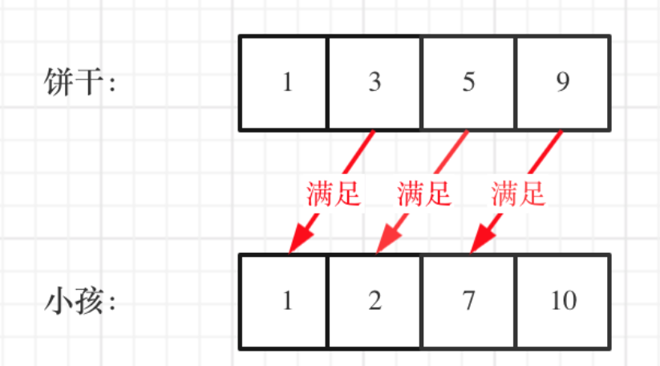

#  贪心算法

==**贪⼼的本质是选择每⼀阶段的局部最优，从⽽达到全局最优。 **==

==**贪⼼没有套路，就是常识性推导加上举反例**==

贪心算法一般分为如下:

+ 将问题分解为若于个子问题
+ 找出适合的贪心策略
+ 求解每一个子问题的最优解
+ 将局部最优解堆叠成全局最优解


#### [455. 分发饼干](https://leetcode.cn/problems/assign-cookies/)

假设你是⼀位很棒的家⻓，想要给你的孩⼦们⼀些⼩饼⼲。但是，每个孩⼦最多只能给⼀块饼⼲。
对每个孩⼦ i，都有⼀个胃⼝值 g[i]，这是能让孩⼦们满⾜胃⼝的饼⼲的最⼩尺⼨；并且每块饼⼲ j，都
有⼀个尺⼨ s[j] 。如果 s[j] >= g[i]，我们可以将这个饼⼲ j 分配给孩⼦ i ，这个孩⼦会得到满⾜。你的⽬
标是尽可能满⾜越多数量的孩⼦，并输出这个最⼤数值。

这里的局部最优就是大饼干喂给胃口大的，充分利用饼干尺寸喂饱一个，全局最优就是喂饱尽可能多的
小孩。



```c++
class Solution 
{
public:
    int findContentChildren(vector<int>& g, vector<int>& s) 
    {
        sort(g.begin(),g.end());
        sort(s.begin(),s.end());
        int index = s.size() - 1;
        int result = 0;
        for (int i = g.size() - 1; i >= 0; i--)
        {
            if (index >= 0 && s[index] >= g[i])
            {
                result++;
                index--;
            }
        }
        return result;
    }
};
```


#### [1710. 卡车上的最大单元数](https://leetcode.cn/problems/maximum-units-on-a-truck/)

请你将一些箱子装在 一辆卡车 上。给你一个二维数组 boxTypes ，其中 boxTypes[i] = [numberOfBoxesi, numberOfUnitsPerBoxi] ：numberOfBoxesi 是类型 i 的箱子的数量。
numberOfUnitsPerBoxi 是类型 i 每个箱子可以装载的单元数量。
整数 truckSize 表示卡车上可以装载 箱子 的 最大数量 。只要箱子数量不超过 truckSize ，你就可以选择任意箱子装到卡车上。返回卡车可以装载 单元 的 最大 总数。

 示例 1：

- ```
  输入：boxTypes = [[1,3],[2,2],[3,1]], truckSize = 4
  输出：8
  解释：箱子的情况如下：
  
  - 1 个第一类的箱子，里面含 3 个单元。
  - 2 个第二类的箱子，每个里面含 2 个单元。
  - 3 个第三类的箱子，每个里面含 1 个单元。
    可以选择第一类和第二类的所有箱子，以及第三类的一个箱子。
    单元总数 = (1 * 3) + (2 * 2) + (1 * 1) = 8
  ```

代码:

```c++
class Solution 
{
public:
    int maximumUnits(vector<vector<int>>& b, int s) 
    {
        //箱子容量从大到小排序
        sort(b.begin(),b.end(),[](const auto& L, const auto& R)
        {
            return L[1] > R[1];
        });
        
        int ans = 0, n = 0;
        for (int i = 0; i < b.size(); i++) 
        {
            if (s <= 0)
                break;
            n = min(s, b[i][0]);
            s-=n;
            ans += n * b[i][1];
        }
        return ans;
    }
};
```


