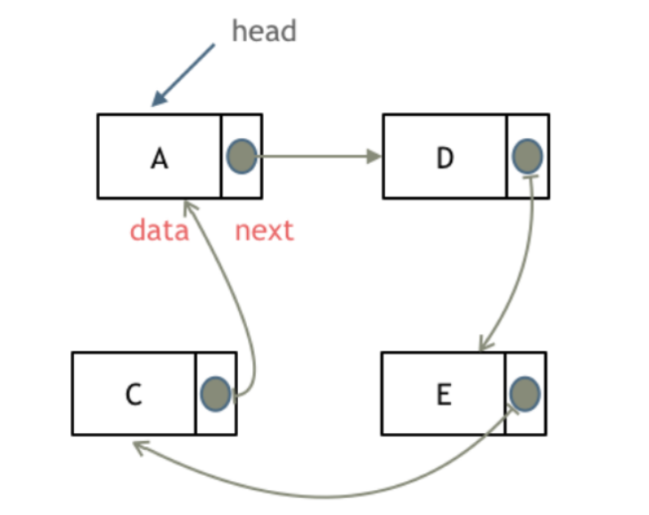

# 链表的种类

## 单链表

单链表中的指针域只能指向节点的下一个节点

## 双链表

双链表：每一个节点有两个指针域，一个指向下一个节点，一个指向上一个节点
双链表既可以向前查询也可以向后查询.
如图所示


## 循环链表

循环链表，顾名思义，就是链表首尾相连。

循环链表可以用来解决约瑟夫环问题。



# 链表定义

c++:

```c++
// 单链表
struct ListNode 
{
    int val;          // 节点上存储的元素
    ListNode *next;  // 指向下一个节点的指针
    ListNode(int x) : val(x), next(NULL) {}  // 节点的构造函数
};
```

c语言:

```c
typedef struct LinkNode
{
	int val;
	struct LinkNode* next;
}LinkNode;
```


# 链头创建

链接接的入口节点称为链表的头结点也就是head
如图所示:


**个人习惯使用哨兵节点:   **

```c++
LinkNode* dummyHead = new LinkNode(0); // 如果没有创建哨兵就这样创建
LinkNode* cur = dummyHead;

// cur->next  使用
// dummyHead->next 为真的头节点
```


# 链表实现

**c++:**

```c++
#include <iostream>

using namespace std;


struct LinkNode
{
	int val;
	LinkNode* next;
	LinkNode(int val) : val(val) { next = nullptr; }
};


class MyLinkedList
{
private:
	LinkNode* dummyHead;
	int size;
public:
	MyLinkedList()
	{
		dummyHead = new LinkNode(0);  // 创建哨兵节点  // 一般设置成0或者-1
		size = 0;
	}
	
    // 析构
	~MyLinkedList()
	{
		LinkNode* freeNode;
		while (dummyHead != NULL)
		{
            freeNode = dummyHead;
			dummyHead = dummyHead->next;
			delete freeNode;
		}
	}

	// 头创建
	void addHead(int data)
	{
		LinkNode* newNode = new LinkNode(data); // 创建新节点
		newNode->next = dummyHead->next;  // 相当于  newNode->next = head; //指针域去指向head指针
		dummyHead->next = newNode;
		size++;
	}

	// 尾创建
	void addTail(int data)
	{
		LinkNode* cur = dummyHead;   //cur成为前驱节点 //真链表的头节点就dummyHead->next, 这个可以保持头不变
		LinkNode* newNode = new LinkNode(data); // 创建一个节点
		while (cur->next)
		{
			cur = cur->next;
		}
		cur->next = newNode;
		size++;
	}

	// 插入
	void insert(int data, int index)
	{
		if (index > size)
			return;
		LinkNode* cur = dummyHead;
		LinkNode* newNode = new LinkNode(data);
		while (index--)
		{
			cur = cur->next;
		}
		//插入
		newNode->next = cur->next;
		cur->next = newNode;
		size++;
	}


	// 删除指定元素
	void deleteVal(int data)
	{
		/*if (search(data) == 0)
			return;*/
		LinkNode* cur = dummyHead;
		while (cur->next)
		{
			if (cur->next->val == data)
				break;
			cur = cur->next;
		}
		LinkNode* temp = cur->next;
		cur->next = cur->next->next;
		delete temp;
		size--;
	}

	// 删除指定索引
	void deleteInd(int index)
	{
		if (index >= size || index < 0)
			return;
		LinkNode* cur = dummyHead;
		while (index--)
		{
			cur = cur->next;
		}
		LinkNode* temp = cur->next;   //第 index个节点并不是ndex的
		cur->next = cur->next->next;
		delete temp;
		size--;
	}

	// 显示
	void show() const
	{
		LinkNode* cur = dummyHead;
		while (cur->next)
		{
			cout << cur->next->val;
			cur = cur->next;
		}
		cout << endl;
	}
};

int main(void)
{
	return 0;
}
```


**c语言:**

```c
#pragma once
#include <stdbool.h>

typedef int Data;

// 定义节点结构
typedef struct linkNode
{
	Data data;
	struct linkNode* next;

}linkNode;

// 创建链表
linkNode* createList();

// 创建节点
linkNode* createNode(Data val);

// 插入
//头插入
void pushfront(linkNode* list, Data val);
//尾插入
void push_back(linkNode* list, Data val);
//指定位置插入(下标)
void insert_pos(linkNode* list, int pos, Data val);
//指定位置插入(在指定元素之后)
void insert_item(linkNode* list, linkNode* item, Data val);
// 查找元素
linkNode* find(linkNode* list, Data data);


// 删除
//头删
void pop_front(linkNode* list);
//尾删
void pop_back(linkNode* list);
//指定元素删除
void removeOne(linkNode* list, Data val);
void removeA1l(linkNode* list, Data val);  // 删除所有val
bool isempty(linkNode* list);

// 遍历
void show_list(linkNode* list);
```

```c
#include "LinkList.h"
#include <stdio.h>
#include <malloc.h>
#include <string.h>

linkNode* createList()
{
    //哨兵节点  //先new一个节点充当哨兵节点 //也可以不做这个函数但是在操作函数实现是每个单独去设置哨兵节点,麻烦 
	linkNode* head = malloc(sizeof(linkNode));   
	if (!head)                     
	{
		printf("head malloc failed");
		return NULL;
	}
	memset(head, 0, sizeof(linkNode));
	return head;
}

linkNode* createNode(Data val)
{
	linkNode* newNode = malloc(sizeof(linkNode));
	if (!newNode)
	{
		printf("newNode malloc falied"); 
        return NULL;
	}
	newNode->data = val;
	newNode->next = NULL;
	return newNode;
}

void pushfront(linkNode* list, Data val)
{
	linkNode* newNode = createNode(val);
	newNode->next = list->next;
	list->next = newNode;
}

void push_back(linkNode* list, Data val)
{
	linkNode* newNode = createNode(val);
	linkNode* cur = list;
	while (cur->next)
	{
		cur = cur->next;
	}
	cur->next = newNode;
}

void insert_pos(linkNode* list, int pos, Data val)
{
	linkNode* cur = list;
	linkNode* newNode = createNode(val);

	while (pos-- && cur->next)
	{
		cur = cur->next;
	}

	newNode->next = cur->next;
	cur->next = newNode;
}

void insert_item(linkNode* list, linkNode* item, Data val)
{
	linkNode* newNode = createNode(val);
	newNode->next = item->next;
	item->next = newNode;
}

linkNode* find(linkNode* list, Data val)
{
	linkNode* curNode = list->next; while (curNode)
	{

		if (curNode->data == val)
		{
			return curNode;
		}
		curNode = curNode->next;
	
	return NULL;

}

void pop_front(linkNode* list)
{
	linkNode* temp = list->next;
	list->next = list->next->next;
	free(temp);
}

void pop_back(linkNode* list)
{
	linkNode* cur = list;
	linkNode* temp = NULL;
	while (cur->next && cur->next->next)
	{

		cur = cur->next;
	}
	free(cur->next);
	cur->next = NULL;
}

void removeOne(linkNode* list, Data val)
{
	if (isempty(list))
		return;
	linkNode* cur = list;
	while (cur->next)
	{
		if (cur->next->data == val)
		{
			break;
		}
		cur = cur->next;
	}
	//删除
	if (cur->next)
	{
		linkNode* temp = cur->next;
		cur->next = cur->next->next;
		free(temp);
	}
}

void removeA1l(linkNode* list, Data val)
{
	if (isempty(list))
		return;
	linkNode* cur = list;
	linkNode* temp = NULL;
	while (cur->next)
	{
		if (cur->next->data == val)
		{
			temp = cur->next;
			cur->next = temp->next;
			free(temp);
			temp = NULL;
		}
		else
		{
			cur = cur->next;
		}

	}
}

bool isempty(linkNode* list)
{
	return list->next == NULL;
}

void show_list(linkNode* list)
{
	linkNode* cur = list->next;
	while (cur)
	{
		printf("%d ", cur->data);
		cur = cur->next;
	}
	printf("\n");
}
```

```c
#include <stdio.h>
#include "LinkList.h"


int main(void)
{
	linkNode* list = createList();
	pushfront(list, 1);
	pushfront(list, 3);
	pushfront(list, 2);
	pushfront(list, 3);
	pushfront(list, 3);

	insert_pos(list, 3, 2);
	//insert_pos(list, 3, 999);

	//linkNode* item = find(list, 3);
	//if (item)
	//{
	//	insert_item(list, item, 444);
	//}


	//pop_front(list);
	//pop_back(list);
	//	removeOne(list, 2);
	removeA1l(list, 2);
	show_list(list);
	while (1);
	return 0;
}
```


#### [2. 两数相加](https://leetcode.cn/problems/add-two-numbers/)

思路:  返回在一个新的链表, 处理好进位

```c++
/**
 * Definition for singly-linked list.
 * struct ListNode {
 *     int val;
 *     ListNode *next;
 *     ListNode() : val(0), next(nullptr) {}
 *     ListNode(int x) : val(x), next(nullptr) {}
 *     ListNode(int x, ListNode *next) : val(x), next(next) {}
 * };
 */
class Solution {
public:
    ListNode* addTwoNumbers(ListNode* l1, ListNode* l2) 
    {
        // 哨兵节点
        ListNode* virtualHead = new ListNode(-1); 
        ListNode* cur = virtualHead;
        
        //
        int sum = 0;     //每个位的加和结果
        bool carry = false; //进位标志
        while(l1!=NULL||l2!=NULL)
        {
            sum=0;
            if(l1 != NULL)
            {
                sum += l1->val;
                l1 = l1->next;
            }
            if(l2 != NULL)
            {
                sum += l2->val;
                l2 = l2->next;
            }
            if(carry)
                sum++;
            cur->next  = new ListNode(sum % 10);  //个位
            cur= cur->next;
            carry = sum >= 10 ? true : false;  //进位
        }

        if(carry)
            cur->next  = new ListNode(1);
        return virtualHead->next;
    }
};
```


#### [206. 反转链表](https://leetcode.cn/problems/reverse-linked-list/)

思路

      1. 设置temp
      2. 反转操作
      3. 更新

```c++
/**
 * Definition for singly-linked list.
 * struct ListNode {
 *     int val;
 *     ListNode *next;
 *     ListNode() : val(0), next(nullptr) {}
 *     ListNode(int x) : val(x), next(nullptr) {}
 *     ListNode(int x, ListNode *next) : val(x), next(next) {}
 * }; 
// 单链表
// 返回反转后的链表  
 */
class Solution 
{
public:
    ListNode* reverseList(ListNode* head) 
    {   
        ListNode* cur = head;
        ListNode* pre = nullptr;
        ListNode* temp;
        while (cur)
        {
            temp = cur->next; // 反转后找不到原来 cur的下一个位置
            cur->next = pre;  // 反转操作
            pre = cur;  // 更新pre位置
            cur = temp; // 更新cur位置
        }
        return pre;
    }
};
```

