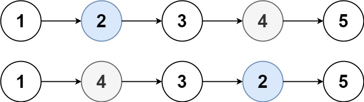

# 链表的种类

## 单链表

单链表中的指针域只能指向节点的下一个节点

## 双链表

双链表：每一个节点有两个指针域，一个指向下一个节点，一个指向上一个节点
双链表既可以向前查询也可以向后查询.
如图所示


## 循环链表

循环链表，顾名思义，就是链表首尾相连。

循环链表可以用来解决约瑟夫环问题。


# 链表定义

c++:

```c++
// 单链表
struct ListNode 
{
    int val;          // 节点上存储的元素
    ListNode *next;  // 指向下一个节点的指针
    ListNode(int x) : val(x), next(NULL) {}  // 节点的构造函数
};
```

c语言:

```c
typedef struct LinkNode
{
	int val;
	struct LinkNode* next;
}LinkNode;
```


# 链头创建

链接接的入口节点称为链表的头结点也就是head
如图所示:


**个人习惯使用哨兵节点:   **

```c++
LinkNode* dummyHead = new LinkNode(0); // 如果没有创建哨兵就这样创建
LinkNode* cur = dummyHead;

// cur->next  使用
// dummyHead->next 为真的头节点
```


# 链表实现

**c++:**

```c++
#include <iostream>

using namespace std;


struct LinkNode
{
	int val;
	LinkNode* next;
	LinkNode(int val) : val(val) { next = nullptr; }
};


class MyLinkedList
{
private:
	LinkNode* dummyHead;
	int size;
public:
	MyLinkedList()
	{
		dummyHead = new LinkNode(0);  // 创建哨兵节点  // 一般设置成0或者-1
		size = 0;
	}
	
    // 析构
	~MyLinkedList()
	{
		LinkNode* freeNode;
		while (dummyHead != NULL)
		{
            freeNode = dummyHead;
			dummyHead = dummyHead->next;
			delete freeNode;
		}
	}

	// 头创建
	void addHead(int data)
	{
		LinkNode* newNode = new LinkNode(data); // 创建新节点
		newNode->next = dummyHead->next;  // 相当于  newNode->next = head; //指针域去指向head指针
		dummyHead->next = newNode;
		size++;
	}

	// 尾创建
	void addTail(int data)
	{
		LinkNode* cur = dummyHead;   //cur成为前驱节点 //真链表的头节点就dummyHead->next, 这个可以保持头不变
		LinkNode* newNode = new LinkNode(data); // 创建一个节点
		while (cur->next)
		{
			cur = cur->next;
		}
		cur->next = newNode;
		size++;
	}

	// 插入
	void insert(int data, int index)
	{
		if (index > size)
			return;
		LinkNode* cur = dummyHead;
		LinkNode* newNode = new LinkNode(data);
		while (index--)
		{
			cur = cur->next;
		}
		//插入
		newNode->next = cur->next;
		cur->next = newNode;
		size++;
	}


	// 删除指定元素
	void deleteVal(int data)
	{
		/*if (search(data) == 0)
			return;*/
		LinkNode* cur = dummyHead;
		while (cur->next)
		{
			if (cur->next->val == data)
				break;
			cur = cur->next;
		}
		LinkNode* temp = cur->next;
		cur->next = cur->next->next;
		delete temp;
		size--;
	}

	// 删除指定索引
	void deleteInd(int index)
	{
		if (index >= size || index < 0)
			return;
		LinkNode* cur = dummyHead;
		while (index--)
		{
			cur = cur->next;
		}
		LinkNode* temp = cur->next;   //第 index个节点并不是ndex的
		cur->next = cur->next->next;
		delete temp;
		size--;
	}

	// 显示
	void show() const
	{
		LinkNode* cur = dummyHead;
		while (cur->next)
		{
			cout << cur->next->val;
			cur = cur->next;
		}
		cout << endl;
	}
};

int main(void)
{
	return 0;
}
```

**c语言:**

```c
#pragma once
#include <stdbool.h>

typedef int Data;

// 定义节点结构
typedef struct linkNode
{
	Data data;
	struct linkNode* next;

}linkNode;

// 创建链表
linkNode* createList();

// 创建节点
linkNode* createNode(Data val);

// 插入
//头插入
void pushfront(linkNode* list, Data val);
//尾插入
void push_back(linkNode* list, Data val);
//指定位置插入(下标)
void insert_pos(linkNode* list, int pos, Data val);
//指定位置插入(在指定元素之后)
void insert_item(linkNode* list, linkNode* item, Data val);
// 查找元素
linkNode* find(linkNode* list, Data data);


// 删除
//头删
void pop_front(linkNode* list);
//尾删
void pop_back(linkNode* list);
//指定元素删除
void removeOne(linkNode* list, Data val);
void removeA1l(linkNode* list, Data val);  // 删除所有val
bool isempty(linkNode* list);

// 遍历
void show_list(linkNode* list);
```

```c
#include "LinkList.h"
#include <stdio.h>
#include <malloc.h>
#include <string.h>

linkNode* createList()
{
    //哨兵节点  //先new一个节点充当哨兵节点 //也可以不做这个函数但是在操作函数实现是每个单独去设置哨兵节点,麻烦 
	linkNode* head = malloc(sizeof(linkNode));   
	if (!head)                     
	{
		printf("head malloc failed");
		return NULL;
	}
	memset(head, 0, sizeof(linkNode));
	return head;
}

linkNode* createNode(Data val)
{
	linkNode* newNode = malloc(sizeof(linkNode));
	if (!newNode)
	{
		printf("newNode malloc falied"); 
        return NULL;
	}
	newNode->data = val;
	newNode->next = NULL;
	return newNode;
}

void pushfront(linkNode* list, Data val)
{
	linkNode* newNode = createNode(val);
	newNode->next = list->next;
	list->next = newNode;
}

void push_back(linkNode* list, Data val)
{
	linkNode* newNode = createNode(val);
	linkNode* cur = list;
	while (cur->next)
	{
		cur = cur->next;
	}
	cur->next = newNode;
}

void insert_pos(linkNode* list, int pos, Data val)
{
	linkNode* cur = list;
	linkNode* newNode = createNode(val);

	while (pos-- && cur->next)
	{
		cur = cur->next;
	}

	newNode->next = cur->next;
	cur->next = newNode;
}

void insert_item(linkNode* list, linkNode* item, Data val)
{
	linkNode* newNode = createNode(val);
	newNode->next = item->next;
	item->next = newNode;
}

linkNode* find(linkNode* list, Data val)
{
	linkNode* curNode = list->next; while (curNode)
	{

		if (curNode->data == val)
		{
			return curNode;
		}
		curNode = curNode->next;
	
	return NULL;

}

void pop_front(linkNode* list)
{
	linkNode* temp = list->next;
	list->next = list->next->next;
	free(temp);
}

void pop_back(linkNode* list)
{
	linkNode* cur = list;
	linkNode* temp = NULL;
	while (cur->next && cur->next->next)
	{

		cur = cur->next;
	}
	free(cur->next);
	cur->next = NULL;
}

void removeOne(linkNode* list, Data val)
{
	if (isempty(list))
		return;
	linkNode* cur = list;
	while (cur->next)
	{
		if (cur->next->data == val)
		{
			break;
		}
		cur = cur->next;
	}
	//删除
	if (cur->next)
	{
		linkNode* temp = cur->next;
		cur->next = cur->next->next;
		free(temp);
	}
}

void removeA1l(linkNode* list, Data val)
{
	if (isempty(list))
		return;
	linkNode* cur = list;
	linkNode* temp = NULL;
	while (cur->next)
	{
		if (cur->next->data == val)
		{
			temp = cur->next;
			cur->next = temp->next;
			free(temp);
			temp = NULL;
		}
		else
		{
			cur = cur->next;
		}

	}
}

bool isempty(linkNode* list)
{
	return list->next == NULL;
}

void show_list(linkNode* list)
{
	linkNode* cur = list->next;
	while (cur)
	{
		printf("%d ", cur->data);
		cur = cur->next;
	}
	printf("\n");
}
```

```c
#include <stdio.h>
#include "LinkList.h"


int main(void)
{
	linkNode* list = createList();
	pushfront(list, 1);
	pushfront(list, 3);
	pushfront(list, 2);
	pushfront(list, 3);
	pushfront(list, 3);

	insert_pos(list, 3, 2);
	//insert_pos(list, 3, 999);

	//linkNode* item = find(list, 3);
	//if (item)
	//{
	//	insert_item(list, item, 444);
	//}


	//pop_front(list);
	//pop_back(list);
	//	removeOne(list, 2);
	removeA1l(list, 2);
	show_list(list);
	while (1);
	return 0;
}
```

遍历

```c++
ListNode *cur = head;
int re = 0;
while (cur)
{
	cout << cur->val;
  	cur = cur->next;
}
```


```c++
// 左链右节
auto next = p->next;  // 下一个节点
p->next = nullptr;  // 上一个的链
```

# 0. 常见的遍历形式

## 正数倒数k节点

```c++
ListNode* getKthNode(ListNode* head, int k) {
    ListNode* slow = head;
    ListNode* fast = head;

    // 正数k
    for (int i = 1; i < k; i++)  //如果链表 从 1 开始索引i=1
    {
        // 链表长度小于 k ，找不到第 k 个节点
        if (fast == nullptr) 
            return nullptr; 
        fast = fast->next;
    }

    ListNode* temp = fast; //找到正数第k个结点

    // 倒数k
    while(fast->next)  //如果链表 从 1 开始索引 fast->next
    { 
        fast = fast->next;
        slow = slow->next;
    }
    
    return head;
}
```

## [a,b]节点

```c++
//删除 [a,b] 之间的结点
// 第a-1个结点
ListNode* preNode = nullptr;
// 第b+1个结点
ListNode* postNode = nullptr;
while (a > 0)
{
    --a;
    --b;
	cur = cur->next;
}
preNode = cur;  //a-1

while (b >= 0)
{
    --b;
    cur = cur->next;
}
postNode = cur->next;  //b+1
```

# 1.  比较相邻的元素的方式

```c++
if (!head->next || head->val != head->next->val) 
       
while (head->next && head->val == head->next->val)
    
while(fast && fast->next) 
```

# 2. 链表长度

```c++
ListNode * p = head;
int length = 0;
while (p) 
{
    ++length;
    p = p->next;
}
```


# 进位

## [两数相加](https://leetcode.cn/problems/add-two-numbers/)

思路:  返回在一个新的链表, 处理好进位

```c++
/**
 * Definition for singly-linked list.
 * struct ListNode {
 *     int val;
 *     ListNode *next;
 *     ListNode() : val(0), next(nullptr) {}
 *     ListNode(int x) : val(x), next(nullptr) {}
 *     ListNode(int x, ListNode *next) : val(x), next(next) {}
 * };
 */
class Solution {
public:
    ListNode* addTwoNumbers(ListNode* l1, ListNode* l2) 
    {
        // 哨兵节点
        ListNode* dummy = new ListNode(-1); 
        ListNode* cur = dummy;
        
        //
        int sum = 0;     //每个位的加和结果
        bool carry = false; //进位标志
        while(l1 != NULL || l2 != NULL)
        {
            sum=0;
            if(l1 != NULL)
            {
                sum += l1->val;
                l1 = l1->next;
            }
            if(l2 != NULL)
            {
                sum += l2->val;
                l2 = l2->next;
            }
            if(carry)
                sum++;
            cur->next  = new ListNode(sum % 10);  //个位
            cur= cur->next;
            carry = sum >= 10 ? true : false;  //进位
        }

        if(carry)
            cur->next  = new ListNode(1);
        return dummy->next;
    }
};
```

## [1290. 二进制链表转整数](https://leetcode.cn/problems/convert-binary-number-in-a-linked-list-to-integer/)

给你一个单链表的引用结点 `head`。链表中每个结点的值不是 0 就是 1。已知此链表是一个整数数字的二进制表示形式。

请你返回该链表所表示数字的 **十进制值** 。

 

**示例 1：**


```
输入：head = [1,0,1]
输出：5
解释：二进制数 (101) 转化为十进制数 (5)
```

```c++
/**
 * Definition for singly-linked list.
 * struct ListNode {
 *     int val;
 *     ListNode *next;
 *     ListNode() : val(0), next(nullptr) {}
 *     ListNode(int x) : val(x), next(nullptr) {}
 *     ListNode(int x, ListNode *next) : val(x), next(next) {}
 * };
 */
class Solution {
public:
    int getDecimalValue(ListNode* head) {
        ListNode *tmp = head;
        int re = 0;
        /*
        while (cur) {
            ans = ans * 2 + cur->val;
            cur = cur->next;
        }*/
        while (tmp) 
        {
            re = (re << 1) | (tmp->val);  //二进制转十进制
            tmp = tmp->next;
        }

        return re;
    }
};
```

r进制转10进制模版:

```c++
int Atoi(string s,int radix)    //s是给定的radix进制字符串
{
	int ans=0;
	for(int i=0;i<s.size();i++)
	{
		char t=s[i];
		if(t >= '0'&& t <= '9') 
            ans = ans * radix + t - '0'; // 字符转数字
		else
        {
            ans = ans * radix + t -'a' + 10;  //字符转数字
        } 
	}
	return ans;
}
```


# 使用虚拟节点

例如设置一个虚拟节点，移除元素1


给链表添加一个虚拟头结点为新的头结点，此时要移除这个旧头结点元素1。这样就其他节点的方式统一了。

## 使用哨兵节点

<font  color = red>使用虚拟节点处理 </font>

+ 操作头结点

+ 返回新链表

```c++
LinkNode* dummyHead = new LinkNode(0); // 如果没有创建哨兵就这样创建
LinkNode* cur = dummyHead;

// 有虚拟节点 cur->next 使用   // 无虚拟节点 cur 使用
// dummyHead->next 为真的头节点
```

c++ 的话，不能使用 new 来定义 dummyHead，应该使用栈变量。通常有链表头的话，很多边界 case 可以得到统一处理。

### [203. 移除链表元素](https://leetcode.cn/problems/remove-linked-list-elements/)

给你一个链表的头节点 `head` 和一个整数 `val` ，请你删除链表中所有满足 `Node.val == val` 的节点，并返回 **新的头节点** 。

**示例 1：**


```
输入：head = [1,2,6,3,4,5,6], val = 6
输出：[1,2,3,4,5]
```

```c++
/**
 * Definition for singly-linked list.
 * struct ListNode {
 *     int val;
 *     ListNode *next;
 *     ListNode() : val(0), next(nullptr) {}
 *     ListNode(int x) : val(x), next(nullptr) {}
 *     ListNode(int x, ListNode *next) : val(x), next(next) {}
 * };
 */
class Solution 
{
public:
    ListNode* removeElements(ListNode* head, int val) 
    {   
        ListNode *dummyHead = new ListNode(0);
        dummyHead->next = head;
        ListNode * cur = dummyHead;   // 虚拟头节点
        
        while (cur->next)
        {
            if (cur->next->val == val)
            {
                ListNode *temp = cur->next;
                cur->next = cur->next->next;
                delete temp;
            }
            else 
                cur = cur->next;
        }
        
        // 删除虚拟头节点
        head = dummyHead->next;
        delete dummyHead;
        return head;
    }
};
```

### [21. 合并两个有序链表](https://leetcode.cn/problems/merge-two-sorted-lists/)

将两个升序链表合并为一个新的 **升序** 链表并返回。新链表是通过拼接给定的两个链表的所有节点组成的。 

**示例 1：**


```
输入：l1 = [1,2,4], l2 = [1,3,4]
输出：[1,1,2,3,4,4]
```

```c++
/**
 * Definition for singly-linked list.
 * struct ListNode {
 *     int val;
 *     ListNode *next;
 *     ListNode() : val(0), next(nullptr) {}
 *     ListNode(int x) : val(x), next(nullptr) {}
 *     ListNode(int x, ListNode *next) : val(x), next(next) {}
 * };
 */

class Solution {
public:
    ListNode* mergeTwoLists(ListNode* l1, ListNode* l2) 
    {
        ListNode* dummyHead = new ListNode(-1); //动态创建哑节点，值为-1 
        ListNode* cur = dummyHead; //成为新的头节点,真链表的头节点就dummyHead->next //head节点也有prev指针了,这里可以保持头不变
        while (l1 && l2)   
        {
            if (l1->val < l2->val) 
            {
                cur->next = l1;
                l1 = l1->next;   // 更新位置
            } 
            else 
            {
                cur->next = l2;
                l2 = l2->next;
            }
            cur = cur->next;  //更新pre的位置. 
        }
        cur->next = l1 ? l1 : l2;
        return dummyHead->next;
    }
};
```


# 不使用虚拟节点

==无虚拟节点使用cur==

## [206. 反转(交换)链表](https://leetcode.cn/problems/reverse-linked-list/)

思路

      1. 设置temp
      2. 反转操作
      3. 更新

```c++
/**
 * Definition for singly-linked list.
 * struct ListNode {
 *     int val;
 *     ListNode *next;
 *     ListNode() : val(0), next(nullptr) {}
 *     ListNode(int x) : val(x), next(nullptr) {}
 *     ListNode(int x, ListNode *next) : val(x), next(next) {}
 * }; 
// 单链表
// 返回反转后的链表  
 */
class Solution 
{
public:
    ListNode* reverseList(ListNode* head) 
    {   
        ListNode* cur = head;
        ListNode* pre = nullptr;
        ListNode* temp;
        
        while (cur)
        {
            temp = cur->next; // 反转后找不到原来 cur的下一个位置
            cur->next = pre;  // 反转操作
            pre = cur;  // 更新pre位置
            cur = temp; // 移动cur位置
        }
        
        return pre;
    }
};
```


# 双指针

**获取倒数第k个元素，获取中间位置的元素，判断链表是否存在环，判断环的长度等和长度与位置有关的问题**。这些问题都可以通过灵活运用双指针来解决。

Tips：双指针并不是固定的公式，而是一种思维方式~

## 倒数第k个元素的问题

设有两个指针 p 和 q，初始时均指向头结点。首先，先让 p 沿着 next 移动 k 次。此时，p 指向第 k+1个结点，q 指向头节点，**两个指针的距离为 k** 。然后，同时移动 p 和 q，直到 p 指向空，此时 q 即指向倒数第 k 个结点。


```c++
class Solution {
public:
    ListNode* getKthFromEnd(ListNode* head, int k) {
        ListNode * fast = head;//初始化  // =head就相当于数组中=0
        ListNode * slow = head;
        while(k--) 
        {   //将 fast指针移动 k 次
            fast = fast->next; 
        }
        
        while(fast != nullptr) {//同时移动，直到 fast == nullptr
            fast = fast->next;
            slow = slow->next;
        }
        return slow;
    }
};
```

## 获取中间元素的问题

设有两个指针 fast 和 slow，初始时指向头节点。每次移动时，fast向后走两次，slow向后走一次，直到 fast 无法向后走两次。这使得在每轮移动之后。fast 和 slow 的距离就会增加一。设链表有 n 个元素，那么最多移动 n/2 轮。当 n 为奇数时，slow 恰好指向中间结点，当 n 为 偶数时，slow 恰好指向中间两个结点的靠前一个(可以考虑下如何使其指向后一个结点呢？)。下述代码实现了 n 为偶数时慢指针指向靠后结点。

总结快慢指针的特性 —— 每轮移动之后两者的距离会加一。


```c++
class Solution {
public:
    ListNode* middleNode(ListNode* head)
    {
        ListNode * fast = head;
        ListNode * slow = head;
       
        while(fast != nullptr && fast->next != nullptr) 
        {
            fast = fast->next->next;
            slow = slow->next;
        }
        return slow;
    } 
};
```


## 是否存在环的问题

如果将尾结点的 next 指针指向其他任意一个结点，那么链表就存在了一个环。


快慢指针的特性 —— 每轮移动之后两者的距离会加一。 当一个链表有环时，快慢指针都会陷入环中进行无限次移动，然后变成了追及问题。想象一下在操场跑步的场景，只要一直跑下去，快的总会追上慢的。当两个指针都进入环后，每轮移动使得慢指针到快指针的距离增加一，同时快指针到慢指针的距离也减少一，只要一直移动下去，快指针总会追上慢指针。


根据上述表述得出，如果一个链表存在环，那么快慢指针必然会相遇。实现代码如下：

```c++
class Solution {
public:
    bool hasCycle(ListNode *head) {
        ListNode *slow = head;
        ListNode *fast = head;
        
        while(fast != nullptr) 
        {
            fast = fast->next;
            if(fast != nullptr) 
                fast = fast->next;
           
            if(fast == slow) 
                return true;
         
            slow = slow->next;
        }
        return nullptr;
    }
};
```

最后一个问题，如果存在环，如何判断环的长度呢？方法是，快慢指针相遇后继续移动，直到第二次相遇。两次相遇间的移动次数即为环的长度。

## [876. 链表的中间结点](https://leetcode.cn/problems/middle-of-the-linked-list/)

给你单链表的头结点 `head` ，请你找出并返回链表的中间结点。

如果有两个中间结点，则返回第二个中间结点。

 

**示例 1：**


输入：head = [1,2,3,4,5]
输出：[3,4,5]
解释：链表只有一个中间结点，值为 3 。


```c++
/**
 * Definition for singly-linked list.
 * struct ListNode {
 *     int val;
 *     ListNode *next;
 *     ListNode() : val(0), next(nullptr) {}
 *     ListNode(int x) : val(x), next(nullptr) {}
 *     ListNode(int x, ListNode *next) : val(x), next(next) {}
 * };
 */
class Solution 
{
public:
    ListNode* middleNode(ListNode* head) 
    {// 快慢指针
        ListNode * fast = head;
        ListNode * slow = head;
        while (fast && fast->next)
        {
            fast = fast->next->next;
            slow = slow->next;
        }
        return slow;
    }
};
```

## [2095. 删除链表的中间节点](https://leetcode.cn/problems/delete-the-middle-node-of-a-linked-list/)

给你一个链表的头节点 `head` 。**删除** 链表的 **中间节点** ，并返回修改后的链表的头节点 `head` 。

长度为 `n` 链表的中间节点是从头数起第 `⌊n / 2⌋` 个节点（下标从 **0** 开始），其中 `⌊x⌋` 表示小于或等于 `x` 的最大整数。

- 对于 `n` = `1`、`2`、`3`、`4` 和 `5` 的情况，中间节点的下标分别是 `0`、`1`、`1`、`2` 和 `2` 。

 

**示例 1：**


```
输入：head = [1,3,4,7,1,2,6]
输出：[1,3,4,1,2,6]
解释：
上图表示给出的链表。节点的下标分别标注在每个节点的下方。
由于 n = 7 ，值为 7 的节点 3 是中间节点，用红色标注。
返回结果为移除节点后的新链表。 
```

```c++
/**
 * Definition for singly-linked list.
 * struct ListNode {
 *     int val;
 *     ListNode *next;
 *     ListNode() : val(0), next(nullptr) {}
 *     ListNode(int x) : val(x), next(nullptr) {}
 *     ListNode(int x, ListNode *next) : val(x), next(next) {}
 * };
 */
class Solution 
{
public:
    ListNode* deleteMiddle(ListNode* head) 
    {
        ListNode * dummyHead = new ListNode(-1);
        dummyHead->next = head;
        
        ListNode * slow = dummyHead;
        ListNode * fast = dummyHead->next;
        while (fast && fast->next)
        {
            slow = slow->next;
            fast = fast->next->next;
        }

        // 删除(跳过及删除)
        slow->next = slow->next->next;
        
        return dummyHead->next;
    }
};
```


## [141. 环形链表](https://leetcode.cn/problems/linked-list-cycle/)

给你一个链表的头节点 `head` ，判断链表中是否有环。

如果链表中有某个节点，可以通过连续跟踪 `next` 指针再次到达，则链表中存在环。 为了表示给定链表中的环，评测系统内部使用整数 `pos` 来表示链表尾连接到链表中的位置（索引从 0 开始）。**注意：`pos` 不作为参数进行传递** 。仅仅是为了标识链表的实际情况。

*如果链表中存在环* ，则返回 `true` 。 否则，返回 `false` 

 

**示例 1：**


```
输入：head = [3,2,0,-4], pos = 1
输出：true
解释：链表中有一个环，其尾部连接到第二个节点。
```


```c++
/**
 * Definition for singly-linked list.
 * struct ListNode {
 *     int val;
 *     ListNode *next;
 *     ListNode(int x) : val(x), next(NULL) {}
 * };
 */
class Solution 
{
public:
    bool hasCycle(ListNode *head) 
    {
        ListNode * slow = head;
        ListNode * fast = head;
        while (fast && fast->next)
        {
            slow = slow->next;
            fast = fast->next->next;
            if (slow == fast)
                return true;
        }
        return false;
    }
};
```


## [160. 相交链表](https://leetcode.cn/problems/intersection-of-two-linked-lists/)


给你两个单链表的头节点 `headA` 和 `headB` ，请你找出并返回两个单链表相交的起始节点。如果两个链表不存在相交节点，返回 `null` 。

图示两个链表在节点 `c1` 开始相交**：**

[](https://assets.leetcode-cn.com/aliyun-lc-upload/uploads/2018/12/14/160_statement.png)

题目数据 **保证** 整个链式结构中不存在环。

**注意**，函数返回结果后，链表必须 **保持其原始结构** 。

**自定义评测：**

**评测系统** 的输入如下（你设计的程序 **不适用** 此输入）：

- `intersectVal` - 相交的起始节点的值。如果不存在相交节点，这一值为 `0`
- `listA` - 第一个链表
- `listB` - 第二个链表
- `skipA` - 在 `listA` 中（从头节点开始）跳到交叉节点的节点数
- `skipB` - 在 `listB` 中（从头节点开始）跳到交叉节点的节点数

评测系统将根据这些输入创建链式数据结构，并将两个头节点 `headA` 和 `headB` 传递给你的程序。如果程序能够正确返回相交节点，那么你的解决方案将被 **视作正确答案** 。

 

**示例 1：**

[](https://assets.leetcode.com/uploads/2018/12/13/160_example_1.png)

```
输入：intersectVal = 8, listA = [4,1,8,4,5], listB = [5,6,1,8,4,5], skipA = 2, skipB = 3
输出：Intersected at '8'
解释：相交节点的值为 8 （注意，如果两个链表相交则不能为 0）。
从各自的表头开始算起，链表 A 为 [4,1,8,4,5]，链表 B 为 [5,6,1,8,4,5]。
在 A 中，相交节点前有 2 个节点；在 B 中，相交节点前有 3 个节点。
— 请注意相交节点的值不为 1，因为在链表 A 和链表 B 之中值为 1 的节点 (A 中第二个节点和 B 中第三个节点) 是不同的节点。换句话说，它们在内存中指向两个不同的位置，而链表 A 和链表 B 中值为 8 的节点 (A 中第三个节点，B 中第四个节点) 在内存中指向相同的位置。
```


```c++
/**
 * Definition for singly-linked list.
 * struct ListNode {
 *     int val;
 *     ListNode *next;
 *     ListNode(int x) : val(x), next(NULL) {}
 * };
 */
class Solution 
{
public:
    ListNode *getIntersectionNode(ListNode *headA, ListNode *headB) 
    {
        ListNode* curA = headA;
        ListNode* curB = headB;
        int lenA = 0, lenB = 0;
        while (curA)
        {
            lenA++;
            curA = curA->next;
        }
        while (curB)
        {
            lenB++;
            curB = curB->next;
        }
        curA = headA;
        curB = headB;
        if (lenB > lenA)
        {
            swap(curA, curB);
            swap(lenA, lenB);
        }
        int diff = lenA - lenB;
        while(diff--)
        {
            curA = curA->next;
        }
        while (curA)
        {
            if (curA == curB)
                return curB;
            curA = curA->next;
            curB = curB->next;
        }
        return NULL;
    }
};
```

[思路](https://leetcode.cn/problems/intersection-of-two-linked-lists/solutions/12624/intersection-of-two-linked-lists-shuang-zhi-zhen-l/)


```c++
class Solution {
public:
    ListNode *getIntersectionNode(ListNode *headA, ListNode *headB) {
        ListNode *A = headA, *B = headB;
        while (A != B) {
            A = A != nullptr ? A->next : headB;
            B = B != nullptr ? B->next : headA;
        }
        return A;
    }
};

```

[234. 回文链表](https://leetcode.cn/problems/palindrome-linked-list/)

给你一个单链表的头节点 `head` ，请你判断该链表是否为回文链表。如果是，返回 `true` ；否则，返回 `false` 。

 

**示例 1：**


```
输入：head = [1,2,2,1]
输出：true
```


```c++
class Solution 
{
 public: 

    bool isPalindrome(ListNode* head) 
    {
        if(!head || !head->next) 
        {
            return true;
        }
        ListNode *slow = head, *fast = head;
        ListNode *pre = NULL;
        while(fast && fast->next) 
        {
            fast = fast->next->next;
            // 反转链表 
            ListNode *temp = slow->next;
            slow->next = pre;
            pre = slow;
            slow = temp;
        }
        if(fast) 
        {
            slow = slow->next;
        }
        while(pre && slow) 
        {
            if(pre->val != slow->val) 
            {
                return false;
            }
            pre = pre->next;
            slow = slow->next;
        }
        return true;
    }
};
```


[面试题 02.07. 链表相交](https://leetcode.cn/problems/intersection-of-two-linked-lists-lcci/)


给你两个单链表的头节点 `headA` 和 `headB` ，请你找出并返回两个单链表相交的起始节点。如果两个链表没有交点，返回 `null` 。

图示两个链表在节点 `c1` 开始相交**：**

[](https://assets.leetcode-cn.com/aliyun-lc-upload/uploads/2018/12/14/160_statement.png)

题目数据 **保证** 整个链式结构中不存在环。

**注意**，函数返回结果后，链表必须 **保持其原始结构** 。

 

**示例 1：**

[](https://assets.leetcode.com/uploads/2018/12/13/160_example_1.png)

```
输入：intersectVal = 8, listA = [4,1,8,4,5], listB = [5,0,1,8,4,5], skipA = 2, skipB = 3
输出：Intersected at '8'
解释：相交节点的值为 8 （注意，如果两个链表相交则不能为 0）。
从各自的表头开始算起，链表 A 为 [4,1,8,4,5]，链表 B 为 [5,0,1,8,4,5]。
在 A 中，相交节点前有 2 个节点；在 B 中，相交节点前有 3 个节点。
```


```c++
/**
 * Definition for singly-linked list.
 * struct ListNode {
 *     int val;
 *     ListNode *next;
 *     ListNode(int x) : val(x), next(NULL) {}
 * };
 */
        // 给你两个单链表的头节点 headA 和 headB 
        //返回两个单链表相交的起始节点。如果两个链表没有交点，返回 null
        // 相当于返回第一个公共的那个元素. 起始
        // 就是求两个链表交点节点的指针。交点不是数值相等，而是指针相等
class Solution 
{
public:
    ListNode *getIntersectionNode(ListNode *headA, ListNode *headB) 
    {
        ListNode* curA = headA;
        ListNode* curB = headB;
        int lenA = 0, lenB = 0;
        while (curA)
        {
            lenA++;
            curA = curA->next;
        }
        while (curB)
        {
            lenB++;
            curB = curB->next;
        }
        curA = headA;
        curB = headB;
        // 默认人curA是最长的那个
        if (lenA < lenB)
        {
            swap(lenA, lenB);  // 交换数据
            swap(curA, curB);
        }
        int diff = lenA - lenB;
        // curA和curB同起点,末尾部分都对齐
        while (diff--)
        {
            curA = curA->next;
        }
        //找交点
        while (curA)
        {
            if (curA == curB) //找的是节点而非值
            {
                return curA;
            }
            curA = curA->next;
            curB = curB->next;
        }
        return nullptr;
    }
};
```


# 数组与链表

## 数组

作为线性表的两种存储方式 —— 链表和数组

数组，所有元素都连续的存储于一段内存中，且每个元素占用的内存大小相同。这使得数组具备了通过下标快速访问数据的能力。 但连续存储的缺点也很明显，增加容量，增删元素的成本很高，时间复杂度均为 O(n)。 增加数组容量需要先申请一块新的内存，然后复制原有的元素。如果需要的话，可能还要删除原先的内存。


删除元素时需要移动被删除元素之后的所有元素以保证所有元素是连续的。增加元素时需要移动指定位置及之后的所有元素，然后将新增元素插入到指定位置，如果容量不足的话还需要先进行扩容操作。


总结一下数组的优缺点：

+ 优点：可以根据偏移实现快速的随机读写。
+ 缺点：扩容，增删元素极慢。

## 链表

<font color=red>无法高效获取长度，无法根据偏移快速访问元素</font>

链表，由若干个结点组成，每个结点包含数据域和指针域。结点结构如下图所示：


一般来讲，链表中只会有一个结点的指针域为空，该结点为**尾结点**，其他结点的指针域都会存储一个结点的内存地址。链表中也只会有一个结点的内存地址没有存储在其他结点的指针域，该结点称为**头结点**。


链表的存储方式使得它可以**高效的在指定位置插入与删除**，时间复杂度均为 O(1)。 在结点 p 之后增加一个结点 q 总共分三步：

1. 申请一段内存用以存储 q (可以使用内存池避免频繁申请和销毁内存)。
2. 将 p 的指针域数据复制到 q 的指针域。
3. 更新 p 的指针域为 q 的地址。

删除结点 p 之后的结点 q 总共分两步：

+ 将 q 的指针域复制到 p 的指针域。
+ 释放 q 结点的内存。

## 链表的主要代码

```c++
#include <bits/stdc++.h>

using namespace std;

//定义一个结点模板
template<typename T>
struct Node {
	T data;
	Node *next;
	Node() : next(nullptr) {}
	Node(const T &d) : data(d), next(nullptr) {}
};

//删除 p 结点后面的元素
template<typename T>
void Remove(Node<T> *p) {
	if (p == nullptr || p->next == nullptr) {
		return;
	}
	auto tmp = p->next->next;
	delete p->next;
	p->next = tmp;
}

//在 p 结点后面插入元素
template<typename T>
void Insert(Node<T> *p, const T &data) {
	auto tmp = new Node<T>(data);
	tmp->next = p->next;
	p->next = tmp;
}

//遍历链表
template<typename T, typename V>
void Walk(Node<T> *p, const V &vistor) {
	while(p != nullptr) {
		vistor(p);
		p = p->next;
	}
}

int main() {
	auto p = new Node<int>(1);
	Insert(p, 2);
	int sum = 0;
	Walk(p, [&sum](const Node<int> *p) -> void { sum += p->data; });
	cout << sum << endl;
	Remove(p);
	sum = 0;
	Walk(p, [&sum](const Node<int> *p) -> void { sum += p->data; });
	cout << sum << endl;
	return 0;
}
```


# 排序

```c++
ListNode* cur = 指针2 和 ListNode* &cur = 指针2 的区别在于参数的传递方式。

ListNode* cur = 指针2：这里将指针cur初始化为指针2。这种方式是传值传递，即将指针的值拷贝一份给新的指针。修改cur的值不会影响指针2的值，它们指向的对象是相同的，但是它们是两个不同的指针。

ListNode* &cur = 指针2：这里将指针cur声明为一个指向指针的引用，并将其绑定到指针2上。这种方式是引用传递，对cur的修改会直接反映到指针2上。它们指向同一个对象，并且它们是同一个指针。

在使用这两种方式时，需要根据具体需求和场景选择合适的方式。如果需要在函数内部修改指针的指向，可以使用引用传递方式；如果只是需要修改指针指向的对象的值，可以使用传值传递方式。
```


## 归并

[148. 排序链表](https://leetcode.cn/problems/sort-list/)

给你链表的头结点 `head` ，请将其按 **升序** 排列并返回 **排序后的链表** 。

**示例 1：**


```
输入：head = [4,2,1,3]
输出：[1,2,3,4]
```

bottom-to-up 的归并思路是这样的：先两个两个的 merge，完成一趟后，再 4 个4个的 merge，直到结束。举个简单的例子：[4,3,1,7,8,9,2,11,5,6].

```c++
step=1: (3->4)->(1->7)->(8->9)->(2->11)->(5->6)  //新链
step=2: (1->3->4->7)->(2->8->9->11)->(5->6)
step=4: (1->2->3->4->7->8->9->11)->5->6
step=8: (1->2->3->4->5->6->7->8->9->11)
```

链表里操作最难掌握的应该就是各种断链啊，然后再挂接啊。用到链表操作的两个技术：

+ merge(l1, l2)，双路归并
+ cut(l, n)，断链操作。它表示，将链表 l 切掉前 n 个节点，并返回后半部分的链表头。

```c++
class Solution {
public:
    ListNode* sortList(ListNode* head) {
 
        ListNode dummyHead(0);
        dummyHead.next = head;
        auto p = head;
        
        int length = 0;
        while (p) 
        {
            ++length;
            p = p->next;
        }
        
        for (int size = 1; size < length; size <<= 1) 
        {       
            // 每次更新
             ListNode* cur = dummyHead.next;  //cur==dummyHead.next=head
             ListNode* newList = &dummyHead; //newList==dummyHead
            
            while (cur) 
            {
                auto left = cur;
                auto right = cut(left, size); // left->@->@ right->@->@->@...
                //更新
                cur = cut(right, size); // left->@->@ right->@->@  cur->@->...
                
                /*
                假设链表0-5-4-3-2-6-...，step步长是2，tail指向0（0是dummyHead辅助节点）
                那么第一次循环中cut得到5-4和3-2，其中0-5、4-3和2-6之间的连接已经被切断了（4-3、2-6是通过p->next = nullptr 真正切断了，0-5只是概念上的切断）
                merge之后返回2（排序后2-3-4-5），此时0和排好序的头节点2是无连接的
                就需要使用tail->next = merge(left, right);连接使得0能够连接上2，达成 0-2-3-4-5 和 6-...的状态
                有序列表使用while (tail->next)使得tail指向 2-3-4-5的5，下一次循环中6-...之后的链表的排序结果就要靠指向5的tail来继续串联起来了
*/
                //合成一个链
                newList->next = merge(left, right);
                while (newList->next) {
                    newList = newList->next;
                }
            }
        }
        return dummyHead.next;
    }
    
    //cut 断链, 在n的位置分成两个链
    ListNode* cut(ListNode* head, int n) {
        auto p = head;
        while (--n && p) {
            p = p->next;
        }
        
        if (!p) return nullptr;
        
        // 切链
        // 左链右节
        auto next = p->next;
        p->next = nullptr; //是将切割后的第一部分链表断开的
        return next;
    }
    
    // 双路归并
    ListNode* merge(ListNode* l1, ListNode* l2) {
    	ListNode* dummyHead = new ListNode(-1); 
        ListNode* cur = dummyHead; 
        
        while (l1 && l2)   // l2,l1其中一个结束为止
        {
            auto &node = l1->val < l2->val ? l1 : l2; //使用引用的好处是避免创建一个新的指针变量来保存节点的地址
            cur->next = node;
            node = node->next;

            // 更新
            cur = cur->next;
        }
        cur->next = l1 ? l1 : l2;

        return dummyHead->next;
    }
};
```


排序算法其实就那么几种，背下来就好了，剩下的就是根据题的不同形式来变化选择对应的算法即可。 如图：


数组和链表，从抽象的思维角度来说除了单个数据之间的连接形式不一样，其它的都是一样的。

那就根据上图的总结来选取对应的排序算法。 题的要求时间复杂度是 O(n log n) ，从上图可知道。 只有 Quicksort / Mergesort / Timesort / Heapsort / Tree sort / Cubesort 可以满足。

本题只选用 Quicksort / Mergesort / Heapsort / Tree sort （ 但是快排总要超时，就放最后了。）


归并排序
归并算法的本质是分成治之。当有多个数据的时候，处理不过来，从逻辑上切分成多分最小处理单位，分别处理。处理完，再合并每一份的结果。也就是从小结果一点点累积出最终结果。

2份代码，一份切链，一份不切。

```c++

class Solution {
public:
    ListNode* sortList(ListNode* head) {
        if (!head || !head->next) return head;
        auto slow = head, fast = head;
        while (fast->next && fast->next->next)
            slow = slow->next, fast = fast->next->next;
        // 切链
        fast = slow->next, slow->next = nullptr;
        return merge(sortList(head), sortList(fast));
    }

private:
    ListNode* merge(ListNode* l1, ListNode* l2) {
        ListNode sub(0), *ptr = &sub;
        while (l1 && l2) 
        {
            auto &node = l1->val < l2->val ? l1 : l2;
            ptr = ptr->next = node, node = node->next;
        }
        ptr->next = l1 ? l1 : l2;
        return sub.next;
    }
};
```

红黑树排序
利用STL里面的set容器底层是红黑树实现，来实现树排序

class Solution {
public:
    ListNode* sortList(ListNode* head) {
        multiset<int> worker;
        auto sub = head;
        while (sub) worker.insert(sub->val),
            sub = sub->next;
        sub = head;
        for (auto &i : worker)
            sub->val = i, sub = sub->next;
        return head;
    }
};
堆排序
也是利用STL里面的优先队列底层是堆排序算法，来实现。

class Solution {
public:
    ListNode* sortList(ListNode* head) {
        priority_queue<int, vector<int>, greater<int>> worker;
        auto sub = head;
        while (sub) worker.push(sub->val), sub = sub->next;
        sub = head;
        while (sub) {
            sub->val = worker.top(), worker.pop();
            sub = sub->next;
        }
        return head;
    }
};
以下代码是力扣因为时间过不了的代码，但是逻辑没问题。大家看看，当扩张思维了。

代码逻辑都是，把数组当成中间变量来做排序，再最终转化成链表： 链表->数组->链表

快排
class Solution {
public:
    ListNode* sortList(ListNode* head) {
        vector<ListNode*> worker;
        ListNode temp(0), *ptr = head;
        while (ptr) worker.push_back(ptr), ptr = ptr->next;
        quickSort(worker, 0, worker.size() - 1);
        ptr = &temp;
        for (auto i : worker) ptr = ptr->next = i;
        ptr->next = nullptr;
        return temp.next;
    }

private:
    void quickSort(vector<ListNode*> &worker, int l, int r) {
        if (l >= r) return;
        int pivot = patition(worker, l, r);
        quickSort(worker, l, pivot - 1);
        quickSort(worker, pivot + 1, r);
    }

    int patition(vector<ListNode*> &worker, int l, int r) {
        for (int i = l; i < r; ++i) {
            if (worker[i]->val < worker[r]->val)
                swap(worker[l++], worker[i]);
        }
        swap(worker[l], worker[r]);
        return l;
    }
};
class Solution {
public:
    ListNode* sortList(ListNode* head) {
        vector<int> worker;
        auto sub = head;
        while (sub) worker.push_back(sub->val),
            sub = sub->next;
        quickSort(worker, 0, worker.size() - 1);
        sub = head;
        for (auto &i : worker)
            sub->val = i, sub = sub->next;
        return head;
    }

private:
    void quickSort(vector<int> &worker, int l, int r) {
        if (l >= r) return;
        int pivot = patition(worker, l, r);
        quickSort(worker, l, pivot - 1);
        quickSort(worker, pivot + 1, r);
    }

    int patition(vector<int> &worker, int l, int r) {
        for (int i = l; i < r; ++i) {
            if (worker[i] < worker[r])
                swap(worker[l++], worker[i]);
        }
        swap(worker[l], worker[r]);
        return l;
    }
};
冒泡
class Solution {
public:
    ListNode* sortList(ListNode* head) {
        vector<ListNode*> worker;
        ListNode temp(0), *ptr = head;
        while (ptr) worker.push_back(ptr), ptr = ptr->next;
        for (int i = worker.size() - 1; i >= 0; --i) {
            for (int j = 0; j < i; ++j)
                if (worker[j]->val > worker[j + 1]->val)
                    swap(worker[j], worker[j + 1]);
        }
        ptr = &temp;
        for (auto i : worker) ptr = ptr->next = i;
        ptr->next = nullptr;
        return temp.next;
    }
};


# 拼接

## 奇偶数

[328. 奇偶链表](https://leetcode.cn/problems/odd-even-linked-list/)

给定单链表的头节点 `head` ，将所有索引为奇数的节点和索引为偶数的节点分别组合在一起，然后返回重新排序的列表。

**第一个**节点的索引被认为是 **奇数** ， **第二个**节点的索引为 **偶数** ，以此类推。

请注意，偶数组和奇数组内部的相对顺序应该与输入时保持一致。

你必须在 `O(1)` 的额外空间复杂度和 `O(n)` 的时间复杂度下解决这个问题。

 

**示例 1:**


```
输入: head = [1,2,3,4,5]
输出: [1,3,5,2,4]
```


```c++
/**
 * Definition for singly-linked list.
 * struct ListNode {
 *     int val;
 *     ListNode *next;
 *     ListNode(int x) : val(x), next(NULL) {}
 * };
 */

class Solution {
public:
    ListNode* oddEvenList(ListNode* head) {

        // 长度小于2
        if(!head || !head->next) 
            return head;

        ListNode* evenHead = head->next;  // 为拼接做准备
        ListNode* odd = head;  //奇数链表
        ListNode* even = evenHead; //偶数链表

        //对于奇数长度链表，当even == null时结束循环，对于偶数长度链表，当even.next == null时结束循环
        while (even && even->next)
        {
            odd->next = even->next; //奇数节点的后一个节点需要指向偶数节点的后一个节
            odd = odd->next;    //更新

            even->next = odd->next; //表明每次衔接点的位置
            even = even->next;  //更新
        }

        odd->next = evenHead;  //拼接

        return head;
    }
};

```

## [分割链表](https://leetcode.cn/problems/partition-list-lcci/)

给你一个链表的头节点 `head` 和一个特定值 `x` ，请你对链表进行分隔，使得所有 **小于** `x` 的节点都出现在 **大于或等于** `x` 的节点之前。

你不需要 **保留** 每个分区中各节点的初始相对位置。

 

**示例 1：**


```
输入：head = [1,4,3,2,5,2], x = 3
输出：[1,2,2,4,3,5]
```

```c++
class Solution {
public:
    ListNode* partition(ListNode* head, int x) {
        /*
        新建两个链表
        */  

        // 虚拟节点
        ListNode *smlDummy = new ListNode(0);
        ListNode *bigDummy = new ListNode(0);
        ListNode *sml = smlDummy, *big = bigDummy;

        // 遍历head
        while (head) 
        {
            if (head->val < x)
            {
                sml->next = head;//等于当前节点
                sml = sml->next;
            } 
            else
            {
                big->next = head;
                big = big->next;
            }
            head = head->next;
        }

        //拼接
        sml->next = bigDummy->next; 
        big->next = nullptr;
        
        return smlDummy->next;
    }
};
```

[725. 分隔链表](https://leetcode.cn/problems/split-linked-list-in-parts/)

给你一个头结点为 `head` 的单链表和一个整数 `k` ，请你设计一个算法将链表分隔为 `k` 个连续的部分。

每部分的长度应该尽可能的相等：任意两部分的长度差距不能超过 1 。这可能会导致有些部分为 null 。

这 `k` 个部分应该按照在链表中出现的顺序排列，并且排在前面的部分的长度应该大于或等于排在后面的长度。

返回一个由上述 `k` 部分组成的数组。

**示例 1：**


```
输入：head = [1,2,3], k = 5
输出：[[1],[2],[3],[],[]]
解释：
第一个元素 output[0] 为 output[0].val = 1 ，output[0].next = null 。
最后一个元素 output[4] 为 null ，但它作为 ListNode 的字符串表示是 [] 。
```


# 合并操作

```c++
class Solution {
public:
    ListNode* mergeTwoLists(ListNode* l1, ListNode* l2) {
        ListNode* dummyHead = new ListNode(-1); 
        ListNode* cur = dummyHead; 
        
        while (l1 && l2)   // l2,l1其中一个结束为止
        {
            ListNode* & node = l1->val < l2->val ? l1 : l2; //使用引用的好处是避免创建一个新的指针变量来保存节点的地址
            cur->next = node;
            node = node->next;

            // 更新
            cur = cur->next;
        }
        cur->next = l1 ? l1 : l2;

        return dummyHead->next;
    }
};
```

## [21. 合并两个有序链表](https://leetcode.cn/problems/merge-two-sorted-lists/)

将两个升序链表合并为一个新的 **升序** 链表并返回。新链表是通过拼接给定的两个链表的所有节点组成的。 

**示例 1：**


```
输入：l1 = [1,2,4], l2 = [1,3,4]
输出：[1,1,2,3,4,4]
```

```c++
/**
 * Definition for singly-linked list.
 * struct ListNode {
 *     int val;
 *     ListNode *next;
 *     ListNode() : val(0), next(nullptr) {}
 *     ListNode(int x) : val(x), next(nullptr) {}
 *     ListNode(int x, ListNode *next) : val(x), next(next) {}
 * };
 */

class Solution {
public:
    ListNode* mergeTwoLists(ListNode* l1, ListNode* l2) 
    {
        ListNode* dummyHead = new ListNode(-1); //动态创建哑节点，值为-1 
        ListNode* cur = dummyHead; //成为新的头节点,真链表的头节点就dummyHead->next //head节点也有prev指针了,这里可以保持头不变
        while (l1 && l2)   
        {
            if (l1->val < l2->val) 
            {
                cur->next = l1;
                l1 = l1->next;   // 更新位置
            } 
            else 
            {
                cur->next = l2;
                l2 = l2->next;
            }
            cur = cur->next;  //更新pre的位置. 
        }
        cur->next = l1 ? l1 : l2; //拼接
        return dummyHead->next;
    }
};
```


## [1669. 合并两个链表](https://leetcode.cn/problems/merge-in-between-linked-lists/)

给你两个链表 `list1` 和 `list2` ，它们包含的元素分别为 `n` 个和 `m` 个。

请你将 `list1` 中下标从 `a` 到 `b` 的全部节点都删除，并将`list2` 接在被删除节点的位置。请你返回结果链表的头指针。

 

**示例 1：**


```
输入：list1 = [0,1,2,3,4,5], a = 3, b = 4, list2 = [1000000,1000001,1000002]
输出：[0,1,2,1000000,1000001,1000002,5]
解释：我们删除 list1 中下标为 3 和 4 的两个节点，并将 list2 接在该位置。上图中蓝色的边和节点为答案链表。
```

```c++
/**
 * Definition for singly-linked list.
 * struct ListNode {
 *     int val;
 *     ListNode *next;
 *     ListNode() : val(0), next(nullptr) {}
 *     ListNode(int x) : val(x), next(nullptr) {}
 *     ListNode(int x, ListNode *next) : val(x), next(next) {}
 * };
 */

class Solution {
public:
    ListNode* mergeInBetween(ListNode* list1, int a, int b, ListNode* list2) {

        //虚拟节点
        ListNode* dummyHead = new ListNode(-1); //ListNode dummyHead(0);
        dummyHead->next = list1;                // dummyHead.next = head;
        ListNode* cur = dummyHead;

        //删除 [a,b] 之间的结点
        // 第a-1个结点
        ListNode* preNode = nullptr;
        // 第b+1个结点
        ListNode* postNode = nullptr;
        while (a > 0)
        {
            --a;
            --b;
            cur = cur->next;
        }
        preNode = cur;

        while (b >= 0)
        {
            --b;
            cur = cur->next;
        }
        postNode = cur->next;

        // 断链及删除
        // 找到list2的最后一个结点
        preNode->next = list2;
        while (list2->next != nullptr)
        {
            list2 = list2->next;
        }
        list2->next = postNode; //拼接

        return dummyHead->next;
    }
};

```

# 删除(跳过及删除)

## 删除重复节点相同节点保留一个

[83. 删除排序链表中的重复元素 - 力扣（LeetCode）](https://leetcode.cn/problems/remove-duplicates-from-sorted-list/solutions/680623/tong-yong-shan-chu-zhong-fu-jie-dian-lia-101c/)

[83. 删除排序链表中的重复元素](https://leetcode.cn/problems/remove-duplicates-from-sorted-list/)

给定一个已排序的链表的头 `head` ， *删除所有重复的元素，使每个元素只出现一次* 。返回 *已排序的链表* 。

**示例 1：**


```
输入：head = [1,1,2]
输出：[1,2]
```


```c++
class Solution {
public:
    ListNode* deleteDuplicates(ListNode* head) {
        if(!head) 
            return nullptr;

        ListNode* dummyHead = new ListNode(109);
        ListNode* cur = dummyHead;
        
        while(head)
        {
            if(cur->val != head->val)
            {
                cur->next = head;
                cur = cur->next;
            }
            head = head->next;
        }
        cur->next = nullptr;
        
        // 删除虚拟头节点
        head = dummyHead->next;
        delete dummyHead;
        return head;
    }
};
```


## [删除排序链表中的重复元素 相同节点不保留](https://leetcode.cn/problems/remove-duplicates-from-sorted-list-ii/)


给定一个已排序的链表的头 `head` ， *删除原始链表中所有重复数字的节点，只留下不同的数字* 。返回 *已排序的链表* 。

 

**示例 1：**


```
输入：head = [1,2,3,3,4,4,5]
输出：[1,2,5]
```


```c++
/**
 * Definition for singly-linked list.
 * struct ListNode {
 *     int val;
 *     ListNode *next;
 *     ListNode() : val(0), next(nullptr) {}
 *     ListNode(int x) : val(x), next(nullptr) {}
 *     ListNode(int x, ListNode *next) : val(x), next(next) {}
 * };
 */
class Solution {
public:
    ListNode* deleteDuplicates(ListNode* head) {
        if(!head) 
                return nullptr;

        ListNode* dummyHead = new ListNode(109);
        ListNode* cur = dummyHead;
        
        while(head)
        {
        
            //确保了 head 不会与上一节点相同
            if (!head->next || head->val != head->next->val) 
            {
                cur->next = head;
                cur = cur->next;
            }

            //比较相邻的元素的方式
            //head 与下一节点相同，跳过相同节点
            while (head->next && head->val == head->next->val)
                head = head->next;

            head = head->next;
        }
        cur->next = nullptr;

        // 删除虚拟头节点
        head = dummyHead->next;
        delete dummyHead;

        return head;
    }
};
```


## [删除节点](https://leetcode.cn/problems/delete-middle-node-lcci/)

若链表中的某个节点，既不是链表头节点，也不是链表尾节点，则称其为该链表的「中间节点」。

假定已知链表的某一个中间节点，请实现一种算法，将该节点从链表中删除。

例如，传入节点 `c`（位于单向链表 `a->b->c->d->e->f` 中），将其删除后，剩余链表为 `a->b->d->e->f`

 

**示例：**

```
输入：节点 5 （位于单向链表 4->5->1->9 中）
输出：不返回任何数据，从链表中删除传入的节点 5，使链表变为 4->1->9
```


```c++
/**
 * Definition for singly-linked list.
 * struct ListNode {
 *     int val;
 *     ListNode *next;
 *     ListNode(int x) : val(x), next(NULL) {}
 * };
 */
class Solution {
public:
    void deleteNode(ListNode* node) {
        //将容貌换成后面节点的样子（1.狸猫易容）
       node->val = node->next->val;
        
        //借助指针temp将node->next指向的那块堆空间释放（为了保证代码的健壮性）
        ListNode *temp = node->next;

        //取而代之(2.狸猫换太子)
        node->next = node->next->next;

        //防止内存泄漏（为了保证代码的健壮性）
        delete temp;
    }
};
```

[2487. 从链表中移除节点](https://leetcode.cn/problems/remove-nodes-from-linked-list/)

给你一个链表的头节点 `head` 。

对于列表中的每个节点 `node` ，如果其右侧存在一个具有 **严格更大** 值的节点，则移除 `node` 。

返回修改后链表的头节点 `head` 。

 

**示例 1：**


```
输入：head = [5,2,13,3,8]
输出：[13,8]
解释：需要移除的节点是 5 ，2 和 3 。
- 节点 13 在节点 5 右侧。
- 节点 13 在节点 2 右侧。
- 节点 8 在节点 3 右侧。
```


```c++
/**
 * Definition for singly-linked list.
 * struct ListNode {
 *     int val;
 *     ListNode *next;
 *     ListNode() : val(0), next(nullptr) {}
 *     ListNode(int x) : val(x), next(nullptr) {}
 *     ListNode(int x, ListNode *next) : val(x), next(next) {}
 * };
 */
class Solution {
public:
    ListNode* removeNodes(ListNode* head) {
        // 把所有数从链表放进 vector 里
        vector<int> vec;
        ListNode *node = head;
        while (node)
        {
            vec.push_back(node->val);   
            node = node->next;
            
        }
        
        // 右侧存在一个具有 严格更大 值
        int n = vec.size();
        // int mx = -1;
        vector<int> tmp;
        //从后向前找到最大值 mx，然后将大于等于最大值的元素添加到临时向量 tmp 中，并且按照从小到大的顺序排列
        for (int i = n - 1; i >= 0; i--) 
        {
            if (mx <= vec[i]) 
                tmp.push_back(vec[i]);
            mx = max(mx, vec[i]);  //最大值
        }
        reverse(tmp.begin(), tmp.end());


        // 把 vector 变成链表
        ListNode dummyHead;
        ListNode *cur = &dummyHead;
        for (int x : tmp) 
        {
            ListNode *node = new ListNode(x);  // 创建新节点
            cur->next = node;
            cur = node;
        }

        return dummyHead.next;
    }
};
```


# 交换

[1721. 交换链表中的节点](https://leetcode.cn/problems/swapping-nodes-in-a-linked-list/)

给你链表的头节点 `head` 和一个整数 `k` 。

**交换** 链表正数第 `k` 个节点和倒数第 `k` 个节点的值后，返回链表的头节点（链表 **从 1 开始索引**）。

 

**示例 1：**



```
输入：head = [1,2,3,4,5], k = 2
输出：[1,4,3,2,5]
```

```c++
/**
 * Definition for singly-linked list.
 * struct ListNode {
 *     int val;
 *     ListNode *next;
 *     ListNode() : val(0), next(nullptr) {}
 *     ListNode(int x) : val(x), next(nullptr) {}
 *     ListNode(int x, ListNode *next) : val(x), next(next) {}
 * };
 */
class Solution {
public:
    ListNode* swapNodes(ListNode* head, int k) {

        ListNode* slow = head;
        ListNode* fast = head;
        
        // 正数k
        for (int i = 1; i < k; i++)  //如果链表 从 1 开始索引i=1
        {
            // 链表长度小于 k ，找不到第 k 个节点
            if (fast == nullptr) 
                return nullptr; 
            fast = fast->next;
        }
        
        ListNode* temp = fast; //找到正数第k个结点
        
        // 倒数k
        while(fast->next)  //如果链表 从 1 开始索引 fast->next
        { 
            fast = fast->next;
            slow = slow->next;
        }
            
        swap(slow->val, temp->val);      //交换值

        return head;
    }
};
```

# 均分为 k 份

[725. 分隔链表](https://leetcode.cn/problems/split-linked-list-in-parts/)

给你一个头结点为 `head` 的单链表和一个整数 `k` ，请你设计一个算法将链表分隔为 `k` 个连续的部分。

每部分的长度应该尽可能的相等：任意两部分的长度差距不能超过 1 。这可能会导致有些部分为 null 。

这 `k` 个部分应该按照在链表中出现的顺序排列，并且排在前面的部分的长度应该大于或等于排在后面的长度。

返回一个由上述 `k` 部分组成的数组。

**示例 1：**


```
输入：head = [1,2,3], k = 5
输出：[[1],[2],[3],[],[]]
解释：
第一个元素 output[0] 为 output[0].val = 1 ，output[0].next = null 。
最后一个元素 output[4] 为 null ，但它作为 ListNode 的字符串表示是 [] 。
```

```c++
/**
 * Definition for singly-linked list.
 * struct ListNode {
 *     int val;
 *     ListNode *next;
 *     ListNode(int x) : val(x), next(NULL) {}
 * };
 */
class Solution {
public:
    vector<ListNode*> splitListToParts(ListNode* head, int k) {
        vector<ListNode*> result;
       // 计算链表的长度
        int len = 0;
        ListNode* cur = head;
        while (cur != nullptr) {
            len++;
            cur = cur->next;
        }
        
        int quotient = len / k; // 每个分组中的节点数量
        int remainder = len % k; // 余数 //前 remainder 个分组要多一个节点
        
        cur = head;
        
        // 将链表分成 k 份
        for (int i = 0; i < k; i++) 
        {
            result.push_back(cur);
            
            int count = quotient + (remainder > 0 ? 1 : 0); // 当前分组中的节点数量
            remainder--; // 前 remainder 个分组多一个节点
            
            // 链表移动到下一个分组的起始位置
            for (int j = 0; j < count - 1; j++) 
            {
                if (cur != nullptr) {
                    cur = cur->next;
                }
            }
            
            // 断链
            // 将当前分组的尾节点指向 nullptr
            if (cur != nullptr) 
            {
                ListNode* next = cur->next;
                cur->next = nullptr;
                cur = next;
            }
        }
        
        return result;
    }
};
```


```c++
/**
 * Definition for singly-linked list.
 * struct ListNode {
 *     int val;
 *     ListNode *next;
 *     ListNode(int x) : val(x), next(NULL) {}
 * };
 */
class Solution {
private:
    //cut 断链, 在n的位置分成两个链
    ListNode* cut(ListNode* head, int n) {
        auto p = head;
        while (--n && p) 
            p = p->next;
        
        if (!p) return nullptr;
        
        // 切链
        // 左链右节
        auto next = p->next;
        p->next = nullptr; //是将切割后的第一部分链表断开的
        return next;
    }
    
public:
    vector<ListNode*> splitListToParts(ListNode* head, int k) {
        vector<ListNode*> result;
       // 计算链表的长度
        int len = 0;
        ListNode* cur = head;
        while (cur != nullptr) {
            len++;
            cur = cur->next;
        }
        
        int quotient = len / k; // 每个分组中的节点数量
        int remainder = len % k; // 余数 //前 remainder 个分组要多一个节点
        
        cur = head;
        
        // 将链表分成 k 份
        for (int i = 0; i < k; i++) 
        {
            result.push_back(cur);
            
            int count = quotient + (remainder > 0 ? 1 : 0); // 当前分组中的节点数量
            remainder--; // 前 remainder 个分组多一个节点

           //切链
           cur = cut(cur, count);
        }
        
        return result;
    }
};
```


# 切链

在n的位置分成两个链 返回后面一个链

```c++
    //cut 断链, 在n的位置分成两个链
    ListNode* cut(ListNode* head, int n) {
        auto cur = head;
        while (--n && cur) 
            cur = cur->next;
        
        if (!cur) return nullptr;
        
        // 切链
        auto next = cur->next;
        cur->next = nullptr; //是将切割后的第一部分链表断开的
        return next;
    }
```

```c++
例子:
head = [1,2,3,4,5,6,7,8,9,10]
for (int i = 0; i < k; i++) 
{
    result.push_back(head);
	head = cut(head, 2);
}
输出
[[1,2],[3,4],[5,6]]
```


# 单调栈

[1019. 链表中的下一个更大节点](https://leetcode.cn/problems/next-greater-node-in-linked-list/)

给定一个长度为 `n` 的链表 `head`

对于列表中的每个节点，查找下一个 **更大节点** 的值。也就是说，对于每个节点，找到它旁边的第一个节点的值，这个节点的值 **严格大于** 它的值。

返回一个整数数组 `answer` ，其中 `answer[i]` 是第 `i` 个节点( **从1开始** )的下一个更大的节点的值。如果第 `i` 个节点没有下一个更大的节点，设置 `answer[i] = 0` 。

 

**示例 1：**


```
输入：head = [2,1,5]
输出：[5,5,0]
```

**示例 2：**


```
输入：head = [2,7,4,3,5]
输出：[7,0,5,5,0]
```

```c++
class Solution {
    // 206. 反转链表
    ListNode *reverseList(ListNode *head) {
        ListNode *pre = nullptr, *cur = head;
        while (cur) 
        {
            ListNode *nxt = cur->next;
            cur->next = pre;
            pre = cur;
            cur = nxt;
        }
        return pre;
    }

public:
    vector<int> nextLargerNodes(ListNode *head) {
        head = reverseList(head);
        vector<int> ans;
        stack<int> st; // 单调栈（节点值）
        for (auto cur = head; cur; cur = cur->next) 
        {
            while (!st.empty() && st.top() <= cur->val)
                st.pop(); // 弹出无用数据
            // 栈顶就是第 i 个节点的下一个更大元素
            ans.push_back(st.empty() ? 0 : st.top());
            st.push(cur->val);
        }
        // 由于是倒着记录答案的，返回前要把答案反转
        reverse(ans.begin(), ans.end());
        return ans;
    }
};
```

